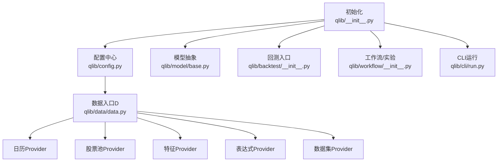
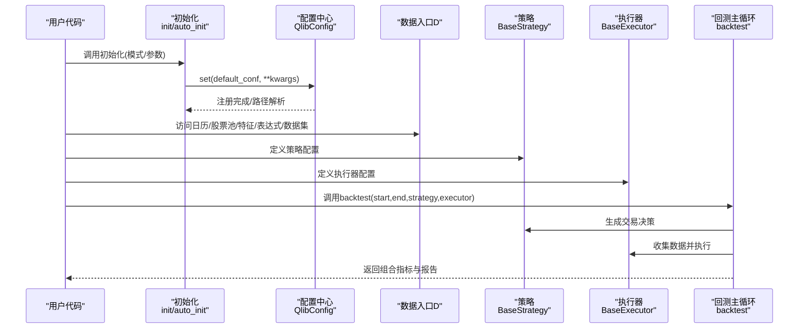
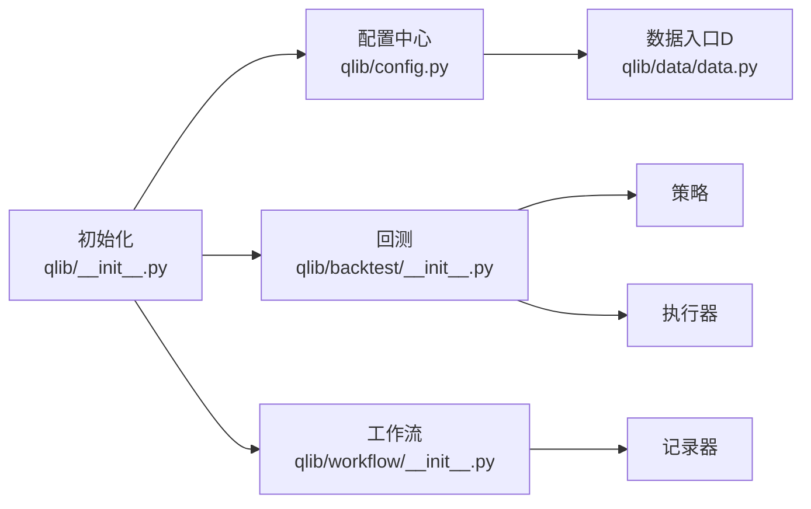

# API参考手册

<cite>
**本文引用的文件**
- [qlib/__init__.py](file://qlib/__init__.py)
- [qlib/config.py](file://qlib/config.py)
- [qlib/data/__init__.py](file://qlib/data/__init__.py)
- [qlib/data/data.py](file://qlib/data/data.py)
- [qlib/model/base.py](file://qlib/model/base.py)
- [qlib/backtest/__init__.py](file://qlib/backtest/__init__.py)
- [qlib/workflow/__init__.py](file://qlib/workflow/__init__.py)
- [qlib/cli/run.py](file://qlib/cli/run.py)
- [docs/reference/api.rst](file://docs/reference/api.rst)
- [docs/start/initialization.rst](file://docs/start/initialization.rst)
- [docs/start/getdata.rst](file://docs/start/getdata.rst)
- [docs/component/workflow.rst](file://docs/component/workflow.rst)
- [examples/benchmarks/LightGBM/workflow_config_lightgbm_Alpha158.yaml](file://examples/benchmarks/LightGBM/workflow_config_lightgbm_Alpha158.yaml)
- [examples/highfreq/workflow_config_High_Freq_Tree_Alpha158.yaml](file://examples/highfreq/workflow_config_High_Freq_Tree_Alpha158.yaml)
</cite>

## 目录
1. [简介](#简介)
2. [项目结构](#项目结构)
3. [核心组件](#核心组件)
4. [架构总览](#架构总览)
5. [详细组件分析](#详细组件分析)
6. [依赖关系分析](#依赖关系分析)
7. [性能考量](#性能考量)
8. [故障排查指南](#故障排查指南)
9. [结论](#结论)
10. [附录](#附录)

## 简介
本手册面向Qlib使用者与开发者，系统梳理并解释核心API，覆盖以下主题：
- 初始化接口：如何在不同模式（客户端/服务端）下完成初始化与配置加载
- 数据访问接口：通过统一的数据入口D与各类Provider访问日历、股票池、特征、表达式与数据集
- 模型训练接口：基于Dataset与Model抽象的训练流程，以及实验管理与对象存取
- 回测接口：策略与执行器的装配、回测主循环与数据采集
- 配置体系：YAML配置模板、参数继承与默认值、环境变量注入与模板渲染
- 版本兼容与迁移：版本重置、向后兼容策略与升级建议
- 搜索与索引：文档与API组织方式，便于快速定位所需API

本手册力求以循序渐进的方式呈现，既适合初学者快速上手，也为高级用户提供深入的技术细节。

## 项目结构
Qlib采用模块化分层设计：
- 初始化与配置：qlib/__init__.py与qlib/config.py负责全局初始化、模式切换、路径解析与注册
- 数据层：qlib/data提供统一入口D与Provider族（日历、股票池、特征、表达式、数据集）
- 模型层：qlib/model定义模型抽象与训练接口
- 回测层：qlib/backtest封装策略、执行器、账户、交易所与回测主循环
- 工作流与实验：qlib/workflow提供实验管理、记录器与对象存取
- 命令行：qlib/cli/run.py支持YAML模板渲染与工作流运行
- 文档与示例：docs与examples提供使用指南与配置样例

图表来源
- [qlib/__init__.py:25-85](file://qlib/__init__.py#L25-L85)
- [qlib/config.py:424-463](file://qlib/config.py#L424-L463)
- [qlib/data/data.py:65-110](file://qlib/data/data.py#L65-L110)
- [qlib/model/base.py:22-78](file://qlib/model/base.py#L22-L78)
- [qlib/backtest/__init__.py:217-276](file://qlib/backtest/__init__.py#L217-L276)
- [qlib/workflow/__init__.py:26-96](file://qlib/workflow/__init__.py#L26-L96)
- [qlib/cli/run.py:86-120](file://qlib/cli/run.py#L86-L120)

章节来源
- [qlib/__init__.py:25-85](file://qlib/__init__.py#L25-L85)
- [qlib/config.py:424-463](file://qlib/config.py#L424-L463)

## 核心组件
本节对关键API进行分类与要点说明，便于快速查阅。

- 初始化与配置
  - init(default_conf="client", **kwargs)：全局初始化，支持跳过已注册状态、清理内存缓存、挂载NFS等
  - init_from_yaml_conf(conf_path, **kwargs)：从YAML配置文件加载并合并参数
  - auto_init(**kwargs)：自动检测项目配置并加载，支持“引用型”与“原生型”配置
  - QlibConfig.set(default_conf, **kwargs)：按模式与区域设置配置，解析路径，检查Redis可用性
  - QlibConfig.register()：注册操作符、包装器与实验管理器，建立全局记录器

- 数据访问
  - D：统一数据入口，提供日历、股票池、特征、表达式、数据集的便捷访问
  - Provider族：CalendarProvider、InstrumentProvider、FeatureProvider、ExpressionProvider、DatasetProvider及其本地实现
  - 缓存机制：ExpressionCache、DatasetCache、DiskExpressionCache、DiskDatasetCache、SimpleDatasetCache等

- 模型训练
  - Model.fit(dataset, reweighter)：训练接口，由具体模型实现
  - Model.predict(dataset, segment="test")：预测接口
  - Trainer系列：Trainer、TrainerR、TrainerRM、DelayTrainerRM，支持线性训练、任务池与延迟训练

- 回测
  - backtest(start_time, end_time, strategy, executor, **kwargs)：装配策略与执行器并执行回测
  - get_strategy_executor(...)：创建账户、交易所与公共基础设施，并初始化策略与执行器
  - get_exchange(...)：根据参数或配置创建交易所实例

- 实验与工作流
  - R.start(...)：上下文管理器启动实验与记录器
  - R.save_objects/load_object/log_params/log_metrics/set_tags：对象存取与指标记录
  - R.list_experiments/list_recorders/search_records：实验与记录器查询

章节来源
- [qlib/__init__.py:25-85](file://qlib/__init__.py#L25-L85)
- [qlib/config.py:424-463](file://qlib/config.py#L424-L463)
- [qlib/data/__init__.py:8-66](file://qlib/data/__init__.py#L8-L66)
- [qlib/model/base.py:22-78](file://qlib/model/base.py#L22-L78)
- [qlib/backtest/__init__.py:217-276](file://qlib/backtest/__init__.py#L217-L276)
- [qlib/workflow/__init__.py:26-96](file://qlib/workflow/__init__.py#L26-L96)

## 架构总览
下图展示了从初始化到回测与实验的关键交互：

图表来源
- [qlib/__init__.py:25-85](file://qlib/__init__.py#L25-L85)
- [qlib/config.py:424-463](file://qlib/config.py#L424-L463)
- [qlib/backtest/__init__.py:217-276](file://qlib/backtest/__init__.py#L217-L276)

## 详细组件分析

### 初始化与配置API
- init(default_conf="client", **kwargs)
  - 功能：全局初始化，支持跳过已注册状态、清理内存缓存、挂载NFS等
  - 关键参数：default_conf（"client"/"server"）、clear_mem_cache、skip_if_reg
  - 行为：调用C.set设置模式与区域；解析provider_uri与mount_path；注册缓存与日志；打印数据路径
  - 异常：NFS挂载失败、URI格式不合法、未识别配置项警告
  - 参考路径：[qlib/__init__.py:25-85](file://qlib/__init__.py#L25-L85)

- init_from_yaml_conf(conf_path, **kwargs)
  - 功能：从YAML加载配置并合并额外参数
  - 行为：读取YAML，更新kwargs，调用init
  - 参考路径：[qlib/__init__.py:188-202](file://qlib/__init__.py#L188-L202)

- auto_init(**kwargs)
  - 功能：自动发现项目配置并加载，支持“引用型”与“原生型”
  - 行为：查找config.yaml，解析conf_type（origin/ref），合并更新参数后初始化
  - 参考路径：[qlib/__init__.py:243-317](file://qlib/__init__.py#L243-L317)

- QlibConfig.set(default_conf, **kwargs)
  - 功能：按模式与区域设置配置，解析路径，检查Redis可用性
  - 关键行为：set_mode、set_region、resolve_path、日志配置、缓存可用性检查
  - 参考路径：[qlib/config.py:424-463](file://qlib/config.py#L424-L463)

- QlibConfig.register()
  - 功能：注册操作符、包装器与实验管理器，建立全局记录器
  - 参考路径：[qlib/config.py:483-502](file://qlib/config.py#L483-L502)

- YAML配置与模板渲染（CLI）
  - 功能：支持Jinja2模板渲染，从环境变量注入占位符
  - 参考路径：[qlib/cli/run.py:86-120](file://qlib/cli/run.py#L86-L120)

章节来源
- [qlib/__init__.py:25-85](file://qlib/__init__.py#L25-L85)
- [qlib/__init__.py:188-202](file://qlib/__init__.py#L188-L202)
- [qlib/__init__.py:243-317](file://qlib/__init__.py#L243-L317)
- [qlib/config.py:424-463](file://qlib/config.py#L424-L463)
- [qlib/config.py:483-502](file://qlib/config.py#L483-L502)
- [qlib/cli/run.py:86-120](file://qlib/cli/run.py#L86-L120)

### 数据访问API
- 统一入口D
  - 提供日历、股票池、特征、表达式、数据集的便捷访问
  - 参考路径：[qlib/data/__init__.py:8-66](file://qlib/data/__init__.py#L8-L66)

- Provider基类与实现
  - CalendarProvider：日历提供者，支持future标志与边界裁剪
  - InstrumentProvider：股票池提供者，支持过滤管道与时间跨度
  - FeatureProvider：单特征提供者
  - ExpressionProvider：表达式提供者，支持表达式实例缓存与语法校验
  - DatasetProvider：数据集提供者，支持多核并行计算与缓存转换
  - 参考路径：
    - [qlib/data/data.py:65-110](file://qlib/data/data.py#L65-L110)
    - [qlib/data/data.py:199-286](file://qlib/data/data.py#L199-L286)
    - [qlib/data/data.py:307-335](file://qlib/data/data.py#L307-L335)
    - [qlib/data/data.py:383-443](file://qlib/data/data.py#L383-L443)
    - [qlib/data/data.py:446-598](file://qlib/data/data.py#L446-L598)

- 缓存机制
  - ExpressionCache/DatasetCache：抽象缓存接口
  - DiskExpressionCache/DiskDatasetCache/SimpleDatasetCache：磁盘与简单缓存实现
  - 参考路径：
    - [qlib/data/data.py:365-428](file://qlib/data/data.py#L365-L428)
    - [qlib/data/data.py:1179-1212](file://qlib/data/data.py#L1179-L1212)

- 高频数据配置
  - HIGH_FREQ_CONFIG：高频数据默认配置（provider_uri、缓存、区域）
  - 参考路径：[qlib/config.py:289-294](file://qlib/config.py#L289-L294)

章节来源
- [qlib/data/__init__.py:8-66](file://qlib/data/__init__.py#L8-L66)
- [qlib/data/data.py:65-110](file://qlib/data/data.py#L65-L110)
- [qlib/data/data.py:199-286](file://qlib/data/data.py#L199-L286)
- [qlib/data/data.py:307-335](file://qlib/data/data.py#L307-L335)
- [qlib/data/data.py:383-443](file://qlib/data/data.py#L383-L443)
- [qlib/data/data.py:446-598](file://qlib/data/data.py#L446-L598)
- [qlib/data/data.py:365-428](file://qlib/data/data.py#L365-L428)
- [qlib/data/data.py:1179-1212](file://qlib/data/data.py#L1179-L1212)
- [qlib/config.py:289-294](file://qlib/config.py#L289-L294)

### 模型训练API
- Model抽象
  - fit(dataset, reweighter)：训练接口（需实现）
  - predict(dataset, segment="test")：预测接口（需实现）
  - 参考路径：[qlib/model/base.py:22-78](file://qlib/model/base.py#L22-L78)

- 训练器Trainer系列
  - Trainer：抽象训练器，定义train与end_train
  - TrainerR：基于记录器的线性训练器
  - TrainerRM：基于任务池的训练器
  - DelayTrainerRM：延迟训练器（先准备，后结束时训练）
  - 关键点：支持子进程调用以释放内存、标签状态管理、任务池集成
  - 参考路径：[qlib/model/trainer.py:131-522](file://qlib/model/trainer.py#L131-L522)

章节来源
- [qlib/model/base.py:22-78](file://qlib/model/base.py#L22-L78)
- [qlib/model/trainer.py:131-522](file://qlib/model/trainer.py#L131-L522)

### 回测API
- backtest(start_time, end_time, strategy, executor, **kwargs)
  - 功能：装配策略与执行器并执行回测，返回组合指标与报告
  - 参数：起止时间、策略配置、执行器配置、基准、账户、交换参数、仓位类型
  - 返回：组合指标字典与指标DataFrame字典
  - 参考路径：[qlib/backtest/__init__.py:217-276](file://qlib/backtest/__init__.py#L217-L276)

- get_strategy_executor(...)
  - 功能：创建账户、交易所与公共基础设施，初始化策略与执行器
  - 参考路径：[qlib/backtest/__init__.py:177-214](file://qlib/backtest/__init__.py#L177-L214)

- get_exchange(...)
  - 功能：根据参数或配置创建交易所实例，支持交易费用、滑点阈值、成交价等
  - 参考路径：[qlib/backtest/__init__.py:33-111](file://qlib/backtest/__init__.py#L33-L111)

- 回测主循环与数据采集
  - backtest_loop/collect_data_loop：回测主循环与数据采集生成器
  - 参考路径：[qlib/backtest/backtest.py:85-109](file://qlib/backtest/backtest.py#L85-L109)

章节来源
- [qlib/backtest/__init__.py:217-276](file://qlib/backtest/__init__.py#L217-L276)
- [qlib/backtest/__init__.py:177-214](file://qlib/backtest/__init__.py#L177-L214)
- [qlib/backtest/__init__.py:33-111](file://qlib/backtest/__init__.py#L33-L111)
- [qlib/backtest/backtest.py:85-109](file://qlib/backtest/backtest.py#L85-L109)

### 实验与工作流API
- R.start(...)
  - 功能：上下文管理器启动实验与记录器，支持恢复
  - 行为：开始实验、捕获异常并标记失败、结束实验
  - 参考路径：[qlib/workflow/__init__.py:37-96](file://qlib/workflow/__init__.py#L37-L96)

- 对象存取与指标记录
  - save_objects/load_object：保存/加载Python对象
  - log_params/log_metrics/set_tags：记录参数、指标与标签
  - 参考路径：[qlib/workflow/__init__.py:481-653](file://qlib/workflow/__init__.py#L481-L653)

- 实验与记录器管理
  - list_experiments/list_recorders/search_records：查询实验与记录器
  - get_exp/delete_exp/get_recorder/delete_recorder：获取/删除实验与记录器
  - 参考路径：[qlib/workflow/__init__.py:165-480](file://qlib/workflow/__init__.py#L165-L480)

章节来源
- [qlib/workflow/__init__.py:37-96](file://qlib/workflow/__init__.py#L37-L96)
- [qlib/workflow/__init__.py:481-653](file://qlib/workflow/__init__.py#L481-L653)
- [qlib/workflow/__init__.py:165-480](file://qlib/workflow/__init__.py#L165-L480)

### 配置体系与YAML模板
- YAML配置模板
  - 支持class/module_path/kwargs三元组定义组件
  - 支持模板渲染与环境变量注入
  - 参考路径：
    - [docs/component/workflow.rst:130-170](file://docs/component/workflow.rst#L130-L170)
    - [qlib/cli/run.py:86-120](file://qlib/cli/run.py#L86-L120)

- 项目级配置
  - conf_type: origin/ref；支持共享配置引用与增量更新
  - 参考路径：[qlib/__init__.py:259-283](file://qlib/__init__.py#L259-L283)

- 示例配置
  - LightGBM/Alpha158、高频树/Alpha158等示例YAML
  - 参考路径：
    - [examples/benchmarks/LightGBM/workflow_config_lightgbm_Alpha158.yaml](file://examples/benchmarks/LightGBM/workflow_config_lightgbm_Alpha158.yaml)
    - [examples/highfreq/workflow_config_High_Freq_Tree_Alpha158.yaml](file://examples/highfreq/workflow_config_High_Freq_Tree_Alpha158.yaml)

章节来源
- [docs/component/workflow.rst:130-170](file://docs/component/workflow.rst#L130-L170)
- [qlib/cli/run.py:86-120](file://qlib/cli/run.py#L86-L120)
- [qlib/__init__.py:259-283](file://qlib/__init__.py#L259-L283)
- [examples/benchmarks/LightGBM/workflow_config_lightgbm_Alpha158.yaml](file://examples/benchmarks/LightGBM/workflow_config_lightgbm_Alpha158.yaml)
- [examples/highfreq/workflow_config_High_Freq_Tree_Alpha158.yaml](file://examples/highfreq/workflow_config_High_Freq_Tree_Alpha158.yaml)

### 版本兼容与迁移指南
- 版本重置
  - QlibConfig.reset_qlib_version：允许连接旧服务器或强制版本一致
  - 参考路径：[qlib/config.py:504-514](file://qlib/config.py#L504-L514)

- 升级建议
  - 使用auto_init自动加载项目配置，避免硬编码路径
  - 在YAML中通过ref引用共享配置，减少重复维护
  - 利用R.start上下文管理器确保实验生命周期完整

章节来源
- [qlib/config.py:504-514](file://qlib/config.py#L504-L514)

## 依赖关系分析
- 模块耦合
  - 初始化依赖配置中心与数据缓存
  - 数据层依赖配置中心的路径解析与缓存策略
  - 回测依赖策略与执行器的可配置初始化
  - 实验管理依赖记录器与实验管理器

图表来源
- [qlib/__init__.py:25-85](file://qlib/__init__.py#L25-L85)
- [qlib/config.py:424-463](file://qlib/config.py#L424-L463)
- [qlib/backtest/__init__.py:217-276](file://qlib/backtest/__init__.py#L217-L276)
- [qlib/workflow/__init__.py:26-96](file://qlib/workflow/__init__.py#L26-L96)

## 性能考量
- 并行与内核
  - kernels参数支持整数或回调函数，按频率动态决定进程数
  - maxtasksperchild与joblib_backend影响子进程复用与后端选择
  - 参考路径：[qlib/config.py:127-169](file://qlib/config.py#L127-L169)

- 缓存策略
  - 表达式缓存与数据集缓存可显著降低重复计算
  - Redis依赖：当Redis不可用时会自动降级为禁用缓存
  - 参考路径：[qlib/config.py:465-482](file://qlib/config.py#L465-L482)

- 内存管理
  - TrainerR支持子进程调用以强制释放内存
  - 参考路径：[qlib/model/trainer.py:268-271](file://qlib/model/trainer.py#L268-L271)

## 故障排查指南
- 初始化问题
  - NFS挂载失败：检查provider_uri格式、权限与auto_mount设置
  - 参考路径：[qlib/__init__.py:87-186](file://qlib/__init__.py#L87-L186)

- 配置问题
  - 未识别配置项：日志会警告未识别键
  - Redis不可用：缓存自动降级，日志提示
  - 参考路径：[qlib/config.py:458-482](file://qlib/config.py#L458-L482)

- 数据访问问题
  - 日历/股票池边界：future标志与locate_index裁剪
  - 表达式语法错误：抛出异常并记录字段与变量名
  - 参考路径：
    - [qlib/data/data.py:111-152](file://qlib/data/data.py#L111-L152)
    - [qlib/data/data.py:392-407](file://qlib/data/data.py#L392-L407)

- 回测问题
  - 交易费用与滑点：通过get_exchange参数控制
  - 执行器完成条件：finished()与collect_data_loop循环
  - 参考路径：
    - [qlib/backtest/__init__.py:33-111](file://qlib/backtest/__init__.py#L33-L111)
    - [qlib/backtest/backtest.py:85-109](file://qlib/backtest/backtest.py#L85-L109)

章节来源
- [qlib/__init__.py:87-186](file://qlib/__init__.py#L87-L186)
- [qlib/config.py:458-482](file://qlib/config.py#L458-L482)
- [qlib/data/data.py:111-152](file://qlib/data/data.py#L111-L152)
- [qlib/data/data.py:392-407](file://qlib/data/data.py#L392-L407)
- [qlib/backtest/__init__.py:33-111](file://qlib/backtest/__init__.py#L33-L111)
- [qlib/backtest/backtest.py:85-109](file://qlib/backtest/backtest.py#L85-L109)

## 结论
本手册系统梳理了Qlib的核心API，从初始化、数据访问、模型训练到回测与实验管理，均提供了参数说明、行为描述与异常处理指引。配合YAML配置模板与CLI渲染能力，用户可以快速搭建研究工作流。建议在生产环境中：
- 使用auto_init自动加载项目配置
- 通过ref引用共享配置，减少重复维护
- 合理设置kernels与缓存策略以平衡性能与资源
- 利用R.start确保实验生命周期完整，便于追踪与复现

## 附录
- 快速索引
  - 初始化：[qlib/__init__.py:25-85](file://qlib/__init__.py#L25-L85)
  - 配置中心：[qlib/config.py:424-463](file://qlib/config.py#L424-L463)
  - 数据入口D：[qlib/data/__init__.py:8-66](file://qlib/data/__init__.py#L8-L66)
  - Provider族：[qlib/data/data.py:65-110](file://qlib/data/data.py#L65-L110)
  - 模型抽象：[qlib/model/base.py:22-78](file://qlib/model/base.py#L22-L78)
  - 训练器：[qlib/model/trainer.py:131-522](file://qlib/model/trainer.py#L131-L522)
  - 回测入口：[qlib/backtest/__init__.py:217-276](file://qlib/backtest/__init__.py#L217-L276)
  - 实验管理：[qlib/workflow/__init__.py:26-96](file://qlib/workflow/__init__.py#L26-L96)