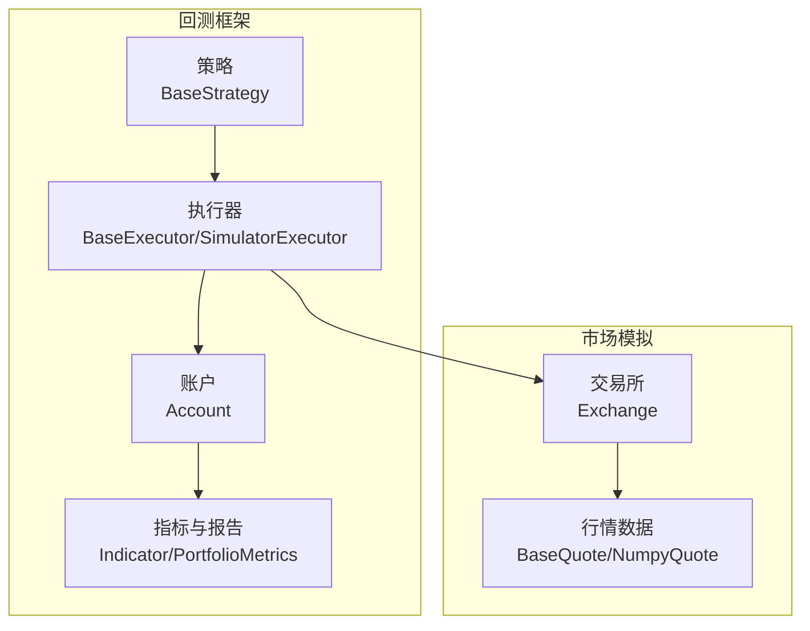
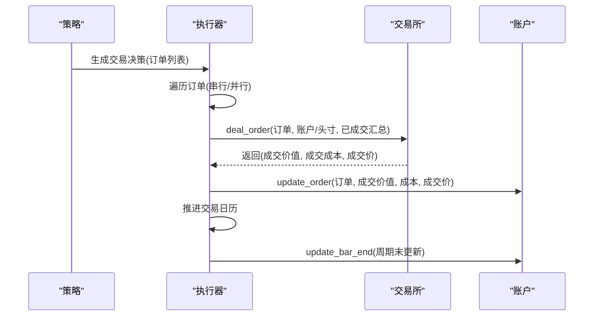
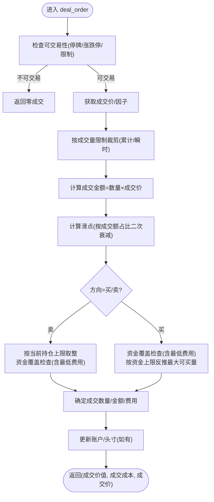
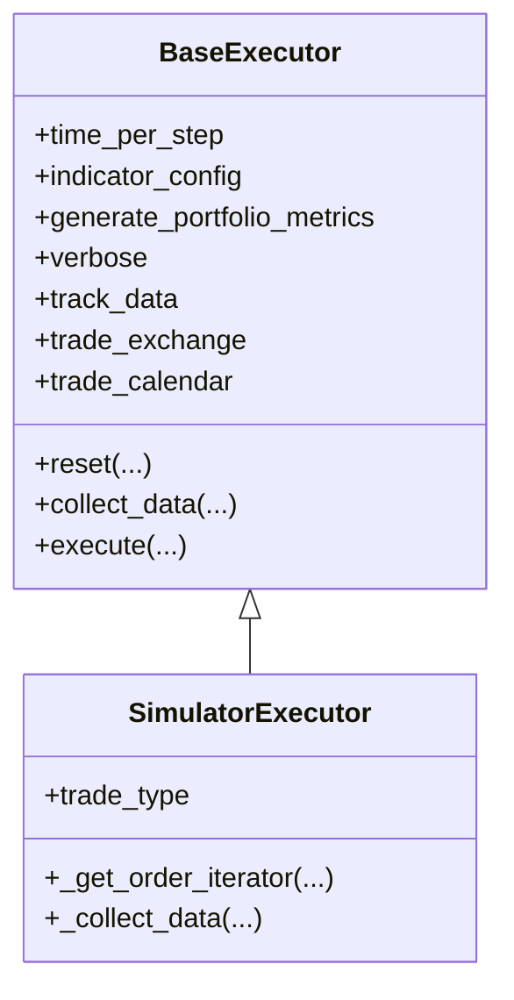
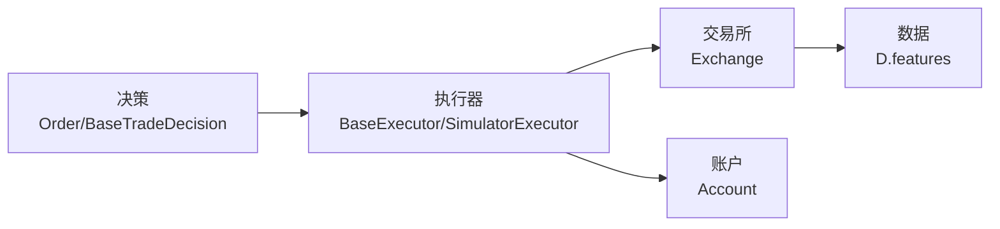

# 交易所模拟API

<cite>
**本文档引用的文件**
- [exchange.py](file://qlib/backtest/exchange.py)
- [executor.py](file://qlib/backtest/executor.py)
- [decision.py](file://qlib/backtest/decision.py)
- [account.py](file://qlib/backtest/account.py)
- [__init__.py](file://qlib/backtest/__init__.py)
- [test_qlib_simulator.py](file://tests/rl/test_qlib_simulator.py)
- [strategy.py](file://qlib/rl/order_execution/strategy.py)
</cite>

## 目录
1. [简介](#简介)
2. [项目结构](#项目结构)
3. [核心组件](#核心组件)
4. [架构总览](#架构总览)
5. [详细组件分析](#详细组件分析)
6. [依赖分析](#依赖分析)
7. [性能考虑](#性能考虑)
8. [故障排查指南](#故障排查指南)
9. [结论](#结论)
10. [附录：使用示例与应用场景](#附录使用示例与应用场景)

## 简介
本文件为 Qlib 交易所模拟 API 的完整参考文档，聚焦于 Exchange 类（市场模拟）与 Executor 类（执行器）的接口与工作机制，涵盖市场规则（涨跌停板、成交量限制）、价格与成交计算、交易费用与市场冲击、撮合与执行流程，并提供可复用的使用示例与最佳实践。

## 项目结构
围绕交易所模拟的核心模块如下：
- 交易所模拟：Exchange 类负责市场数据查询、价格/成交量/涨跌停限制、交易费用与滑点、以及订单成交计算
- 执行器：BaseExecutor/SimulatorExecutor 负责在每个交易步长内收集决策并驱动 Exchange 完成实际成交
- 订单模型：Order/TradeRange 等定义交易指令与时间范围约束
- 账户与指标：Account 维护资金与头寸，生成交易指标与组合指标

图表来源
- [executor.py:22-120](file://qlib/backtest/executor.py#L22-L120)
- [exchange.py:28-200](file://qlib/backtest/exchange.py#L28-L200)
- [account.py:71-130](file://qlib/backtest/account.py#L71-L130)

章节来源
- [__init__.py:33-111](file://qlib/backtest/__init__.py#L33-L111)
- [executor.py:22-120](file://qlib/backtest/executor.py#L22-L120)
- [exchange.py:28-200](file://qlib/backtest/exchange.py#L28-L200)
- [account.py:71-130](file://qlib/backtest/account.py#L71-L130)

## 核心组件
- Exchange（市场模拟）
  - 市场数据来源：通过 D.features 获取多字段行情，支持按时间区间、品种集合过滤
  - 涨跌停板：支持固定阈值或表达式动态判定
  - 成交量限制：支持“当日累计”和“实时瞬时”两类，可分别针对买卖设置
  - 成交价：支持统一或买卖不同价格源，自动回退到收盘价
  - 交易费用：开仓/平仓费率、最低收费；支持市场冲击（滑点）按成交额占比二次方衰减
  - 最小交易单位：因子换算与向下取整到交易单位
- Executor（执行器）
  - 支持串行/并行两种执行模式
  - 在每个交易步长内遍历订单，调用 Exchange.deal_order 完成成交
  - 更新账户与指标，推进交易日历

章节来源
- [exchange.py:38-196](file://qlib/backtest/exchange.py#L38-L196)
- [exchange.py:417-514](file://qlib/backtest/exchange.py#L417-L514)
- [exchange.py:859-952](file://qlib/backtest/exchange.py#L859-L952)
- [executor.py:513-629](file://qlib/backtest/executor.py#L513-L629)

## 架构总览
下图展示从策略到执行器再到交易所的交互流程，以及账户与指标更新路径：

图表来源
- [executor.py:590-629](file://qlib/backtest/executor.py#L590-L629)
- [exchange.py:421-463](file://qlib/backtest/exchange.py#L421-L463)
- [account.py:203-224](file://qlib/backtest/account.py#L203-L224)

章节来源
- [executor.py:183-303](file://qlib/backtest/executor.py#L183-L303)
- [exchange.py:421-514](file://qlib/backtest/exchange.py#L421-L514)
- [account.py:338-403](file://qlib/backtest/account.py#L338-L403)

## 详细组件分析

### Exchange 类（市场模拟）
- 初始化参数要点
  - 频率、起止时间、标的池、成交价源、订阅字段
  - 涨跌停阈值：支持浮点阈值或表达式元组；默认从全局配置读取
  - 成交量限制：字典或二元组，支持“累计”和“瞬时”，分别聚合取最小
  - 交易费用：开仓/平仓费率、最低费用、市场冲击系数
  - 交易单位：中国 A 股常用 100 股为单位，通过因子换算后取整
- 关键方法
  - check_stock_limit/check_stock_suspended/is_stock_tradable：检查是否可交易（停牌/涨停/跌停/限制）
  - get_deal_price/get_close/get_volume/get_factor：按时间窗口查询字段
  - deal_order：主成交入口，内部完成成交量裁剪、价格优先/时间优先（隐含在数据顺序中）、资金与头寸约束、滑点与手续费计算
  - round_amount_by_trade_unit/get_amount_of_trade_unit：按交易单位取整
- 内部机制
  - 限价/限量双重裁剪：先按“当日累计/瞬时”裁剪，再按资金与头寸裁剪
  - 滑点建模：按成交额占时段总成交额的比例平方进行二次衰减
  - 因子与交易单位：当未启用“按调整价交易”时，使用因子将“调整手数”转换为“实际手数”

图表来源
- [exchange.py:421-463](file://qlib/backtest/exchange.py#L421-L463)
- [exchange.py:859-952](file://qlib/backtest/exchange.py#L859-L952)

章节来源
- [exchange.py:38-196](file://qlib/backtest/exchange.py#L38-L196)
- [exchange.py:338-514](file://qlib/backtest/exchange.py#L338-L514)
- [exchange.py:786-832](file://qlib/backtest/exchange.py#L786-L832)
- [exchange.py:834-858](file://qlib/backtest/exchange.py#L834-L858)
- [exchange.py:859-952](file://qlib/backtest/exchange.py#L859-L952)

### Executor 类（执行器）
- 基类 BaseExecutor
  - 管理交易日历、指标配置、组合指标开关、跟踪数据开关
  - 提供 collect_data 生成器，负责推进日历、更新账户与指标、嵌套执行器的协调
- SimulatorExecutor
  - 支持串行/并行两种执行顺序
  - 每步遍历订单，调用 Exchange.deal_order 并累积已成交汇总
  - 可打印每笔成交明细（verbose）

图表来源
- [executor.py:22-120](file://qlib/backtest/executor.py#L22-L120)
- [executor.py:513-629](file://qlib/backtest/executor.py#L513-L629)

章节来源
- [executor.py:22-120](file://qlib/backtest/executor.py#L22-L120)
- [executor.py:513-629](file://qlib/backtest/executor.py#L513-L629)

### 订单与时间范围
- Order
  - 字段：股票代码、数量、方向、时间窗、成交结果（成交数量、因子）
  - 辅助属性：amount_delta/deal_amount_delta/sign/key_by_day/key
- TradeRange/IdxTradeRange/TradeRangeByTime
  - 用于限定策略在某步内的可交易时间窗，支持索引范围或时间段

章节来源
- [decision.py:36-147](file://qlib/backtest/decision.py#L36-L147)
- [decision.py:206-300](file://qlib/backtest/decision.py#L206-L300)

### 账户与指标
- Account
  - 维护初始现金、当前头寸、累计费用/成交额/收益、历史头寸快照
  - update_order/update_bar_end/update_current_position/update_portfolio_metrics/update_indicator
- 指标
  - 支持价格优势（PA）、成交完成率（FFR）等指标的聚合与记录

章节来源
- [account.py:71-130](file://qlib/backtest/account.py#L71-L130)
- [account.py:180-224](file://qlib/backtest/account.py#L180-L224)
- [account.py:338-403](file://qlib/backtest/account.py#L338-L403)

## 依赖分析
- Exchange 依赖
  - 数据层：D.features 查询行情字段
  - 时间工具：TradeCalendarManager（由 Executor 注入）
  - 日志：get_module_logger
- Executor 依赖
  - 策略：BaseStrategy
  - 交易所：Exchange
  - 账户：Account
  - 指标：Indicator/PortfolioMetrics

图表来源
- [executor.py:15-20](file://qlib/backtest/executor.py#L15-L20)
- [exchange.py:20-25](file://qlib/backtest/exchange.py#L20-L25)
- [account.py:12-16](file://qlib/backtest/account.py#L12-L16)

章节来源
- [executor.py:15-20](file://qlib/backtest/executor.py#L15-L20)
- [exchange.py:20-25](file://qlib/backtest/exchange.py#L20-L25)
- [account.py:12-16](file://qlib/backtest/account.py#L12-L16)

## 性能考虑
- 数据访问优化
  - 使用高性能行情容器（NumpyQuote）缓存字段，减少重复查询
  - 仅订阅必要字段，避免冗余列加载
- 执行顺序
  - 并行模式需确保买卖不冲突（排序后先买后卖），以避免资金不足导致的错误
- 指标计算
  - 指标聚合在周期末集中计算，避免高频重复计算

## 故障排查指南
- 订单无法成交
  - 检查是否停牌/涨跌停/成交量限制/资金不足
  - 查看日志中的裁剪提示（按成交量/资金/涨跌停）
- 成交价异常
  - 若指定的成交价字段为空，系统会回退到收盘价
- 滑点过大
  - 调整 impact_cost 参数；注意其按成交额占比二次衰减
- 交易单位取整问题
  - 当启用“按调整价交易”时，交易单位机制被禁用；请确认 trade_unit 设置

章节来源
- [exchange.py:509-514](file://qlib/backtest/exchange.py#L509-L514)
- [exchange.py:886-952](file://qlib/backtest/exchange.py#L886-L952)
- [executor.py:613-628](file://qlib/backtest/executor.py#L613-L628)

## 结论
Qlib 的交易所模拟 API 将市场规则、交易费用与滑点、成交量限制与涨跌停板等真实市场要素纳入回测，配合灵活的执行器与账户指标体系，能够支撑从分钟级到日频的多场景回测与策略评估。通过合理配置参数与遵循撮合与风控逻辑，用户可以获得更贴近实盘的评估结果。

## 附录：使用示例与应用场景
以下示例展示了如何配置与使用交易所模拟 API，涵盖市场仿真、执行成本分析与流动性测试等典型场景。

- 市场仿真（基础）
  - 创建 Exchange 实例，设置频率、起止时间、标的池、成交价源、涨跌停阈值与交易费用
  - 使用 get_exchange 快速初始化
  - 示例路径：[get_exchange:33-111](file://qlib/backtest/__init__.py#L33-L111)

- 执行成本分析
  - 配置 open_cost/close_cost/min_cost，观察不同费率对策略收益的影响
  - 示例路径：[exchange.py:107-114](file://qlib/backtest/exchange.py#L107-L114)，[exchange.py:859-952](file://qlib/backtest/exchange.py#L859-L952)

- 流动性测试（成交量限制）
  - 设置 volume_threshold，分别对“全部/买入/卖出”施加“累计/瞬时”限制
  - 示例路径：[exchange.py:78-106](file://qlib/backtest/exchange.py#L78-L106)，[exchange.py:786-832](file://qlib/backtest/exchange.py#L786-L832)

- 涨跌停板与暂停交易
  - 使用 limit_threshold 或表达式控制涨跌停；check_stock_limit/check_stock_suspended 判断可交易性
  - 示例路径：[exchange.py:338-416](file://qlib/backtest/exchange.py#L338-L416)

- 串行/并行执行对比
  - 通过 SimulatorExecutor 的 trade_type 控制执行顺序，验证不同执行模式对收益与成本的影响
  - 示例路径：[executor.py:528-588](file://qlib/backtest/executor.py#L528-L588)

- 订单簿匹配与价格/时间优先
  - 通过数据顺序体现“价格优先/时间优先”的隐式匹配；并行模式下建议先买后卖以避免资金不足
  - 示例路径：[executor.py:576-588](file://qlib/backtest/executor.py#L576-L588)，[exchange.py:859-952](file://qlib/backtest/exchange.py#L859-L952)

- 与 RL 订单执行场景结合
  - 在 RL 场景中，可通过 get_exchange 与 get_strategy_executor 组合，使用相同的 Exchange 配置进行策略训练与回测
  - 示例路径：[__init__.py:177-214](file://qlib/backtest/__init__.py#L177-L214)，[test_qlib_simulator.py:71-107](file://tests/rl/test_qlib_simulator.py#L71-L107)