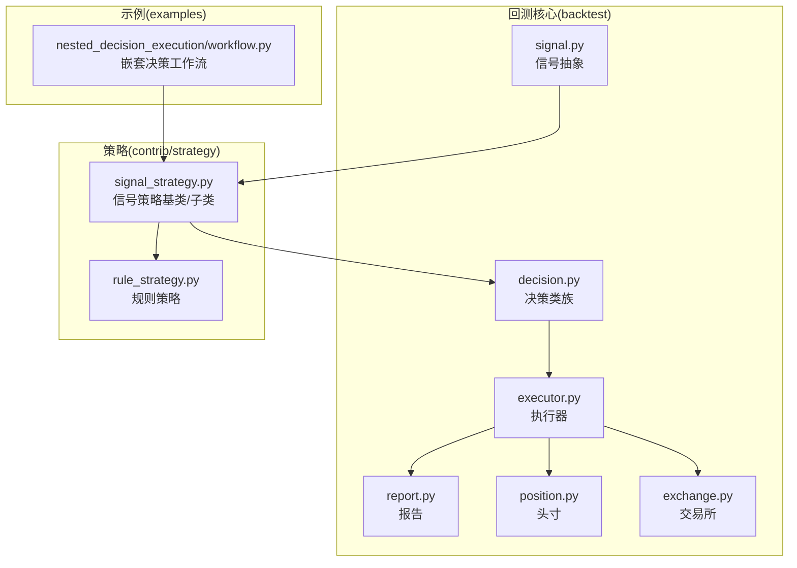
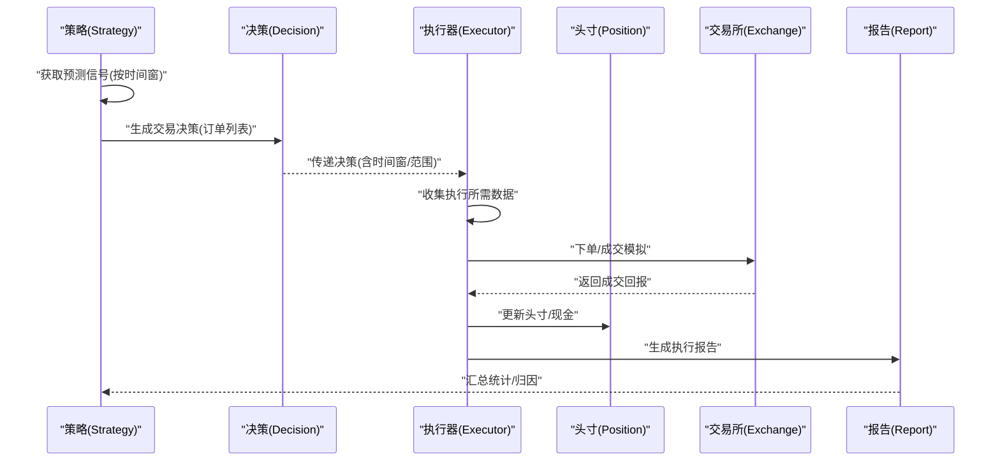
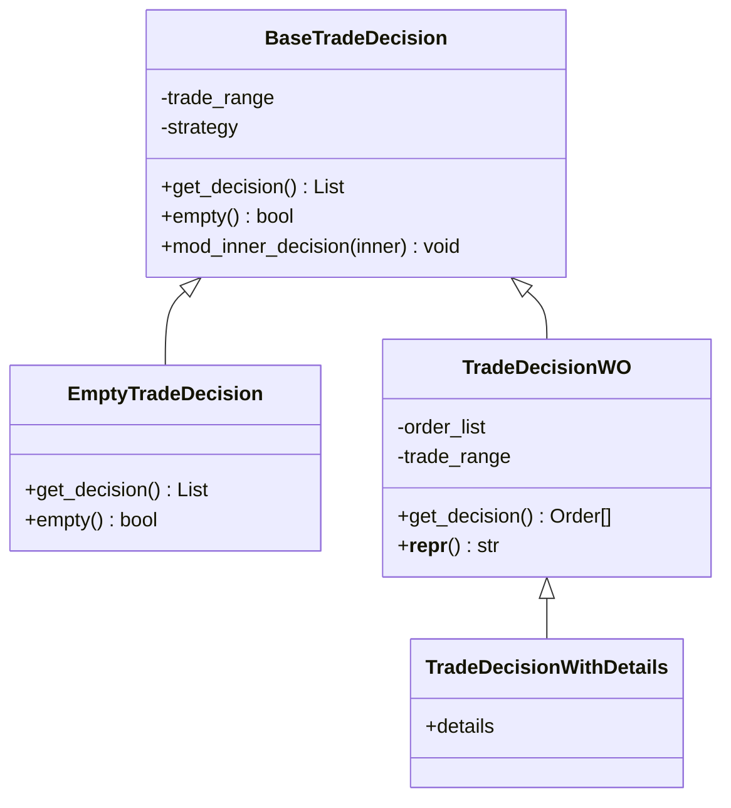
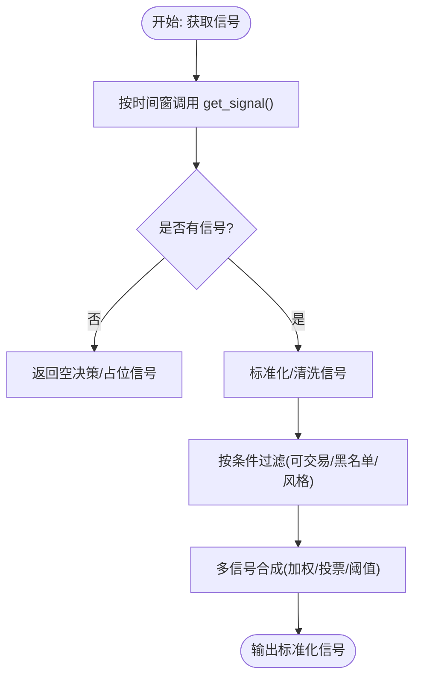
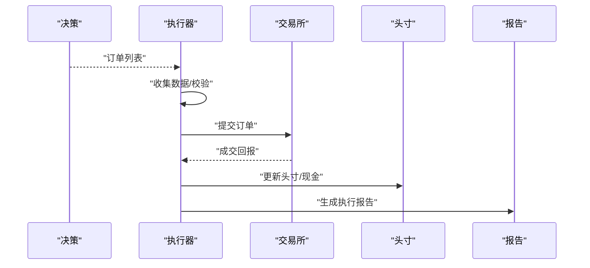
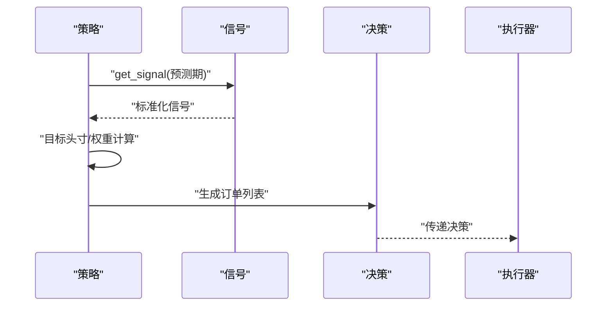
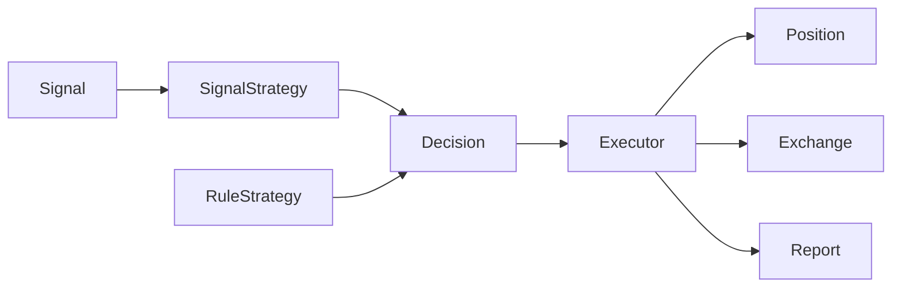

# 决策执行API

<cite>
**本文引用的文件**
- [decision.py](file://qlib/backtest/decision.py)
- [signal.py](file://qlib/backtest/signal.py)
- [executor.py](file://qlib/backtest/executor.py)
- [report.py](file://qlib/backtest/report.py)
- [signal_strategy.py](file://qlib/contrib/strategy/signal_strategy.py)
- [rule_strategy.py](file://qlib/contrib/strategy/rule_strategy.py)
- [position.py](file://qlib/backtest/position.py)
- [exchange.py](file://qlib/backtest/exchange.py)
- [backtest.py](file://qlib/backtest/backtest.py)
- [workflow.py](file://examples/nested_decision_execution/workflow.py)
</cite>

## 目录
1. [引言](#引言)
2. [项目结构](#项目结构)
3. [核心组件](#核心组件)
4. [架构总览](#架构总览)
5. [详细组件分析](#详细组件分析)
6. [依赖关系分析](#依赖关系分析)
7. [性能考量](#性能考量)
8. [故障排查指南](#故障排查指南)
9. [结论](#结论)
10. [附录：使用示例与最佳实践](#附录使用示例与最佳实践)

## 引言
本文件面向Qlib的“决策执行API”，系统性梳理并说明以下内容：
- Decision类族的接口与职责：交易决策生成、订单创建、订单修改与合并策略。
- Signal类的信号处理接口：信号标准化、信号过滤、信号合成与缓存。
- 决策执行流程：从信号接收、决策制定、订单生成到订单执行与报告产出。
- 决策参数配置：交易量控制、止损止盈设置、仓位管理等。
- 实际应用示例：信号回测、订单管理、执行优化等场景。

## 项目结构
围绕决策执行API的关键模块分布如下：
- backtest层：决策定义（decision）、信号抽象（signal）、执行器（executor）、报告（report）、位置与交易所（position、exchange）。
- contrib/strategy层：基于信号的策略实现（signal_strategy、rule_strategy），用于将信号转换为交易决策。
- examples层：嵌套决策执行的工作流示例，展示多层策略与订单链路。

**图示来源**
- [decision.py](file://qlib/backtest/decision.py)
- [signal.py](file://qlib/backtest/signal.py)
- [executor.py](file://qlib/backtest/executor.py)
- [report.py](file://qlib/backtest/report.py)
- [signal_strategy.py](file://qlib/contrib/strategy/signal_strategy.py)
- [rule_strategy.py](file://qlib/contrib/strategy/rule_strategy.py)
- [position.py](file://qlib/backtest/position.py)
- [exchange.py](file://qlib/backtest/exchange.py)
- [workflow.py](file://examples/nested_decision_execution/workflow.py)

**章节来源**
- [decision.py](file://qlib/backtest/decision.py)
- [signal.py](file://qlib/backtest/signal.py)
- [executor.py](file://qlib/backtest/executor.py)
- [report.py](file://qlib/backtest/report.py)
- [signal_strategy.py](file://qlib/contrib/strategy/signal_strategy.py)
- [rule_strategy.py](file://qlib/contrib/strategy/rule_strategy.py)
- [position.py](file://qlib/backtest/position.py)
- [exchange.py](file://qlib/backtest/exchange.py)
- [workflow.py](file://examples/nested_decision_execution/workflow.py)

## 核心组件
- 决策类族（Decision）
  - 基类：定义通用接口与行为，支持时间窗裁剪、内层决策修改钩子等。
  - 具体实现：空决策、仅含订单的决策、带详情的决策等。
- 信号类（Signal）
  - 抽象接口：按时间窗口返回标准化信号（Series或DataFrame）。
  - 缓存实现：避免重复计算；模型信号实现：从模型输出派生信号。
- 执行器（Executor）
  - 将决策转化为实际订单执行，负责数据收集、订单迭代、执行状态更新与报告生成。
- 策略（Strategy）
  - 信号策略：将信号映射为目标头寸/权重，再生成订单列表。
  - 规则策略：在已有外层决策基础上进行过滤、调整与二次决策。

**章节来源**
- [decision.py](file://qlib/backtest/decision.py)
- [signal.py](file://qlib/backtest/signal.py)
- [executor.py](file://qlib/backtest/executor.py)
- [signal_strategy.py](file://qlib/contrib/strategy/signal_strategy.py)
- [rule_strategy.py](file://qlib/contrib/strategy/rule_strategy.py)

## 架构总览
下图展示了从信号到订单再到执行与报告的端到端流程。

**图示来源**
- [signal_strategy.py](file://qlib/contrib/strategy/signal_strategy.py)
- [decision.py](file://qlib/backtest/decision.py)
- [executor.py](file://qlib/backtest/executor.py)
- [report.py](file://qlib/backtest/report.py)
- [position.py](file://qlib/backtest/position.py)
- [exchange.py](file://qlib/backtest/exchange.py)

## 详细组件分析

### Decision类族：交易决策生成与订单管理
- 职责边界
  - 统一抽象：以“订单列表”为核心输出，支持时间窗裁剪、空决策、带详情决策等变体。
  - 可组合：通过“内层决策修改”钩子，允许上层策略对下层生成的决策进行传播式调整。
- 关键接口与要点
  - get_decision：返回订单列表。
  - empty：判断是否为空决策。
  - mod_inner_decision：在生成后对内层决策进行就地修改（如传播交易时间窗）。
  - TradeDecisionWO/TradeDecisionWithDetails：分别承载纯订单与带执行细节的决策对象。
- 订单创建与修改
  - 订单由策略生成，通常来自“目标头寸/权重→订单”的映射过程。
  - 支持在上层策略中对订单进行过滤、调整（如按可交易性、单位、方向等）。

**图示来源**
- [decision.py](file://qlib/backtest/decision.py)

**章节来源**
- [decision.py](file://qlib/backtest/decision.py)

### Signal类：信号标准化、过滤与合成
- 接口约定
  - get_signal(start_time, end_time)：返回标准化信号（Series或DataFrame），索引为股票标识，列包含信号值。
- 实现要点
  - SignalWCache：带缓存的信号包装，避免重复计算。
  - ModelSignal：从模型输出派生信号，常用于策略输入。
  - create_signal_from：工厂方法，便于从不同来源构造信号对象。
- 信号处理流程
  - 输入：时间窗[start_time, end_time]。
  - 输出：标准化信号，供策略进行排序、筛选、合成等。
  - 过滤：可结合可交易性、行业/风格暴露等约束进行过滤。
  - 合成：多信号加权/投票/阈值融合，形成最终信号。

**图示来源**
- [signal.py](file://qlib/backtest/signal.py)

**章节来源**
- [signal.py](file://qlib/backtest/signal.py)

### 执行器与订单执行：从决策到成交
- 执行器职责
  - 数据收集：根据决策中的时间窗与标的集合，准备执行所需行情/成本数据。
  - 订单迭代：遍历决策中的订单，按顺序/并行策略提交。
  - 成交模拟：对接交易所，返回成交回报（价格、数量、费用等）。
  - 头寸更新：维护Position与现金账户，确保风控与一致性。
  - 报告生成：汇总执行结果，支持归因分析（如成交量加权平均成交价、滑点、冲击成本等）。
- 关键流程
  - retrieve/collect：从决策中提取订单并收集数据。
  - execute：执行单个或批量订单。
  - update：更新内部状态（如已成交数量、累计费用）。
  - report：生成执行报告。

**图示来源**
- [executor.py](file://qlib/backtest/executor.py)
- [report.py](file://qlib/backtest/report.py)
- [position.py](file://qlib/backtest/position.py)
- [exchange.py](file://qlib/backtest/exchange.py)

**章节来源**
- [executor.py](file://qlib/backtest/executor.py)
- [report.py](file://qlib/backtest/report.py)
- [position.py](file://qlib/backtest/position.py)
- [exchange.py](file://qlib/backtest/exchange.py)

### 策略：从信号到订单的映射
- 信号策略（SignalStrategy）
  - 从Signal获取预测信号，映射到目标头寸/权重，再生成订单列表。
  - 支持仅考虑可交易标的、按时间窗切片、多信号合成等。
- 规则策略（RuleStrategy）
  - 在已有外层决策基础上进行二次加工：过滤不可交易标的、按信号强度调整下单金额、叠加额外规则（如最大下单比例、滑点上限等）。

**图示来源**
- [signal_strategy.py](file://qlib/contrib/strategy/signal_strategy.py)
- [rule_strategy.py](file://qlib/contrib/strategy/rule_strategy.py)

**章节来源**
- [signal_strategy.py](file://qlib/contrib/strategy/signal_strategy.py)
- [rule_strategy.py](file://qlib/contrib/strategy/rule_strategy.py)

## 依赖关系分析
- 模块耦合
  - 策略依赖Signal与Exchange，生成Decision。
  - 执行器依赖Decision、Exchange、Position、Report，完成闭环。
- 可能的循环依赖
  - 当前设计通过接口解耦，未见直接循环导入。
- 外部依赖
  - 时间窗管理、交易日历、行情数据、成本模型等由外部组件提供。

**图示来源**
- [signal.py](file://qlib/backtest/signal.py)
- [signal_strategy.py](file://qlib/contrib/strategy/signal_strategy.py)
- [rule_strategy.py](file://qlib/contrib/strategy/rule_strategy.py)
- [decision.py](file://qlib/backtest/decision.py)
- [executor.py](file://qlib/backtest/executor.py)
- [position.py](file://qlib/backtest/position.py)
- [exchange.py](file://qlib/backtest/exchange.py)
- [report.py](file://qlib/backtest/report.py)

**章节来源**
- [signal.py](file://qlib/backtest/signal.py)
- [signal_strategy.py](file://qlib/contrib/strategy/signal_strategy.py)
- [rule_strategy.py](file://qlib/contrib/strategy/rule_strategy.py)
- [decision.py](file://qlib/backtest/decision.py)
- [executor.py](file://qlib/backtest/executor.py)
- [position.py](file://qlib/backtest/position.py)
- [exchange.py](file://qlib/backtest/exchange.py)
- [report.py](file://qlib/backtest/report.py)

## 性能考量
- 信号缓存：使用SignalWCache减少重复计算，建议在长周期回测中启用。
- 订单批量化：执行器支持批量提交与并行处理，降低I/O开销。
- 时间窗裁剪：通过trade_range限制执行区间，避免无效数据访问。
- 头寸更新去抖：在高频场景下合并连续订单，减少频繁调仓带来的摩擦成本。

## 故障排查指南
- 空决策
  - 现象：get_decision返回空列表或empty为True。
  - 排查：确认Signal是否返回有效信号；检查时间窗是否正确；确认策略是否过滤了所有标的。
- 订单无法成交
  - 现象：订单部分/全部未成交。
  - 排查：检查可交易性、价格档位、流动性；核对滑点/冲击成本设置；确认执行器参数（如最大下单比例）。
- 报告异常
  - 现象：成交均价/滑点/冲击成本异常。
  - 排查：确认价格选择（如成交价）与聚合方式；检查时间窗裁剪逻辑；核对成交回报字段映射。

**章节来源**
- [decision.py](file://qlib/backtest/decision.py)
- [executor.py](file://qlib/backtest/executor.py)
- [report.py](file://qlib/backtest/report.py)

## 结论
Qlib的决策执行API通过清晰的接口分层与可组合的设计，实现了从信号到订单再到执行与报告的完整闭环。Signal提供标准化输入，Strategy负责决策制定，Decision统一输出，Executor完成执行与报告。通过缓存、批量化与时间窗裁剪等机制，可在保证准确性的同时提升执行效率。建议在实际应用中结合业务需求合理配置参数，并利用报告进行持续优化。

## 附录：使用示例与最佳实践
- 信号回测
  - 使用SignalWCache缓存信号，避免重复计算；在策略中按时间窗切片获取信号；通过Report查看收益与风险指标。
- 订单管理
  - 在RuleStrategy中加入可交易性过滤与最大下单比例限制；对高频场景采用批量下单与合并策略。
- 执行优化
  - 配置成交价聚合方式（如TWAP/VWAP）；设置滑点/冲击成本模型；启用时间窗裁剪减少无效执行。
- 嵌套决策执行
  - 参考示例工作流，构建多层策略（如外层规则策略+内层信号策略），通过mod_inner_decision实现跨层影响。

**章节来源**
- [workflow.py](file://examples/nested_decision_execution/workflow.py)
- [signal_strategy.py](file://qlib/contrib/strategy/signal_strategy.py)
- [rule_strategy.py](file://qlib/contrib/strategy/rule_strategy.py)
- [report.py](file://qlib/backtest/report.py)