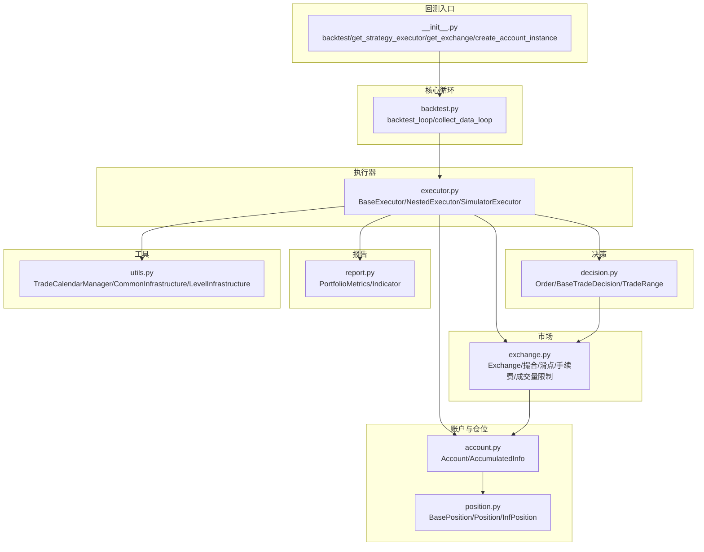
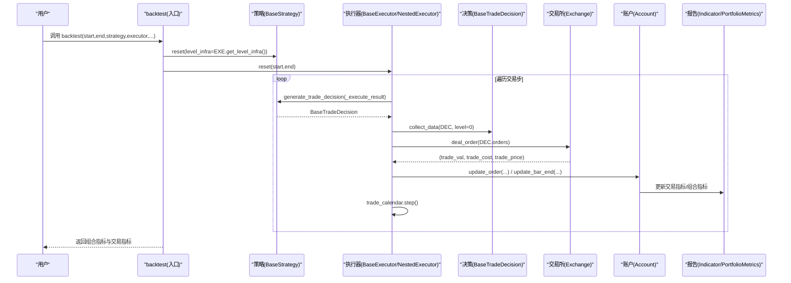
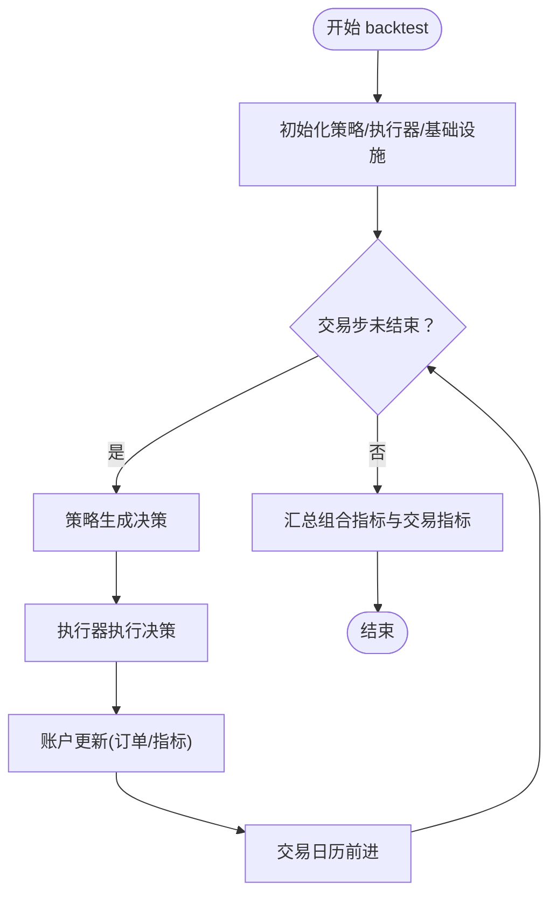
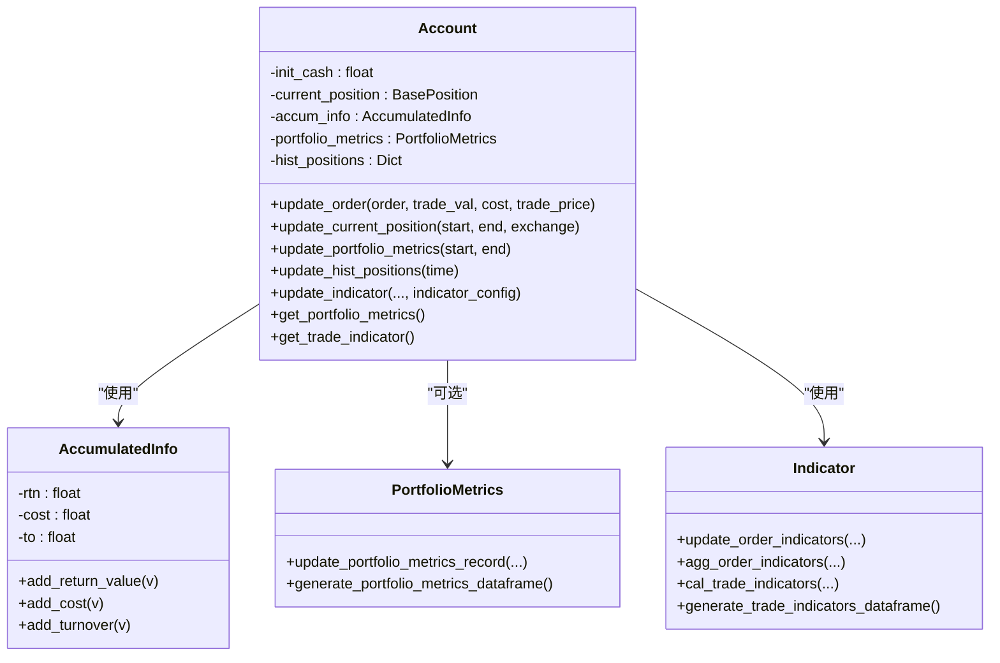
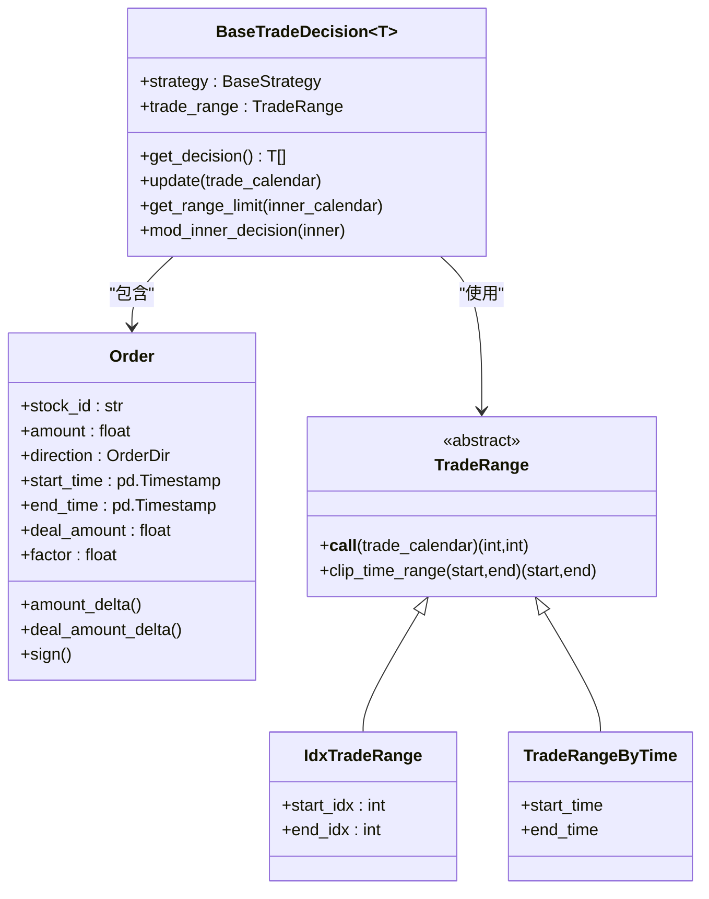
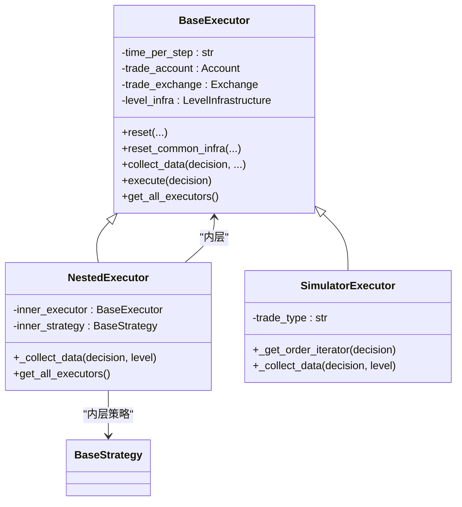
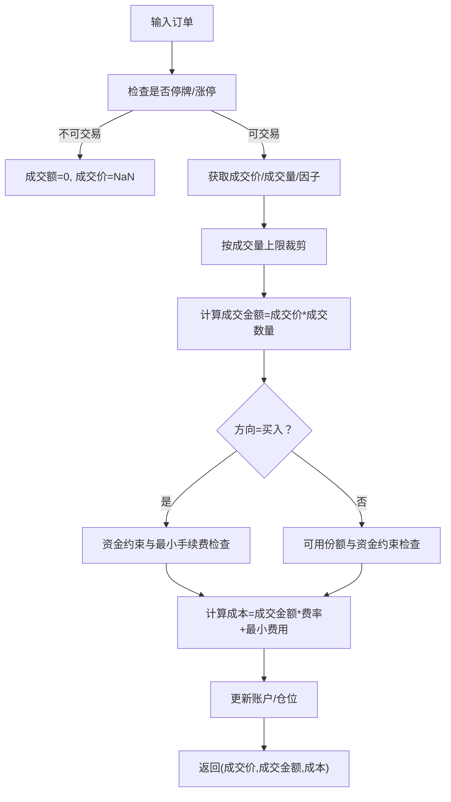
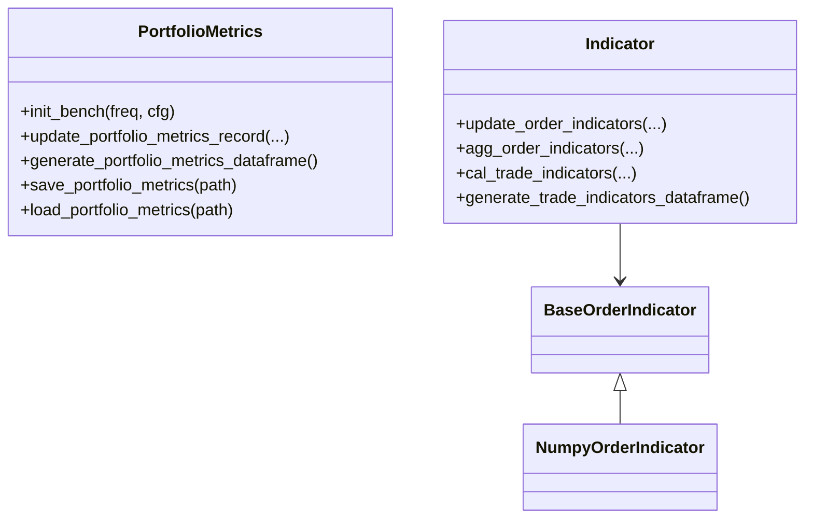
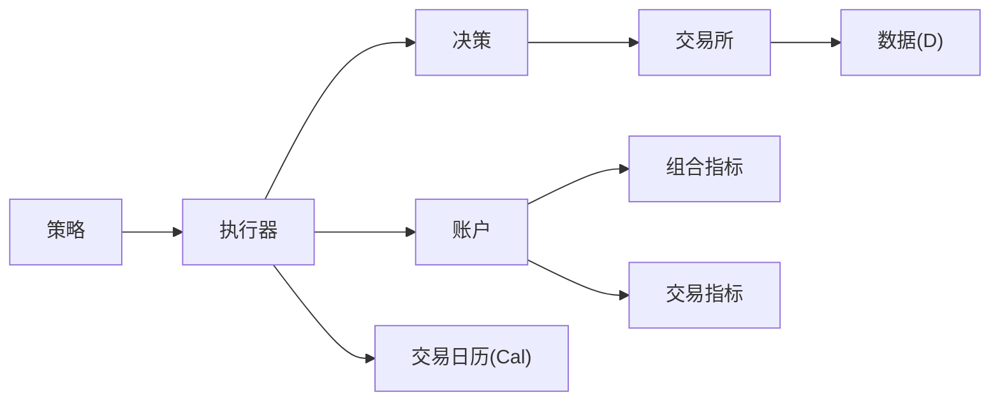

# 回测API

<cite>
**本文引用的文件**
- [qlib/backtest/__init__.py](file://qlib/backtest/__init__.py)
- [qlib/backtest/backtest.py](file://qlib/backtest/backtest.py)
- [qlib/backtest/account.py](file://qlib/backtest/account.py)
- [qlib/backtest/decision.py](file://qlib/backtest/decision.py)
- [qlib/backtest/exchange.py](file://qlib/backtest/exchange.py)
- [qlib/backtest/executor.py](file://qlib/backtest/executor.py)
- [qlib/backtest/report.py](file://qlib/backtest/report.py)
- [qlib/backtest/position.py](file://qlib/backtest/position.py)
- [qlib/backtest/utils.py](file://qlib/backtest/utils.py)
</cite>

## 目录
1. [简介](#简介)
2. [项目结构](#项目结构)
3. [核心组件](#核心组件)
4. [架构总览](#架构总览)
5. [详细组件分析](#详细组件分析)
6. [依赖分析](#依赖分析)
7. [性能考虑](#性能考虑)
8. [故障排查指南](#故障排查指南)
9. [结论](#结论)
10. [附录：使用示例与最佳实践](#附录使用示例与最佳实践)

## 简介
本文件为 Qlib 回测子系统的完整 API 参考与实践指南，覆盖回测引擎、账户、决策、执行器、交易所与报告等模块。内容面向策略工程师与量化研究者，既提供高层概念说明，也给出代码级关系图与调用流程图，帮助快速理解并正确使用回测 API。

## 项目结构
回测相关代码集中在 qlib/backtest 目录，核心文件职责如下：
- __init__.py：对外暴露 backtest、get_strategy_executor、get_exchange、create_account_instance 等高层入口，并组织回测生命周期。
- backtest.py：定义回测主循环 backtest_loop 与数据收集循环 collect_data_loop。
- account.py：账户与资金管理、历史仓位、组合指标与交易指标的维护。
- decision.py：订单与交易决策抽象，支持时间窗裁剪、范围限制、内外层决策传播。
- exchange.py：市场规则、价格发现、成交量限制、滑点与手续费、订单撮合。
- executor.py：执行器抽象，含模拟执行器与嵌套执行器，负责按步推进、执行决策、更新账户与指标。
- report.py：组合指标（PortfolioMetrics）与交易指标（Indicator）的计算与导出。
- position.py：仓位模型（Position/InfPosition），支持现金结算延迟、权重更新、计数统计。
- utils.py：交易日历、基础设施共享（CommonInfrastructure/LevelInfrastructure）等通用工具。

图表来源
- [qlib/backtest/__init__.py:216-350](file://qlib/backtest/__init__.py#L216-L350)
- [qlib/backtest/backtest.py:25-110](file://qlib/backtest/backtest.py#L25-L110)
- [qlib/backtest/executor.py:22-629](file://qlib/backtest/executor.py#L22-L629)
- [qlib/backtest/decision.py:30-597](file://qlib/backtest/decision.py#L30-L597)
- [qlib/backtest/exchange.py:28-959](file://qlib/backtest/exchange.py#L28-L959)
- [qlib/backtest/account.py:71-418](file://qlib/backtest/account.py#L71-L418)
- [qlib/backtest/position.py:16-566](file://qlib/backtest/position.py#L16-L566)
- [qlib/backtest/report.py:22-652](file://qlib/backtest/report.py#L22-L652)
- [qlib/backtest/utils.py:23-291](file://qlib/backtest/utils.py#L23-L291)

章节来源
- [qlib/backtest/__init__.py:1-350](file://qlib/backtest/__init__.py#L1-L350)
- [qlib/backtest/backtest.py:1-110](file://qlib/backtest/backtest.py#L1-L110)
- [qlib/backtest/executor.py:1-629](file://qlib/backtest/executor.py#L1-L629)
- [qlib/backtest/decision.py:1-597](file://qlib/backtest/decision.py#L1-L597)
- [qlib/backtest/exchange.py:1-959](file://qlib/backtest/exchange.py#L1-L959)
- [qlib/backtest/account.py:1-418](file://qlib/backtest/account.py#L1-L418)
- [qlib/backtest/position.py:1-566](file://qlib/backtest/position.py#L1-L566)
- [qlib/backtest/report.py:1-652](file://qlib/backtest/report.py#L1-L652)
- [qlib/backtest/utils.py:1-291](file://qlib/backtest/utils.py#L1-L291)

## 核心组件
- 回测引擎（Backtest）
  - 入口函数 backtest：初始化策略与执行器，驱动回测主循环，返回组合指标与交易指标。
  - 数据收集接口 collect_data：用于强化学习训练的数据采集生成器。
  - 决策树格式化 format_decisions：将收集到的决策按层级频率组织为树形结构。
- 账户（Account）
  - 资金管理：初始现金、订单成交后的现金流变化、累计成本与成交额。
  - 持仓管理：通过 Position/InfPosition 维护股票数量、均价、权重、持有天数。
  - 报告指标：组合指标（PortfolioMetrics）与交易指标（Indicator）。
- 决策（Decision）
  - 订单（Order）：买卖方向、委托量、成交结果、因子（adjustment factor）。
  - 交易决策（BaseTradeDecision）：策略生成的决策，支持时间窗限制、内外层传播。
- 执行器（Executor）
  - 基类 BaseExecutor：统一的执行框架，推进交易日历、执行决策、更新账户与指标。
  - 嵌套执行器 NestedExecutor：在更高频环境中递归执行下层策略与执行器。
  - 模拟执行器 SimulatorExecutor：串行/并行执行订单，进行真实市场规则下的撮合。
- 交易所（Exchange）
  - 市场规则：涨跌停检查、停牌检查、成交量限制、交易单位与因子。
  - 成交计算：按买/卖价、成交量、滑点与手续费计算成交金额与成本。
  - 订单生成：根据目标头寸生成买卖订单序列。
- 报告（Report）
  - 组合指标（PortfolioMetrics）：账户价值、收益、成本、换手、基准比较等。
  - 交易指标（Indicator）：满成率（FFR）、价格优势（PA）、胜率（POS）、交易量与价值等。

章节来源
- [qlib/backtest/__init__.py:216-350](file://qlib/backtest/__init__.py#L216-L350)
- [qlib/backtest/backtest.py:25-110](file://qlib/backtest/backtest.py#L25-L110)
- [qlib/backtest/account.py:71-418](file://qlib/backtest/account.py#L71-L418)
- [qlib/backtest/decision.py:30-597](file://qlib/backtest/decision.py#L30-L597)
- [qlib/backtest/executor.py:22-629](file://qlib/backtest/executor.py#L22-L629)
- [qlib/backtest/exchange.py:28-959](file://qlib/backtest/exchange.py#L28-L959)
- [qlib/backtest/report.py:22-652](file://qlib/backtest/report.py#L22-L652)

## 架构总览
回测从高层策略与执行器开始，逐层推进交易日历，生成交易决策，由执行器驱动交易所撮合，更新账户与指标，最终汇总为组合与交易报告。

图表来源
- [qlib/backtest/__init__.py:216-277](file://qlib/backtest/__init__.py#L216-L277)
- [qlib/backtest/backtest.py:52-110](file://qlib/backtest/backtest.py#L52-L110)
- [qlib/backtest/executor.py:227-303](file://qlib/backtest/executor.py#L227-L303)
- [qlib/backtest/exchange.py:421-463](file://qlib/backtest/exchange.py#L421-L463)
- [qlib/backtest/account.py:203-403](file://qlib/backtest/account.py#L203-L403)

## 详细组件分析

### 回测引擎（Backtest）
- 功能要点
  - 初始化策略与执行器，注入公共基础设施（账户、交易所）。
  - 主循环推进交易日历，生成决策，执行并更新账户与指标。
  - 支持数据采集生成器，便于强化学习训练。
- 关键接口
  - backtest：返回组合指标与交易指标。
  - collect_data：生成器，按步产出交易决策。
  - format_decisions：将决策按层级频率组织为树形结构。
- 复杂度与性能
  - 时间复杂度近似 O(T×N)，T 为交易步数，N 为每步订单数。
  - 通过生成器与分层执行降低内存峰值。

图表来源
- [qlib/backtest/backtest.py:25-110](file://qlib/backtest/backtest.py#L25-L110)
- [qlib/backtest/__init__.py:216-277](file://qlib/backtest/__init__.py#L216-L277)

章节来源
- [qlib/backtest/__init__.py:216-350](file://qlib/backtest/__init__.py#L216-L350)
- [qlib/backtest/backtest.py:25-110](file://qlib/backtest/backtest.py#L25-L110)

### 账户（Account）
- 职责
  - 管理初始现金与历史仓位快照。
  - 维护累计回报、成本、换手，用于组合指标计算。
  - 在每个交易步末尾更新当前仓位价格、持有天数，并生成交易指标。
- 关键方法
  - update_order：根据成交结果更新账户状态。
  - update_current_position/update_portfolio_metrics/update_hist_positions：每日更新与快照。
  - update_indicator/cal_trade_indicators：交易指标聚合与计算。
  - get_portfolio_metrics/get_trade_indicator：输出报告所需数据。
- 设计要点
  - 不同层级执行器共享仓位对象，但账户实例可浅拷贝以隔离指标。
  - 支持基准比较（Benchmark）与多频指标。

图表来源
- [qlib/backtest/account.py:35-418](file://qlib/backtest/account.py#L35-L418)
- [qlib/backtest/report.py:22-248](file://qlib/backtest/report.py#L22-L248)

章节来源
- [qlib/backtest/account.py:71-418](file://qlib/backtest/account.py#L71-L418)
- [qlib/backtest/report.py:22-248](file://qlib/backtest/report.py#L22-L248)

### 决策（Decision）
- 订单（Order）
  - 字段：股票代码、委托量、起止时间、方向（买卖）、成交数量、因子。
  - 辅助属性：amount_delta/deal_amount_delta/sign/key_by_day/key 等。
- 交易决策（BaseTradeDecision）
  - get_decision：返回具体决策（通常为订单列表）。
  - update/get_range_limit：支持内外层日历联动与时间窗裁剪。
  - mod_inner_decision：向内层传播外层决策的时间窗限制。
- 时间窗（TradeRange）
  - IdxTradeRange：按索引区间限制。
  - TradeRangeByTime：按日内时间窗口限制。

图表来源
- [qlib/backtest/decision.py:30-597](file://qlib/backtest/decision.py#L30-L597)

章节来源
- [qlib/backtest/decision.py:30-597](file://qlib/backtest/decision.py#L30-L597)

### 执行器（Executor）
- 基类 BaseExecutor
  - reset/reset_common_infra：重置交易日历与基础设施。
  - collect_data/_collect_data：统一的执行流程，推进日历并更新账户。
  - get_all_executors：返回自身或包含内层执行器的列表。
- 嵌套执行器 NestedExecutor
  - 在每步内部创建子执行器与子策略，按内外层日历对齐执行。
  - 支持跳过空决策、强制对齐时间窗。
- 模拟执行器 SimulatorExecutor
  - 串行/并行执行订单，按交易所规则计算成交金额与成本。
  - 维护日内已成交数量，处理成交量限制与资金约束。

图表来源
- [qlib/backtest/executor.py:22-629](file://qlib/backtest/executor.py#L22-L629)

章节来源
- [qlib/backtest/executor.py:22-629](file://qlib/backtest/executor.py#L22-L629)

### 交易所（Exchange）
- 市场规则
  - 涨跌停检查、停牌检查、交易单位与因子处理。
  - 成交价选择（买/卖价表达式）、成交量限制（累计/即时）。
- 成交计算
  - _calc_trade_info_by_order：计算成交金额、成本与成交价，考虑滑点与手续费。
  - _clip_amount_by_volume：按成交量上限裁剪订单。
- 订单生成
  - generate_order_for_target_amount_position：根据目标头寸生成买卖订单序列。
  - generate_amount_position_from_weight_position：按权重分配资金生成目标头寸。

图表来源
- [qlib/backtest/exchange.py:421-959](file://qlib/backtest/exchange.py#L421-L959)

章节来源
- [qlib/backtest/exchange.py:28-959](file://qlib/backtest/exchange.py#L28-L959)

### 报告（Report）
- 组合指标（PortfolioMetrics）
  - 每日记录账户价值、收益、成本、换手、基准收益等。
  - 支持加载/保存 CSV 文件。
- 交易指标（Indicator）
  - 单订单指标：目标量、成交量、成交价、成本、方向。
  - 总体指标：满成率（FFR）、价格优势（PA）、胜率（POS）、总交易量与价值、订单数。
  - 支持加权聚合（均值/按量/按值加权）。

图表来源
- [qlib/backtest/report.py:22-652](file://qlib/backtest/report.py#L22-L652)

章节来源
- [qlib/backtest/report.py:22-652](file://qlib/backtest/report.py#L22-L652)

### 仓位（Position）
- Position：常规仓位，维护股票数量、均价、权重、持有天数、现金与结算延迟。
- InfPosition：无限资金与份额，用于随机或极端场景测试。
- 支持结算机制（cash 延迟结算）与权重更新。

章节来源
- [qlib/backtest/position.py:16-566](file://qlib/backtest/position.py#L16-L566)

## 依赖分析
- 组件耦合
  - 执行器依赖策略、交易所与账户；账户依赖仓位与报告；决策依赖交易所。
  - 嵌套执行器在不同层级共享交易日历与基础设施。
- 外部依赖
  - 日历系统（Cal）用于定位时间索引与交易步长。
  - 数据访问（D）用于获取行情字段（$close/$volume/$factor/$change 等）。
- 循环依赖
  - 通过延迟导入与运行时初始化避免循环导入。

图表来源
- [qlib/backtest/executor.py:15-20](file://qlib/backtest/executor.py#L15-L20)
- [qlib/backtest/exchange.py:20-26](file://qlib/backtest/exchange.py#L20-L26)
- [qlib/backtest/utils.py:20-21](file://qlib/backtest/utils.py#L20-L21)

章节来源
- [qlib/backtest/executor.py:1-629](file://qlib/backtest/executor.py#L1-L629)
- [qlib/backtest/exchange.py:1-959](file://qlib/backtest/exchange.py#L1-L959)
- [qlib/backtest/utils.py:1-291](file://qlib/backtest/utils.py#L1-L291)

## 性能考虑
- 数据访问
  - 使用 quote_cls（默认 NumpyQuote）缓存行情，减少重复查询开销。
  - 仅加载必要字段（$close/$factor/$change/$volume 等），避免冗余。
- 订单执行
  - SimulatorExecutor 的串行/并行模式影响吞吐；并行需保证方向一致性。
  - 成交前先裁剪成交量，再做金额与资金约束检查，减少无效计算。
- 指标计算
  - Indicator 支持按量/按值加权聚合，避免全量遍历带来的性能问题。
- 内存占用
  - 通过生成器与分层执行降低峰值内存；历史仓位快照按需深拷贝。

## 故障排查指南
- 订单无法成交
  - 检查停牌/涨跌停：check_stock_suspended/check_stock_limit。
  - 检查成交量上限与资金约束：_clip_amount_by_volume/_get_buy_amount_by_cash_limit。
- 成交价异常
  - 当成交价缺失时自动回退至收盘价；确认 deal_price 表达式与字段存在。
- 指标为空或不一致
  - 确认交易步推进顺序与账户更新时机；核对基准配置与频率匹配。
- 嵌套执行器范围限制
  - 使用 get_range_limit 并确保内外层日历对齐；必要时启用强制对齐。

章节来源
- [qlib/backtest/exchange.py:338-959](file://qlib/backtest/exchange.py#L338-L959)
- [qlib/backtest/executor.py:227-303](file://qlib/backtest/executor.py#L227-L303)
- [qlib/backtest/account.py:338-403](file://qlib/backtest/account.py#L338-L403)

## 结论
Qlib 回测 API 以清晰的分层设计实现了从策略到执行再到报告的完整闭环。通过抽象化的决策、执行器与交易所，用户可以灵活构建单层或多层嵌套的回测环境；通过账户与报告模块，能够获得全面的组合与交易层面指标。建议在实际应用中结合交易日历、成交量限制与滑点设置，确保回测结果贴近真实市场。

## 附录：使用示例与最佳实践
- 策略回测
  - 使用 backtest(start, end, strategy, executor, ...) 进行端到端回测。
  - 通过 indicator_config 控制交易指标展示与聚合方式。
- 参数优化
  - 将策略超参封装为可配置对象，配合 collect_data 生成训练样本，供 RL 或网格搜索使用。
- 结果分析
  - 通过 get_portfolio_metrics 获取组合指标 DataFrame，结合 get_trade_indicator 分析执行质量。
  - 使用 PortfolioMetrics.save/load 进行结果持久化与对比。

章节来源
- [qlib/backtest/__init__.py:216-350](file://qlib/backtest/__init__.py#L216-L350)
- [qlib/backtest/report.py:217-247](file://qlib/backtest/report.py#L217-L247)