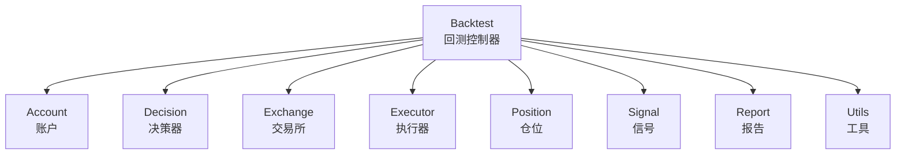
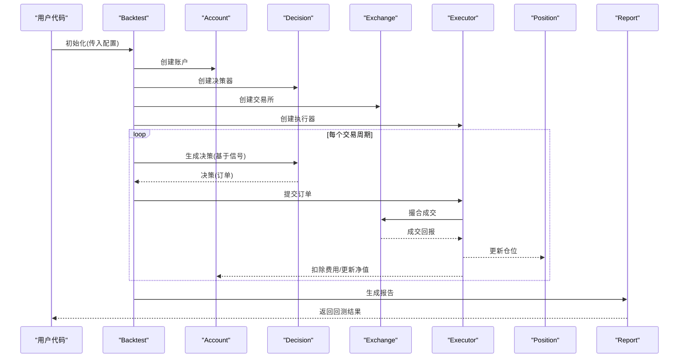
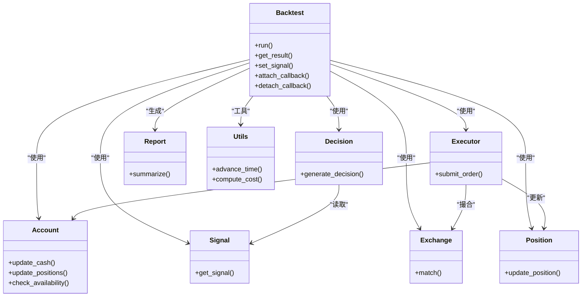

# 回测引擎API

<cite>
**本文引用的文件**
- [backtest.py](file://qlib/backtest/backtest.py)
- [account.py](file://qlib/backtest/account.py)
- [decision.py](file://qlib/backtest/decision.py)
- [exchange.py](file://qlib/backtest/exchange.py)
- [executor.py](file://qlib/backtest/executor.py)
- [position.py](file://qlib/backtest/position.py)
- [report.py](file://qlib/backtest/report.py)
- [signal.py](file://qlib/backtest/signal.py)
- [utils.py](file://qlib/backtest/utils.py)
</cite>

## 目录
1. [简介](#简介)
2. [项目结构](#项目结构)
3. [核心组件](#核心组件)
4. [架构总览](#架构总览)
5. [详细组件分析](#详细组件分析)
6. [依赖关系分析](#依赖关系分析)
7. [性能考虑](#性能考虑)
8. [故障排查指南](#故障排查指南)
9. [结论](#结论)
10. [附录](#附录)

## 简介
本文件面向Qlib回测引擎的使用者与开发者，系统化梳理Backtest类的API设计与使用方法，覆盖回测初始化、配置项、执行流程、回调机制与事件处理，并给出常见使用场景（单标/多标回测、参数扫描）以及与数据层、模型层、策略层的集成方式。文档以“可操作”为目标，既适合初学者快速上手，也为深入定制提供参考。

## 项目结构
回测子系统位于qlib/backtest目录，围绕Backtest主控制器组织，包含账户、决策、交易所、执行器、仓位、信号、报告与工具等模块。各模块职责清晰、边界明确，通过Backtest统一编排。

图表来源
- [backtest.py](file://qlib/backtest/backtest.py)
- [account.py](file://qlib/backtest/account.py)
- [decision.py](file://qlib/backtest/decision.py)
- [exchange.py](file://qlib/backtest/exchange.py)
- [executor.py](file://qlib/backtest/executor.py)
- [position.py](file://qlib/backtest/position.py)
- [report.py](file://qlib/backtest/report.py)
- [utils.py](file://qlib/backtest/utils.py)

章节来源
- [backtest.py](file://qlib/backtest/backtest.py)

## 核心组件
- Backtest：回测主控制器，负责初始化、配置、调度与收尾。
- Account：账户资金与权益管理。
- Decision：基于信号生成买卖决策。
- Exchange：市场撮合与交易约束（滑点、涨跌停、最小单位等）。
- Executor：订单执行与成交回报处理。
- Position：头寸管理与历史持仓追踪。
- Signal：输入信号（如模型输出）。
- Report：回测结果汇总与分析。
- Utils：通用工具函数。

章节来源
- [backtest.py](file://qlib/backtest/backtest.py)
- [account.py](file://qlib/backtest/account.py)
- [decision.py](file://qlib/backtest/decision.py)
- [exchange.py](file://qlib/backtest/exchange.py)
- [executor.py](file://qlib/backtest/executor.py)
- [position.py](file://qlib/backtest/position.py)
- [report.py](file://qlib/backtest/report.py)
- [utils.py](file://qlib/backtest/utils.py)

## 架构总览
下图展示Backtest在回测生命周期内的调用序列与模块协作关系。

图表来源
- [backtest.py](file://qlib/backtest/backtest.py)
- [decision.py](file://qlib/backtest/decision.py)
- [exchange.py](file://qlib/backtest/exchange.py)
- [executor.py](file://qlib/backtest/executor.py)
- [position.py](file://qlib/backtest/position.py)
- [report.py](file://qlib/backtest/report.py)

## 详细组件分析

### Backtest类API
- 初始化与配置
  - 账户配置：账户初始资金、保证金比例、风控阈值等。
  - 基准资产：用于相对收益比较的标的或指数。
  - 时间窗口：起止日期、频率（日线/分钟线/Tick）。
  - 交易标的：股票池或自定义组合。
  - 交易成本：印花税、佣金、滑点等。
  - 交易所参数：涨跌停、最小下单量、最小报价单位等。
  - 执行器参数：是否允许市价单、最大滑点、成交量限制等。
  - 仓位处理器：是否允许T+1、融券、杠杆等。
  - 仿真参数：是否启用仿真交易、时钟推进方式等。
- 关键方法
  - run()：执行回测主循环，返回报告对象。
  - get_result()：获取回测结果（净值曲线、收益指标、持仓明细等）。
  - set_signal()：注入信号（模型输出或外部信号）。
  - set_account()/set_benchmark()：动态修改账户与基准。
  - attach_callback()/detach_callback()：注册/注销回调钩子。
- 回调机制
  - on_trading/on_bar/on_tick：周期性事件。
  - on_order/on_trade：订单与成交事件。
  - on_daily/on_weekly/on_monthly：周期性汇总事件。
  - 回调参数：当前时间、标的、订单、成交、账户状态等。
- 事件处理
  - 订单生成：由决策器根据信号与策略规则生成。
  - 成交执行：执行器驱动交易所撮合，更新仓位与账户。
  - 报告生成：按周期汇总收益、风险指标，输出统计报表。

章节来源
- [backtest.py](file://qlib/backtest/backtest.py)

### Account（账户）
- 职责：管理可用资金、冻结资金、总权益、浮动盈亏、手续费累计。
- 关键属性：initial_cash、positions、frozen_cash、total_value、pnl、cumulative_cost。
- 关键方法：update_cash()/update_positions()/check_availability()。

章节来源
- [account.py](file://qlib/backtest/account.py)

### Decision（决策）
- 职责：将信号转换为买卖指令（目标头寸/目标权重/直接订单）。
- 关键方法：generate_decision(signal, current_pos, cash) -> Order。
- 可扩展：支持止盈止损、分批建仓/减仓、对冲策略等。

章节来源
- [decision.py](file://qlib/backtest/decision.py)

### Exchange（交易所）
- 职责：模拟市场撮合，处理涨跌停、价格档位、最小单位、滑点等。
- 关键方法：match(order, bar) -> Trade。
- 可配置：滑点模型、手续费率、涨跌停限制、流动性约束。

章节来源
- [exchange.py](file://qlib/backtest/exchange.py)

### Executor（执行器）
- 职责：提交订单、接收回报、更新账户与仓位。
- 关键方法：submit_order(order) -> 成交回报列表。
- 集成点：与Exchange耦合，与Account/Position解耦。

章节来源
- [executor.py](file://qlib/backtest/executor.py)

### Position（仓位）
- 职责：维护每只标的的历史与当前头寸，支持多空、合并/拆分头寸。
- 关键方法：update_position(trade) -> 新头寸状态。
- 统计：平均成本、浮动盈亏、换手率、最大回撤区间等。

章节来源
- [position.py](file://qlib/backtest/position.py)

### Signal（信号）
- 职责：提供输入信号（如打分、方向、目标权重）。
- 来源：模型预测、Alpha因子、外部策略信号。
- 接口：按时间索引提供信号值。

章节来源
- [signal.py](file://qlib/backtest/signal.py)

### Report（报告）
- 职责：汇总收益、风险、持仓、换手等指标；生成可视化图表。
- 输出：净值曲线、年化收益、夏普比率、最大回撤、IC等。
- 可扩展：自定义指标、分组分析、滚动窗口统计。

章节来源
- [report.py](file://qlib/backtest/report.py)

### Utils（工具）
- 职责：提供回测辅助函数（时间推进、滑点模拟、成本计算等）。
- 典型功能：批量下单、成本摊销、对数收益率、复合收益计算。

章节来源
- [utils.py](file://qlib/backtest/utils.py)

## 依赖关系分析
回测引擎采用“控制器+多子系统”的分层架构，Backtest作为编排者，其他模块各自专注单一职责，通过明确的接口耦合。

图表来源
- [backtest.py](file://qlib/backtest/backtest.py)
- [account.py](file://qlib/backtest/account.py)
- [decision.py](file://qlib/backtest/decision.py)
- [exchange.py](file://qlib/backtest/exchange.py)
- [executor.py](file://qlib/backtest/executor.py)
- [position.py](file://qlib/backtest/position.py)
- [report.py](file://qlib/backtest/report.py)
- [signal.py](file://qlib/backtest/signal.py)
- [utils.py](file://qlib/backtest/utils.py)

## 性能考虑
- 数据访问优化：尽量减少跨周期重复计算，利用缓存与向量化。
- 事件驱动：仅在必要事件触发时更新账户/仓位，避免全量重算。
- 并行策略：信号生成与回测执行可并行，注意共享状态同步。
- 内存管理：及时释放中间结果，控制报告规模（可选采样）。
- 滑点与手续费：合理设置滑点模型与费率，避免过度拟合。

## 故障排查指南
- 回测无收益/收益异常
  - 检查信号是否为空或恒定；核对时间窗口与频率。
  - 确认交易成本设置是否过低或过高。
- 订单未成交
  - 检查涨跌停、最小下单量、滑点限制。
  - 核对账户可用资金与冻结资金。
- 报告缺失指标
  - 确认Report初始化参数与指标集合。
  - 检查是否启用了分组/滚动分析。
- 回调不生效
  - 确认回调注册时机与事件类型匹配。
  - 检查回调内部异常导致的短路。

章节来源
- [backtest.py](file://qlib/backtest/backtest.py)
- [report.py](file://qlib/backtest/report.py)

## 结论
Qlib回测引擎以Backtest为核心控制器，围绕账户、决策、交易所、执行器、仓位、信号与报告构建了高内聚、低耦合的模块体系。通过清晰的配置项与回调机制，既能满足快速回测需求，又便于深度定制与扩展。建议在实际工程中结合数据层与模型层，形成从数据到信号再到回测验证的完整闭环。

## 附录

### 使用示例（概念性步骤）
- 基本回测
  - 准备信号数据（时间序列）。
  - 配置回测参数（起止时间、基准、成本、标的）。
  - 创建Backtest实例并运行。
  - 获取报告并可视化。
- 多标的回测
  - 定义多标的池与权重。
  - 设置组合信号或分别回测后合成。
  - 对每个标的独立运行或统一池化回测。
- 参数扫描
  - 定义参数空间（如滑点、手续费、止盈止损）。
  - 循环遍历参数组合，记录关键指标。
  - 选择最优参数组合并复测。

### 与外部组件的集成要点
- 数据层：提供OHLCV/Tick与因子/标签数据，确保时间对齐与前复权。
- 模型层：输出标准化信号（如打分/方向/目标权重），满足回测输入格式。
- 策略层：通过Decision模块实现复杂规则（动量/反转/配对等），并与Risk控制结合。
- 执行层：通过Exchange/Executor模拟真实市场摩擦，保证回测结果稳健性。
- 报告层：输出多维度指标与图表，支撑策略评估与迭代。