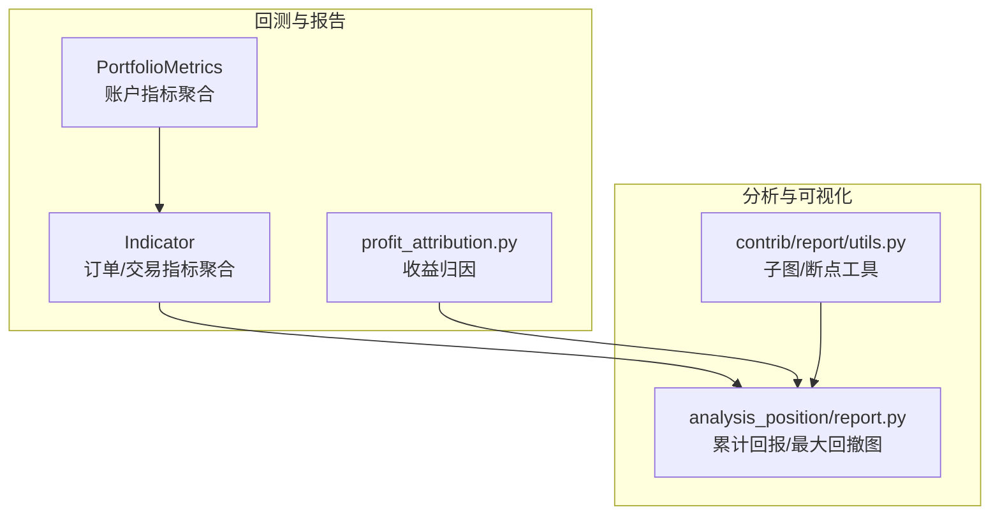
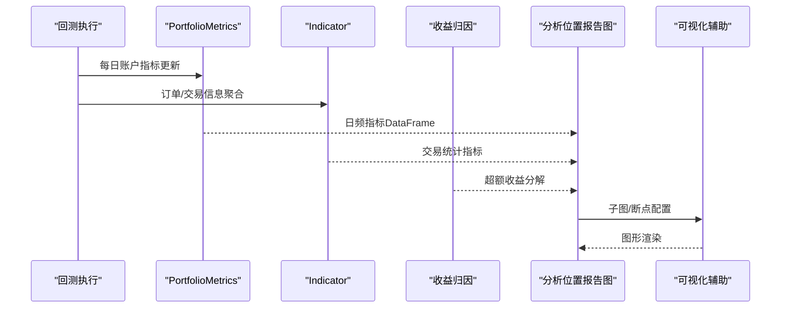
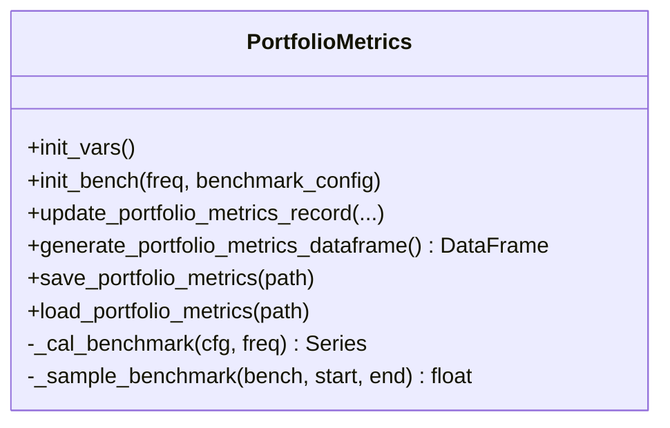
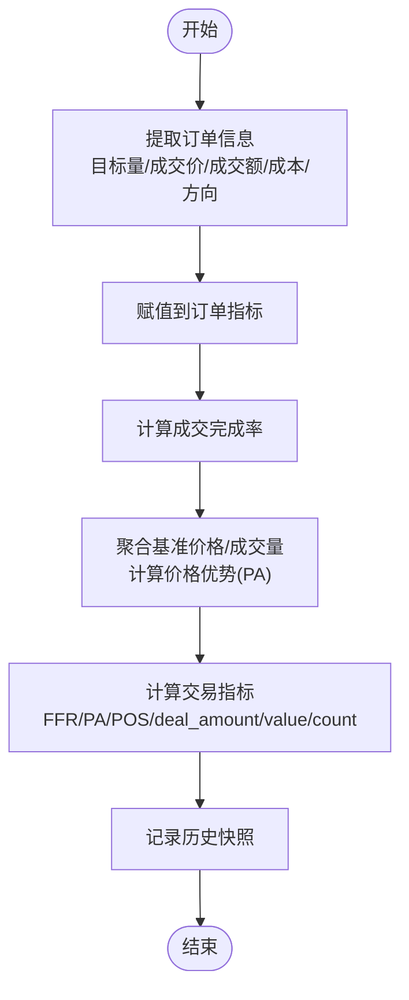
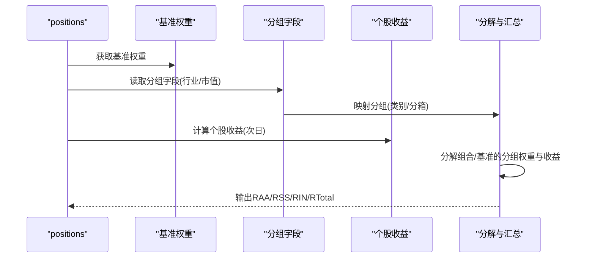
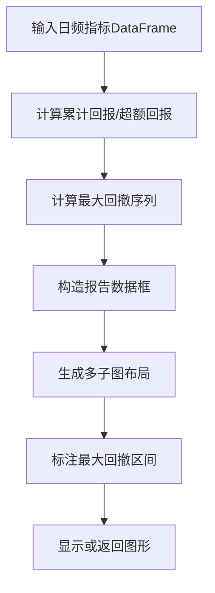
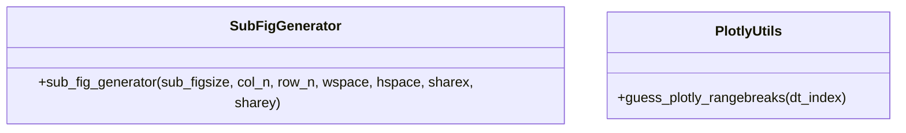
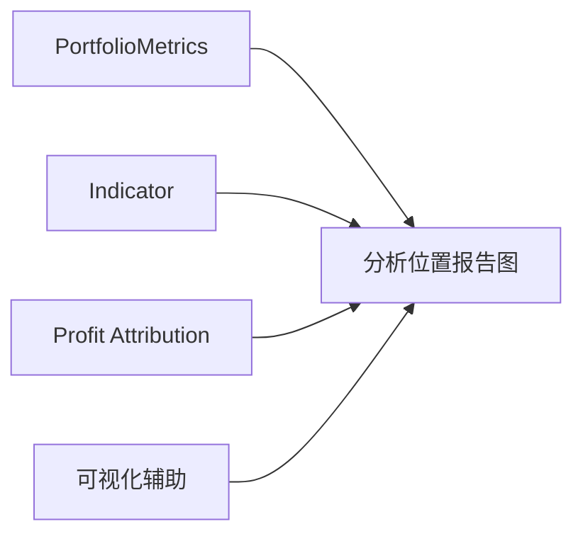

# 报告分析API

<cite>
**本文引用的文件**
- [qlib/backtest/report.py](file://qlib/backtest/report.py)
- [qlib/backtest/profit_attribution.py](file://qlib/backtest/profit_attribution.py)
- [qlib/contrib/report/analysis_position/report.py](file://qlib/contrib/report/analysis_position/report.py)
- [qlib/contrib/report/utils.py](file://qlib/contrib/report/utils.py)
</cite>

## 目录
1. [简介](#简介)
2. [项目结构](#项目结构)
3. [核心组件](#核心组件)
4. [架构总览](#架构总览)
5. [组件详解](#组件详解)
6. [依赖关系分析](#依赖关系分析)
7. [性能与可扩展性](#性能与可扩展性)
8. [故障排查指南](#故障排查指南)
9. [结论](#结论)
10. [附录：使用示例与最佳实践](#附录使用示例与最佳实践)

## 简介
本文件面向Qlib的报告分析API，系统化梳理以下能力：
- 回测报告生成与指标计算：通过PortfolioMetrics与Indicator两类核心组件，输出账户层面的每日指标（收益、成本、换手、基准对比等）以及订单级/交易级统计指标（成交完成率、价格优势、正向交易比例等），并支持导出与加载。
- 收益归因（Profit Attribution）：基于Brinson模型的资产配置与选股归因，支持按行业或分箱分组，计算日度超额收益分解（资产配置超额、个股选择超额、交互项与总超额）。
- 可视化与辅助工具：提供分析位置报告图绘制、子图生成器、Plotly时间轴断点猜测等实用工具。
- 报告配置选项：涵盖分析频率、基准设置、成本参数、权重数据来源、分组方式等。

## 项目结构
围绕“报告分析”主题，相关代码主要分布在如下模块：
- 回测报告与指标：qlib/backtest/report.py
- 收益归因：qlib/backtest/profit_attribution.py
- 分析位置报告图：qlib/contrib/report/analysis_position/report.py
- 报告可视化辅助：qlib/contrib/report/utils.py

图表来源
- [qlib/backtest/report.py:22-248](file://qlib/backtest/report.py#L22-L248)
- [qlib/backtest/profit_attribution.py:1-335](file://qlib/backtest/profit_attribution.py#L1-L335)
- [qlib/contrib/report/analysis_position/report.py:1-249](file://qlib/contrib/report/analysis_position/report.py#L1-L249)
- [qlib/contrib/report/utils.py:1-75](file://qlib/contrib/report/utils.py#L1-L75)

章节来源
- [qlib/backtest/report.py:1-652](file://qlib/backtest/report.py#L1-L652)
- [qlib/backtest/profit_attribution.py:1-335](file://qlib/backtest/profit_attribution.py#L1-L335)
- [qlib/contrib/report/analysis_position/report.py:1-249](file://qlib/contrib/report/analysis_position/report.py#L1-L249)
- [qlib/contrib/report/utils.py:1-75](file://qlib/contrib/report/utils.py#L1-L75)

## 核心组件
- PortfolioMetrics：负责按交易日聚合账户层面指标（账户总资产、日收益、总/日换手、总/日成本、持仓市值、现金、基准收益），并支持保存/加载。
- Indicator：负责订单级与交易级指标聚合（成交完成率、价格优势、正向交易比例、成交金额、交易额、订单数等），支持加权聚合与历史记录。
- Profit Attribution（Brinson）：基于基准权重与分组（行业/分箱），对组合进行资产配置与选股归因，输出日度超额收益分解。
- 分析位置报告图：对回测日频指标进行汇总，计算累计回报、最大回撤、超额收益及最大回撤区间，并生成多子图展示。
- 报告可视化辅助：提供子图生成器与Plotly时间轴断点猜测工具，便于在Jupyter中快速绘图。

章节来源
- [qlib/backtest/report.py:22-248](file://qlib/backtest/report.py#L22-L248)
- [qlib/backtest/report.py:249-652](file://qlib/backtest/report.py#L249-L652)
- [qlib/backtest/profit_attribution.py:18-335](file://qlib/backtest/profit_attribution.py#L18-L335)
- [qlib/contrib/report/analysis_position/report.py:35-163](file://qlib/contrib/report/analysis_position/report.py#L35-L163)
- [qlib/contrib/report/utils.py:7-75](file://qlib/contrib/report/utils.py#L7-L75)

## 架构总览
下图展示了从回测到报告生成、归因分析与可视化的整体流程：

图表来源
- [qlib/backtest/report.py:153-247](file://qlib/backtest/report.py#L153-L247)
- [qlib/backtest/report.py:278-648](file://qlib/backtest/report.py#L278-L648)
- [qlib/backtest/profit_attribution.py:226-334](file://qlib/backtest/profit_attribution.py#L226-L334)
- [qlib/contrib/report/analysis_position/report.py:66-163](file://qlib/contrib/report/analysis_position/report.py#L66-L163)
- [qlib/contrib/report/utils.py:7-75](file://qlib/contrib/report/utils.py#L7-L75)

## 组件详解

### 组件一：PortfolioMetrics（账户指标）
职责
- 按交易日记录并聚合账户层面指标：账户总资产、日收益、总/日换手、总/日成本、持仓市值、现金、基准收益。
- 支持基准收益采样与按分析周期聚合，保证与回测频率一致。
- 提供DataFrame导出/加载，便于离线复用与二次分析。

关键接口与行为
- 初始化与基准设置：支持传入基准类型（字符串/列表/Series）、起止时间、频率；内部通过高频特征抽取与重采样计算基准收益序列。
- 更新指标记录：在每一步交易后调用，校验必要字段并写入历史。
- 生成与持久化：输出包含多列的指标表，支持CSV保存/加载。

图表来源
- [qlib/backtest/report.py:42-247](file://qlib/backtest/report.py#L42-L247)

章节来源
- [qlib/backtest/report.py:42-247](file://qlib/backtest/report.py#L42-L247)

### 组件二：Indicator（订单/交易指标）
职责
- 聚合订单级指标（目标数量、成交数量、成交均价、成交额、交易成本、方向、成交完成率）。
- 聚合交易级指标（价格优势PA、正向交易比例、成交金额、交易额、订单数），支持均值/按金额/按价值加权。
- 支持跨层级聚合（内层订单指标汇总后，再与外层决策对齐），并可输出历史快照。

关键接口与行为
- 订单指标更新：从交易信息提取并赋值，计算成交完成率。
- 价格优势（PA）聚合：基于成交均价与基准价格（按TWAP/VWAP聚合），支持不同聚合方式与加权。
- 交易指标计算：按配置选择加权方式，输出FFR、PA、POS、deal_amount、value、count等。

图表来源
- [qlib/backtest/report.py:301-342](file://qlib/backtest/report.py#L301-L342)
- [qlib/backtest/report.py:372-552](file://qlib/backtest/report.py#L372-L552)
- [qlib/backtest/report.py:554-648](file://qlib/backtest/report.py#L554-L648)

章节来源
- [qlib/backtest/report.py:278-648](file://qlib/backtest/report.py#L278-L648)

### 组件三：Profit Attribution（收益归因）
职责
- 基于Brinson模型，对组合进行资产配置（Allocation）与个股选择（Selection）归因。
- 支持按行业分类或按基准分布分箱两种分组方式，输出日度超额收益分解（RAA、RSS、RIN、RTotal）。

关键接口与行为
- 基准权重获取：从数据提供方读取基准成分与权重，按日期-股票透视。
- 组合权重提取：从回测位置对象中提取每日股票权重。
- 分组映射：支持类别分组（直接使用属性）与分箱分组（按基准分布分位）。
- 组合/基准分组收益分解：按分组权重与个股收益计算分组收益，再汇总得到日度超额收益分解。
- 返回中间结果字典：包含分组权重、分组收益、分组映射等，便于进一步分析。

图表来源
- [qlib/backtest/profit_attribution.py:18-53](file://qlib/backtest/profit_attribution.py#L18-L53)
- [qlib/backtest/profit_attribution.py:205-224](file://qlib/backtest/profit_attribution.py#L205-L224)
- [qlib/backtest/profit_attribution.py:226-334](file://qlib/backtest/profit_attribution.py#L226-L334)

章节来源
- [qlib/backtest/profit_attribution.py:18-334](file://qlib/backtest/profit_attribution.py#L18-L334)

### 组件四：分析位置报告图（analysis_position/report.py）
职责
- 对回测日频指标进行汇总与衍生，计算累计回报、累计超额回报、最大回撤、换手等。
- 生成多子图（累计基准/策略回报、最大回撤填充图、超额回报、换手等），并标注最大回撤区间。

关键接口与行为
- 指标计算：累计回报、累计超额回报、最大回撤、换手等。
- 图形生成：构建子图布局与样式，支持在Notebook中直接显示或返回Plotly图形对象。
- 最大回撤区间：自动定位最大回撤起点与终点，用于图形标注。

图表来源
- [qlib/contrib/report/analysis_position/report.py:35-63](file://qlib/contrib/report/analysis_position/report.py#L35-L63)
- [qlib/contrib/report/analysis_position/report.py:66-163](file://qlib/contrib/report/analysis_position/report.py#L66-L163)

章节来源
- [qlib/contrib/report/analysis_position/report.py:35-163](file://qlib/contrib/report/analysis_position/report.py#L35-L163)

### 组件五：报告可视化辅助（contrib/report/utils.py）
职责
- 子图生成器：按行列批量生成子图，适合分组/面板可视化。
- Plotly断点猜测：根据时间索引的间隙推断X轴断点，避免时序图中的空洞连接。

图表来源
- [qlib/contrib/report/utils.py:7-75](file://qlib/contrib/report/utils.py#L7-L75)

章节来源
- [qlib/contrib/report/utils.py:7-75](file://qlib/contrib/report/utils.py#L7-L75)

## 依赖关系分析
- PortfolioMetrics依赖基准数据源与高频特征抽取工具，用于基准收益计算与采样。
- Indicator依赖订单/交易信息与交易所报价，用于计算成交完成率与价格优势。
- Profit Attribution依赖数据提供方的基准权重与分组字段，以及个股收益序列。
- 分析位置报告图依赖PortfolioMetrics产出的日频指标。
- 可视化辅助工具独立于业务逻辑，为上层绘图提供通用能力。

图表来源
- [qlib/backtest/report.py:90-121](file://qlib/backtest/report.py#L90-L121)
- [qlib/backtest/report.py:301-552](file://qlib/backtest/report.py#L301-L552)
- [qlib/backtest/profit_attribution.py:226-334](file://qlib/backtest/profit_attribution.py#L226-L334)
- [qlib/contrib/report/analysis_position/report.py:66-163](file://qlib/contrib/report/analysis_position/report.py#L66-L163)
- [qlib/contrib/report/utils.py:7-75](file://qlib/contrib/report/utils.py#L7-L75)

章节来源
- [qlib/backtest/report.py:90-121](file://qlib/backtest/report.py#L90-L121)
- [qlib/backtest/report.py:301-552](file://qlib/backtest/report.py#L301-L552)
- [qlib/backtest/profit_attribution.py:226-334](file://qlib/backtest/profit_attribution.py#L226-L334)
- [qlib/contrib/report/analysis_position/report.py:66-163](file://qlib/contrib/report/analysis_position/report.py#L66-L163)
- [qlib/contrib/report/utils.py:7-75](file://qlib/contrib/report/utils.py#L7-L75)

## 性能与可扩展性
- 指标聚合复杂度
  - PortfolioMetrics：按日写入与合并，时间复杂度近似O(N)，空间复杂度O(N)。
  - Indicator：订单/交易指标聚合涉及多步转换与加权，整体复杂度O(M)（M为订单/交易条目数）。
  - Brinson归因：分组权重与收益矩阵乘法，复杂度约O(T×S×G)（T天、S股票、G分组）。
- 数据加载与缓存
  - 基准权重与分组字段建议预取并缓存，减少重复I/O。
  - 使用Pandas的透视/合并操作时注意内存占用，必要时分批处理。
- 可扩展点
  - 新增交易指标：在Indicator中扩展聚合函数与加权方式。
  - 新增分组方式：在Profit Attribution中扩展分组映射逻辑。
  - 新增可视化：在analysis_position/report.py中扩展子图布局与指标列。

[本节为通用指导，不直接分析具体文件]

## 故障排查指南
常见问题与定位
- 基准为空或不存在
  - 现象：初始化基准时报错或基准收益缺失。
  - 排查：确认基准配置（字符串/列表/Series）、起止时间与频率正确；检查数据提供方是否存在对应基准。
  - 参考实现：基准计算与采样逻辑。
- 交易期无报价或零价格
  - 现象：价格优势计算失败或为空。
  - 排查：检查交易时段内的报价是否有效；确认聚合方式（TWAP/VWAP）与成交量非空。
  - 参考实现：基准价格聚合与过滤逻辑。
- 归因分组映射异常
  - 现象：分组字段缺失或NaN导致分组权重异常。
  - 排查：确认分组字段存在且已前向填充；检查分箱边界与分组数量。
  - 参考实现：分组映射与分箱逻辑。
- 可视化断点错误
  - 现象：Plotly时序图出现连接线跨越空洞。
  - 解决：使用断点猜测工具自动识别间隙并设置rangebreaks。

章节来源
- [qlib/backtest/report.py:96-121](file://qlib/backtest/report.py#L96-L121)
- [qlib/backtest/report.py:380-453](file://qlib/backtest/report.py#L380-L453)
- [qlib/backtest/profit_attribution.py:205-224](file://qlib/backtest/profit_attribution.py#L205-L224)
- [qlib/contrib/report/utils.py:49-75](file://qlib/contrib/report/utils.py#L49-L75)

## 结论
Qlib报告分析API以PortfolioMetrics与Indicator为核心，覆盖账户与交易层面的关键指标；通过Profit Attribution提供稳健的收益归因能力；analysis_position/report.py与utils.py则为可视化与辅助分析提供了完整工具链。合理配置基准、频率与分组方式，可在实践中高效完成绩效评估、风险分析与策略对比。

[本节为总结性内容，不直接分析具体文件]

## 附录：使用示例与最佳实践

- 回测报告生成与指标导出
  - 步骤要点：启用账户指标记录；在每步交易后更新指标；生成DataFrame并保存CSV。
  - 关键路径参考：账户指标更新、DataFrame生成与保存。
- 交易指标统计与加权
  - 步骤要点：传入交易信息；选择加权方式（均值/金额/价值）；查看历史快照。
  - 关键路径参考：订单指标更新、交易指标计算。
- 收益归因（Brinson）
  - 步骤要点：准备positions、基准权重、分组字段；选择分组方式（类别/分箱）；获取超额收益分解。
  - 关键路径参考：基准权重获取、分组映射、分解与汇总。
- 可视化与报告图
  - 步骤要点：准备日频指标DataFrame；调用报告图函数；在Notebook中显示或返回图形对象。
  - 关键路径参考：报告数据计算、子图布局与标注、图形显示。

章节来源
- [qlib/backtest/report.py:153-247](file://qlib/backtest/report.py#L153-L247)
- [qlib/backtest/report.py:554-648](file://qlib/backtest/report.py#L554-L648)
- [qlib/backtest/profit_attribution.py:226-334](file://qlib/backtest/profit_attribution.py#L226-L334)
- [qlib/contrib/report/analysis_position/report.py:166-248](file://qlib/contrib/report/analysis_position/report.py#L166-L248)