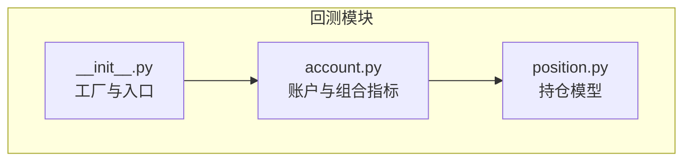
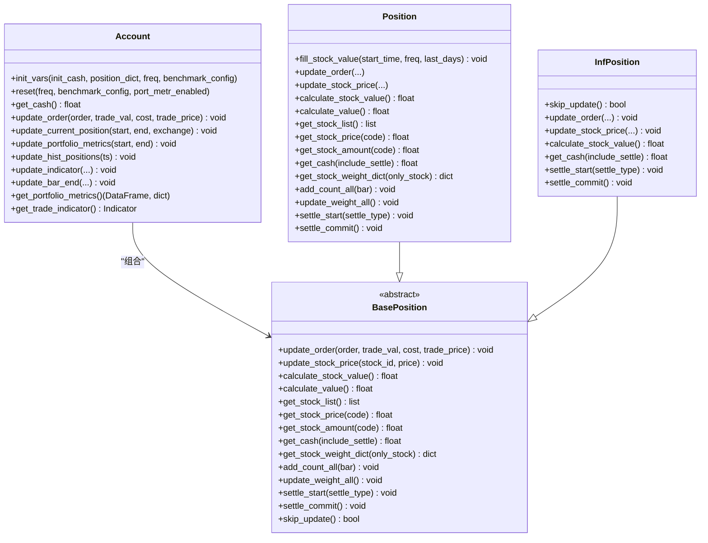
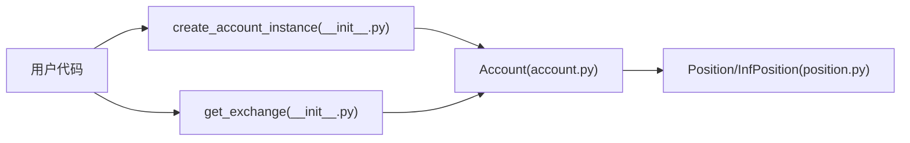

# 账户管理API

<cite>
**本文引用的文件**
- [account.py](file://qlib/backtest/account.py)
- [position.py](file://qlib/backtest/position.py)
- [__init__.py](file://qlib/backtest/__init__.py)
</cite>

## 目录
1. [简介](#简介)
2. [项目结构](#项目结构)
3. [核心组件](#核心组件)
4. [架构总览](#架构总览)
5. [详细组件分析](#详细组件分析)
6. [依赖关系分析](#依赖关系分析)
7. [性能与数值稳定性](#性能与数值稳定性)
8. [故障排查指南](#故障排查指南)
9. [结论](#结论)
10. [附录：使用示例与最佳实践](#附录使用示例与最佳实践)

## 简介
本文件为 Qlib 回测模块中的账户管理 API 提供完整参考，重点覆盖以下内容：
- Account 类的接口与职责：资金管理、持仓更新、费用与成交回报统计、历史仓位记录、指标与组合指标更新。
- Position 类族（含 Position、InfPosition）的持仓操作接口：买入、卖出、平仓、结算机制、权重与数量统计。
- 账户状态查询方法：可用资金、持仓市值、账户总值、成本与换手统计等。
- 账户配置参数：初始资金、持仓类型（Position/InfPosition）、基准市场、频率等。
- 实际使用示例：资金分配、风险控制、收益计算等场景。

## 项目结构
与账户管理相关的核心文件位于回测子模块中，主要包含：
- 账户与指标：account.py
- 持仓模型：position.py
- 用户入口与工厂方法：__init__.py（提供 create_account_instance、get_exchange 等）

图表来源
- [account.py:71-418](file://qlib/backtest/account.py#L71-L418)
- [position.py:16-566](file://qlib/backtest/position.py#L16-L566)
- [__init__.py:113-175](file://qlib/backtest/__init__.py#L113-L175)

章节来源
- [account.py:71-418](file://qlib/backtest/account.py#L71-L418)
- [position.py:16-566](file://qlib/backtest/position.py#L16-L566)
- [__init__.py:113-175](file://qlib/backtest/__init__.py#L113-L175)

## 核心组件
- Account：负责账户层面的资金变动、费用与成交回报统计、组合指标更新、历史仓位记录、交易指标聚合与记录。
- BasePosition/Position/InfPosition：抽象与具体持仓模型，支持买入/卖出/平仓、价格更新、市值与权重计算、结算延迟等。
- 工厂与入口：create_account_instance 将用户提供的账户配置转换为 Account 实例；get_exchange 提供交易环境（滑点、手续费、涨跌停限制等）。

章节来源
- [account.py:71-418](file://qlib/backtest/account.py#L71-L418)
- [position.py:16-566](file://qlib/backtest/position.py#L16-L566)
- [__init__.py:113-175](file://qlib/backtest/__init__.py#L113-L175)

## 架构总览
Account 通过组合 BasePosition（默认为 Position）进行资金与持仓管理，并在每个交易时点更新当前价格、持有天数、组合指标与交易指标。

图表来源
- [account.py:71-418](file://qlib/backtest/account.py#L71-L418)
- [position.py:16-566](file://qlib/backtest/position.py#L16-L566)

## 详细组件分析

### Account 类详解
- 初始化与变量
  - 支持传入初始资金、初始持仓字典、频率、基准配置、持仓类型（默认 Position）、是否启用组合指标。
  - 内部维护累计回报、成本、换手等累积信息，以及历史仓位快照。
- 关键方法
  - 资金与状态
    - get_cash：返回可用现金（可选包含结算延迟资金）。
  - 订单处理
    - update_order：根据订单方向（买/卖）先更新当前持仓，再更新累计回报/成本/换手。
  - 价格与持有期更新
    - update_current_position：按交易区间从交易所获取收盘价并更新持仓价格与持有天数。
  - 组合指标更新
    - update_portfolio_metrics：计算当日收益、回报率、成本与换手率，写入组合指标记录。
    - update_hist_positions：记录当前时间点的历史仓位快照（深拷贝）。
  - 交易指标更新
    - update_indicator/update_bar_end：在每个时点聚合订单级指标并记录。
  - 报告与查询
    - get_portfolio_metrics：返回组合指标数据框与历史仓位映射。
    - get_trade_indicator：返回交易指标实例。
- 配置与重置
  - reset/reset_report：支持动态切换频率与基准配置，重置报告与历史仓位。

章节来源
- [account.py:71-418](file://qlib/backtest/account.py#L71-L418)

### Position/InfPosition 类详解
- 基类 BasePosition
  - 定义统一的持仓接口：订单更新、价格更新、市值与总值计算、股票列表、价格/数量/权重查询、持有期与权重更新、结算机制、跳过更新等。
- Position（具体实现）
  - 支持初始化资金与初始持仓字典（可缺省价格，后续填充）。
  - 订单处理：_buy_stock/_sell_stock 完成买入/卖出/平仓逻辑，维护 cash 与各股票 amount/price/weight/count 等字段。
  - 价值计算：calculate_stock_value/calculate_value 返回股票市值与总账户价值（含结算延迟资金）。
  - 权重与数量：get_stock_weight_dict/get_stock_count 等辅助查询。
  - 结算机制：settle_start/settle_commit 支持“现金结算延迟”模式，避免当日卖出所得立即用于买入。
  - 填充历史价格：fill_stock_value 使用最近 N 天收盘价填充缺失价格，便于初期估值。
- InfPosition（无限资金/无限头寸）
  - skip_update 返回 True，不参与状态更新。
  - 不支持计算总价值、权重、股票列表等，返回无穷或 NaN，用于生成随机订单等场景。

章节来源
- [position.py:16-566](file://qlib/backtest/position.py#L16-L566)

### 工厂与入口
- create_account_instance
  - 将用户提供的账户配置（纯数字表示初始资金，或字典包含 cash 与其他股票信息）转换为 Account 实例。
  - 自动构造基准配置（benchmark/start_time/end_time），用于组合指标计算。
- get_exchange
  - 提供交易环境，支持滑点、手续费（开仓/平仓比例与最小费用）、涨跌停阈值、成交价策略等。

章节来源
- [__init__.py:113-175](file://qlib/backtest/__init__.py#L113-L175)
- [__init__.py:33-111](file://qlib/backtest/__init__.py#L33-L111)

## 依赖关系分析
- Account 依赖 Position（或其子类）进行资金与头寸管理。
- Account 在每个交易时点调用 Exchange 获取价格并更新持仓。
- __init__.py 提供 create_account_instance 与 get_exchange，作为用户侧的统一入口。

图表来源
- [__init__.py:113-175](file://qlib/backtest/__init__.py#L113-L175)
- [account.py:71-418](file://qlib/backtest/account.py#L71-L418)
- [position.py:16-566](file://qlib/backtest/position.py#L16-L566)

章节来源
- [__init__.py:113-175](file://qlib/backtest/__init__.py#L113-L175)
- [account.py:71-418](file://qlib/backtest/account.py#L71-L418)
- [position.py:16-566](file://qlib/backtest/position.py#L16-L566)

## 性能与数值稳定性
- 时间复杂度
  - 每个时点对持仓内每只股票执行一次价格更新与持有期+1，整体 O(N)（N 为持仓股票数）。
  - 权重更新与历史快照记录为 O(N)。
- 数值稳定性
  - 卖出平仓采用近似相等判断（避免浮点误差导致的负余量）。
  - 现金结算延迟模式避免当日卖出所得立即复用，降低策略对瞬时流动性假设的敏感性。
- 数据质量
  - 初始价格缺失时需通过 fill_stock_value 填充，若指定天数内无价格会抛出异常，建议确保数据完整性。

章节来源
- [position.py:342-383](file://qlib/backtest/position.py#L342-L383)
- [position.py:280-323](file://qlib/backtest/position.py#L280-L323)

## 故障排查指南
- “股票不在持仓中”
  - 触发条件：尝试卖出未持有的股票。
  - 排查要点：确认下单前的持仓查询与订单方向一致性。
  - 参考位置：[position.py:354-356](file://qlib/backtest/position.py#L354-L356)
- “卖出数量超过可用数量”
  - 触发条件：卖出后余量小于负阈值。
  - 排查要点：检查订单量与当前可用数量，避免过度集中或错误方向。
  - 参考位置：[position.py:367-374](file://qlib/backtest/position.py#L367-L374)
- “初始价格缺失导致无法估值”
  - 触发条件：fill_stock_value 无法在指定天数内找到收盘价。
  - 排查要点：确认数据源可用性与时间窗口设置。
  - 参考位置：[position.py:316-318](file://qlib/backtest/position.py#L316-L318)
- “组合指标不可用”
  - 触发条件：未启用组合指标却请求获取。
  - 排查要点：检查 Account 的 port_metr_enabled 参数。
  - 参考位置：[account.py:412-413](file://qlib/backtest/account.py#L412-L413)

章节来源
- [position.py:354-356](file://qlib/backtest/position.py#L354-L356)
- [position.py:367-374](file://qlib/backtest/position.py#L367-L374)
- [position.py:316-318](file://qlib/backtest/position.py#L316-L318)
- [account.py:412-413](file://qlib/backtest/account.py#L412-L413)

## 结论
Account/Position/InfPosition 三者协同提供了完整的回测账户管理能力：
- Account 负责跨时点的状态汇总与指标生成；
- Position 提供稳健的资金与头寸管理；
- InfPosition 适用于策略生成与压力测试场景。
配合工厂方法与交易环境，用户可以灵活配置初始资金、基准、手续费与滑点等参数，完成从资金分配到收益计算的全流程回测。

## 附录：使用示例与最佳实践
- 资金分配
  - 使用 create_account_instance 传入仅含 cash 的数值或字典（含 cash 与其他股票的 amount/price）来初始化账户。
  - 参考路径：[__init__.py:113-175](file://qlib/backtest/__init__.py#L113-L175)
- 风险控制
  - 启用结算延迟（settle_start/settle_commit）以避免当日卖出所得立即复用，降低策略对瞬时流动性的依赖。
  - 参考路径：[position.py:487-500](file://qlib/backtest/position.py#L487-L500)
- 收益计算
  - 通过 update_portfolio_metrics 计算当日收益与回报率；通过 get_portfolio_metrics 获取历史组合指标与历史仓位。
  - 参考路径：[account.py:250-291](file://qlib/backtest/account.py#L250-L291)，[account.py:405-414](file://qlib/backtest/account.py#L405-L414)
- 交易指标
  - 在每个时点调用 update_bar_end/update_indicator 聚合订单级指标并记录。
  - 参考路径：[account.py:338-403](file://qlib/backtest/account.py#L338-L403)