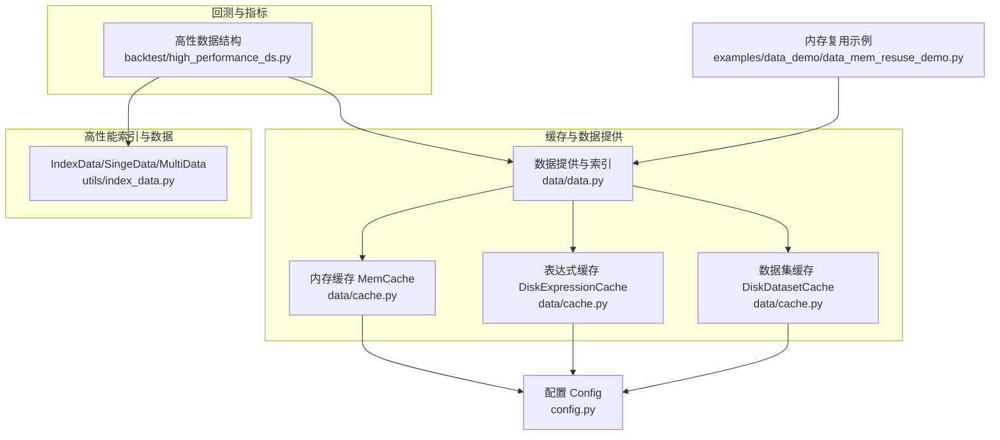
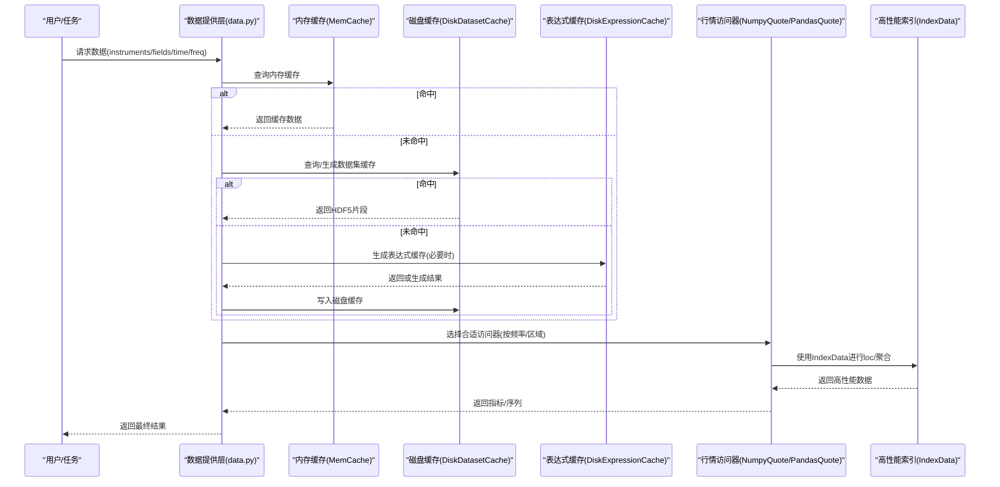
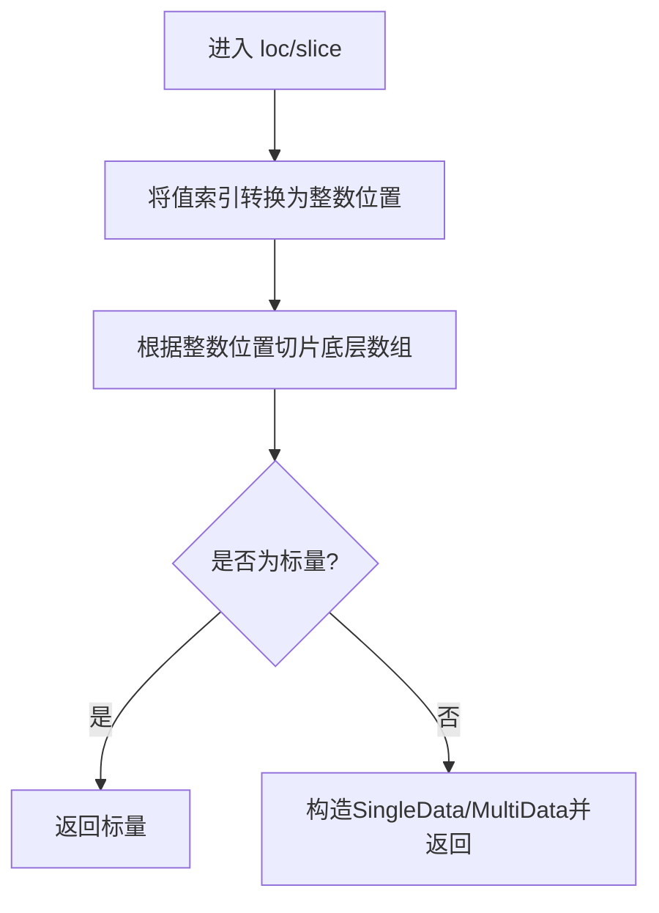
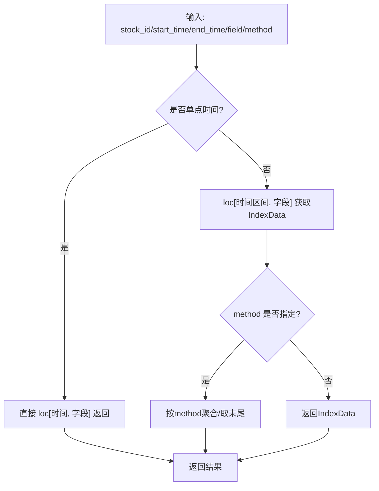
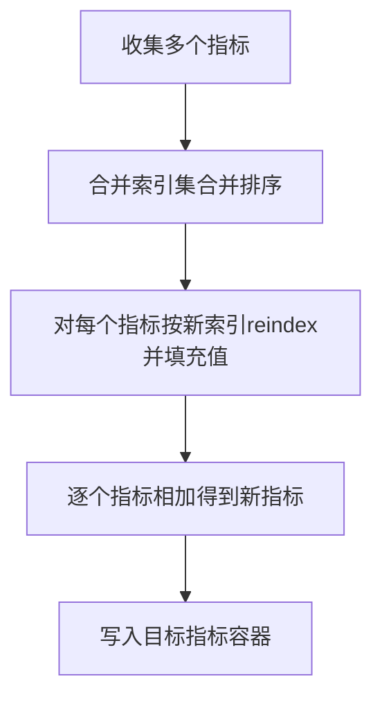
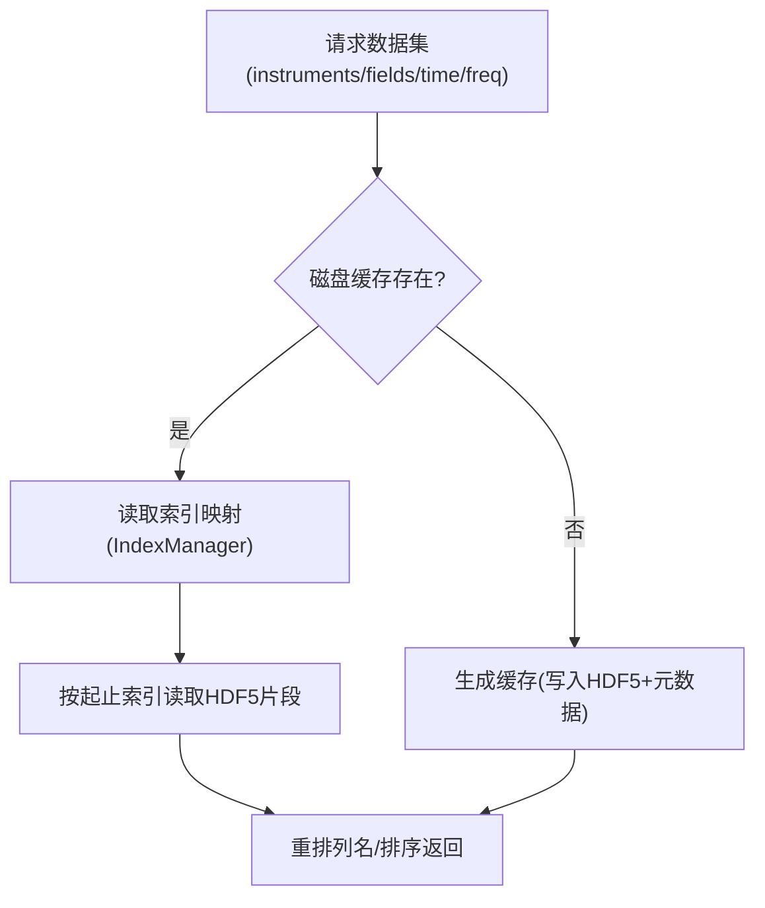
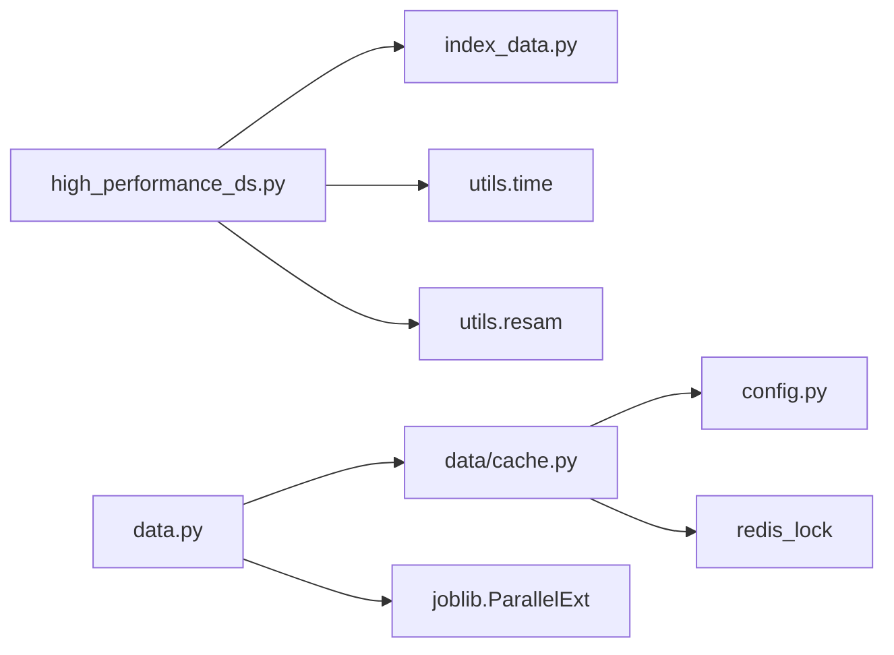

# 高性能数据API

<cite>
**本文引用的文件**
- [qlib/backtest/high_performance_ds.py](file://qlib/backtest/high_performance_ds.py)
- [qlib/utils/index_data.py](file://qlib/utils/index_data.py)
- [qlib/data/cache.py](file://qlib/data/cache.py)
- [qlib/data/data.py](file://qlib/data/data.py)
- [qlib/config.py](file://qlib/config.py)
- [examples/data_demo/data_mem_resuse_demo.py](file://examples/data_demo/data_mem_resuse_demo.py)
</cite>

## 目录
1. [简介](#简介)
2. [项目结构](#项目结构)
3. [核心组件](#核心组件)
4. [架构总览](#架构总览)
5. [详细组件分析](#详细组件分析)
6. [依赖分析](#依赖分析)
7. [性能考量](#性能考量)
8. [故障排查指南](#故障排查指南)
9. [结论](#结论)
10. [附录](#附录)

## 简介
本文件面向Qlib的高性能数据API，聚焦于Backtest模块中的高性能数据结构与工具，系统化阐述以下内容：
- 高性能数据结构：基于IndexData/SingeData/MultiData的零拷贝索引与算子封装，支持快速数值计算与内存优化。
- 高性能数据访问：PandasQuote/NumpyQuote两类行情数据访问器，结合时间序列重采样与索引定位，实现低开销查询。
- 缓存与预加载：内存缓存（MemCache）、过期控制（MemCacheExpire）、磁盘缓存（DiskDatasetCache/DiskExpressionCache）与Redis锁协调，提升重复访问性能。
- 并发与一致性：通过Redis读写锁协调多进程/多线程下的缓存更新与读取，避免竞态。
- 性能参数：内存阈值、缓存策略、批处理大小等可配置项，以及在高频场景下的调优建议。

## 项目结构
与高性能数据API直接相关的代码主要分布在以下模块：
- backtest：高性能数据结构与指标容器（HighPerformanceDataStructure相关能力）
- utils：高性能索引与数据结构（IndexData/SingeData/MultiData）
- data：缓存与数据提供层（内存/磁盘缓存、数据生成与索引）
- config：全局缓存与路径配置
- examples：内存复用演示（展示如何避免重复预处理）

**图表来源**
- [qlib/backtest/high_performance_ds.py:1-659](file://qlib/backtest/high_performance_ds.py#L1-L659)
- [qlib/utils/index_data.py:1-655](file://qlib/utils/index_data.py#L1-L655)
- [qlib/data/cache.py:1-1200](file://qlib/data/cache.py#L1-L1200)
- [qlib/data/data.py:1-200](file://qlib/data/data.py#L1-L200)
- [qlib/config.py:160-359](file://qlib/config.py#L160-L359)
- [examples/data_demo/data_mem_resuse_demo.py:1-59](file://examples/data_demo/data_mem_resuse_demo.py#L1-L59)

**章节来源**
- [qlib/backtest/high_performance_ds.py:1-659](file://qlib/backtest/high_performance_ds.py#L1-L659)
- [qlib/utils/index_data.py:1-655](file://qlib/utils/index_data.py#L1-L655)
- [qlib/data/cache.py:1-1200](file://qlib/data/cache.py#L1-L1200)
- [qlib/data/data.py:1-200](file://qlib/data/data.py#L1-L200)
- [qlib/config.py:160-359](file://qlib/config.py#L160-L359)
- [examples/data_demo/data_mem_resuse_demo.py:1-59](file://examples/data_demo/data_mem_resuse_demo.py#L1-L59)

## 核心组件
- 高性能数据结构（IndexData/SingeData/MultiData）
  - 提供类似pandas的索引行为，但底层以numpy数组承载，仅支持浮点类型，避免多余对象包装，显著降低内存与CPU开销。
  - 支持loc/iloc索引器、广播对齐、算子重载、聚合操作（sum/mean/isna等），并内置排序与填充等实用方法。
- 行情数据访问器（PandasQuote/NumpyQuote）
  - 将原始行情DataFrame按股票分组，构建字典映射；NumpyQuote进一步封装为MultiData并排序，支持快速切片与聚合。
  - 对单点时间与区间查询进行分支优化，减少不必要的聚合开销。
- 指标容器（BaseOrderIndicator/PandasOrderIndicator/NumpyOrderIndicator）
  - 提供指标的加减乘除、比较、聚合与汇总等运算，支持不同后端（pandas/numpy）实现，便于在不同场景下选择最优实现。
- 缓存体系（MemCache/MemCacheExpire/DiskDatasetCache/DiskExpressionCache）
  - 内存缓存：有序字典+容量限制，支持“长度”或“字节大小”两种限速策略。
  - 过期控制：基于时间戳的TTL管理，避免陈旧数据占用内存。
  - 磁盘缓存：HDF5/二进制文件持久化，配合Redis锁保证并发安全，支持增量更新与元数据维护。
- 配置与路径（Config/DataPathManager）
  - 统一管理缓存目录名、内存缓存阈值、过期时间、Redis连接参数等，支持按频率切换数据路径。

**章节来源**
- [qlib/utils/index_data.py:346-655](file://qlib/utils/index_data.py#L346-L655)
- [qlib/backtest/high_performance_ds.py:23-205](file://qlib/backtest/high_performance_ds.py#L23-L205)
- [qlib/backtest/high_performance_ds.py:298-659](file://qlib/backtest/high_performance_ds.py#L298-L659)
- [qlib/data/cache.py:137-292](file://qlib/data/cache.py#L137-L292)
- [qlib/data/cache.py:490-793](file://qlib/data/cache.py#L490-L793)
- [qlib/config.py:160-359](file://qlib/config.py#L160-L359)

## 架构总览
下图展示了从数据请求到返回的完整链路，涵盖内存/磁盘缓存、索引定位与数据访问器的选择。

**图表来源**
- [qlib/data/data.py:1092-1101](file://qlib/data/data.py#L1092-L1101)
- [qlib/data/cache.py:391-464](file://qlib/data/cache.py#L391-L464)
- [qlib/data/cache.py:696-748](file://qlib/data/cache.py#L696-L748)
- [qlib/data/cache.py:490-644](file://qlib/data/cache.py#L490-L644)
- [qlib/backtest/high_performance_ds.py:128-205](file://qlib/backtest/high_performance_ds.py#L128-L205)
- [qlib/utils/index_data.py:400-441](file://qlib/utils/index_data.py#L400-L441)

## 详细组件分析

### 高性能数据结构（IndexData/SingeData/MultiData）
- 设计要点
  - 底层使用float64数组，仅支持数值型索引，避免pandas复杂对象带来的额外开销。
  - 索引器LocIndexer支持值到位置的转换，切片与布尔索引均转为整数位置，减少类型转换成本。
  - 算子重载通过BinaryOps统一实现，自动对齐索引并执行向量化运算。
  - 聚合操作（sum/mean）支持按轴聚合，返回SingleData，保持零拷贝特性。
- 关键流程（loc切片与聚合）

**图表来源**
- [qlib/utils/index_data.py:206-314](file://qlib/utils/index_data.py#L206-L314)
- [qlib/utils/index_data.py:416-441](file://qlib/utils/index_data.py#L416-L441)

**章节来源**
- [qlib/utils/index_data.py:346-655](file://qlib/utils/index_data.py#L346-L655)

### 行情数据访问器（PandasQuote/NumpyQuote）
- 设计要点
  - PandasQuote：按股票分组构建字典，使用resam_ts_data进行时间序列重采样与聚合。
  - NumpyQuote：将每只股票的行情封装为MultiData并排序，支持loc切片与lru缓存加速单点查询。
  - 单点时间优化：当查询区间为“单值时间窗口”时，跳过聚合逻辑，直接索引返回，显著降低开销。
- 关键流程（NumpyQuote.get_data）

**图表来源**
- [qlib/backtest/high_performance_ds.py:128-205](file://qlib/backtest/high_performance_ds.py#L128-L205)

**章节来源**
- [qlib/backtest/high_performance_ds.py:23-205](file://qlib/backtest/high_performance_ds.py#L23-L205)

### 指标容器（BaseOrderIndicator/PandasOrderIndicator/NumpyOrderIndicator）
- 设计要点
  - 提供指标的赋值、转移（transfer）、汇总（sum_all_indicators）等操作。
  - 支持不同后端实现：PandasOrderIndicator基于pd.Series，NumpyOrderIndicator基于SingleData，兼顾易用性与性能。
  - 汇总时通过索引对齐与按索引求和，避免显式循环，提高吞吐。
- 关键流程（指标汇总）

**图表来源**
- [qlib/backtest/high_performance_ds.py:633-656](file://qlib/backtest/high_performance_ds.py#L633-L656)

**章节来源**
- [qlib/backtest/high_performance_ds.py:298-659](file://qlib/backtest/high_performance_ds.py#L298-L659)

### 缓存体系（MemCache/MemCacheExpire/DiskDatasetCache/DiskExpressionCache）
- 内存缓存（MemCache）
  - 三类缓存单元：日历、标的、特征，分别管理各自键值。
  - 支持“长度”或“字节大小”两种限速策略，结合有序字典实现LRU淘汰。
- 过期控制（MemCacheExpire）
  - 以时间戳记录最近访问时间，超过TTL则视为过期，避免长期占用内存。
- 磁盘缓存（DiskDatasetCache/DiskExpressionCache）
  - 数据集缓存：HDF5存储，索引管理器负责起止位置映射；支持增量更新与元数据维护。
  - 表达式缓存：二进制文件存储，配合Redis读写锁保证并发安全；支持远程客户端只读模式。
- 关键流程（数据集缓存读取）

**图表来源**
- [qlib/data/cache.py:647-748](file://qlib/data/cache.py#L647-L748)
- [qlib/data/cache.py:794-800](file://qlib/data/cache.py#L794-L800)

**章节来源**
- [qlib/data/cache.py:137-292](file://qlib/data/cache.py#L137-L292)
- [qlib/data/cache.py:381-464](file://qlib/data/cache.py#L381-L464)
- [qlib/data/cache.py:490-793](file://qlib/data/cache.py#L490-L793)

### 配置与路径（Config/DataPathManager）
- 关键配置项
  - 内存缓存阈值与限速策略：mem_cache_size_limit、mem_cache_limit_type
  - 内存缓存过期时间：mem_cache_expire
  - 缓存目录名：dataset_cache_dir_name、features_cache_dir_name
  - Redis连接参数：redis_host、redis_port、redis_task_db
- 路径管理
  - DataPathManager根据provider_uri与mount_path解析实际数据路径，支持本地/NFS等URI类型。

**章节来源**
- [qlib/config.py:160-359](file://qlib/config.py#L160-L359)

## 依赖分析
- 组件耦合
  - 高性能数据结构依赖utils/index_data.py提供的IndexData/SingeData/MultiData。
  - 行情访问器依赖utils/resam.ts_data_last与utils.time的频率解析。
  - 缓存体系依赖config中的全局配置与redis_lock进行并发控制。
- 外部依赖
  - numpy/pandas用于数值与索引操作。
  - redis_lock用于分布式锁协调。
  - joblib用于并行处理（在数据层作为辅助）。

**图表来源**
- [qlib/backtest/high_performance_ds.py:1-21](file://qlib/backtest/high_performance_ds.py#L1-L21)
- [qlib/utils/index_data.py:1-19](file://qlib/utils/index_data.py#L1-L19)
- [qlib/data/cache.py:1-36](file://qlib/data/cache.py#L1-L36)
- [qlib/data/data.py:1-41](file://qlib/data/data.py#L1-L41)
- [qlib/config.py:160-359](file://qlib/config.py#L160-L359)

**章节来源**
- [qlib/backtest/high_performance_ds.py:1-21](file://qlib/backtest/high_performance_ds.py#L1-L21)
- [qlib/utils/index_data.py:1-19](file://qlib/utils/index_data.py#L1-L19)
- [qlib/data/cache.py:1-36](file://qlib/data/cache.py#L1-L36)
- [qlib/data/data.py:1-41](file://qlib/data/data.py#L1-L41)
- [qlib/config.py:160-359](file://qlib/config.py#L160-L359)

## 性能考量
- 内存优化
  - 使用float64数组承载数据，避免对象包装；索引采用只读设计，共享底层数据，减少复制。
  - 内存缓存支持“长度”和“字节大小”两种限速策略，结合LRU淘汰，防止内存膨胀。
- 快速访问
  - NumpyQuote在单点时间查询时跳过聚合，直接loc索引，显著降低开销。
  - IndexData的loc/iloc将值索引转换为整数位置，切片与布尔索引均走整数路径，减少类型转换。
- 缓存策略
  - 表达式缓存与数据集缓存分别针对单变量与多变量场景，结合Redis锁实现并发安全。
  - 磁盘缓存支持增量更新与元数据维护，避免全量重建。
- 批处理与并行
  - 数据层使用joblib并行扩展（ParallelExt），在多核环境下提升吞吐。
- 参数建议
  - 内存阈值：根据可用内存与数据规模调整mem_cache_size_limit；优先使用“字节大小”策略以更精确控制。
  - 过期时间：根据数据更新频率设置mem_cache_expire，平衡内存占用与新鲜度。
  - 批处理大小：高频场景建议较小批次以降低峰值内存，日频场景可适当增大。

**章节来源**
- [qlib/utils/index_data.py:346-441](file://qlib/utils/index_data.py#L346-L441)
- [qlib/backtest/high_performance_ds.py:155-181](file://qlib/backtest/high_performance_ds.py#L155-L181)
- [qlib/data/cache.py:137-182](file://qlib/data/cache.py#L137-L182)
- [qlib/data/data.py:1-41](file://qlib/data/data.py#L1-L41)
- [qlib/config.py:160-359](file://qlib/config.py#L160-L359)

## 故障排查指南
- 缓存锁冲突
  - 现象：多进程/多线程同时写缓存时报错或死锁。
  - 排查：检查Redis连接参数与任务数据库；确认缓存键命名唯一；必要时清理残留锁。
  - 参考：缓存锁工具与异常提示。
- 缓存不命中
  - 现象：频繁触发生成缓存，性能下降。
  - 排查：确认缓存目录权限与磁盘空间；检查字段规范化与频率参数；验证索引映射是否正确。
- 内存溢出
  - 现象：内存持续增长，GC无法回收。
  - 排查：调整mem_cache_size_limit与limit_type；缩短mem_cache_expire；监控LRU淘汰情况。
- 数据不一致
  - 现象：同一查询在不同时间返回不一致。
  - 排查：确认缓存过期策略；检查增量更新逻辑；确保Redis锁生效。

**章节来源**
- [qlib/data/cache.py:210-292](file://qlib/data/cache.py#L210-L292)
- [qlib/data/cache.py:647-748](file://qlib/data/cache.py#L647-L748)
- [qlib/data/cache.py:490-644](file://qlib/data/cache.py#L490-L644)

## 结论
Qlib的高性能数据API通过“高性能索引与数据结构 + 行情访问器 + 缓存体系”的组合，在保证易用性的同时实现了极高的数据吞吐与内存效率。其关键优势包括：
- 零拷贝与只读索引设计，显著降低CPU与内存开销；
- 单点时间查询优化与loc/iloc整数路径，提升随机访问性能；
- 内存/磁盘双层缓存与Redis锁协调，保障并发安全与可扩展性；
- 可配置的参数体系，适配从日频到高频的多种场景。

## 附录
- 使用示例（内存复用）
  - 示例展示了如何在训练任务中复用已处理的数据处理器，避免重复预处理，从而缩短整体运行时间。
  - 参考：examples/data_demo/data_mem_resuse_demo.py

**章节来源**
- [examples/data_demo/data_mem_resuse_demo.py:1-59](file://examples/data_demo/data_mem_resuse_demo.py#L1-L59)