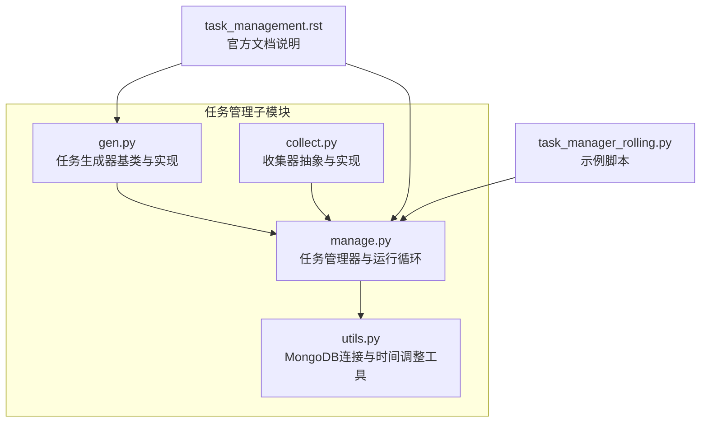
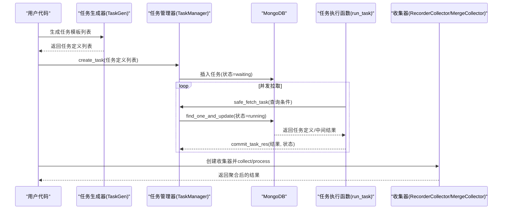
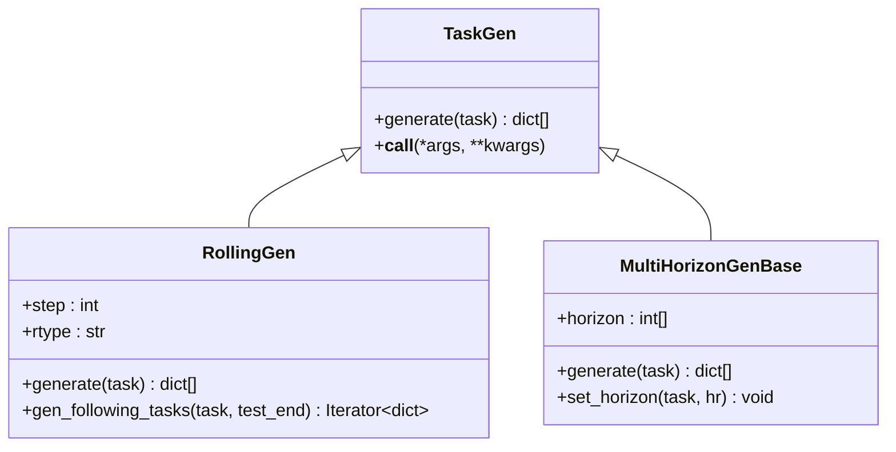
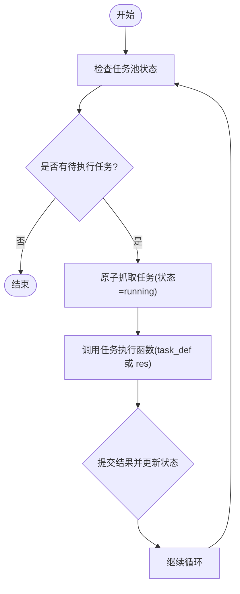
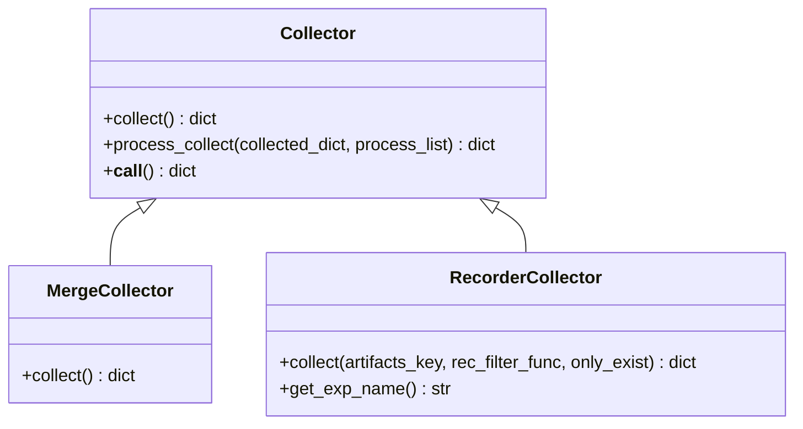
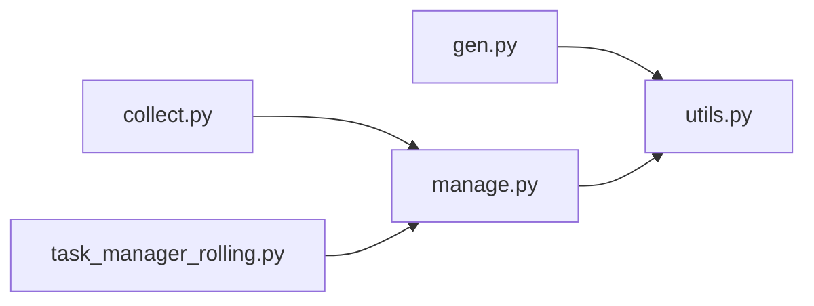

# 任务管理API

<cite>
**本文引用的文件**
- [gen.py](file://qlib/workflow/task/gen.py)
- [manage.py](file://qlib/workflow/task/manage.py)
- [collect.py](file://qlib/workflow/task/collect.py)
- [utils.py](file://qlib/workflow/task/utils.py)
- [task_management.rst](file://docs/advanced/task_management.rst)
- [task_manager_rolling.py](file://examples/model_rolling/task_manager_rolling.py)
</cite>

## 目录
1. [简介](#简介)
2. [项目结构](#项目结构)
3. [核心组件](#核心组件)
4. [架构总览](#架构总览)
5. [详细组件分析](#详细组件分析)
6. [依赖关系分析](#依赖关系分析)
7. [性能考量](#性能考量)
8. [故障排查指南](#故障排查指南)
9. [结论](#结论)
10. [附录：使用示例与最佳实践](#附录使用示例与最佳实践)

## 简介
本文件为 Qlib 任务管理API的权威参考，围绕“任务生成器（Task Generator）”、“任务管理器（Task Manager）”和“任务收集器（Task Collector）”三大模块，系统阐述以下内容：
- 任务生成器接口：任务创建（generate）、任务配置（task_config）、滚动/多时长等生成策略
- 任务管理器接口：任务启动（fetch/claim）、任务监控（状态统计/等待）、任务终止/回退（return）、结果提交（commit）
- 任务收集器接口：结果收集（collect）、结果处理（process_collect）、合并收集（MergeCollector）、基于实验记录器的收集（RecorderCollector）
- 任务生命周期管理：创建、排队、运行、部分完成、完成、失败回退等状态流转
- 完整使用示例：从生成任务、管理执行到收集结果的典型流程

## 项目结构
任务管理相关代码位于 workflow/task 子模块，包含任务生成、任务管理（MongoDB）、结果收集与工具类。

图示来源
- [gen.py:1-351](file://qlib/workflow/task/gen.py#L1-L351)
- [manage.py:1-559](file://qlib/workflow/task/manage.py#L1-L559)
- [collect.py:1-259](file://qlib/workflow/task/collect.py#L1-L259)
- [utils.py:1-309](file://qlib/workflow/task/utils.py#L1-L309)
- [task_management.rst:1-59](file://docs/advanced/task_management.rst#L1-L59)
- [task_manager_rolling.py](file://examples/model_rolling/task_manager_rolling.py)

章节来源
- [gen.py:1-351](file://qlib/workflow/task/gen.py#L1-L351)
- [manage.py:1-559](file://qlib/workflow/task/manage.py#L1-L559)
- [collect.py:1-259](file://qlib/workflow/task/collect.py#L1-L259)
- [utils.py:1-309](file://qlib/workflow/task/utils.py#L1-L309)
- [task_management.rst:1-59](file://docs/advanced/task_management.rst#L1-L59)

## 核心组件
- 任务生成器（TaskGen）：抽象基类，定义 generate(task) 接口；提供 RollingGen（滚动生成）、MultiHorizonGenBase（多时长生成）等具体实现
- 任务管理器（TaskManager）：基于 MongoDB 的任务池管理，支持插入、去重、抓取、提交结果、回退、优先级设置、等待机制、批量统计
- 任务收集器（Collector）：抽象收集器，提供 process_collect 处理链；内置 MergeCollector 合并多个收集器结果；RecorderCollector 基于实验记录器收集产物
- 工具类（utils）：MongoDB 连接获取、记录器筛选、时间对齐与截断、滚动位移、处理器缓存替换

章节来源
- [gen.py:53-351](file://qlib/workflow/task/gen.py#L53-L351)
- [manage.py:35-559](file://qlib/workflow/task/manage.py#L35-L559)
- [collect.py:19-259](file://qlib/workflow/task/collect.py#L19-L259)
- [utils.py:22-309](file://qlib/workflow/task/utils.py#L22-L309)

## 架构总览
下图展示了从任务生成、入池、抓取执行、结果提交到收集的全链路：

图示来源
- [gen.py:16-50](file://qlib/workflow/task/gen.py#L16-L50)
- [manage.py:217-383](file://qlib/workflow/task/manage.py#L217-L383)
- [manage.py:485-551](file://qlib/workflow/task/manage.py#L485-L551)
- [collect.py:136-259](file://qlib/workflow/task/collect.py#L136-L259)

## 详细组件分析

### 任务生成器（TaskGen）
- 职责
  - 将单个任务模板扩展为一组任务（如滚动窗口、多时长、多损失等）
  - 提供 generate(task) 抽象接口，子类按需实现
- 关键实现
  - RollingGen：按步长滑动或扩展训练集，自动对齐交易日历，避免未来信息泄漏，必要时调整 handler 结束时间
  - MultiHorizonGenBase：为不同预测时长生成任务，并相应截断测试段以避免标签泄漏
  - 工具函数：handler_mod、trunc_segments、task_generator 组合多个生成器与模板
- 使用建议
  - 在生成滚动任务前，确保 segments 对齐到交易日历
  - 注意标签泄漏防护，合理设置 trunc_days 或 label_leak_n

图示来源
- [gen.py:53-351](file://qlib/workflow/task/gen.py#L53-L351)

章节来源
- [gen.py:16-50](file://qlib/workflow/task/gen.py#L16-L50)
- [gen.py:94-124](file://qlib/workflow/task/gen.py#L94-L124)
- [gen.py:126-138](file://qlib/workflow/task/gen.py#L126-L138)
- [gen.py:140-301](file://qlib/workflow/task/gen.py#L140-L301)
- [gen.py:304-351](file://qlib/workflow/task/gen.py#L304-L351)

### 任务管理器（TaskManager）
- 职责
  - 将任务定义持久化到 MongoDB，维护任务状态（waiting/running/part_done/done）
  - 提供插入、去重、抓取、提交结果、回退、优先级、等待、统计等能力
- 核心接口
  - create_task：去重插入任务定义，返回任务ID列表
  - fetch_task/safe_fetch_task：原子性抓取并置为 running，异常时可回退
  - commit_task_res：提交结果并更新状态
  - return_task：在异常时将任务回退到指定状态
  - query/re_query/remove/task_stat/reset_waiting/reset_status/prioritize/wait 等
- 执行循环（run_task）
  - 自动循环抓取任务，根据 before_status 决定传入参数（任务定义或上次中间结果），执行后提交结果并切换 after_status

图示来源
- [manage.py:485-551](file://qlib/workflow/task/manage.py#L485-L551)
- [manage.py:265-318](file://qlib/workflow/task/manage.py#L265-L318)
- [manage.py:354-383](file://qlib/workflow/task/manage.py#L354-L383)

章节来源
- [manage.py:35-110](file://qlib/workflow/task/manage.py#L35-L110)
- [manage.py:161-216](file://qlib/workflow/task/manage.py#L161-L216)
- [manage.py:217-264](file://qlib/workflow/task/manage.py#L217-L264)
- [manage.py:265-318](file://qlib/workflow/task/manage.py#L265-L318)
- [manage.py:319-397](file://qlib/workflow/task/manage.py#L319-L397)
- [manage.py:398-457](file://qlib/workflow/task/manage.py#L398-L457)
- [manage.py:458-480](file://qlib/workflow/task/manage.py#L458-L480)
- [manage.py:485-551](file://qlib/workflow/task/manage.py#L485-L551)

### 任务收集器（Collector）
- 职责
  - 从实验记录器中收集产物（如预测、IC 等），支持分组、聚合、拼接等处理链
- 核心类型
  - Collector：抽象基类，定义 collect 与 process_collect
  - MergeCollector：合并多个收集器的结果，支持自定义外层键组合
  - RecorderCollector：基于 Experiment/记录器过滤与加载产物，支持仅存在产物收集与重复键警告
- 使用建议
  - 先 collect 再 process_collect，保证处理顺序可控
  - 使用 artifacts_key 精准选择需要的产物，避免不必要的IO

图示来源
- [collect.py:19-88](file://qlib/workflow/task/collect.py#L19-L88)
- [collect.py:90-134](file://qlib/workflow/task/collect.py#L90-L134)
- [collect.py:136-259](file://qlib/workflow/task/collect.py#L136-L259)

章节来源
- [collect.py:19-88](file://qlib/workflow/task/collect.py#L19-L88)
- [collect.py:90-134](file://qlib/workflow/task/collect.py#L90-L134)
- [collect.py:136-259](file://qlib/workflow/task/collect.py#L136-L259)

### 工具类（utils）
- get_mongodb：从全局配置读取 MongoDB 地址与库名，建立连接
- TimeAdjuster：交易日历对齐、截断、滚动位移，保障时间片段合法且无未来信息泄漏
- replace_task_handler_with_cache：将任务中的 handler 缓存为本地pickle文件，便于跨进程/机器复用

章节来源
- [utils.py:22-58](file://qlib/workflow/task/utils.py#L22-L58)
- [utils.py:82-309](file://qlib/workflow/task/utils.py#L82-L309)

## 依赖关系分析
- 任务生成器依赖时间工具（对齐/截断/滚动），确保生成的任务片段合法
- 任务管理器依赖 MongoDB 存储与序列化（pickle + Binary），提供并发安全的原子抓取与状态更新
- 收集器依赖实验记录器（Experiment/Recorder）进行结果读取与处理
- 示例脚本演示了完整的“生成-入池-执行-收集”闭环

图示来源
- [gen.py:1-351](file://qlib/workflow/task/gen.py#L1-L351)
- [manage.py:1-559](file://qlib/workflow/task/manage.py#L1-L559)
- [collect.py:1-259](file://qlib/workflow/task/collect.py#L1-L259)
- [utils.py:1-309](file://qlib/workflow/task/utils.py#L1-L309)
- [task_manager_rolling.py](file://examples/model_rolling/task_manager_rolling.py)

章节来源
- [gen.py:1-351](file://qlib/workflow/task/gen.py#L1-L351)
- [manage.py:1-559](file://qlib/workflow/task/manage.py#L1-L559)
- [collect.py:1-259](file://qlib/workflow/task/collect.py#L1-L259)
- [utils.py:1-309](file://qlib/workflow/task/utils.py#L1-L309)
- [task_manager_rolling.py](file://examples/model_rolling/task_manager_rolling.py)

## 性能考量
- MongoDB 序列化：任务定义与结果通过 pickle 序列化后以 Binary 存储，注意 dump 协议版本一致性
- 原子抓取：find_one_and_update 保证并发环境下每个任务只被一个执行器获取一次
- 时间对齐：对齐交易日历与截断避免无效数据加载，减少IO与计算开销
- 处理链优化：process_collect 按序执行，建议将昂贵操作放在末尾或并行化
- 等待轮询：wait 使用固定间隔轮询，建议结合任务数量与执行时长调整日志频率

## 故障排查指南
- MongoDB 配置缺失
  - 症状：初始化时报错提示未配置 C["mongo"]
  - 处理：在初始化时提供 task_url 与 task_db_name，或在配置中设置
- 任务卡住
  - 症状：running 任务长时间未完成
  - 处理：使用 reset_running 或 reset_status 将其回退为 waiting；检查任务执行函数是否抛出异常
- 重复任务
  - 症状：重复插入相同任务定义
  - 处理：create_task 已做去重；确认 filter 字段是否一致
- 记录器加载失败
  - 症状：RecorderCollector 加载产物报错
  - 处理：启用 only_exist 忽略不存在产物；或修正 artifacts_path 与 artifacts_key
- 未来信息泄漏
  - 症状：验证/测试阶段出现非法信息
  - 处理：使用 MultiHorizonGenBase 的截断逻辑或 RollingGen 的 trunc_days

章节来源
- [utils.py:22-58](file://qlib/workflow/task/utils.py#L22-L58)
- [manage.py:416-433](file://qlib/workflow/task/manage.py#L416-L433)
- [collect.py:233-247](file://qlib/workflow/task/collect.py#L233-L247)

## 结论
Qlib 任务管理API通过“生成-存储-执行-收集”的流水线，实现了可扩展、可并发、可观测的任务编排。借助 MongoDB 的原子更新与时间工具的严谨对齐，系统在复杂实验场景（滚动、多时长、多模型）下仍保持稳定与高效。建议在实际工程中：
- 明确任务模板与生成策略，严格控制时间片段与标签泄漏
- 使用 TaskManager 的去重与状态机管理，配合 run_task 实现可靠的并发执行
- 通过 RecorderCollector/MergeCollector 构建清晰的结果收集与处理链

## 附录：使用示例与最佳实践
- 生成任务
  - 使用 RollingGen/MultiHorizonGenBase 扩展任务模板，确保 segments 对齐交易日历
  - 参考路径：[gen.py:140-301](file://qlib/workflow/task/gen.py#L140-L301)，[gen.py:304-351](file://qlib/workflow/task/gen.py#L304-L351)
- 入池与执行
  - create_task 去重插入；run_task 循环抓取并执行；异常时 return_task 回退
  - 参考路径：[manage.py:217-264](file://qlib/workflow/task/manage.py#L217-L264)，[manage.py:485-551](file://qlib/workflow/task/manage.py#L485-L551)，[manage.py:354-383](file://qlib/workflow/task/manage.py#L354-L383)
- 结果收集
  - RecorderCollector 按实验筛选记录器并加载产物；MergeCollector 合并多源结果
  - 参考路径：[collect.py:136-259](file://qlib/workflow/task/collect.py#L136-L259)，[collect.py:90-134](file://qlib/workflow/task/collect.py#L90-L134)
- 示例脚本
  - 参考：[task_manager_rolling.py](file://examples/model_rolling/task_manager_rolling.py)
- 官方文档
  - 参考：[task_management.rst:1-59](file://docs/advanced/task_management.rst#L1-L59)