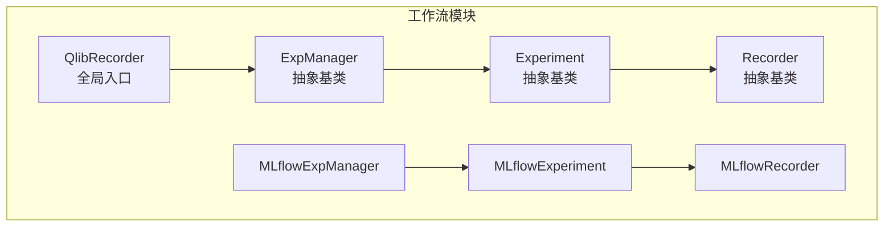
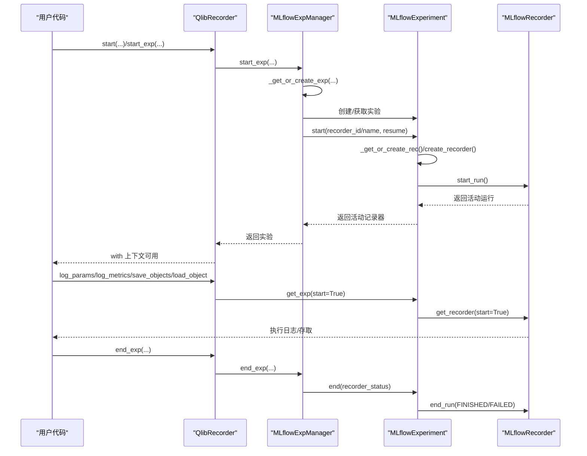
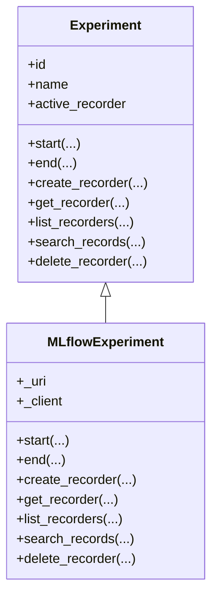
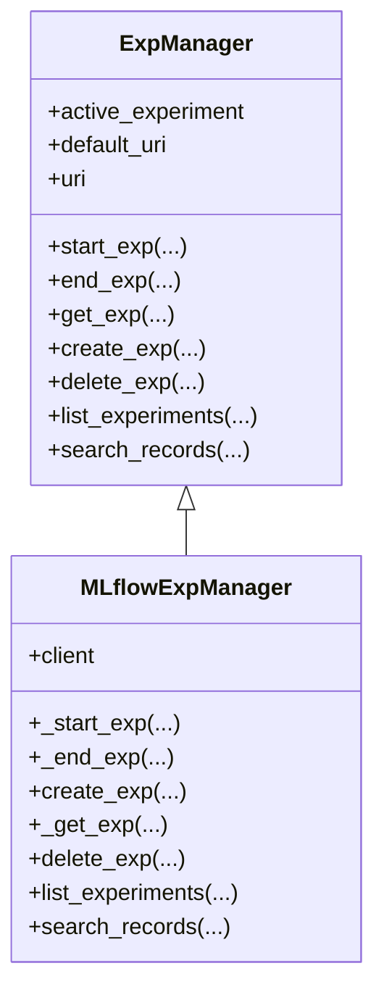
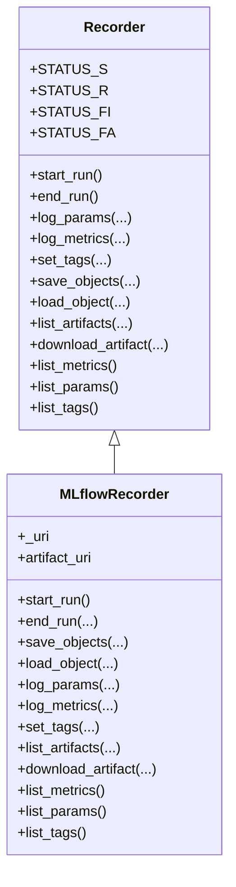
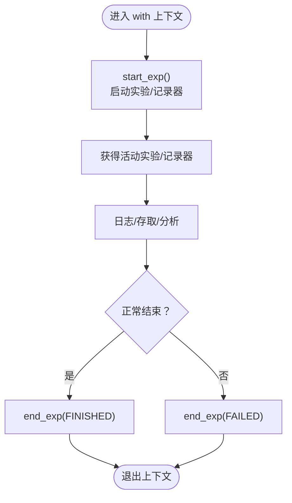
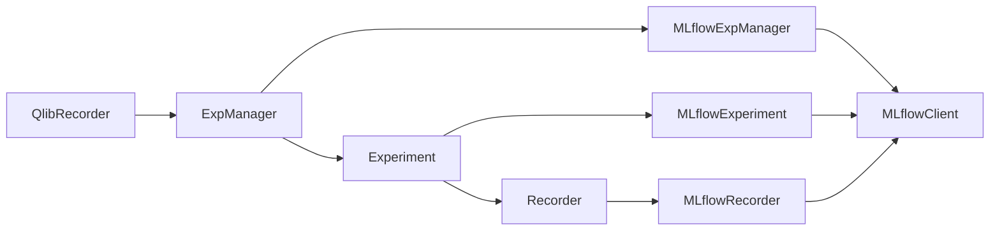

# 实验API

<cite>
**本文引用的文件**
- [exp.py](file://qlib/workflow/exp.py)
- [expm.py](file://qlib/workflow/expm.py)
- [__init__.py](file://qlib/workflow/__init__.py)
- [recorder.py](file://qlib/workflow/recorder.py)
- [utils.py](file://qlib/workflow/utils.py)
</cite>

## 目录
1. [简介](#简介)
2. [项目结构](#项目结构)
3. [核心组件](#核心组件)
4. [架构总览](#架构总览)
5. [详细组件分析](#详细组件分析)
6. [依赖分析](#依赖分析)
7. [性能考虑](#性能考虑)
8. [故障排查指南](#故障排查指南)
9. [结论](#结论)
10. [附录：使用示例与最佳实践](#附录使用示例与最佳实践)

## 简介
本文件为 Qlib 实验API的权威参考文档，围绕 Experiment（实验）、Recorder（记录器）与 ExpManager（实验管理器）三大核心对象，系统阐述以下内容：
- 实验初始化、执行、结束与状态管理
- 实验配置与数据加载、模型配置的接入方式
- 实验结果保存、读取与分析的统一入口
- 完整的使用示例，覆盖从创建实验到结果分析的典型流程

Qlib 的实验API以 MLflow 为基础进行封装与增强，提供更直观的记录器对象、对象级持久化与加载能力，并支持多后端抽象。

## 项目结构
与实验API直接相关的代码位于 qlib/workflow 目录，关键文件如下：
- exp.py：定义 Experiment 抽象类与 MLflowExperiment 实现
- expm.py：定义 ExpManager 抽象类与 MLflowExpManager 实现
- __init__.py：对外暴露 QlibRecorder 全局入口，提供 start/end/get_exp/list_recorders 等高层API
- recorder.py：定义 Recorder 抽象类与 MLflowRecorder 实现
- utils.py：异常与退出钩子，确保异常或中断时实验状态正确收尾

图表来源
- [__init__.py:26-682](file://qlib/workflow/__init__.py#L26-L682)
- [expm.py:22-434](file://qlib/workflow/expm.py#L22-L434)
- [exp.py:15-380](file://qlib/workflow/exp.py#L15-L380)
- [recorder.py:28-494](file://qlib/workflow/recorder.py#L28-L494)

章节来源
- [__init__.py:1-682](file://qlib/workflow/__init__.py#L1-L682)
- [expm.py:1-434](file://qlib/workflow/expm.py#L1-L434)
- [exp.py:1-380](file://qlib/workflow/exp.py#L1-L380)
- [recorder.py:1-494](file://qlib/workflow/recorder.py#L1-L494)

## 核心组件
- QlibRecorder：面向用户的全局入口，提供 with 上下文启动实验、日志记录、对象存取、记录器查询等便捷方法。
- ExpManager：实验管理器抽象，负责实验的创建、获取、删除、列表与搜索；MLflowExpManager 提供基于 MLflow 的具体实现。
- Experiment：实验抽象，负责实验生命周期管理、记录器创建与检索、记录查询与删除；MLflowExperiment 基于 MLflow 实现。
- Recorder：记录器抽象，负责参数、指标、标签、制品的记录与读取；MLflowRecorder 基于 MLflow 实现。

章节来源
- [__init__.py:26-682](file://qlib/workflow/__init__.py#L26-L682)
- [expm.py:22-434](file://qlib/workflow/expm.py#L22-L434)
- [exp.py:15-380](file://qlib/workflow/exp.py#L15-L380)
- [recorder.py:28-494](file://qlib/workflow/recorder.py#L28-L494)

## 架构总览
下图展示了 Qlib 实验API的调用链路与职责划分：

图表来源
- [__init__.py:37-163](file://qlib/workflow/__init__.py#L37-L163)
- [expm.py:46-117](file://qlib/workflow/expm.py#L46-L117)
- [exp.py:44-72](file://qlib/workflow/exp.py#L44-L72)
- [recorder.py:105-120](file://qlib/workflow/recorder.py#L105-L120)

## 详细组件分析

### Experiment 类族
- 抽象接口
  - start：启动实验并激活记录器，支持按 id/name 获取或创建记录器，支持 resume 恢复。
  - end：结束实验，设置记录器状态。
  - create_recorder：为实验创建记录器。
  - get_recorder：按 id/name 获取记录器，支持自动创建与激活。
  - list_recorders/search_records/delete_recorder：列出/查询/删除记录器。
- MLflowExperiment 实现要点
  - 使用 MLflowClient 管理实验与记录器。
  - 支持按名称唯一性警告与最新运行返回策略。
  - 列表记录器时可按状态过滤与限制数量。

图表来源
- [exp.py:15-380](file://qlib/workflow/exp.py#L15-L380)

章节来源
- [exp.py:15-380](file://qlib/workflow/exp.py#L15-L380)

### ExpManager 类族
- 抽象接口
  - start_exp/end_exp：启动/结束当前活动实验，维护 _active_exp_uri。
  - get_exp/_get_or_create_exp/_get_exp：按 id/name 获取或创建实验。
  - create_exp/delete_exp/list_experiments/search_records：创建/删除/列举/搜索实验。
- MLflowExpManager 实现要点
  - 基于 MLflowClient 创建/获取实验，处理已存在异常。
  - 支持文件锁避免并发重复创建。
  - 统一默认URI与当前URI优先级。

图表来源
- [expm.py:22-434](file://qlib/workflow/expm.py#L22-L434)

章节来源
- [expm.py:22-434](file://qlib/workflow/expm.py#L22-L434)

### Recorder 类族
- 抽象接口
  - start_run/end_run：启动/结束记录器运行。
  - log_params/log_metrics/set_tags：记录参数、指标、标签。
  - save_objects/load_object：对象级存取（序列化/反序列化）。
  - list_artifacts/download_artifact/list_metrics/list_params/list_tags：制品与元信息管理。
- MLflowRecorder 实现要点
  - 自动记录未提交代码差异、环境变量、命令行参数。
  - 异步日志队列提升吞吐，结束时等待队列清空。
  - 支持 Azure Blob ArtifactRepository 的临时文件清理。

图表来源
- [recorder.py:28-494](file://qlib/workflow/recorder.py#L28-L494)

章节来源
- [recorder.py:28-494](file://qlib/workflow/recorder.py#L28-L494)

### QlibRecorder（全局入口）
- 能力概览
  - with 上下文 start(...) 自动启动/结束实验，异常时自动标记失败。
  - start_exp/end_exp：手动控制实验生命周期。
  - get_exp/get_recorder/list_recorders/save_objects/load_object/log_params/log_metrics/set_tags 等便捷API。
  - URI 管理：set_uri/uri_context/get_uri，支持默认URI与临时URI切换。
- 关键行为
  - get_exp(start=True) 可在无活动记录器时自动创建默认实验并激活。
  - get_recorder(start=True) 可在无活动记录器时自动创建默认实验与记录器。
  - 与 atexit/excepthook 配合，保证异常退出时实验状态正确收尾。

图表来源
- [__init__.py:37-96](file://qlib/workflow/__init__.py#L37-L96)
- [utils.py:16-47](file://qlib/workflow/utils.py#L16-L47)

章节来源
- [__init__.py:26-682](file://qlib/workflow/__init__.py#L26-L682)
- [utils.py:1-47](file://qlib/workflow/utils.py#L1-L47)

## 依赖分析
- 组件耦合
  - QlibRecorder 依赖 ExpManager；ExpManager 依赖 Experiment；Experiment 依赖 Recorder。
  - MLflowExpManager 与 MLflowExperiment 依赖 MLflowClient；MLflowRecorder 依赖 MLflowClient 与序列化工具。
- 外部依赖
  - MLflow：实验与记录器生命周期、搜索、制品管理。
  - filelock：本地文件系统下并发安全创建实验。
  - 序列化/反序列化：通用对象存取。
- 循环依赖
  - 无循环依赖，职责清晰分层。

图表来源
- [__init__.py:17-33](file://qlib/workflow/__init__.py#L17-L33)
- [expm.py:13-17](file://qlib/workflow/expm.py#L13-L17)
- [exp.py](file://qlib/workflow/exp.py#L9)
- [recorder.py:16-21](file://qlib/workflow/recorder.py#L16-L21)

章节来源
- [__init__.py:17-33](file://qlib/workflow/__init__.py#L17-L33)
- [expm.py:13-17](file://qlib/workflow/expm.py#L13-L17)
- [exp.py](file://qlib/workflow/exp.py#L9)
- [recorder.py:16-21](file://qlib/workflow/recorder.py#L16-L21)

## 性能考虑
- 异步日志：MLflowRecorder 内置异步日志队列，减少主线程阻塞，但可能带来时间戳不精确与延迟上传。
- 并发创建：本地文件系统通过文件锁避免重复创建；远程URI（如HTTP）采用二次校验避免冲突。
- 列表限制：MLflow 列表存在上限，MLflowExperiment 默认限制为较大值以满足大多数场景。

章节来源
- [recorder.py:347-355](file://qlib/workflow/recorder.py#L347-L355)
- [expm.py:234-245](file://qlib/workflow/expm.py#L234-L245)
- [exp.py:340-341](file://qlib/workflow/exp.py#L340-L341)

## 故障排查指南
- 实验异常退出未结束
  - 使用 atexit 注册的退出处理器会将实验标记为 FINISHED；若出现异常，excepthook 将标记为 FAILED。
- 无法获取记录器
  - 若未指定 id/name，且无活动记录器，需先通过 get_exp(start=True) 或 get_recorder(start=True) 创建并激活。
- 无法删除实验/记录器
  - 必须提供有效 id 或 name；MLflowExpManager/MLflowExperiment 会在错误时抛出明确异常提示。
- 对象加载失败
  - load_object 会捕获底层异常并抛出 LoadObjectError；检查对象路径与序列化格式。

章节来源
- [utils.py:16-47](file://qlib/workflow/utils.py#L16-L47)
- [expm.py:269-280](file://qlib/workflow/expm.py#L269-L280)
- [exp.py:103-112](file://qlib/workflow/exp.py#L103-L112)
- [recorder.py:413-444](file://qlib/workflow/recorder.py#L413-L444)

## 结论
Qlib 实验API以清晰的分层设计与对 MLflow 的深度封装，提供了易用、可扩展的实验管理能力。通过 QlibRecorder 的全局入口，用户可以以最小成本完成实验的全生命周期管理、结果存取与分析。建议在生产环境中结合异常处理与异步日志策略，确保实验状态与数据一致性。

## 附录：使用示例与最佳实践
- 启动实验与记录器
  - 使用 with 上下文自动管理生命周期，异常自动标记失败。
  - 手动控制时，使用 start_exp/end_exp，并在异常时显式 end_exp。
- 参数与指标记录
  - 使用 log_params/log_metrics 在训练/评估过程中持续记录。
- 对象存取
  - save_objects 支持直接传入对象或本地路径；load_object 支持反序列化读取。
- 记录器查询与筛选
  - list_recorders 支持按状态过滤；search_records 支持 MLflow 过滤串与排序。
- URI 管理
  - set_uri 设置默认URI；uri_context 临时切换URI，适合多目录或多后端场景。

章节来源
- [__init__.py:37-96](file://qlib/workflow/__init__.py#L37-L96)
- [__init__.py:165-198](file://qlib/workflow/__init__.py#L165-L198)
- [__init__.py:214-241](file://qlib/workflow/__init__.py#L214-L241)
- [__init__.py:392-459](file://qlib/workflow/__init__.py#L392-L459)
- [__init__.py:481-541](file://qlib/workflow/__init__.py#L481-L541)
- [__init__.py:542-606](file://qlib/workflow/__init__.py#L542-L606)
- [__init__.py:630-653](file://qlib/workflow/__init__.py#L630-L653)