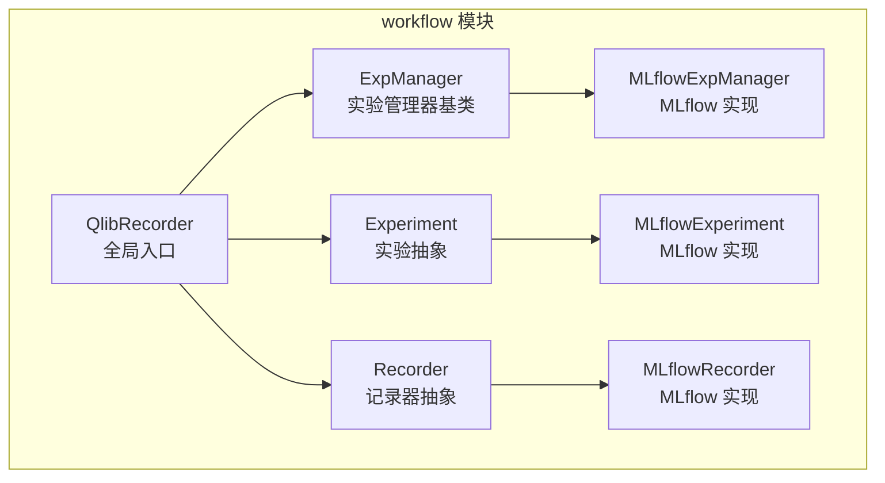
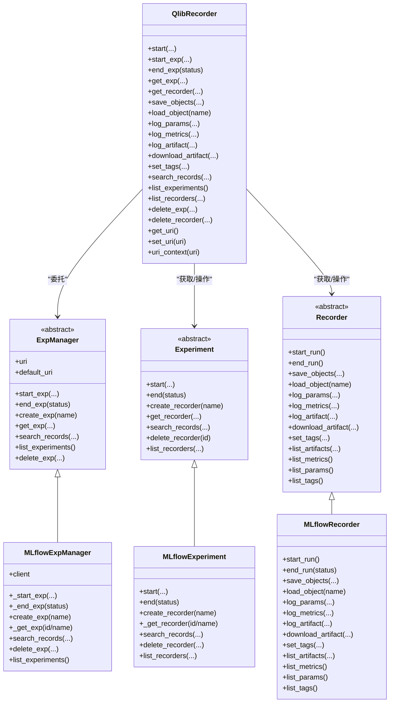
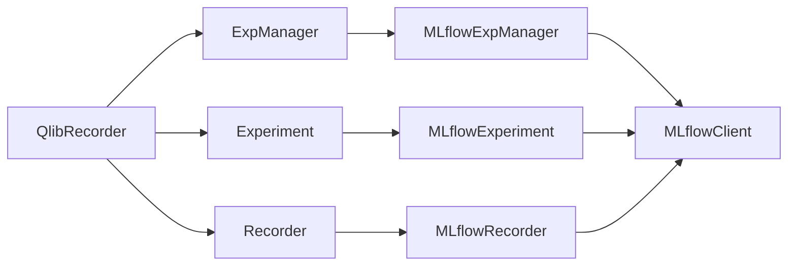
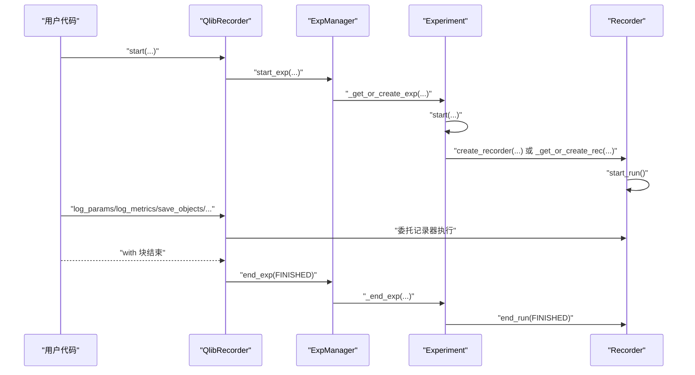

# 实验管理器API

<cite>
**本文档引用的文件**
- [expm.py](file://qlib/workflow/expm.py)
- [exp.py](file://qlib/workflow/exp.py)
- [recorder.py](file://qlib/workflow/recorder.py)
- [__init__.py](file://qlib/workflow/__init__.py)
- [workflow_by_code.py](file://examples/workflow_by_code.py)
- [test_mlflow.py](file://tests/dependency_tests/test_mlflow.py)
</cite>

## 目录
1. [简介](#简介)
2. [项目结构](#项目结构)
3. [核心组件](#核心组件)
4. [架构总览](#架构总览)
5. [详细组件分析](#详细组件分析)
6. [依赖关系分析](#依赖关系分析)
7. [性能考虑](#性能考虑)
8. [故障排除指南](#故障排除指南)
9. [结论](#结论)
10. [附录：使用示例与最佳实践](#附录使用示例与最佳实践)

## 简介
本文件为 Qlib 实验管理器 API 的权威参考文档，围绕 ExperimentManager（在 Qlib 中通过 QlibRecorder 暴露）进行系统化说明。重点覆盖以下方面：
- ExperimentManager 类的核心接口：实验创建、实验检索、实验启动/结束、记录器管理、实验搜索与删除等
- 实验生命周期管理：初始化、状态跟踪、结果保存与对象存取
- 实验配置参数：数据配置、模型配置、回测配置等在实验上下文中的组织方式
- 完整使用示例：从创建实验到配置参数、执行实验、保存结果的典型流程
- 错误处理与异常：常见异常类型、触发条件与建议处理方式

## 项目结构
Qlib 实验管理器位于 workflow 子模块中，核心文件如下：
- expm.py：实验管理器基类与 MLflow 实现
- exp.py：实验与记录器抽象及 MLflow 实现
- recorder.py：记录器抽象及 MLflow 实现
- __init__.py：全局入口 QlibRecorder 及其 API 文档与上下文管理器
- 示例与测试：workflow_by_code.py 展示典型用法；test_mlflow.py 验证客户端创建性能

**图表来源**
- [expm.py:22-434](file://qlib/workflow/expm.py#L22-L434)
- [exp.py:15-380](file://qlib/workflow/exp.py#L15-L380)
- [recorder.py:28-494](file://qlib/workflow/recorder.py#L28-L494)
- [__init__.py:26-682](file://qlib/workflow/__init__.py#L26-L682)

**章节来源**
- [expm.py:22-434](file://qlib/workflow/expm.py#L22-L434)
- [exp.py:15-380](file://qlib/workflow/exp.py#L15-L380)
- [recorder.py:28-494](file://qlib/workflow/recorder.py#L28-L494)
- [__init__.py:26-682](file://qlib/workflow/__init__.py#L26-L682)

## 核心组件
- QlibRecorder：全局入口，提供 start/start_exp/end_exp、get_exp/get_recorder、save_objects/load_object、log_*、search_records/list_experiments 等 API，并通过上下文管理器自动管理实验生命周期
- ExpManager：实验管理器抽象，定义实验的创建、检索、启动、结束、搜索、列举、删除等接口
- MLflowExpManager：基于 MLflow 的实验管理器实现，负责与 MLflow 后端交互
- Experiment：实验抽象，封装记录器生命周期与查询
- MLflowExperiment：基于 MLflow 的实验实现，支持启动/结束、记录器创建与检索、记录搜索、删除记录器
- Recorder：记录器抽象，统一参数/指标/标签/制品的记录与查询
- MLflowRecorder：基于 MLflow 的记录器实现，支持异步日志、对象序列化/反序列化、制品上传下载、状态管理

**章节来源**
- [__init__.py:26-682](file://qlib/workflow/__init__.py#L26-L682)
- [expm.py:22-434](file://qlib/workflow/expm.py#L22-L434)
- [exp.py:15-380](file://qlib/workflow/exp.py#L15-L380)
- [recorder.py:28-494](file://qlib/workflow/recorder.py#L28-L494)

## 架构总览
下图展示了 Qlib 实验管理器的高层架构与调用关系：

**图表来源**
- [__init__.py:26-682](file://qlib/workflow/__init__.py#L26-L682)
- [expm.py:22-434](file://qlib/workflow/expm.py#L22-L434)
- [exp.py:15-380](file://qlib/workflow/exp.py#L15-L380)
- [recorder.py:28-494](file://qlib/workflow/recorder.py#L28-L494)

## 详细组件分析

### QlibRecorder（全局入口）
- 职责
  - 提供 with 上下文管理器 start(...) 自动启动/结束实验
  - 提供 start_exp/end_exp 手动控制实验生命周期
  - 提供 get_exp/get_recorder 获取实验与记录器
  - 提供 save_objects/load_object 对象级制品存取
  - 提供 log_params/log_metrics/log_artifact/set_tags 等实验记录能力
  - 提供 search_records/list_experiments/list_recorders/delete_exp/delete_recorder 等查询与管理能力
  - 提供 get_uri/set_uri/uri_context 统一管理默认追踪 URI
- 关键行为
  - start(...) 内部调用 start_exp 并在异常时将记录器状态置为 FAILED，正常退出置为 FINISHED
  - get_exp 默认自动创建并可选择自动启动实验
  - get_recorder 支持按 id/name 查询或自动创建并启动

**章节来源**
- [__init__.py:37-96](file://qlib/workflow/__init__.py#L37-L96)
- [__init__.py:97-146](file://qlib/workflow/__init__.py#L97-L146)
- [__init__.py:147-163](file://qlib/workflow/__init__.py#L147-L163)
- [__init__.py:242-323](file://qlib/workflow/__init__.py#L242-L323)
- [__init__.py:392-459](file://qlib/workflow/__init__.py#L392-L459)
- [__init__.py:481-540](file://qlib/workflow/__init__.py#L481-L540)
- [__init__.py:542-653](file://qlib/workflow/__init__.py#L542-L653)

### ExperimentManager（实验管理器）
- 抽象接口
  - start_exp：启动实验并设置为活动状态，内部会创建/获取实验并启动其记录器
  - end_exp：结束当前活动实验及其记录器
  - create_exp：创建指定名称的实验（需保证唯一性）
  - get_exp：根据 id/name 获取或创建实验，支持自动启动
  - search_records：按条件搜索记录
  - list_experiments：列出所有未删除的实验
  - delete_exp：删除指定实验
  - uri/default_uri：追踪 URI 的获取与设置
- MLflowExpManager 实现要点
  - 基于 MLflowClient 与 MLflow 后端交互
  - _start_exp/_end_exp 分别完成实验与记录器的启动/结束
  - create_exp 创建实验并返回 MLflowExperiment
  - _get_exp 支持按 id 或 name 获取实验，处理已删除生命周期阶段
  - search_records/list_experiments/delete_exp/list_recorders 委托 MLflowClient

**章节来源**
- [expm.py:46-117](file://qlib/workflow/expm.py#L46-L117)
- [expm.py:119-150](file://qlib/workflow/expm.py#L119-L150)
- [expm.py:152-215](file://qlib/workflow/expm.py#L152-L215)
- [expm.py:217-280](file://qlib/workflow/expm.py#L217-L280)
- [expm.py:282-314](file://qlib/workflow/expm.py#L282-L314)
- [expm.py:317-434](file://qlib/workflow/expm.py#L317-L434)

### Experiment（实验）
- 抽象接口
  - start：启动实验并创建/获取记录器，设置为活动状态
  - end：结束实验并结束活动记录器
  - create_recorder：创建记录器
  - get_recorder：按 id/name 获取或创建记录器，支持自动启动
  - search_records：按条件搜索记录
  - delete_recorder：删除记录器
  - list_recorders：列出记录器（支持字典/列表两种返回类型）
- MLflowExperiment 实现要点
  - start 支持 resume 参数复用已有记录器
  - _get_recorder 支持按 id/name 获取，name 模式下返回最新运行
  - list_recorders 支持按状态过滤与最大数量限制

**章节来源**
- [exp.py:44-72](file://qlib/workflow/exp.py#L44-L72)
- [exp.py:74-87](file://qlib/workflow/exp.py#L74-L87)
- [exp.py:114-176](file://qlib/workflow/exp.py#L114-L176)
- [exp.py:178-216](file://qlib/workflow/exp.py#L178-L216)
- [exp.py:221-240](file://qlib/workflow/exp.py#L221-L240)
- [exp.py:257-273](file://qlib/workflow/exp.py#L257-L273)
- [exp.py:287-315](file://qlib/workflow/exp.py#L287-L315)
- [exp.py:317-323](file://qlib/workflow/exp.py#L317-L323)
- [exp.py:325-338](file://qlib/workflow/exp.py#L325-L338)
- [exp.py:342-379](file://qlib/workflow/exp.py#L342-L379)

### Recorder（记录器）
- 抽象接口
  - start_run/end_run：启动/结束当前运行
  - save_objects/load_object：对象级制品存取
  - log_params/log_metrics/log_artifact/set_tags：参数/指标/制品/标签记录
  - list_artifacts/list_metrics/list_params/list_tags：查询制品与元数据
- MLflowRecorder 实现要点
  - start_run 自动设置追踪 URI、启动运行、记录命令行与环境变量、异步日志
  - end_run 支持状态切换，等待异步队列完成后再结束
  - save_objects 支持直接传入对象或本地路径，自动序列化与上传
  - load_object 支持从制品仓库下载并反序列化
  - 支持 Azure Blob ArtifactRepository 的清理逻辑

**章节来源**
- [recorder.py:105-120](file://qlib/workflow/recorder.py#L105-L120)
- [recorder.py:74-88](file://qlib/workflow/recorder.py#L74-L88)
- [recorder.py:122-142](file://qlib/workflow/recorder.py#L122-L142)
- [recorder.py:144-166](file://qlib/workflow/recorder.py#L144-L166)
- [recorder.py:168-177](file://qlib/workflow/recorder.py#L168-L177)
- [recorder.py:179-192](file://qlib/workflow/recorder.py#L179-L192)
- [recorder.py:194-214](file://qlib/workflow/recorder.py#L194-L214)
- [recorder.py:216-224](file://qlib/workflow/recorder.py#L216-L224)
- [recorder.py:226-234](file://qlib/workflow/recorder.py#L226-L234)
- [recorder.py:236-244](file://qlib/workflow/recorder.py#L236-L244)
- [recorder.py:335-360](file://qlib/workflow/recorder.py#L335-L360)
- [recorder.py:380-395](file://qlib/workflow/recorder.py#L380-L395)
- [recorder.py:397-411](file://qlib/workflow/recorder.py#L397-L411)
- [recorder.py:413-444](file://qlib/workflow/recorder.py#L413-L444)
- [recorder.py:445-461](file://qlib/workflow/recorder.py#L445-L461)
- [recorder.py:475-493](file://qlib/workflow/recorder.py#L475-L493)

## 依赖关系分析
- QlibRecorder 依赖 ExpManager（抽象）与 Experiment/Recorder（具体实现）
- MLflowExpManager 依赖 MLflowClient 与 MLflow 后端
- MLflowExperiment/MLflowRecorder 依赖 MLflow entities 与客户端
- 异常与工具：ExpAlreadyExistError、LoadObjectError、AsyncCaller、TimeInspector 等

**图表来源**
- [__init__.py:26-682](file://qlib/workflow/__init__.py#L26-L682)
- [expm.py:317-434](file://qlib/workflow/expm.py#L317-L434)
- [exp.py:243-380](file://qlib/workflow/exp.py#L243-L380)
- [recorder.py:247-494](file://qlib/workflow/recorder.py#L247-L494)

**章节来源**
- [expm.py:317-434](file://qlib/workflow/expm.py#L317-L434)
- [exp.py:243-380](file://qlib/workflow/exp.py#L243-L380)
- [recorder.py:247-494](file://qlib/workflow/recorder.py#L247-L494)

## 性能考虑
- MLflow 客户端创建开销：测试表明创建 MLflowClient 是轻量级操作，避免缓存实例可减少维护成本
- 异步日志：MLflowRecorder 在 start_run 中启用异步日志，可能带来上传延迟与时间精度偏差，但提升吞吐
- 列表限制：MLflow 列表记录存在上限，MLflowExperiment.list_recorders 提供最大结果数与状态过滤参数

**章节来源**
- [test_mlflow.py:18-34](file://tests/dependency_tests/test_mlflow.py#L18-L34)
- [recorder.py:350-355](file://qlib/workflow/recorder.py#L350-L355)
- [exp.py:340-379](file://qlib/workflow/exp.py#L340-L379)

## 故障排除指南
- 实验已存在异常
  - 触发：尝试创建同名实验且后端已存在
  - 处理：捕获 ExpAlreadyExistError，改为获取现有实验或更换名称
- 记录器初始化异常
  - 触发：在 Qlib 已激活实验的情况下重新初始化
  - 处理：避免在实验运行期间重置 Qlib，确保实验路径一致
- 对象加载异常
  - 触发：制品下载或反序列化失败
  - 处理：捕获 LoadObjectError，检查制品路径与对象格式
- URI 设置问题
  - 触发：使用相对路径或不被后端支持的 URI 形式
  - 处理：使用绝对路径，遵循 uri_context 语义临时切换默认 URI

**章节来源**
- [expm.py:356-363](file://qlib/workflow/expm.py#L356-L363)
- [__init__.py:656-668](file://qlib/workflow/__init__.py#L656-L668)
- [recorder.py:413-444](file://qlib/workflow/recorder.py#L413-L444)
- [__init__.py:361-390](file://qlib/workflow/__init__.py#L361-L390)

## 结论
Qlib 实验管理器通过 QlibRecorder 将实验与记录器的生命周期、参数/指标/标签/制品管理统一在一个简洁一致的 API 下，同时保留对 MLflow 的深度集成与扩展能力。开发者可基于该体系快速构建可重复、可观测、可追溯的实验流程。

## 附录：使用示例与最佳实践

### 典型使用流程（创建实验 → 配置参数 → 执行实验 → 保存结果）
- 使用 with 上下文自动管理实验生命周期
- 在实验内记录参数、指标、标签与制品
- 通过记录器保存/加载对象，支持直接传入对象或本地路径
- 结束后可通过 search_records/list_experiments 进行查询与分析

**图表来源**
- [__init__.py:37-96](file://qlib/workflow/__init__.py#L37-L96)
- [expm.py:46-117](file://qlib/workflow/expm.py#L46-L117)
- [exp.py:257-273](file://qlib/workflow/exp.py#L257-L273)
- [recorder.py:335-395](file://qlib/workflow/recorder.py#L335-L395)

**章节来源**
- [workflow_by_code.py:67-86](file://examples/workflow_by_code.py#L67-L86)
- [__init__.py:542-653](file://qlib/workflow/__init__.py#L542-L653)
- [recorder.py:397-444](file://qlib/workflow/recorder.py#L397-L444)

### 实验配置参数组织建议
- 数据配置：通过数据集准备与预处理流程在实验上下文中完成，参数通过 log_params 记录
- 模型配置：模型超参、训练策略等通过 log_params 记录，便于后续搜索与对比
- 回测配置：回测参数与结果指标通过 log_metrics 记录，回测报告作为制品保存

### 错误处理与异常
- 实验创建冲突：捕获 ExpAlreadyExistError，回退到获取现有实验
- 对象加载失败：捕获 LoadObjectError，检查制品路径与对象序列化格式
- URI 不一致：使用 uri_context 临时切换默认 URI，避免跨进程/跨会话路径漂移

**章节来源**
- [expm.py:232-245](file://qlib/workflow/expm.py#L232-L245)
- [recorder.py:413-444](file://qlib/workflow/recorder.py#L413-L444)
- [__init__.py:372-390](file://qlib/workflow/__init__.py#L372-L390)