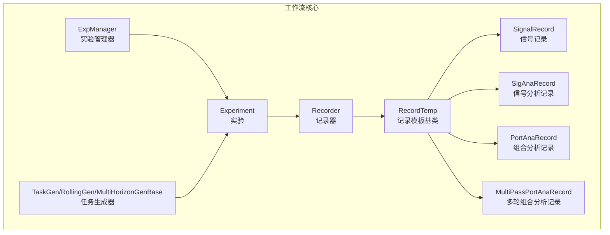
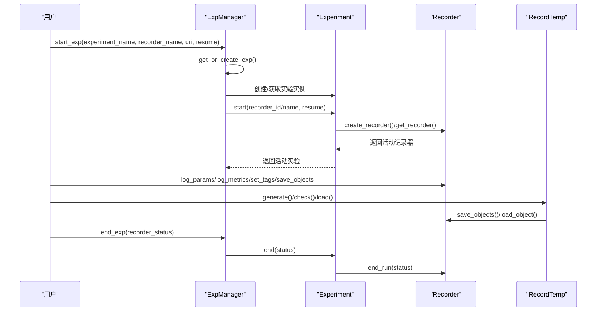
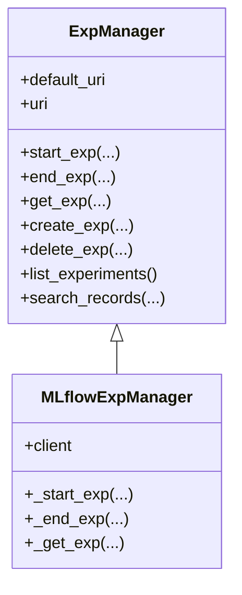
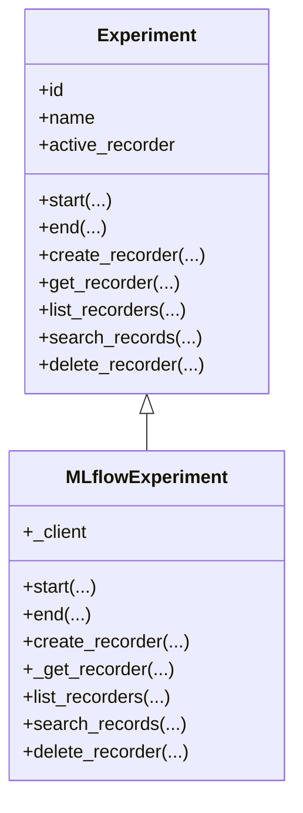
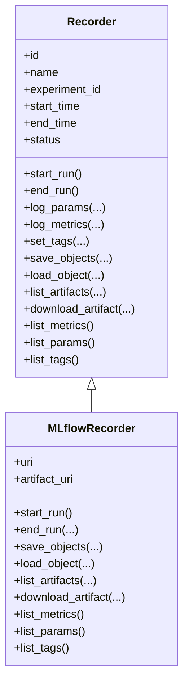
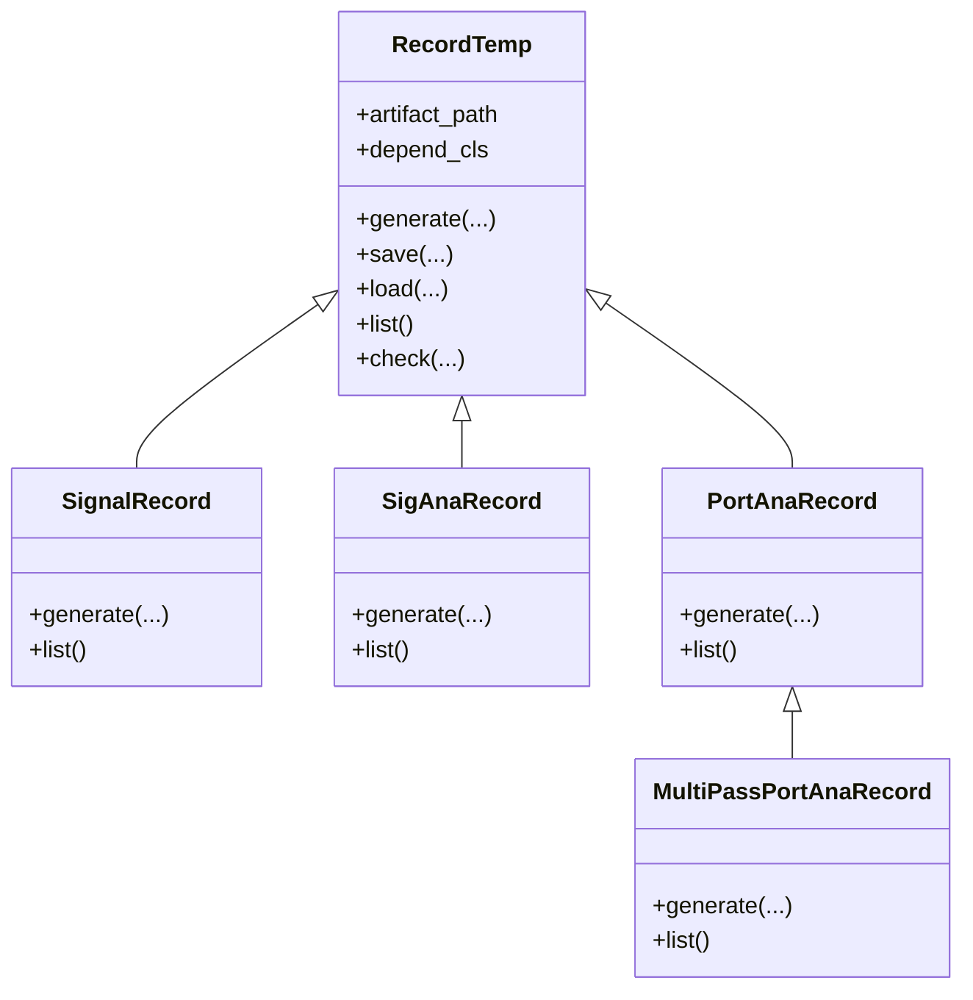
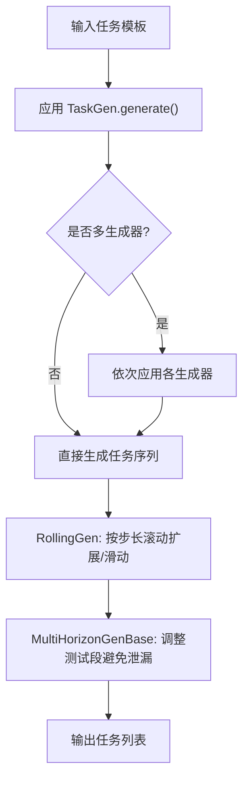
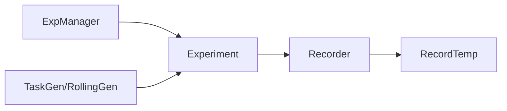

# 工作流API

<cite>
**本文引用的文件**
- [expm.py](file://qlib/workflow/expm.py)
- [exp.py](file://qlib/workflow/exp.py)
- [recorder.py](file://qlib/workflow/recorder.py)
- [record_temp.py](file://qlib/workflow/record_temp.py)
- [gen.py](file://qlib/workflow/task/gen.py)
- [task_management.rst](file://docs/advanced/task_management.rst)
- [workflow.rst](file://docs/component/workflow.rst)
- [workflow.py](file://examples/workflow_by_code.py)
</cite>

## 目录
1. [简介](#简介)
2. [项目结构](#项目结构)
3. [核心组件](#核心组件)
4. [架构总览](#架构总览)
5. [详细组件分析](#详细组件分析)
6. [依赖分析](#依赖分析)
7. [性能考虑](#性能考虑)
8. [故障排查指南](#故障排查指南)
9. [结论](#结论)
10. [附录：使用示例](#附录使用示例)

## 简介
本文件为 Qlib 工作流API的权威参考，聚焦以下能力：
- 实验管理器（Experiment Manager）：负责实验的创建、检索、激活、结束与记录查询。
- 实验（Experiment）：封装一次研究或训练的生命周期，支持记录器（Recorder）的创建、启动、停止与查询。
- 记录器（Recorder）：统一记录参数、指标、标签、模型与预测等产物，并支持异步日志与对象存取。
- 记录模板（Record Template）：以“记录模板”形式生成标准化的信号分析、组合分析、多轮回测等结果。
- 任务管理（Task Management）：任务生成（RollingGen、MultiHorizonGenBase）、任务存储与调度、任务收集。

本参考文档在不展示具体代码的前提下，通过源码路径定位与图示化解释，帮助读者快速掌握API用法与最佳实践。

## 项目结构
工作流API主要分布在 qlib/workflow 目录下，配合文档目录中的 workflow 组件与高级主题文档，形成从概念到实现的完整知识体系。

图表来源
- [expm.py:22-117](file://qlib/workflow/expm.py#L22-L117)
- [exp.py:15-112](file://qlib/workflow/exp.py#L15-L112)
- [recorder.py:28-121](file://qlib/workflow/recorder.py#L28-L121)
- [record_temp.py:28-119](file://qlib/workflow/record_temp.py#L28-L119)
- [gen.py:53-92](file://qlib/workflow/task/gen.py#L53-L92)

章节来源
- [expm.py:22-117](file://qlib/workflow/expm.py#L22-L117)
- [exp.py:15-112](file://qlib/workflow/exp.py#L15-L112)
- [recorder.py:28-121](file://qlib/workflow/recorder.py#L28-L121)
- [record_temp.py:28-119](file://qlib/workflow/record_temp.py#L28-L119)
- [gen.py:53-92](file://qlib/workflow/task/gen.py#L53-L92)

## 核心组件
- 实验管理器（ExpManager）
  - 职责：维护默认跟踪URI、当前活动实验、实验的创建/检索/删除、记录查询、实验列表等。
  - 关键方法：start_exp、end_exp、create_exp、get_exp、delete_exp、list_experiments、search_records。
  - 默认实现：MLflowExpManager 基于 MLflow 客户端完成实验与运行的生命周期管理。
- 实验（Experiment）
  - 职责：封装单次实验的生命周期；管理活动记录器；提供记录器的创建、获取、删除与查询。
  - 关键方法：start、end、create_recorder、get_recorder、list_recorders、search_records、delete_recorder。
  - 默认实现：MLflowExperiment 使用 MLflowRecorder。
- 记录器（Recorder）
  - 职责：统一记录参数、指标、标签、制品（Artifacts），支持对象序列化/反序列化、异步日志、下载制品等。
  - 关键方法：start_run、end_run、log_params、log_metrics、set_tags、save_objects、load_object、list_artifacts、download_artifact、list_metrics/list_params/list_tags。
  - 默认实现：MLflowRecorder 基于 MLflow 的客户端进行日志与制品管理。
- 记录模板（RecordTemp 及其子类）
  - 职责：按约定格式生成并保存分析结果（如信号、IC、组合分析、多轮回测统计），自动检查依赖与缓存。
  - 关键类：SignalRecord、SigAnaRecord、PortAnaRecord、MultiPassPortAnaRecord、ACRecordTemp。
- 任务管理（Task Management）
  - 职责：基于模板生成不同任务（滚动、多时序窗口、多损失等），并可与 MongoDB 集成进行任务存储与调度。
  - 关键类：TaskGen、RollingGen、MultiHorizonGenBase；配合 TaskManager（见高级文档）。

章节来源
- [expm.py:22-117](file://qlib/workflow/expm.py#L22-L117)
- [exp.py:15-112](file://qlib/workflow/exp.py#L15-L112)
- [recorder.py:28-121](file://qlib/workflow/recorder.py#L28-L121)
- [record_temp.py:28-119](file://qlib/workflow/record_temp.py#L28-L119)
- [gen.py:53-92](file://qlib/workflow/task/gen.py#L53-L92)

## 架构总览
下图展示了从实验管理器到实验、记录器与记录模板的整体调用链路，以及任务生成对实验的影响。

图表来源
- [expm.py:46-117](file://qlib/workflow/expm.py#L46-L117)
- [exp.py:44-112](file://qlib/workflow/exp.py#L44-L112)
- [recorder.py:105-121](file://qlib/workflow/recorder.py#L105-L121)
- [record_temp.py:68-119](file://qlib/workflow/record_temp.py#L68-L119)

## 详细组件分析

### 实验管理器（ExpManager）API
- 默认URI与当前URI
  - 默认URI来自全局配置；当前URI优先于默认URI，用于临时覆盖。
- 实验生命周期
  - start_exp：获取或创建实验，设置为活动实验并启动其记录器。
  - end_exp：结束活动实验并清理状态。
  - get_exp：根据ID/名称获取活动实验或默认实验；支持创建新实验。
  - create_exp/delete_exp：创建/删除实验。
  - list_experiments/search_records：列出实验、搜索记录。
- 并发与一致性
  - 文件系统后端使用文件锁避免并发重复创建实验。
  - HTTP 后端通过二次校验避免冲突。

图表来源
- [expm.py:22-117](file://qlib/workflow/expm.py#L22-L117)
- [expm.py:317-434](file://qlib/workflow/expm.py#L317-L434)

章节来源
- [expm.py:282-304](file://qlib/workflow/expm.py#L282-L304)
- [expm.py:46-117](file://qlib/workflow/expm.py#L46-L117)
- [expm.py:317-434](file://qlib/workflow/expm.py#L317-L434)

### 实验（Experiment）API
- 活动记录器管理
  - active_recorder：同一时间仅允许一个活动记录器。
  - get_recorder/create_recorder/start/end/delete_recorder/list_recorders/search_records：记录器的创建、获取、启动、结束、删除、枚举与记录查询。
- MLflow 实现要点
  - 通过 MLflow 客户端检索/创建运行，支持按名称/ID 获取最新运行。
  - 支持过滤与排序，限制最大返回条数。

图表来源
- [exp.py:15-112](file://qlib/workflow/exp.py#L15-L112)
- [exp.py:243-380](file://qlib/workflow/exp.py#L243-L380)

章节来源
- [exp.py:44-112](file://qlib/workflow/exp.py#L44-L112)
- [exp.py:243-380](file://qlib/workflow/exp.py#L243-L380)

### 记录器（Recorder）API
- 运行生命周期
  - start_run：启动/恢复运行，记录开始时间与状态，自动记录未提交代码与必要环境变量。
  - end_run：结束运行，等待异步日志队列，更新结束时间与状态。
- 日志与制品
  - log_params/log_metrics/set_tags：批量记录参数、指标与标签。
  - save_objects/load_object：序列化对象并保存为制品，或从制品加载对象。
  - list_artifacts/download_artifact：列出与下载制品。
  - list_metrics/list_params/list_tags：查询已记录的指标、参数与标签。
- 异步日志
  - 通过异步调用器延迟上传，提升吞吐但可能影响日志实时性。

图表来源
- [recorder.py:28-121](file://qlib/workflow/recorder.py#L28-L121)
- [recorder.py:247-494](file://qlib/workflow/recorder.py#L247-L494)

章节来源
- [recorder.py:105-121](file://qlib/workflow/recorder.py#L105-L121)
- [recorder.py:335-396](file://qlib/workflow/recorder.py#L335-L396)
- [recorder.py:397-494](file://qlib/workflow/recorder.py#L397-L494)

### 记录模板（RecordTemp）API
- 通用能力
  - generate：生成并保存标准化结果；load/check/list 提供便捷的对象读取、依赖检查与制品清单。
  - artifact_path/depend_cls：定义制品相对路径与依赖父类。
- 典型模板
  - SignalRecord：保存预测与标签。
  - SigAnaRecord：计算IC/ICIR、长短期收益等并记录指标。
  - PortAnaRecord：执行回测并产出报告、头寸、风险与指标分析。
  - MultiPassPortAnaRecord：多轮回测聚合统计（均值、标准差、均值/标准差）。
  - ACRecordTemp：带存在性检查的自动生成器基类。

图表来源
- [record_temp.py:28-119](file://qlib/workflow/record_temp.py#L28-L119)
- [record_temp.py:161-210](file://qlib/workflow/record_temp.py#L161-L210)
- [record_temp.py:295-356](file://qlib/workflow/record_temp.py#L295-L356)
- [record_temp.py:358-573](file://qlib/workflow/record_temp.py#L358-L573)
- [record_temp.py:575-694](file://qlib/workflow/record_temp.py#L575-L694)

章节来源
- [record_temp.py:49-119](file://qlib/workflow/record_temp.py#L49-L119)
- [record_temp.py:161-210](file://qlib/workflow/record_temp.py#L161-L210)
- [record_temp.py:295-356](file://qlib/workflow/record_temp.py#L295-L356)
- [record_temp.py:358-573](file://qlib/workflow/record_temp.py#L358-L573)
- [record_temp.py:575-694](file://qlib/workflow/record_temp.py#L575-L694)

### 任务管理（Task Management）API
- 任务生成
  - TaskGen：抽象任务生成器，支持组合多个生成器。
  - RollingGen：按滚动窗口生成任务序列，支持扩展/滑动两种模式，可截断避免未来信息泄漏。
  - MultiHorizonGenBase：基于多时序窗口生成任务，调整测试段避免标签泄漏。
- 任务存储与调度
  - 高级文档指出：任务可持久化至 MongoDB，TaskManager 支持任务的自动拉取、生命周期管理与错误处理。
- 示例与配置
  - 参考高级文档中的任务生成流程图与初始化配置说明。

图表来源
- [gen.py:16-51](file://qlib/workflow/task/gen.py#L16-L51)
- [gen.py:140-302](file://qlib/workflow/task/gen.py#L140-L302)
- [gen.py:304-351](file://qlib/workflow/task/gen.py#L304-L351)

章节来源
- [gen.py:53-92](file://qlib/workflow/task/gen.py#L53-L92)
- [gen.py:140-302](file://qlib/workflow/task/gen.py#L140-L302)
- [gen.py:304-351](file://qlib/workflow/task/gen.py#L304-L351)
- [task_management.rst:1-59](file://docs/advanced/task_management.rst#L1-L59)

## 依赖分析
- 组件耦合
  - ExpManager 依赖 Experiment；Experiment 依赖 Recorder；RecordTemp 依赖 Recorder。
  - 任务生成器独立于实验管理器，但最终会驱动实验内的记录器写入制品。
- 外部依赖
  - MLflow 客户端用于实验与运行的创建、查询与删除；文件锁用于本地文件系统并发控制。
- 循环依赖
  - 未发现循环导入；模块职责清晰，接口边界明确。

图表来源
- [expm.py:13-17](file://qlib/workflow/expm.py#L13-L17)
- [exp.py:9-12](file://qlib/workflow/exp.py#L9-L12)
- [recorder.py:16-23](file://qlib/workflow/recorder.py#L16-L23)
- [gen.py:7-14](file://qlib/workflow/task/gen.py#L7-L14)

章节来源
- [expm.py:13-17](file://qlib/workflow/expm.py#L13-L17)
- [exp.py:9-12](file://qlib/workflow/exp.py#L9-L12)
- [recorder.py:16-23](file://qlib/workflow/recorder.py#L16-L23)
- [gen.py:7-14](file://qlib/workflow/task/gen.py#L7-L14)

## 性能考虑
- 异步日志
  - Recorder 内置异步调用器，减少频繁上传的阻塞，但可能导致日志落盘延迟与时间戳不精确。
- 列表限制
  - MLflow 实验记录列表存在上限（例如 50000），建议使用过滤条件缩小范围。
- 并发控制
  - 文件系统后端采用文件锁避免重复创建；HTTP 后端通过二次校验降低冲突概率。
- 任务生成
  - 滚动生成会产生大量任务，建议结合 MongoDB 存储与分批调度，避免内存与网络压力。

## 故障排查指南
- 实验/记录器不存在
  - get_exp/get_recorder 抛出异常时，确认实验/记录器名称或ID是否正确，或先调用 create_* 创建。
- 并发创建冲突
  - 文件系统后端出现重复创建：检查文件锁是否生效；HTTP 后端出现冲突：捕获特定异常并重试。
- 记录器未启动
  - save_objects/load_object 前需确保记录器已 start_run；否则会触发断言错误。
- MLflow 限制
  - 参数值长度扩展：已放宽默认限制；列表数量受限：使用 filter_string 与分页策略。
- 任务生成异常
  - 滚动窗口越界或段配置错误：检查 segments 对齐与截断逻辑；必要时使用工具类修正。

章节来源
- [expm.py:217-246](file://qlib/workflow/expm.py#L217-L246)
- [exp.py:196-217](file://qlib/workflow/exp.py#L196-L217)
- [recorder.py:397-494](file://qlib/workflow/recorder.py#L397-L494)
- [gen.py:126-139](file://qlib/workflow/task/gen.py#L126-L139)

## 结论
Qlib 工作流API通过“实验管理器—实验—记录器—记录模板”的分层设计，提供了从实验生命周期管理到结果标准化产出的完整闭环。结合任务生成与存储调度能力，用户可在本地或集群环境中高效组织与复现实验工作流。建议在生产中：
- 明确默认与当前URI策略，合理使用活动实验与记录器。
- 使用记录模板统一分析流程，减少重复代码。
- 在任务生成阶段充分考虑数据对齐与信息泄露防护。
- 利用异步日志与过滤策略优化性能与可观测性。

## 附录：使用示例
以下示例以“路径+行号”形式给出，便于对照源码理解调用顺序与参数含义。

- 实验创建与启动
  - 获取/创建实验并启动：[expm.py:152-215](file://qlib/workflow/expm.py#L152-L215)
  - 启动实验并创建/获取记录器：[exp.py:257-273](file://qlib/workflow/exp.py#L257-L273)
- 记录参数与指标
  - 启动记录器并记录参数/指标：[recorder.py:335-360](file://qlib/workflow/recorder.py#L335-L360)
  - 批量记录与异步上传：[recorder.py:446-461](file://qlib/workflow/recorder.py#L446-L461)
- 保存与加载对象
  - 保存对象为制品：[recorder.py:397-412](file://qlib/workflow/recorder.py#L397-L412)
  - 从制品加载对象：[recorder.py:413-444](file://qlib/workflow/recorder.py#L413-L444)
- 生成分析结果
  - 信号记录与分析：[record_temp.py:190-209](file://qlib/workflow/record_temp.py#L190-L209)、[record_temp.py:259-293](file://qlib/workflow/record_temp.py#L259-L293)
  - 组合分析与风险/指标分析：[record_temp.py:465-550](file://qlib/workflow/record_temp.py#L465-L550)
- 任务生成与调度
  - 滚动任务生成：[gen.py:228-302](file://qlib/workflow/task/gen.py#L228-L302)
  - 多时序窗口任务生成：[gen.py:338-351](file://qlib/workflow/task/gen.py#L338-L351)
  - 文档中的任务管理流程与配置：[task_management.rst:1-59](file://docs/advanced/task_management.rst#L1-L59)
- 代码示例入口
  - 通过代码运行工作流示例：[workflow.py](file://examples/workflow_by_code.py)