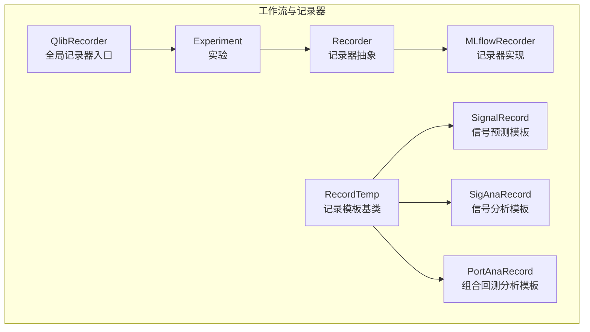
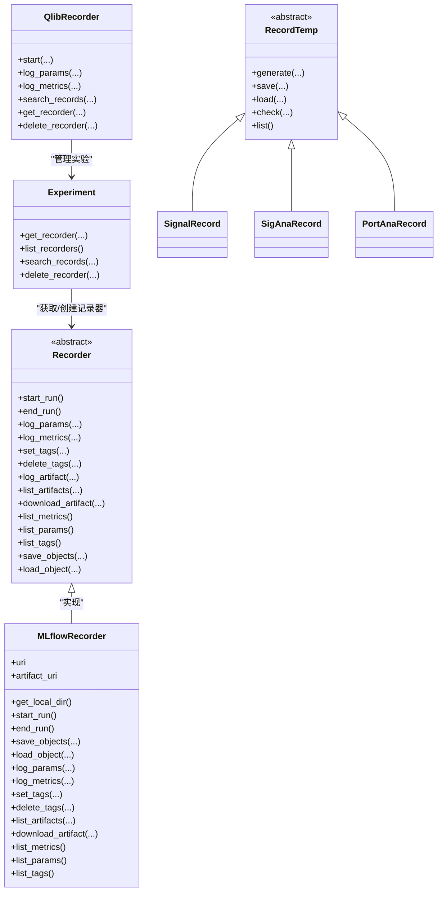
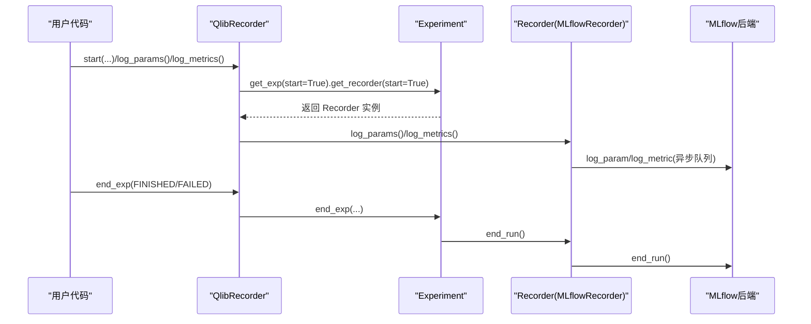
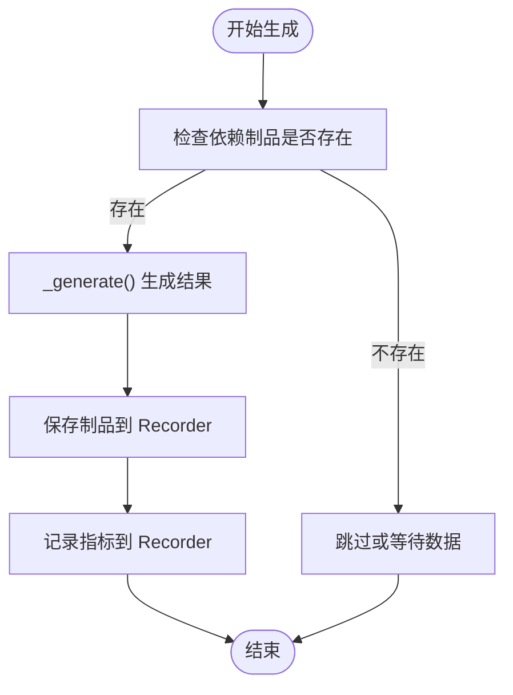
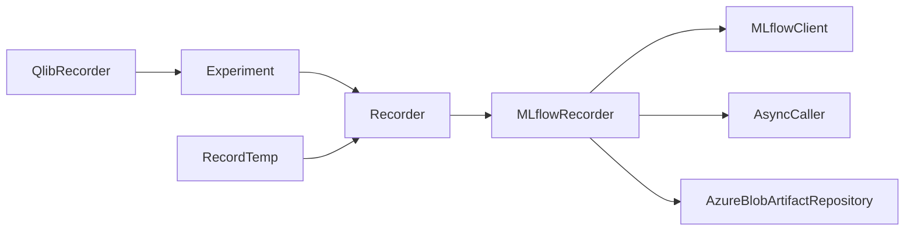

# 记录器API

<cite>
**本文引用的文件**
- [recorder.py](file://qlib/workflow/recorder.py)
- [__init__.py](file://qlib/workflow/__init__.py)
- [exp.py](file://qlib/workflow/exp.py)
- [expm.py](file://qlib/workflow/expm.py)
- [record_temp.py](file://qlib/workflow/record_temp.py)
- [recorder.rst](file://docs/component/recorder.rst)
</cite>

## 目录
1. [简介](#简介)
2. [项目结构](#项目结构)
3. [核心组件](#核心组件)
4. [架构总览](#架构总览)
5. [详细组件分析](#详细组件分析)
6. [依赖分析](#依赖分析)
7. [性能考虑](#性能考虑)
8. [故障排查指南](#故障排查指南)
9. [结论](#结论)
10. [附录：使用示例与最佳实践](#附录使用示例与最佳实践)

## 简介
本文件为 Qlib 记录器（Recorder）API 的权威参考文档，聚焦于实验记录与管理能力，覆盖以下主题：
- Recorder 类的核心接口：记录创建、记录写入、记录读取、对象存取、标签与指标管理、制品（Artifacts）管理等
- 实验记录管理：实验参数、实验结果、实验日志的记录与检索
- 记录格式与模板：记录模板、记录字段、记录类型与依赖关系
- 存储与持久化：基于 MLflow 的记录持久化、制品上传下载、异步日志与资源清理
- 使用示例：从创建记录器到配置记录模板、记录实验数据的完整流程

## 项目结构
与记录器 API 相关的关键模块如下：
- 记录器核心类与实现：qlib/workflow/recorder.py
- 全局记录器入口与常用 API：qlib/workflow/__init__.py
- 实验与记录器生命周期管理：qlib/workflow/exp.py、qlib/workflow/expm.py
- 记录模板与结果生成：qlib/workflow/record_temp.py
- 文档与概览：docs/component/recorder.rst

图表来源
- [recorder.py:28-494](file://qlib/workflow/recorder.py#L28-L494)
- [__init__.py:26-163](file://qlib/workflow/__init__.py#L26-L163)
- [exp.py:114-199](file://qlib/workflow/exp.py#L114-L199)
- [record_temp.py:28-119](file://qlib/workflow/record_temp.py#L28-L119)

章节来源
- [recorder.py:28-494](file://qlib/workflow/recorder.py#L28-L494)
- [__init__.py:26-163](file://qlib/workflow/__init__.py#L26-L163)
- [exp.py:114-199](file://qlib/workflow/exp.py#L114-L199)
- [record_temp.py:28-119](file://qlib/workflow/record_temp.py#L28-L119)

## 核心组件
本节对记录器体系中的关键类与接口进行系统梳理。

- Recorder 抽象类
  - 职责：统一记录器接口，定义实验运行状态、参数/指标/标签/制品等记录与查询能力
  - 关键属性：id、name、experiment_id、start_time、end_time、status
  - 关键方法：start_run、end_run、log_params、log_metrics、set_tags、delete_tags、log_artifact、list_artifacts、download_artifact、list_metrics、list_params、list_tags、save_objects、load_object
- MLflowRecorder 实现类
  - 基于 MLflow 的具体实现，封装参数、指标、标签、制品的上传与下载；支持异步日志与本地目录解析
  - 关键特性：自动记录未提交代码差异、自动记录命令行参数与特定环境变量、异步日志队列、Azure Blob 临时文件清理
- QlibRecorder 入口类
  - 提供 start/stop 上下文管理、log_params/log_metrics 快捷接口、搜索记录、获取/删除记录器等
- RecordTemp 模板基类与子类
  - 提供统一的“生成-保存-加载-检查”流程，内置依赖链与路径拼接规则
  - 子类：SignalRecord（预测与标签）、SigAnaRecord（IC/ICIR/Rank IC/长短期收益等分析）、PortAnaRecord（多频度回测与风险/指标分析）

章节来源
- [recorder.py:28-494](file://qlib/workflow/recorder.py#L28-L494)
- [__init__.py:26-163](file://qlib/workflow/__init__.py#L26-L163)
- [record_temp.py:28-119](file://qlib/workflow/record_temp.py#L28-L119)

## 架构总览
记录器体系采用“入口层（QlibRecorder）—实验层（Experiment）—记录器层（Recorder 抽象/MLflowRecorder 实现）—模板层（RecordTemp 及其子类）”的分层设计，配合 MLflow 后端完成实验参数、指标、标签与制品的持久化与检索。

图表来源
- [recorder.py:28-494](file://qlib/workflow/recorder.py#L28-L494)
- [__init__.py:26-163](file://qlib/workflow/__init__.py#L26-L163)
- [exp.py:114-199](file://qlib/workflow/exp.py#L114-L199)
- [record_temp.py:28-119](file://qlib/workflow/record_temp.py#L28-L119)

## 详细组件分析

### Recorder 抽象类与 MLflowRecorder 实现
- 接口职责
  - 生命周期：start_run/end_run 控制实验运行状态与时间戳
  - 参数/指标/标签：log_params/log_metrics/set_tags/delete_tags 统一记录与更新
  - 制品管理：log_artifact/list_artifacts/download_artifact 支持文件/目录上传与下载
  - 对象存取：save_objects/load_object 支持 Python 对象序列化与反序列化
- MLflowRecorder 特性
  - 自动记录未提交代码差异（diff/status/cached）
  - 自动记录命令行参数与特定环境变量
  - 异步日志队列（AsyncCaller），提升上传吞吐并注意时间准确性
  - Azure Blob 场景下的临时文件清理，节省磁盘空间
  - 本地目录解析（get_local_dir），便于直接访问本地制品

图表来源
- [__init__.py:37-95](file://qlib/workflow/__init__.py#L37-L95)
- [exp.py:114-176](file://qlib/workflow/exp.py#L114-L176)
- [recorder.py:335-396](file://qlib/workflow/recorder.py#L335-L396)

章节来源
- [recorder.py:28-494](file://qlib/workflow/recorder.py#L28-L494)
- [__init__.py:37-95](file://qlib/workflow/__init__.py#L37-L95)
- [exp.py:114-176](file://qlib/workflow/exp.py#L114-L176)

### 记录模板（RecordTemp）与子类
- RecordTemp 基类
  - 统一 save/load/check/list 流程，支持 artifact_path 与依赖类（depend_cls）递归查找
  - 通过 recorder.save_objects/load_object 完成制品的保存与加载
- SignalRecord
  - 生成并保存模型预测与标签（如可用）
- SigAnaRecord
  - 基于预测与标签计算 IC/ICIR/Rank IC/长短期收益等指标，并记录为制品
- PortAnaRecord
  - 执行回测并产出报告、仓位、风险分析与指标分析，按频率维度组织制品

图表来源
- [record_temp.py:161-210](file://qlib/workflow/record_temp.py#L161-L210)
- [record_temp.py:295-355](file://qlib/workflow/record_temp.py#L295-L355)
- [record_temp.py:358-572](file://qlib/workflow/record_temp.py#L358-L572)

章节来源
- [record_temp.py:28-119](file://qlib/workflow/record_temp.py#L28-L119)
- [record_temp.py:161-210](file://qlib/workflow/record_temp.py#L161-L210)
- [record_temp.py:295-355](file://qlib/workflow/record_temp.py#L295-L355)
- [record_temp.py:358-572](file://qlib/workflow/record_temp.py#L358-L572)

### 实验与记录器管理
- Experiment.get_recorder
  - 支持根据 id/name 获取或创建记录器；支持创建后自动启动为活动记录器
- Experiment.search_records/delete_recorder
  - 提供按条件检索记录与删除记录器的能力
- QlibRecorder.get_recorder/delete_recorder
  - 提供全局入口，简化记录器获取与删除

章节来源
- [exp.py:114-199](file://qlib/workflow/exp.py#L114-L199)
- [__init__.py:444-479](file://qlib/workflow/__init__.py#L444-L479)

## 依赖分析
- 组件耦合
  - QlibRecorder 依赖 Experiment 管理实验；Experiment 依赖 Recorder 抽象；MLflowRecorder 作为具体实现
  - RecordTemp 通过 Recorder 完成制品的保存与加载，形成“模板—记录器”的弱耦合依赖
- 外部依赖
  - MLflow 客户端用于参数、指标、标签与制品的上传与下载
  - 异步调用器（AsyncCaller）用于异步日志队列
  - Azure Blob ArtifactRepository 在制品下载后清理临时文件

图表来源
- [recorder.py:247-494](file://qlib/workflow/recorder.py#L247-L494)
- [__init__.py:26-163](file://qlib/workflow/__init__.py#L26-L163)
- [record_temp.py:28-119](file://qlib/workflow/record_temp.py#L28-L119)

章节来源
- [recorder.py:247-494](file://qlib/workflow/recorder.py#L247-L494)
- [__init__.py:26-163](file://qlib/workflow/__init__.py#L26-L163)
- [record_temp.py:28-119](file://qlib/workflow/record_temp.py#L28-L119)

## 性能考虑
- 异步日志
  - 通过 AsyncCaller 将日志写入队列，减少阻塞；注意结束时需等待队列清空（end_run 内部已处理）
- 制品上传
  - 文件/目录上传采用 MLflow 客户端；建议控制制品大小，避免频繁大文件传输
- 本地目录解析
  - get_local_dir 仅在 artifact_uri 为本地路径时有效，跨平台路径解析需谨慎
- 环境变量与命令行
  - 自动记录命令行参数与特定环境变量，便于复现实验，但应避免记录敏感信息

[本节为通用指导，不直接分析具体文件]

## 故障排查指南
- 常见异常与定位
  - 未启动记录器即调用 save_objects/load_object：会触发断言错误，确保先 start_run
  - 下载制品后临时文件清理：Azure Blob 场景会清理临时目录，避免重复占用磁盘
  - 未提交代码差异记录失败：若当前目录非 Git 仓库或权限不足，会记录告警信息
- 建议排查步骤
  - 确认记录器已启动（start_run）且状态正常
  - 检查 tracking URI 与 artifact URI 配置一致性
  - 使用 list_artifacts/list_metrics/list_params 验证数据是否正确上传
  - 使用 load_object/download_artifact 验证制品可读性

章节来源
- [recorder.py:397-444](file://qlib/workflow/recorder.py#L397-L444)
- [recorder.py:475-493](file://qlib/workflow/recorder.py#L475-L493)

## 结论
Qlib 记录器 API 以 Recorder 抽象为核心，结合 MLflow 实现，提供了参数、指标、标签与制品的一体化管理能力；配合 RecordTemp 模板，能够高效生成并保存实验结果（预测、分析、回测）。通过 QlibRecorder 入口，用户可以便捷地在上下文中记录实验数据，并利用模板化流程自动化生成分析结果。

[本节为总结性内容，不直接分析具体文件]

## 附录：使用示例与最佳实践
- 创建记录器与记录参数/指标
  - 使用 QlibRecorder.start 上下文管理器启动实验与记录器
  - 使用 log_params/log_metrics 记录超参与训练指标
- 配置记录模板
  - 使用 SignalRecord 生成预测与标签制品
  - 使用 SigAnaRecord 计算 IC/ICIR/Rank IC/长短期收益并记录
  - 使用 PortAnaRecord 执行回测并产出报告、风险分析与指标分析
- 检索与清理
  - 使用 Experiment.search_records 按条件检索记录
  - 使用 Experiment.delete_recorder 删除指定记录器

章节来源
- [__init__.py:37-95](file://qlib/workflow/__init__.py#L37-L95)
- [__init__.py:565-590](file://qlib/workflow/__init__.py#L565-L590)
- [exp.py:89-112](file://qlib/workflow/exp.py#L89-L112)
- [exp.py:103-112](file://qlib/workflow/exp.py#L103-L112)
- [record_temp.py:161-210](file://qlib/workflow/record_temp.py#L161-L210)
- [record_temp.py:295-355](file://qlib/workflow/record_temp.py#L295-L355)
- [record_temp.py:358-572](file://qlib/workflow/record_temp.py#L358-L572)
- [recorder.rst:44-92](file://docs/component/recorder.rst#L44-L92)