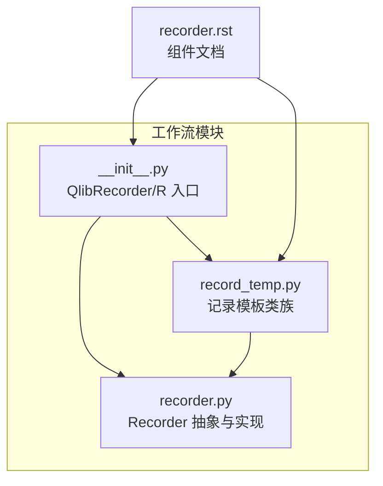
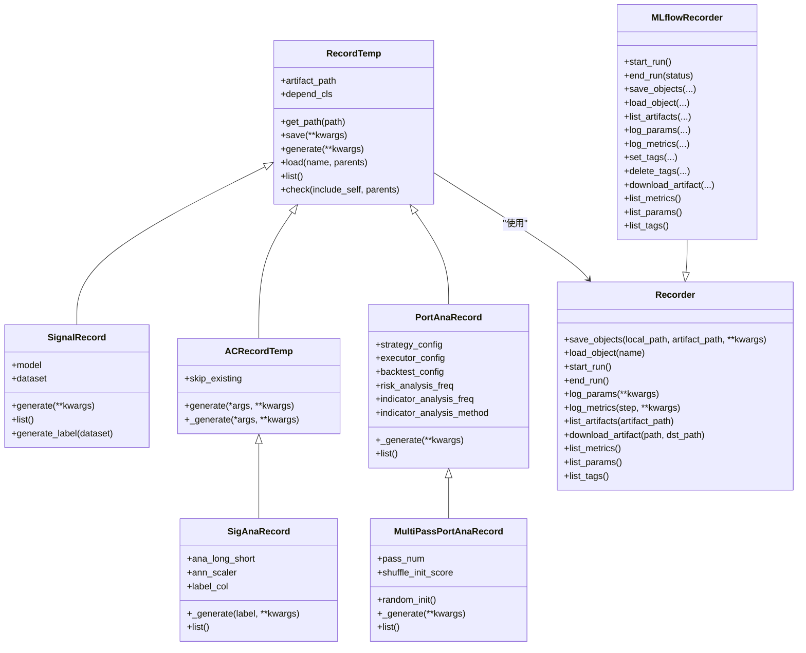
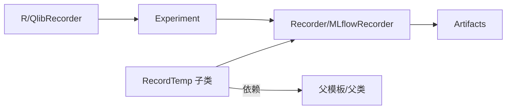

# 记录模板API

<cite>
**本文引用的文件**
- [record_temp.py](file://qlib/workflow/record_temp.py)
- [recorder.py](file://qlib/workflow/recorder.py)
- [__init__.py](file://qlib/workflow/__init__.py)
- [recorder.rst](file://docs/component/recorder.rst)
</cite>

## 目录
1. [简介](#简介)
2. [项目结构](#项目结构)
3. [核心组件](#核心组件)
4. [架构总览](#架构总览)
5. [详细组件分析](#详细组件分析)
6. [依赖关系分析](#依赖关系分析)
7. [性能考量](#性能考量)
8. [故障排查指南](#故障排查指南)
9. [结论](#结论)
10. [附录：完整使用示例](#附录完整使用示例)

## 简介
本文件为 Qlib 记录模板（Record Template）API 的权威参考文档，聚焦于实验结果生成与管理的模板化流程。文档围绕以下目标展开：
- 模板定义接口：template_create、template_config、template_validate 等
- 模板定制能力：字段定义、数据类型设置、约束条件设置
- 模板管理：模板注册、模板查询、模板更新
- 模板使用：模板应用、模板继承、模板复用
- 完整使用示例：从定义到应用的端到端实践

记录模板通过统一的 RecordTemp 抽象类及其子类，将“预测生成、指标计算、回测分析”等实验产出标准化，配合 Recorder 实现结果持久化与度量日志。

## 项目结构
与记录模板直接相关的代码主要位于 workflow 子模块：
- 记录模板核心实现：qlib/workflow/record_temp.py
- 录制器抽象与实现：qlib/workflow/recorder.py
- 高层工作流入口与全局记录器：qlib/workflow/__init__.py
- 文档与示例：docs/component/recorder.rst

图表来源
- [record_temp.py:28-118](file://qlib/workflow/record_temp.py#L28-L118)
- [recorder.py:28-245](file://qlib/workflow/recorder.py#L28-L245)
- [__init__.py:26-682](file://qlib/workflow/__init__.py#L26-L682)
- [recorder.rst:1-155](file://docs/component/recorder.rst#L1-L155)

章节来源
- [record_temp.py:1-694](file://qlib/workflow/record_temp.py#L1-L694)
- [recorder.py:1-494](file://qlib/workflow/recorder.py#L1-L494)
- [__init__.py:1-682](file://qlib/workflow/__init__.py#L1-L682)
- [recorder.rst:1-155](file://docs/component/recorder.rst#L1-L155)

## 核心组件
- RecordTemp：记录模板基类，定义统一的生成、加载、校验、列举接口，并封装与 Recorder 的交互。
- SignalRecord：生成模型预测结果的模板，支持保存预测与标签。
- ACRecordTemp：自动检查型模板基类，提供“存在即跳过”的生成策略。
- SigAnaRecord：信号分析模板，基于预测与标签计算 IC、Rank IC 及长短期收益等指标。
- PortAnaRecord：组合投资组合分析模板，执行回测并输出报告、风险分析与指标分析。
- MultiPassPortAnaRecord：多轮回测模板，支持随机初始信号以评估稳健性。
- Recorder：实验录制器抽象，负责参数、指标、对象的存取与列表枚举；MLflowRecorder 提供具体实现。
- QlibRecorder/R：高层入口，提供实验与录制器的生命周期管理与便捷 API。

章节来源
- [record_temp.py:28-118](file://qlib/workflow/record_temp.py#L28-L118)
- [record_temp.py:161-210](file://qlib/workflow/record_temp.py#L161-L210)
- [record_temp.py:212-246](file://qlib/workflow/record_temp.py#L212-L246)
- [record_temp.py:295-355](file://qlib/workflow/record_temp.py#L295-L355)
- [record_temp.py:358-572](file://qlib/workflow/record_temp.py#L358-L572)
- [record_temp.py:575-694](file://qlib/workflow/record_temp.py#L575-L694)
- [recorder.py:28-245](file://qlib/workflow/recorder.py#L28-L245)
- [__init__.py:26-682](file://qlib/workflow/__init__.py#L26-L682)

## 架构总览
记录模板与录制器协同工作，形成“模板生成 → 结果持久化/度量 → 上游依赖校验”的闭环。

图表来源
- [record_temp.py:28-118](file://qlib/workflow/record_temp.py#L28-L118)
- [record_temp.py:161-210](file://qlib/workflow/record_temp.py#L161-L210)
- [record_temp.py:212-246](file://qlib/workflow/record_temp.py#L212-L246)
- [record_temp.py:295-355](file://qlib/workflow/record_temp.py#L295-L355)
- [record_temp.py:358-572](file://qlib/workflow/record_temp.py#L358-L572)
- [record_temp.py:575-694](file://qlib/workflow/record_temp.py#L575-L694)
- [recorder.py:28-245](file://qlib/workflow/recorder.py#L28-L245)
- [recorder.py:247-494](file://qlib/workflow/recorder.py#L247-L494)

## 详细组件分析

### RecordTemp 基类
- 职责：定义模板的统一接口，屏蔽路径拼接与依赖处理细节。
- 关键方法：
  - get_path：根据 artifact_path 与传入路径拼接最终存储路径
  - save：调用 Recorder.save_objects，自动注入 artifact_path
  - generate/load/list/check：由子类实现或扩展
- 依赖：持有 Recorder 引用，用于对象存取与度量日志

章节来源
- [record_temp.py:28-118](file://qlib/workflow/record_temp.py#L28-L118)

### SignalRecord（预测模板）
- 职责：生成模型预测结果与对应标签（若可用），并保存为标准产物
- 关键点：
  - generate：调用模型对数据集进行预测，保存 pred.pkl；如数据集为 DatasetH，则额外生成并保存 label.pkl
  - list：声明支持的产物清单
  - generate_label：从数据集中抽取原始标签

章节来源
- [record_temp.py:161-210](file://qlib/workflow/record_temp.py#L161-L210)

### ACRecordTemp（自动检查模板）
- 职责：在生成前自动检查依赖与自身产物是否存在，避免重复计算
- 关键点：
  - generate：可选跳过已存在产物；先 check 依赖，再调用 _generate 生成字典，最后 save
  - _generate：子类需实现的具体生成逻辑

章节来源
- [record_temp.py:212-246](file://qlib/workflow/record_temp.py#L212-L246)

### SigAnaRecord（信号分析模板）
- 职责：基于预测与标签计算 IC、Rank IC、长短期收益等指标
- 关键点：
  - _generate：加载 pred.pkl 与 label.pkl（或外部传入），计算指标并返回对象字典
  - 支持是否计算长短期收益、年化缩放因子、标签列选择等配置
  - list：声明产物清单（含 IC、Rank IC、长短期收益等）

章节来源
- [record_temp.py:295-355](file://qlib/workflow/record_temp.py#L295-L355)

### PortAnaRecord（组合分析模板）
- 职责：执行回测，输出报告、头寸、风险分析与指标分析
- 关键点：
  - 配置项：strategy、executor、backtest；默认策略与执行器配置
  - 占位符替换：<PRED> 自动替换为 pred.pkl
  - 时间范围：若未显式指定，自动从预测索引推断起止时间
  - 多频率分析：支持按不同频率输出报告与分析
  - 风险与指标分析：调用 risk_analysis 与 indicator_analysis 并记录度量

章节来源
- [record_temp.py:358-572](file://qlib/workflow/record_temp.py#L358-L572)

### MultiPassPortAnaRecord（多轮回测模板）
- 职责：多次回测并汇总统计（均值、标准差、均值/标准差）
- 关键点：
  - 随机初始分数：可选打乱首日预测分数以评估稳健性
  - 组合各轮次风险分析结果，按频率聚合并记录统计指标

章节来源
- [record_temp.py:575-694](file://qlib/workflow/record_temp.py#L575-L694)

### Recorder 抽象与 MLflowRecorder 实现
- Recorder：定义参数、指标、对象存取与列表枚举等接口
- MLflowRecorder：基于 MLflow 的具体实现，提供异步日志、代码差异记录、本地目录解析等增强能力

章节来源
- [recorder.py:28-245](file://qlib/workflow/recorder.py#L28-L245)
- [recorder.py:247-494](file://qlib/workflow/recorder.py#L247-L494)

### QlibRecorder/R（高层入口）
- 提供实验与录制器的生命周期管理、便捷 API（如 log_params/log_metrics/save_objects/load_object 等）
- 通过 R.start/R.end 管理运行状态，通过 R.get_recorder 获取具体录制器实例

章节来源
- [__init__.py:26-682](file://qlib/workflow/__init__.py#L26-L682)

## 依赖关系分析
- RecordTemp 依赖 Recorder 进行对象存取与度量日志
- 各模板通过 depend_cls 建立依赖链（如 SigAnaRecord 依赖 SignalRecord）
- PortAnaRecord 通过占位符机制与 SignalRecord 产物解耦
- QlibRecorder 作为门面，协调 ExpManager/Experiment/Recorder

图表来源
- [record_temp.py:28-118](file://qlib/workflow/record_temp.py#L28-L118)
- [record_temp.py:295-355](file://qlib/workflow/record_temp.py#L295-L355)
- [recorder.py:28-245](file://qlib/workflow/recorder.py#L28-L245)
- [__init__.py:26-682](file://qlib/workflow/__init__.py#L26-L682)

章节来源
- [record_temp.py:28-118](file://qlib/workflow/record_temp.py#L28-L118)
- [record_temp.py:295-355](file://qlib/workflow/record_temp.py#L295-L355)
- [recorder.py:28-245](file://qlib/workflow/recorder.py#L28-L245)
- [__init__.py:26-682](file://qlib/workflow/__init__.py#L26-L682)

## 性能考量
- 对象序列化：模板产物以 pickle 序列化存储，注意前后环境一致性
- 异步日志：MLflowRecorder 使用异步调用提升日志吞吐，但可能带来时间戳延迟
- 占位符替换：在复杂配置中使用占位符（如 <PRED>）减少硬编码，提高可维护性
- 多轮回测：MultiPassPortAnaRecord 会增加计算开销，建议合理设置 pass_num 并开启 shuffle_init_score 以平衡成本与收益

## 故障排查指南
- 依赖缺失：使用 check(include_self=True, parents=True) 检查产物是否存在；若抛出 FileNotFoundError，需先运行上游模板
- 重复生成：启用 ACRecordTemp 的 skip_existing 可避免重复计算
- 空标签警告：SigAnaRecord 在 label 为空时发出警告并跳过分析
- 回测边界：未显式设置回测结束时间时，系统会自动向前回退一天以确保边界正确性
- 对象加载失败：Recorder.load_object 在底层异常时抛出 LoadObjectError，需检查 artifact_path 与文件名

章节来源
- [record_temp.py:120-159](file://qlib/workflow/record_temp.py#L120-L159)
- [record_temp.py:219-238](file://qlib/workflow/record_temp.py#L219-L238)
- [record_temp.py:317-322](file://qlib/workflow/record_temp.py#L317-L322)
- [record_temp.py:474-484](file://qlib/workflow/record_temp.py#L474-L484)
- [recorder.py:413-444](file://qlib/workflow/recorder.py#L413-L444)

## 结论
Qlib 的记录模板体系通过 RecordTemp 抽象与多类模板，将实验结果生成过程标准化、可复用化。结合 Recorder 的对象存取与度量日志能力，用户可以高效地构建从预测、分析到回测的完整流水线。通过依赖检查、占位符替换与多轮回测等机制，模板具备良好的健壮性与扩展性。

## 附录：完整使用示例
以下示例展示典型使用路径，涵盖模板创建、配置、验证与应用：

- 步骤一：创建并启动实验与录制器
  - 使用 R.start 启动实验与录制器，获取 Recorder 实例
  - 参考：[__init__.py:37-96](file://qlib/workflow/__init__.py#L37-L96)

- 步骤二：定义并应用 SignalRecord 生成预测
  - 初始化 SignalRecord(recorder=Recorder, model=Model, dataset=Dataset)
  - 调用 generate 生成 pred.pkl 与 label.pkl
  - 参考：[record_temp.py:161-210](file://qlib/workflow/record_temp.py#L161-L210)

- 步骤三：应用 SigAnaRecord 进行信号分析
  - 初始化 SigAnaRecord(recorder=Recorder, ana_long_short=True, ann_scaler=252)
  - 调用 _generate 或 ACRecordTemp.generate 自动检查后生成
  - 产物包含 IC、Rank IC、长短期收益等
  - 参考：[record_temp.py:295-355](file://qlib/workflow/record_temp.py#L295-L355)

- 步骤四：应用 PortAnaRecord 执行回测与分析
  - 初始化 PortAnaRecord(recorder=Recorder, config=配置字典)
  - 默认策略与执行器配置可覆盖；支持多频率分析
  - 自动替换 <PRED> 占位符为 pred.pkl
  - 参考：[record_temp.py:358-572](file://qlib/workflow/record_temp.py#L358-L572)

- 步骤五：多轮稳健性测试（可选）
  - 初始化 MultiPassPortAnaRecord(recorder=Recorder, pass_num=N, shuffle_init_score=True)
  - 多次回测并汇总统计指标
  - 参考：[record_temp.py:575-694](file://qlib/workflow/record_temp.py#L575-L694)

- 步骤六：对象存取与度量日志
  - 使用 Recorder.save_objects 保存对象
  - 使用 Recorder.load_object 加载对象
  - 使用 Recorder.log_params/log_metrics 记录参数与指标
  - 参考：[recorder.py:74-142](file://qlib/workflow/recorder.py#L74-L142)

- 步骤七：模板验证与依赖检查
  - 使用 RecordTemp.check 检查产物完整性
  - 使用 RecordTemp.list 列举支持的产物
  - 参考：[record_temp.py:120-159](file://qlib/workflow/record_temp.py#L120-L159)

- 步骤八：模板继承与复用
  - 通过 depend_cls 建立依赖链（如 SigAnaRecord 依赖 SignalRecord）
  - 通过 ACRecordTemp 的自动检查机制避免重复生成
  - 参考：[record_temp.py:212-246](file://qlib/workflow/record_temp.py#L212-L246)

- 步骤九：模板查询与管理（高层入口）
  - 使用 R.get_exp/get_recorder 查询与管理实验与录制器
  - 使用 R.list_experiments/list_recorders 列表化管理
  - 参考：[__init__.py:242-323](file://qlib/workflow/__init__.py#L242-L323) 与 [__init__.py:214-240](file://qlib/workflow/__init__.py#L214-L240)

- 步骤十：文档与示例参考
  - 组件文档与示例：[recorder.rst:94-148](file://docs/component/recorder.rst#L94-L148)