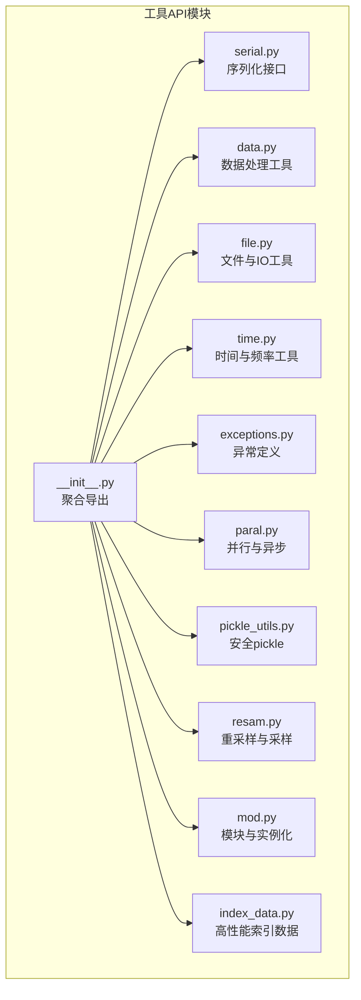
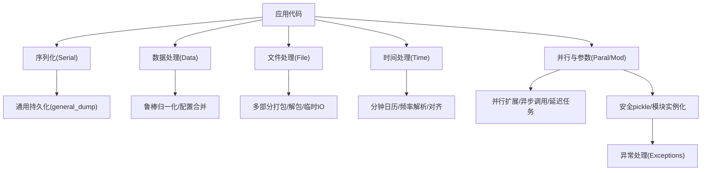
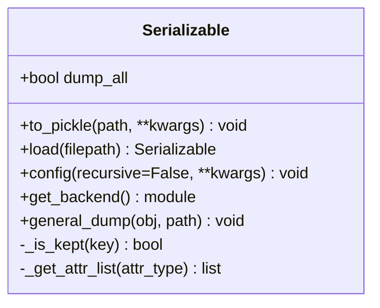
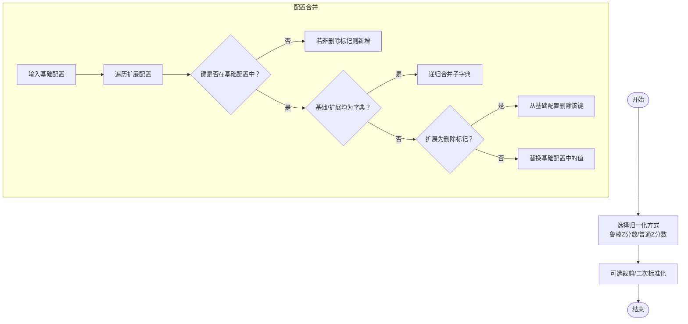
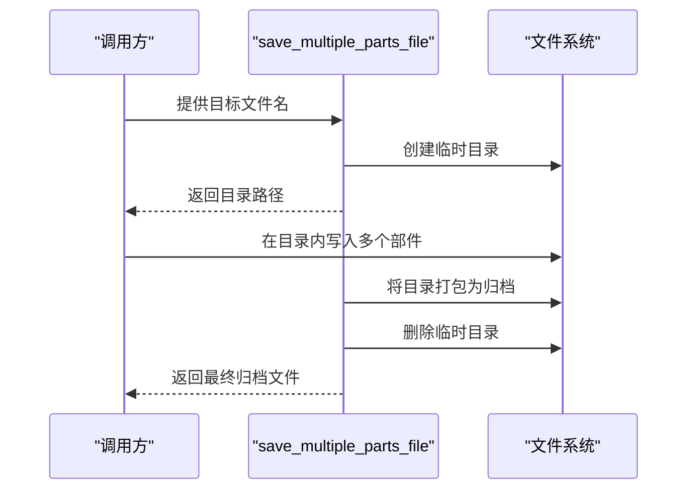
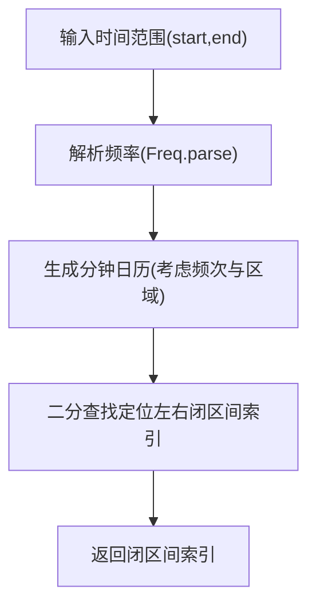
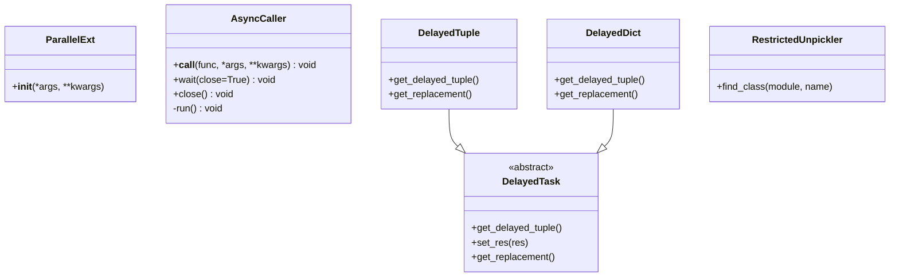
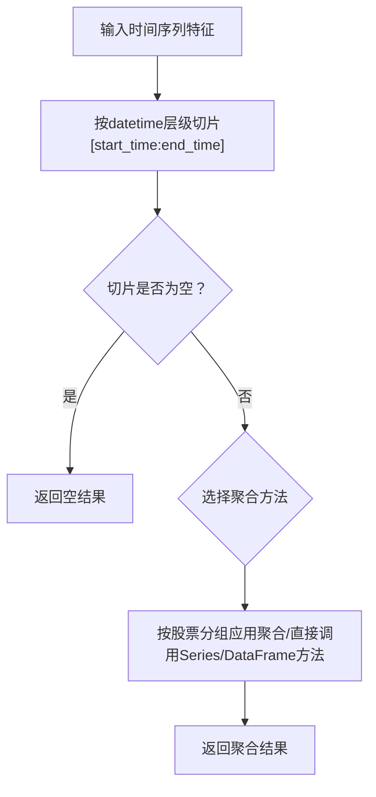
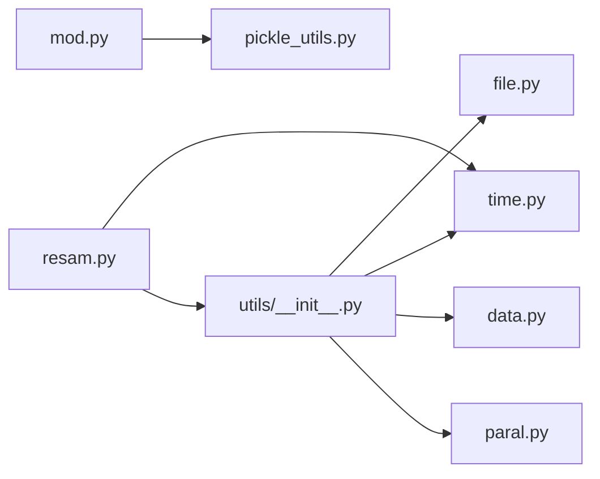

# 工具API

<cite>
**本文引用的文件**
- [serial.py](file://qlib/utils/serial.py)
- [data.py](file://qlib/utils/data.py)
- [file.py](file://qlib/utils/file.py)
- [time.py](file://qlib/utils/time.py)
- [exceptions.py](file://qlib/utils/exceptions.py)
- [paral.py](file://qlib/utils/paral.py)
- [pickle_utils.py](file://qlib/utils/pickle_utils.py)
- [resam.py](file://qlib/utils/resam.py)
- [mod.py](file://qlib/utils/mod.py)
- [index_data.py](file://qlib/utils/index_data.py)
- [__init__.py](file://qlib/utils/__init__.py)
</cite>

## 目录
1. [简介](#简介)
2. [项目结构](#项目结构)
3. [核心组件](#核心组件)
4. [架构总览](#架构总览)
5. [详细组件分析](#详细组件分析)
6. [依赖分析](#依赖分析)
7. [性能考量](#性能考量)
8. [故障排查指南](#故障排查指南)
9. [结论](#结论)
10. [附录：使用示例与场景](#附录使用示例与场景)

## 简介
本文件为 Qlib 工具API的权威参考文档，覆盖以下主题域：
- 序列化（Serial）：对象序列化、反序列化、安全反序列化、通用持久化策略
- 数据处理（Utils/Data）：数据变换、鲁棒归一化、配置合并、深度复制等
- 文件处理（File）：路径创建、多部分打包/解包、临时IO对象、缓冲区处理
- 时间处理（Time）：分钟级日历、频率解析与对齐、时区与时钟边界、时间切片
- 异常处理（Exceptions）：基础异常类与实验相关异常
- 并行与参数（Paral/Mod）：并行执行扩展、异步调用、延迟任务、模块实例化与安全反序列化
- 其他工具：重采样与时间序列采样、高性能索引数据结构

本指南在每个组件中给出职责边界、输入输出、关键算法与流程图，并提供常见使用场景与排错建议。

## 项目结构
工具API主要位于 qlib/utils 下，按功能域划分为独立模块，同时通过 utils/__init__.py 汇聚常用能力与导出。

图表来源
- [__init__.py:1-962](file://qlib/utils/__init__.py#L1-L962)
- [serial.py:1-190](file://qlib/utils/serial.py#L1-L190)
- [data.py:1-119](file://qlib/utils/data.py#L1-L119)
- [file.py:1-191](file://qlib/utils/file.py#L1-L191)
- [time.py:1-378](file://qlib/utils/time.py#L1-L378)
- [exceptions.py:1-20](file://qlib/utils/exceptions.py#L1-L20)
- [paral.py:1-333](file://qlib/utils/paral.py#L1-L333)
- [pickle_utils.py:1-172](file://qlib/utils/pickle_utils.py#L1-L172)
- [resam.py:1-240](file://qlib/utils/resam.py#L1-L240)
- [mod.py:1-241](file://qlib/utils/mod.py#L1-L241)
- [index_data.py:1-655](file://qlib/utils/index_data.py#L1-L655)

章节来源
- [__init__.py:1-962](file://qlib/utils/__init__.py#L1-L962)

## 核心组件
- 序列化（Serial）
  - 可序列化基类：控制属性保留策略、后端选择（pickle/dill）、统一持久化入口
  - 通用持久化：对 Serializable 对象走 pickle，否则走标准 pickle
- 数据处理（Utils/Data）
  - 鲁棒Z分数、普通Z分数、深拷贝基础类型、配置合并（支持删除标记）、标签回推滚动窗口
- 文件处理（File）
  - 路径创建、多部分打包归档、缓冲区解包、临时文件、IO对象上下文
- 时间处理（Time）
  - 分钟级日历缓存、频率解析、对齐到采样周期、时间切片、区域市场边界
- 异常处理（Exceptions）
  - 基础异常、实验重复初始化、对象加载失败、实验已存在
- 并行与参数（Paral/Mod）
  - 并行扩展、异步调用器、延迟任务容器、复杂结构并行执行、子进程执行包装
  - 安全pickle反序列化、模块导入与实例化、类查找
- 其他工具
  - 重采样与时间序列采样、高性能索引数据结构（单维/二维）

章节来源
- [serial.py:11-190](file://qlib/utils/serial.py#L11-L190)
- [data.py:16-119](file://qlib/utils/data.py#L16-L119)
- [file.py:16-191](file://qlib/utils/file.py#L16-L191)
- [time.py:18-378](file://qlib/utils/time.py#L18-L378)
- [exceptions.py:6-20](file://qlib/utils/exceptions.py#L6-L20)
- [paral.py:20-333](file://qlib/utils/paral.py#L20-L333)
- [pickle_utils.py:61-172](file://qlib/utils/pickle_utils.py#L61-L172)
- [resam.py:12-240](file://qlib/utils/resam.py#L12-L240)
- [mod.py:25-241](file://qlib/utils/mod.py#L25-L241)
- [index_data.py:21-655](file://qlib/utils/index_data.py#L21-L655)

## 架构总览
工具API围绕“可序列化对象”“数据与文件”“时间与频率”“并行与模块化”四大支柱构建，异常与安全反序列化贯穿各层。

图表来源
- [serial.py:115-190](file://qlib/utils/serial.py#L115-L190)
- [data.py:16-119](file://qlib/utils/data.py#L16-L119)
- [file.py:43-191](file://qlib/utils/file.py#L43-L191)
- [time.py:31-378](file://qlib/utils/time.py#L31-L378)
- [paral.py:20-333](file://qlib/utils/paral.py#L20-L333)
- [pickle_utils.py:61-172](file://qlib/utils/pickle_utils.py#L61-L172)
- [exceptions.py:6-20](file://qlib/utils/exceptions.py#L6-L20)

## 详细组件分析

### 序列化（Serial）接口
- 设计要点
  - 属性保留规则：优先级（排除列表 > 包含列表 > 非下划线字段 > 下划线字段dump_all）
  - 后端选择：pickle 或 dill；默认协议版本由配置决定
  - 递归配置：支持对嵌套对象进行递归配置，避免无限循环
- 关键方法
  - to_pickle：持久化对象至文件
  - load：从文件加载并校验类型
  - general_dump：通用持久化入口，自动区分 Serializable 与普通对象
- 使用建议
  - 大对象持久化时，合理设置 include/exclude，减少无关属性
  - 需要跨语言/平台兼容时，谨慎使用 dill

图表来源
- [serial.py:11-190](file://qlib/utils/serial.py#L11-L190)

章节来源
- [serial.py:11-190](file://qlib/utils/serial.py#L11-L190)

### 数据处理（Utils/Data）API
- 主要能力
  - 鲁棒Z分数：基于中位数与MAD，可选二次标准化
  - 普通Z分数：均值/标准差标准化
  - 深拷贝基础类型：仅浅拷贝复杂对象，降低任务共享成本
  - 配置合并：支持嵌套字典递归合并与删除标记（特殊符号）
  - 标签滚动窗口：从标签表达式推断预测窗口右边界
- 复杂度与性能
  - 归一化：O(n) 线性变换
  - 配置合并：O(n+m) 字典遍历与递归合并
- 注意事项
  - 深拷贝基础类型不适用于递归对象
  - 删除标记用于移除默认配置项

图表来源
- [data.py:16-119](file://qlib/utils/data.py#L16-L119)

章节来源
- [data.py:16-119](file://qlib/utils/data.py#L16-L119)

### 文件处理（File）API
- 功能清单
  - get_or_create_path：创建或返回路径，支持临时路径
  - save_multiple_parts_file：多部分文件打包为压缩归档
  - unpack_archive_with_buffer：缓冲区解包为临时目录
  - get_tmp_file_with_buffer：缓冲区写入临时文件
  - get_io_object：统一IO对象上下文（支持字符串/Path/IO）
- 流程示意

图表来源
- [file.py:43-93](file://qlib/utils/file.py#L43-L93)

章节来源
- [file.py:16-191](file://qlib/utils/file.py#L16-L191)

### 时间处理（Time）API
- 能力概览
  - get_min_cal：分钟级日历缓存（支持偏移与区域）
  - Freq：频率解析、对齐、最近频率选择、时间增量计算
  - 时间对齐：分钟对齐到采样周期、时间切片、极小扰动
  - 日内索引：开盘时段映射到分钟索引区间
- 关键流程

图表来源
- [time.py:283-306](file://qlib/utils/time.py#L283-L306)

章节来源
- [time.py:18-378](file://qlib/utils/time.py#L18-L378)

### 异常处理（Exceptions）接口
- 异常层次
  - QlibException：基础异常
  - RecorderInitializationError：实验重复初始化
  - LoadObjectError：对象加载失败
  - ExpAlreadyExistError：实验已存在
- 建议
  - 统一捕获 QlibException 进行降级处理
  - 对外部资源（如Redis）连接失败进行显式捕获与提示

章节来源
- [exceptions.py:6-20](file://qlib/utils/exceptions.py#L6-L20)

### 并行与参数（Paral/Mod）API
- 并行执行
  - ParallelExt：增强的并行执行器，支持子进程任务上限
  - datetime_groupby_apply：按时间分组并行应用函数
  - AsyncCaller：异步调用器，队列+线程守护
  - DelayedTask/DelayedTuple/DelayedDict：延迟任务容器与复杂结构并行执行
  - call_in_subproc：子进程执行包装，避免内存泄漏
- 模块与实例化
  - get_module_by_module_path：动态导入模块
  - get_callable_kwargs/init_instance_by_config：从配置构造实例，支持文件URL安全反序列化
- 安全pickle
  - RestrictedUnpickler：白名单限制反序列化类
  - restricted_pickle_load/loads：安全加载接口

图表来源
- [paral.py:20-333](file://qlib/utils/paral.py#L20-L333)
- [pickle_utils.py:61-172](file://qlib/utils/pickle_utils.py#L61-L172)

章节来源
- [paral.py:20-333](file://qlib/utils/paral.py#L20-L333)
- [mod.py:25-241](file://qlib/utils/mod.py#L25-L241)
- [pickle_utils.py:61-172](file://qlib/utils/pickle_utils.py#L61-L172)

### 其他工具函数
- 重采样与时间序列采样（resam）
  - resam_calendar：日历按频率重采样（分钟/日/周/月）
  - resam_ts_data：按时间窗与方法对时间序列进行聚合
  - get_valid_value/ts_data_last/ts_data_first：缺失值处理
- 高性能索引数据（index_data）
  - Index/IndexData/LocIndexer：只读索引、高性能数组封装、loc/iloc访问
  - SingleData/MultiData：单维/二维索引数据结构，支持广播与算子重载

图表来源
- [resam.py:102-206](file://qlib/utils/resam.py#L102-L206)

章节来源
- [resam.py:12-240](file://qlib/utils/resam.py#L12-L240)
- [index_data.py:21-655](file://qlib/utils/index_data.py#L21-L655)

## 依赖分析
- 内部耦合
  - utils/__init__.py 聚合导出文件处理、HTTP请求、配置解析、时间日期工具等
  - mod.py 依赖 pickle_utils 的安全反序列化
  - resam.py 依赖 time.Freq 与 lazy_sort_index
- 外部依赖
  - pandas/numpy：数据结构与时间序列处理
  - joblib：并行执行
  - redis：任务/缓存连接（通过 utils/__init__.py）
  - ruamel.yaml：配置解析

图表来源
- [__init__.py:28-37](file://qlib/utils/__init__.py#L28-L37)
- [mod.py:22-23](file://qlib/utils/mod.py#L22-L23)
- [resam.py:7-9](file://qlib/utils/resam.py#L7-L9)

章节来源
- [__init__.py:28-37](file://qlib/utils/__init__.py#L28-L37)
- [mod.py:22-23](file://qlib/utils/mod.py#L22-L23)
- [resam.py:7-9](file://qlib/utils/resam.py#L7-L9)

## 性能考量
- 序列化
  - 通过属性保留规则减少持久化体积；必要时使用 dill 以提升可序列化范围
- 数据处理
  - 鲁棒Z分数避免极端值影响；深拷贝基础类型降低对象复制开销
- 文件处理
  - 多部分打包/解包采用临时目录与归档，避免大文件多次IO
- 时间处理
  - 分钟日历使用LRU缓存；对齐与切片采用二分查找
- 并行
  - ParallelExt 支持子进程任务上限；AsyncCaller 降低主线程阻塞风险
- 索引数据
  - IndexData 使用浮点数组与广播，避免pandas过度封装带来的性能损耗

## 故障排查指南
- 序列化/反序列化
  - 若对象无法加载，检查类型一致性与属性保留规则
  - 安全反序列化失败时，确认类是否在白名单中
- 文件处理
  - 打包/解包报错通常与权限或路径冲突有关，确保目录不存在且有写权限
- 时间处理
  - 频率解析错误时，检查输入格式是否符合规范
  - 对齐失败时，确认时间处于对应市场的交易时段
- 并行
  - 子进程泄漏或内存增长，使用 call_in_subproc 包裹重复任务
- 异常
  - 实验重复初始化/对象加载失败：根据异常类型进行重试或清理

章节来源
- [pickle_utils.py:61-96](file://qlib/utils/pickle_utils.py#L61-L96)
- [file.py:70-93](file://qlib/utils/file.py#L70-L93)
- [time.py:166-184](file://qlib/utils/time.py#L166-L184)
- [paral.py:298-333](file://qlib/utils/paral.py#L298-L333)
- [exceptions.py:10-20](file://qlib/utils/exceptions.py#L10-L20)

## 结论
Qlib 工具API以“可序列化对象”“数据/文件/时间/并行”为核心，辅以安全反序列化与异常体系，形成完整、可扩展的工程化工具集。通过合理的属性保留策略、并行执行与高性能数据结构，能够在保证易用性的同时兼顾性能与安全性。

## 附录：使用示例与场景
- 序列化
  - 对象持久化：使用 Serializable.to_pickle 保存模型参数，控制 include/exclude
  - 通用持久化：使用 general_dump 自动区分对象类型
- 数据处理
  - 特征归一化：对时间序列特征进行鲁棒Z分数或普通Z分数
  - 配置合并：将用户扩展配置与默认配置合并，支持删除键
- 文件处理
  - 多部件打包：使用 save_multiple_parts_file 将多个部件打包为归档
  - 缓冲区解包：使用 unpack_archive_with_buffer 解压内存中的归档
- 时间处理
  - 频率对齐：使用 Freq.parse 与 cal_sam_minute 对齐分钟数据
  - 时间切片：使用 time_to_day_index 获取交易时段内的分钟索引
- 并行
  - 分组并行：使用 datetime_groupby_apply 对时间序列按时间分组并行处理
  - 异步调用：使用 AsyncCaller 包装日志/记录等异步操作
- 安全反序列化
  - 从文件URL加载对象：init_instance_by_config 自动识别 file:// 协议并安全加载
- 索引数据
  - 高性能聚合：使用 SingleData/MultiData 进行广播与算子运算

章节来源
- [serial.py:115-190](file://qlib/utils/serial.py#L115-L190)
- [data.py:16-119](file://qlib/utils/data.py#L16-L119)
- [file.py:43-191](file://qlib/utils/file.py#L43-L191)
- [time.py:140-256](file://qlib/utils/time.py#L140-L256)
- [paral.py:33-130](file://qlib/utils/paral.py#L33-L130)
- [mod.py:159-185](file://qlib/utils/mod.py#L159-L185)
- [index_data.py:529-655](file://qlib/utils/index_data.py#L529-L655)