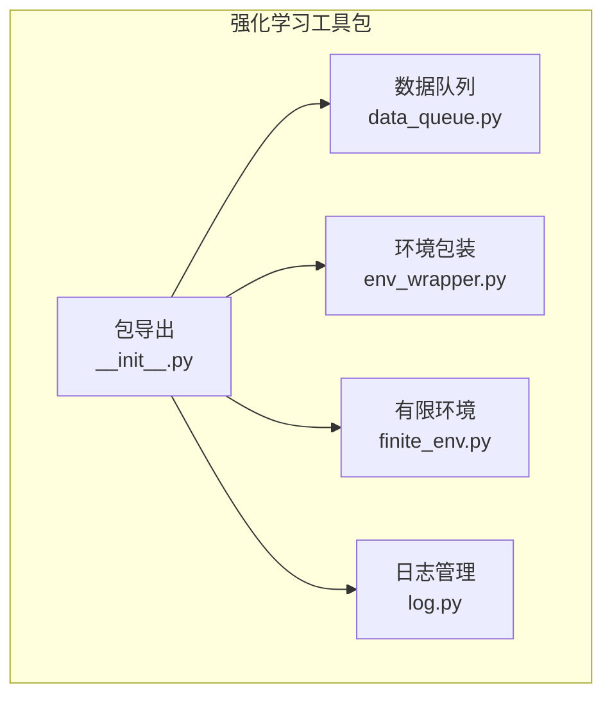
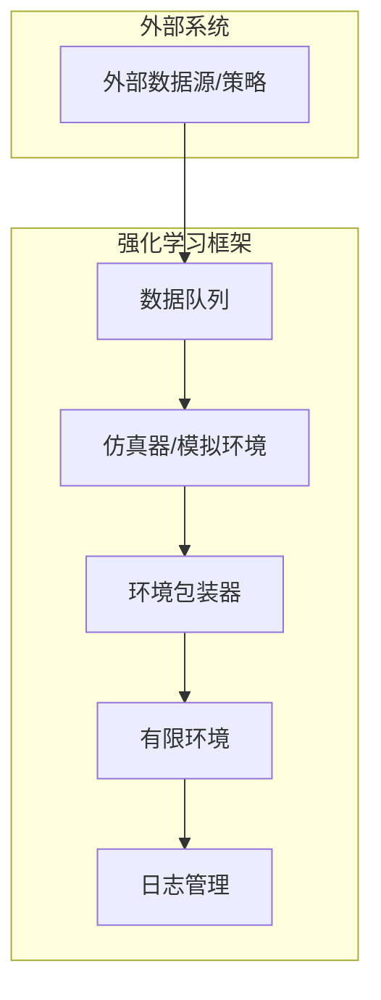
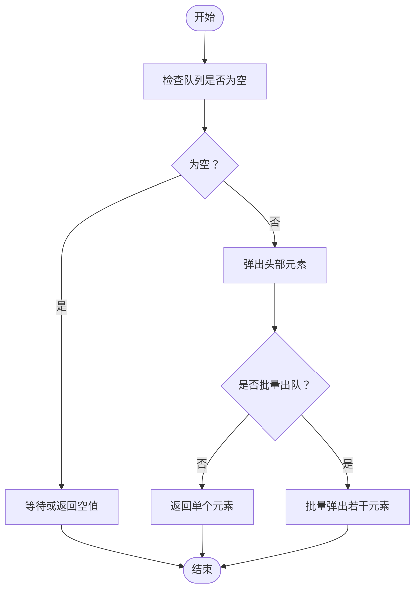
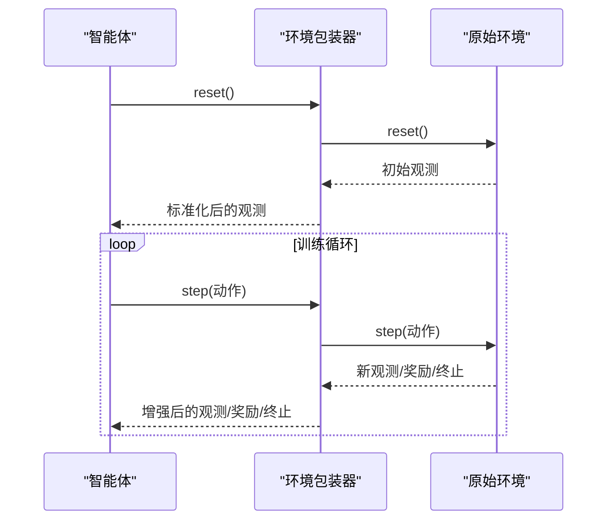
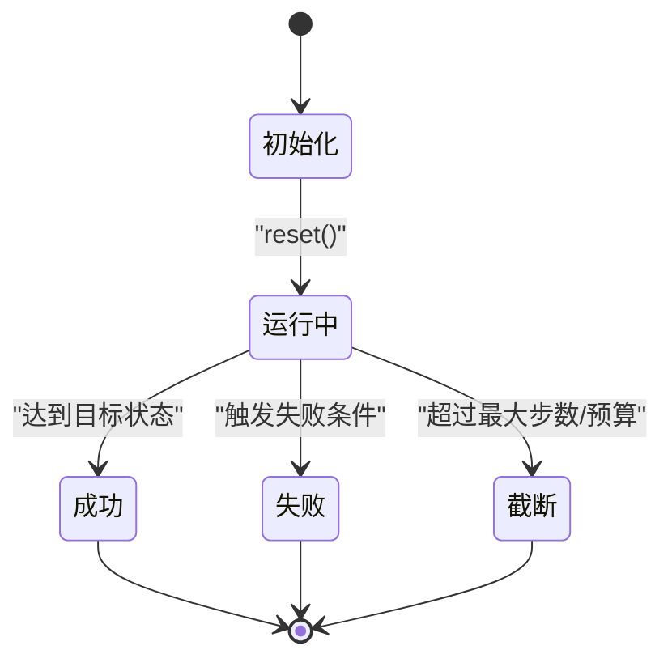
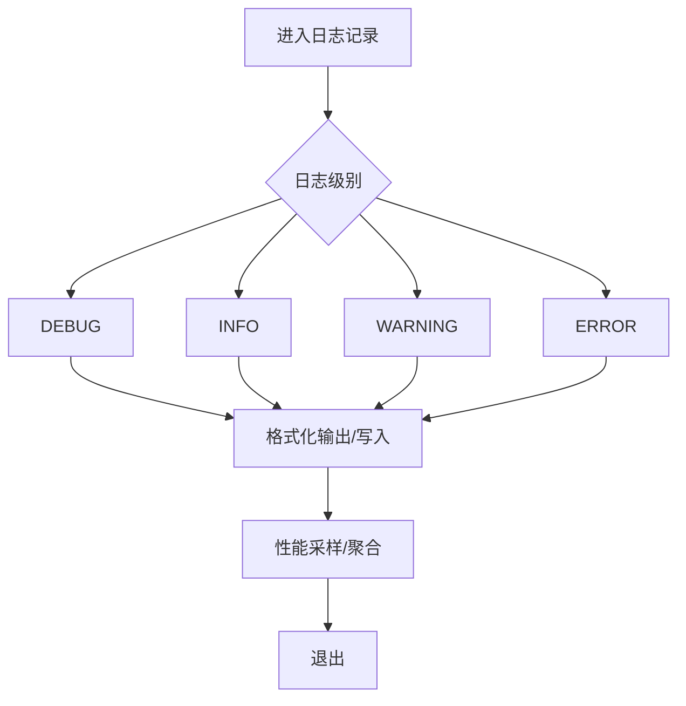
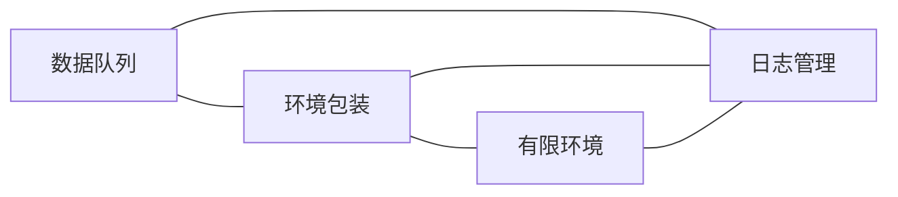

# 工具API

<cite>
**本文引用的文件**
- [data_queue.py](file://qlib/rl/utils/data_queue.py)
- [env_wrapper.py](file://qlib/rl/utils/env_wrapper.py)
- [finite_env.py](file://qlib/rl/utils/finite_env.py)
- [log.py](file://qlib/rl/utils/log.py)
- [__init__.py](file://qlib/rl/utils/__init__.py)
- [test_data_queue.py](file://tests/rl/test_data_queue.py)
- [test_finite_env.py](file://tests/rl/test_finite_env.py)
- [test_logger.py](file://tests/rl/test_logger.py)
- [test_qlib_simulator.py](file://tests/rl/test_qlib_simulator.py)
- [test_saoe_simple.py](file://tests/rl/test_saoe_simple.py)
- [test_trainer.py](file://tests/rl/test_trainer.py)
</cite>

## 目录
1. [简介](#简介)
2. [项目结构](#项目结构)
3. [核心组件](#核心组件)
4. [架构总览](#架构总览)
5. [详细组件分析](#详细组件分析)
6. [依赖关系分析](#依赖关系分析)
7. [性能考量](#性能考量)
8. [故障排查指南](#故障排查指南)
9. [结论](#结论)
10. [附录](#附录)

## 简介
本文件面向Qlib强化学习工具API，系统化梳理并说明以下能力：
- 数据队列（Data Queue）：队列管理、数据缓冲、异步处理等核心功能
- 环境包装（Environment Wrapper）：环境装饰器、环境增强、环境适配等
- 有限环境（Finite Environment）：状态空间限制、动作空间约束、终止条件等
- 日志（Log）管理：训练日志、调试信息、性能监控等
- 其他辅助工具：环境配置、状态转换、数据处理等实用功能

同时提供可操作的使用示例与最佳实践，帮助读者快速上手并扩展自定义工具。

## 项目结构
Qlib强化学习工具API位于强化学习子模块的工具包中，核心文件如下：
- 数据队列：[data_queue.py](file://qlib/rl/utils/data_queue.py)
- 环境包装：[env_wrapper.py](file://qlib/rl/utils/env_wrapper.py)
- 有限环境：[finite_env.py](file://qlib/rl/utils/finite_env.py)
- 日志管理：[log.py](file://qlib/rl/utils/log.py)
- 包导出入口：[__init__.py](file://qlib/rl/utils/__init__.py)

图表来源
- [data_queue.py](file://qlib/rl/utils/data_queue.py)
- [env_wrapper.py](file://qlib/rl/utils/env_wrapper.py)
- [finite_env.py](file://qlib/rl/utils/finite_env.py)
- [log.py](file://qlib/rl/utils/log.py)
- [__init__.py](file://qlib/rl/utils/__init__.py)

章节来源
- [__init__.py](file://qlib/rl/utils/__init__.py)

## 核心组件
本节概述四个核心工具模块的功能定位与职责边界，并给出使用场景指引。

- 数据队列（Data Queue）
  - 职责：提供线程安全的数据缓冲与异步处理能力，支持生产者-消费者模式，保障数据在多线程/多进程下的有序流转。
  - 关键能力：入队/出队、容量控制、阻塞策略、异常处理。
  - 典型用途：异步数据采集、批处理缓冲、解耦上游生产与下游消费。

- 环境包装（Environment Wrapper）
  - 职责：对底层环境进行装饰与增强，统一接口、适配不同观测/动作格式、注入预处理/后处理逻辑。
  - 关键能力：观测变换、动作映射、奖励调整、终止条件标准化。
  - 典型用途：适配多市场/多品种、统一状态表示、引入技术指标或特征工程。

- 有限环境（Finite Environment）
  - 职责：限定状态与动作空间，明确终止条件，确保强化学习过程的收敛性与可解释性。
  - 关键能力：状态空间枚举/离散化、动作空间约束、终止/截断判定、奖励边界。
  - 典型用途：教学演示、小规模实验、资源受限场景。

- 日志管理（Log）
  - 职责：集中化记录训练过程、调试信息与性能指标，支持多级别日志输出与持久化。
  - 关键能力：日志级别、格式化输出、性能采样、聚合统计。
  - 典型用途：训练监控、问题定位、结果复现。

章节来源
- [data_queue.py](file://qlib/rl/utils/data_queue.py)
- [env_wrapper.py](file://qlib/rl/utils/env_wrapper.py)
- [finite_env.py](file://qlib/rl/utils/finite_env.py)
- [log.py](file://qlib/rl/utils/log.py)

## 架构总览
下图展示工具API在强化学习流程中的位置与交互关系：

图表来源
- [data_queue.py](file://qlib/rl/utils/data_queue.py)
- [env_wrapper.py](file://qlib/rl/utils/env_wrapper.py)
- [finite_env.py](file://qlib/rl/utils/finite_env.py)
- [log.py](file://qlib/rl/utils/log.py)

## 详细组件分析

### 数据队列（Data Queue）
- 设计要点
  - 队列模型：采用环形缓冲或列表实现，支持先进先出（FIFO）。
  - 并发安全：通过锁或无锁队列保证多线程/多进程安全。
  - 缓冲策略：支持最大容量限制、阻塞/非阻塞入队、超时控制。
  - 异常处理：空队列出队、满队列入队、中断信号等场景的健壮性。
- 典型流程
  - 生产者持续入队，消费者按需出队；当队列接近上限时可阻塞等待。
  - 支持批量出队以提升吞吐量，减少锁竞争。
- 使用建议
  - 合理设置容量阈值，避免内存压力过大。
  - 在高并发场景优先选择无锁队列或轻量级同步原语。
  - 对关键路径增加超时与重试机制，防止死锁。

图表来源
- [data_queue.py](file://qlib/rl/utils/data_queue.py)

章节来源
- [data_queue.py](file://qlib/rl/utils/data_queue.py)
- [test_data_queue.py](file://tests/rl/test_data_queue.py)

### 环境包装（Environment Wrapper）
- 设计要点
  - 接口统一：对外暴露一致的观测、动作、奖励与终止接口。
  - 可组合性：支持多层包装叠加，形成“洋葱式”增强链。
  - 可配置性：通过参数控制观测维度、动作范围、奖励缩放等。
- 常见增强
  - 观测增强：标准化、归一化、滑动窗口、技术指标拼接。
  - 动作映射：连续动作离散化、动作掩码、动作裁剪。
  - 终止条件：截断/失败条件统一、时间步限制、风险控制。
- 最佳实践
  - 将通用逻辑下沉到包装器，保持策略层简洁。
  - 明确每层包装的职责边界，避免重复计算。
  - 提供可视化与回测接口，便于调试与验证。

图表来源
- [env_wrapper.py](file://qlib/rl/utils/env_wrapper.py)

章节来源
- [env_wrapper.py](file://qlib/rl/utils/env_wrapper.py)

### 有限环境（Finite Environment）
- 设计要点
  - 状态空间：离散化或有界连续状态，确保可枚举与可收敛。
  - 动作空间：离散动作集或带约束的连续动作，避免无界探索。
  - 终止条件：明确截断/失败/成功条件，避免无限运行。
- 实现建议
  - 使用有限状态机建模，清晰划分状态与转移。
  - 对动作进行合法性校验与裁剪，防止越界。
  - 奖励设计应与终止条件一致，避免奖励黑客。
- 应用场景
  - 教学与演示：简化问题空间，便于理解算法原理。
  - 小规模实验：快速迭代，降低计算成本。

图表来源
- [finite_env.py](file://qlib/rl/utils/finite_env.py)

章节来源
- [finite_env.py](file://qlib/rl/utils/finite_env.py)
- [test_finite_env.py](file://tests/rl/test_finite_env.py)

### 日志（Log）管理
- 设计要点
  - 分级输出：DEBUG/INFO/WARNING/ERROR/CRITICAL，便于不同阶段定位问题。
  - 结构化记录：包含时间戳、标签、数值指标、上下文信息。
  - 性能监控：采样关键指标（如吞吐、延迟、成功率），支持聚合统计。
- 使用建议
  - 在关键路径埋点，避免过度打印影响性能。
  - 对敏感信息脱敏，遵守数据合规要求。
  - 结合外部监控平台，实现集中化告警与可视化。

图表来源
- [log.py](file://qlib/rl/utils/log.py)

章节来源
- [log.py](file://qlib/rl/utils/log.py)
- [test_logger.py](file://tests/rl/test_logger.py)

## 依赖关系分析
- 模块内聚与耦合
  - 四个工具模块相对独立，职责清晰，耦合度低，便于单独测试与替换。
  - 包导出入口统一暴露API，便于上层调用。
- 外部依赖
  - 测试用例覆盖了数据队列、有限环境、日志与仿真器等关键路径，验证工具API的稳定性与正确性。
- 潜在风险
  - 队列容量与并发策略需结合业务负载评估，避免成为瓶颈。
  - 环境包装器链过长可能带来可观测性与性能负担，应定期评估与精简。

图表来源
- [data_queue.py](file://qlib/rl/utils/data_queue.py)
- [env_wrapper.py](file://qlib/rl/utils/env_wrapper.py)
- [finite_env.py](file://qlib/rl/utils/finite_env.py)
- [log.py](file://qlib/rl/utils/log.py)

章节来源
- [__init__.py](file://qlib/rl/utils/__init__.py)

## 性能考量
- 数据队列
  - 选择合适的容量阈值与批量大小，平衡内存占用与吞吐。
  - 在高并发场景优先使用无锁队列或原子操作，减少锁竞争。
- 环境包装
  - 将昂贵的计算（如特征工程）缓存或批量化，避免每步重复计算。
  - 控制包装层数，避免链路过长导致可观测性下降。
- 有限环境
  - 状态/动作空间尽量离散且规模可控，降低搜索复杂度。
  - 明确终止条件，缩短平均步长，提高样本效率。
- 日志
  - 仅在必要时记录高开销指标，避免频繁I/O。
  - 使用异步日志或批量刷盘，降低对主线程的影响。

## 故障排查指南
- 数据队列
  - 症状：队列长时间阻塞或内存持续增长。
  - 排查：检查入队/出队速率、容量阈值、异常处理分支。
  - 参考：[test_data_queue.py](file://tests/rl/test_data_queue.py)
- 环境包装
  - 症状：观测/动作不一致、奖励异常。
  - 排查：逐层剥离包装，确认每层的变换逻辑与边界条件。
  - 参考：[env_wrapper.py](file://qlib/rl/utils/env_wrapper.py)
- 有限环境
  - 症状：无法收敛、提前截断、奖励饱和。
  - 排查：检查状态/动作空间定义、终止条件与奖励函数一致性。
  - 参考：[test_finite_env.py](file://tests/rl/test_finite_env.py)
- 日志
  - 症状：日志缺失、级别错误、性能抖动。
  - 排查：核对日志级别配置、输出通道、采样频率。
  - 参考：[test_logger.py](file://tests/rl/test_logger.py)

章节来源
- [test_data_queue.py](file://tests/rl/test_data_queue.py)
- [test_finite_env.py](file://tests/rl/test_finite_env.py)
- [test_logger.py](file://tests/rl/test_logger.py)

## 结论
Qlib强化学习工具API围绕数据队列、环境包装、有限环境与日志管理四大支柱构建，具备良好的可组合性与可维护性。通过合理的容量与并发策略、清晰的职责边界与统一的接口设计，能够有效支撑从教学演示到小规模实验的多种应用场景。建议在实践中结合具体业务负载进行容量与性能调优，并持续完善可观测性与监控体系。

## 附录
- 使用示例与最佳实践（基于现有测试与示例）
  - 自定义工具开发
    - 参考：[test_trainer.py](file://tests/rl/test_trainer.py) 中的训练流程与回调机制，了解如何扩展训练管线。
    - 参考：[test_saoe_simple.py](file://tests/rl/test_saoe_simple.py) 中的简单策略与仿真流程，掌握从环境到策略的端到端集成。
  - 环境配置优化
    - 参考：[test_qlib_simulator.py](file://tests/rl/test_qlib_simulator.py) 中的仿真器配置与回测流程，学习如何在有限环境中进行高效验证。
  - 调试技巧
    - 参考：[test_logger.py](file://tests/rl/test_logger.py) 中的日志级别与输出策略，建立系统化的调试与监控方案。
  - 数据处理与状态转换
    - 参考：[env_wrapper.py](file://qlib/rl/utils/env_wrapper.py) 中的观测/动作变换逻辑，结合业务需求定制特征工程与状态表示。

章节来源
- [test_trainer.py](file://tests/rl/test_trainer.py)
- [test_saoe_simple.py](file://tests/rl/test_saoe_simple.py)
- [test_qlib_simulator.py](file://tests/rl/test_qlib_simulator.py)
- [test_logger.py](file://tests/rl/test_logger.py)
- [env_wrapper.py](file://qlib/rl/utils/env_wrapper.py)