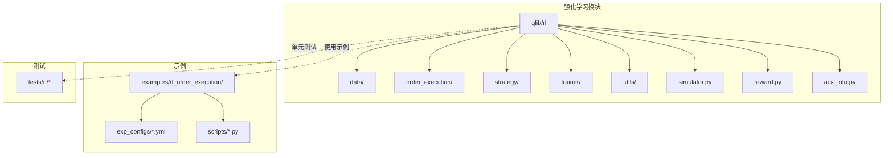
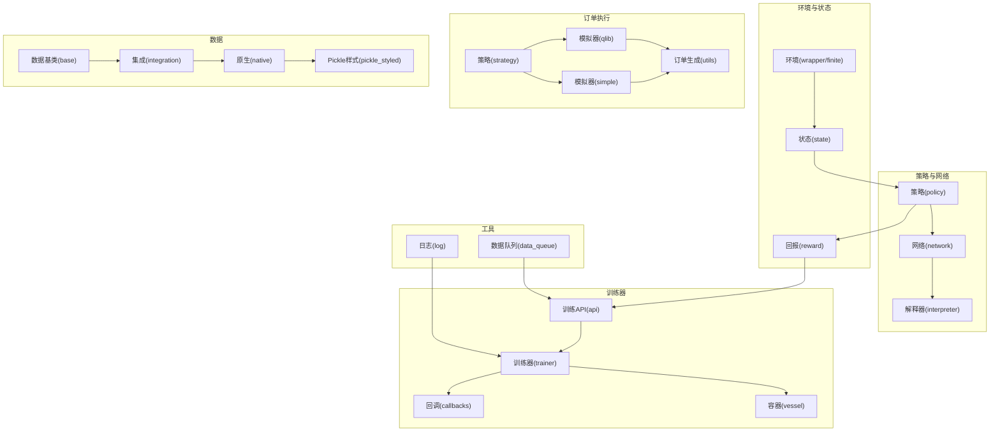
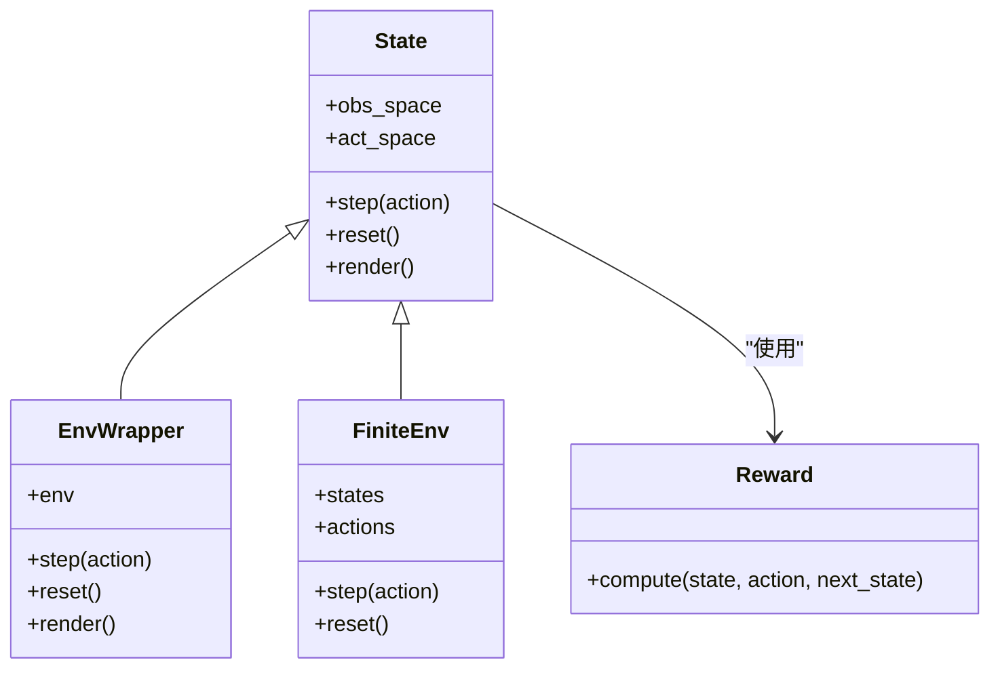
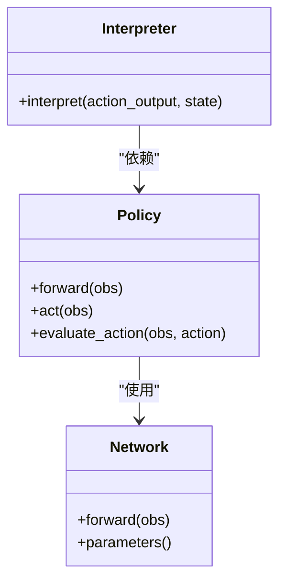
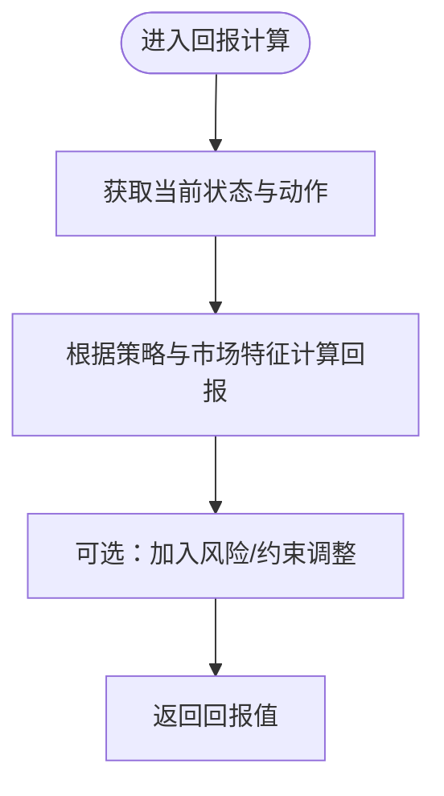
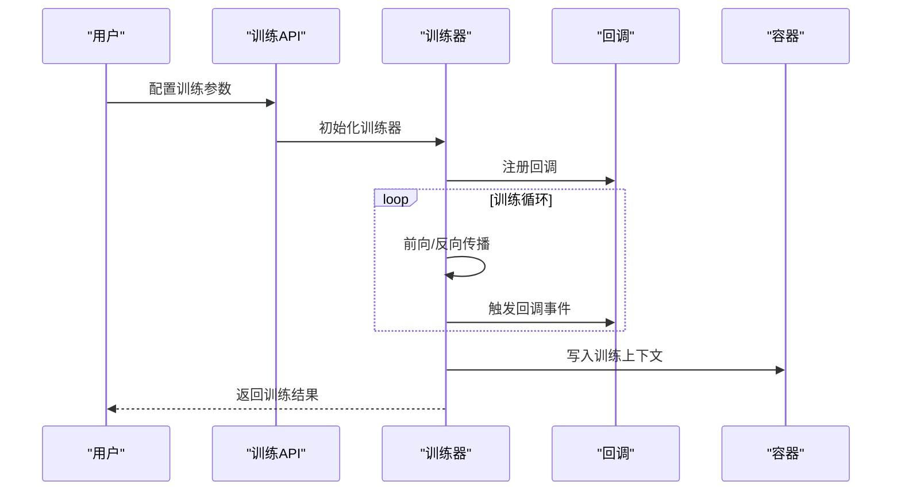
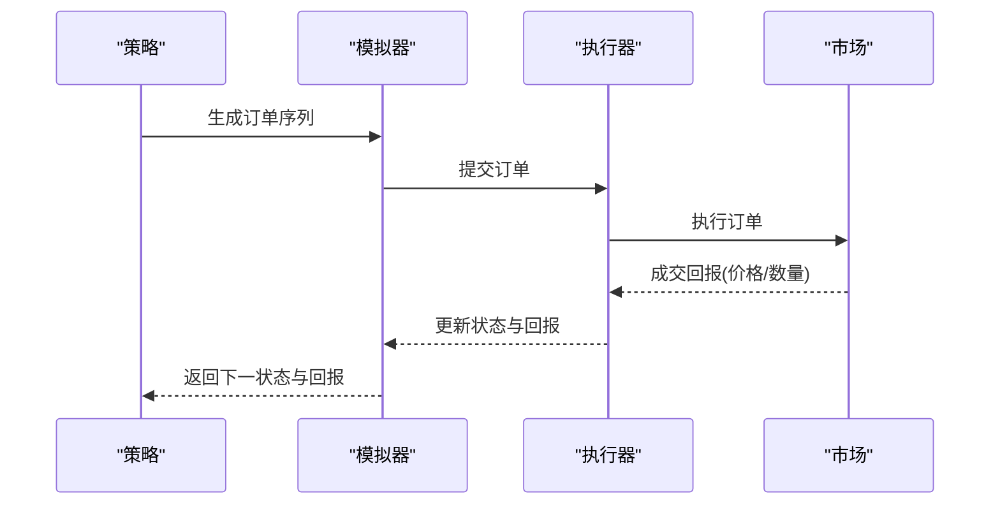
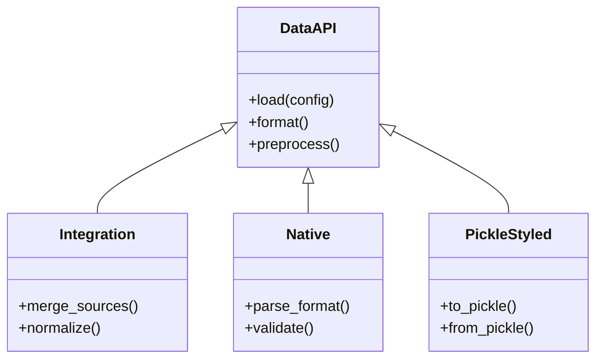
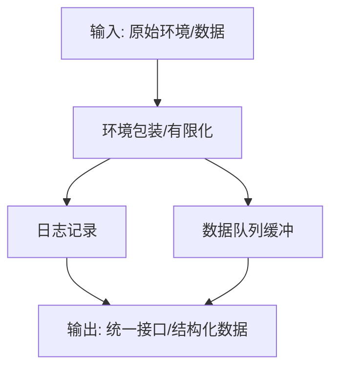
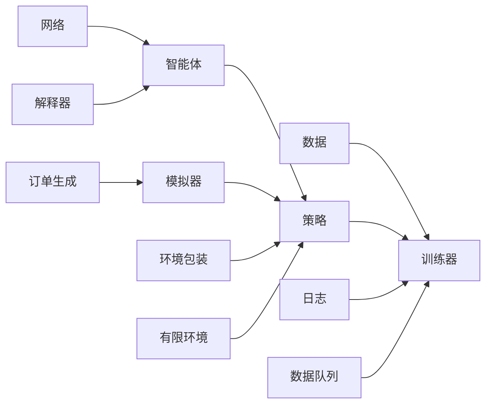

# 强化学习API

<cite>
**本文引用的文件**
- [qlib/rl/__init__.py](file://qlib/rl/__init__.py)
- [qlib/rl/data/base.py](file://qlib/rl/data/base.py)
- [qlib/rl/data/integration.py](file://qlib/rl/data/integration.py)
- [qlib/rl/data/native.py](file://qlib/rl/data/native.py)
- [qlib/rl/data/pickle_styled.py](file://qlib/rl/data/pickle_styled.py)
- [qlib/rl/order_execution/state.py](file://qlib/rl/order_execution/state.py)
- [qlib/rl/order_execution/reward.py](file://qlib/rl/order_execution/reward.py)
- [qlib/rl/order_execution/simulator_qlib.py](file://qlib/rl/order_execution/simulator_qlib.py)
- [qlib/rl/order_execution/simulator_simple.py](file://qlib/rl/order_execution/simulator_simple.py)
- [qlib/rl/order_execution/strategy.py](file://qlib/rl/order_execution/strategy.py)
- [qlib/rl/order_execution/policy.py](file://qlib/rl/order_execution/policy.py)
- [qlib/rl/order_execution/network.py](file://qlib/rl/order_execution/network.py)
- [qlib/rl/order_execution/interpreter.py](file://qlib/rl/order_execution/interpreter.py)
- [qlib/rl/order_execution/utils.py](file://qlib/rl/order_execution/utils.py)
- [qlib/rl/trainer/api.py](file://qlib/rl/trainer/api.py)
- [qlib/rl/trainer/trainer.py](file://qlib/rl/trainer/trainer.py)
- [qlib/rl/trainer/callbacks.py](file://qlib/rl/trainer/callbacks.py)
- [qlib/rl/trainer/vessel.py](file://qlib/rl/trainer/vessel.py)
- [qlib/rl/utils/env_wrapper.py](file://qlib/rl/utils/env_wrapper.py)
- [qlib/rl/utils/finite_env.py](file://qlib/rl/utils/finite_env.py)
- [qlib/rl/utils/log.py](file://qlib/rl/utils/log.py)
- [qlib/rl/utils/data_queue.py](file://qlib/rl/utils/data_queue.py)
- [qlib/rl/aux_info.py](file://qlib/rl/aux_info.py)
- [qlib/rl/reward.py](file://qlib/rl/reward.py)
- [qlib/rl/simulator.py](file://qlib/rl/simulator.py)
- [examples/rl_order_execution/README.md](file://examples/rl_order_execution/README.md)
- [examples/rl_order_execution/exp_configs/train_ppo.yml](file://examples/rl_order_execution/exp_configs/train_ppo.yml)
- [examples/rl_order_execution/exp_configs/backtest_ppo.yml](file://examples/rl_order_execution/exp_configs/backtest_ppo.yml)
- [examples/rl_order_execution/scripts/gen_training_orders.py](file://examples/rl_order_execution/scripts/gen_training_orders.py)
- [examples/rl_order_execution/scripts/gen_pickle_data.py](file://examples/rl_order_execution/scripts/gen_pickle_data.py)
- [examples/rl_order_execution/scripts/merge_orders.py](file://examples/rl_order_execution/scripts/merge_orders.py)
- [tests/rl/test_qlib_simulator.py](file://tests/rl/test_qlib_simulator.py)
- [tests/rl/test_saoe_simple.py](file://tests/rl/test_saoe_simple.py)
- [tests/rl/test_trainer.py](file://tests/rl/test_trainer.py)
- [tests/rl/test_finite_env.py](file://tests/rl/test_finance_env.py](file://tests/rl/test_finite_env.py)
- [tests/rl/test_logger.py](file://tests/rl/test_logger.py)
- [tests/rl/test_data_queue.py](file://tests/rl/test_data_queue.py)
</cite>

## 目录
1. [简介](#简介)
2. [项目结构](#项目结构)
3. [核心组件](#核心组件)
4. [架构总览](#架构总览)
5. [详细组件分析](#详细组件分析)
6. [依赖关系分析](#依赖关系分析)
7. [性能考虑](#性能考虑)
8. [故障排查指南](#故障排查指南)
9. [结论](#结论)
10. [附录](#附录)

## 简介
本文件为 Qlib 强化学习子系统的 API 参考与实践指南，覆盖以下方面：
- 强化学习基础组件：环境、智能体、奖励函数等核心概念与接口约定
- 策略（Strategy）API：策略定义、评估与优化流程
- 训练器（Trainer）API：训练配置、回调与监控
- 订单执行（Order Execution）接口：订单生成、执行模拟、市场影响建模
- 数据（rl/data）API：数据格式、加载与预处理
- 工具（rl/utils）接口：环境包装、有限状态空间、日志与数据队列
- 完整使用示例：从订单执行策略到交易环境建模与策略训练的实际案例

## 项目结构
Qlib 的强化学习模块位于 qlib/rl 下，按功能划分为数据层（data）、订单执行（order_execution）、策略（strategy）、训练器（trainer）、工具（utils）以及若干通用组件（simulator、reward、aux_info）。示例与测试分别位于 examples/rl_order_execution 与 tests/rl。

图表来源
- [qlib/rl/__init__.py](file://qlib/rl/__init__.py)
- [qlib/rl/data/base.py](file://qlib/rl/data/base.py)
- [qlib/rl/order_execution/state.py](file://qlib/rl/order_execution/state.py)
- [qlib/rl/order_execution/reward.py](file://qlib/rl/order_execution/reward.py)
- [qlib/rl/order_execution/simulator_qlib.py](file://qlib/rl/order_execution/simulator_qlib.py)
- [qlib/rl/order_execution/simulator_simple.py](file://qlib/rl/order_execution/simulator_simple.py)
- [qlib/rl/order_execution/strategy.py](file://qlib/rl/order_execution/strategy.py)
- [qlib/rl/order_execution/policy.py](file://qlib/rl/order_execution/policy.py)
- [qlib/rl/order_execution/network.py](file://qlib/rl/order_execution/network.py)
- [qlib/rl/order_execution/interpreter.py](file://qlib/rl/order_execution/interpreter.py)
- [qlib/rl/order_execution/utils.py](file://qlib/rl/order_execution/utils.py)
- [qlib/rl/trainer/api.py](file://qlib/rl/trainer/api.py)
- [qlib/rl/trainer/trainer.py](file://qlib/rl/trainer/trainer.py)
- [qlib/rl/trainer/callbacks.py](file://qlib/rl/trainer/callbacks.py)
- [qlib/rl/trainer/vessel.py](file://qlib/rl/trainer/vessel.py)
- [qlib/rl/utils/env_wrapper.py](file://qlib/rl/utils/env_wrapper.py)
- [qlib/rl/utils/finite_env.py](file://qlib/rl/utils/finite_env.py)
- [qlib/rl/utils/log.py](file://qlib/rl/utils/log.py)
- [qlib/rl/utils/data_queue.py](file://qlib/rl/utils/data_queue.py)
- [qlib/rl/aux_info.py](file://qlib/rl/aux_info.py)
- [qlib/rl/reward.py](file://qlib/rl/reward.py)
- [qlib/rl/simulator.py](file://qlib/rl/simulator.py)

章节来源
- [qlib/rl/__init__.py](file://qlib/rl/__init__.py)

## 核心组件
本节概述强化学习在 Qlib 中的基础组件与职责边界：
- 环境（Environment）：封装状态空间、动作空间、回报函数与终止条件；支持有限状态空间与环境包装
- 智能体（Agent/Policy）：策略网络与决策逻辑，输出动作或动作分布
- 奖励函数（Reward）：根据状态与动作计算即时回报
- 训练器（Trainer）：统一的训练流程、回调与监控
- 订单执行（Order Execution）：订单生成、执行模拟与市场影响建模
- 数据（rl/data）：数据格式、加载与预处理
- 工具（rl/utils）：环境包装、有限环境、日志与数据队列

章节来源
- [qlib/rl/utils/env_wrapper.py](file://qlib/rl/utils/env_wrapper.py)
- [qlib/rl/utils/finite_env.py](file://qlib/rl/utils/finite_env.py)
- [qlib/rl/reward.py](file://qlib/rl/reward.py)
- [qlib/rl/order_execution/reward.py](file://qlib/rl/order_execution/reward.py)
- [qlib/rl/order_execution/policy.py](file://qlib/rl/order_execution/policy.py)
- [qlib/rl/order_execution/network.py](file://qlib/rl/order_execution/network.py)
- [qlib/rl/trainer/api.py](file://qlib/rl/trainer/api.py)
- [qlib/rl/trainer/trainer.py](file://qlib/rl/trainer/trainer.py)
- [qlib/rl/order_execution/state.py](file://qlib/rl/order_execution/state.py)
- [qlib/rl/order_execution/simulator_qlib.py](file://qlib/rl/order_execution/simulator_qlib.py)
- [qlib/rl/order_execution/simulator_simple.py](file://qlib/rl/order_execution/simulator_simple.py)
- [qlib/rl/data/base.py](file://qlib/rl/data/base.py)
- [qlib/rl/utils/log.py](file://qlib/rl/utils/log.py)
- [qlib/rl/utils/data_queue.py](file://qlib/rl/utils/data_queue.py)

## 架构总览
下图展示强化学习模块的整体架构与关键交互：

图表来源
- [qlib/rl/order_execution/state.py](file://qlib/rl/order_execution/state.py)
- [qlib/rl/order_execution/reward.py](file://qlib/rl/order_execution/reward.py)
- [qlib/rl/order_execution/policy.py](file://qlib/rl/order_execution/policy.py)
- [qlib/rl/order_execution/network.py](file://qlib/rl/order_execution/network.py)
- [qlib/rl/order_execution/interpreter.py](file://qlib/rl/order_execution/interpreter.py)
- [qlib/rl/order_execution/strategy.py](file://qlib/rl/order_execution/strategy.py)
- [qlib/rl/order_execution/simulator_qlib.py](file://qlib/rl/order_execution/simulator_qlib.py)
- [qlib/rl/order_execution/simulator_simple.py](file://qlib/rl/order_execution/simulator_simple.py)
- [qlib/rl/order_execution/utils.py](file://qlib/rl/order_execution/utils.py)
- [qlib/rl/trainer/api.py](file://qlib/rl/trainer/api.py)
- [qlib/rl/trainer/trainer.py](file://qlib/rl/trainer/trainer.py)
- [qlib/rl/trainer/callbacks.py](file://qlib/rl/trainer/callbacks.py)
- [qlib/rl/trainer/vessel.py](file://qlib/rl/trainer/vessel.py)
- [qlib/rl/data/base.py](file://qlib/rl/data/base.py)
- [qlib/rl/data/integration.py](file://qlib/rl/data/integration.py)
- [qlib/rl/data/native.py](file://qlib/rl/data/native.py)
- [qlib/rl/data/pickle_styled.py](file://qlib/rl/data/pickle_styled.py)
- [qlib/rl/utils/log.py](file://qlib/rl/utils/log.py)
- [qlib/rl/utils/data_queue.py](file://qlib/rl/utils/data_queue.py)

## 详细组件分析

### 环境与状态（Environment & State）
- 状态建模：定义交易环境中的可观测状态，包含市场特征、持仓、时间等维度
- 环境包装：对原始环境进行包装以统一接口或增强功能
- 有限环境：限制状态/动作空间大小，便于离散化与高效训练
- 回报函数：根据状态与动作计算即时回报，用于策略优化

图表来源
- [qlib/rl/order_execution/state.py](file://qlib/rl/order_execution/state.py)
- [qlib/rl/utils/env_wrapper.py](file://qlib/rl/utils/env_wrapper.py)
- [qlib/rl/utils/finite_env.py](file://qlib/rl/utils/finite_env.py)
- [qlib/rl/order_execution/reward.py](file://qlib/rl/order_execution/reward.py)

章节来源
- [qlib/rl/order_execution/state.py](file://qlib/rl/order_execution/state.py)
- [qlib/rl/utils/env_wrapper.py](file://qlib/rl/utils/env_wrapper.py)
- [qlib/rl/utils/finite_env.py](file://qlib/rl/utils/finite_env.py)
- [qlib/rl/order_execution/reward.py](file://qlib/rl/order_execution/reward.py)

### 智能体与策略（Agent & Policy）
- 策略定义：策略对象负责根据当前状态选择动作或动作分布
- 网络实现：策略网络可基于深度学习模型，输出动作概率或确定性动作
- 解释器：将策略输出映射为具体交易指令

图表来源
- [qlib/rl/order_execution/policy.py](file://qlib/rl/order_execution/policy.py)
- [qlib/rl/order_execution/network.py](file://qlib/rl/order_execution/network.py)
- [qlib/rl/order_execution/interpreter.py](file://qlib/rl/order_execution/interpreter.py)

章节来源
- [qlib/rl/order_execution/policy.py](file://qlib/rl/order_execution/policy.py)
- [qlib/rl/order_execution/network.py](file://qlib/rl/order_execution/network.py)
- [qlib/rl/order_execution/interpreter.py](file://qlib/rl/order_execution/interpreter.py)

### 奖励函数（Reward）
- 奖励设计：结合交易收益、滑点、市场冲击等构建回报信号
- 与环境耦合：回报由环境状态与动作共同决定

图表来源
- [qlib/rl/order_execution/reward.py](file://qlib/rl/order_execution/reward.py)
- [qlib/rl/reward.py](file://qlib/rl/reward.py)

章节来源
- [qlib/rl/order_execution/reward.py](file://qlib/rl/order_execution/reward.py)
- [qlib/rl/reward.py](file://qlib/rl/reward.py)

### 训练器（Trainer）
- 训练API：提供统一的训练入口与配置
- 训练器：封装训练循环、优化器与损失更新
- 回调：在训练过程的关键节点执行自定义逻辑（如保存检查点、评估）
- 容器：承载训练上下文与资源

图表来源
- [qlib/rl/trainer/api.py](file://qlib/rl/trainer/api.py)
- [qlib/rl/trainer/trainer.py](file://qlib/rl/trainer/trainer.py)
- [qlib/rl/trainer/callbacks.py](file://qlib/rl/trainer/callbacks.py)
- [qlib/rl/trainer/vessel.py](file://qlib/rl/trainer/vessel.py)

章节来源
- [qlib/rl/trainer/api.py](file://qlib/rl/trainer/api.py)
- [qlib/rl/trainer/trainer.py](file://qlib/rl/trainer/trainer.py)
- [qlib/rl/trainer/callbacks.py](file://qlib/rl/trainer/callbacks.py)
- [qlib/rl/trainer/vessel.py](file://qlib/rl/trainer/vessel.py)

### 订单执行（Order Execution）
- 策略：定义订单生成规则与执行策略
- 模拟器：提供两种模拟器（QLib 与简单模型），用于订单执行仿真
- 订单生成：根据策略生成待执行订单序列
- 市场影响：通过模拟器建模流动性、滑点与价格冲击

图表来源
- [qlib/rl/order_execution/strategy.py](file://qlib/rl/order_execution/strategy.py)
- [qlib/rl/order_execution/simulator_qlib.py](file://qlib/rl/order_execution/simulator_qlib.py)
- [qlib/rl/order_execution/simulator_simple.py](file://qlib/rl/order_execution/simulator_simple.py)
- [qlib/rl/order_execution/utils.py](file://qlib/rl/order_execution/utils.py)

章节来源
- [qlib/rl/order_execution/strategy.py](file://qlib/rl/order_execution/strategy.py)
- [qlib/rl/order_execution/simulator_qlib.py](file://qlib/rl/order_execution/simulator_qlib.py)
- [qlib/rl/order_execution/simulator_simple.py](file://qlib/rl/order_execution/simulator_simple.py)
- [qlib/rl/order_execution/utils.py](file://qlib/rl/order_execution/utils.py)

### 数据（rl/data）
- 数据基类：定义统一的数据接口与抽象方法
- 集成：整合多源数据，提供统一访问
- 原生：面向特定数据格式的加载与解析
- Pickle 样式：以 Pickle 序列化形式存储与加载

图表来源
- [qlib/rl/data/base.py](file://qlib/rl/data/base.py)
- [qlib/rl/data/integration.py](file://qlib/rl/data/integration.py)
- [qlib/rl/data/native.py](file://qlib/rl/data/native.py)
- [qlib/rl/data/pickle_styled.py](file://qlib/rl/data/pickle_styled.py)

章节来源
- [qlib/rl/data/base.py](file://qlib/rl/data/base.py)
- [qlib/rl/data/integration.py](file://qlib/rl/data/integration.py)
- [qlib/rl/data/native.py](file://qlib/rl/data/native.py)
- [qlib/rl/data/pickle_styled.py](file://qlib/rl/data/pickle_styled.py)

### 工具（rl/utils）
- 环境包装：对环境进行装饰以统一接口或扩展能力
- 有限环境：将连续状态/动作空间离散化
- 日志：提供训练与运行时的日志记录
- 数据队列：用于异步数据流与缓冲

图表来源
- [qlib/rl/utils/env_wrapper.py](file://qlib/rl/utils/env_wrapper.py)
- [qlib/rl/utils/finite_env.py](file://qlib/rl/utils/finite_env.py)
- [qlib/rl/utils/log.py](file://qlib/rl/utils/log.py)
- [qlib/rl/utils/data_queue.py](file://qlib/rl/utils/data_queue.py)

章节来源
- [qlib/rl/utils/env_wrapper.py](file://qlib/rl/utils/env_wrapper.py)
- [qlib/rl/utils/finite_env.py](file://qlib/rl/utils/finite_env.py)
- [qlib/rl/utils/log.py](file://qlib/rl/utils/log.py)
- [qlib/rl/utils/data_queue.py](file://qlib/rl/utils/data_queue.py)

## 依赖关系分析
- 模块内聚：各子模块职责清晰，数据、策略、训练器与工具相对独立
- 外部依赖：训练器依赖回调与容器；策略依赖网络与解释器；订单执行依赖模拟器与工具
- 耦合点：状态、回报与数据是跨模块共享的核心抽象

图表来源
- [qlib/rl/trainer/trainer.py](file://qlib/rl/trainer/trainer.py)
- [qlib/rl/order_execution/strategy.py](file://qlib/rl/order_execution/strategy.py)
- [qlib/rl/order_execution/policy.py](file://qlib/rl/order_execution/policy.py)
- [qlib/rl/order_execution/network.py](file://qlib/rl/order_execution/network.py)
- [qlib/rl/order_execution/interpreter.py](file://qlib/rl/order_execution/interpreter.py)
- [qlib/rl/order_execution/simulator_qlib.py](file://qlib/rl/order_execution/simulator_qlib.py)
- [qlib/rl/order_execution/simulator_simple.py](file://qlib/rl/order_execution/simulator_simple.py)
- [qlib/rl/order_execution/utils.py](file://qlib/rl/order_execution/utils.py)
- [qlib/rl/utils/env_wrapper.py](file://qlib/rl/utils/env_wrapper.py)
- [qlib/rl/utils/finite_env.py](file://qlib/rl/utils/finite_env.py)
- [qlib/rl/utils/log.py](file://qlib/rl/utils/log.py)
- [qlib/rl/utils/data_queue.py](file://qlib/rl/utils/data_queue.py)

章节来源
- [qlib/rl/trainer/trainer.py](file://qlib/rl/trainer/trainer.py)
- [qlib/rl/order_execution/strategy.py](file://qlib/rl/order_execution/strategy.py)
- [qlib/rl/order_execution/policy.py](file://qlib/rl/order_execution/policy.py)
- [qlib/rl/order_execution/network.py](file://qlib/rl/order_execution/network.py)
- [qlib/rl/order_execution/interpreter.py](file://qlib/rl/order_execution/interpreter.py)
- [qlib/rl/order_execution/simulator_qlib.py](file://qlib/rl/order_execution/simulator_qlib.py)
- [qlib/rl/order_execution/simulator_simple.py](file://qlib/rl/order_execution/simulator_simple.py)
- [qlib/rl/order_execution/utils.py](file://qlib/rl/order_execution/utils.py)
- [qlib/rl/utils/env_wrapper.py](file://qlib/rl/utils/env_wrapper.py)
- [qlib/rl/utils/finite_env.py](file://qlib/rl/utils/finite_env.py)
- [qlib/rl/utils/log.py](file://qlib/rl/utils/log.py)
- [qlib/rl/utils/data_queue.py](file://qlib/rl/utils/data_queue.py)

## 性能考虑
- 状态/动作离散化：通过有限环境降低搜索空间，提升训练效率
- 数据队列：异步缓冲与批处理减少 I/O 阻塞
- 模拟器选择：简单模拟器适合快速原型，QLib 模拟器更贴近真实市场
- 回调与日志：合理设置回调频率与日志级别，避免过度开销

## 故障排查指南
- 训练不收敛：检查奖励设计是否合理、学习率与探索策略配置
- 环境异常：确认状态空间与动作空间定义一致，有限环境映射无越界
- 数据加载问题：核对数据格式与路径，确保预处理链路完整
- 日志定位：通过日志模块输出关键中间变量，逐步缩小问题范围

章节来源
- [tests/rl/test_trainer.py](file://tests/rl/test_trainer.py)
- [tests/rl/test_finite_env.py](file://tests/rl/test_finite_env.py)
- [tests/rl/test_logger.py](file://tests/rl/test_logger.py)
- [tests/rl/test_data_queue.py](file://tests/rl/test_data_queue.py)

## 结论
Qlib 强化学习模块提供了从数据、环境、策略到训练与订单执行的完整闭环。通过模块化设计与统一接口，用户可以快速搭建并优化交易策略。建议在实践中优先完成数据与环境的标准化，再迭代策略与训练配置，并利用工具模块提升开发与调试效率。

## 附录

### 使用示例：订单执行策略与交易环境建模
- 训练配置：参考示例中的 YAML 配置文件，定义策略类型、环境参数与训练超参
- 数据准备：使用脚本生成训练订单与 Pickle 数据，确保数据格式符合要求
- 训练与回测：通过训练 API 启动训练流程，使用回测配置验证策略效果

章节来源
- [examples/rl_order_execution/README.md](file://examples/rl_order_execution/README.md)
- [examples/rl_order_execution/exp_configs/train_ppo.yml](file://examples/rl_order_execution/exp_configs/train_ppo.yml)
- [examples/rl_order_execution/exp_configs/backtest_ppo.yml](file://examples/rl_order_execution/exp_configs/backtest_ppo.yml)
- [examples/rl_order_execution/scripts/gen_training_orders.py](file://examples/rl_order_execution/scripts/gen_training_orders.py)
- [examples/rl_order_execution/scripts/gen_pickle_data.py](file://examples/rl_order_execution/scripts/gen_pickle_data.py)
- [examples/rl_order_execution/scripts/merge_orders.py](file://examples/rl_order_execution/scripts/merge_orders.py)

### 测试用例参考
- 订单执行模拟器：验证 QLib 与简单模拟器的行为一致性
- 训练器：验证训练流程与回调机制
- 工具模块：验证有限环境、日志与数据队列的功能

章节来源
- [tests/rl/test_qlib_simulator.py](file://tests/rl/test_qlib_simulator.py)
- [tests/rl/test_saoe_simple.py](file://tests/rl/test_saoe_simple.py)
- [tests/rl/test_trainer.py](file://tests/rl/test_trainer.py)
- [tests/rl/test_finite_env.py](file://tests/rl/test_finite_env.py)
- [tests/rl/test_logger.py](file://tests/rl/test_logger.py)
- [tests/rl/test_data_queue.py](file://tests/rl/test_data_queue.py)