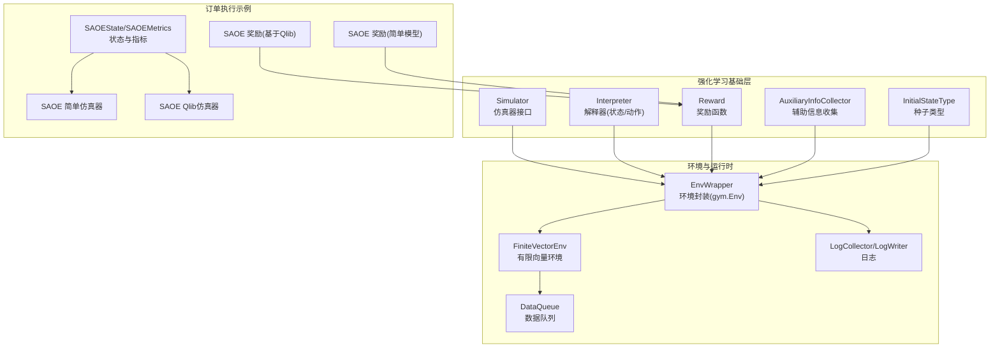
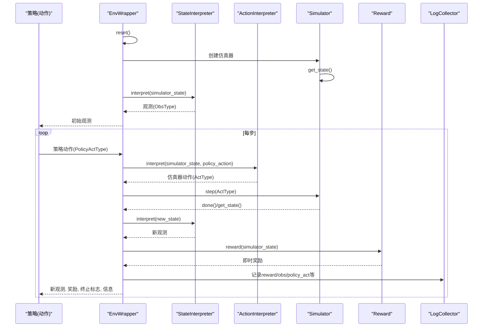
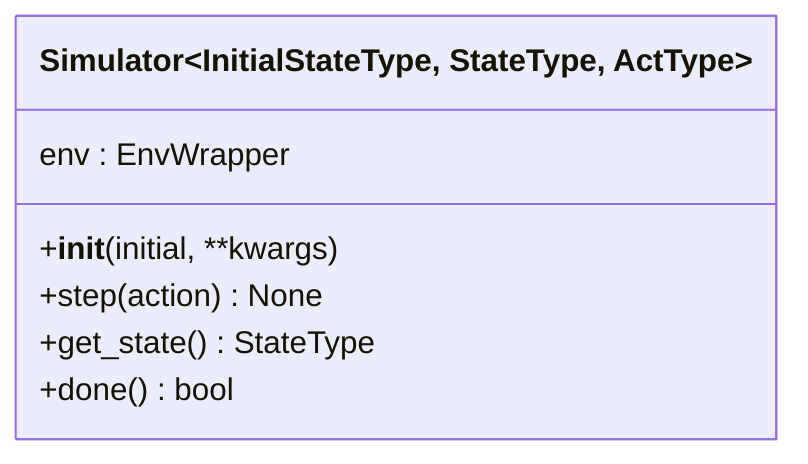
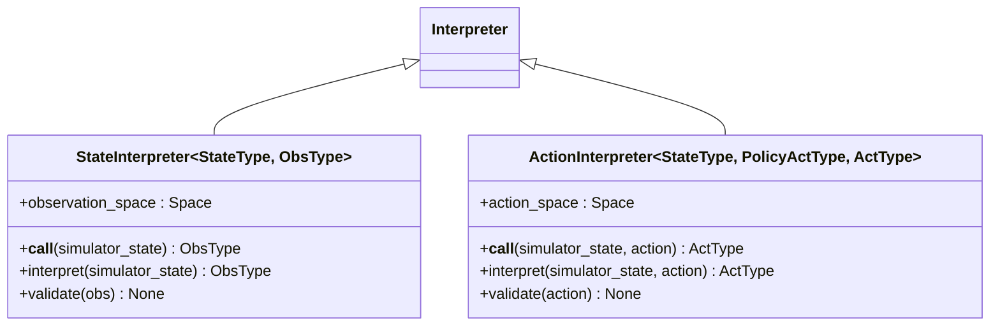
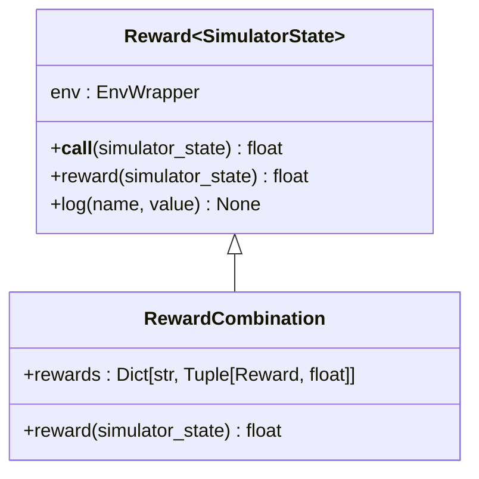
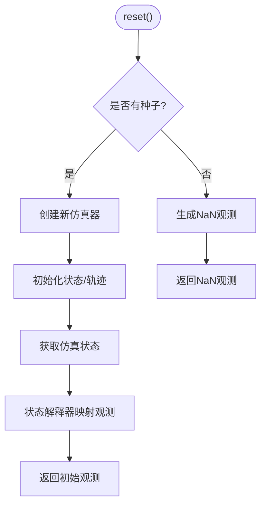
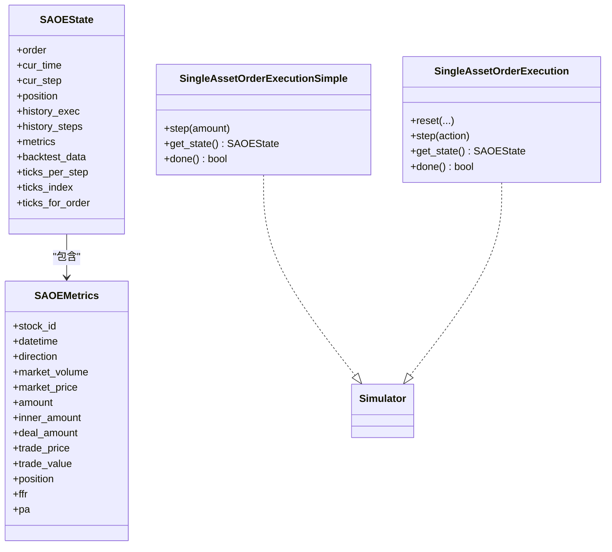
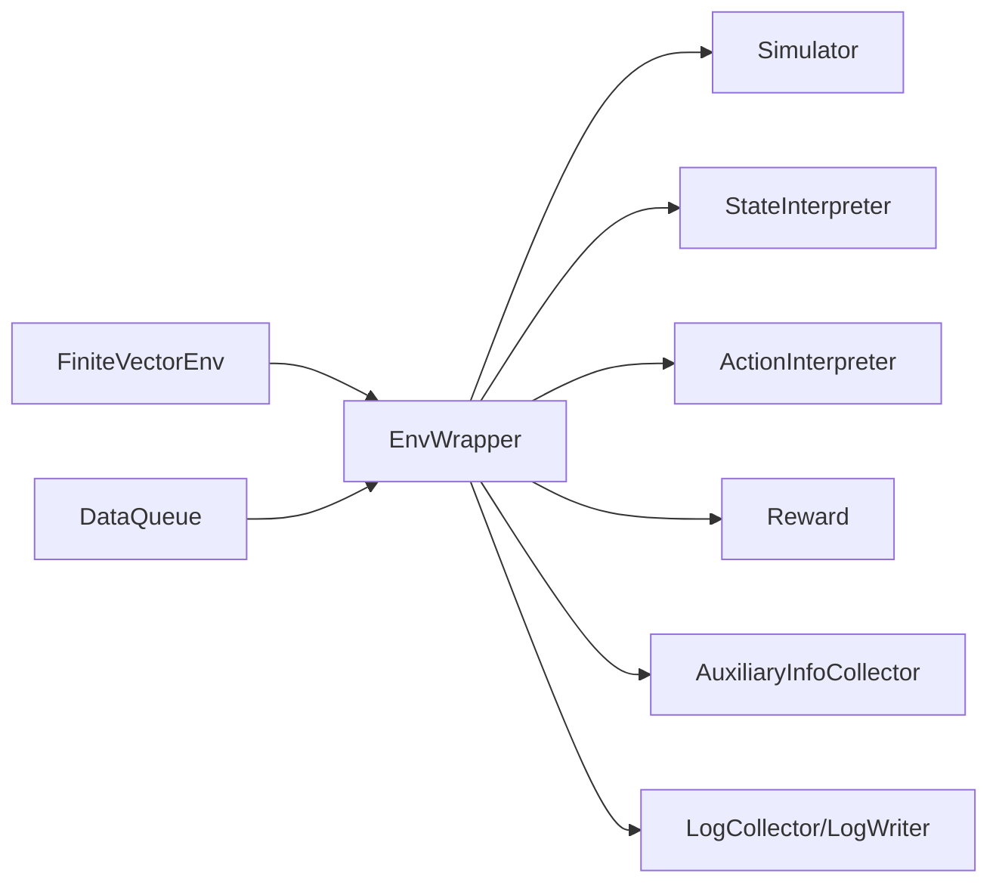

# 强化学习基础组件

<cite>
**本文引用的文件**
- [qlib/rl/__init__.py](file://qlib/rl/__init__.py)
- [qlib/rl/simulator.py](file://qlib/rl/simulator.py)
- [qlib/rl/interpreter.py](file://qlib/rl/interpreter.py)
- [qlib/rl/reward.py](file://qlib/rl/reward.py)
- [qlib/rl/aux_info.py](file://qlib/rl/aux_info.py)
- [qlib/rl/seed.py](file://qlib/rl/seed.py)
- [qlib/rl/utils/env_wrapper.py](file://qlib/rl/utils/env_wrapper.py)
- [qlib/rl/utils/finite_env.py](file://qlib/rl/utils/finite_env.py)
- [qlib/rl/utils/data_queue.py](file://qlib/rl/utils/data_queue.py)
- [qlib/rl/utils/log.py](file://qlib/rl/utils/log.py)
- [qlib/rl/order_execution/state.py](file://qlib/rl/order_execution/state.py)
- [qlib/rl/order_execution/reward.py](file://qlib/rl/order_execution/reward.py)
- [qlib/rl/order_execution/simulator_qlib.py](file://qlib/rl/order_execution/simulator_qlib.py)
- [qlib/rl/order_execution/simulator_simple.py](file://qlib/rl/order_execution/simulator_simple.py)
- [qlib/rl/trainer/api.py](file://qlib/rl/trainer/api.py)
</cite>

## 目录
1. [引言](#引言)
2. [项目结构](#项目结构)
3. [核心组件](#核心组件)
4. [架构总览](#架构总览)
5. [详细组件分析](#详细组件分析)
6. [依赖分析](#依赖分析)
7. [性能考虑](#性能考虑)
8. [故障排查指南](#故障排查指南)
9. [结论](#结论)
10. [附录：使用示例与最佳实践](#附录使用示例与最佳实践)

## 引言
本文件面向Qlib强化学习基础组件，系统性梳理并说明以下内容：
- 强化学习环境定义接口：环境基类、状态空间、动作空间、观测空间等核心概念
- 智能体（Agent）接口：策略接口、动作选择、状态更新等
- 奖励函数（Reward）API：奖励计算、奖励函数设计、奖励归一化等
- 仿真器（Simulator）接口：市场仿真、交易执行、价格影响等
- 辅助信息（AuxInfo）与种子管理（Seed）
- 完整使用示例：自定义环境创建、智能体训练、奖励函数设计等

目标是帮助读者快速理解并正确使用Qlib强化学习框架中的基础组件，实现从“状态-动作-奖励”闭环到可复用的训练/回测流水线。

## 项目结构
Qlib强化学习模块位于qlib/rl目录下，包含通用基础组件与订单执行专用子域。核心文件如下：
- 环境封装与类型：utils/env_wrapper.py、utils/finite_env.py、utils/data_queue.py、utils/log.py
- 基础接口：simulator.py、interpreter.py、reward.py、aux_info.py、seed.py
- 订单执行示例：order_execution/state.py、order_execution/reward.py、order_execution/simulator_qlib.py、order_execution/simulator_simple.py
- 训练入口：trainer/api.py
- 导出聚合：qlib/rl/__init__.py

图示来源
- [qlib/rl/simulator.py:21-76](file://qlib/rl/simulator.py#L21-L76)
- [qlib/rl/interpreter.py:19-142](file://qlib/rl/interpreter.py#L19-L142)
- [qlib/rl/reward.py:16-86](file://qlib/rl/reward.py#L16-L86)
- [qlib/rl/aux_info.py:21-44](file://qlib/rl/aux_info.py#L21-L44)
- [qlib/rl/seed.py:9-13](file://qlib/rl/seed.py#L9-L13)
- [qlib/rl/utils/env_wrapper.py:51-251](file://qlib/rl/utils/env_wrapper.py#L51-L251)
- [qlib/rl/utils/finite_env.py:89-370](file://qlib/rl/utils/finite_env.py#L89-L370)
- [qlib/rl/utils/data_queue.py:24-189](file://qlib/rl/utils/data_queue.py#L24-L189)
- [qlib/rl/utils/log.py:58-524](file://qlib/rl/utils/log.py#L58-L524)
- [qlib/rl/order_execution/state.py:70-102](file://qlib/rl/order_execution/state.py#L70-L102)
- [qlib/rl/order_execution/reward.py:17-100](file://qlib/rl/order_execution/reward.py#L17-L100)
- [qlib/rl/order_execution/simulator_simple.py:24-363](file://qlib/rl/order_execution/simulator_simple.py#L24-L363)
- [qlib/rl/order_execution/simulator_qlib.py:19-142](file://qlib/rl/order_execution/simulator_qlib.py#L19-L142)

章节来源
- [qlib/rl/__init__.py:4-8](file://qlib/rl/__init__.py#L4-L8)

## 核心组件
本节对强化学习基础组件进行分层说明，涵盖接口职责、输入输出约定、典型实现模式与注意事项。

- 仿真器（Simulator）
  - 职责：接收初始种子，按步推进内部状态，暴露当前状态与终止标志
  - 关键方法：step(action)、get_state()、done()
  - 类型参数：InitialStateType、StateType、ActType
  - 设计要点：仅通过step修改内部状态；外部只读取状态；生命周期短暂，终止后需重建

- 解释器（Interpreter）
  - 状态解释器（StateInterpreter）：将Simulator状态映射到策略观测空间
  - 动作解释器（ActionInterpreter）：将策略动作映射到仿真器动作
  - 关键属性：observation_space、action_space
  - 验证机制：内置gym空间校验，失败抛出带诊断信息的异常

- 奖励函数（Reward）
  - 职责：根据当前仿真状态计算即时奖励
  - 组合能力：支持多奖励加权组合
  - 日志能力：可通过env.logger记录中间指标

- 环境封装（EnvWrapper）
  - 将Simulator、StateInterpreter、ActionInterpreter、Reward、AuxInfoCollector、Logger整合为gym.Env
  - 提供reset/step接口，维护轨迹历史（obs/action/reward）
  - 支持种子迭代器与NaN观测处理，适配有限数据集

- 辅助信息与种子
  - AuxiliaryInfoCollector：在每步收集自定义辅助信息，用于多智能体或调试
  - InitialStateType：种子类型，通常为订单等任务初始化数据

- 日志与向量环境
  - LogCollector/LogWriter：在worker侧收集、在主控侧聚合写入
  - FiniteVectorEnv：确保每个种子仅被一个worker消费，避免重复或空消费

章节来源
- [qlib/rl/simulator.py:21-76](file://qlib/rl/simulator.py#L21-L76)
- [qlib/rl/interpreter.py:19-142](file://qlib/rl/interpreter.py#L19-L142)
- [qlib/rl/reward.py:16-86](file://qlib/rl/reward.py#L16-L86)
- [qlib/rl/aux_info.py:21-44](file://qlib/rl/aux_info.py#L21-L44)
- [qlib/rl/seed.py:9-13](file://qlib/rl/seed.py#L9-L13)
- [qlib/rl/utils/env_wrapper.py:51-251](file://qlib/rl/utils/env_wrapper.py#L51-L251)
- [qlib/rl/utils/finite_env.py:89-370](file://qlib/rl/utils/finite_env.py#L89-L370)
- [qlib/rl/utils/log.py:58-524](file://qlib/rl/utils/log.py#L58-L524)

## 架构总览
下图展示从策略到仿真器的端到端流程，以及环境封装如何协调各组件：

图示来源
- [qlib/rl/utils/env_wrapper.py:146-247](file://qlib/rl/utils/env_wrapper.py#L146-L247)
- [qlib/rl/interpreter.py:35-99](file://qlib/rl/interpreter.py#L35-L99)
- [qlib/rl/simulator.py:54-76](file://qlib/rl/simulator.py#L54-L76)
- [qlib/rl/reward.py:25-36](file://qlib/rl/reward.py#L25-L36)

## 详细组件分析

### 仿真器（Simulator）接口
- 接口职责
  - 初始化：通过构造函数接收初始种子
  - 步进：step(action)推进内部状态
  - 查询：get_state()返回当前状态；done()判断终止
- 类型约束
  - 三泛型：InitialStateType、StateType、ActType
  - 生命周期：短暂，终止后应销毁并重建
- 实现建议
  - 严格遵循“仅通过step修改内部状态”的约束
  - 在get_state中返回不可变或受控可读的数据结构

图示来源
- [qlib/rl/simulator.py:21-76](file://qlib/rl/simulator.py#L21-L76)

章节来源
- [qlib/rl/simulator.py:21-76](file://qlib/rl/simulator.py#L21-L76)

### 解释器（Interpreter）：状态与动作空间
- 状态解释器（StateInterpreter）
  - 属性：observation_space（gym.Space）
  - 方法：interpret(simulator_state) → ObsType
  - 校验：validate(obs)确保观测属于预定义空间
- 动作解释器（ActionInterpreter）
  - 属性：action_space（gym.Space）
  - 方法：interpret(simulator_state, policy_action) → ActType
  - 校验：validate(action)确保动作属于预定义空间
- 错误处理
  - 空间校验失败抛出带诊断信息的异常

图示来源
- [qlib/rl/interpreter.py:19-142](file://qlib/rl/interpreter.py#L19-L142)

章节来源
- [qlib/rl/interpreter.py:35-99](file://qlib/rl/interpreter.py#L35-L99)

### 奖励函数（Reward）API
- 基类（Reward）
  - 接口：reward(simulator_state) → float
  - 调试：log(name, value)将指标写入env.logger
- 组合（RewardCombination）
  - 多奖励加权求和，并记录各子项指标
- 订单执行示例
  - PAPenaltyReward：鼓励价格优势同时惩罚集中下单
  - PPOReward：基于论文的最终回报判定

图示来源
- [qlib/rl/reward.py:16-86](file://qlib/rl/reward.py#L16-L86)

章节来源
- [qlib/rl/reward.py:16-86](file://qlib/rl/reward.py#L16-L86)
- [qlib/rl/order_execution/reward.py:17-100](file://qlib/rl/order_execution/reward.py#L17-L100)

### 环境封装（EnvWrapper）与运行时
- 职责
  - 组装：Simulator、StateInterpreter、ActionInterpreter、Reward、AuxInfoCollector、Logger
  - 接口：reset()、step()、render()（未实现）
  - 状态：维护轨迹历史（obs/action/reward），记录步数与终止标志
- 种子与数据流
  - seed_iterator：可选的种子序列；无种子时生成NaN观测
  - 数据队列：通过DataQueue提供有限/无限种子流
- 向量环境
  - FiniteVectorEnv：保证每个种子仅被一个worker消费，避免重复或空消费
  - 支持多种并行实现（dummy/subproc/shmem）

图示来源
- [qlib/rl/utils/env_wrapper.py:146-194](file://qlib/rl/utils/env_wrapper.py#L146-L194)

章节来源
- [qlib/rl/utils/env_wrapper.py:51-251](file://qlib/rl/utils/env_wrapper.py#L51-L251)
- [qlib/rl/utils/finite_env.py:89-370](file://qlib/rl/utils/finite_env.py#L89-L370)
- [qlib/rl/utils/data_queue.py:24-189](file://qlib/rl/utils/data_queue.py#L24-L189)

### 辅助信息（AuxInfo）与种子管理（Seed）
- 辅助信息（AuxiliaryInfoCollector）
  - 用途：在每步收集自定义辅助信息，便于多智能体或调试
  - 调用：env_wrapper在每步调用collect(simulator_state)
- 种子（InitialStateType）
  - 类型：泛型，通常为订单等任务初始化数据
  - 作用：作为仿真器构造参数，驱动轨迹多样性

章节来源
- [qlib/rl/aux_info.py:21-44](file://qlib/rl/aux_info.py#L21-L44)
- [qlib/rl/seed.py:9-13](file://qlib/rl/seed.py#L9-L13)

### 订单执行示例：状态、仿真器与奖励
- 状态（SAOEState/SAOEMetrics）
  - 包含订单、时间、步数、剩余头寸、历史成交与步骤、指标、回测数据、交易tick索引等
- 简单仿真器（SingleAssetOrderExecutionSimple）
  - 基于分钟级数据，按TWAP拆分执行，支持阈值限制与最后一步补全
  - 输出SAOEState，记录历史与指标
- Qlib仿真器（SingleAssetOrderExecution）
  - 基于Qlib回测工具链，支持复杂执行器与策略配置
- 奖励（PAPenaltyReward/PPOReward）
  - PAPenaltyReward：鼓励价格优势并惩罚集中下单
  - PPOReward：在最后一步比较VWAP与TWAP比率决定奖励

图示来源
- [qlib/rl/order_execution/state.py:70-102](file://qlib/rl/order_execution/state.py#L70-L102)
- [qlib/rl/order_execution/simulator_simple.py:24-363](file://qlib/rl/order_execution/simulator_simple.py#L24-L363)
- [qlib/rl/order_execution/simulator_qlib.py:19-142](file://qlib/rl/order_execution/simulator_qlib.py#L19-L142)

章节来源
- [qlib/rl/order_execution/state.py:18-102](file://qlib/rl/order_execution/state.py#L18-L102)
- [qlib/rl/order_execution/simulator_simple.py:78-248](file://qlib/rl/order_execution/simulator_simple.py#L78-L248)
- [qlib/rl/order_execution/simulator_qlib.py:36-142](file://qlib/rl/order_execution/simulator_qlib.py#L36-L142)
- [qlib/rl/order_execution/reward.py:17-100](file://qlib/rl/order_execution/reward.py#L17-L100)

### 训练与回测API
- 训练（train）
  - 参数：simulator_fn、state_interpreter、action_interpreter、initial_states、policy、reward、vessel_kwargs、trainer_kwargs
  - 流程：构建TrainingVessel，交由Trainer并行训练
- 回测（backtest）
  - 参数：simulator_fn、state_interpreter、action_interpreter、initial_states、policy、logger、reward、finite_env_type、concurrency
  - 流程：构建TrainingVessel，交由Trainer并行回测

章节来源
- [qlib/rl/trainer/api.py:19-119](file://qlib/rl/trainer/api.py#L19-L119)

## 依赖分析
- 组件耦合
  - EnvWrapper强依赖Simulator、StateInterpreter、ActionInterpreter、Reward、AuxiliaryInfoCollector、Logger
  - Simulator与StateInterpreter/ActionInterpreter解耦，通过类型参数约束交互契约
- 外部依赖
  - gym：提供Space与Env基类
  - tianshou：FiniteVectorEnv、Collector等并行基础设施
  - pandas/numpy：订单执行仿真中的时间索引与数值计算
- 循环依赖
  - 通过弱引用注入env属性，避免直接强耦合

图示来源
- [qlib/rl/utils/env_wrapper.py:96-136](file://qlib/rl/utils/env_wrapper.py#L96-L136)
- [qlib/rl/utils/finite_env.py:313-370](file://qlib/rl/utils/finite_env.py#L313-L370)
- [qlib/rl/utils/data_queue.py:24-189](file://qlib/rl/utils/data_queue.py#L24-L189)

章节来源
- [qlib/rl/utils/env_wrapper.py:117-136](file://qlib/rl/utils/env_wrapper.py#L117-L136)
- [qlib/rl/utils/finite_env.py:89-370](file://qlib/rl/utils/finite_env.py#L89-L370)
- [qlib/rl/utils/data_queue.py:24-189](file://qlib/rl/utils/data_queue.py#L24-L189)

## 性能考虑
- 并行与批处理
  - 使用FiniteVectorEnv替代原生向量环境，确保种子唯一消费，减少无效重试
  - 支持dummy/subproc/shmem三种并行方式，按资源与数据规模选择
- 日志开销
  - LogCollector按级别聚合，避免高频网络传输
  - 可通过最小日志级别控制传输量
- 数据加载
  - DataQueue采用多生产者/消费者模型，支持随机打乱与重复次数控制
  - 队列最大长度自动调整，避免阻塞

## 故障排查指南
- 空环境错误
  - 症状：reset时报错提示无法从耗尽的种子队列取数据
  - 处理：检查seed_iterator是否正确传入；确认DataQueue已激活且未提前结束
- 空观测与NaN
  - 症状：观察到NaN观测或非法观测
  - 处理：确认FiniteVectorEnv已正确过滤NaN观测；检查observation_space与interpret结果一致性
- 动作/观测越界
  - 症状：空间校验失败，抛出诊断异常
  - 处理：核对action_space/observation_space定义；确保解释器输出符合空间约束
- 奖励异常
  - 症状：奖励为NaN/无穷大
  - 处理：在Reward.reward中加入断言与边界检查；使用log记录中间变量定位问题
- 并行收集异常
  - 症状：StopIteration导致收集提前结束
  - 处理：使用FiniteVectorEnv的collector_guard上下文；确保所有worker均在保护下运行

章节来源
- [qlib/rl/utils/env_wrapper.py:190-194](file://qlib/rl/utils/env_wrapper.py#L190-L194)
- [qlib/rl/interpreter.py:101-142](file://qlib/rl/interpreter.py#L101-L142)
- [qlib/rl/order_execution/reward.py:33-51](file://qlib/rl/order_execution/reward.py#L33-L51)
- [qlib/rl/utils/finite_env.py:179-258](file://qlib/rl/utils/finite_env.py#L179-L258)

## 结论
Qlib强化学习基础组件通过清晰的接口分层与严格的契约约束，提供了从仿真器到环境封装再到训练/回测的完整闭环。推荐实践包括：
- 明确定义StateInterpreter与ActionInterpreter的动作/观测空间
- 使用RewardCombination组织多目标奖励
- 通过EnvWrapper统一组装组件，结合FiniteVectorEnv与DataQueue实现高效并行
- 充分利用日志系统进行可观测性与调试

## 附录：使用示例与最佳实践
- 自定义环境创建
  - 步骤
    1) 定义StateInterpreter与ActionInterpreter，明确observation_space与action_space
    2) 实现Simulator.step/get_state/done
    3) 可选：实现Reward与AuxiliaryInfoCollector
    4) 使用EnvWrapper组装并接入FiniteVectorEnv
  - 参考路径
    - [qlib/rl/interpreter.py:35-99](file://qlib/rl/interpreter.py#L35-L99)
    - [qlib/rl/simulator.py:54-76](file://qlib/rl/simulator.py#L54-L76)
    - [qlib/rl/reward.py:16-51](file://qlib/rl/reward.py#L16-L51)
    - [qlib/rl/aux_info.py:21-44](file://qlib/rl/aux_info.py#L21-L44)
    - [qlib/rl/utils/env_wrapper.py:96-136](file://qlib/rl/utils/env_wrapper.py#L96-L136)
- 智能体训练
  - 使用train接口，传入simulator_fn、interpreters、initial_states、policy与reward
  - 参考路径
    - [qlib/rl/trainer/api.py:19-64](file://qlib/rl/trainer/api.py#L19-L64)
- 回测
  - 使用backtest接口，传入simulator_fn、interpreters、initial_states、policy与logger
  - 参考路径
    - [qlib/rl/trainer/api.py:66-119](file://qlib/rl/trainer/api.py#L66-L119)
- 订单执行示例
  - 使用SingleAssetOrderExecutionSimple或SingleAssetOrderExecution
  - 设计PAPenaltyReward/PPOReward作为奖励函数
  - 参考路径
    - [qlib/rl/order_execution/simulator_simple.py:78-248](file://qlib/rl/order_execution/simulator_simple.py#L78-L248)
    - [qlib/rl/order_execution/simulator_qlib.py:36-142](file://qlib/rl/order_execution/simulator_qlib.py#L36-L142)
    - [qlib/rl/order_execution/reward.py:17-100](file://qlib/rl/order_execution/reward.py#L17-L100)