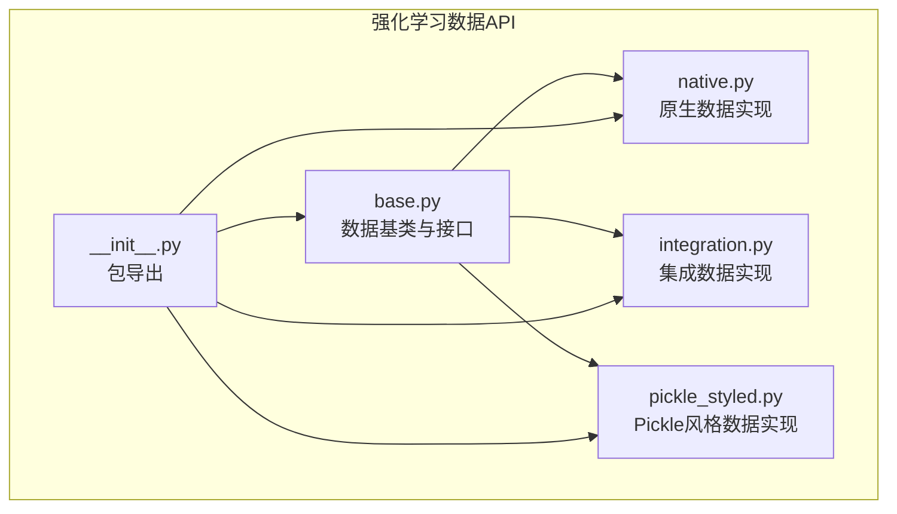
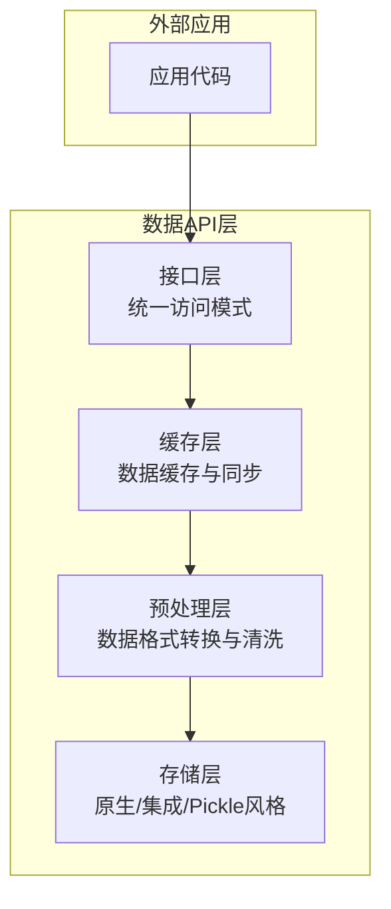
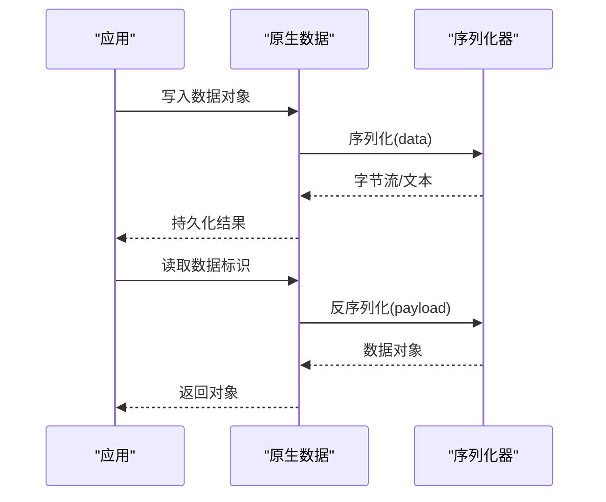
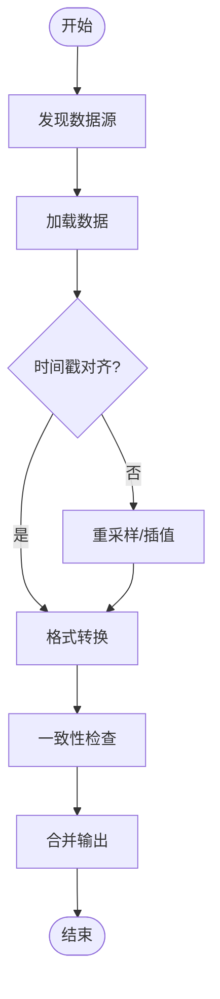
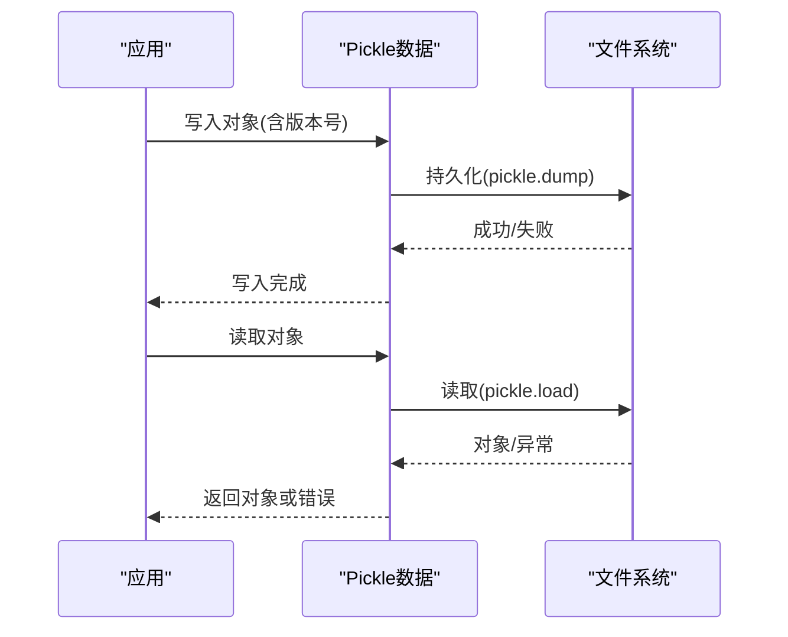
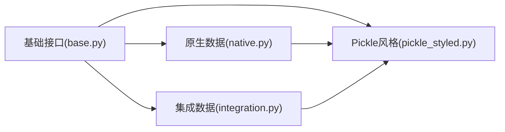

# 数据API

<cite>
**本文引用的文件**
- [base.py](file://qlib/rl/data/base.py)
- [native.py](file://qlib/rl/data/native.py)
- [integration.py](file://qlib/rl/data/integration.py)
- [pickle_styled.py](file://qlib/rl/data/pickle_styled.py)
- [__init__.py](file://qlib/rl/data/__init__.py)
- [gen_pickle_data.py](file://examples/rl_order_execution/scripts/gen_pickle_data.py)
- [pickle_data_config.yml](file://examples/rl_order_execution/scripts/pickle_data_config.yml)
- [merge_orders.py](file://examples/rl_order_execution/scripts/merge_orders.py)
- [gen_training_orders.py](file://examples/rl_order_execution/scripts/gen_training_orders.py)
- [backtest_opds.yml](file://examples/rl_order_execution/exp_configs/backtest_opds.yml)
- [backtest_ppo.yml](file://examples/rl_order_execution/exp_configs/backtest_ppo.yml)
- [train_opds.yml](file://examples/rl_order_execution/exp_configs/train_opds.yml)
- [train_ppo.yml](file://examples/rl_order_execution/exp_configs/train_ppo.yml)
</cite>

## 目录
1. [简介](#简介)
2. [项目结构](#项目结构)
3. [核心组件](#核心组件)
4. [架构总览](#架构总览)
5. [详细组件分析](#详细组件分析)
6. [依赖关系分析](#依赖关系分析)
7. [性能考虑](#性能考虑)
8. [故障排查指南](#故障排查指南)
9. [结论](#结论)
10. [附录](#附录)

## 简介
本文件面向Qlib强化学习模块的数据API，系统性梳理并说明以下能力：
- 数据基类接口：统一的数据抽象、数据格式定义、数据加载与预处理约定
- 原生数据(Native)接口：数据结构定义、序列化与反序列化流程
- 集成数据(Integration)接口：多数据源集成、格式转换与一致性保障
- Pickle风格数据(Pickle Styled)接口：持久化、传输与版本管理策略
- 数据接口(Interface)：访问模式、缓存与同步机制
- 实际使用示例：自定义数据格式开发、数据加载优化、数据处理流水线

## 项目结构
强化学习数据API位于强化学习子模块中，核心文件组织如下：
- 基类与接口：base.py
- 原生数据实现：native.py
- 集成数据实现：integration.py
- Pickle风格数据实现：pickle_styled.py
- 包导出入口：__init__.py

**图示来源**
- [base.py](file://qlib/rl/data/base.py)
- [native.py](file://qlib/rl/data/native.py)
- [integration.py](file://qlib/rl/data/integration.py)
- [pickle_styled.py](file://qlib/rl/data/pickle_styled.py)
- [__init__.py](file://qlib/rl/data/__init__.py)

**章节来源**
- [base.py](file://qlib/rl/data/base.py)
- [native.py](file://qlib/rl/data/native.py)
- [integration.py](file://qlib/rl/data/integration.py)
- [pickle_styled.py](file://qlib/rl/data/pickle_styled.py)
- [__init__.py](file://qlib/rl/data/__init__.py)

## 核心组件
本节概述各组件职责与交互关系：
- 数据基类与接口：定义统一的数据抽象、数据格式约束、加载与预处理规范
- 原生数据：面向具体数据源的实现，负责数据结构化、序列化与反序列化
- 集成数据：聚合多个数据源，进行格式转换与一致性校验
- Pickle风格数据：基于pickle的持久化与传输方案，支持版本管理
- 包导出：对外暴露统一的API入口

**章节来源**
- [base.py](file://qlib/rl/data/base.py)
- [native.py](file://qlib/rl/data/native.py)
- [integration.py](file://qlib/rl/data/integration.py)
- [pickle_styled.py](file://qlib/rl/data/pickle_styled.py)
- [__init__.py](file://qlib/rl/data/__init__.py)

## 架构总览
下图展示强化学习数据API的整体架构与调用关系：

[此图为概念性架构示意，不直接映射到具体源码文件，故无“图示来源”]

## 详细组件分析

### 数据基类与接口（Base）
- 职责
  - 定义数据抽象与统一接口
  - 规定数据格式、加载与预处理约定
  - 提供扩展点以适配不同数据源
- 关键点
  - 接口契约：如数据获取、元信息查询、生命周期管理
  - 数据格式：字段定义、类型约束、缺失值处理
  - 加载策略：按需加载、批量加载、增量更新
  - 预处理：标准化、归一化、特征工程等

**章节来源**
- [base.py](file://qlib/rl/data/base.py)

### 原生数据（Native）
- 职责
  - 面向具体数据源的实现，负责数据结构化
  - 提供序列化与反序列化能力
- 数据结构
  - 字段定义：包含时间戳、状态、动作、回报、终止标志等
  - 类型约束：确保字段类型一致，便于后续处理
- 序列化与反序列化
  - 序列化：将内存中的数据对象转换为可持久化的字节流或文本
  - 反序列化：从持久化介质恢复为内存对象
- 使用场景
  - 训练样本生成、回放缓冲区、日志记录

**图示来源**
- [native.py](file://qlib/rl/data/native.py)

**章节来源**
- [native.py](file://qlib/rl/data/native.py)

### 集成数据（Integration）
- 职责
  - 聚合来自多个数据源的数据
  - 进行格式转换与一致性校验
  - 统一输出标准格式供上层使用
- 多数据源集成
  - 数据源发现与注册
  - 并行/串行加载策略
  - 合并策略：拼接、对齐、去重
- 格式转换
  - 字段映射与重命名
  - 类型转换与校验
- 一致性保证
  - 时间戳对齐
  - 缺失值填充策略
  - 异常检测与告警

**图示来源**
- [integration.py](file://qlib/rl/data/integration.py)

**章节来源**
- [integration.py](file://qlib/rl/data/integration.py)

### Pickle风格数据（Pickle Styled）
- 职责
  - 基于pickle的持久化与传输
  - 支持版本管理，兼容历史数据格式
- 持久化
  - 对象序列化为二进制或文本
  - 支持压缩与加密选项（视配置而定）
- 传输
  - 小文件快速传输
  - 与远程存储/缓存配合
- 版本管理
  - 版本号标注
  - 向后兼容策略：新增字段默认值、弃用字段忽略
  - 升级路径：旧格式迁移脚本

**图示来源**
- [pickle_styled.py](file://qlib/rl/data/pickle_styled.py)

**章节来源**
- [pickle_styled.py](file://qlib/rl/data/pickle_styled.py)

### 数据接口（Interface）
- 职责
  - 提供统一的数据访问模式
  - 管理缓存与同步，提升访问效率
- 访问模式
  - 同步/异步访问
  - 批量/单条访问
  - 流式读取
- 缓存
  - 内存缓存：热点数据驻留
  - 分布式缓存：跨进程/跨节点共享
  - 缓存失效策略：TTL、LRU、版本变更触发
- 同步
  - 读写锁/无锁并发
  - 事件驱动的增量更新
  - 一致性协议：最终一致/强一致

**章节来源**
- [base.py](file://qlib/rl/data/base.py)

## 依赖关系分析
- 模块内依赖
  - 所有实现均依赖基础接口，确保行为一致性
  - 原生与集成实现可能共享通用工具函数
- 外部依赖
  - pickle：用于Pickle风格数据的序列化/反序列化
  - 文件系统/存储：用于原生与Pickle风格数据的持久化
  - 并发库：用于缓存与同步的实现

**图示来源**
- [base.py](file://qlib/rl/data/base.py)
- [native.py](file://qlib/rl/data/native.py)
- [integration.py](file://qlib/rl/data/integration.py)
- [pickle_styled.py](file://qlib/rl/data/pickle_styled.py)

**章节来源**
- [base.py](file://qlib/rl/data/base.py)
- [native.py](file://qlib/rl/data/native.py)
- [integration.py](file://qlib/rl/data/integration.py)
- [pickle_styled.py](file://qlib/rl/data/pickle_styled.py)

## 性能考虑
- 加载优化
  - 按需加载：延迟初始化、懒加载
  - 批量加载：减少I/O次数，提高吞吐
  - 增量更新：仅加载变化部分
- 预处理优化
  - 向量化操作：利用NumPy/Pandas加速
  - 内存映射：大文件零拷贝访问
  - 并行化：CPU密集型任务多核并行
- 缓存策略
  - 局部性原理：热点数据优先缓存
  - 失效策略：基于时间与访问频率的混合策略
- 存储优化
  - 压缩：降低存储与网络带宽占用
  - 分片：并行读写与负载均衡

[本节为通用性能建议，不直接分析具体源码文件，故无“章节来源”]

## 故障排查指南
- 常见问题
  - 数据格式不匹配：检查字段定义与类型约束
  - 序列化失败：确认pickle协议版本与依赖库版本
  - 集成冲突：核对时间戳对齐与字段映射
  - 缓存不一致：检查失效策略与并发控制
- 排查步骤
  - 开启调试日志，定位异常阶段
  - 校验输入数据范围与边界条件
  - 验证序列化/反序列化完整性
  - 回滚至最近稳定版本，逐步升级

[本节为通用故障排查建议，不直接分析具体源码文件，故无“章节来源”]

## 结论
Qlib强化学习数据API通过统一的基类接口，提供了原生数据、集成数据与Pickle风格数据三种实现方式，覆盖了从数据加载、预处理到持久化与传输的全链路需求。结合缓存与同步机制，可在保证一致性的同时提升性能。建议在实际项目中根据数据规模与访问模式选择合适的实现，并遵循版本管理与兼容性策略。

[本节为总结性内容，不直接分析具体源码文件，故无“章节来源”]

## 附录

### 使用示例与最佳实践
- 自定义数据格式开发
  - 基于基础接口实现新数据源，确保字段与方法符合契约
  - 在原生或集成实现中复用通用工具函数
- 数据加载优化
  - 利用批量加载与并行化，减少I/O等待
  - 对大文件采用内存映射与分片策略
- 数据处理流水线
  - 将数据加载、格式转换、预处理、缓存与同步串联
  - 通过配置文件管理数据源与参数，便于复现与扩展

**章节来源**
- [base.py](file://qlib/rl/data/base.py)
- [native.py](file://qlib/rl/data/native.py)
- [integration.py](file://qlib/rl/data/integration.py)
- [pickle_styled.py](file://qlib/rl/data/pickle_styled.py)

### 示例脚本与配置
- Pickle数据生成与合并
  - 生成训练订单数据：[gen_training_orders.py](file://examples/rl_order_execution/scripts/gen_training_orders.py)
  - 生成pickle数据：[gen_pickle_data.py](file://examples/rl_order_execution/scripts/gen_pickle_data.py)
  - 合并订单数据：[merge_orders.py](file://examples/rl_order_execution/scripts/merge_orders.py)
  - Pickle数据配置：[pickle_data_config.yml](file://examples/rl_order_execution/scripts/pickle_data_config.yml)
- RL实验配置
  - OPDS训练配置：[train_opds.yml](file://examples/rl_order_execution/exp_configs/train_opds.yml)
  - PPO训练配置：[train_ppo.yml](file://examples/rl_order_execution/exp_configs/train_ppo.yml)
  - OPDS回测配置：[backtest_opds.yml](file://examples/rl_order_execution/exp_configs/backtest_opds.yml)
  - PPO回测配置：[backtest_ppo.yml](file://examples/rl_order_execution/exp_configs/backtest_ppo.yml)

**章节来源**
- [gen_training_orders.py](file://examples/rl_order_execution/scripts/gen_training_orders.py)
- [gen_pickle_data.py](file://examples/rl_order_execution/scripts/gen_pickle_data.py)
- [merge_orders.py](file://examples/rl_order_execution/scripts/merge_orders.py)
- [pickle_data_config.yml](file://examples/rl_order_execution/scripts/pickle_data_config.yml)
- [train_opds.yml](file://examples/rl_order_execution/exp_configs/train_opds.yml)
- [train_ppo.yml](file://examples/rl_order_execution/exp_configs/train_ppo.yml)
- [backtest_opds.yml](file://examples/rl_order_execution/exp_configs/backtest_opds.yml)
- [backtest_ppo.yml](file://examples/rl_order_execution/exp_configs/backtest_ppo.yml)