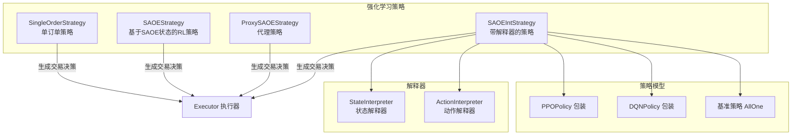
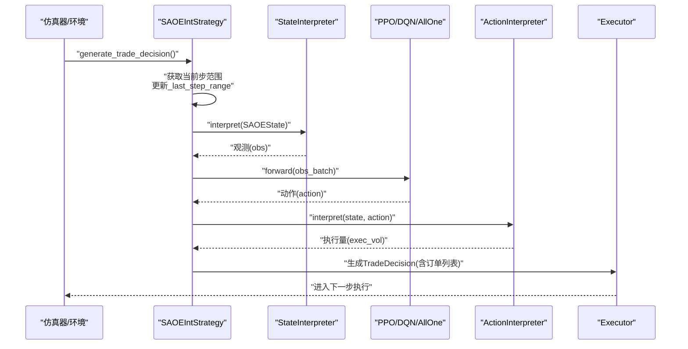
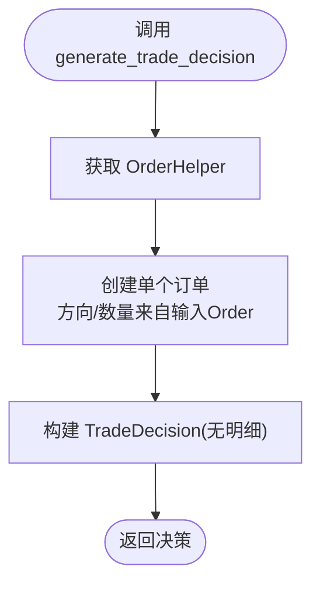
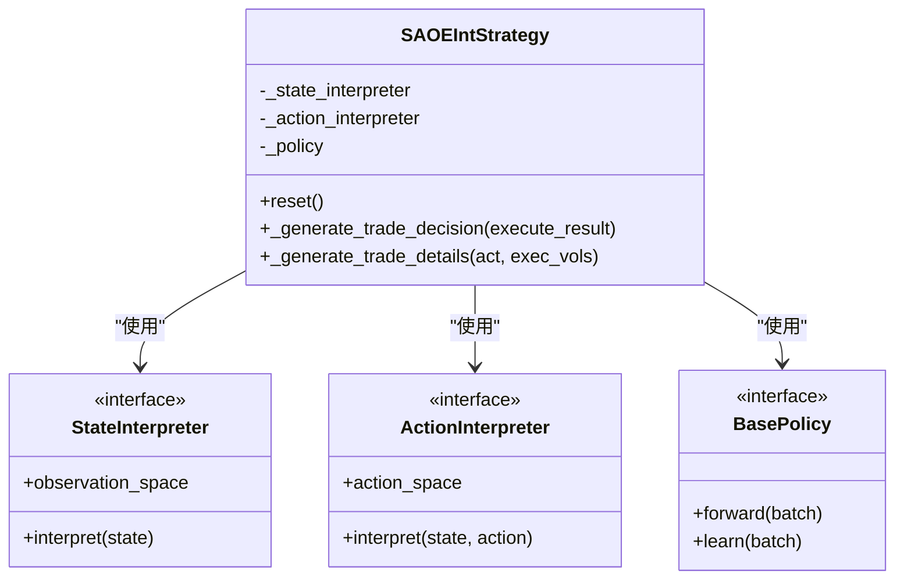
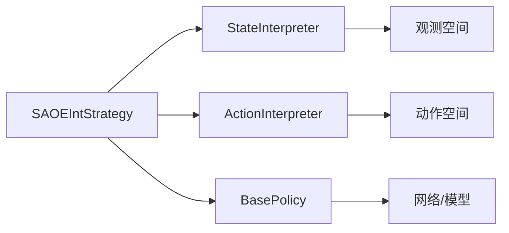

# 策略API

<cite>
**本文引用的文件**
- [single_order.py](file://qlib/rl/strategy/single_order.py)
- [strategy.py](file://qlib/rl/order_execution/strategy.py)
- [policy.py](file://qlib/rl/order_execution/policy.py)
- [interpreter.py](file://qlib/rl/order_execution/interpreter.py)
- [__init__.py（强化学习导出）](file://qlib/rl/order_execution/__init__.py)
- [executor.py](file://qlib/backtest/executor.py)
- [test_saoe_simple.py](file://tests/rl/test_saoe_simple.py)
- [strategy.rst（策略组件文档）](file://docs/component/strategy.rst)
</cite>

## 目录
1. [简介](#简介)
2. [项目结构](#项目结构)
3. [核心组件](#核心组件)
4. [架构总览](#架构总览)
5. [组件详解](#组件详解)
6. [依赖关系分析](#依赖关系分析)
7. [性能考量](#性能考量)
8. [故障排查指南](#故障排查指南)
9. [结论](#结论)
10. [附录：使用示例与最佳实践](#附录使用示例与最佳实践)

## 简介
本文件面向Qlib强化学习策略API，系统化梳理策略基类接口、单订单策略（SingleOrderStrategy）、RL驱动的订单执行策略（SAOEStrategy系列）、策略配置与参数管理、策略评估与比较、策略优化接口以及完整使用示例。目标是帮助读者从零开始理解并高效使用Qlib的强化学习策略体系，完成自定义策略开发、回测验证与优化。

## 项目结构
与策略API直接相关的核心模块位于强化学习子包中，主要包含：
- 策略基类与具体策略实现：rl/order_execution/strategy.py、rl/strategy/single_order.py
- 策略解释器（状态/动作）：rl/order_execution/interpreter.py
- 策略模型与基线：rl/order_execution/policy.py
- 强化学习导出入口：rl/order_execution/__init__.py
- 执行器与RL交互：backtest/executor.py
- 示例与测试：examples/rl_order_execution、tests/rl/test_saoe_simple.py

图表来源
- [strategy.py:301-551](file://qlib/rl/order_execution/strategy.py#L301-L551)
- [single_order.py:11-34](file://qlib/rl/strategy/single_order.py#L11-L34)
- [interpreter.py:68-250](file://qlib/rl/order_execution/interpreter.py#L68-L250)
- [policy.py:102-209](file://qlib/rl/order_execution/policy.py#L102-L209)
- [__init__.py（强化学习导出）:9-38](file://qlib/rl/order_execution/__init__.py#L9-L38)

章节来源
- [strategy.py:1-552](file://qlib/rl/order_execution/strategy.py#L1-L552)
- [single_order.py:1-34](file://qlib/rl/strategy/single_order.py#L1-L34)
- [interpreter.py:1-258](file://qlib/rl/order_execution/interpreter.py#L1-L258)
- [policy.py:1-238](file://qlib/rl/order_execution/policy.py#L1-L238)
- [__init__.py（强化学习导出）:1-38](file://qlib/rl/order_execution/__init__.py#L1-L38)

## 核心组件
- 策略基类与接口
  - RLStrategy（由SAOEStrategy继承）：统一了RL策略的生命周期、状态适配器、上层/下层执行步进回调、交易决策生成流程。
  - BaseStrategy（SingleOrderStrategy继承）：提供最简下单能力，直接按给定Order生成TradeDecision。
- 单订单策略（SingleOrderStrategy）
  - 输入：Order对象、可选交易时段；输出：仅一个Order的TradeDecision。
- RL订单执行策略（SAOEStrategy系列）
  - SAOEStrategy：抽象RL策略基类，负责维护每个订单的状态适配器、上下文数据、生成决策的框架。
  - ProxySAOEStrategy：代理策略，不自主决策，通过生成器将自身暴露给外部策略，由外部策略决定执行量。
  - SAOEIntStrategy：集成解释器与策略的策略，将SAOEState经解释器转换为观测，再由策略网络输出动作，最后由动作解释器转为执行量。
- 解释器
  - FullHistoryStateInterpreter / CurrentStepStateInterpreter：将SAOEState映射为观测字典或当前步观测。
  - CategoricalActionInterpreter / TwapRelativeActionInterpreter：将离散/连续动作解释为执行量。
- 策略模型
  - PPO：基于Tianshou的PPOPolicy包装，自动构建Actor/Critic，支持加载权重文件。
  - DQN：基于Tianshou的DQNPolicy包装，支持加载权重文件。
  - AllOne：非学习型策略，用于基线（如TWAP）。
- 执行器与RL交互
  - Executor在每一步调用策略生成交易决策，并处理策略返回的生成器以兼容RL训练循环。

章节来源
- [strategy.py:301-551](file://qlib/rl/order_execution/strategy.py#L301-L551)
- [single_order.py:11-34](file://qlib/rl/strategy/single_order.py#L11-L34)
- [interpreter.py:68-250](file://qlib/rl/order_execution/interpreter.py#L68-L250)
- [policy.py:102-209](file://qlib/rl/order_execution/policy.py#L102-L209)
- [executor.py:436-455](file://qlib/backtest/executor.py#L436-L455)

## 架构总览
下面的时序图展示了RL策略在执行器中的决策生成流程，以及与解释器、策略模型、状态适配器之间的交互。

图表来源
- [strategy.py:525-551](file://qlib/rl/order_execution/strategy.py#L525-L551)
- [interpreter.py:101-131](file://qlib/rl/order_execution/interpreter.py#L101-L131)
- [policy.py:102-159](file://qlib/rl/order_execution/policy.py#L102-L159)
- [executor.py:436-455](file://qlib/backtest/executor.py#L436-L455)

## 组件详解

### 策略基类与接口
- RLStrategy（SAOEStrategy继承）
  - 负责维护策略生命周期、状态适配器集合、上层/下层执行步进回调、交易决策生成框架。
  - 关键方法：reset、post_upper_level_exe_step、post_exe_step、generate_trade_decision（内部封装）、_generate_trade_decision（子类实现）。
- BaseStrategy（SingleOrderStrategy继承）
  - 提供最简下单能力：根据传入Order直接生成TradeDecision。

章节来源
- [strategy.py:301-404](file://qlib/rl/order_execution/strategy.py#L301-L404)
- [single_order.py:11-34](file://qlib/rl/strategy/single_order.py#L11-L34)

### 单订单策略（SingleOrderStrategy）
- 订单生成逻辑
  - 通过交易交换机的OrderHelper创建单个Order，方向与数量来自输入Order。
- 执行时机判断
  - 该策略不参与时间片决策，直接在调用时生成一次性TradeDecision。
- 风险控制
  - 通过TradeRange限制交易时段，避免跨时段执行。
- 使用场景
  - 快速验证交易基础设施、作为对比基线或简单规则策略。

图表来源
- [single_order.py:24-33](file://qlib/rl/strategy/single_order.py#L24-L33)

章节来源
- [single_order.py:11-34](file://qlib/rl/strategy/single_order.py#L11-L34)

### RL订单执行策略（SAOEStrategy系列）

#### SAOEStateAdapter
- 职责
  - 维护并更新SAOE状态历史、累计执行量、市场价格/成交量、收益指标等。
  - 在每步结束后计算指标，并在上层执行完成后生成最终指标。
- 关键点
  - 位置与执行量的归一化处理，确保累计执行量不超过剩余头寸。
  - 填充缺失数据，保证指标计算稳定。

章节来源
- [strategy.py:71-299](file://qlib/rl/order_execution/strategy.py#L71-L299)

#### SAOEStrategy
- 职责
  - 为每个订单维护一个SAOEStateAdapter实例，负责状态更新与指标生成。
  - 将“上层执行步进”与“下层执行步进”进行解耦，分别在合适时机调用。
- 决策生成
  - 每次生成决策前更新“最近步长范围”，屏蔽细节给子类实现。

章节来源
- [strategy.py:301-399](file://qlib/rl/order_execution/strategy.py#L301-L399)

#### ProxySAOEStrategy
- 特性
  - 不自主决策，通过生成器将自身暴露给外部策略；外部策略通过send()提供执行量。
  - 适合嵌套执行场景，使RL策略与Qlib执行器协同工作。
- 初始化
  - 外部策略需提供唯一的TradeDecisionWO，内部据此设置待执行的Order。

章节来源
- [strategy.py:407-443](file://qlib/rl/order_execution/strategy.py#L407-L443)

#### SAOEIntStrategy
- 特性
  - 集成StateInterpreter与ActionInterpreter，将SAOEState转换为观测，策略输出动作，再解释为执行量。
  - 支持从配置初始化策略与网络，自动设置观测/动作空间。
- 决策生成流程
  - 收集所有外层决策对应的SAOEState，解释为观测，策略推理得到动作，解释为执行量，构造订单列表并返回TradeDecisionWithDetails。

图表来源
- [strategy.py:445-551](file://qlib/rl/order_execution/strategy.py#L445-L551)
- [interpreter.py:68-250](file://qlib/rl/order_execution/interpreter.py#L68-L250)
- [policy.py:102-209](file://qlib/rl/order_execution/policy.py#L102-L209)

章节来源
- [strategy.py:445-551](file://qlib/rl/order_execution/strategy.py#L445-L551)
- [interpreter.py:68-250](file://qlib/rl/order_execution/interpreter.py#L68-L250)
- [policy.py:102-209](file://qlib/rl/order_execution/policy.py#L102-L209)

### 解释器（State/Action）
- FullHistoryStateInterpreter
  - 输出包含“今日处理特征（截止到当前时刻）、昨日处理特征、当前tick/步数、目标头寸、剩余头寸、头寸历史”等。
  - 观测空间为字典型Box/Discrete组合。
- CurrentStepStateInterpreter
  - 输出当前步的关键要素，适用于仅依赖最新状态的策略。
- CategoricalActionInterpreter
  - 将离散动作映射为比例，乘以订单剩余头寸与最大步数约束，得到执行量。
- TwapRelativeActionInterpreter
  - 将连续动作映射为相对TWAP的比例，按剩余步数估计TWAP量，得到执行量。

章节来源
- [interpreter.py:68-250](file://qlib/rl/order_execution/interpreter.py#L68-L250)

### 策略模型（Policy）
- PPO
  - 自动构建Actor/Critic，支持加载权重文件，提供丰富的超参（折扣因子、裁剪、价值系数等）。
- DQN
  - 自动构建模型，支持加载权重文件，提供双Q估计等特性。
- AllOne
  - 非学习型策略，常用于基线（如TWAP），返回固定动作值。

章节来源
- [policy.py:102-209](file://qlib/rl/order_execution/policy.py#L102-L209)

### 执行器与RL交互
- 当策略返回生成器时，执行器会“让渡控制权”，等待外部策略提供执行量后再继续。
- 这种机制使得RL策略与Qlib执行器可以无缝协作，支持嵌套执行与复杂调度。

章节来源
- [executor.py:436-455](file://qlib/backtest/executor.py#L436-L455)

## 依赖关系分析
- 组件内聚与耦合
  - SAOEIntStrategy高内聚地封装了“解释器 + 策略 + 动作解释器”的闭环，耦合度适中，便于扩展。
  - SAOEStateAdapter与SAOEState紧密耦合，负责状态与指标的累积与生成。
- 外部依赖
  - 依赖Tianshou（策略模型）、Gym（动作/观测空间）、Pandas/Numpy（指标计算）。
- 可能的循环依赖
  - 策略与解释器之间为单向依赖，未见循环导入迹象。

图表来源
- [strategy.py:445-551](file://qlib/rl/order_execution/strategy.py#L445-L551)
- [interpreter.py:68-250](file://qlib/rl/order_execution/interpreter.py#L68-L250)
- [policy.py:102-209](file://qlib/rl/order_execution/policy.py#L102-L209)

章节来源
- [strategy.py:445-551](file://qlib/rl/order_execution/strategy.py#L445-L551)
- [interpreter.py:68-250](file://qlib/rl/order_execution/interpreter.py#L68-L250)
- [policy.py:102-209](file://qlib/rl/order_execution/policy.py#L102-L209)

## 性能考量
- 观测与动作空间设计
  - FullHistoryStateInterpreter会构造大维度的观测，建议在训练/推理时关注内存与吞吐。
  - CategoricalActionInterpreter的动作数量应与剩余步数匹配，避免过度离散导致稀疏。
- 指标计算
  - SAOEStateAdapter在每步对执行量、价格、成交量进行聚合，注意批量处理与缺失值填充的效率。
- 策略推理
  - SAOEIntStrategy在推理阶段使用Batch封装观测，建议批量化以提升吞吐。

[本节为通用指导，无需列出章节来源]

## 故障排查指南
- 执行量超过剩余头寸
  - 现象：累计执行量超过剩余头寸，策略会进行线性缩放并告警。
  - 排查：检查动作解释器的输出是否受max_step约束，确认剩余头寸与步数估计。
- 观测/动作空间不匹配
  - 现象：策略初始化失败或forward报错。
  - 排查：确认StateInterpreter与ActionInterpreter的观测/动作空间与策略网络一致。
- 生成器控制权未正确让渡
  - 现象：RL训练循环卡住。
  - 排查：确认策略在需要时返回生成器，且执行器已正确处理生成器返回值。

章节来源
- [strategy.py:140-148](file://qlib/rl/order_execution/strategy.py#L140-L148)
- [strategy.py:525-551](file://qlib/rl/order_execution/strategy.py#L525-L551)
- [executor.py:436-455](file://qlib/backtest/executor.py#L436-L455)

## 结论
Qlib的强化学习策略API以SAOEStateAdapter为核心，围绕SAOEStrategy家族实现了从状态累积、指标生成到决策生成的完整闭环。通过解释器与策略模型的解耦设计，用户可以灵活替换观测/动作表示与策略算法，快速搭建并验证RL订单执行策略。配合完善的回测与报告体系，可在真实市场数据上进行稳健的策略评估与优化。

[本节为总结，无需列出章节来源]

## 附录：使用示例与最佳实践

### 策略配置与参数管理
- 使用配置初始化策略与网络
  - SAOEIntStrategy支持从配置字典初始化StateInterpreter、ActionInterpreter与策略网络，自动注入观测/动作空间。
  - 可通过配置指定策略类型（PPO/DQN/AllOne）与网络结构，便于实验管理与复现。
- 权重加载
  - PPO/DQN支持从训练产物加载权重，便于部署与迁移学习。

章节来源
- [strategy.py:458-504](file://qlib/rl/order_execution/strategy.py#L458-L504)
- [policy.py:114-159](file://qlib/rl/order_execution/policy.py#L114-L159)
- [policy.py:173-209](file://qlib/rl/order_execution/policy.py#L173-L209)

### 策略评估与比较
- 回测验证
  - 使用SAOEIntStrategy进行回测，结合PPO/DQN策略与解释器，输出包含执行量、动作等明细的交易决策。
  - 可参考测试用例中的训练与回测流程，验证策略在不同订单上的表现。
- 指标分析
  - 利用Qlib报告与分析模块，对超额收益、成本、最大回撤等指标进行统计分析，辅助策略比较。

章节来源
- [test_saoe_simple.py:309-329](file://tests/rl/test_saoe_simple.py#L309-L329)
- [strategy.rst（策略组件文档）:253-282](file://docs/component/strategy.rst#L253-L282)

### 策略优化接口
- 策略搜索与参数调优
  - 可通过配置文件切换StateInterpreter/ActionInterpreter与策略超参，结合网格/贝叶斯搜索进行调优。
- 策略组合
  - 可将多个策略（如PPO与AllOne）组合为混合策略，在不同时间段或市场状态下切换。

[本节为通用指导，无需列出章节来源]

### 完整使用示例（步骤级）
- 自定义策略开发
  - 步骤1：定义StateInterpreter与ActionInterpreter，确定观测与动作空间。
  - 步骤2：选择策略模型（PPO/DQN/AllOne），配置网络结构与超参。
  - 步骤3：使用SAOEIntStrategy封装策略，接入执行器进行回测。
- 策略回测
  - 步骤1：准备订单数据与市场特征数据。
  - 步骤2：初始化解释器与策略，运行回测并收集明细。
  - 步骤3：使用报告模块分析收益、成本与风险指标。
- 策略优化
  - 步骤1：设定超参搜索空间（学习率、折扣因子、动作离散度等）。
  - 步骤2：多组配置训练并回测，比较指标后选择最优配置。
  - 步骤3：加载最优权重进行部署或进一步微调。

[本节为通用指导，无需列出章节来源]