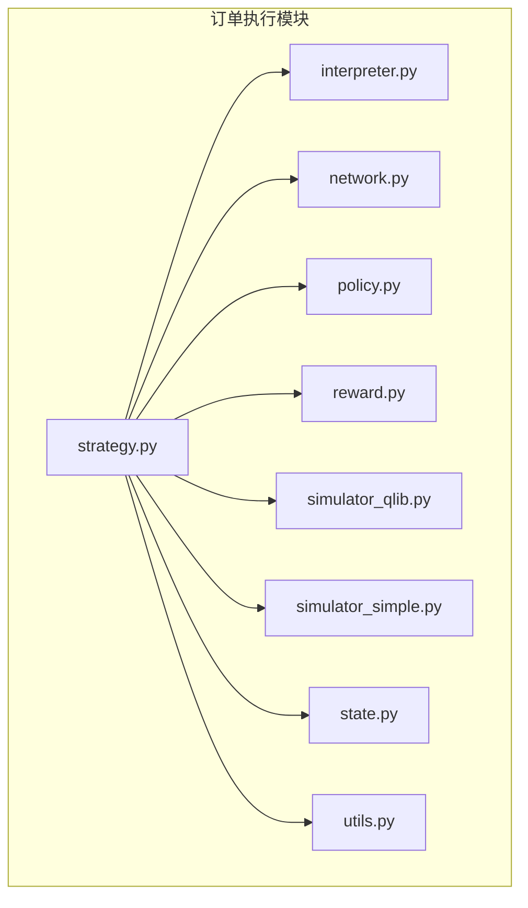
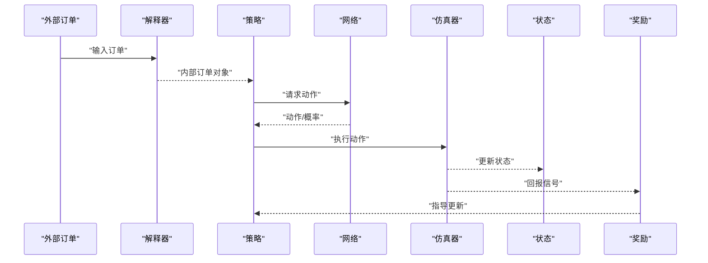
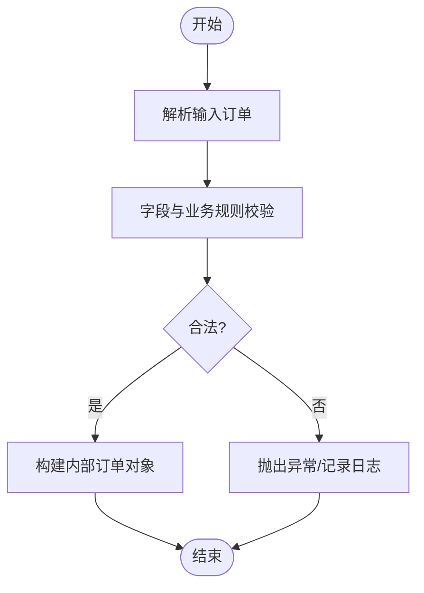
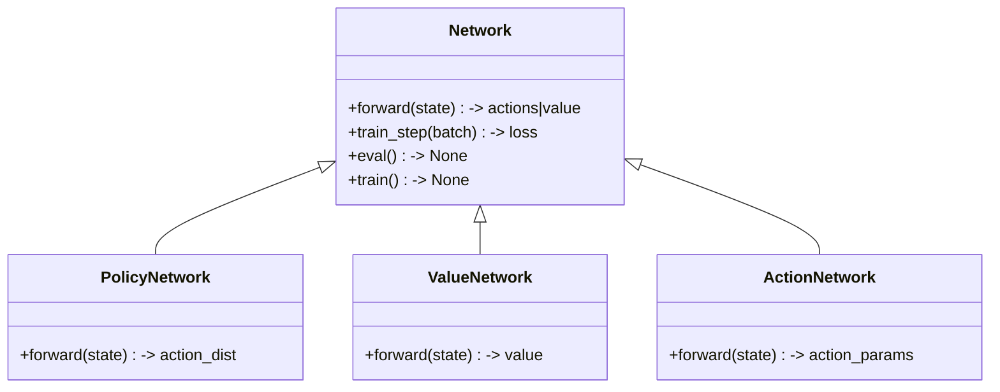
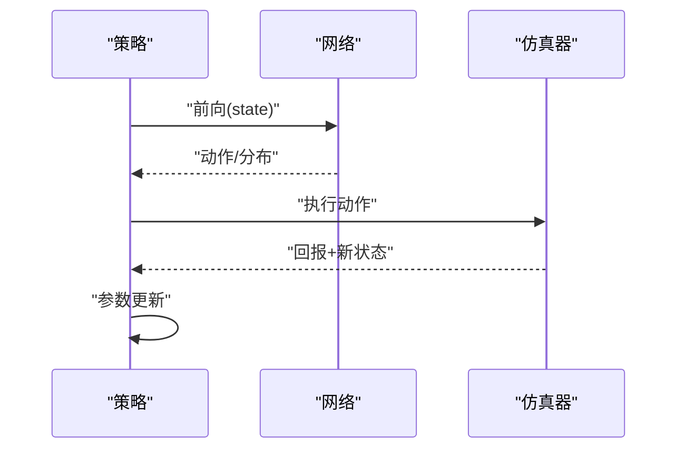
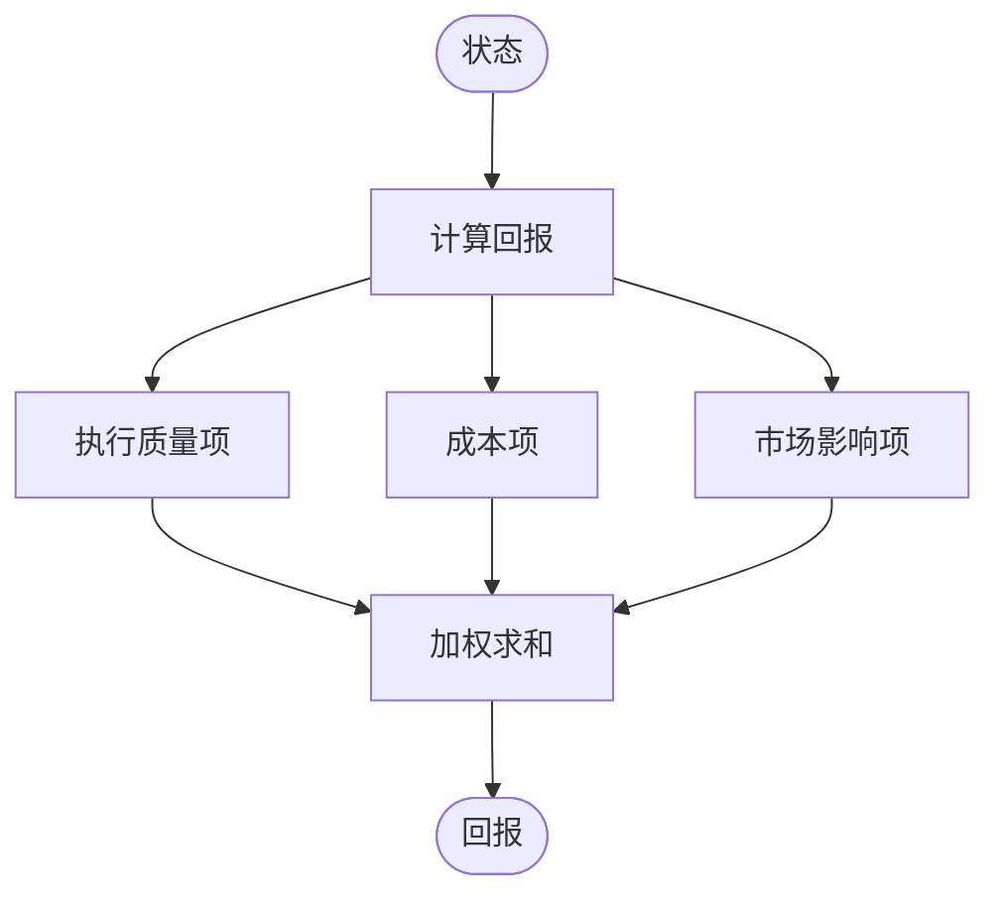
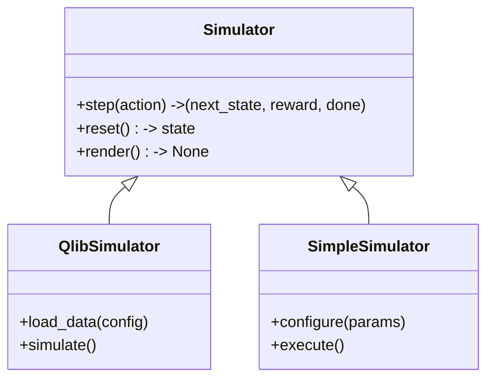
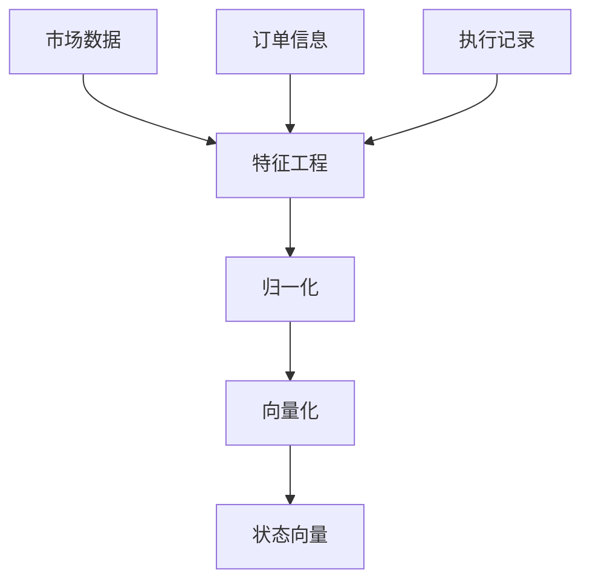
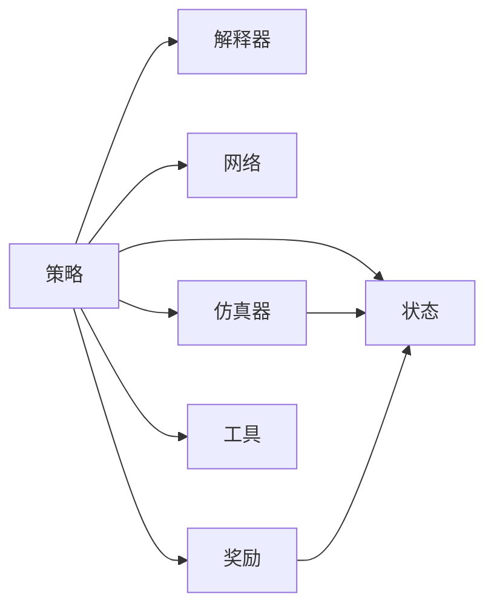

# 订单执行API

<cite>
**本文引用的文件**
- [interpreter.py](file://qlib/rl/order_execution/interpreter.py)
- [network.py](file://qlib/rl/order_execution/network.py)
- [policy.py](file://qlib/rl/order_execution/policy.py)
- [reward.py](file://qlib/rl/order_execution/reward.py)
- [simulator_qlib.py](file://qlib/rl/order_execution/simulator_qlib.py)
- [simulator_simple.py](file://qlib/rl/order_execution/simulator_simple.py)
- [state.py](file://qlib/rl/order_execution/state.py)
- [strategy.py](file://qlib/rl/order_execution/strategy.py)
- [utils.py](file://qlib/rl/order_execution/utils.py)
- [__init__.py](file://qlib/rl/order_execution/__init__.py)
- [README.md](file://examples/rl_order_execution/README.md)
- [exp_configs/train_ppo.yml](file://examples/rl_order_execution/exp_configs/train_ppo.yml)
- [exp_configs/backtest_ppo.yml](file://examples/rl_order_execution/exp_configs/backtest_ppo.yml)
- [exp_configs/train_opds.yml](file://examples/rl_order_execution/exp_configs/train_opds.yml)
- [exp_configs/backtest_opds.yml](file://examples/rl_order_execution/exp_configs/backtest_opds.yml)
- [exp_configs/backtest_twap.yml](file://examples/rl_order_execution/exp_configs/backtest_twap.yml)
- [scripts/gen_training_orders.py](file://examples/rl_order_execution/scripts/gen_training_orders.py)
- [scripts/gen_pickle_data.py](file://examples/rl_order_execution/scripts/gen_pickle_data.py)
- [scripts/merge_orders.py](file://examples/rl_order_execution/scripts/merge_orders.py)
- [pickle_data_config.yml](file://examples/rl_order_execution/scripts/pickle_data_config.yml)
- [test_qlib_simulator.py](file://tests/rl/test_qlib_simulator.py)
- [test_saoe_simple.py](file://tests/rl/test_saoe_simple.py)
</cite>

## 目录
1. [简介](#简介)
2. [项目结构](#项目结构)
3. [核心组件](#核心组件)
4. [架构总览](#架构总览)
5. [详细组件分析](#详细组件分析)
6. [依赖关系分析](#依赖关系分析)
7. [性能考虑](#性能考虑)
8. [故障排查指南](#故障排查指南)
9. [结论](#结论)
10. [附录：使用示例与最佳实践](#附录使用示例与最佳实践)

## 简介
本文件面向Qlib强化学习订单执行API，系统性梳理从订单生成、订单解释器、策略网络、奖励函数、仿真器到状态管理与工具函数的完整链路。重点覆盖以下主题：
- 订单执行策略接口：订单生成、订单路由、执行优化
- 订单解释器（Interpreter）：订单格式转换、解析、验证
- 网络（Neural Network）接口：策略网络、价值网络、动作网络
- 奖励函数（Reward）：执行质量评估、成本最小化、市场影响控制
- 仿真器（Simulator）：QLIB仿真器、简单仿真器
- 状态（State）管理：市场状态、订单状态、执行状态
- 工具（Utilities）：订单处理、状态转换、性能评估
- 实战示例：策略开发、仿真测试、性能优化

## 项目结构
订单执行相关代码位于强化学习子模块中，核心文件如下：
- interpreter.py：订单解释器，负责将外部订单格式转换为内部可执行的订单对象
- network.py：神经网络接口，定义策略网络、价值网络、动作网络等抽象
- policy.py：策略实现，封装动作选择、参数更新等逻辑
- reward.py：奖励函数，计算执行过程中的即时回报
- simulator_qlib.py：基于Qlib数据与回测框架的仿真器
- simulator_simple.py：简化版仿真器，便于快速验证
- state.py：状态表示与转换，聚合市场、订单、执行信息
- strategy.py：订单执行策略封装，连接解释器、网络、仿真器与奖励
- utils.py：通用工具函数，如订单处理、状态转换、评估指标
- __init__.py：模块导出入口

图表来源
- [strategy.py](file://qlib/rl/order_execution/strategy.py)
- [interpreter.py](file://qlib/rl/order_execution/interpreter.py)
- [network.py](file://qlib/rl/order_execution/network.py)
- [policy.py](file://qlib/rl/order_execution/policy.py)
- [reward.py](file://qlib/rl/order_execution/reward.py)
- [simulator_qlib.py](file://qlib/rl/order_execution/simulator_qlib.py)
- [simulator_simple.py](file://qlib/rl/order_execution/simulator_simple.py)
- [state.py](file://qlib/rl/order_execution/state.py)
- [utils.py](file://qlib/rl/order_execution/utils.py)

章节来源
- [__init__.py](file://qlib/rl/order_execution/__init__.py)

## 核心组件
- 订单解释器（Interpreter）
  - 职责：将外部订单格式转换为内部订单对象；解析订单字段；进行订单有效性校验
  - 关键点：支持多格式输入、统一字段映射、错误处理与日志
- 神经网络（Network）
  - 职责：定义策略网络、价值网络、动作网络的接口与抽象
  - 关键点：输入输出维度约定、激活函数与归一化策略、损失函数接口
- 策略（Policy）
  - 职责：动作选择、参数更新、探索策略（如ε-greedy、噪声）
  - 关键点：与网络耦合、与奖励衔接、与仿真器交互
- 奖励（Reward）
  - 职责：根据执行结果计算即时回报，引导策略优化
  - 关键点：执行质量、交易成本、市场冲击、时间价值
- 仿真器（Simulator）
  - Qlib仿真器：基于Qlib数据与回测框架，支持高频数据与真实市场行为
  - 简单仿真器：轻量级实现，便于快速验证算法思路
- 状态（State）
  - 职责：聚合市场状态、订单状态、执行状态，作为策略输入
  - 关键点：状态向量化、窗口化、归一化、时序扩展
- 工具（Utils）
  - 职责：订单处理、状态转换、性能评估指标计算
  - 关键点：标准化流程、可复用函数库

章节来源
- [interpreter.py](file://qlib/rl/order_execution/interpreter.py)
- [network.py](file://qlib/rl/order_execution/network.py)
- [policy.py](file://qlib/rl/order_execution/policy.py)
- [reward.py](file://qlib/rl/order_execution/reward.py)
- [simulator_qlib.py](file://qlib/rl/order_execution/simulator_qlib.py)
- [simulator_simple.py](file://qlib/rl/order_execution/simulator_simple.py)
- [state.py](file://qlib/rl/order_execution/state.py)
- [strategy.py](file://qlib/rl/order_execution/strategy.py)
- [utils.py](file://qlib/rl/order_execution/utils.py)

## 架构总览
订单执行API采用“策略-解释器-网络-仿真器-奖励-状态”的闭环架构。策略通过解释器接收订单，利用网络产生动作，仿真器模拟执行并返回回报，状态记录当前市场与执行情况，奖励指导策略优化。

图表来源
- [strategy.py](file://qlib/rl/order_execution/strategy.py)
- [interpreter.py](file://qlib/rl/order_execution/interpreter.py)
- [network.py](file://qlib/rl/order_execution/network.py)
- [simulator_qlib.py](file://qlib/rl/order_execution/simulator_qlib.py)
- [state.py](file://qlib/rl/order_execution/state.py)
- [reward.py](file://qlib/rl/order_execution/reward.py)

## 详细组件分析

### 订单解释器（Interpreter）
- 功能要点
  - 订单格式转换：支持多种外部格式到内部统一对象
  - 订单解析：提取标的、方向、数量、时间窗等关键字段
  - 订单验证：检查字段合法性、剩余未成交数量、价格约束
- 接口设计
  - 输入：原始订单（字典/DataFrame/序列化对象）
  - 输出：内部订单对象（包含必要字段与元数据）
- 错误处理
  - 非法字段、缺失字段、数值越界、时间冲突等情况的报错与日志

图表来源
- [interpreter.py](file://qlib/rl/order_execution/interpreter.py)

章节来源
- [interpreter.py](file://qlib/rl/order_execution/interpreter.py)

### 神经网络（Network）
- 功能要点
  - 策略网络：输出动作分布或确定性动作
  - 价值网络：评估状态价值，用于优势估计或基线
  - 动作网络：在连续动作空间中输出动作参数（如均值/方差）
- 接口设计
  - 输入：状态张量（可能包含历史窗口）
  - 输出：动作分布/确定性动作、状态价值等
- 训练与推理
  - 训练阶段：结合回报与监督信号更新参数
  - 推理阶段：稳定、低延迟的动作选择

图表来源
- [network.py](file://qlib/rl/order_execution/network.py)

章节来源
- [network.py](file://qlib/rl/order_execution/network.py)

### 策略（Policy）
- 功能要点
  - 动作选择：基于网络输出与探索策略选择动作
  - 参数更新：在每步或批量更新网络参数
  - 多策略支持：如PPO、OPDS等
- 与仿真器协作
  - 将动作传递给仿真器执行，接收回报与新状态

图表来源
- [policy.py](file://qlib/rl/order_execution/policy.py)
- [network.py](file://qlib/rl/order_execution/network.py)
- [simulator_qlib.py](file://qlib/rl/order_execution/simulator_qlib.py)

章节来源
- [policy.py](file://qlib/rl/order_execution/policy.py)

### 奖励（Reward）
- 功能要点
  - 执行质量：基于成交量、成交价与参考价的偏离度
  - 成本最小化：交易成本、滑点、冲击成本
  - 市场影响控制：避免大额订单对市场的显著扰动
- 设计原则
  - 即时回报与长期回报平衡
  - 可微分或可近似可微分，便于端到端训练

图表来源
- [reward.py](file://qlib/rl/order_execution/reward.py)

章节来源
- [reward.py](file://qlib/rl/order_execution/reward.py)

### 仿真器（Simulator）
- Qlib仿真器
  - 基于Qlib数据与回测框架，支持高频数据、真实市场行为建模
  - 提供订单簿驱动的执行模拟、滑点与冲击模型
- 简单仿真器
  - 轻量实现，适合快速原型与单元测试
  - 可配置滑点、流动性、冲击系数等

图表来源
- [simulator_qlib.py](file://qlib/rl/order_execution/simulator_qlib.py)
- [simulator_simple.py](file://qlib/rl/order_execution/simulator_simple.py)

章节来源
- [simulator_qlib.py](file://qlib/rl/order_execution/simulator_qlib.py)
- [simulator_simple.py](file://qlib/rl/order_execution/simulator_simple.py)

### 状态（State）
- 功能要点
  - 市场状态：价格序列、成交量、买卖盘深度、波动率等
  - 订单状态：剩余未成交数量、委托时间窗、限价/市价等
  - 执行状态：已成交数量、平均成交价、滑点累计等
- 设计要点
  - 向量化与窗口化：便于网络输入
  - 归一化与特征工程：提升训练稳定性
  - 时序扩展：引入历史窗口与技术指标

图表来源
- [state.py](file://qlib/rl/order_execution/state.py)

章节来源
- [state.py](file://qlib/rl/order_execution/state.py)

### 工具（Utilities）
- 功能要点
  - 订单处理：订单合并、拆分、排序、去重
  - 状态转换：状态编码、解码、窗口滑动
  - 性能评估：收益、最大回撤、夏普比率、换手率等指标
- 设计原则
  - 可复用、可配置、可扩展

章节来源
- [utils.py](file://qlib/rl/order_execution/utils.py)

## 依赖关系分析
- 模块内依赖
  - 策略依赖解释器、网络、仿真器、奖励、状态与工具
  - 解释器与状态独立，但被策略广泛调用
  - 网络与策略耦合度高，仿真器与奖励贯穿训练/推理
- 测试覆盖
  - 存在针对QLIB仿真器与简单仿真器的单元测试，确保核心流程正确性

图表来源
- [strategy.py](file://qlib/rl/order_execution/strategy.py)
- [interpreter.py](file://qlib/rl/order_execution/interpreter.py)
- [network.py](file://qlib/rl/order_execution/network.py)
- [simulator_qlib.py](file://qlib/rl/order_execution/simulator_qlib.py)
- [state.py](file://qlib/rl/order_execution/state.py)
- [utils.py](file://qlib/rl/order_execution/utils.py)

章节来源
- [test_qlib_simulator.py](file://tests/rl/test_qlib_simulator.py)
- [test_saoe_simple.py](file://tests/rl/test_saoe_simple.py)

## 性能考虑
- 训练效率
  - 使用批量化与GPU加速；合理设置学习率与优化器
  - 状态归一化与特征工程减少训练不稳
- 推理效率
  - 简化网络结构与提前剪枝；缓存热点状态
- 仿真效率
  - Qlib仿真器建议使用预处理数据与高效数据加载
  - 简单仿真器适合快速迭代，复杂场景再迁移到QLIB仿真器

## 故障排查指南
- 订单解释器问题
  - 症状：无法解析或校验失败
  - 排查：检查输入格式、字段映射、边界条件
- 仿真器问题
  - 症状：回报异常、状态不更新
  - 排查：确认动作范围、滑点/冲击参数、数据加载是否正确
- 网络训练问题
  - 症状：回报不增长、梯度爆炸/消失
  - 排查：检查归一化、学习率、损失函数与正则化
- 状态管理问题
  - 症状：状态维度不匹配、越界访问
  - 排查：核对特征工程与窗口长度

章节来源
- [interpreter.py](file://qlib/rl/order_execution/interpreter.py)
- [simulator_qlib.py](file://qlib/rl/order_execution/simulator_qlib.py)
- [state.py](file://qlib/rl/order_execution/state.py)
- [utils.py](file://qlib/rl/order_execution/utils.py)

## 结论
Qlib强化学习订单执行API以清晰的模块划分与稳健的仿真框架为基础，覆盖从订单解释、状态建模、策略网络到仿真与奖励的全链路。通过可扩展的接口设计与完善的工具函数，开发者可以快速搭建并优化订单执行策略，并在真实市场数据上进行可靠评估。

## 附录：使用示例与最佳实践
- 示例与配置
  - 示例目录包含训练与回测配置文件，涵盖PPO与OPDS策略
  - 训练/回测配置文件分别定义超参、环境、数据源与评估指标
  - 训练数据生成脚本与pickle数据合并脚本提供数据准备流程
- 快速开始步骤
  - 准备训练数据：使用数据生成脚本与配置文件
  - 运行训练：加载配置文件，启动训练流程
  - 回测验证：加载训练好的策略，运行回测配置
- 最佳实践
  - 先用简单仿真器验证策略可行性，再迁移到QLIB仿真器
  - 对状态进行充分特征工程与归一化，提升训练稳定性
  - 在奖励函数中平衡执行质量、成本与市场影响
  - 使用工具函数进行性能评估，持续监控关键指标

章节来源
- [README.md](file://examples/rl_order_execution/README.md)
- [exp_configs/train_ppo.yml](file://examples/rl_order_execution/exp_configs/train_ppo.yml)
- [exp_configs/backtest_ppo.yml](file://examples/rl_order_execution/exp_configs/backtest_ppo.yml)
- [exp_configs/train_opds.yml](file://examples/rl_order_execution/exp_configs/train_opds.yml)
- [exp_configs/backtest_opds.yml](file://examples/rl_order_execution/exp_configs/backtest_opds.yml)
- [exp_configs/backtest_twap.yml](file://examples/rl_order_execution/exp_configs/backtest_twap.yml)
- [scripts/gen_training_orders.py](file://examples/rl_order_execution/scripts/gen_training_orders.py)
- [scripts/gen_pickle_data.py](file://examples/rl_order_execution/scripts/gen_pickle_data.py)
- [scripts/merge_orders.py](file://examples/rl_order_execution/scripts/merge_orders.py)
- [pickle_data_config.yml](file://examples/rl_order_execution/scripts/pickle_data_config.yml)