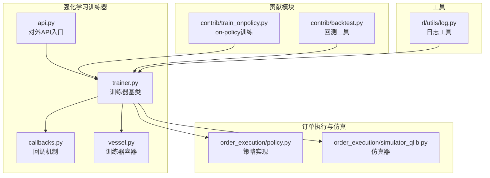
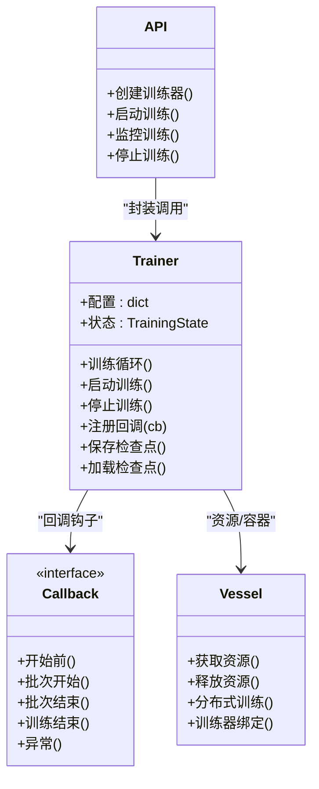
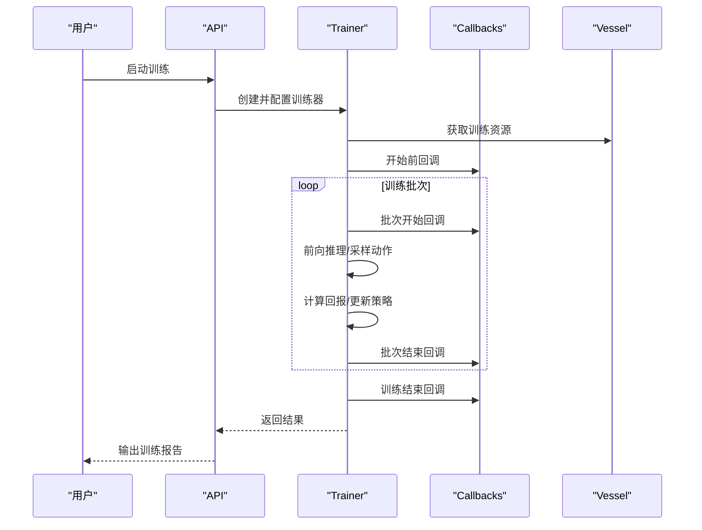
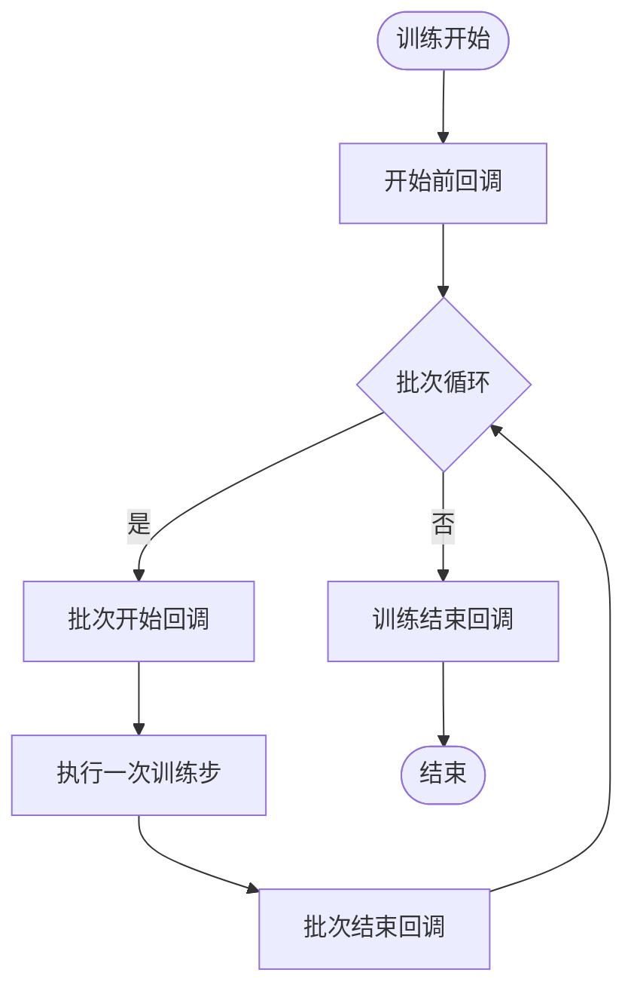
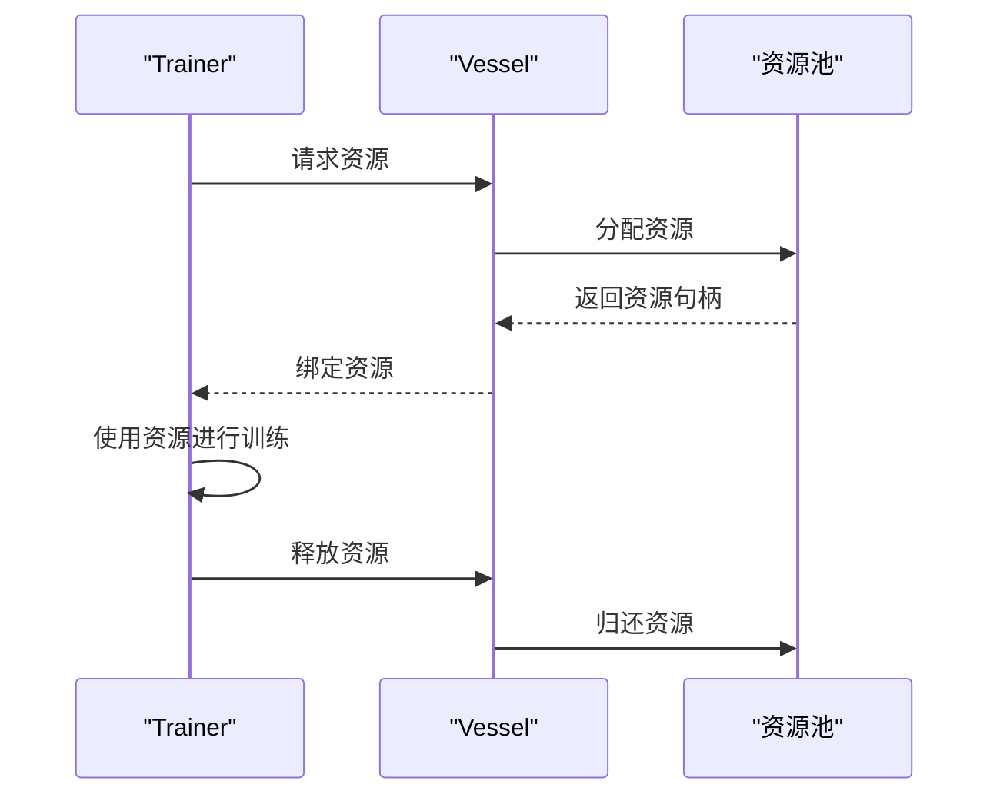
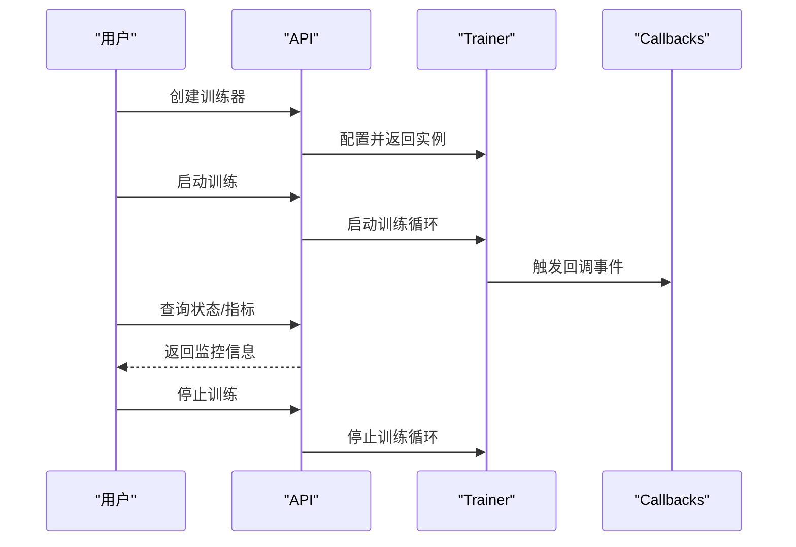
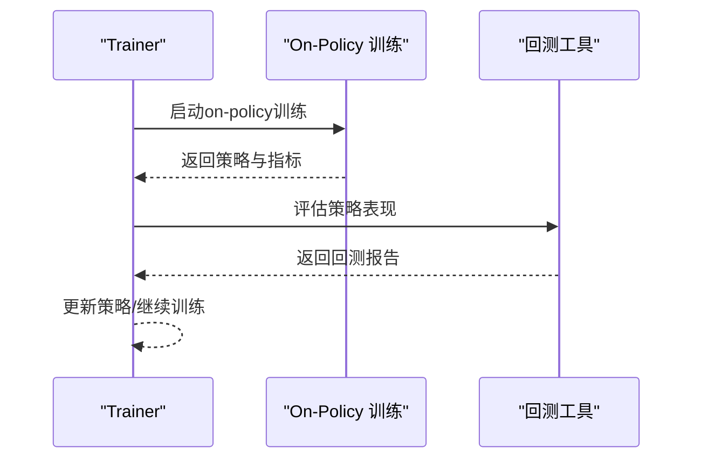
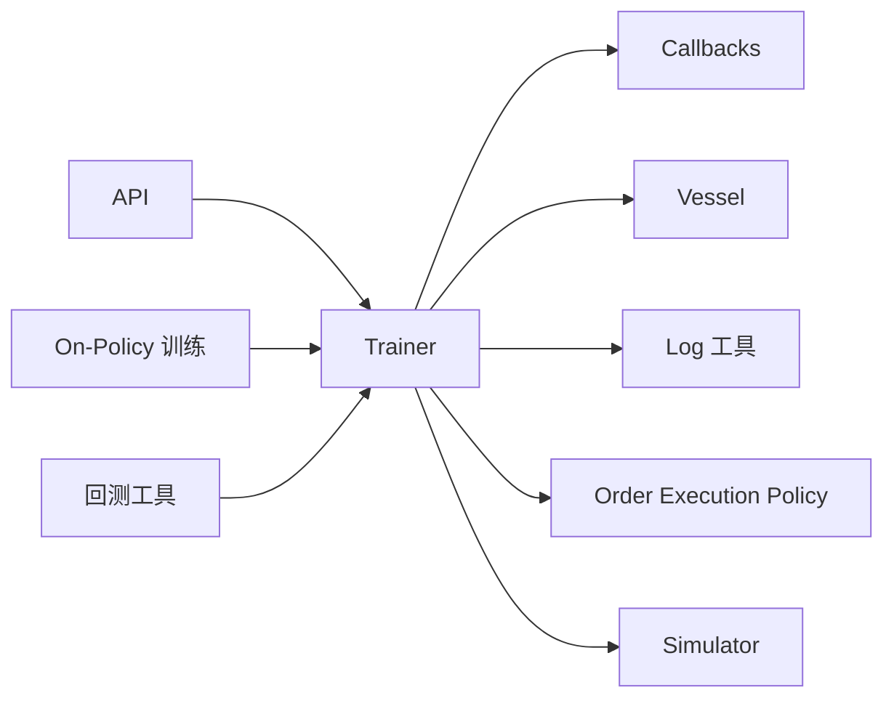

# 训练器API

<cite>
**本文引用的文件**
- [trainer.py](file://qlib/rl/trainer/trainer.py)
- [callbacks.py](file://qlib/rl/trainer/callbacks.py)
- [vessel.py](file://qlib/rl/trainer/vessel.py)
- [api.py](file://qlib/rl/trainer/api.py)
- [test_trainer.py](file://tests/rl/test_trainer.py)
- [contrib_train_onpolicy.py](file://qlib/rl/contrib/train_onpolicy.py)
- [contrib_backtest.py](file://qlib/rl/contrib/backtest.py)
- [order_execution_policy.py](file://qlib/rl/order_execution/policy.py)
- [order_execution_simulator_qlib.py](file://qlib/rl/order_execution/simulator_qlib.py)
- [rl_utils_log.py](file://qlib/rl/utils/log.py)
</cite>

## 目录
1. [简介](#简介)
2. [项目结构](#项目结构)
3. [核心组件](#核心组件)
4. [架构总览](#架构总览)
5. [详细组件分析](#详细组件分析)
6. [依赖关系分析](#依赖关系分析)
7. [性能考量](#性能考量)
8. [故障排查指南](#故障排查指南)
9. [结论](#结论)
10. [附录：使用示例与最佳实践](#附录使用示例与最佳实践)

## 简介
本文件系统性梳理 Qlib 强化学习训练器API，覆盖训练器基类接口、训练循环与配置、训练状态管理、训练回调机制、训练器容器（Vessel）以及贡献模块中的在线训练能力。文档以循序渐进的方式呈现，既适合初学者快速上手，也为高级用户提供深入的技术细节与可视化图示。

## 项目结构
强化学习训练器位于 qlib/rl/trainer 目录下，包含训练器基类、回调机制、训练器容器以及对外API入口；同时在 qlib/rl/contrib 提供了在线训练与回测辅助工具；测试用例位于 tests/rl 下，用于验证训练器行为。

**图表来源**
- [api.py](file://qlib/rl/trainer/api.py)
- [trainer.py](file://qlib/rl/trainer/trainer.py)
- [callbacks.py](file://qlib/rl/trainer/callbacks.py)
- [vessel.py](file://qlib/rl/trainer/vessel.py)
- [contrib_train_onpolicy.py](file://qlib/rl/contrib/train_onpolicy.py)
- [contrib_backtest.py](file://qlib/rl/contrib/backtest.py)
- [order_execution_policy.py](file://qlib/rl/order_execution/policy.py)
- [order_execution_simulator_qlib.py](file://qlib/rl/order_execution/simulator_qlib.py)
- [rl_utils_log.py](file://qlib/rl/utils/log.py)

**章节来源**
- [trainer.py](file://qlib/rl/trainer/trainer.py)
- [callbacks.py](file://qlib/rl/trainer/callbacks.py)
- [vessel.py](file://qlib/rl/trainer/vessel.py)
- [api.py](file://qlib/rl/trainer/api.py)

## 核心组件
- 训练器基类（Trainer）
  - 负责训练循环、训练配置加载与应用、训练状态管理、与环境/策略/仿真器交互。
  - 支持回调钩子，便于扩展训练过程中的事件处理（如保存检查点、日志记录、早停等）。
- 回调机制（Callbacks）
  - 定义训练关键节点的回调接口，允许用户注入自定义逻辑（进度、检查点、日志、评估等）。
- 训练器容器（Vessel）
  - 封装训练资源与分布式训练支持，统一管理训练生命周期内的资源分配与回收。
- 对外API（API）
  - 提供高层封装，简化训练器实例化、启动、监控与停止流程。
- 贡献模块（Contrib）
  - 提供 on-policy 训练与回测辅助工具，便于集成到训练流程中。
- 工具与日志
  - 日志工具为训练过程提供统一的日志输出与级别控制。

**章节来源**
- [trainer.py](file://qlib/rl/trainer/trainer.py)
- [callbacks.py](file://qlib/rl/trainer/callbacks.py)
- [vessel.py](file://qlib/rl/trainer/vessel.py)
- [api.py](file://qlib/rl/trainer/api.py)
- [contrib_train_onpolicy.py](file://qlib/rl/contrib/train_onpolicy.py)
- [contrib_backtest.py](file://qlib/rl/contrib/backtest.py)
- [rl_utils_log.py](file://qlib/rl/utils/log.py)

## 架构总览
训练器API采用“基类+回调+容器+API”的分层设计，训练器负责核心训练循环与状态管理，回调提供可插拔的扩展点，容器负责资源与分布式支持，API提供易用的高层封装。

**图表来源**
- [trainer.py](file://qlib/rl/trainer/trainer.py)
- [callbacks.py](file://qlib/rl/trainer/callbacks.py)
- [vessel.py](file://qlib/rl/trainer/vessel.py)
- [api.py](file://qlib/rl/trainer/api.py)

## 详细组件分析

### 训练器基类（Trainer）
- 训练循环
  - 维护训练状态机，按批次推进训练，调用策略与仿真器交互，收集回报并更新策略参数。
  - 支持断点续训：通过检查点恢复训练状态。
- 训练配置
  - 接收外部配置字典，解析超参、数据路径、环境参数、仿真设置等，并在训练前应用。
- 训练状态管理
  - 定义训练阶段（初始化、运行中、暂停、完成、失败），并提供状态查询与转换方法。
- 回调集成
  - 在关键节点触发回调，如每批次开始/结束、训练开始/结束、异常发生时。
- 检查点与日志
  - 提供保存/加载检查点的方法，结合日志工具输出训练进度与指标。

**图表来源**
- [api.py](file://qlib/rl/trainer/api.py)
- [trainer.py](file://qlib/rl/trainer/trainer.py)
- [callbacks.py](file://qlib/rl/trainer/callbacks.py)
- [vessel.py](file://qlib/rl/trainer/vessel.py)

**章节来源**
- [trainer.py](file://qlib/rl/trainer/trainer.py)
- [callbacks.py](file://qlib/rl/trainer/callbacks.py)
- [vessel.py](file://qlib/rl/trainer/vessel.py)
- [rl_utils_log.py](file://qlib/rl/utils/log.py)

### 训练回调（Callbacks）
- 回调接口
  - 定义训练开始前、批次开始、批次结束、训练结束后、异常时等钩子。
- 典型用途
  - 进度打印、模型检查点保存、日志记录、早停策略、评估与可视化。
- 自定义回调
  - 可继承回调基类，实现特定钩子逻辑，注册到训练器后自动生效。

**图表来源**
- [callbacks.py](file://qlib/rl/trainer/callbacks.py)
- [trainer.py](file://qlib/rl/trainer/trainer.py)

**章节来源**
- [callbacks.py](file://qlib/rl/trainer/callbacks.py)
- [trainer.py](file://qlib/rl/trainer/trainer.py)

### 训练器容器（Vessel）
- 资源管理
  - 统一申请/释放训练所需资源（如GPU/CPU、内存、数据队列等），避免资源泄漏。
- 分布式支持
  - 提供分布式训练的抽象，屏蔽底层通信细节，便于扩展到多机多卡场景。
- 生命周期绑定
  - 与训练器强绑定，在训练开始前获取资源，在训练结束后释放资源。

**图表来源**
- [vessel.py](file://qlib/rl/trainer/vessel.py)
- [trainer.py](file://qlib/rl/trainer/trainer.py)

**章节来源**
- [vessel.py](file://qlib/rl/trainer/vessel.py)
- [trainer.py](file://qlib/rl/trainer/trainer.py)

### 对外API（API）
- 训练器创建
  - 提供工厂方法或高层封装，简化训练器实例化与配置。
- 训练启动/停止
  - 封装启动与停止流程，确保回调与容器的正确调用顺序。
- 训练监控
  - 提供训练状态查询、指标获取与可视化接口，便于实时监控。

**图表来源**
- [api.py](file://qlib/rl/trainer/api.py)
- [trainer.py](file://qlib/rl/trainer/trainer.py)
- [callbacks.py](file://qlib/rl/trainer/callbacks.py)

**章节来源**
- [api.py](file://qlib/rl/trainer/api.py)
- [trainer.py](file://qlib/rl/trainer/trainer.py)

### 贡献模块：在线训练与回测
- on-policy 训练
  - 提供 on-policy 训练流程的封装，便于与训练器集成，支持增量学习与在线策略更新。
- 回测工具
  - 提供回测辅助函数，用于评估策略在历史数据上的表现，支撑在线训练后的策略验证。

**图表来源**
- [contrib_train_onpolicy.py](file://qlib/rl/contrib/train_onpolicy.py)
- [contrib_backtest.py](file://qlib/rl/contrib/backtest.py)
- [trainer.py](file://qlib/rl/trainer/trainer.py)

**章节来源**
- [contrib_train_onpolicy.py](file://qlib/rl/contrib/train_onpolicy.py)
- [contrib_backtest.py](file://qlib/rl/contrib/backtest.py)
- [trainer.py](file://qlib/rl/trainer/trainer.py)

## 依赖关系分析
- 训练器依赖
  - 训练器依赖回调机制以实现可插拔扩展，依赖容器进行资源管理，依赖日志工具输出训练信息。
- 外部模块依赖
  - 与订单执行策略与仿真器协作，用于强化学习训练中的环境交互。
- 测试验证
  - 测试用例覆盖训练器基本行为，验证回调、状态管理与容器资源释放等关键路径。

**图表来源**
- [trainer.py](file://qlib/rl/trainer/trainer.py)
- [callbacks.py](file://qlib/rl/trainer/callbacks.py)
- [vessel.py](file://qlib/rl/trainer/vessel.py)
- [api.py](file://qlib/rl/trainer/api.py)
- [contrib_train_onpolicy.py](file://qlib/rl/contrib/train_onpolicy.py)
- [contrib_backtest.py](file://qlib/rl/contrib/backtest.py)
- [order_execution_policy.py](file://qlib/rl/order_execution/policy.py)
- [order_execution_simulator_qlib.py](file://qlib/rl/order_execution/simulator_qlib.py)
- [rl_utils_log.py](file://qlib/rl/utils/log.py)

**章节来源**
- [trainer.py](file://qlib/rl/trainer/trainer.py)
- [callbacks.py](file://qlib/rl/trainer/callbacks.py)
- [vessel.py](file://qlib/rl/trainer/vessel.py)
- [api.py](file://qlib/rl/trainer/api.py)
- [test_trainer.py](file://tests/rl/test_trainer.py)

## 性能考量
- 资源管理
  - 使用容器统一管理资源，避免频繁分配/释放带来的开销；在分布式场景下注意通信开销与负载均衡。
- 回调开销
  - 回调应尽量轻量，避免在批次回调中执行重计算；必要时异步化或批量化。
- 日志频率
  - 控制日志输出频率，避免I/O成为瓶颈；建议在关键节点输出关键指标。
- 训练批次数与步数
  - 合理设置批次大小与步数，平衡收敛速度与稳定性；结合早停策略防止过拟合。

## 故障排查指南
- 训练无法启动
  - 检查配置是否正确加载，确认回调与容器初始化无异常。
- 训练卡住或崩溃
  - 查看异常回调是否被触发，结合日志定位问题；检查资源是否被正确释放。
- 指标异常
  - 核对策略与仿真器交互逻辑，确认回报计算与更新步骤正确。
- 分布式训练异常
  - 检查容器的分布式接口实现，确认资源绑定与释放顺序正确。

**章节来源**
- [trainer.py](file://qlib/rl/trainer/trainer.py)
- [callbacks.py](file://qlib/rl/trainer/callbacks.py)
- [vessel.py](file://qlib/rl/trainer/vessel.py)
- [rl_utils_log.py](file://qlib/rl/utils/log.py)

## 结论
Qlib 强化学习训练器API通过清晰的分层设计与可插拔的回调机制，提供了灵活且可扩展的训练框架。结合容器化的资源管理与对外API的高层封装，用户可以快速构建从单机到分布式、从离线到在线的强化学习训练流程。配合贡献模块与测试用例，能够有效支撑增量学习与在线策略更新等高级场景。

## 附录：使用示例与最佳实践
- 自定义训练器开发
  - 建议继承训练器基类，重写训练循环的关键步骤，并注册必要的回调以实现检查点、日志与评估。
- 训练配置优化
  - 优先从配置文件加载超参，结合回调实现动态调整学习率或早停策略。
- 训练监控
  - 使用API提供的监控接口定期查询状态与指标，结合日志工具输出关键信息。
- 在线训练集成
  - 通过贡献模块的 on-policy 训练与回测工具，实现策略的增量学习与效果验证。

**章节来源**
- [trainer.py](file://qlib/rl/trainer/trainer.py)
- [callbacks.py](file://qlib/rl/trainer/callbacks.py)
- [vessel.py](file://qlib/rl/trainer/vessel.py)
- [api.py](file://qlib/rl/trainer/api.py)
- [contrib_train_onpolicy.py](file://qlib/rl/contrib/train_onpolicy.py)
- [contrib_backtest.py](file://qlib/rl/contrib/backtest.py)
- [test_trainer.py](file://tests/rl/test_trainer.py)