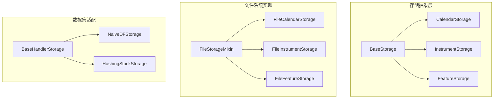
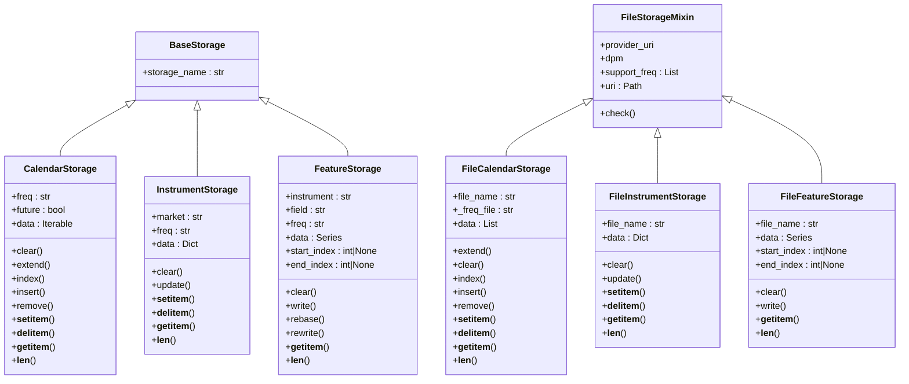
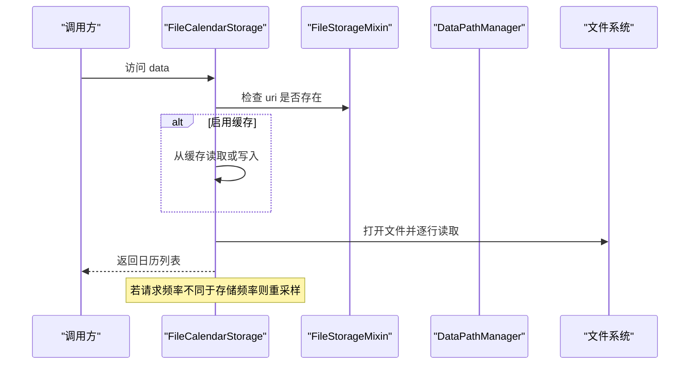
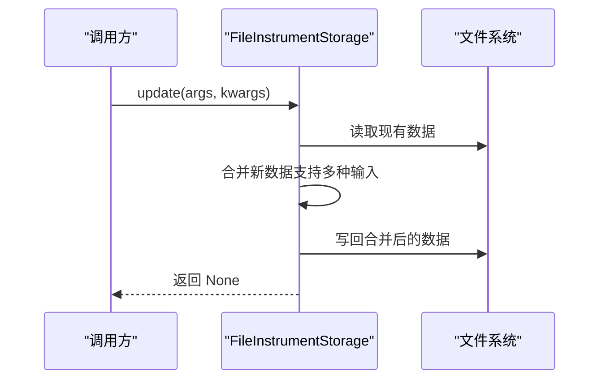
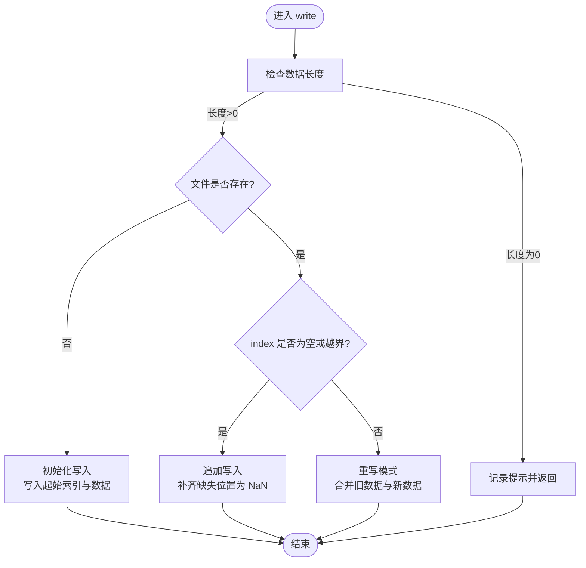
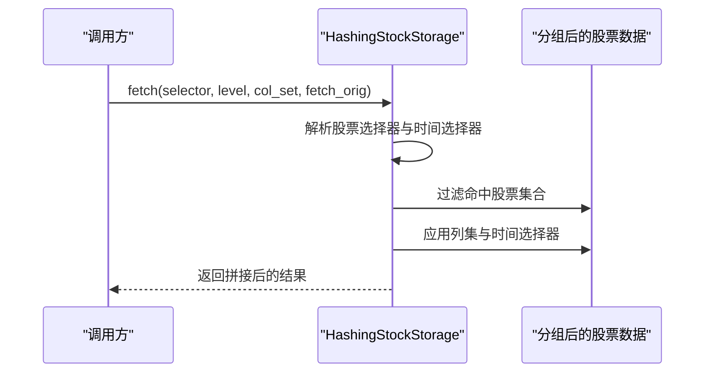
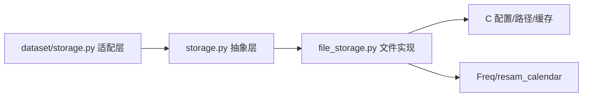

# 存储API

<cite>
**本文引用的文件**
- [qlib/data/storage/__init__.py](file://qlib/data/storage/__init__.py)
- [qlib/data/storage/storage.py](file://qlib/data/storage/storage.py)
- [qlib/data/storage/file_storage.py](file://qlib/data/storage/file_storage.py)
- [qlib/data/dataset/storage.py](file://qlib/data/dataset/storage.py)
</cite>

## 目录
1. [简介](#简介)
2. [项目结构](#项目结构)
3. [核心组件](#核心组件)
4. [架构总览](#架构总览)
5. [详细组件分析](#详细组件分析)
6. [依赖分析](#依赖分析)
7. [性能考虑](#性能考虑)
8. [故障排查指南](#故障排查指南)
9. [结论](#结论)
10. [附录](#附录)

## 简介
本文件为 Qlib 存储API的权威参考文档，聚焦于数据存储层的抽象设计与实现细节，覆盖以下主题：
- 存储后端抽象：通过基类与接口约束，统一不同存储后端的行为与能力。
- 接口统一：日历、股票池、特征三类存储的统一读写、索引、范围与生命周期管理接口。
- 扩展机制：如何基于抽象类实现自定义存储后端（如文件系统、数据库、云对象存储）。
- 文件存储接口：文件系统存储的目录结构、文件命名规则、读写策略与缓存机制。
- 日历存储API：交易日历的增删改查、未来日历、频率适配与重采样。
- 股池存储API：股票池定义、动态更新、键值对存储与多区间段表示。
- 特征存储API：二进制序列化、起止索引、增量写入、重写与重采样。
- 性能优化：批量写入、缓存、内存映射、并发访问注意事项。
- 配置与部署最佳实践：provider_uri、DataPathManager、频率支持与路径组织。

## 项目结构
Qlib 的存储API主要位于以下模块：
- 抽象与类型定义：qlib/data/storage/storage.py
- 文件系统实现：qlib/data/storage/file_storage.py
- 数据集处理器存储适配：qlib/data/dataset/storage.py
- 导出入口：qlib/data/storage/__init__.py

图表来源
- [qlib/data/storage/storage.py:78-495](file://qlib/data/storage/storage.py#L78-L495)
- [qlib/data/storage/file_storage.py:21-380](file://qlib/data/storage/file_storage.py#L21-L380)
- [qlib/data/dataset/storage.py:12-192](file://qlib/data/dataset/storage.py#L12-L192)

章节来源
- [qlib/data/storage/__init__.py:1-7](file://qlib/data/storage/__init__.py#L1-L7)
- [qlib/data/storage/storage.py:1-495](file://qlib/data/storage/storage.py#L1-L495)
- [qlib/data/storage/file_storage.py:1-380](file://qlib/data/storage/file_storage.py#L1-L380)
- [qlib/data/dataset/storage.py:1-192](file://qlib/data/dataset/storage.py#L1-L192)

## 核心组件
本节概述三大存储抽象与文件系统实现的关键职责与接口契约。

- 基础抽象
  - BaseStorage：提供存储名称推断等通用能力。
  - CalendarStorage：面向时间序列日历的增删改查、切片、长度等接口。
  - InstrumentStorage：面向股票池的键值存储（键为股票代码，值为若干时间段区间）。
  - FeatureStorage：面向特征序列的二进制存储、索引范围、写入与重写、重采样等。

- 文件系统实现
  - FileStorageMixin：提供 provider_uri、DataPathManager、URI解析、频率支持检测、缓存开关等通用文件读写能力。
  - FileCalendarStorage：按频率与未来标志生成文件名，支持读写、追加、切片与重采样。
  - FileInstrumentStorage：按市场生成文件名，支持CSV格式读写、键值更新、区间段管理。
  - FileFeatureStorage：按“仪器/字段/频率”生成二进制文件名，支持二进制写入、随机读取、索引范围查询。

章节来源
- [qlib/data/storage/storage.py:78-495](file://qlib/data/storage/storage.py#L78-L495)
- [qlib/data/storage/file_storage.py:21-380](file://qlib/data/storage/file_storage.py#L21-L380)

## 架构总览
下图展示存储抽象与文件系统实现之间的继承与组合关系，并标注关键方法与职责边界。

图表来源
- [qlib/data/storage/storage.py:78-495](file://qlib/data/storage/storage.py#L78-L495)
- [qlib/data/storage/file_storage.py:21-380](file://qlib/data/storage/file_storage.py#L21-L380)

## 详细组件分析

### 日历存储 API（CalendarStorage）
- 设计要点
  - 统一日历行为与列表方法一致，支持切片、索引、插入、删除、设置等。
  - 支持 future 标志区分未来日历与历史日历。
  - 提供 data 属性返回完整可迭代集合；__getitem__/__setitem__/__delitem__/__len__ 为标准容器接口。
- 文件实现要点
  - 文件名规则：根据频率与 future 标志生成文件名，历史为小写.txt，未来为“频率_future.txt”。
  - URI 解析：通过 DataPathManager 按频率定位到对应目录下的 calendars 子目录。
  - 频率支持：自动探测支持的频率集合；若请求频率不可直接读取，则回退到最近可用频率并进行重采样。
  - 缓存：可启用读缓存，避免重复IO；当频率不匹配时进行重采样转换。
- 典型流程（读取日历）

图表来源
- [qlib/data/storage/file_storage.py:76-190](file://qlib/data/storage/file_storage.py#L76-L190)

章节来源
- [qlib/data/storage/storage.py:84-189](file://qlib/data/storage/storage.py#L84-L189)
- [qlib/data/storage/file_storage.py:76-190](file://qlib/data/storage/file_storage.py#L76-L190)

### 股票池存储 API（InstrumentStorage）
- 设计要点
  - 键为股票代码字符串，值为若干时间段区间（起止时间）。
  - 支持整体清空、批量更新、键值读写、删除、长度查询。
- 文件实现要点
  - 文件名规则：按市场生成文件名（小写），默认为 CSV 格式，包含三列：symbol、start_datetime、end_datetime。
  - 读写策略：首次访问不存在时自动初始化空文件；写入时将字典结构转为 DataFrame 并落盘。
  - 更新策略：支持多种输入形式（Mapping、iterable、关键字参数），内部合并后统一写回。
- 典型流程（更新股票池）

图表来源
- [qlib/data/storage/file_storage.py:192-283](file://qlib/data/storage/file_storage.py#L192-L283)

章节来源
- [qlib/data/storage/storage.py:191-253](file://qlib/data/storage/storage.py#L191-L253)
- [qlib/data/storage/file_storage.py:192-283](file://qlib/data/storage/file_storage.py#L192-L283)

### 特征存储 API（FeatureStorage）
- 设计要点
  - 面向单个特征序列（instrument/field/freq 维度），提供连续索引范围与二进制存储。
  - 支持 clear、write、rebase、rewrite、切片读取、长度查询。
  - start_index/end_index 表示闭区间范围，便于增量写入与重采样。
- 文件实现要点
  - 文件名规则：采用“仪器/字段/频率.bin”的层级命名，确保隔离与可检索性。
  - 写入策略：首次写入时保存起始索引与数据；后续写入支持追加与重写两种模式。
  - 读取策略：支持整数索引与切片读取，内部通过二进制偏移快速定位。
  - 索引范围：通过文件头存储起始索引，长度由文件大小计算。
- 典型流程（写入特征序列）

图表来源
- [qlib/data/storage/file_storage.py:285-380](file://qlib/data/storage/file_storage.py#L285-L380)

章节来源
- [qlib/data/storage/storage.py:255-495](file://qlib/data/storage/storage.py#L255-L495)
- [qlib/data/storage/file_storage.py:285-380](file://qlib/data/storage/file_storage.py#L285-L380)

### 数据集处理器存储适配（Dataset Handler Storage）
- 设计要点
  - BaseHandlerStorage 定义数据处理器的数据获取接口，支持选择器、层级、列集与原始数据返回策略。
  - NaiveDFStorage：直接基于 DataFrame 实现 fetch，适合简单场景。
  - HashingStockStorage：按股票维度建立哈希表，加速单只股票的随机访问，适合高频随机取数场景。
- 典型流程（按股票选择器取数）

图表来源
- [qlib/data/dataset/storage.py:88-192](file://qlib/data/dataset/storage.py#L88-L192)

章节来源
- [qlib/data/dataset/storage.py:12-192](file://qlib/data/dataset/storage.py#L12-L192)

## 依赖分析
- 抽象层与实现层解耦：通过抽象基类约束行为，具体实现（文件系统）仅依赖抽象接口。
- 外部依赖
  - 时间与频率：依赖 Freq 与 resam_calendar 进行频率解析与日历重采样。
  - 配置与路径：依赖 C（全局配置）、DataPathManager（路径解析）、H（缓存）。
  - 数据结构：pandas/numpy 用于数据读写与数值计算。
- 耦合与内聚
  - FileStorageMixin 将路径解析、频率支持、缓存等通用逻辑集中，提升复用性。
  - 各存储子类专注于自身文件格式与读写策略，内聚良好。

图表来源
- [qlib/data/storage/storage.py:1-495](file://qlib/data/storage/storage.py#L1-L495)
- [qlib/data/storage/file_storage.py:1-380](file://qlib/data/storage/file_storage.py#L1-L380)
- [qlib/data/dataset/storage.py:1-192](file://qlib/data/dataset/storage.py#L1-L192)

章节来源
- [qlib/data/storage/file_storage.py:1-380](file://qlib/data/storage/file_storage.py#L1-L380)
- [qlib/data/dataset/storage.py:1-192](file://qlib/data/dataset/storage.py#L1-L192)

## 性能考虑
- 批量操作
  - 日历与股票池：优先使用 extend/update 等批量接口，减少多次 IO。
  - 特征序列：write 支持一次性写入多个值，避免频繁小块写入。
- 缓存机制
  - FileCalendarStorage 默认启用读缓存，显著降低重复读取成本。
  - 缓存键基于文件路径，避免跨版本污染。
- 并发访问
  - 文件系统写入建议串行化，避免竞态条件；读取可并发但需注意缓存一致性。
- 二进制存储
  - 特征序列采用二进制存储，读写效率高；注意字节序与浮点精度。
- 频率适配
  - 当请求频率无法直接读取时，回退到最近频率并重采样，避免频繁 IO。

## 故障排查指南
- “存储不存在”
  - 症状：访问 data 或执行 __getitem__/__setitem__ 抛出异常。
  - 排查：确认 provider_uri 与 DataPathManager 配置正确；检查 URI 是否存在；必要时调用 clear 初始化。
- “索引越界”
  - 症状：读取特征序列时抛出索引错误。
  - 排查：确认 start_index/end_index 范围；使用 write 时指定正确的 index；必要时先 rebase 调整范围。
- “频率不支持”
  - 症状：请求某频率失败。
  - 排查：检查 support_freq 列表；确认目标频率是否可由最近频率重采样得到。
- “读取性能低”
  - 症状：日历或特征读取慢。
  - 排查：确认是否启用读缓存；避免频繁小块写入；尽量批量读取。

章节来源
- [qlib/data/storage/file_storage.py:65-74](file://qlib/data/storage/file_storage.py#L65-L74)
- [qlib/data/storage/file_storage.py:331-354](file://qlib/data/storage/file_storage.py#L331-L354)
- [qlib/data/storage/storage.py:413-431](file://qlib/data/storage/storage.py#L413-L431)

## 结论
Qlib 的存储API通过清晰的抽象层与文件系统实现，提供了统一的日历、股票池与特征存储接口。其设计强调：
- 可扩展性：新增存储后端只需实现抽象接口。
- 易用性：统一的读写与索引接口，降低使用复杂度。
- 性能：缓存、批量操作与二进制存储相结合，满足高频数据访问需求。
在实际部署中，建议结合业务场景合理配置 provider_uri、频率支持与缓存策略，以获得最佳性能与稳定性。

## 附录

### API 一览（按类别）

- 日历存储（CalendarStorage/FileCalendarStorage）
  - 关键属性与方法：data、clear、extend、index、insert、remove、__setitem__、__delitem__、__getitem__、__len__
  - 文件命名：历史为“频率.txt”，未来为“频率_future.txt”
  - URI 规则：DataPathManager + 频率 + “calendars” 子目录
  - 频率支持：自动探测；不支持时回退并重采样

- 股票池存储（InstrumentStorage/FileInstrumentStorage）
  - 关键属性与方法：data、clear、update、__setitem__、__delitem__、__getitem__、__len__
  - 文件命名：市场名.txt（小写）
  - 文件格式：CSV，三列（symbol、start_datetime、end_datetime）

- 特征存储（FeatureStorage/FileFeatureStorage）
  - 关键属性与方法：data、start_index、end_index、clear、write、rebase、rewrite、__getitem__、__len__
  - 文件命名：仪器/字段/频率.bin
  - 写入策略：首次写入保存起始索引；追加或重写
  - 读取策略：整数索引与切片读取，二进制偏移定位

- 数据集处理器存储适配（BaseHandlerStorage/NaiveDFStorage/HashingStockStorage）
  - 关键方法：fetch（selector、level、col_set、fetch_orig）
  - 适用场景：DataFrame 原生存储与按股票哈希加速访问

章节来源
- [qlib/data/storage/storage.py:84-495](file://qlib/data/storage/storage.py#L84-L495)
- [qlib/data/storage/file_storage.py:76-380](file://qlib/data/storage/file_storage.py#L76-L380)
- [qlib/data/dataset/storage.py:12-192](file://qlib/data/dataset/storage.py#L12-L192)