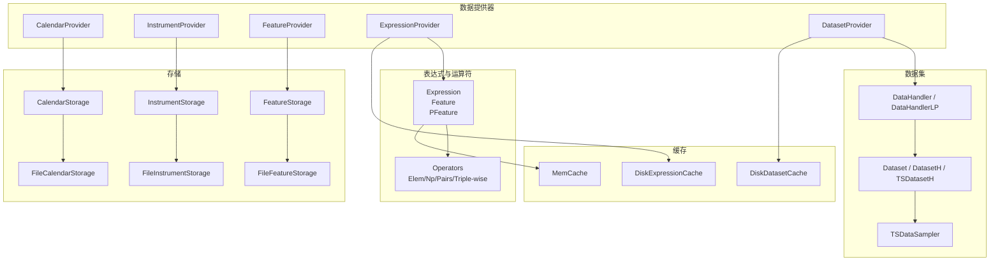
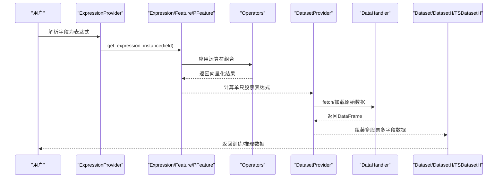
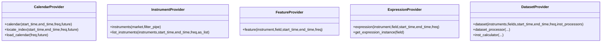
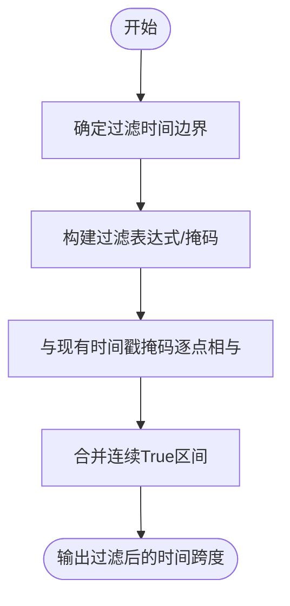
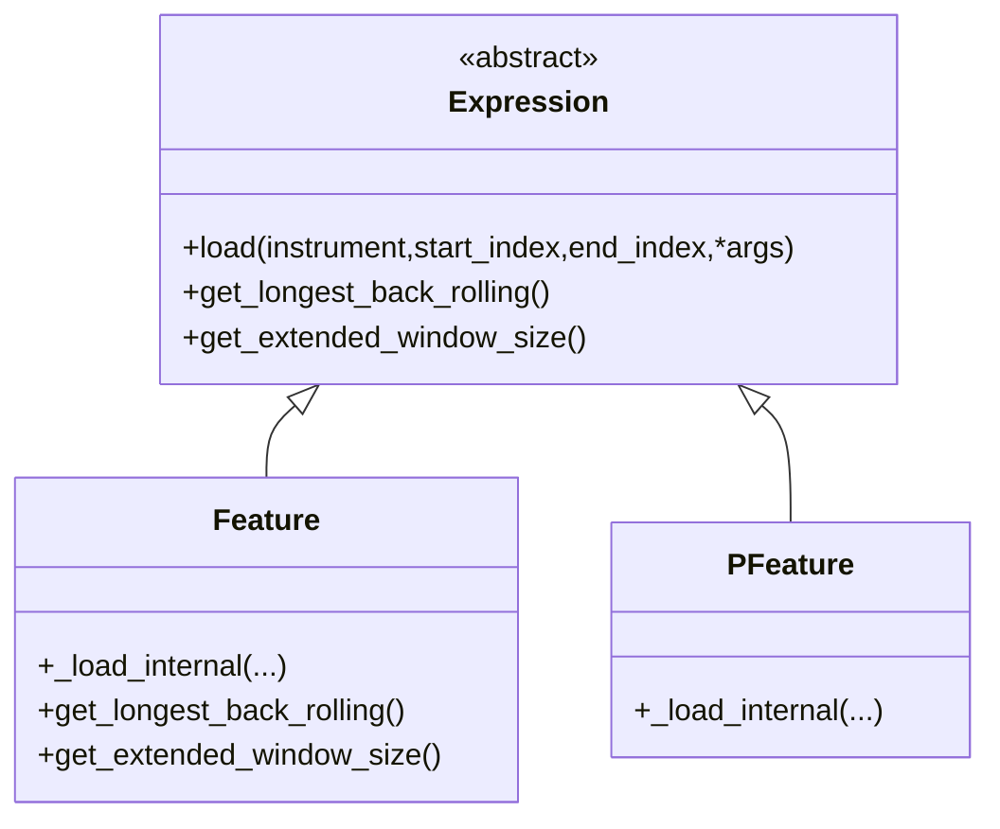
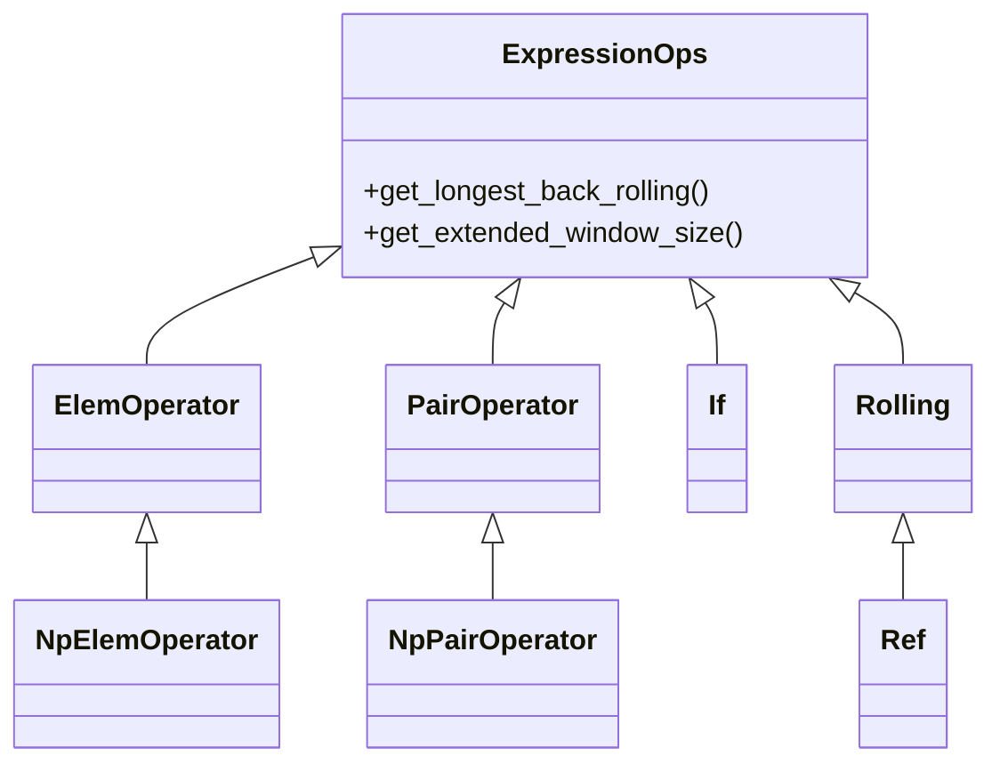
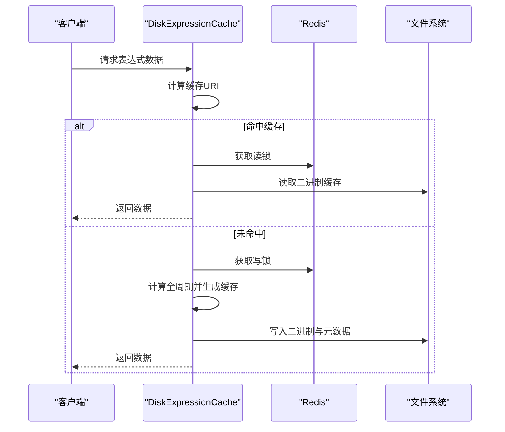
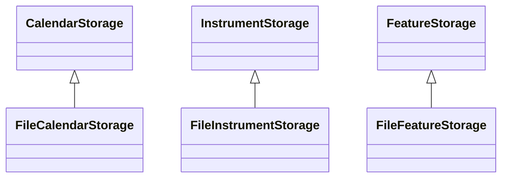
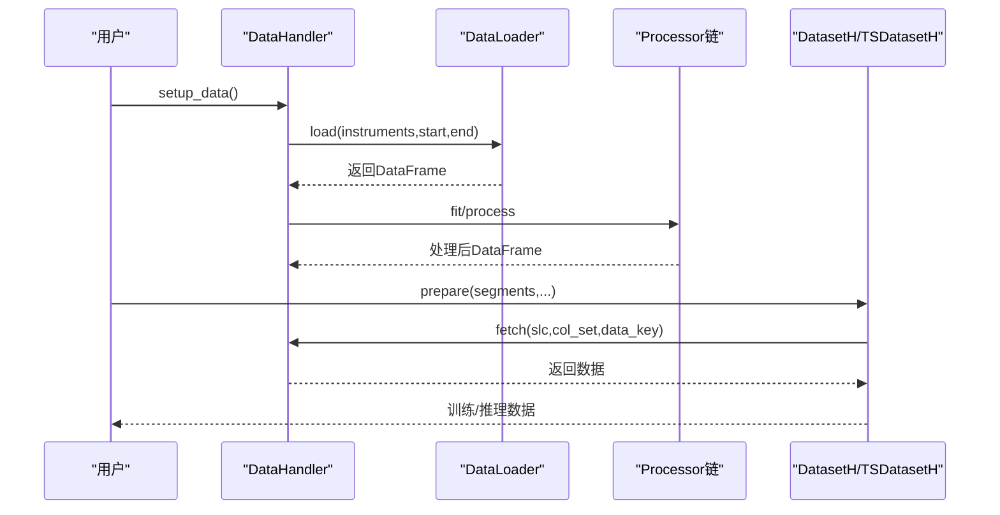
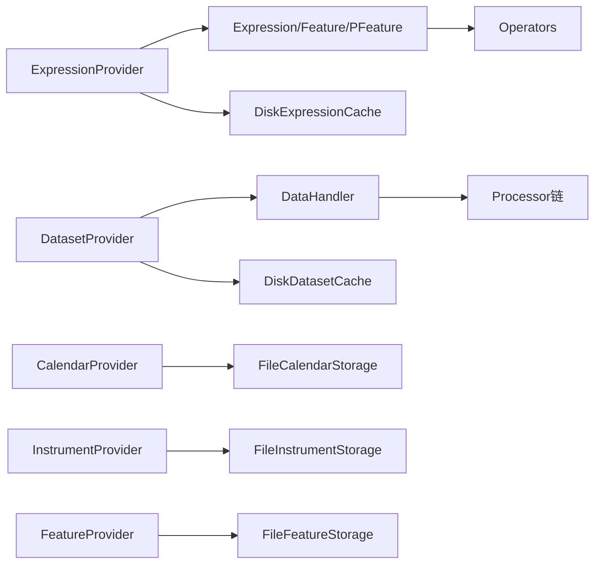

# 数据API

<cite>
**本文引用的文件**
- [qlib/data/__init__.py](file://qlib/data/__init__.py)
- [qlib/data/base.py](file://qlib/data/base.py)
- [qlib/data/data.py](file://qlib/data/data.py)
- [qlib/data/filter.py](file://qlib/data/filter.py)
- [qlib/data/ops.py](file://qlib/data/ops.py)
- [qlib/data/cache.py](file://qlib/data/cache.py)
- [qlib/data/storage/storage.py](file://qlib/data/storage/storage.py)
- [qlib/data/storage/file_storage.py](file://qlib/data/storage/file_storage.py)
- [qlib/data/dataset/__init__.py](file://qlib/data/dataset/__init__.py)
- [qlib/data/dataset/handler.py](file://qlib/data/dataset/handler.py)
</cite>

## 目录
1. [引言](#引言)
2. [项目结构](#项目结构)
3. [核心组件](#核心组件)
4. [架构总览](#架构总览)
5. [详细组件分析](#详细组件分析)
6. [依赖分析](#依赖分析)
7. [性能考虑](#性能考虑)
8. [故障排查指南](#故障排查指南)
9. [结论](#结论)
10. [附录](#附录)

## 引言
本文件面向Qlib数据API，系统性梳理并说明以下能力与接口：
- 数据提供器（Provider）：日历、股票池、特征、表达式、数据集等提供器的职责、接口与协作方式
- 过滤器（Filter）：动态过滤器的规则、时间窗、清洗与异常处理机制
- 数据类（Class）：表达式基类、特征、点时态特征等数据抽象与序列化
- 运算符（Operator）：元素级、成对级、三元条件、滚动/扩展等向量化运算
- 缓存（Cache）：内存缓存、磁盘表达式缓存、磁盘数据集缓存、缓存更新与并发控制
- 存储（Storage）：日历、股票池、特征等存储接口与文件存储实现
- 数据集（Dataset）：数据加载器、处理器、数据处理器链、时间序列采样器等

目标是帮助读者快速理解API设计、使用方式与最佳实践。

## 项目结构
Qlib数据层由“提供器-运算符-缓存-存储-数据集”五大部分组成，围绕统一的表达式引擎与数据访问接口协同工作。

图示来源
- [qlib/data/data.py](file://qlib/data/data.py)
- [qlib/data/base.py](file://qlib/data/base.py)
- [qlib/data/ops.py](file://qlib/data/ops.py)
- [qlib/data/cache.py](file://qlib/data/cache.py)
- [qlib/data/storage/storage.py](file://qlib/data/storage/storage.py)
- [qlib/data/storage/file_storage.py](file://qlib/data/storage/file_storage.py)
- [qlib/data/dataset/handler.py](file://qlib/data/dataset/handler.py)
- [qlib/data/dataset/__init__.py](file://qlib/data/dataset/__init__.py)

章节来源
- [qlib/data/__init__.py](file://qlib/data/__init__.py)
- [qlib/data/data.py](file://qlib/data/data.py)

## 核心组件
- 表达式与数据抽象
  - Expression：表达式基类，封装加载、缓存、错误处理、窗口扩展等通用逻辑
  - Feature：静态特征表达式，从Provider加载基础字段
  - PFeature：点时态（PIT）特征表达式，按相对期数查询历史快照
- 提供器接口
  - CalendarProvider：日历提供器，支持定位索引、未来交易日、缓存
  - InstrumentProvider：股票池提供器，支持动态过滤管道
  - FeatureProvider：基础特征提供器
  - ExpressionProvider：表达式提供器，解析字段为表达式实例并加载
  - DatasetProvider：数据集提供器，多进程并行计算、列名规范化、磁盘缓存
- 运算符体系
  - 元素级：Abs、Sign、Log、Mask、Not 等
  - 成对级：Add、Sub、Mul、Div、Power、比较与逻辑运算
  - 三元级：If 条件选择
  - 滚动/扩展：Rolling、Ref、EWMA 等
- 缓存体系
  - 内存缓存：日历、股票池、特征三类内存缓存，支持LRU与大小限制
  - 磁盘缓存：表达式缓存与数据集缓存，含并发锁、访问计数、增量更新
- 存储接口
  - 日历/股票池/特征存储抽象，定义数据读写、索引、切片等行为
  - 文件存储实现：文本日历、TSV股票池、二进制特征序列
- 数据集管线
  - DataHandler：统一数据抓取接口，支持列集合、选择器、过程函数钩子
  - DataHandlerLP：学习/推理双路径处理器链
  - Dataset/DatasetH/TSDatasetH：分段数据准备、时间序列采样器

章节来源
- [qlib/data/base.py](file://qlib/data/base.py)
- [qlib/data/data.py](file://qlib/data/data.py)
- [qlib/data/ops.py](file://qlib/data/ops.py)
- [qlib/data/cache.py](file://qlib/data/cache.py)
- [qlib/data/storage/storage.py](file://qlib/data/storage/storage.py)
- [qlib/data/storage/file_storage.py](file://qlib/data/storage/file_storage.py)
- [qlib/data/dataset/handler.py](file://qlib/data/dataset/handler.py)
- [qlib/data/dataset/__init__.py](file://qlib/data/dataset/__init__.py)

## 架构总览
下图展示从表达式到数据集的端到端流程：表达式通过Provider加载，结合运算符进行向量化计算；DatasetProvider负责并行组装多只股票的多字段数据，并可启用磁盘缓存；DataHandler/DataHandlerLP负责数据抓取与处理器链；Dataset系列组件完成分段与时间序列采样。

图示来源
- [qlib/data/data.py](file://qlib/data/data.py)
- [qlib/data/base.py](file://qlib/data/base.py)
- [qlib/data/ops.py](file://qlib/data/ops.py)
- [qlib/data/dataset/handler.py](file://qlib/data/dataset/handler.py)
- [qlib/data/dataset/__init__.py](file://qlib/data/dataset/__init__.py)

## 详细组件分析

### 数据提供器（Provider）
- 日历提供器（CalendarProvider）
  - 能力：按频率返回交易日列表、定位起止索引、缓存日历、支持未来交易日
  - 关键方法：calendar、locate_index、load_calendar
- 股池提供器（InstrumentProvider）
  - 能力：根据市场/指数/自定义列表生成股票池配置，应用过滤管道，返回字典或列表
  - 关键方法：instruments、list_instruments
- 特征提供器（FeatureProvider）
  - 能力：按时间窗与频率读取基础特征序列
  - 关键方法：feature
- 表达式提供器（ExpressionProvider）
  - 能力：解析字段字符串为表达式对象，调用底层Expression加载
  - 关键方法：expression、get_expression_instance
- 数据集提供器（DatasetProvider）
  - 能力：并行计算多只股票的多字段表达式，规范化列名，磁盘缓存，支持处理器链
  - 关键方法：dataset、dataset_processor、inst_calculator、parse_fields

图示来源
- [qlib/data/data.py](file://qlib/data/data.py)

章节来源
- [qlib/data/data.py](file://qlib/data/data.py)

### 过滤器（Filter）
- 动态过滤器基类（SeriesDFilter）
  - 能力：基于时间窗与规则过滤股票池，支持布尔掩码、连续区间合并、保留/剔除策略
  - 关键方法：filter_main、_getFilterSeries、_filterSeries、_toTimestamp
- 名称过滤器（NameDFilter）
  - 规则：正则匹配股票名称
- 表达式过滤器（ExpressionDFilter）
  - 规则：基于表达式在时间窗内的真值过滤

图示来源
- [qlib/data/filter.py](file://qlib/data/filter.py)

章节来源
- [qlib/data/filter.py](file://qlib/data/filter.py)

### 数据类（Class）
- 表达式基类（Expression）
  - 能力：统一加载入口load，内置缓存、异常日志、索引范围校验
  - 关键方法：load、_load_internal、get_longest_back_rolling、get_extended_window_size
- 静态特征（Feature）
  - 能力：从Provider加载基础字段
- 点时态特征（PFeature）
  - 能力：按相对期数查询PIT数据

图示来源
- [qlib/data/base.py](file://qlib/data/base.py)

章节来源
- [qlib/data/base.py](file://qlib/data/base.py)

### 运算符（Operator）
- 元素级运算：Abs、Sign、Log、Mask、Not
- 成对级运算：Add、Sub、Mul、Div、Power、比较与逻辑运算
- 三元运算：If(condition, left, right)
- 滚动/扩展：Rolling（含滚动、扩展、指数加权），Ref引用滞后/超前

图示来源
- [qlib/data/ops.py](file://qlib/data/ops.py)

章节来源
- [qlib/data/ops.py](file://qlib/data/ops.py)

### 缓存（Cache）
- 内存缓存（MemCache）
  - 分类：日历、股票池、特征三类独立缓存，支持长度限制或字节大小限制
- 磁盘表达式缓存（DiskExpressionCache）
  - 机制：按字段与频率生成缓存URI，二进制文件存储，访问计数与元数据，增量更新
  - 并发：Redis读写锁，客户端仅读时可绕过写锁
- 磁盘数据集缓存（DiskDatasetCache）
  - 机制：HDF5索引+数据，按时间窗截取，支持禁用缓存与URI生成
  - 并发：Redis读写锁，支持检查/生成缓存
- 缓存工具（CacheUtils）
  - 访问计数、锁管理、清理与重置

图示来源
- [qlib/data/cache.py](file://qlib/data/cache.py)

章节来源
- [qlib/data/cache.py](file://qlib/data/cache.py)

### 存储（Storage）
- 抽象接口
  - CalendarStorage、InstrumentStorage、FeatureStorage：定义数据读写、索引、切片、重写等
- 文件存储实现
  - FileCalendarStorage：文本日历，支持重采样与缓存
  - FileInstrumentStorage：TSV股票池，支持增删改查
  - FileFeatureStorage：二进制特征序列，支持追加/重写/范围读取

图示来源
- [qlib/data/storage/storage.py](file://qlib/data/storage/storage.py)
- [qlib/data/storage/file_storage.py](file://qlib/data/storage/file_storage.py)

章节来源
- [qlib/data/storage/storage.py](file://qlib/data/storage/storage.py)
- [qlib/data/storage/file_storage.py](file://qlib/data/storage/file_storage.py)

### 数据集（Dataset）
- DataHandler
  - 统一fetch接口，支持选择器、列集合、过程函数钩子、多级索引
- DataHandlerLP
  - 学习/推理双路径处理器链，支持共享/独立/追加三种流程
- Dataset/DatasetH/TSDatasetH
  - 分段数据准备、时间序列采样器TSDataSampler，支持步长、填充策略、过滤列

图示来源
- [qlib/data/dataset/handler.py](file://qlib/data/dataset/handler.py)
- [qlib/data/dataset/__init__.py](file://qlib/data/dataset/__init__.py)

章节来源
- [qlib/data/dataset/handler.py](file://qlib/data/dataset/handler.py)
- [qlib/data/dataset/__init__.py](file://qlib/data/dataset/__init__.py)

## 依赖分析
- Provider与Storage耦合
  - Local*Provider通过ProviderBackendMixin与File*Storage配合，默认后端为对应文件存储
- Provider与Expression/Operator
  - ExpressionProvider依赖Expression/Feature/PFeature与运算符构建表达式树
  - DatasetProvider在多进程中调用ExpressionD.expression并应用InstProcessor
- 缓存与并发
  - Disk*Cache依赖Redis锁避免竞态，访问计数用于缓存维护
- 数据集与处理器
  - DataHandlerLP的处理器链在fit与process阶段分别执行，支持只读处理器优化

图示来源
- [qlib/data/data.py](file://qlib/data/data.py)
- [qlib/data/cache.py](file://qlib/data/cache.py)
- [qlib/data/storage/file_storage.py](file://qlib/data/storage/file_storage.py)
- [qlib/data/dataset/handler.py](file://qlib/data/dataset/handler.py)

章节来源
- [qlib/data/data.py](file://qlib/data/data.py)
- [qlib/data/cache.py](file://qlib/data/cache.py)
- [qlib/data/storage/file_storage.py](file://qlib/data/storage/file_storage.py)
- [qlib/data/dataset/handler.py](file://qlib/data/dataset/handler.py)

## 性能考虑
- 向量化优先：尽量使用运算符的向量化实现，避免显式循环
- 窗口与回溯：合理设置滚动窗口与get_extended_window_size，减少重复计算
- 并行与缓存：DatasetProvider使用joblib并行与磁盘缓存，提升大规模数据集生成效率
- 内存缓存：MemCache按类别与大小限制控制内存占用，避免频繁GC
- 文件存储：二进制特征序列读写高效，建议按需重采样与索引

## 故障排查指南
- 表达式加载异常
  - 现象：索引范围非法、底层Provider抛出异常
  - 排查：确认start_index ≤ end_index；检查Provider实现与后端存储可用性
- 缓存一致性问题
  - 现象：读写冲突、缓存损坏
  - 排查：检查Redis锁状态；使用CacheUtils.reset_lock清理遗留锁；确认访问计数与元数据完整性
- 数据集空结果
  - 现象：返回空DataFrame或多进程任务失败
  - 排查：检查inst_processors是否与DiskDatasetCache兼容；确认字段规范化与列名映射
- 文件存储异常
  - 现象：二进制文件损坏、索引越界
  - 排查：确认文件存在与权限；检查start_index/end_index范围；必要时重建文件

章节来源
- [qlib/data/base.py](file://qlib/data/base.py)
- [qlib/data/cache.py](file://qlib/data/cache.py)
- [qlib/data/storage/file_storage.py](file://qlib/data/storage/file_storage.py)
- [qlib/data/dataset/handler.py](file://qlib/data/dataset/handler.py)

## 结论
Qlib数据API以表达式为核心，通过Provider抽象统一数据来源，借助运算符实现强大的向量化计算，配合内存与磁盘缓存显著提升性能，最终由数据集管线完成模型训练/推理所需的数据组织。建议在实际使用中：
- 明确表达式与窗口需求，合理设置扩展窗口
- 使用磁盘缓存加速大规模数据集生成
- 通过过滤器与处理器链实现数据清洗与特征工程
- 注意并发与缓存一致性，确保生产环境稳定运行

## 附录
- 快速索引
  - Provider接口：日历、股票池、特征、表达式、数据集
  - 过滤器：名称/表达式过滤器
  - 数据类：Expression、Feature、PFeature
  - 运算符：元素级、成对级、三元级、滚动/扩展
  - 缓存：内存、磁盘表达式、磁盘数据集
  - 存储：抽象接口与文件实现
  - 数据集：DataHandler、DataHandlerLP、Dataset系列