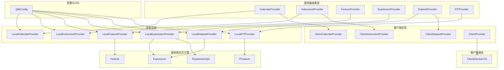
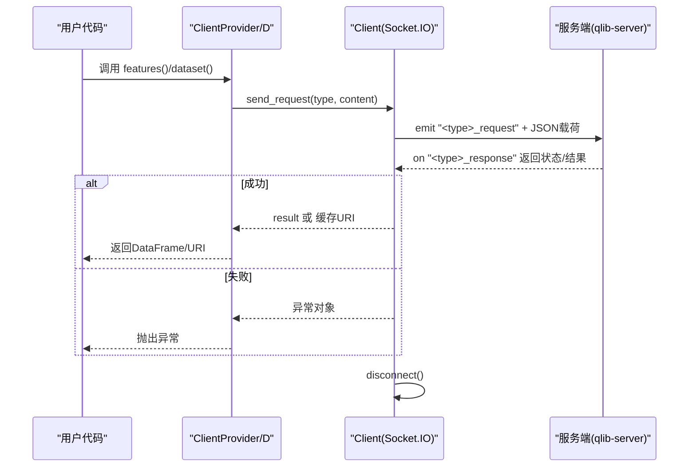
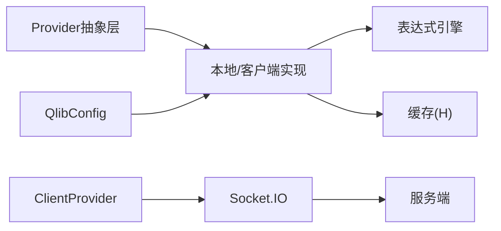

# 数据提供器API

<cite>
**本文引用的文件**
- [data.py](file://qlib/data/data.py)
- [client.py](file://qlib/data/client.py)
- [base.py](file://qlib/data/base.py)
- [config.py](file://qlib/config.py)
- [highfreq_provider.py](file://qlib/contrib/data/highfreq_provider.py)
- [check_data_health.py](file://scripts/check_data_health.py)
- [data.rst](file://docs/component/data.rst)
</cite>

## 目录
1. [简介](#简介)
2. [项目结构](#项目结构)
3. [核心组件](#核心组件)
4. [架构总览](#架构总览)
5. [详细组件分析](#详细组件分析)
6. [依赖分析](#依赖分析)
7. [性能考虑](#性能考虑)
8. [故障排查指南](#故障排查指南)
9. [结论](#结论)
10. [附录](#附录)

## 简介
本文件面向Qlib数据提供器API，系统性梳理数据提供器的核心接口与实现，重点覆盖以下方面：
- 核心接口：get_data()（通过DatasetProvider.dataset）、get_schema()（通过Provider URI与后端存储映射）等
- 初始化流程：Provider注册、Wrapper绑定、Provider实例装配、超时与连接管理
- 数据格式化：时间序列、OHLCV、因子数据的格式与对齐策略
- 数据验证与校验：缺失值、异常跳变、必需列与大小写问题等
- 客户端接口：远程数据访问、Socket.IO请求/响应、超时控制
- 使用示例：基于现有源码路径给出可定位的调用入口与参数说明

## 项目结构
围绕数据提供器API的关键模块与职责如下：
- 提供器抽象层：CalendarProvider、InstrumentProvider、FeatureProvider、ExpressionProvider、DatasetProvider、PITProvider
- 本地实现：LocalCalendarProvider、LocalInstrumentProvider、LocalFeatureProvider、LocalExpressionProvider、LocalDatasetProvider、LocalPITProvider
- 客户端实现：ClientCalendarProvider、ClientInstrumentProvider、ClientDatasetProvider、ClientProvider
- 客户端通信：Client（基于Socket.IO）
- 基础表达式引擎：Expression、Feature、PFeature、ExpressionOps
- 配置与URI解析：QlibConfig（provider_uri格式化、URI类型判断）

图表来源
- [data.py:65-196](file://qlib/data/data.py#L65-L196)
- [data.py:637-830](file://qlib/data/data.py#L637-L830)
- [data.py:961-1138](file://qlib/data/data.py#L961-L1138)
- [client.py:16-104](file://qlib/data/client.py#L16-L104)
- [base.py:13-282](file://qlib/data/base.py#L13-L282)
- [config.py:341-365](file://qlib/config.py#L341-L365)

章节来源
- [data.py:65-196](file://qlib/data/data.py#L65-L196)
- [data.py:637-830](file://qlib/data/data.py#L637-L830)
- [data.py:961-1138](file://qlib/data/data.py#L961-L1138)
- [client.py:16-104](file://qlib/data/client.py#L16-L104)
- [base.py:13-282](file://qlib/data/base.py#L13-L282)
- [config.py:341-365](file://qlib/config.py#L341-L365)

## 核心组件
- 抽象提供器接口
  - CalendarProvider：日历查询，支持future标志与索引定位
  - InstrumentProvider：股票池/标的清单查询，支持过滤管道
  - FeatureProvider：单变量特征按索引切片返回
  - ExpressionProvider：表达式计算，支持字段解析与缓存
  - DatasetProvider：多变量数据集生成，支持并行与处理器链
  - PITProvider：历史期间数据（财务期指）查询
- 本地实现
  - LocalCalendarProvider/InstrumentProvider/FeatureProvider/ExpressionProvider/LocalDatasetProvider/LocalPITProvider：直接从本地后端加载
- 客户端实现
  - ClientCalendarProvider/ClientInstrumentProvider/ClientDatasetProvider：通过Socket.IO向服务端发起请求
  - ClientProvider：统一包装，自动注入连接对象
- 基础表达式引擎
  - Expression：带缓存的加载与扩展窗口计算
  - Feature/PFeature：静态特征与财务期指特征
  - ExpressionOps：表达式运算符
- 配置与URI
  - QlibConfig：provider_uri格式化、URI类型判定（本地/NFS）

章节来源
- [data.py:65-196](file://qlib/data/data.py#L65-L196)
- [data.py:199-305](file://qlib/data/data.py#L199-L305)
- [data.py:307-444](file://qlib/data/data.py#L307-L444)
- [data.py:446-598](file://qlib/data/data.py#L446-L598)
- [data.py:338-381](file://qlib/data/data.py#L338-L381)
- [data.py:637-830](file://qlib/data/data.py#L637-L830)
- [data.py:961-1138](file://qlib/data/data.py#L961-L1138)
- [base.py:13-282](file://qlib/data/base.py#L13-L282)
- [config.py:341-365](file://qlib/config.py#L341-L365)

## 架构总览
下图展示了客户端模式下的典型数据流：客户端Provider将请求封装并通过Socket.IO发送到服务端，服务端根据请求类型返回结果或缓存URI，客户端再进行数据拼接与对齐。

图表来源
- [data.py:1224-1260](file://qlib/data/data.py#L1224-L1260)
- [client.py:49-104](file://qlib/data/client.py#L49-L104)

章节来源
- [data.py:1224-1260](file://qlib/data/data.py#L1224-L1260)
- [client.py:49-104](file://qlib/data/client.py#L49-L104)

## 详细组件分析

### 抽象接口与职责
- CalendarProvider
  - 方法：calendar()、locate_index()、load_calendar()
  - 特点：支持future标志、日历边界裁剪、内存缓存
- InstrumentProvider
  - 方法：instruments()、list_instruments()
  - 特点：支持市场字符串、过滤管道、返回列表或字典
- FeatureProvider
  - 方法：feature()
  - 特点：按索引切片返回Series
- ExpressionProvider
  - 方法：expression()、get_expression_instance()
  - 特点：表达式解析、缓存、异常处理
- DatasetProvider
  - 方法：dataset()、dataset_processor()、parse_fields()等
  - 特点：多变量并行计算、对齐到日历、处理器链
- PITProvider
  - 方法：period_feature()
  - 特点：财务期指查询、范围约束

章节来源
- [data.py:65-196](file://qlib/data/data.py#L65-L196)
- [data.py:199-305](file://qlib/data/data.py#L199-L305)
- [data.py:307-444](file://qlib/data/data.py#L307-L444)
- [data.py:446-598](file://qlib/data/data.py#L446-L598)
- [data.py:338-381](file://qlib/data/data.py#L338-L381)

### 本地实现细节
- LocalCalendarProvider
  - 后端选择：通过ProviderBackendMixin选择FileXStorage，默认FileCalendarStorage
  - 错误处理：future为True时回退到future=False
- LocalInstrumentProvider
  - 仪器缓存：内存缓存市场清单；按日历边界裁剪与过滤
- LocalFeatureProvider
  - 字段名规范化：去除前缀、代码转文件名
- LocalExpressionProvider
  - 时间索引模式：根据extended window size决定查询范围
  - 类型一致性：Series转float32
- LocalDatasetProvider
  - 对齐策略：固定频率时对齐到日历边界
  - 并行缓存预热：multi_cache_walker

章节来源
- [data.py:637-830](file://qlib/data/data.py#L637-L830)
- [data.py:882-960](file://qlib/data/data.py#L882-L960)

### 客户端实现细节
- ClientCalendarProvider
  - 请求内容：start_time、end_time、freq、future
  - 响应处理：将字符串时间转为Timestamp列表
- ClientInstrumentProvider
  - 请求内容：instruments、start_time、end_time、freq、as_list
  - 响应处理：字典/列表转换
- ClientDatasetProvider
  - 双缓存策略：
    - disk_cache=0：先生成表达式缓存，再从缓存拼接DataFrame
    - disk_cache!=0：直接获取NFS缓存URI，读取缓存文件
  - 超时控制：queue.get(timeout=C["timeout"])

章节来源
- [data.py:961-1138](file://qlib/data/data.py#L961-L1138)

### 客户端通信与初始化
- Client
  - 连接：connect_server()，基于ws://host:port
  - 断开：disconnect()
  - 发送：send_request()，封装head/body，监听"<type>_response"
  - 错误：状态非0抛出异常；回调中异常记录日志
- ClientProvider
  - 注入：在构造时为Cal、Inst、DatasetD设置conn
  - 统一入口：D.features()路由到DatasetD.dataset()

章节来源
- [client.py:16-104](file://qlib/data/client.py#L16-L104)
- [data.py:1224-1260](file://qlib/data/data.py#L1224-L1260)

### 表达式与数据格式化
- Expression
  - 缓存键：(expression, instrument, start_index, end_index, *args)
  - 扩展窗口：get_extended_window_size()用于确定查询范围
- Feature/PFeature
  - Feature：从FeatureD加载静态特征
  - PFeature：从PITD加载财务期指
- DatasetProcessor
  - 列名标准化：normalize_cache_fields
  - 并行：ParallelExt + joblib
  - 对齐：若索引为整数则映射到日历

章节来源
- [base.py:13-282](file://qlib/data/base.py#L13-L282)
- [data.py:548-635](file://qlib/data/data.py#L548-L635)

### Provider注册与初始化
- register_all_wrappers()
  - 动态装配：calendar/instrument/feature/expression/pit/dataset/provider
  - 支持缓存包装：calendar_cache、dataset_cache、expression_cache
- ProviderBackendMixin
  - 默认后端类名与模块推断
  - backend_obj()按配置实例化后端

章节来源
- [data.py:1292-1333](file://qlib/data/data.py#L1292-L1333)
- [data.py:43-63](file://qlib/data/data.py#L43-L63)

### 配置参数与URI解析
- QlibConfig.format_provider_uri()
  - 将provider_uri标准化为{freq: uri}映射
  - 本地URI展开为绝对路径
- QlibConfig.get_uri_type()
  - 识别本地(NFS/Windows)与本地URI类型

章节来源
- [config.py:341-365](file://qlib/config.py#L341-L365)

### 数据健康检查与校验
- DataHealthChecker
  - 缺失数据、OHLCV大步长、必需列缺失、因子缺失、特征目录大小写
- 文档说明
  - OHLCV与factor字段约定、暂停交易时的NaN填充

章节来源
- [check_data_health.py:13-248](file://scripts/check_data_health.py#L13-L248)
- [data.rst:184-218](file://docs/component/data.rst#L184-L218)

## 依赖分析
- Provider抽象与实现解耦：通过Wrapper注册与动态装配实现
- 客户端与服务端通过Socket.IO协议通信，请求类型与响应类型一一对应
- 表达式引擎与缓存共享，避免重复计算
- 日历对齐确保不同频率数据的一致性

图表来源
- [data.py:1140-1260](file://qlib/data/data.py#L1140-L1260)
- [client.py:16-104](file://qlib/data/client.py#L16-L104)
- [base.py:13-282](file://qlib/data/base.py#L13-L282)
- [config.py:341-365](file://qlib/config.py#L341-L365)

章节来源
- [data.py:1140-1260](file://qlib/data/data.py#L1140-L1260)
- [client.py:16-104](file://qlib/data/client.py#L16-L104)
- [base.py:13-282](file://qlib/data/base.py#L13-L282)
- [config.py:341-365](file://qlib/config.py#L341-L365)

## 性能考虑
- 并行计算：DatasetProvider.dataset_processor使用joblib并行，核数由C.kernels限制
- 缓存策略：Expression缓存、Dataset缓存、日历预热
- 查询范围优化：Expression.get_extended_window_size决定最小查询区间
- 对齐成本：固定频率对齐到日历边界，减少跨频率不一致带来的重复计算

## 故障排查指南
- 连接失败
  - 检查服务端地址与端口配置，确认网络连通
  - 查看Client.connect_server()错误日志
- 超时异常
  - 调整C["timeout"]或优化服务端处理逻辑
- 缺少必需列或因子缺失
  - 使用DataHealthChecker脚本检查OHLCV必需列、因子列、缺失数据与大步长
- 目录大小写问题
  - 确保features子目录名称小写，避免Linux大小写敏感导致的加载失败
- 客户端请求失败
  - 关注Client回调中的status与detailed_info，必要时开启更详细日志

章节来源
- [client.py:35-48](file://qlib/data/client.py#L35-L48)
- [client.py:74-81](file://qlib/data/client.py#L74-L81)
- [check_data_health.py:13-248](file://scripts/check_data_health.py#L13-L248)

## 结论
Qlib数据提供器API以抽象接口+本地/客户端实现的分层设计，结合表达式引擎与缓存机制，提供了高效、可扩展的数据访问能力。客户端模式通过Socket.IO实现远程数据请求，支持灵活的缓存策略与严格的超时控制。配合数据健康检查工具，可有效保障数据质量与稳定性。

## 附录

### API参考速览（基于源码路径）
- 获取数据集
  - 入口：[DatasetProvider.dataset:446-477](file://qlib/data/data.py#L446-L477)
  - 本地实现：[LocalDatasetProvider.dataset:902-928](file://qlib/data/data.py#L902-L928)
  - 客户端实现：[ClientDatasetProvider.dataset:1040-1138](file://qlib/data/data.py#L1040-L1138)
  - 并行与处理器：[DatasetProvider.dataset_processor:548-598](file://qlib/data/data.py#L548-L598)
- 获取日历
  - 入口：[CalendarProvider.calendar:71-110](file://qlib/data/data.py#L71-L110)
  - 客户端实现：[ClientCalendarProvider.calendar:974-983](file://qlib/data/data.py#L974-L983)
- 获取标的清单
  - 入口：[InstrumentProvider.list_instruments:266-286](file://qlib/data/data.py#L266-L286)
  - 客户端实现：[ClientInstrumentProvider.list_instruments:998-1024](file://qlib/data/data.py#L998-L1024)
- 获取单变量特征
  - 入口：[FeatureProvider.feature:313-335](file://qlib/data/data.py#L313-L335)
  - 本地实现：[LocalFeatureProvider.feature:737-742](file://qlib/data/data.py#L737-L742)
- 表达式计算
  - 入口：[ExpressionProvider.expression:409-444](file://qlib/data/data.py#L409-L444)
  - 本地实现：[LocalExpressionProvider.expression:843-880](file://qlib/data/data.py#L843-L880)
- Provider注册与初始化
  - 注册：[register_all_wrappers:1292-1333](file://qlib/data/data.py#L1292-L1333)
  - ProviderBackendMixin：[ProviderBackendMixin.backend_obj:58-63](file://qlib/data/data.py#L58-L63)
- 客户端通信
  - 发送请求：[Client.send_request:49-104](file://qlib/data/client.py#L49-L104)
  - 连接/断开：[Client.connect_server:35-48](file://qlib/data/client.py#L35-L48)
- 配置与URI
  - URI格式化：[QlibConfig.format_provider_uri:341-353](file://qlib/config.py#L341-L353)
  - URI类型：[QlibConfig.get_uri_type:355-365](file://qlib/config.py#L355-L365)
- 数据健康检查
  - 健康检查器：[DataHealthChecker:13-248](file://scripts/check_data_health.py#L13-L248)
  - 文档说明：[docs/component/data.rst:184-218](file://docs/component/data.rst#L184-L218)