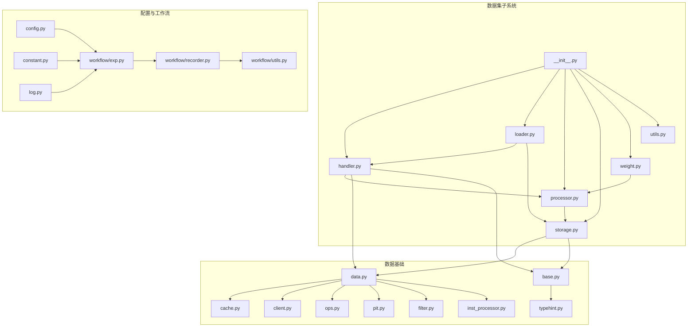
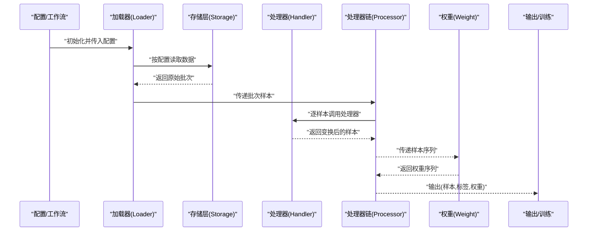
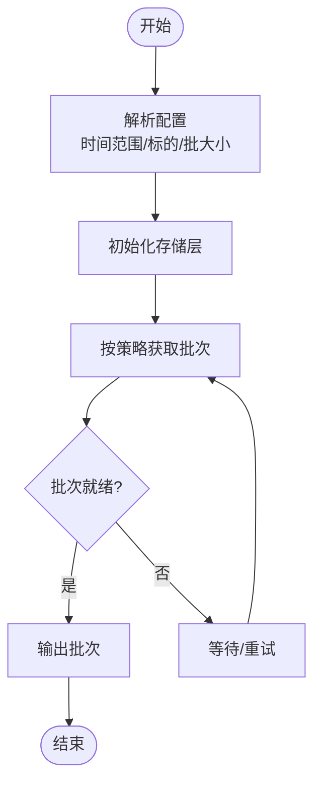
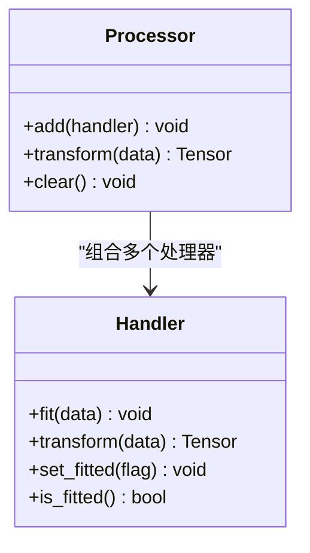
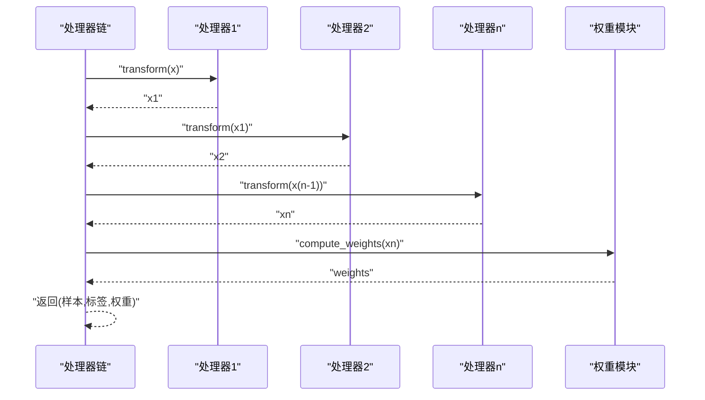
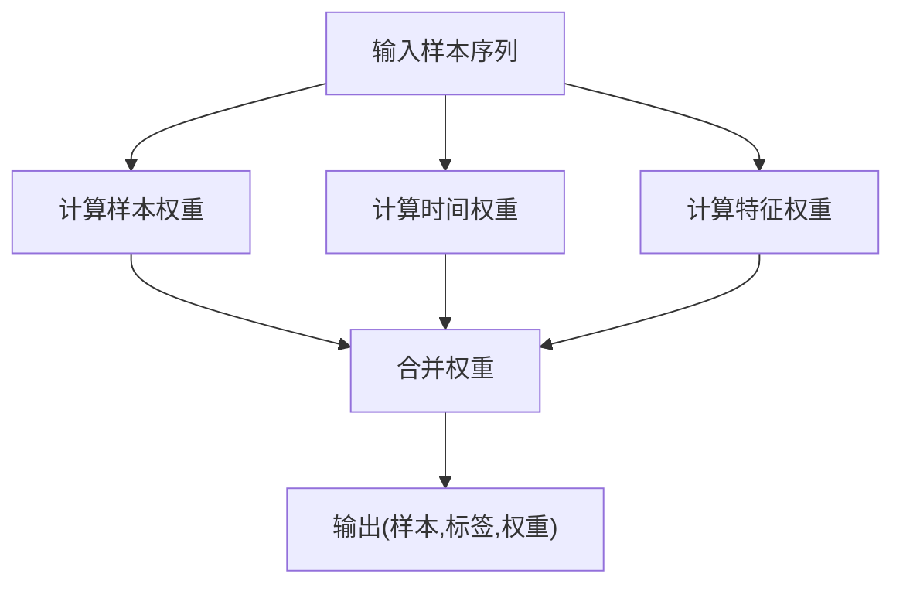
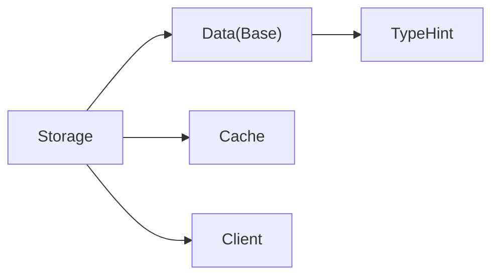
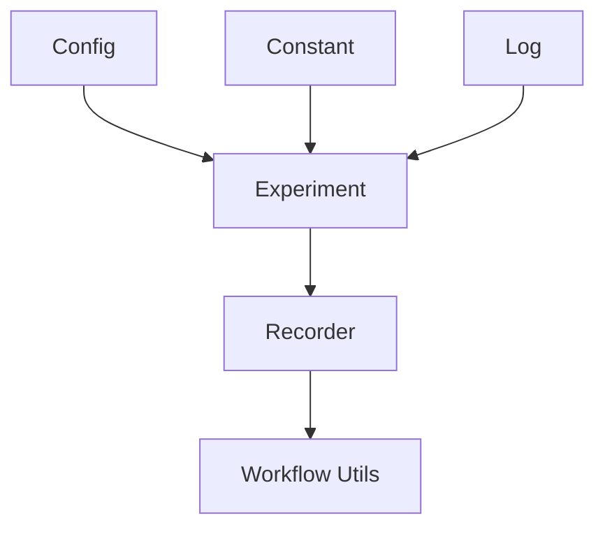
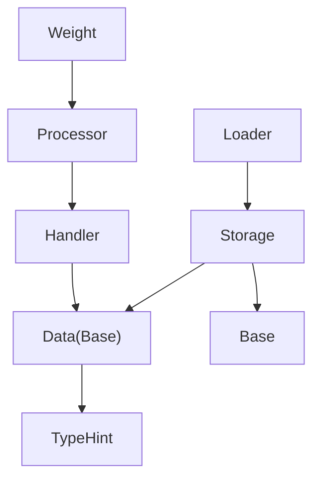

# 数据集API

<cite>
**本文引用的文件**
- [__init__.py](file://qlib/data/dataset/__init__.py)
- [handler.py](file://qlib/data/dataset/handler.py)
- [loader.py](file://qlib/data/dataset/loader.py)
- [processor.py](file://qlib/data/dataset/processor.py)
- [storage.py](file://qlib/data/dataset/storage.py)
- [utils.py](file://qlib/data/dataset/utils.py)
- [weight.py](file://qlib/data/dataset/weight.py)
- [data.py](file://qlib/data/data.py)
- [base.py](file://qlib/data/base.py)
- [cache.py](file://qlib/data/cache.py)
- [client.py](file://qlib/data/client.py)
- [ops.py](file://qlib/data/ops.py)
- [pit.py](file://qlib/data/pit.py)
- [filter.py](file://qlib/data/filter.py)
- [inst_processor.py](file://qlib/data/inst_processor.py)
- [typehint.py](file://qlib/typehint.py)
- [config.py](file://qlib/config.py)
- [constant.py](file://qlib/constant.py)
- [log.py](file://qlib/log.py)
- [workflow/exp.py](file://qlib/workflow/exp.py)
- [workflow/recorder.py](file://qlib/workflow/recorder.py)
- [workflow/utils.py](file://qlib/workflow/utils.py)
- [tests/data_mid_layer_tests/test_dataloader.py](file://tests/data_mid_layer_tests/test_dataloader.py)
- [tests/data_mid_layer_tests/test_dataset.py](file://tests/data_mid_layer_tests/test_dataset.py)
- [tests/data_mid_layer_tests/test_handler.py](file://tests/data_mid_layer_tests/test_handler.py)
- [tests/data_mid_layer_tests/test_processor.py](file://tests/data_mid_layer_tests/test_processor.py)
- [examples/benchmarks/LightGBM/workflow_config_lightgbm_configurable_dataset.yaml](file://examples/benchmarks/LightGBM/workflow_config_lightgbm_configurable_dataset.yaml)
- [examples/data_demo/data_cache_demo.py](file://examples/data_demo/data_cache_demo.py)
- [examples/data_demo/data_mem_resuse_demo.py](file://examples/data_demo/data_mem_resuse_demo.py)
</cite>

## 目录
1. [引言](#引言)
2. [项目结构](#项目结构)
3. [核心组件](#核心组件)
4. [架构总览](#架构总览)
5. [详细组件分析](#详细组件分析)
6. [依赖关系分析](#依赖关系分析)
7. [性能考虑](#性能考虑)
8. [故障排查指南](#故障排查指南)
9. [结论](#结论)
10. [附录](#附录)

## 引言
本文件为 Qlib 数据集 API 的详细参考文档，聚焦于数据集的整体架构与设计理念，涵盖数据集抽象、组件分离与接口统一；系统性记录数据加载器 API（数据加载策略、批量加载、数据流控制）、数据处理器接口（数据变换、特征工程、数据标准化）、数据处理器链 API（组合、流水线设计、错误处理）；同时介绍数据集权重 API（样本权重、时间权重、特征权重），以及配置与管理、性能优化（并行处理、内存管理、I/O 优化）与开发使用示例。

## 项目结构
Qlib 的数据集子系统位于 qlib/data/dataset 目录下，包含以下核心模块：
- handler.py：数据处理器抽象与实现
- loader.py：数据加载器抽象与实现
- processor.py：数据处理器链与流水线
- storage.py：存储层抽象与实现
- utils.py：工具函数
- weight.py：权重计算与应用
- __init__.py：导出入口

此外，与数据集密切相关的模块包括：
- qlib/data/data.py、qlib/data/base.py：数据基础类型与接口
- qlib/data/cache.py、qlib/data/client.py：缓存与客户端
- qlib/data/ops.py、qlib/data/pit.py、qlib/data/filter.py、qlib/data/inst_processor.py：数据操作与预处理
- qlib/typehint.py：类型提示
- qlib/config.py、qlib/constant.py、qlib/log.py：配置、常量与日志
- qlib/workflow/exp.py、qlib/workflow/recorder.py、qlib/workflow/utils.py：工作流集成
- tests/data_mid_layer_tests/*：单元测试覆盖
- examples/benchmarks/LightGBM/workflow_config_lightgbm_configurable_dataset.yaml：可配置数据集示例配置
- examples/data_demo/data_cache_demo.py、examples/data_demo/data_mem_resuse_demo.py：缓存与内存复用示例

**图表来源**
- [handler.py](file://qlib/data/dataset/handler.py)
- [loader.py](file://qlib/data/dataset/loader.py)
- [processor.py](file://qlib/data/dataset/processor.py)
- [storage.py](file://qlib/data/dataset/storage.py)
- [weight.py](file://qlib/data/dataset/weight.py)
- [__init__.py](file://qlib/data/dataset/__init__.py)
- [data.py](file://qlib/data/data.py)
- [base.py](file://qlib/data/base.py)
- [cache.py](file://qlib/data/cache.py)
- [client.py](file://qlib/data/client.py)
- [ops.py](file://qlib/data/ops.py)
- [pit.py](file://qlib/data/pit.py)
- [filter.py](file://qlib/data/filter.py)
- [inst_processor.py](file://qlib/data/inst_processor.py)
- [typehint.py](file://qlib/typehint.py)
- [config.py](file://qlib/config.py)
- [constant.py](file://qlib/constant.py)
- [log.py](file://qlib/log.py)
- [workflow/exp.py](file://qlib/workflow/exp.py)
- [workflow/recorder.py](file://qlib/workflow/recorder.py)
- [workflow/utils.py](file://qlib/workflow/utils.py)

**章节来源**
- [__init__.py](file://qlib/data/dataset/__init__.py)
- [handler.py](file://qlib/data/dataset/handler.py)
- [loader.py](file://qlib/data/dataset/loader.py)
- [processor.py](file://qlib/data/dataset/processor.py)
- [storage.py](file://qlib/data/dataset/storage.py)
- [utils.py](file://qlib/data/dataset/utils.py)
- [weight.py](file://qlib/data/dataset/weight.py)

## 核心组件
本节从整体上概述数据集子系统的职责与交互关系：
- 数据加载器（Loader）负责按配置从存储层读取原始数据，并进行必要的切片与批处理输出。
- 数据处理器（Handler）对单条或多条样本进行变换、特征工程与标准化，形成模型输入张量。
- 处理器链（Processor）将多个处理器按序组合，构成可复用的数据预处理流水线。
- 存储层（Storage）抽象底层数据源（如文件系统、数据库、远程服务），屏蔽访问细节。
- 权重模块（Weight）提供样本权重、时间权重与特征权重的计算与应用接口。
- 工具模块（Utils）提供通用辅助能力，如索引映射、分组统计等。
- 配置与工作流（Config/Workflow）将数据集与训练流程集成，支持运行时参数调整与记录。

**章节来源**
- [handler.py](file://qlib/data/dataset/handler.py)
- [loader.py](file://qlib/data/dataset/loader.py)
- [processor.py](file://qlib/data/dataset/processor.py)
- [storage.py](file://qlib/data/dataset/storage.py)
- [weight.py](file://qlib/data/dataset/weight.py)
- [utils.py](file://qlib/data/dataset/utils.py)
- [config.py](file://qlib/config.py)
- [workflow/exp.py](file://qlib/workflow/exp.py)

## 架构总览
数据集子系统采用“加载-处理-存储-权重”的分层架构，通过统一接口实现组件解耦与可扩展性。下图展示了典型的数据流：外部配置驱动加载器从存储层获取数据，处理器链对样本进行变换，权重模块根据样本或时间维度分配权重，最终输出到训练/推理流程。

**图表来源**
- [loader.py](file://qlib/data/dataset/loader.py)
- [storage.py](file://qlib/data/dataset/storage.py)
- [handler.py](file://qlib/data/dataset/handler.py)
- [processor.py](file://qlib/data/dataset/processor.py)
- [weight.py](file://qlib/data/dataset/weight.py)

## 详细组件分析

### 数据加载器 API（Loader）
- 职责：根据配置从存储层读取数据，支持时间范围、标的过滤、批量大小等参数；输出批次化的样本序列。
- 关键点：
  - 加载策略：支持顺序遍历、随机采样、滑动窗口等多种策略。
  - 批量加载：通过批大小与迭代器模式实现高效内存占用控制。
  - 数据流控制：结合缓存与客户端，实现延迟加载与并发拉取。
- 典型用法场景：在训练前准备数据批次，或在回测中按时间窗口增量加载。

**图表来源**
- [loader.py](file://qlib/data/dataset/loader.py)
- [storage.py](file://qlib/data/dataset/storage.py)
- [cache.py](file://qlib/data/cache.py)
- [client.py](file://qlib/data/client.py)

**章节来源**
- [loader.py](file://qlib/data/dataset/loader.py)
- [storage.py](file://qlib/data/dataset/storage.py)
- [cache.py](file://qlib/data/cache.py)
- [client.py](file://qlib/data/client.py)

### 数据处理器接口（Handler）
- 职责：对单条或多条样本执行变换、特征工程与标准化，确保数据格式与模型输入一致。
- 关键点：
  - 变换接口：提供 fit/transform 等方法，支持无监督与有监督两种模式。
  - 特征工程：支持缺失值填充、异常值处理、衍生因子生成等。
  - 标准化：支持 z-score、MinMax、分位数归一化等策略。
- 与处理器链协作：作为处理器链中的原子节点被组合使用。

**图表来源**
- [handler.py](file://qlib/data/dataset/handler.py)
- [processor.py](file://qlib/data/dataset/processor.py)

**章节来源**
- [handler.py](file://qlib/data/dataset/handler.py)
- [processor.py](file://qlib/data/dataset/processor.py)

### 数据处理器链 API（Processor）
- 职责：将多个处理器按序组合，形成可复用的数据预处理流水线；支持动态添加、清空与重置。
- 关键点：
  - 组合策略：支持串联式流水线，前一个处理器的输出作为下一个处理器的输入。
  - 错误处理：在链路中捕获异常并提供上下文信息，便于定位问题。
  - 运行时调整：支持在训练/推理过程中动态更新处理器参数。
- 与权重模块协作：在流水线末尾接入权重计算，统一输出样本、标签与权重。

**图表来源**
- [processor.py](file://qlib/data/dataset/processor.py)
- [weight.py](file://qlib/data/dataset/weight.py)

**章节来源**
- [processor.py](file://qlib/data/dataset/processor.py)
- [weight.py](file://qlib/data/dataset/weight.py)

### 数据集权重 API（Weight）
- 职责：为样本、时间步与特征维度提供权重，用于加权损失、采样或评估。
- 类型与用途：
  - 样本权重：按样本重要性或质量赋权。
  - 时间权重：按时间衰减或事件权重调整。
  - 特征权重：按特征贡献度或稳定性赋权。
- 接口要点：支持从配置或数据中动态计算权重，并与处理器链无缝对接。

**图表来源**
- [weight.py](file://qlib/data/dataset/weight.py)
- [processor.py](file://qlib/data/dataset/processor.py)

**章节来源**
- [weight.py](file://qlib/data/dataset/weight.py)
- [processor.py](file://qlib/data/dataset/processor.py)

### 存储层与数据基础（Storage/Data/Base）
- 存储层（Storage）：抽象底层数据源，提供统一的读写接口，支持本地文件、远程服务等。
- 数据基础（Data/Base）：定义数据类型、张量结构与基本操作，为加载器与处理器提供类型约束与行为规范。
- 缓存与客户端（Cache/Client）：提升 I/O 性能与并发吞吐，减少重复加载。

**图表来源**
- [storage.py](file://qlib/data/dataset/storage.py)
- [data.py](file://qlib/data/data.py)
- [base.py](file://qlib/data/base.py)
- [cache.py](file://qlib/data/cache.py)
- [client.py](file://qlib/data/client.py)
- [typehint.py](file://qlib/typehint.py)

**章节来源**
- [storage.py](file://qlib/data/dataset/storage.py)
- [data.py](file://qlib/data/data.py)
- [base.py](file://qlib/data/base.py)
- [cache.py](file://qlib/data/cache.py)
- [client.py](file://qlib/data/client.py)
- [typehint.py](file://qlib/typehint.py)

### 配置与管理（Config/Workflow）
- 配置（Config/Constant/Log）：集中管理数据集参数、常量与日志级别，支持运行时调整。
- 工作流（Workflow）：将数据集与训练/回测流程集成，提供实验记录与结果追踪。

**图表来源**
- [config.py](file://qlib/config.py)
- [constant.py](file://qlib/constant.py)
- [log.py](file://qlib/log.py)
- [workflow/exp.py](file://qlib/workflow/exp.py)
- [workflow/recorder.py](file://qlib/workflow/recorder.py)
- [workflow/utils.py](file://qlib/workflow/utils.py)

**章节来源**
- [config.py](file://qlib/config.py)
- [constant.py](file://qlib/constant.py)
- [log.py](file://qlib/log.py)
- [workflow/exp.py](file://qlib/workflow/exp.py)
- [workflow/recorder.py](file://qlib/workflow/recorder.py)
- [workflow/utils.py](file://qlib/workflow/utils.py)

## 依赖关系分析
- 组件内聚与耦合：
  - Loader 与 Storage 解耦，通过统一接口交互，便于替换底层存储。
  - Handler 与 Processor 通过 transform 接口耦合，保持单一职责。
  - Weight 与 Processor 协作，形成后处理阶段的扩展点。
- 外部依赖：
  - 数据基础模块提供类型与接口约束，保证跨模块一致性。
  - 缓存与客户端模块提升 I/O 性能，降低系统负载。
- 潜在循环依赖：
  - 当前模块间未见直接循环导入；若自定义处理器扩展，需避免在 __init__.py 中引入循环依赖。

**图表来源**
- [loader.py](file://qlib/data/dataset/loader.py)
- [storage.py](file://qlib/data/dataset/storage.py)
- [handler.py](file://qlib/data/dataset/handler.py)
- [processor.py](file://qlib/data/dataset/processor.py)
- [weight.py](file://qlib/data/dataset/weight.py)
- [data.py](file://qlib/data/data.py)
- [base.py](file://qlib/data/base.py)
- [typehint.py](file://qlib/typehint.py)

**章节来源**
- [loader.py](file://qlib/data/dataset/loader.py)
- [storage.py](file://qlib/data/dataset/storage.py)
- [handler.py](file://qlib/data/dataset/handler.py)
- [processor.py](file://qlib/data/dataset/processor.py)
- [weight.py](file://qlib/data/dataset/weight.py)
- [data.py](file://qlib/data/data.py)
- [base.py](file://qlib/data/base.py)
- [typehint.py](file://qlib/typehint.py)

## 性能考虑
- 并行处理：
  - 利用多进程/多线程并行加载与处理，结合队列与锁控制资源竞争。
  - 在处理器链中合理拆分 CPU 密集与 I/O 密集步骤，避免阻塞。
- 内存管理：
  - 使用批处理与惰性加载，避免一次性加载全部数据。
  - 启用缓存与内存池，减少频繁分配与拷贝。
- I/O 优化：
  - 优先使用顺序读取与预读策略，减少随机访问。
  - 对热点数据建立索引与分区，加速查询与过滤。
- 实践建议：
  - 在高维特征场景下，优先使用稀疏表示与分块计算。
  - 结合数据压缩与编码策略，降低存储与传输开销。

[本节为通用性能指导，不直接分析具体文件]

## 故障排查指南
- 常见问题与定位：
  - 数据加载失败：检查存储路径、权限与网络连通性；确认时间范围与标的过滤条件。
  - 处理器报错：查看处理器链中具体节点的输入形状与类型，核对 fit/transform 顺序。
  - 权重异常：验证权重计算逻辑与边界条件，确保非负与归一化处理。
- 日志与调试：
  - 使用日志模块记录关键步骤与异常堆栈，便于快速定位。
  - 在工作流中启用记录器，保存配置与中间结果，支持回放与对比。
- 单元测试参考：
  - 通过数据层测试用例验证加载器、处理器与数据集的行为一致性。

**章节来源**
- [log.py](file://qlib/log.py)
- [workflow/recorder.py](file://qlib/workflow/recorder.py)
- [tests/data_mid_layer_tests/test_dataloader.py](file://tests/data_mid_layer_tests/test_dataloader.py)
- [tests/data_mid_layer_tests/test_processor.py](file://tests/data_mid_layer_tests/test_processor.py)
- [tests/data_mid_layer_tests/test_dataset.py](file://tests/data_mid_layer_tests/test_dataset.py)
- [tests/data_mid_layer_tests/test_handler.py](file://tests/data_mid_layer_tests/test_handler.py)

## 结论
Qlib 数据集 API 以清晰的分层架构与统一接口实现了数据加载、处理、存储与权重的解耦与扩展。通过处理器链与可配置的数据集，用户可以灵活构建从原始数据到模型输入的完整流水线；配合缓存、并行与 I/O 优化，可在大规模数据场景下获得稳定且高效的性能表现。

## 附录

### 开发与使用示例
- 可配置数据集示例：
  - 参考配置文件，了解如何在工作流中声明与调整数据集参数。
  - 示例路径：[workflow_config_lightgbm_configurable_dataset.yaml](file://examples/benchmarks/LightGBM/workflow_config_lightgbm_configurable_dataset.yaml)
- 缓存与内存复用示例：
  - 展示如何通过缓存与内存池减少重复加载与分配，提升吞吐。
  - 示例路径：[data_cache_demo.py](file://examples/data_demo/data_cache_demo.py)、[data_mem_resuse_demo.py](file://examples/data_demo/data_mem_resuse_demo.py)
- 单元测试参考：
  - 加载器测试：[test_dataloader.py](file://tests/data_mid_layer_tests/test_dataloader.py)
  - 处理器测试：[test_processor.py](file://tests/data_mid_layer_tests/test_processor.py)
  - 数据集测试：[test_dataset.py](file://tests/data_mid_layer_tests/test_dataset.py)
  - 处理器与存储联调测试：[test_handler.py](file://tests/data_mid_layer_tests/test_handler.py)

**章节来源**
- [examples/benchmarks/LightGBM/workflow_config_lightgbm_configurable_dataset.yaml](file://examples/benchmarks/LightGBM/workflow_config_lightgbm_configurable_dataset.yaml)
- [examples/data_demo/data_cache_demo.py](file://examples/data_demo/data_cache_demo.py)
- [examples/data_demo/data_mem_resuse_demo.py](file://examples/data_demo/data_mem_resuse_demo.py)
- [tests/data_mid_layer_tests/test_dataloader.py](file://tests/data_mid_layer_tests/test_dataloader.py)
- [tests/data_mid_layer_tests/test_processor.py](file://tests/data_mid_layer_tests/test_processor.py)
- [tests/data_mid_layer_tests/test_dataset.py](file://tests/data_mid_layer_tests/test_dataset.py)
- [tests/data_mid_layer_tests/test_handler.py](file://tests/data_mid_layer_tests/test_handler.py)