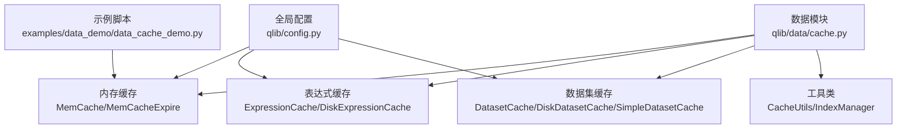
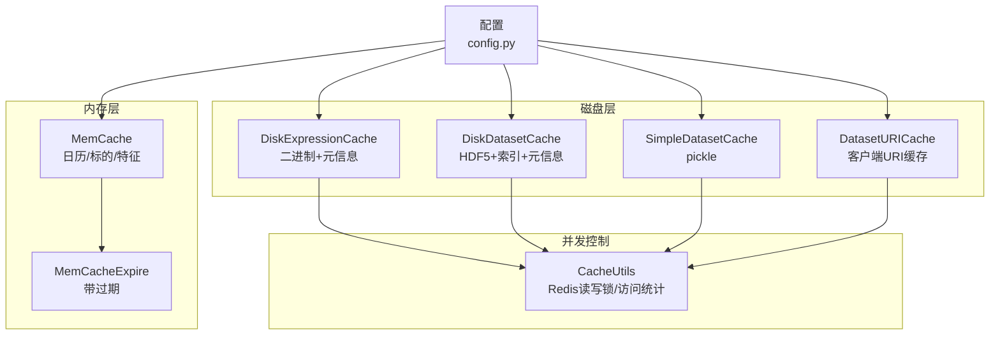
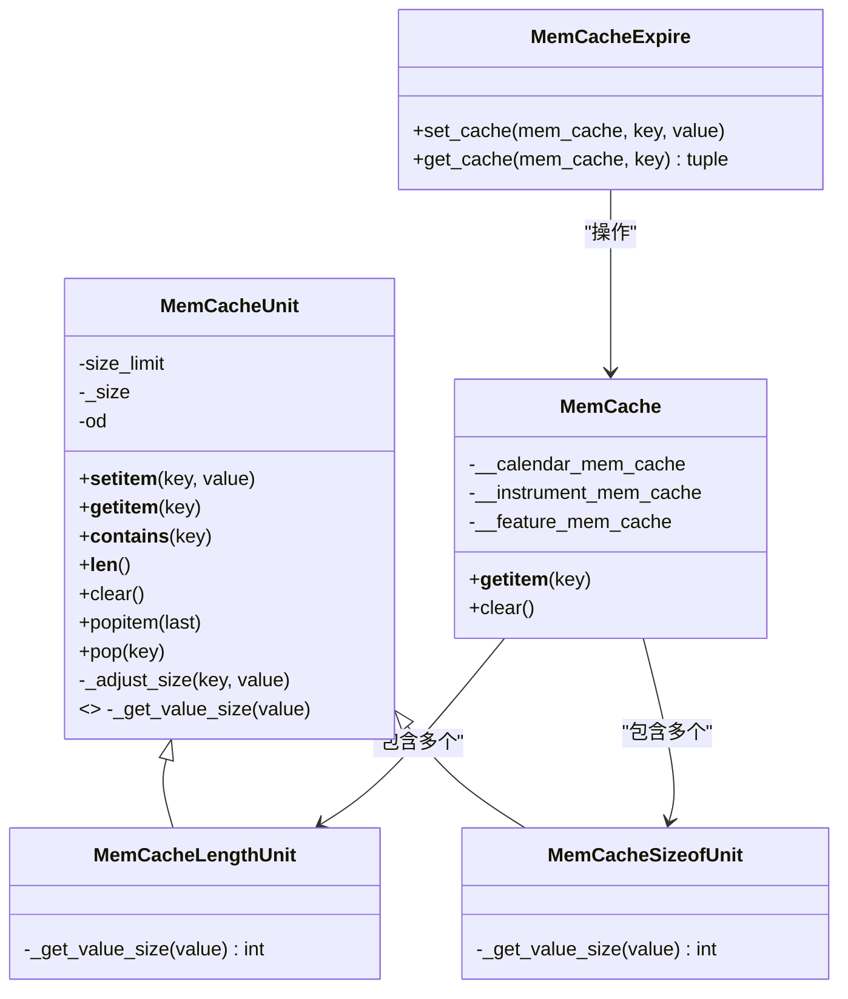
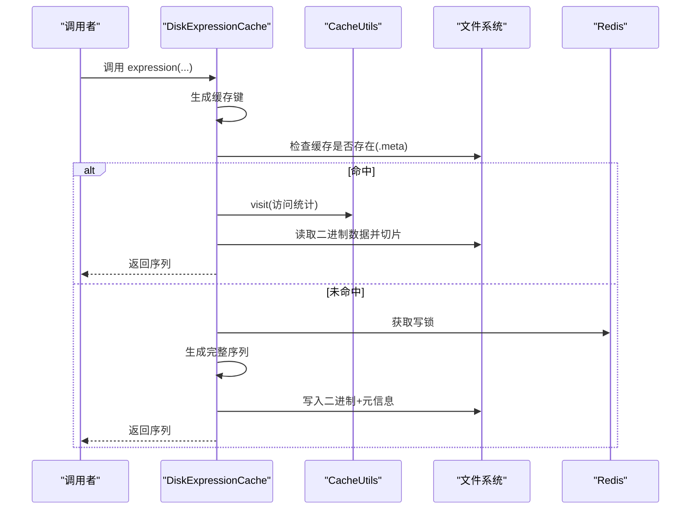
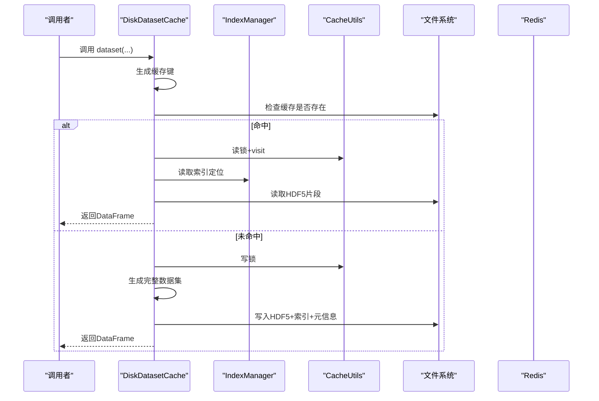
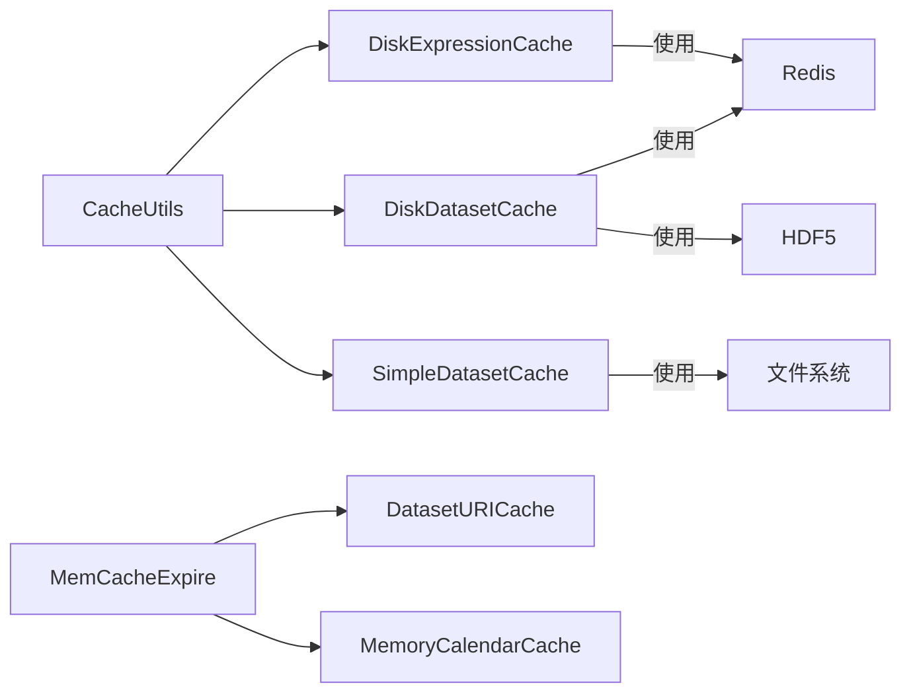

# 缓存API

<cite>
**本文引用的文件**
- [cache.py](file://qlib/data/cache.py)
- [config.py](file://qlib/config.py)
- [data_cache_demo.py](file://examples/data_demo/data_cache_demo.py)
</cite>

## 目录
1. [简介](#简介)
2. [项目结构](#项目结构)
3. [核心组件](#核心组件)
4. [架构总览](#架构总览)
5. [详细组件分析](#详细组件分析)
6. [依赖分析](#依赖分析)
7. [性能考量](#性能考量)
8. [故障排查指南](#故障排查指南)
9. [结论](#结论)
10. [附录：配置与最佳实践](#附录配置与最佳实践)

## 简介
本文件为 Qlib 缓存API的权威参考，覆盖以下方面：
- 缓存设计理念与实现机制：内存缓存、磁盘缓存（表达式与数据集）、缓存粒度与失效策略
- 内存缓存API：内存池管理、缓存大小限制、LRU 淘汰策略、带过期的内存缓存
- 磁盘缓存接口：文件存储格式、缓存持久化与恢复、并发写入控制
- 表达式缓存API：表达式计算结果缓存、缓存键生成、缓存更新与校验
- 数据集缓存机制：数据预加载、缓存共享、并发访问控制、客户端URI缓存
- 性能优化：命中率提升、内存使用优化、I/O 性能改进
- 配置与使用最佳实践：如何在不同模式下启用/禁用缓存、参数调优建议

## 项目结构
与缓存相关的核心代码位于数据模块中，主要文件如下：
- 缓存主实现：qlib/data/cache.py
- 全局配置：qlib/config.py
- 使用示例：examples/data_demo/data_cache_demo.py

图表来源
- [cache.py:137-179](file://qlib/data/cache.py#L137-L179)
- [cache.py:330-464](file://qlib/data/cache.py#L330-L464)
- [cache.py:490-644](file://qlib/data/cache.py#L490-L644)
- [cache.py:647-1061](file://qlib/data/cache.py#L647-L1061)
- [cache.py:1064-1116](file://qlib/data/cache.py#L1064-L1116)
- [config.py:169-174](file://qlib/config.py#L169-L174)
- [data_cache_demo.py:1-55](file://examples/data_demo/data_cache_demo.py#L1-L55)

章节来源
- [cache.py:137-179](file://qlib/data/cache.py#L137-L179)
- [cache.py:330-464](file://qlib/data/cache.py#L330-L464)
- [cache.py:490-644](file://qlib/data/cache.py#L490-L644)
- [cache.py:647-1061](file://qlib/data/cache.py#L647-L1061)
- [cache.py:1064-1116](file://qlib/data/cache.py#L1064-L1116)
- [config.py:169-174](file://qlib/config.py#L169-L174)
- [data_cache_demo.py:1-55](file://examples/data_demo/data_cache_demo.py#L1-L55)

## 核心组件
- 内存缓存单元与容器
  - MemCacheUnit：抽象基类，封装有序字典与容量调整逻辑，支持按“数量”或“字节大小”两种计量单位
  - MemCacheLengthUnit / MemCacheSizeofUnit：两种计量单位的具体实现
  - MemCache：三层内存缓存容器，分别管理日历、标的、特征三类缓存
  - MemCacheExpire：在 MemCache 基础上增加时间戳，实现带过期的缓存读取
- 缓存工具
  - CacheUtils：提供 Redis 锁、访问统计、锁清理等通用能力
- 表达式缓存
  - ExpressionCache：表达式缓存抽象基类，定义接口与缓存键生成约定
  - DiskExpressionCache：服务端磁盘表达式缓存实现，支持二进制文件存储与增量更新
- 数据集缓存
  - DatasetCache：数据集缓存抽象基类
  - DiskDatasetCache：服务端磁盘数据集缓存，HDF5 存储 + 索引文件 + 元信息文件
  - SimpleDatasetCache：本地简单数据集缓存，pickle 文件存储
  - DatasetURICache：客户端基于已挂载磁盘缓存的URI缓存，结合 MemCacheExpire 实现短时缓存
- 日历缓存
  - MemoryCalendarCache：内存日历缓存，复用 MemCacheExpire

章节来源
- [cache.py:44-118](file://qlib/data/cache.py#L44-L118)
- [cache.py:121-134](file://qlib/data/cache.py#L121-L134)
- [cache.py:137-179](file://qlib/data/cache.py#L137-L179)
- [cache.py:181-207](file://qlib/data/cache.py#L181-L207)
- [cache.py:210-292](file://qlib/data/cache.py#L210-L292)
- [cache.py:330-464](file://qlib/data/cache.py#L330-L464)
- [cache.py:490-644](file://qlib/data/cache.py#L490-L644)
- [cache.py:647-1061](file://qlib/data/cache.py#L647-L1061)
- [cache.py:1064-1116](file://qlib/data/cache.py#L1064-L1116)
- [cache.py:1180-1196](file://qlib/data/cache.py#L1180-L1196)

## 架构总览
Qlib 缓存体系由“内存层 + 磁盘层 + 并发控制层”构成，支持服务端与客户端两种部署形态。

图表来源
- [cache.py:137-179](file://qlib/data/cache.py#L137-L179)
- [cache.py:181-207](file://qlib/data/cache.py#L181-L207)
- [cache.py:490-644](file://qlib/data/cache.py#L490-L644)
- [cache.py:647-1061](file://qlib/data/cache.py#L647-L1061)
- [cache.py:1064-1116](file://qlib/data/cache.py#L1064-L1116)
- [cache.py:210-292](file://qlib/data/cache.py#L210-L292)
- [config.py:169-174](file://qlib/config.py#L169-L174)

## 详细组件分析

### 内存缓存API
- 设计理念
  - 将缓存分为三类：日历、标的、特征，便于按需清理与隔离
  - 支持两种计量单位：按条目数（长度）或按对象字节大小（sys.getsizeof）
  - LRU 淘汰：基于有序字典，最近访问的元素移动到末尾，超出容量时从开头弹出最旧项
- 关键接口
  - MemCache.__getitem__：按"c"/"i"/"f"获取对应缓存单元
  - MemCache.clear：清空所有单元
  - MemCacheExpire.get_cache/set_cache：带过期判断的读写
- 复杂度与性能
  - 访问/更新均为 O(1)，LRU 移动为 O(1)
  - 容量超限时，逐出最旧项，保证平均常数开销
- 并发与一致性
  - 当前实现未内置线程安全；如需多线程场景，应在调用方加锁或使用进程内隔离

图表来源
- [cache.py:44-118](file://qlib/data/cache.py#L44-L118)
- [cache.py:121-134](file://qlib/data/cache.py#L121-L134)
- [cache.py:137-179](file://qlib/data/cache.py#L137-L179)
- [cache.py:181-207](file://qlib/data/cache.py#L181-L207)

章节来源
- [cache.py:44-118](file://qlib/data/cache.py#L44-L118)
- [cache.py:121-134](file://qlib/data/cache.py#L121-L134)
- [cache.py:137-179](file://qlib/data/cache.py#L137-L179)
- [cache.py:181-207](file://qlib/data/cache.py#L181-L207)

### 磁盘缓存接口

#### 表达式缓存（DiskExpressionCache）
- 缓存粒度：单个表达式（按 instrument + field + freq 组合）
- 文件结构
  - 数据文件：二进制序列（float32），首元素为索引值
  - 元信息文件：包含 instrument、field、freq、last_update、访问统计等
- 缓存键生成
  - 基于标准化后的 instrument、field、freq 的哈希
- 并发控制
  - 写入使用 Redis 写锁；读取默认不加读锁（注释提示存在潜在冲突风险）
- 更新策略
  - 增量更新：根据 last_update 与最新日历，截断并追加新数据，同时更新元信息

图表来源
- [cache.py:507-564](file://qlib/data/cache.py#L507-L564)
- [cache.py:566-584](file://qlib/data/cache.py#L566-L584)
- [cache.py:586-644](file://qlib/data/cache.py#L586-L644)
- [cache.py:257-292](file://qlib/data/cache.py#L257-L292)

章节来源
- [cache.py:490-644](file://qlib/data/cache.py#L490-L644)

#### 数据集缓存（DiskDatasetCache）
- 缓存粒度：多标的/多字段/多频率的数据集
- 文件结构
  - 数据文件：HDF5，键固定，按 datetime 排序
  - 索引文件：.index，记录每时刻数据起止行号，便于快速定位
  - 元信息文件：包含 instruments、fields、freq、last_update、inst_processors 等
- 并发控制
  - 写入使用 Redis 写锁；读取使用读锁（读者计数器）
- 更新策略
  - 计算每个字段的扩展窗口，截断右侧冗余，追加新周期数据，重建索引并更新元信息

图表来源
- [cache.py:696-748](file://qlib/data/cache.py#L696-L748)
- [cache.py:750-792](file://qlib/data/cache.py#L750-L792)
- [cache.py:794-855](file://qlib/data/cache.py#L794-L855)
- [cache.py:857-950](file://qlib/data/cache.py#L857-L950)
- [cache.py:952-1061](file://qlib/data/cache.py#L952-L1061)
- [cache.py:257-292](file://qlib/data/cache.py#L257-L292)

章节来源
- [cache.py:647-1061](file://qlib/data/cache.py#L647-L1061)

#### 简单数据集缓存（SimpleDatasetCache）
- 适用场景：本地或客户端轻量级缓存
- 存储格式：pickle 文件
- 特点：无需 Redis，但不支持并发写入；适合单进程或离线场景

章节来源
- [cache.py:1064-1116](file://qlib/data/cache.py#L1064-L1116)

#### 客户端URI缓存（DatasetURICache）
- 适用场景：客户端通过挂载路径直接读取服务端缓存
- 机制：先从 MemCacheExpire 中读取缓存的URI，若不存在或过期则向服务端请求并缓存URI
- 注意：不支持 inst_processors 参数

章节来源
- [cache.py:1118-1177](file://qlib/data/cache.py#L1118-L1177)

### 缓存键生成与规范化
- 表达式缓存键：标准化 instrument、field、freq 后进行哈希
- 数据集缓存键：标准化 instruments、fields、freq，并包含 disk_cache、inst_processors 等参数
- 规范化函数：统一处理字段空格、大小写、频率等差异，确保键稳定一致

章节来源
- [cache.py:502-505](file://qlib/data/cache.py#L502-L505)
- [cache.py:656-657](file://qlib/data/cache.py#L656-L657)
- [cache.py:1079-1083](file://qlib/data/cache.py#L1079-L1083)
- [cache.py:1121-1122](file://qlib/data/cache.py#L1121-L1122)
- [cache.py:481-487](file://qlib/data/cache.py#L481-L487)

### 并发访问控制
- 读写锁模型
  - 读者计数器：进入时自增，离开时自减；当计数归零时释放写锁
  - 写锁：独占，避免竞态条件
- 锁清理
  - 提供重置所有锁的能力，用于异常状态恢复
- 注意事项
  - 表达式缓存默认读取不加读锁，存在潜在并发问题；建议在高并发场景显式加锁

章节来源
- [cache.py:257-292](file://qlib/data/cache.py#L257-L292)
- [cache.py:218-221](file://qlib/data/cache.py#L218-L221)

## 依赖分析
- 外部依赖
  - Redis：用于分布式读写锁与锁清理
  - HDF5：数据集缓存的数据存储格式
  - pickle：元信息与简单缓存的序列化格式
  - numpy/pandas：数值与结构化数据处理
- 内部耦合
  - CacheUtils 与各缓存实现强耦合，负责锁与访问统计
  - MemCacheExpire 依赖 MemCache 单元与时间戳
  - 各缓存实现均继承自 BaseProviderCache，保持统一接口风格

图表来源
- [cache.py:210-292](file://qlib/data/cache.py#L210-L292)
- [cache.py:490-644](file://qlib/data/cache.py#L490-L644)
- [cache.py:647-1061](file://qlib/data/cache.py#L647-L1061)
- [cache.py:1064-1116](file://qlib/data/cache.py#L1064-L1116)
- [cache.py:1118-1177](file://qlib/data/cache.py#L1118-L1177)
- [cache.py:1184-1196](file://qlib/data/cache.py#L1184-L1196)

章节来源
- [cache.py:210-292](file://qlib/data/cache.py#L210-L292)
- [cache.py:490-644](file://qlib/data/cache.py#L490-L644)
- [cache.py:647-1061](file://qlib/data/cache.py#L647-L1061)
- [cache.py:1064-1116](file://qlib/data/cache.py#L1064-L1116)
- [cache.py:1118-1177](file://qlib/data/cache.py#L1118-L1177)
- [cache.py:1184-1196](file://qlib/data/cache.py#L1184-L1196)

## 性能考量
- 命中率提升
  - 合理设置 MemCache 大小与计量单位，优先使用“字节大小”以更贴近真实内存占用
  - 对热点数据（如常用日历、高频表达式）适当增大容量
- 内存使用优化
  - 使用 MemCacheSizeofUnit 时，注意对象内部引用与循环引用对 getsizeof 的影响
  - 及时清理不再使用的缓存单元（MemCache.clear）
- I/O 性能改进
  - 表达式缓存采用二进制存储，读取时仅切片，减少解析开销
  - 数据集缓存通过索引文件快速定位，避免全表扫描
  - 增量更新避免全量重算，显著降低写放大
- 并发与锁竞争
  - 在高并发读场景下，建议显式使用读锁；写锁尽量缩短持有时间
  - 合理划分缓存粒度，降低锁粒度带来的争用

## 故障排查指南
- 缓存锁异常
  - 症状：提示写锁已存在
  - 处理：使用 CacheUtils.reset_lock 清理残留锁后重试
- 访问统计异常
  - 症状：多读导致访问次数统计不准
  - 处理：当前实现对并发读取的访问统计存在注释提示的风险，建议在高并发场景谨慎使用 visit
- 缓存损坏
  - 症状：读取失败或数据不一致
  - 处理：调用 BaseProviderCache.clear_cache 删除缓存文件后重新生成
- 客户端缓存未生效
  - 症状：客户端仍走远程数据流
  - 处理：确认 DatasetURICache 的 URI 是否存在于挂载路径，且 MemCacheExpire 未过期

章节来源
- [cache.py:240-254](file://qlib/data/cache.py#L240-L254)
- [cache.py:222-238](file://qlib/data/cache.py#L222-L238)
- [cache.py:313-321](file://qlib/data/cache.py#L313-L321)
- [cache.py:1154-1177](file://qlib/data/cache.py#L1154-L1177)

## 结论
Qlib 缓存API通过“内存 + 磁盘 + 并发控制”的分层设计，在保证正确性的同时兼顾了性能与可扩展性。表达式与数据集缓存分别针对不同粒度与场景提供了高效实现；MemCacheExpire 则为客户端与短期缓存提供了便捷的过期控制。结合合理的配置与使用规范，可在大规模数据处理中显著降低重复计算与I/O开销。

## 附录：配置与最佳实践

### 配置项
- 内存缓存
  - mem_cache_size_limit：内存缓存容量上限，默认值见配置
  - mem_cache_limit_type：计量单位，"length" 或 "sizeof"
  - mem_cache_expire：带过期的内存缓存过期时间（秒）
- 磁盘缓存
  - dataset_cache_dir_name / features_cache_dir_name：缓存目录名
  - default_disk_cache：是否默认使用磁盘缓存
- Redis
  - redis_host / redis_port / redis_task_db / redis_password：Redis 连接参数

章节来源
- [config.py:169-174](file://qlib/config.py#L169-L174)
- [config.py:251-286](file://qlib/config.py#L251-L286)

### 最佳实践
- 选择合适的缓存类型
  - 服务端优先使用 DiskExpressionCache 与 DiskDatasetCache
  - 客户端可使用 DatasetURICache 或 SimpleDatasetCache（取决于部署环境）
- 合理设置内存缓存
  - 对高频访问的日历与表达式，开启 MemCacheExpire 并适当提高容量
  - 使用 sizeof 计量时，关注对象大小变化，定期评估与调优
- 并发与锁
  - 高并发读场景显式使用读锁；写锁尽量缩短持有时间
  - 避免在缓存键生成过程中引入不稳定因素（如时间戳）
- 数据一致性
  - 使用增量更新策略，避免全量重建
  - 定期检查与清理损坏缓存，必要时回退到原始数据源