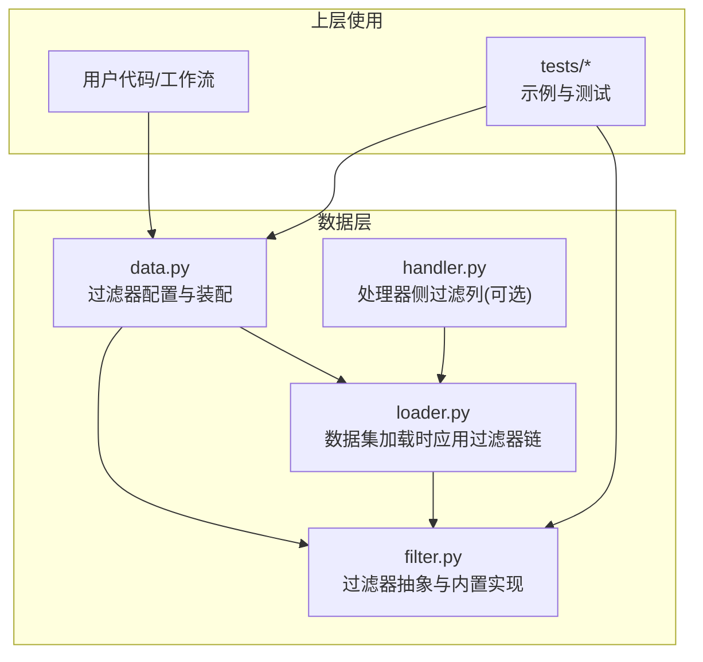
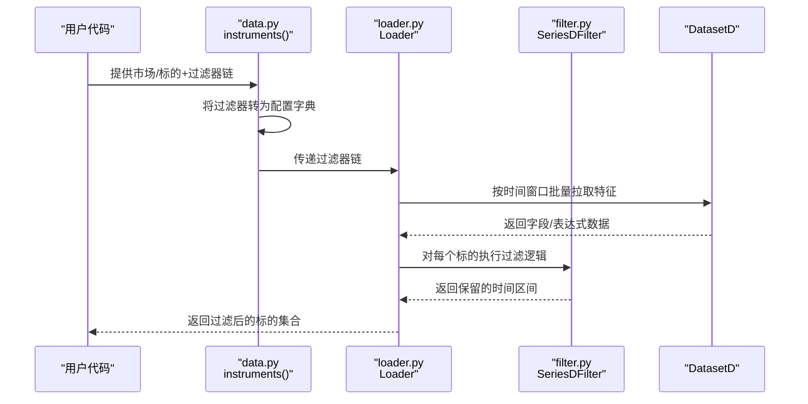
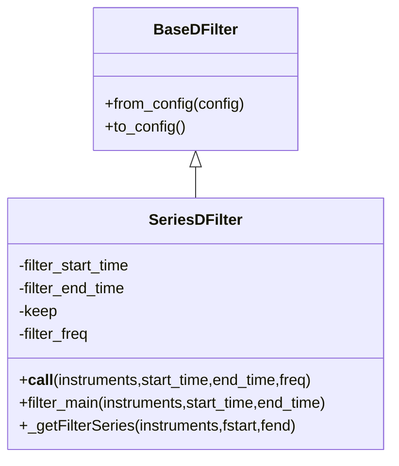
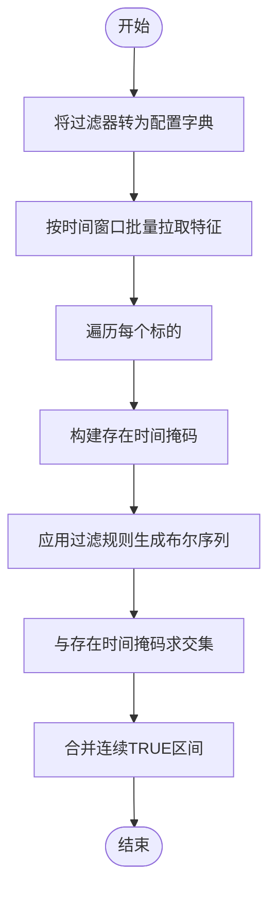
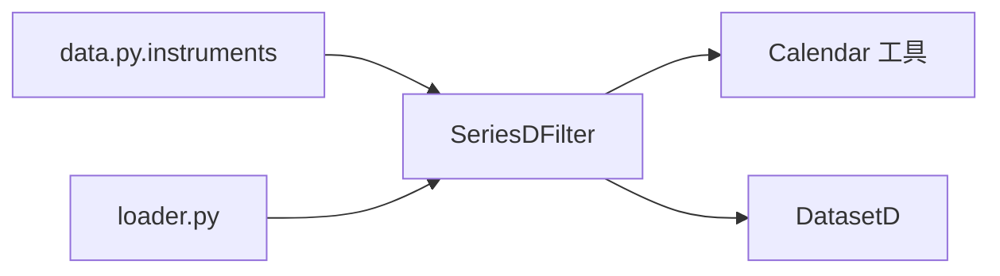

# 过滤器API

<cite>
**本文引用的文件**
- [filter.py](file://qlib/data/filter.py)
- [data.py](file://qlib/data/data.py)
- [loader.py](file://qlib/data/dataset/loader.py)
- [handler.py](file://qlib/contrib/data/handler.py)
- [tests/__init__.py](file://tests/data_mid_layer_tests/test_dataloader.py)
- [test_dataloader.py](file://tests/data_mid_layer_tests/test_dataloader.py)
</cite>

## 目录
1. [简介](#简介)
2. [项目结构](#项目结构)
3. [核心组件](#核心组件)
4. [架构总览](#架构总览)
5. [详细组件分析](#详细组件分析)
6. [依赖分析](#依赖分析)
7. [性能考虑](#性能考虑)
8. [故障排查指南](#故障排查指南)
9. [结论](#结论)
10. [附录：使用示例与最佳实践](#附录使用示例与最佳实践)

## 简介
本文件为 Qlib 过滤器API的权威参考文档，聚焦动态仪器过滤能力，覆盖以下主题：
- 过滤器接口设计与实现要点（抽象基类、序列化配置、调用流程）
- 内置过滤器类型（名称正则过滤器、表达式过滤器）
- 过滤器链组合（多条件过滤、顺序与优先级、嵌套与复用）
- 性能优化策略（索引利用、批量处理、缓存策略）
- 自定义过滤器开发（接口实现、参数配置、错误处理）
- 实际使用示例（从数据加载到回测/策略执行）

## 项目结构
与过滤器API直接相关的核心模块如下：
- 数据层过滤器定义：qlib/data/filter.py
- 过滤器配置与装配：qlib/data/data.py
- 数据集加载对过滤器链的支持：qlib/data/dataset/loader.py
- 处理器侧过滤列处理器（可选）：qlib/contrib/data/handler.py
- 测试与示例：tests/data_mid_layer_tests/test_dataloader.py 等

图表来源
- [filter.py:15-376](file://qlib/data/filter.py#L15-L376)
- [data.py:205-264](file://qlib/data/data.py#L205-L264)
- [loader.py:158-216](file://qlib/data/dataset/loader.py#L158-L216)
- [handler.py:58-123](file://qlib/contrib/data/handler.py#L58-L123)

章节来源
- [filter.py:15-376](file://qlib/data/filter.py#L15-L376)
- [data.py:205-264](file://qlib/data/data.py#L205-L264)
- [loader.py:158-216](file://qlib/data/dataset/loader.py#L158-L216)
- [handler.py:58-123](file://qlib/contrib/data/handler.py#L58-L123)

## 核心组件
- 抽象过滤器基类：定义统一的配置序列化接口与调用入口
- 序列化过滤器基类：面向“特征序列”的过滤器，支持时间边界、布尔序列过滤与连续区间提取
- 名称过滤器：基于正则匹配的静态过滤器
- 表达式过滤器：基于表达式的动态过滤器，按时间窗口批量拉取特征并进行布尔判定

章节来源
- [filter.py:15-376](file://qlib/data/filter.py#L15-L376)

## 架构总览
过滤器在 Qlib 中的运行路径：
- 用户通过数据层接口传入过滤器链（列表），系统将其转换为标准配置字典
- 数据集加载阶段根据过滤器链生成时间窗口内的特征序列
- 过滤器对每个标的的时间存在性与表达式/正则条件进行布尔运算
- 最终输出保留有效时间区间的标的集合

图表来源
- [data.py:205-264](file://qlib/data/data.py#L205-L264)
- [loader.py:158-216](file://qlib/data/dataset/loader.py#L158-L216)
- [filter.py:51-262](file://qlib/data/filter.py#L51-L262)

## 详细组件分析

### 抽象基类与序列化基类
- BaseDFilter：定义 from_config 与 to_config 接口，便于从配置构造实例与序列化
- SeriesDFilter：面向“特征序列”的过滤器基类，提供时间边界计算、布尔序列过滤、连续区间提取等通用逻辑，并定义 _getFilterSeries 抽象方法用于子类实现

图表来源
- [filter.py:15-214](file://qlib/data/filter.py#L15-L214)

章节来源
- [filter.py:15-214](file://qlib/data/filter.py#L15-L214)

### 名称过滤器（NameDFilter）
- 功能：基于正则表达式对标的名称进行过滤
- 关键点：
  - 支持设置过滤起止时间（与全局时间窗口取交集）
  - 对未命中的标的，可通过 keep 参数决定是否保留全时间段或剔除
- 配置项：filter_type、name_rule_re、filter_start_time、filter_end_time

章节来源
- [filter.py:265-310](file://qlib/data/filter.py#L265-L310)

### 表达式过滤器（ExpressionDFilter）
- 功能：基于表达式规则对特征序列进行布尔判定
- 关键点：
  - 使用 DatasetD 按时间窗口批量拉取表达式字段
  - 通过布尔序列与时间存在性序列做逐日 AND 运算
  - 支持 keep 参数控制缺失值处理
- 配置项：filter_type、rule_expression、filter_start_time、filter_end_time、keep

章节来源
- [filter.py:312-376](file://qlib/data/filter.py#L312-L376)

### 过滤器链与装配流程
- 数据层接口 instruments(market, filter_pipe) 负责将过滤器对象或配置字典标准化为配置列表
- Loader 在数据加载时应用过滤器链，对每个标的生成“存在时间”与“满足条件时间”的布尔序列并求交集
- 过滤器顺序影响最终结果，应按“先粗后细、先稳后变”的原则组织

图表来源
- [data.py:205-264](file://qlib/data/data.py#L205-L264)
- [loader.py:158-216](file://qlib/data/dataset/loader.py#L158-L216)
- [filter.py:51-262](file://qlib/data/filter.py#L51-L262)

章节来源
- [data.py:205-264](file://qlib/data/data.py#L205-L264)
- [loader.py:158-216](file://qlib/data/dataset/loader.py#L158-L216)
- [filter.py:51-262](file://qlib/data/filter.py#L51-L262)

## 依赖分析
- 组件耦合
  - SeriesDFilter 依赖 Calendar 工具与 DatasetD 批量特征拉取
  - data.py 的 instruments 负责过滤器配置标准化与装配
  - loader.py 在数据加载阶段消费过滤器链
- 外部依赖
  - pandas/numpy 用于时间序列与布尔运算
  - DatasetD 提供表达式字段的批量获取

图表来源
- [filter.py:12-12](file://qlib/data/filter.py#L12-L12)
- [data.py:205-264](file://qlib/data/data.py#L205-L264)
- [loader.py:158-216](file://qlib/data/dataset/loader.py#L158-L216)

章节来源
- [filter.py:12-12](file://qlib/data/filter.py#L12-L12)
- [data.py:205-264](file://qlib/data/data.py#L205-L264)
- [loader.py:158-216](file://qlib/data/dataset/loader.py#L158-L216)

## 性能考虑
- 索引与时间边界
  - 利用 Calendar 计算全局时间边界与过滤时间边界，减少无效日期参与运算
- 批量处理
  - 表达式过滤器通过 DatasetD 批量拉取字段，避免逐日查询
- 缓存策略
  - 表达式过滤器显式关闭磁盘缓存以保证实时性；如需缓存可结合上层 DatasetD 的缓存机制
- 布尔序列运算
  - 使用切片与逐元素 AND 进行高效布尔运算，避免循环遍历

章节来源
- [filter.py:83-147](file://qlib/data/filter.py#L83-L147)
- [filter.py:341-357](file://qlib/data/filter.py#L341-L357)

## 故障排查指南
- 类型错误
  - 当传入的过滤器既非字典也非 SeriesDFilter 实例时会抛出类型错误，请确保传入正确的过滤器对象或配置字典
- 表达式解析失败
  - 表达式过滤器内部尝试使用 DatasetD 获取字段，若出现类型错误则回退到本地提供者；请检查表达式语法与可用字段
- 时间边界不一致
  - 若标的在过滤时间窗内不存在数据，且 keep=False，则该标会被剔除；如需保留可将 keep 设为 True

章节来源
- [data.py:254-262](file://qlib/data/data.py#L254-L262)
- [filter.py:341-357](file://qlib/data/filter.py#L341-L357)
- [filter.py:251-254](file://qlib/data/filter.py#L251-L254)

## 结论
Qlib 的过滤器API以 SeriesDFilter 为核心，提供了统一的“存在时间+条件时间”的布尔过滤范式。通过名称过滤器与表达式过滤器，用户可以灵活地在时间维度与特征维度上进行多条件组合。配合数据集加载阶段的批量特征拉取与布尔序列运算，可在保证性能的同时实现高可读性的过滤链配置。

## 附录：使用示例与最佳实践
- 在数据层配置过滤器链
  - 参考接口：data.py 的 instruments(market, filter_pipe)
  - 示例配置包含多个过滤器的顺序与参数
- 在数据集加载中应用过滤器链
  - 参考：loader.py 在初始化时读取 filter_pipe 并在加载数据时应用
- 处理器侧过滤列（可选）
  - 参考：contrib/data/handler.py 中的 FilterCol 处理器，可用于列级别的过滤
- 测试与示例
  - 参考 tests/data_mid_layer_tests/test_dataloader.py 中的数据加载与过滤器链使用方式

章节来源
- [data.py:205-264](file://qlib/data/data.py#L205-L264)
- [loader.py:158-216](file://qlib/data/dataset/loader.py#L158-L216)
- [handler.py:58-123](file://qlib/contrib/data/handler.py#L58-L123)
- [tests/data_mid_layer_tests/test_dataloader.py](file://tests/data_mid_layer_tests/test_dataloader.py)