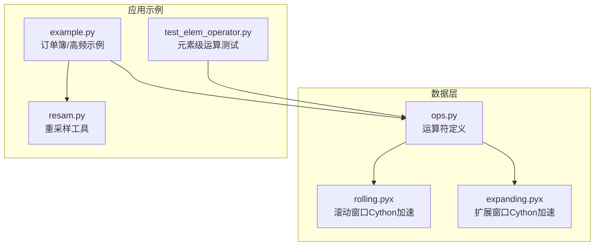
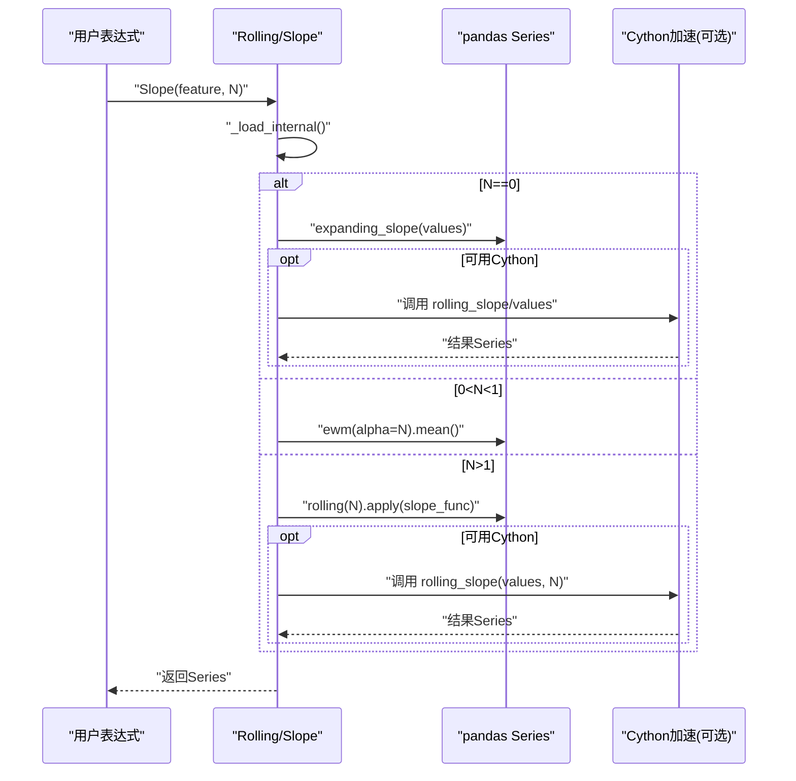
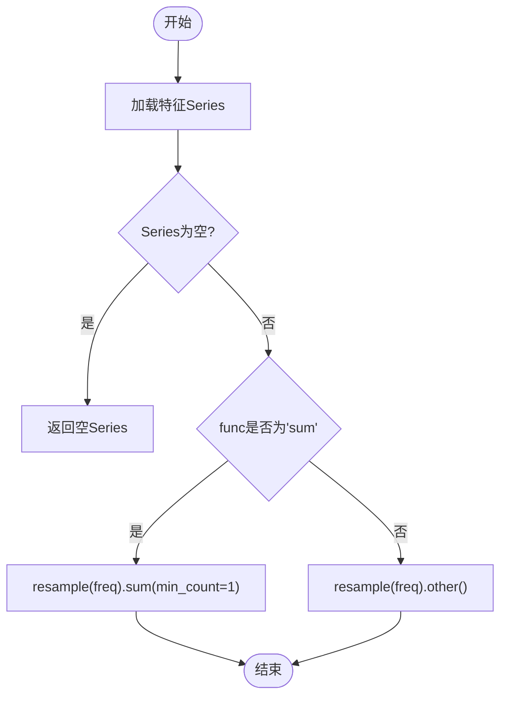
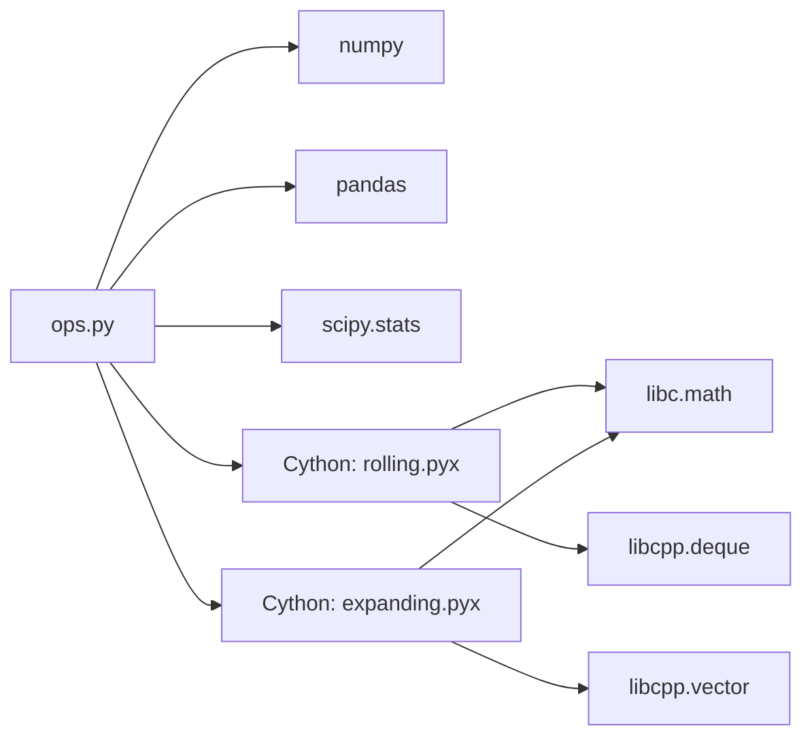

# 运算符API

<cite>
**本文引用的文件**   
- [ops.py](file://qlib/data/ops.py)
- [rolling.pyx](file://qlib/data/_libs/rolling.pyx)
- [expanding.pyx](file://qlib/data/_libs/expanding.pyx)
- [test_elem_operator.py](file://tests/ops/test_elem_operator.py)
- [example.py](file://examples/orderbook_data/example.py)
- [resam.py](file://qlib/utils/resam.py)
</cite>

## 目录
1. [简介](#简介)
2. [项目结构](#项目结构)
3. [核心组件](#核心组件)
4. [架构总览](#架构总览)
5. [详细组件分析](#详细组件分析)
6. [依赖分析](#依赖分析)
7. [性能考量](#性能考量)
8. [故障排查指南](#故障排查指南)
9. [结论](#结论)
10. [附录：常见用法与示例路径](#附录常见用法与示例路径)

## 简介
本文件为 Qlib 运算符API的权威参考，覆盖以下主题：
- 数学运算符：基本算术、三角函数、对数、指数等（通过元素级运算实现）
- 统计运算符：移动平均、标准差、方差、偏度、峰度、分位数、中位数、MAD、极值索引、相关系数、协方差、回归斜率、R²、残差、加权移动平均、指数加权等
- 向量化运算符：元素级广播、类型转换、布尔逻辑、比较运算
- 时间序列运算符：重采样、滞后（引用）、增长率/差分等
- 高性能运算符：基于 Cython 的滚动窗口与扩展窗口的均值、斜率、R²、残差等
- 组合与链式调用：表达式组合、管道化、复合表达式与性能优化建议

本参考文档在每个涉及具体实现的章节均给出“章节来源”，并在涉及真实代码结构的图示中给出“图表来源”。

## 项目结构
与运算符API直接相关的核心文件如下：
- 元素级与复合运算定义：qlib/data/ops.py
- Cython 加速的滚动/扩展窗口运算：qlib/data/_libs/rolling.pyx、qlib/data/_libs/expanding.pyx
- 示例与测试：tests/ops/test_elem_operator.py、examples/orderbook_data/example.py
- 时间序列重采样工具：qlib/utils/resam.py

**图表来源**
- [ops.py:1-1682](file://qlib/data/ops.py#L1-L1682)
- [rolling.pyx:1-208](file://qlib/data/_libs/rolling.pyx#L1-L208)
- [expanding.pyx:1-153](file://qlib/data/_libs/expanding.pyx#L1-L153)
- [test_elem_operator.py:1-70](file://tests/ops/test_elem_operator.py#L1-L70)
- [example.py:240-312](file://examples/orderbook_data/example.py#L240-L312)
- [resam.py:1-158](file://qlib/utils/resam.py#L1-L158)

**章节来源**
- [ops.py:1-1682](file://qlib/data/ops.py#L1-L1682)
- [rolling.pyx:1-208](file://qlib/data/_libs/rolling.pyx#L1-L208)
- [expanding.pyx:1-153](file://qlib/data/_libs/expanding.pyx#L1-L153)
- [test_elem_operator.py:1-70](file://tests/ops/test_elem_operator.py#L1-L70)
- [example.py:240-312](file://examples/orderbook_data/example.py#L240-L312)
- [resam.py:1-158](file://qlib/utils/resam.py#L1-L158)

## 核心组件
- 表达式基类与运算器框架：Expression、ExpressionOps、Feature、PFeature
- 元素级运算器：ElemOperator 及其派生（如 Abs、Sign、Log、Mask、Not 等）
- 双元运算器：PairOperator 及其派生（加减乘除、比较、逻辑与或等）
- 三元运算器：If 条件选择
- 滚动/扩展窗口运算器：Rolling 及其派生（Mean、Sum、Std、Var、Skew、Kurt、Max、Min、IdxMax、IdxMin、Quantile、Med、Mad、Rank、Count、Delta、Slope、Rsquare、Resi、WMA、EMA、Corr、Cov）
- 时间序列专用运算器：TResample（按频率重采样）
- 高性能加速：通过导入 _libs.rolling 与 _libs.expanding 中的 Cython 函数（rolling_mean、rolling_slope、rolling_rsquare、rolling_resi、expanding_*）

**章节来源**
- [ops.py:36-1682](file://qlib/data/ops.py#L36-L1682)

## 架构总览
下图展示了运算符的层次结构与调用关系，以及与Cython加速模块的衔接。

```mermaid
classDiagram
class ExpressionOps
class ElemOperator
class PairOperator
class If
class Rolling
class TResample
class Abs
class Sign
class Log
class Mask
class Not
class Add
class Sub
class Mul
class Div
class Greater
class Less
class Gt
class Ge
class Lt
class Le
class Eq
class Ne
class And
class Or
class Mean
class Sum
class Std
class Var
class Skew
class Kurt
class Max
class Min
class IdxMax
class IdxMin
class Quantile
class Med
class Mad
class Rank
class Count
class Delta
class Slope
class Rsquare
class Resi
class WMA
class EMA
class Corr
class Cov
ExpressionOps <|-- ElemOperator
ExpressionOps <|-- PairOperator
ExpressionOps <|-- If
ExpressionOps <|-- Rolling
ExpressionOps <|-- TResample
ElemOperator <|-- Abs
ElemOperator <|-- Sign
ElemOperator <|-- Log
ElemOperator <|-- Mask
ElemOperator <|-- Not
PairOperator <|-- Add
PairOperator <|-- Sub
PairOperator <|-- Mul
PairOperator <|-- Div
PairOperator <|-- Greater
PairOperator <|-- Less
PairOperator <|-- Gt
PairOperator <|-- Ge
PairOperator <|-- Lt
PairOperator <|-- Le
PairOperator <|-- Eq
PairOperator <|-- Ne
PairOperator <|-- And
PairOperator <|-- Or
Rolling <|-- Mean
Rolling <|-- Sum
Rolling <|-- Std
Rolling <|-- Var
Rolling <|-- Skew
Rolling <|-- Kurt
Rolling <|-- Max
Rolling <|-- Min
Rolling <|-- IdxMax
Rolling <|-- IdxMin
Rolling <|-- Quantile
Rolling <|-- Med
Rolling <|-- Mad
Rolling <|-- Rank
Rolling <|-- Count
Rolling <|-- Delta
Rolling <|-- Slope
Rolling <|-- Rsquare
Rolling <|-- Resi
Rolling <|-- WMA
Rolling <|-- EMA
Rolling <|-- Corr
Rolling <|-- Cov
```

**图表来源**
- [ops.py:36-1682](file://qlib/data/ops.py#L36-L1682)

## 详细组件分析

### 数学运算符（元素级）
- 基本算术：Add、Sub、Mul、Div
- 比较与逻辑：Greater、Less、Gt、Ge、Lt、Le、Eq、Ne、And、Or、Not
- 绝对值与符号：Abs、Sign
- 对数与掩码：Log、Mask
- 实现要点：
  - 所有元素级运算均继承自 ElemOperator 或 PairOperator，并通过 _load_internal 调用底层 numpy/scipy/pandas 方法
  - 对于布尔/位运算，内部会进行类型转换以避免错误
  - 双元运算在加载时会对两侧序列长度进行校验并输出调试信息

**章节来源**
- [ops.py:36-706](file://qlib/data/ops.py#L36-L706)

### 统计运算符（滚动/扩展/配对）
- 移动窗口类：Mean、Sum、Std、Var、Skew、Kurt、Max、Min、IdxMax、IdxMin、Quantile、Med、Mad、Rank、Count、Delta
- 回归与线性拟合：Slope、Rsquare、Resi
- 加权与指数：WMA、EMA
- 配对滚动：Corr、Cov
- 实现要点：
  - Rolling 基类根据 N 的取值选择 expanding/rolling/ewm；当 N==0 时走扩展窗口；当 0<N<1 时走指数加权
  - 高性能：Slope/Rsquare/Resi 在 N!=0 时通过导入的 Cython 函数（rolling_slope/rolling_rsquare/rolling_resi）执行，显著提升性能
  - 偏度/峰度对窗口大小有限制（Skew 至少3，Kurt 至少5）
  - Corr 在标准差接近0时返回 NaN，避免除零

**图表来源**
- [ops.py:1219-1311](file://qlib/data/ops.py#L1219-L1311)
- [rolling.pyx:193-207](file://qlib/data/_libs/rolling.pyx#L193-L207)

**章节来源**
- [ops.py:708-1383](file://qlib/data/ops.py#L708-L1383)
- [rolling.pyx:1-208](file://qlib/data/_libs/rolling.pyx#L1-L208)
- [expanding.pyx:1-153](file://qlib/data/_libs/expanding.pyx#L1-L153)

### 向量化运算符与广播
- 广播机制：双元运算器在 _load_internal 中分别加载左右两侧的 Series/数值，pandas/numpy 自动进行广播
- 类型转换：Sign 运算在内部将输入转为 float32，避免布尔类型导致的错误
- 布尔与位运算：Not、And、Or 使用 bitwise_* 系列方法

**章节来源**
- [ops.py:230-706](file://qlib/data/ops.py#L230-L706)

### 时间序列运算符
- 重采样：TResample 接受目标频率与聚合方法（如 last、mean、sum 等），内部调用 pandas.Series.resample
- 滞后/引用：Ref 支持 N==0（取首日）、N>0（历史滞后）、N<0（未来前瞻）
- 增长率/差分：Delta 计算窗口起点与终点之差；示例中可见通过 TResample + Ref 实现跨频率的增长率

**图表来源**
- [ops.py:1528-1563](file://qlib/data/ops.py#L1528-L1563)

**章节来源**
- [ops.py:1528-1563](file://qlib/data/ops.py#L1528-L1563)
- [resam.py:1-158](file://qlib/utils/resam.py#L1-L158)
- [example.py:240-312](file://examples/orderbook_data/example.py#L240-L312)

### 高性能运算符（Cython加速）
- 滚动窗口：Mean、Slope、Rsquare、Resi 提供对应的 Cython 实现，通过导入 _libs.rolling 中的函数实现 O(n) 窗口滑动
- 扩展窗口：Mean、Slope、Rsquare、Resi 提供对应的 Cython 实现，适合无限窗口的在线更新
- 导入保护：若无法导入 Cython 模块，会捕获异常并提示升级 numpy，同时禁用加速功能

**章节来源**
- [ops.py:17-31](file://qlib/data/ops.py#L17-L31)
- [rolling.pyx:1-208](file://qlib/data/_libs/rolling.pyx#L1-L208)
- [expanding.pyx:1-153](file://qlib/data/_libs/expanding.pyx#L1-L153)

### 组合使用与链式调用
- 复合表达式：支持多层嵌套，如 Abs($close - Ref($close, 1))、TResample(Gt(...), "1min", "mean")
- 管道化思路：先做元素级变换（如 Log、Abs、Sign），再做滚动统计（如 Mean、Std、Slope），最后做重采样（TResample）
- 性能优化建议：
  - 优先使用 N==0 的扩展窗口或 0<N<1 的指数加权，减少窗口内重复计算
  - 尽量避免在滚动窗口内进行复杂 Python 函数（如自定义 apply），优先使用内置方法
  - 对于需要回归分析的场景，尽量复用底层 Cython 实现（Slope、Rsquare、Resi）

**章节来源**
- [test_elem_operator.py:1-70](file://tests/ops/test_elem_operator.py#L1-L70)
- [example.py:240-312](file://examples/orderbook_data/example.py#L240-L312)

## 依赖分析
- 运算符实现依赖 pandas/numpy/scipy（用于 Series/数组操作与统计）
- Cython 模块依赖 libc.math 与 libcpp.deque/vector（用于高效滑动窗口与在线统计）
- 导入保护：若无法导入 Cython 模块，系统会降级并打印提示信息

**图表来源**
- [ops.py:1-34](file://qlib/data/ops.py#L1-L34)
- [rolling.pyx:1-9](file://qlib/data/_libs/rolling.pyx#L1-L9)
- [expanding.pyx:1-9](file://qlib/data/_libs/expanding.pyx#L1-L9)

**章节来源**
- [ops.py:1-34](file://qlib/data/ops.py#L1-L34)
- [rolling.pyx:1-9](file://qlib/data/_libs/rolling.pyx#L1-L9)
- [expanding.pyx:1-9](file://qlib/data/_libs/expanding.pyx#L1-L9)

## 性能考量
- Cython 加速：滚动/扩展窗口的均值、斜率、R²、残差等通过 Cython 实现，避免 Python 循环开销
- 窗口策略：N==0（扩展）与 0<N<1（指数加权）在长序列上更高效；N 较大时建议使用内置 rolling.apply 的原生方法
- 内存与缓存：表达式加载使用内存缓存，多次调用不会重复计算
- 类型与广播：元素级运算尽量保持数值类型一致，避免不必要的类型转换

[本节为通用指导，不直接分析具体文件]

## 故障排查指南
- 导入Cython失败：若出现导入错误，系统会捕获异常并提示升级 numpy；此时相关加速功能将被禁用
- 双侧序列长度不一致：双元运算在加载时会检查两侧长度并输出调试信息，必要时请对齐索引或填充缺失值
- 相关系数为NaN：当任一侧滚动标准差接近0时，Corr 返回 NaN，属预期行为
- 偏度/峰度窗口过小：Skew/Kurt 要求窗口大小满足最低阈值，否则抛出异常

**章节来源**
- [ops.py:17-31](file://qlib/data/ops.py#L17-L31)
- [ops.py:301-335](file://qlib/data/ops.py#L301-L335)
- [ops.py:924-948](file://qlib/data/ops.py#L924-L948)
- [ops.py:1494-1497](file://qlib/data/ops.py#L1494-L1497)

## 结论
Qlib 的运算符API以 ExpressionOps 为核心，提供了从元素级到滚动/扩展窗口、从统计到回归分析、从时间序列重采样到高性能加速的完整体系。通过合理的组合与链式调用，可以构建复杂的因子表达式；借助 Cython 加速与内置优化，能够在大规模数据上保持良好性能。

[本节为总结性内容，不直接分析具体文件]

## 附录：常见用法与示例路径
- 元素级运算测试：断言 Abs/Sign 的正确性
  - [test_elem_operator.py:19-40](file://tests/ops/test_elem_operator.py#L19-L40)
- 复合表达式示例：TResample + Gt + Ref + Div + Mean
  - [example.py:240-312](file://examples/orderbook_data/example.py#L240-L312)
- 重采样工具：按频率重采样时间序列
  - [resam.py:1-158](file://qlib/utils/resam.py#L1-L158)