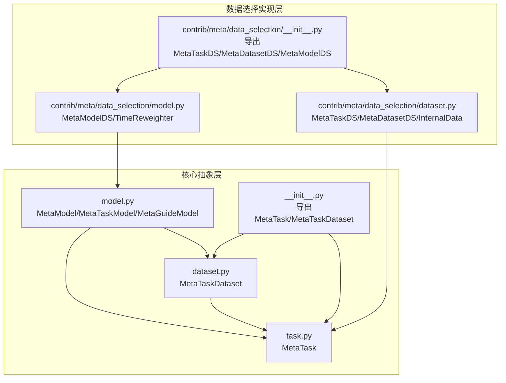
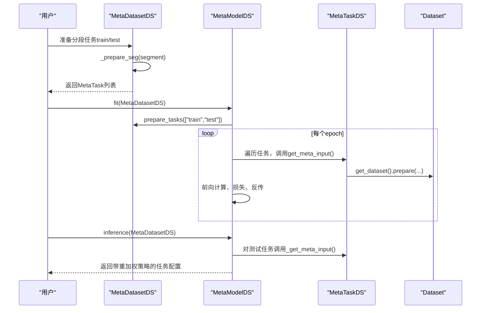
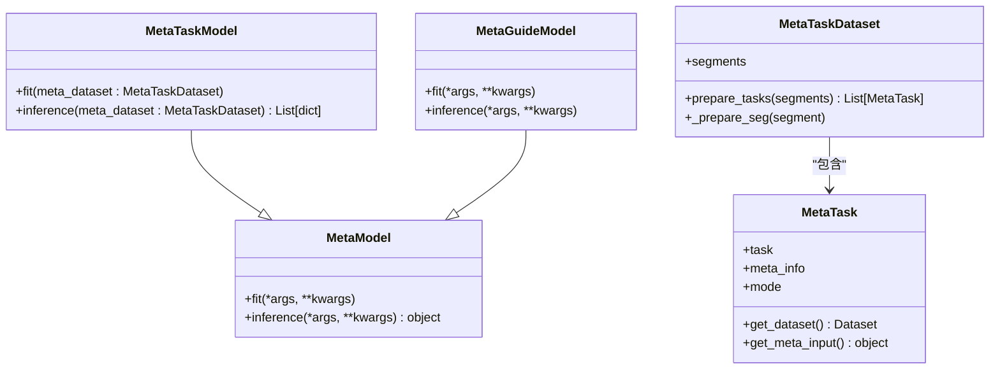
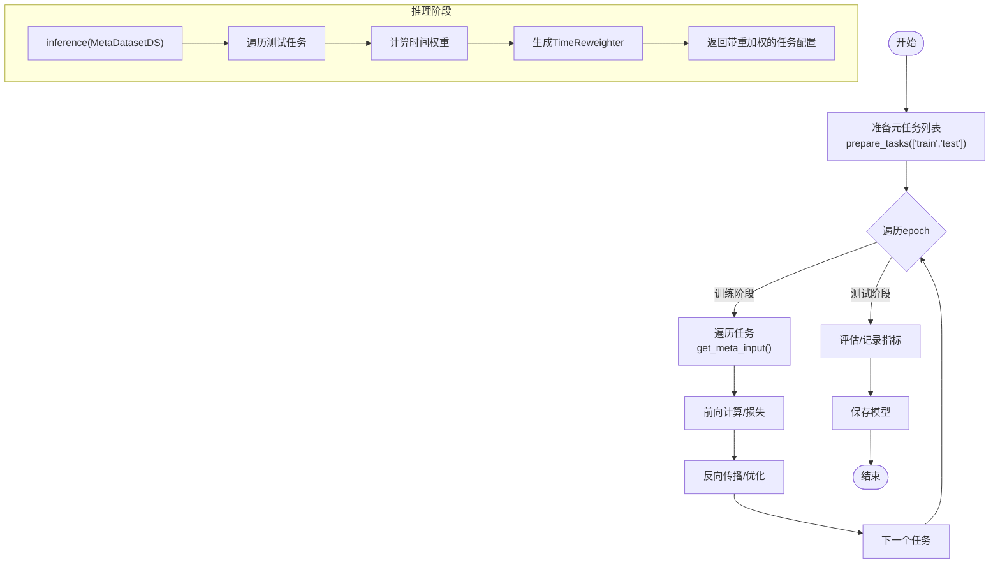
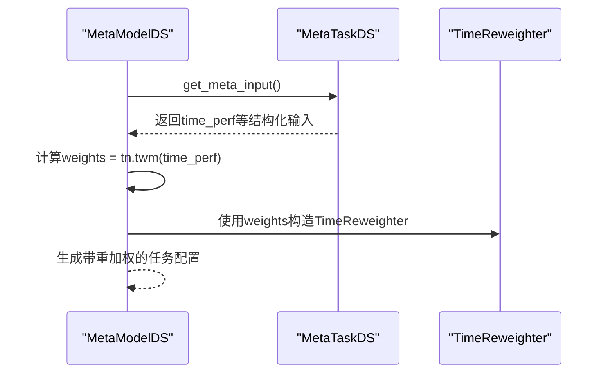
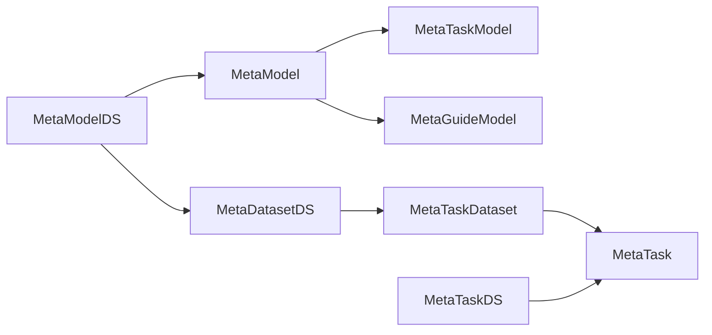

# 元学习模型接口

<cite>
**本文引用的文件**
- [model.py](file://qlib/model/meta/model.py)
- [dataset.py](file://qlib/model/meta/dataset.py)
- [task.py](file://qlib/model/meta/task.py)
- [__init__.py（模型元学习导出）](file://qlib/model/meta/__init__.py)
- [dataset.py（数据选择实现）](file://qlib/contrib/meta/data_selection/dataset.py)
- [model.py（数据选择实现）](file://qlib/contrib/meta/data_selection/model.py)
- [__init__.py（数据选择导出）](file://qlib/contrib/meta/data_selection/__init__.py)
</cite>

## 目录
1. [引言](#引言)
2. [项目结构](#项目结构)
3. [核心组件](#核心组件)
4. [架构总览](#架构总览)
5. [详细组件分析](#详细组件分析)
6. [依赖分析](#依赖分析)
7. [性能考虑](#性能考虑)
8. [故障排查指南](#故障排查指南)
9. [结论](#结论)
10. [附录：使用示例与最佳实践](#附录使用示例与最佳实践)

## 引言
本文件面向Qlib元学习（Meta-Learning）模型接口的专业API文档，系统阐述元模型选择、任务表示、模型适应等核心能力。文档聚焦以下目标：
- 解释MetaModel抽象接口及其两类子类职责：任务定义型（MetaTaskModel）与训练引导型（MetaGuideModel）
- 说明MetaDataset与MetaTask在元学习中的角色：数据集元信息管理、任务类型识别、性能预测与适配
- 展示基于历史经验的自动模型配置选择流程，覆盖特征工程、模型评估与参数优化策略
- 提供可直接落地的使用步骤与最佳实践，帮助读者快速集成到现有工作流中

## 项目结构
元学习相关代码主要分布在两个层次：
- 核心抽象层：位于qlib/model/meta，提供MetaModel、MetaTaskDataset、MetaTask等抽象与通用能力
- 具体实现层：位于qlib/contrib/meta/data_selection，提供数据选择场景下的MetaTaskDS/MetaDatasetDS/MetaModelDS等具体实现

图表来源
- [model.py:10-76](file://qlib/model/meta/model.py#L10-L76)
- [dataset.py:10-78](file://qlib/model/meta/dataset.py#L10-L78)
- [task.py:8-57](file://qlib/model/meta/task.py#L8-L57)
- [__init__.py（模型元学习导出）:4-7](file://qlib/model/meta/__init__.py#L4-L7)
- [dataset.py（数据选择实现）:121-416](file://qlib/contrib/meta/data_selection/dataset.py#L121-L416)
- [model.py（数据选择实现）:40-197](file://qlib/contrib/meta/data_selection/model.py#L40-L197)
- [__init__.py（数据选择导出）:4-7](file://qlib/contrib/meta/data_selection/__init__.py#L4-L7)

章节来源
- [model.py:10-76](file://qlib/model/meta/model.py#L10-L76)
- [dataset.py:10-78](file://qlib/model/meta/dataset.py#L10-L78)
- [task.py:8-57](file://qlib/model/meta/task.py#L8-L57)
- [__init__.py（模型元学习导出）:4-7](file://qlib/model/meta/__init__.py#L4-L7)
- [dataset.py（数据选择实现）:121-416](file://qlib/contrib/meta/data_selection/dataset.py#L121-L416)
- [model.py（数据选择实现）:40-197](file://qlib/contrib/meta/data_selection/model.py#L40-L197)
- [__init__.py（数据选择导出）:4-7](file://qlib/contrib/meta/data_selection/__init__.py#L4-L7)

## 核心组件
本节对元学习框架的关键抽象进行深入解析，帮助读者建立从概念到实现的完整认知。

- MetaModel（元模型）
  - 职责：指导模型学习过程，分为两类：
    - 任务定义型（MetaTaskModel）：通过准备任务来生成新的基础任务定义
    - 训练引导型（MetaGuideModel）：在基础模型训练过程中提供动态指导
  - 关键方法：fit、inference（返回用于指导学习的信息）

- MetaTaskDataset（元任务数据集）
  - 职责：维护元任务列表，按分段准备任务；支持跨数据集迁移
  - 关键方法：prepare_tasks（按“train/test”等分段返回MetaTask列表），_prepare_seg（子类实现）

- MetaTask（元任务）
  - 职责：封装单个元任务，包含原始任务与元信息；支持不同处理模式（全量、测试、迁移）
  - 关键方法：get_dataset（根据任务配置初始化Dataset）、get_meta_input（返回已处理的元输入）

章节来源
- [model.py:10-76](file://qlib/model/meta/model.py#L10-L76)
- [dataset.py:10-78](file://qlib/model/meta/dataset.py#L10-L78)
- [task.py:8-57](file://qlib/model/meta/task.py#L8-L57)

## 架构总览
下图展示了元学习框架的整体交互：MetaModel通过MetaTaskDataset准备任务，执行训练与推理，最终输出可用于基础模型训练的任务配置或重加权策略。

图表来源
- [dataset.py（数据选择实现）:386-416](file://qlib/contrib/meta/data_selection/dataset.py#L386-L416)
- [model.py（数据选择实现）:137-197](file://qlib/contrib/meta/data_selection/model.py#L137-L197)
- [task.py:46-53](file://qlib/model/meta/task.py#L46-L53)

## 详细组件分析

### 抽象层：MetaModel/MetaTaskDataset/MetaTask
- 类关系与职责
  - MetaModel：抽象基类，定义fit/inference规范
  - MetaTaskModel：面向任务定义的元模型，负责生成新任务
  - MetaGuideModel：面向训练过程引导的元模型
  - MetaTaskDataset：序列化可持久化的元数据集，负责prepare_tasks与分段准备
  - MetaTask：封装任务与元信息，支持多种处理模式

图表来源
- [model.py:10-76](file://qlib/model/meta/model.py#L10-L76)
- [dataset.py:10-78](file://qlib/model/meta/dataset.py#L10-L78)
- [task.py:8-57](file://qlib/model/meta/task.py#L8-L57)

章节来源
- [model.py:10-76](file://qlib/model/meta/model.py#L10-L76)
- [dataset.py:10-78](file://qlib/model/meta/dataset.py#L10-L78)
- [task.py:8-57](file://qlib/model/meta/task.py#L8-L57)

### 实现层：MetaTaskDS/MetaDatasetDS/MetaModelDS
- MetaTaskDS（数据选择元任务）
  - 功能：将元信息（如历史滚动期的样本表现矩阵）转换为可用于训练的结构化输入，同时在全量模式下准备训练/测试集与时间归属矩阵
  - 处理流程要点：
    - 归一化与填充策略（支持按最大值填充、分段填充、零填充等）
    - 构造time_belong矩阵，标记每个样本属于哪个历史滚动窗口
    - 将输入转为张量以供神经网络模块使用

- MetaDatasetDS（数据选择元数据集）
  - 功能：批量构建MetaTaskDS列表，支持按比例或截止时间划分训练/测试集
  - 关键点：_prepare_seg支持float比例与字符串截止时间两种方式

- MetaModelDS（数据选择元模型）
  - 功能：基于PredNet学习时间维度权重，实现数据选择与重加权
  - 训练流程：
    - 初始化网络与优化器
    - 在每个epoch中遍历任务，前向计算、损失（MSE或IC Loss）、反传
    - 记录指标并保存模型
  - 推理流程：对测试任务计算时间权重，生成TimeReweighter并注入到任务配置

图表来源
- [model.py（数据选择实现）:137-197](file://qlib/contrib/meta/data_selection/model.py#L137-L197)
- [dataset.py（数据选择实现）:386-416](file://qlib/contrib/meta/data_selection/dataset.py#L386-L416)

章节来源
- [dataset.py（数据选择实现）:121-234](file://qlib/contrib/meta/data_selection/dataset.py#L121-L234)
- [dataset.py（数据选择实现）:236-323](file://qlib/contrib/meta/data_selection/dataset.py#L236-L323)
- [dataset.py（数据选择实现）:386-416](file://qlib/contrib/meta/data_selection/dataset.py#L386-L416)
- [model.py（数据选择实现）:40-197](file://qlib/contrib/meta/data_selection/model.py#L40-L197)

### 时间重加权与任务适配
- TimeReweighter
  - 功能：将学习到的时间权重映射到样本索引区间，形成逐样本权重序列
  - 作用：在基础模型训练时对不同时期的数据施加不同权重，提升泛化与稳定性

- 任务适配流程
  - 在推理阶段，MetaModelDS对每个测试MetaTask调用_get_meta_input，得到time_perf后计算权重
  - 将权重序列封装为TimeReweighter并写入任务配置，供后续训练流程使用

图表来源
- [model.py（数据选择实现）:183-190](file://qlib/contrib/meta/data_selection/model.py#L183-L190)
- [model.py（数据选择实现）:27-38](file://qlib/contrib/meta/data_selection/model.py#L27-L38)

章节来源
- [model.py（数据选择实现）:27-38](file://qlib/contrib/meta/data_selection/model.py#L27-L38)
- [model.py（数据选择实现）:183-190](file://qlib/contrib/meta/data_selection/model.py#L183-L190)

## 依赖分析
- 抽象层内部耦合度低，职责清晰：MetaModel定义接口，MetaTaskDataset负责任务准备，MetaTask封装任务与元信息
- 实现层对抽象层松耦合：MetaTaskDS/MetaDatasetDS/MetaModelDS分别扩展对应抽象，保持替换性
- 内部数据依赖：MetaTaskDS依赖DatasetH与数据准备流程；MetaModelDS依赖PredNet与ICLoss；MetaDatasetDS依赖任务模板与滚动生成器

图表来源
- [model.py:10-76](file://qlib/model/meta/model.py#L10-L76)
- [dataset.py:10-78](file://qlib/model/meta/dataset.py#L10-L78)
- [task.py:8-57](file://qlib/model/meta/task.py#L8-L57)
- [dataset.py（数据选择实现）:236-323](file://qlib/contrib/meta/data_selection/dataset.py#L236-L323)
- [model.py（数据选择实现）:40-197](file://qlib/contrib/meta/data_selection/model.py#L40-L197)

章节来源
- [model.py:10-76](file://qlib/model/meta/model.py#L10-L76)
- [dataset.py:10-78](file://qlib/model/meta/dataset.py#L10-L78)
- [task.py:8-57](file://qlib/model/meta/task.py#L8-L57)
- [dataset.py（数据选择实现）:236-323](file://qlib/contrib/meta/data_selection/dataset.py#L236-L323)
- [model.py（数据选择实现）:40-197](file://qlib/contrib/meta/data_selection/model.py#L40-L197)

## 性能考虑
- 数据准备阶段的开销控制
  - MetaTaskDS在全量模式下会进行大量数据准备与缺失值处理，建议合理设置fill_method与校验丢样本比例，避免极端过滤导致数据稀疏
  - 对于大规模滚动任务，优先采用并行与分块处理策略，减少内存峰值
- 模型训练阶段的效率
  - MetaModelDS在每个epoch遍历任务，建议控制任务数量与批次大小，避免过长的训练循环
  - 损失函数选择（MSE/IC Loss）与skip阈值影响收敛速度与稳定性，应结合任务特性调整
- 指标记录与日志
  - 训练过程中记录loss与IC等指标，便于监控收敛与过拟合风险

## 故障排查指南
- “大多数样本被丢弃”
  - 现象：初始化MetaTaskDS时报错，提示测试集中样本比例过低
  - 原因：数据预处理后缺失过多或分段边界不合理
  - 处置：检查数据质量、调整segments或fill_method，确保测试集规模足够
- “某些交易日期过少”
  - 现象：断言失败，提示某段交易日期少于阈值
  - 原因：滚动窗口或分段设置不当
  - 处置：扩大训练窗口或调整step/hist_step_n
- “NaN损失”
  - 现象：训练中出现NaN
  - 原因：损失计算异常或梯度爆炸
  - 处置：降低学习率、检查IC Loss阈值、增加正则或裁剪

章节来源
- [dataset.py（数据选择实现）:155-166](file://qlib/contrib/meta/data_selection/dataset.py#L155-L166)
- [model.py（数据选择实现）:106-107](file://qlib/contrib/meta/data_selection/model.py#L106-L107)

## 结论
Qlib的元学习接口通过MetaModel/MetaTaskDataset/MetaTask抽象，提供了可扩展的任务级元学习框架。在数据选择场景中，MetaModelDS能够基于历史滚动期的样本表现矩阵学习时间维度权重，实现自动化的数据选择与重加权，从而提升基础模型的泛化性能。该接口具备良好的模块化与可替换性，适合进一步拓展到其他任务类型与评估指标。

## 附录：使用示例与最佳实践
- 快速上手步骤
  - 准备任务模板与实验名称，构建MetaDatasetDS
  - 初始化MetaModelDS并调用fit，完成元学习训练
  - 使用inference对测试集生成带重加权的任务配置
  - 将生成的任务配置交由基础训练流程执行
- 特征工程与评估
  - 元信息归一化与填充策略需与数据频率匹配（如日频建议使用最大值填充）
  - 损失函数建议优先尝试IC Loss，必要时辅以MSE
- 参数优化策略
  - 学习率、epoch数、裁剪方法与权重衰减需结合任务规模与波动性调整
  - 通过指标日志观察IC与loss变化，防止过拟合

章节来源
- [model.py（数据选择实现）:137-197](file://qlib/contrib/meta/data_selection/model.py#L137-L197)
- [dataset.py（数据选择实现）:386-416](file://qlib/contrib/meta/data_selection/dataset.py#L386-L416)