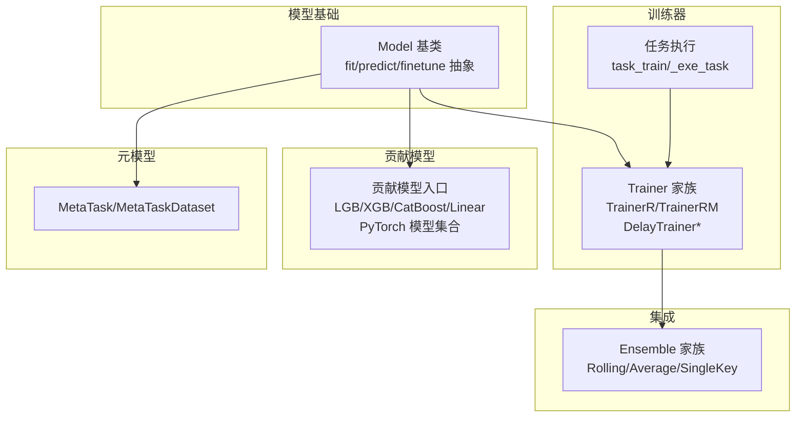
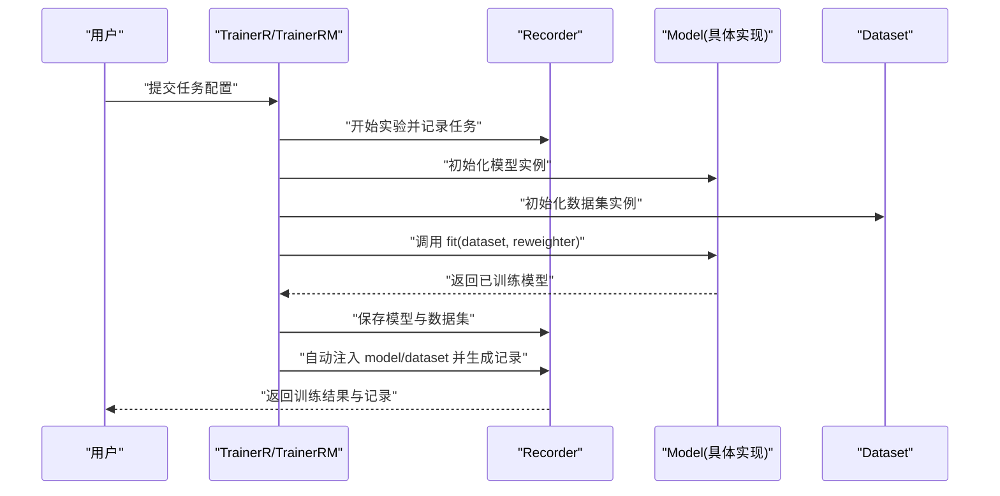
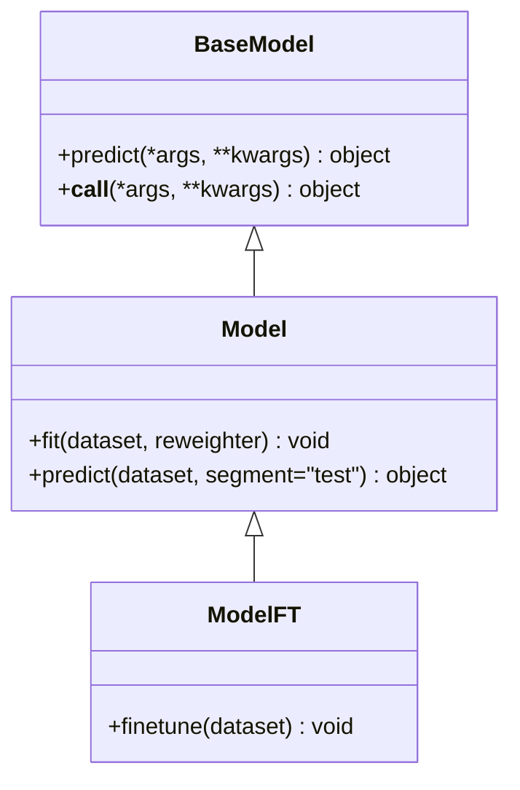
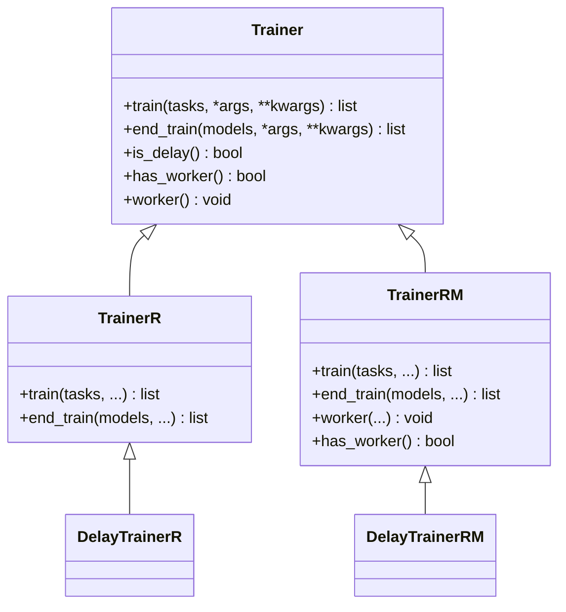
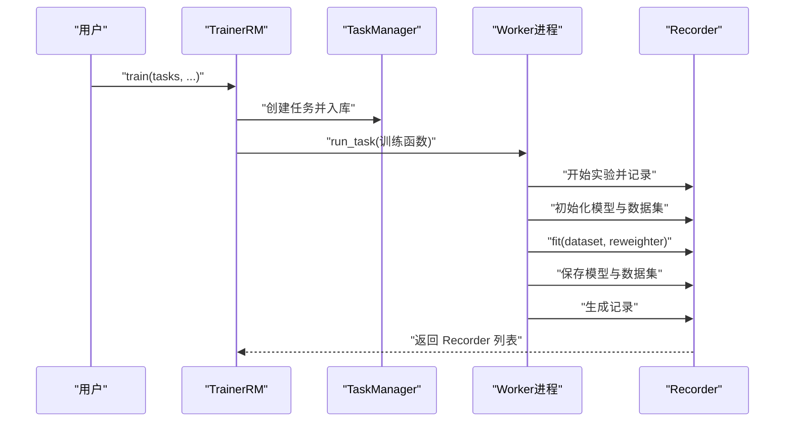
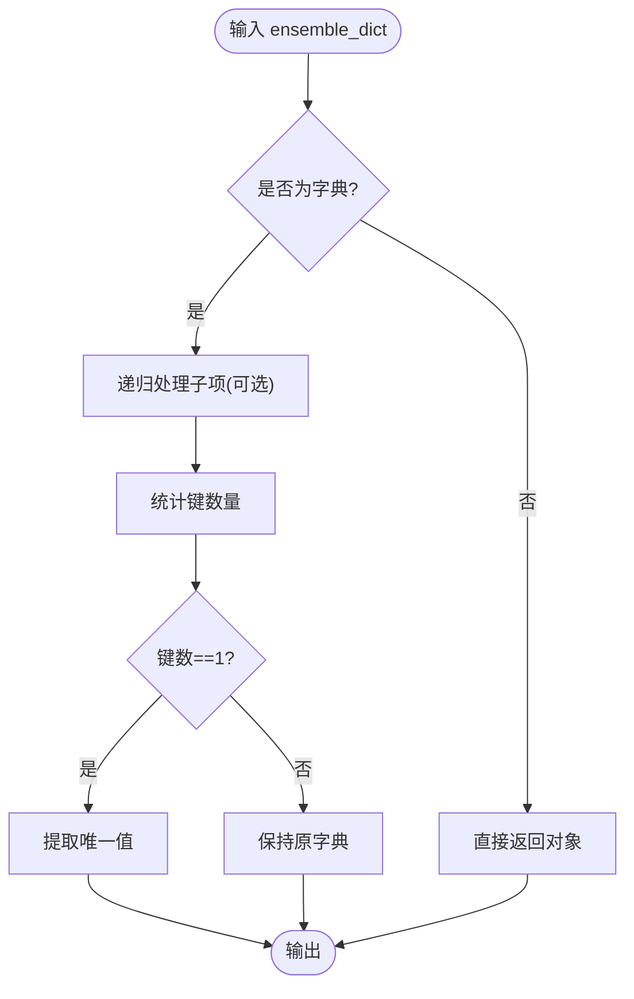
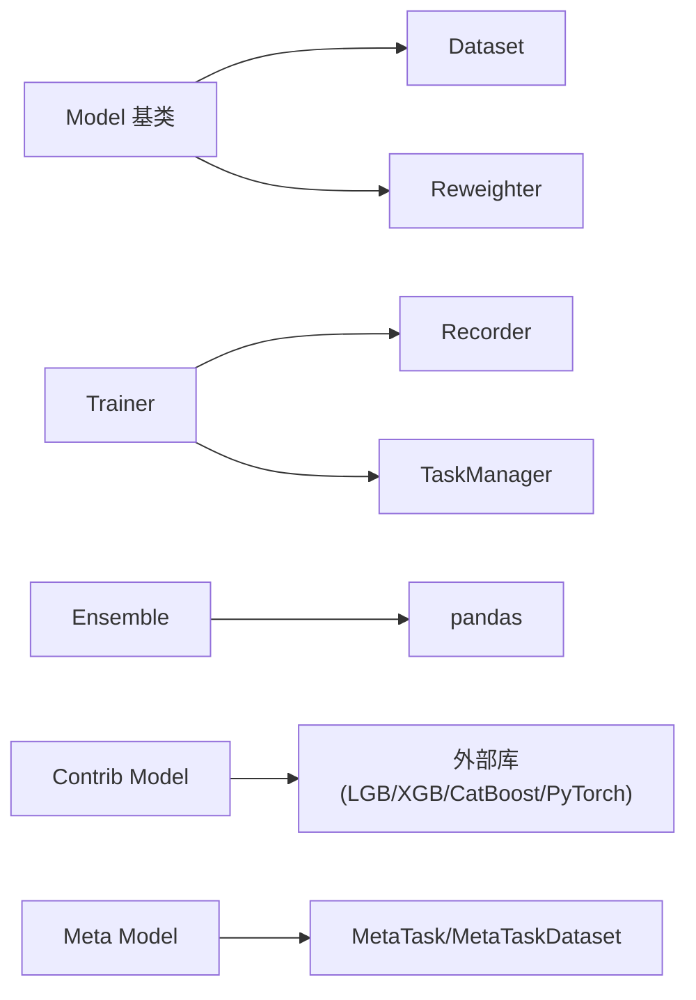

# 模型API

<cite>
**本文引用的文件**
- [qlib/model/base.py](file://qlib/model/base.py)
- [qlib/model/trainer.py](file://qlib/model/trainer.py)
- [qlib/model/ens/ensemble.py](file://qlib/model/ens/ensemble.py)
- [qlib/contrib/model/__init__.py](file://qlib/contrib/model/__init__.py)
- [qlib/model/meta/__init__.py](file://qlib/model/meta/__init__.py)
</cite>

## 目录
1. [简介](#简介)
2. [项目结构](#项目结构)
3. [核心组件](#核心组件)
4. [架构总览](#架构总览)
5. [详细组件分析](#详细组件分析)
6. [依赖分析](#依赖分析)
7. [性能考虑](#性能考虑)
8. [故障排查指南](#故障排查指南)
9. [结论](#结论)
10. [附录](#附录)

## 简介
本文件为 Qlib 模型API的完整参考文档，覆盖以下主题：
- 模型基础接口（Model）：训练、预测、微调等核心能力
- 训练器（Trainer）API：训练配置、训练回调、训练状态管理与并行化
- 模型集成（Ensemble）API：滚动合并、平均融合、单键提取等策略
- 贡献模型（Contrib Model）API：LightGBM、XGBoost、线性回归、CatBoost以及多种PyTorch模型
- 元模型（Meta Model）API：任务与数据集抽象，支持动态模型选择与自适应学习
- 参数说明、返回值类型、异常处理与使用示例路径，帮助开发者正确使用各模型接口

## 项目结构
围绕模型API的关键模块分布如下：
- 基础模型接口：位于 qlib/model/base.py
- 训练器与训练流程：位于 qlib/model/trainer.py
- 集成策略：位于 qlib/model/ens/ensemble.py
- 贡献模型入口：位于 qlib/contrib/model/__init__.py
- 元模型任务与数据集：位于 qlib/model/meta/__init__.py

**图表来源**
- [qlib/model/base.py:22-111](file://qlib/model/base.py#L22-L111)
- [qlib/model/trainer.py:131-620](file://qlib/model/trainer.py#L131-L620)
- [qlib/model/ens/ensemble.py:14-133](file://qlib/model/ens/ensemble.py#L14-L133)
- [qlib/contrib/model/__init__.py:1-44](file://qlib/contrib/model/__init__.py#L1-L44)
- [qlib/model/meta/__init__.py:1-8](file://qlib/model/meta/__init__.py#L1-L8)

**章节来源**
- [qlib/model/base.py:1-111](file://qlib/model/base.py#L1-L111)
- [qlib/model/trainer.py:1-620](file://qlib/model/trainer.py#L1-L620)
- [qlib/model/ens/ensemble.py:1-133](file://qlib/model/ens/ensemble.py#L1-L133)
- [qlib/contrib/model/__init__.py:1-44](file://qlib/contrib/model/__init__.py#L1-L44)
- [qlib/model/meta/__init__.py:1-8](file://qlib/model/meta/__init__.py#L1-L8)

## 核心组件
本节对模型基础接口、训练器、集成策略、贡献模型与元模型进行要点梳理。

- 模型基础接口（Model）
  - 抽象基类：定义可序列化的模型接口，包含预测方法；支持以函数式调用方式使用
  - 可学习模型：定义 fit/dataset/reweighter 的训练接口；定义 predict(dataset, segment) 进行预测
  - 微调模型：定义 finetune(dataset) 接口，支持在已有模型基础上继续训练
- 训练器（Trainer）
  - Trainer 抽象基类：统一训练生命周期（train/end_train），支持延迟训练与并行工作
  - TrainerR：基于 Recorder 的顺序训练，支持子进程执行以释放内存
  - TrainerRM：基于任务管理器的任务池训练，支持多进程/多机并行
  - DelayTrainer*：延迟训练实现，先保存任务信息，后在合适时机完成真实拟合
- 集成（Ensemble）
  - Ensemble 抽象：定义合并策略的统一接口
  - RollingEnsemble：按时间窗口拼接滚动结果
  - AverageEnsemble：对同形DataFrame按日期分组标准化后聚合
  - SingleKeyEnsemble：当字典仅有一个键时提取其值，便于输出更简洁
- 贡献模型（Contrib Model）
  - 提供 LightGBM、XGBoost、CatBoost、线性回归等经典模型
  - 提供多种 PyTorch 实现（如 LSTM、GRU、TCN、GATs、TabNet、SFM、ADD 等）
  - 通过入口文件统一导出，缺失依赖时会打印提示但不中断运行
- 元模型（Meta Model）
  - 提供 MetaTask 与 MetaTaskDataset，用于构建元任务与元数据集，支撑动态模型选择与自适应学习

**章节来源**
- [qlib/model/base.py:10-111](file://qlib/model/base.py#L10-L111)
- [qlib/model/trainer.py:131-620](file://qlib/model/trainer.py#L131-L620)
- [qlib/model/ens/ensemble.py:14-133](file://qlib/model/ens/ensemble.py#L14-L133)
- [qlib/contrib/model/__init__.py:1-44](file://qlib/contrib/model/__init__.py#L1-L44)
- [qlib/model/meta/__init__.py:1-8](file://qlib/model/meta/__init__.py#L1-L8)

## 架构总览
下图展示从“任务配置”到“模型训练与预测”的整体流程，以及训练器与任务管理的关系。

**图表来源**
- [qlib/model/trainer.py:42-72](file://qlib/model/trainer.py#L42-L72)
- [qlib/model/trainer.py:108-129](file://qlib/model/trainer.py#L108-L129)
- [qlib/model/base.py:25-78](file://qlib/model/base.py#L25-L78)

## 详细组件分析

### 模型基础接口（Model）
- 类层次
  - BaseModel：可序列化抽象基类，定义 predict 抽象方法，并支持函数式调用
  - Model：可学习模型，定义 fit(dataset, reweighter) 与 predict(dataset, segment)
  - ModelFT：可微调模型，定义 finetune(dataset)

- 关键点
  - fit：接收 Dataset 与可选重采样器，完成模型训练；训练得到的属性名不应以“_”开头以便持久化
  - predict：根据 Dataset 与 segment 返回预测结果（如 pandas.Series）
  - finetune：在已有模型基础上继续训练，常用于在线场景或增量学习

**图表来源**
- [qlib/model/base.py:10-111](file://qlib/model/base.py#L10-L111)

**章节来源**
- [qlib/model/base.py:22-111](file://qlib/model/base.py#L22-L111)

### 训练器（Trainer）
- 类层次与职责
  - Trainer：抽象基类，定义 train/end_train 生命周期
  - TrainerR：顺序训练，基于 Recorder；支持子进程执行以释放内存
  - TrainerRM：基于任务管理器的任务池训练，支持多进程/多机并行
  - DelayTrainerR/DelayTrainerRM：延迟训练，先保存任务信息，后在合适时机完成真实拟合

- 关键流程
  - 任务执行：task_train/_exe_task 将任务拆解为“记录任务配置—初始化模型与数据集—训练—保存模型与数据集—生成记录”
  - 状态管理：通过 Recorder 标签维护训练状态（开始/结束），便于追踪与恢复
  - 并行化：TrainerRM 支持任务池与多进程执行；DelayTrainer* 支持跨节点的准备与执行分离

**图表来源**
- [qlib/model/trainer.py:341-489](file://qlib/model/trainer.py#L341-L489)
- [qlib/model/trainer.py:491-620](file://qlib/model/trainer.py#L491-L620)

**章节来源**
- [qlib/model/trainer.py:131-620](file://qlib/model/trainer.py#L131-L620)

### 集成（Ensemble）
- Ensemble 抽象：定义统一的合并接口
- RollingEnsemble：按时间最早索引排序拼接滚动结果，去重并排序
- AverageEnsemble：扁平化嵌套字典，按日期分组标准化后取均值
- SingleKeyEnsemble：单键字典递归提取值，使输出更简洁

**图表来源**
- [qlib/model/ens/ensemble.py:32-63](file://qlib/model/ens/ensemble.py#L32-L63)

**章节来源**
- [qlib/model/ens/ensemble.py:14-133](file://qlib/model/ens/ensemble.py#L14-L133)

### 贡献模型（Contrib Model）
- 导入策略：按需导入各类模型，缺失依赖时打印提示但不抛错
- 主要类别：
  - 传统树模型：LightGBM（LGBModel）、XGBoost（XGBModel）、CatBoost（CatBoostModel）
  - 线性模型：LinearModel
  - PyTorch 模型：ALSTM、GATs、GRU、LSTM、DNNModelPytorch、TabnetModel、SFM_Model、TCN、ADD
- 使用建议：通过配置文件或工作流加载对应模型类，确保环境满足依赖要求

**章节来源**
- [qlib/contrib/model/__init__.py:1-44](file://qlib/contrib/model/__init__.py#L1-L44)

### 元模型（Meta Model）
- 导出内容：MetaTask、MetaTaskDataset
- 应用场景：构建元任务与元数据集，支持动态模型选择与自适应学习

**章节来源**
- [qlib/model/meta/__init__.py:1-8](file://qlib/model/meta/__init__.py#L1-L8)

## 依赖分析
- 组件耦合
  - Model 与 Dataset/Reweighter 强耦合，训练与预测均依赖数据结构
  - Trainer 依赖 Recorder 与任务管理器，负责训练生命周期与状态管理
  - Ensemble 依赖 pandas DataFrame 的时间索引与分组操作
  - Contrib Model 作为外部库适配层，通过入口文件统一导出
  - Meta Model 为上层应用提供任务与数据集抽象
- 外部依赖
  - 数据与任务管理：依赖 qlib.data、qlib.workflow
  - 日志与工具：依赖 qlib.log、qlib.utils
  - 可选依赖：LightGBM、XGBoost、CatBoost、PyTorch 等

**图表来源**
- [qlib/model/base.py:25-78](file://qlib/model/base.py#L25-L78)
- [qlib/model/trainer.py:19-33](file://qlib/model/trainer.py#L19-L33)
- [qlib/model/ens/ensemble.py:8-11](file://qlib/model/ens/ensemble.py#L8-L11)
- [qlib/contrib/model/__init__.py:3-41](file://qlib/contrib/model/__init__.py#L3-L41)
- [qlib/model/meta/__init__.py:4-7](file://qlib/model/meta/__init__.py#L4-L7)

**章节来源**
- [qlib/model/base.py:1-111](file://qlib/model/base.py#L1-L111)
- [qlib/model/trainer.py:1-620](file://qlib/model/trainer.py#L1-L620)
- [qlib/model/ens/ensemble.py:1-133](file://qlib/model/ens/ensemble.py#L1-L133)
- [qlib/contrib/model/__init__.py:1-44](file://qlib/contrib/model/__init__.py#L1-L44)
- [qlib/model/meta/__init__.py:1-8](file://qlib/model/meta/__init__.py#L1-L8)

## 性能考虑
- 内存管理
  - TrainerR 支持在子进程中执行训练以强制释放内存，适合大规模任务或资源受限环境
- 并行化
  - TrainerRM 通过任务池与多进程/多机并行提升吞吐；DelayTrainer* 支持跨节点的准备与执行分离
- 数据处理
  - Ensemble 的 RollingEnsemble 与 AverageEnsemble 对时间索引与分组操作有较高要求，建议确保数据索引规范
- 依赖安装
  - 缺失可选依赖不会导致系统崩溃，但会影响相应模型可用性，建议按需安装

[本节为通用指导，无需特定文件来源]

## 故障排查指南
- 训练状态异常
  - 现象：Recorder 未标记训练完成
  - 排查：确认 Trainer 是否正确设置状态标签；检查 DelayTrainer* 的“准备/执行”阶段是否匹配
- 模型无法持久化
  - 现象：训练完成后属性名以“_”开头导致无法保存
  - 排查：遵循 Model.fit 文档注释中关于属性命名的要求
- 依赖缺失
  - 现象：导入贡献模型时报模块未找到
  - 排查：查看入口文件中的异常捕获与提示信息，按需安装对应依赖
- 数据格式问题
  - 现象：RollingEnsemble 或 AverageEnsemble 报错
  - 排查：确保输入为 DataFrame 且包含“datetime”索引；避免嵌套结构导致的扁平化错误

**章节来源**
- [qlib/model/base.py:29-33](file://qlib/model/base.py#L29-L33)
- [qlib/contrib/model/__init__.py:5-25](file://qlib/contrib/model/__init__.py#L5-L25)
- [qlib/model/ens/ensemble.py:65-133](file://qlib/model/ens/ensemble.py#L65-L133)

## 结论
Qlib 的模型API以清晰的抽象与可扩展的设计，覆盖了从基础模型接口、训练器生命周期管理、模型集成策略，到贡献模型与元模型的全链路能力。通过 Recorder 与任务管理器的配合，实现了可追踪、可并行、可恢复的训练体系；通过 Ensemble 与 Meta Model，进一步增强了模型融合与自适应能力。开发者可依据本文档快速定位接口、理解参数与返回值，并结合示例路径完成实际应用。

[本节为总结性内容，无需特定文件来源]

## 附录
- 使用示例路径（以路径代替代码片段）
  - 训练与预测流程示例：[任务执行与记录生成:42-72](file://qlib/model/trainer.py#L42-L72)
  - 训练器顺序训练示例：[TrainerR 训练与状态标记:243-291](file://qlib/model/trainer.py#L243-L291)
  - 训练器并行训练示例：[TrainerRM 训练与工作进程:384-489](file://qlib/model/trainer.py#L384-L489)
  - 集成策略示例：[RollingEnsemble 合并滚动结果:80-89](file://qlib/model/ens/ensemble.py#L80-L89)、[AverageEnsemble 标准化聚合:107-133](file://qlib/model/ens/ensemble.py#L107-L133)
  - 贡献模型入口：[统一导出与可选依赖处理:1-44](file://qlib/contrib/model/__init__.py#L1-L44)
  - 元模型任务与数据集：[MetaTask/MetaTaskDataset 导出:1-8](file://qlib/model/meta/__init__.py#L1-L8)

[本节为补充说明，无需特定文件来源]