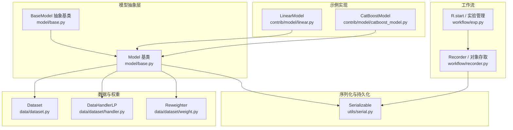
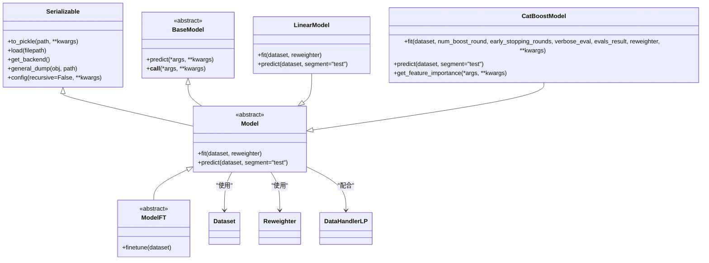
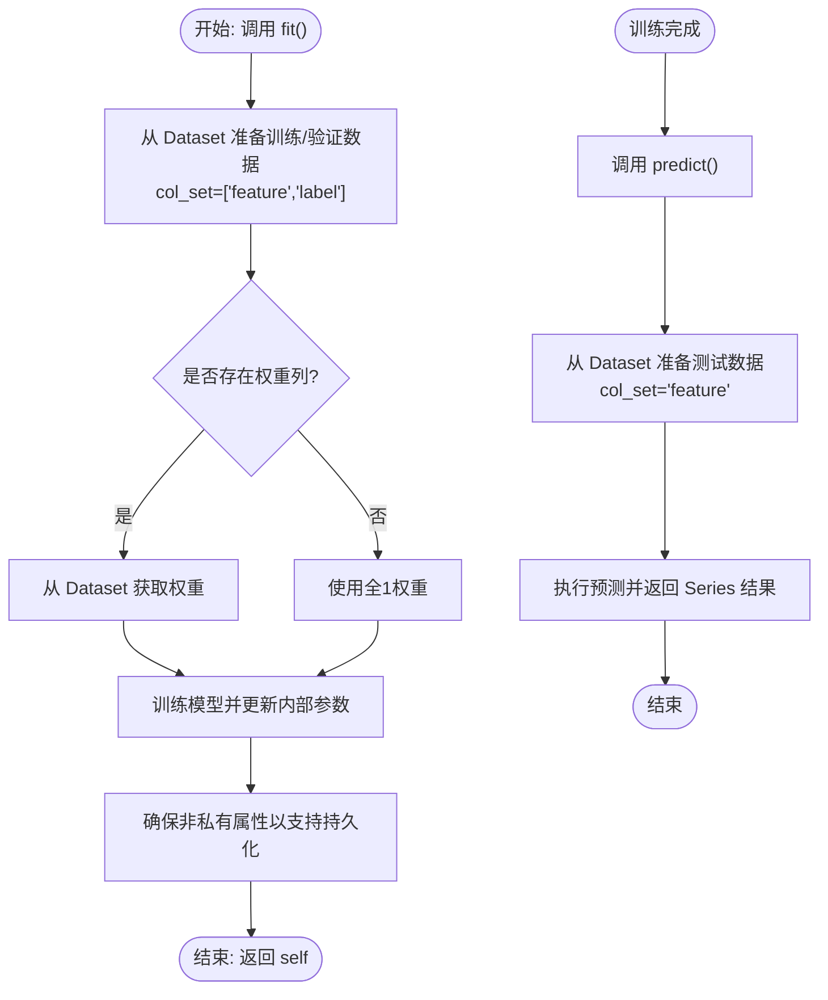
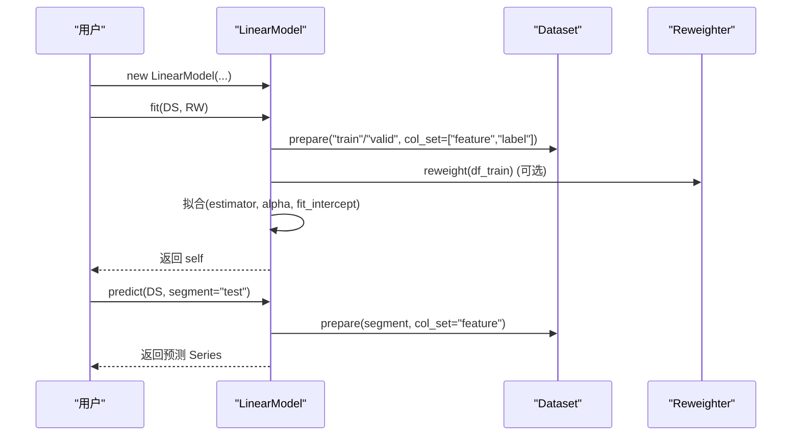
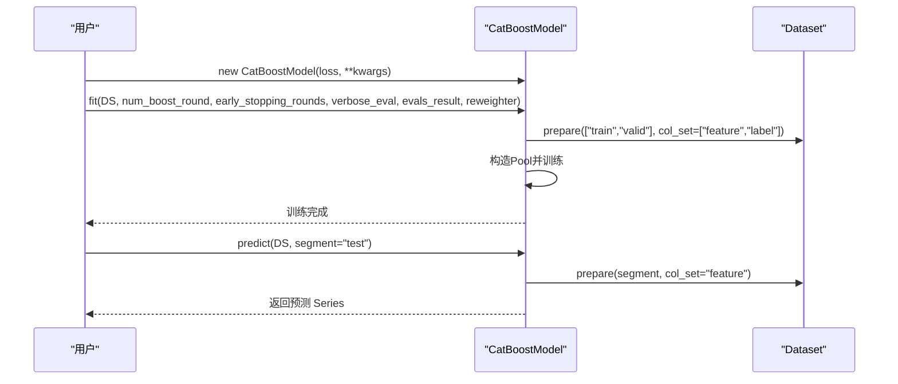
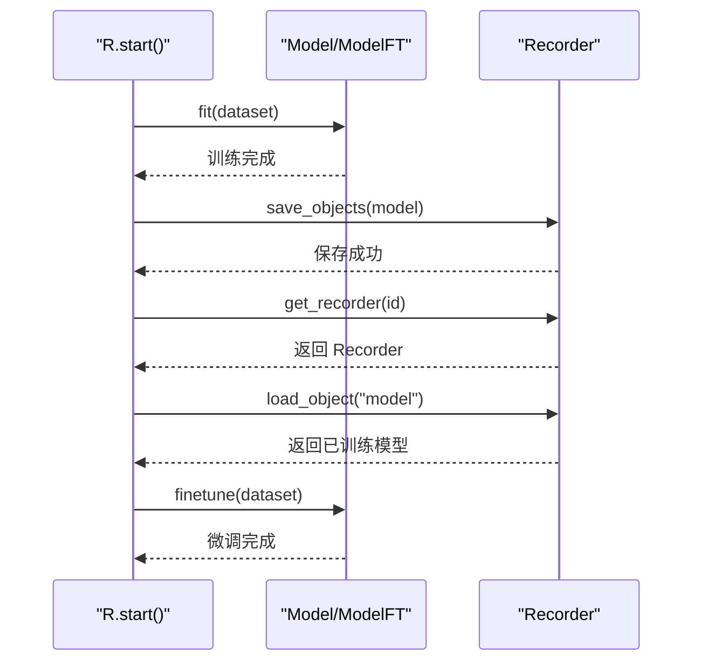
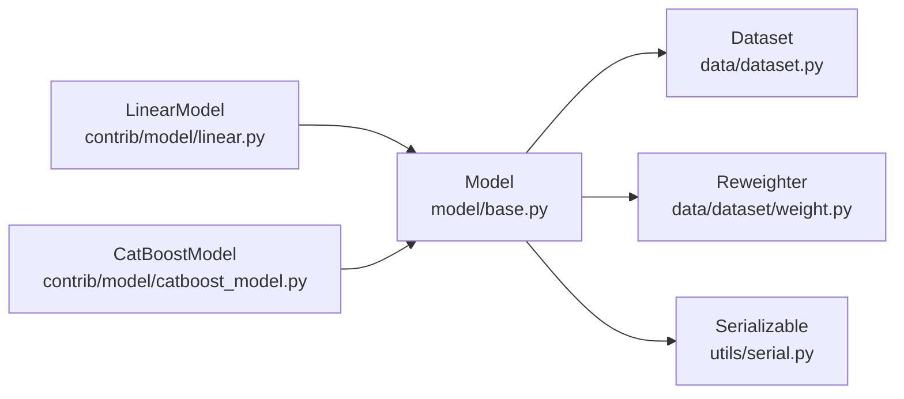

# 模型基础接口

<cite>
**本文引用的文件**
- [model/base.py](file://qlib/model/base.py)
- [utils/serial.py](file://qlib/utils/serial.py)
- [utils/exceptions.py](file://qlib/utils/exceptions.py)
- [contrib/model/linear.py](file://qlib/contrib/model/linear.py)
- [contrib/model/catboost_model.py](file://qlib/contrib/model/catboost_model.py)
- [data/dataset.py](file://qlib/data/dataset.py)
- [data/dataset/handler.py](file://qlib/data/dataset/handler.py)
- [data/dataset/weight.py](file://qlib/data/dataset/weight.py)
- [workflow/exp.py](file://qlib/workflow/exp.py)
- [workflow/recorder.py](file://qlib/workflow/recorder.py)
</cite>

## 目录
1. [引言](#引言)
2. [项目结构](#项目结构)
3. [核心组件](#核心组件)
4. [架构总览](#架构总览)
5. [详细组件分析](#详细组件分析)
6. [依赖分析](#依赖分析)
7. [性能考虑](#性能考虑)
8. [故障排查指南](#故障排查指南)
9. [结论](#结论)
10. [附录](#附录)

## 引言
本文件面向Qlib模型基础接口，系统性梳理Model基类的设计模式与抽象接口，明确fit()、predict()、score()等核心方法的职责边界、参数约定与返回规范；阐述模型初始化参数、数据输入格式要求、输出格式规范；记录模型保存与加载机制（含pickle序列化与持久化）；并提供可直接参考的使用示例路径与最佳实践，帮助开发者快速上手并正确扩展自定义模型。

## 项目结构
围绕“模型基础接口”的相关代码主要分布在以下模块：
- 模型抽象层：model/base.py 定义了Model基类及可插拔的可调参模型接口
- 序列化与持久化：utils/serial.py 提供统一的pickle/dill序列化策略
- 数据集与处理器：data/dataset.py、data/dataset/handler.py、data/dataset/weight.py 提供数据准备与权重重采样
- 工作流与记录器：workflow/exp.py、workflow/recorder.py 支持实验记录与对象存取
- 典型实现示例：contrib/model/linear.py、contrib/model/catboost_model.py 展示如何继承Model并实现具体训练与预测逻辑

**图示来源**
- [model/base.py:10-111](file://qlib/model/base.py#L10-L111)
- [utils/serial.py:11-190](file://qlib/utils/serial.py#L11-L190)
- [data/dataset.py](file://qlib/data/dataset.py)
- [data/dataset/handler.py](file://qlib/data/dataset/handler.py)
- [data/dataset/weight.py](file://qlib/data/dataset/weight.py)
- [workflow/exp.py](file://qlib/workflow/exp.py)
- [workflow/recorder.py](file://qlib/workflow/recorder.py)
- [contrib/model/linear.py:17-114](file://qlib/contrib/model/linear.py#L17-L114)
- [contrib/model/catboost_model.py:17-101](file://qlib/contrib/model/catboost_model.py#L17-L101)

**章节来源**
- [model/base.py:10-111](file://qlib/model/base.py#L10-L111)
- [utils/serial.py:11-190](file://qlib/utils/serial.py#L11-L190)

## 核心组件
本节聚焦Model基类及其抽象接口，明确各方法的职责、参数与返回值约定，并给出数据与权重的使用建议。

- 抽象基类 BaseModel
  - 职责：定义可调用的预测接口，使模型实例像函数一样被调用
  - 关键点：predict()为抽象方法；__call__()默认委托到predict()

- 可学习模型 Model
  - fit(dataset: Dataset, reweighter: Reweighter)：从数据集中学习模型参数
    - 参数说明
      - dataset: 数据集对象，负责生成训练/验证/测试阶段的数据
      - reweighter: 权重重采样器，用于样本权重的计算与应用
    - 返回：通常返回self，便于链式调用
    - 注意事项
      - 训练完成后，模型属性名不应以“_”开头，以便持久化到磁盘
      - 示例中展示了如何从dataset.prepare()提取特征、标签与权重
  - predict(dataset: Dataset, segment: Union[Text, slice]="test") -> object：基于已训练模型进行预测
    - 参数说明
      - dataset: 预测所用的数据集
      - segment: 数据片段标识或切片，默认为“test”
    - 返回：返回特定类型的结果（如pandas.Series），索引与时间对齐
  - score(...)：在当前基类中未定义，常见于回归/分类模型中作为评估指标的便捷入口，可在子类中按需实现

- 可微调模型 ModelFT
  - finetune(dataset: Dataset)：在已有模型基础上进行微调
  - 典型流程：先fit得到初始模型并保存；再通过Recorder加载后调用finetune继续训练

- 数据输入格式与权重
  - 特征与标签：通过dataset.prepare([...], col_set=["feature","label"])获取
  - 权重：通过dataset.prepare([...], col_set=["weight"])获取；若不存在则默认全1权重
  - 处理器常量：DataHandlerLP.DK_L/DK_I用于区分标签与实例级数据键

- 输出格式规范
  - predict()返回结果通常为pandas.Series，包含预测值与对应索引（时间/样本）
  - 若存在多维标签，部分模型（如CatBoost）要求1D标签数组

**章节来源**
- [model/base.py:22-111](file://qlib/model/base.py#L22-L111)
- [contrib/model/linear.py:58-114](file://qlib/contrib/model/linear.py#L58-L114)
- [contrib/model/catboost_model.py:28-85](file://qlib/contrib/model/catboost_model.py#L28-L85)
- [data/dataset.py](file://qlib/data/dataset.py)
- [data/dataset/handler.py](file://qlib/data/dataset/handler.py)
- [data/dataset/weight.py](file://qlib/data/dataset/weight.py)

## 架构总览
下图展示Model基类与数据、序列化、工作流之间的交互关系：

**图示来源**
- [model/base.py:10-111](file://qlib/model/base.py#L10-L111)
- [utils/serial.py:11-190](file://qlib/utils/serial.py#L11-L190)
- [contrib/model/linear.py:17-114](file://qlib/contrib/model/linear.py#L17-L114)
- [contrib/model/catboost_model.py:17-101](file://qlib/contrib/model/catboost_model.py#L17-L101)

## 详细组件分析

### Model基类与抽象接口
- 设计要点
  - 通过abc.abstractmethod确保子类必须实现predict()
  - __call__()提供函数式调用语法糖，简化使用
  - fit()与predict()均接收Dataset与可选的Reweighter，保证训练与预测的一致性
- 数据准备建议
  - 使用dataset.prepare()按需提取训练/验证/测试数据
  - 通过DataHandlerLP.DK_L/DK_I区分标签与实例级数据键
  - 权重缺失时默认全1权重，避免影响训练流程

**图示来源**
- [model/base.py:25-78](file://qlib/model/base.py#L25-L78)
- [contrib/model/linear.py:58-84](file://qlib/contrib/model/linear.py#L58-L84)
- [contrib/model/catboost_model.py:38-74](file://qlib/contrib/model/catboost_model.py#L38-L74)

**章节来源**
- [model/base.py:22-78](file://qlib/model/base.py#L22-L78)

### 线性模型 LinearModel 实现
- 初始化参数
  - estimator: 选择回归求解器（ols/nnls/ridge/lasso）
  - alpha: 正则化系数（仅在ridge/lasso有效）
  - fit_intercept: 是否拟合截距
  - include_valid: 是否合并验证集参与训练
- 训练流程
  - 从dataset.prepare()获取训练/验证数据
  - 可选合并验证集
  - 过滤空数据与缺失值
  - 应用重采样权重（若提供）
  - 调用scikit-learn或scipy优化器拟合
- 预测流程
  - 检查是否已训练
  - 从dataset.prepare()获取测试特征
  - 返回线性组合+截距的Series结果

**图示来源**
- [contrib/model/linear.py:33-114](file://qlib/contrib/model/linear.py#L33-L114)

**章节来源**
- [contrib/model/linear.py:17-114](file://qlib/contrib/model/linear.py#L17-L114)

### CatBoost 模型实现
- 初始化参数
  - loss: 损失函数（如RMSE/Logloss）
  - 其他参数透传至CatBoost构造函数
- 训练流程
  - 从dataset.prepare()获取训练/验证特征与标签
  - 将多维标签压缩为1D（CatBoost不支持多标签）
  - 构造Pool并设置迭代次数、早停、设备类型等
  - 使用eval_set与use_best_model进行验证集评估
- 预测流程
  - 检查模型是否已训练
  - 从dataset.prepare()获取测试特征
  - 返回预测结果Series

**图示来源**
- [contrib/model/catboost_model.py:20-85](file://qlib/contrib/model/catboost_model.py#L20-L85)

**章节来源**
- [contrib/model/catboost_model.py:17-101](file://qlib/contrib/model/catboost_model.py#L17-L101)

### 可微调模型 ModelFT
- 设计目的：在已有模型基础上进行增量训练（微调）
- 典型流程
  - 先通过R.start()进行初始训练并保存模型
  - 再次启动新实验，通过Recorder加载先前模型
  - 调用model.finetune()继续训练

**图示来源**
- [model/base.py:81-111](file://qlib/model/base.py#L81-L111)
- [workflow/exp.py](file://qlib/workflow/exp.py)
- [workflow/recorder.py](file://qlib/workflow/recorder.py)

**章节来源**
- [model/base.py:81-111](file://qlib/model/base.py#L81-L111)

## 依赖分析
- 组件耦合
  - Model依赖Dataset与Reweighter进行数据准备与权重应用
  - Model通过Serializable实现统一的pickle/dill序列化策略
  - 具体模型（如LinearModel、CatBoostModel）继承Model并实现具体算法
- 外部依赖
  - scikit-learn、scipy.optimize用于线性回归与非负最小二乘
  - catboost.Pool与CatBoost用于梯度提升树训练
- 潜在循环依赖
  - 当前结构清晰，无明显循环导入

**图示来源**
- [model/base.py:22-111](file://qlib/model/base.py#L22-L111)
- [utils/serial.py:11-190](file://qlib/utils/serial.py#L11-L190)
- [contrib/model/linear.py:17-114](file://qlib/contrib/model/linear.py#L17-L114)
- [contrib/model/catboost_model.py:17-101](file://qlib/contrib/model/catboost_model.py#L17-L101)

**章节来源**
- [model/base.py:22-111](file://qlib/model/base.py#L22-L111)
- [utils/serial.py:11-190](file://qlib/utils/serial.py#L11-L190)

## 性能考虑
- 数据准备
  - 使用dataset.prepare()按需提取所需列，避免不必要的内存拷贝
  - 合并验证集参与训练（include_valid=True）可能提升样本量但需注意数据泄露风险
- 训练效率
  - CatBoost自动检测GPU并切换任务类型，合理利用硬件资源
  - 早停与验证集评估有助于防止过拟合并节省训练时间
- 序列化
  - 使用Serializable的include/exclude/dump_all控制持久化内容，减少存储与IO开销
  - 选择合适的pickle_backend（pickle/dill）以平衡兼容性与可序列化能力

[本节为通用指导，无需特定文件引用]

## 故障排查指南
- 常见错误与定位
  - “模型尚未训练”：predict()前未调用fit()或fit()抛出异常导致coef_为空
  - “空数据”：dataset.prepare()返回空DataFrame，检查数据配置与分段设置
  - “多标签不支持”：CatBoost要求1D标签，需在训练前将多维标签压缩
  - “未知估计器”：LinearModel的estimator参数不在允许集合内
  - “权重类型不支持”：传入的reweighter类型不符合预期
- 异常与错误码
  - QlibException：框架基础异常类
  - RecorderInitializationError：实验记录器初始化相关错误
  - LoadObjectError：从Recorder加载对象失败
  - ExpAlreadyExistError：实验已存在
- 排查步骤
  - 确认dataset.prepare()返回的特征/标签形状与索引一致
  - 检查权重列是否存在且可由Reweighter处理
  - 在fit()后打印关键属性（如LinearModel的coef_/intercept_）确认训练成功
  - 使用Serializable的config()精细控制持久化字段，避免意外属性被序列化

**章节来源**
- [contrib/model/linear.py:67-81](file://qlib/contrib/model/linear.py#L67-L81)
- [contrib/model/catboost_model.py:43-61](file://qlib/contrib/model/catboost_model.py#L43-L61)
- [utils/exceptions.py:5-20](file://qlib/utils/exceptions.py#L5-L20)

## 结论
Qlib的模型基础接口通过抽象基类Model定义了统一的学习与预测范式，结合Dataset与Reweighter实现了灵活的数据准备与权重应用；通过Serializable提供了可控的序列化策略，支撑模型的保存与加载。典型实现（LinearModel、CatBoostModel）展示了如何遵循接口规范完成训练与预测。建议在扩展自定义模型时严格遵守数据格式约定、输出格式规范与序列化规则，以确保与工作流的无缝集成。

[本节为总结性内容，无需特定文件引用]

## 附录

### 使用示例（路径指引）
- 线性回归模型
  - 初始化与训练：[contrib/model/linear.py:33-84](file://qlib/contrib/model/linear.py#L33-L84)
  - 预测与返回格式：[contrib/model/linear.py:109-114](file://qlib/contrib/model/linear.py#L109-L114)
- CatBoost模型
  - 初始化与训练：[contrib/model/catboost_model.py:20-74](file://qlib/contrib/model/catboost_model.py#L20-L74)
  - 预测与特征重要性：[contrib/model/catboost_model.py:80-96](file://qlib/contrib/model/catboost_model.py#L80-L96)
- 工作流与微调
  - 初始训练与保存：[model/base.py:81-111](file://qlib/model/base.py#L81-L111)
  - 加载与微调：[workflow/recorder.py](file://qlib/workflow/recorder.py)

**章节来源**
- [contrib/model/linear.py:33-114](file://qlib/contrib/model/linear.py#L33-L114)
- [contrib/model/catboost_model.py:20-96](file://qlib/contrib/model/catboost_model.py#L20-L96)
- [model/base.py:81-111](file://qlib/model/base.py#L81-L111)