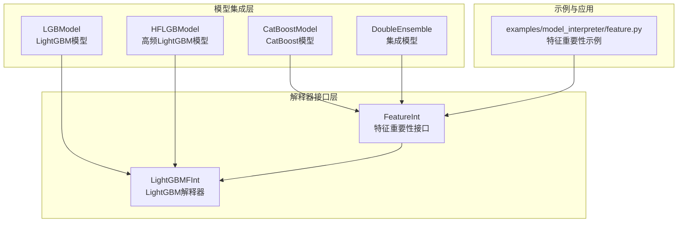
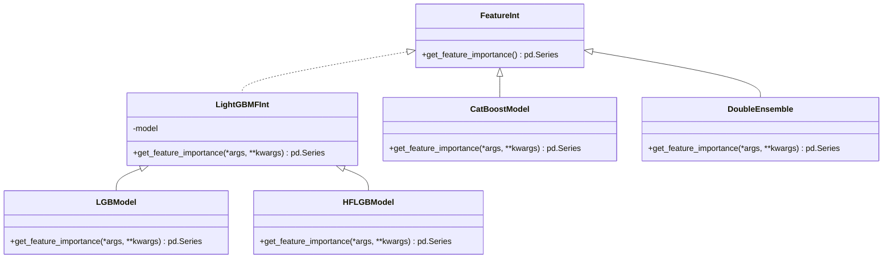
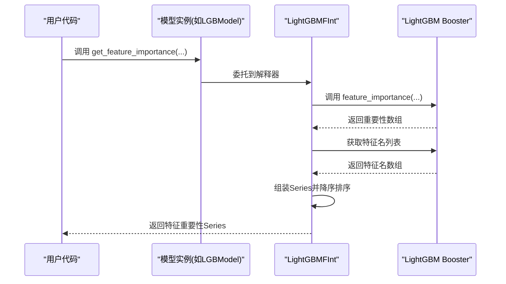
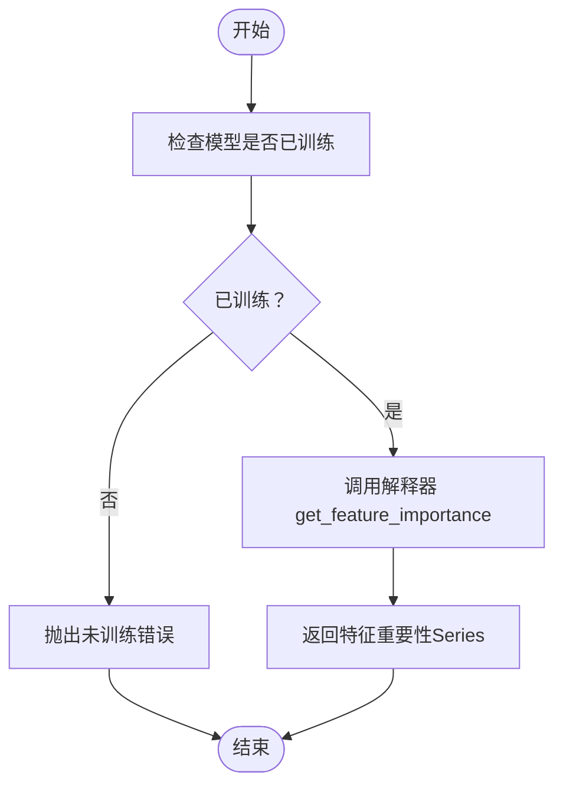
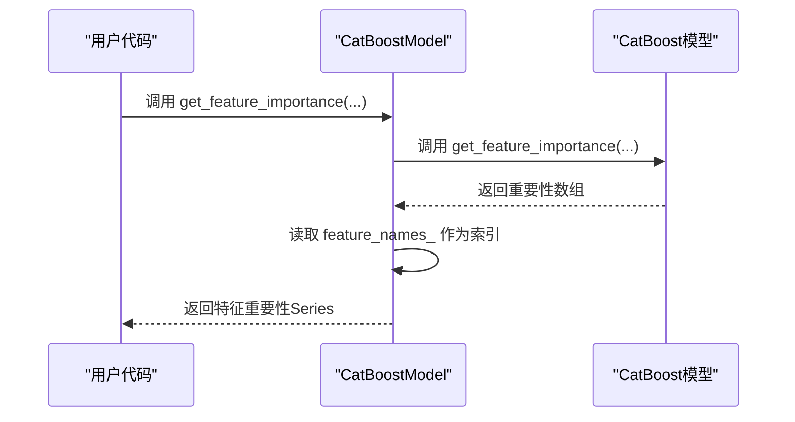
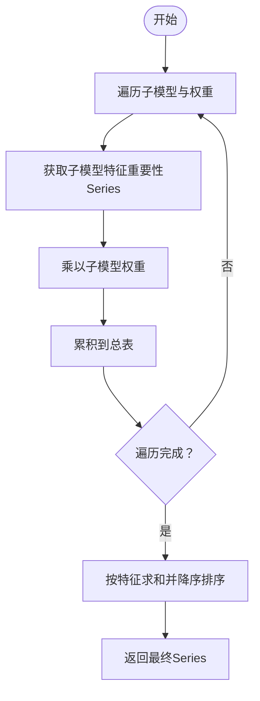
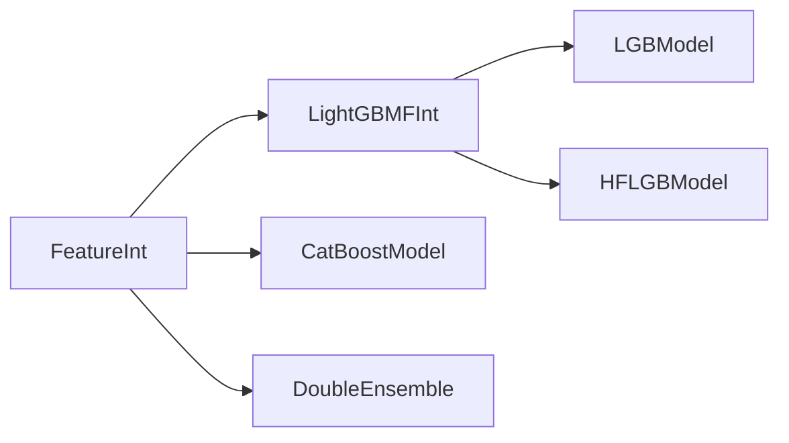

# 模型解释器接口

<cite>
**本文引用的文件**   
- [qlib/model/interpret/base.py](file://qlib/model/interpret/base.py)
- [qlib/contrib/model/gbdt.py](file://qlib/contrib/model/gbdt.py)
- [qlib/contrib/model/highfreq_gdbt_model.py](file://qlib/contrib/model/highfreq_gdbt_model.py)
- [qlib/contrib/model/catboost_model.py](file://qlib/contrib/model/catboost_model.py)
- [qlib/contrib/model/double_ensemble.py](file://qlib/contrib/model/double_ensemble.py)
- [examples/model_interpreter/feature.py](file://examples/model_interpreter/feature.py)
</cite>

## 目录
1. [引言](#引言)
2. [项目结构](#项目结构)
3. [核心组件](#核心组件)
4. [架构总览](#架构总览)
5. [详细组件分析](#详细组件分析)
6. [依赖关系分析](#依赖关系分析)
7. [性能考虑](#性能考虑)
8. [故障排查指南](#故障排查指南)
9. [结论](#结论)
10. [附录](#附录)

## 引言
本文件面向Qlib模型解释器接口的使用者与开发者，系统化阐述“特征重要性分析”的通用接口设计与实现模式，覆盖以下关键主题：
- 统一的特征重要性接口：FeatureInt 及其具体实现（LightGBMFInt、CatBoostFInt 等）
- 解释器的扩展机制：通过继承统一接口并对接具体模型后端
- 配置参数与使用方法：解释范围、精度控制、性能优化
- 实际应用示例：对不同类型的模型进行特征重要性分析与决策解释
- 结果解读与业务价值：如何将解释结果转化为可执行的业务洞察

本说明以仓库中现有实现为依据，避免臆造不存在的功能。

## 项目结构
与模型解释器直接相关的核心位置如下：
- 接口定义与基础实现：qlib/model/interpret/base.py
- 具体解释器实现与集成：
  - LightGBM 解释器：qlib/contrib/model/gbdt.py、qlib/contrib/model/highfreq_gdbt_model.py
  - CatBoost 解释器：qlib/contrib/model/catboost_model.py
  - 集成解释能力的模型类：qlib/contrib/model/double_ensemble.py
- 示例：examples/model_interpreter/feature.py

**图表来源**
- [qlib/model/interpret/base.py:12-45](file://qlib/model/interpret/base.py#L12-L45)
- [qlib/contrib/model/gbdt.py:15-15](file://qlib/contrib/model/gbdt.py#L15-L15)
- [qlib/contrib/model/highfreq_gdbt_model.py:14-14](file://qlib/contrib/model/highfreq_gdbt_model.py#L14-L14)
- [qlib/contrib/model/catboost_model.py:86-96](file://qlib/contrib/model/catboost_model.py#L86-L96)
- [qlib/contrib/model/double_ensemble.py:266-277](file://qlib/contrib/model/double_ensemble.py#L266-L277)
- [examples/model_interpreter/feature.py](file://examples/model_interpreter/feature.py)

**章节来源**
- [qlib/model/interpret/base.py:1-45](file://qlib/model/interpret/base.py#L1-L45)
- [qlib/contrib/model/gbdt.py:15-15](file://qlib/contrib/model/gbdt.py#L15-L15)
- [qlib/contrib/model/highfreq_gdbt_model.py:14-14](file://qlib/contrib/model/highfreq_gdbt_model.py#L14-L14)
- [qlib/contrib/model/catboost_model.py:86-96](file://qlib/contrib/model/catboost_model.py#L86-L96)
- [qlib/contrib/model/double_ensemble.py:266-277](file://qlib/contrib/model/double_ensemble.py#L266-L277)
- [examples/model_interpreter/feature.py](file://examples/model_interpreter/feature.py)

## 核心组件
- FeatureInt：抽象接口，定义统一的特征重要性查询方法，返回按重要性排序的特征Series。
- LightGBMFInt：针对LightGBM Booster的解释器实现，封装调用底层特征重要性接口并返回标准化结果。
- LGBModel/HFLGBModel：继承自模型基类并混入 LightGBMFInt，从而具备特征重要性能力。
- CatBoostModel：实现 FeatureInt 接口，通过模型内置方法获取特征重要性。
- DoubleEnsemble：实现 FeatureInt 接口，聚合子模型的特征重要性并加权合并。

这些组件共同构成“统一接口 + 多后端适配”的解释器体系，便于在不改变上层调用方式的前提下扩展新的解释算法或模型类型。

**章节来源**
- [qlib/model/interpret/base.py:12-45](file://qlib/model/interpret/base.py#L12-L45)
- [qlib/contrib/model/gbdt.py:15-15](file://qlib/contrib/model/gbdt.py#L15-L15)
- [qlib/contrib/model/highfreq_gdbt_model.py:14-14](file://qlib/contrib/model/highfreq_gdbt_model.py#L14-L14)
- [qlib/contrib/model/catboost_model.py:86-96](file://qlib/contrib/model/catboost_model.py#L86-L96)
- [qlib/contrib/model/double_ensemble.py:266-277](file://qlib/contrib/model/double_ensemble.py#L266-L277)

## 架构总览
下图展示了“接口层 → 模型集成层 → 应用示例”的整体关系，以及解释器与具体模型后端的耦合点。

**图表来源**
- [qlib/model/interpret/base.py:12-45](file://qlib/model/interpret/base.py#L12-L45)
- [qlib/contrib/model/gbdt.py:15-15](file://qlib/contrib/model/gbdt.py#L15-L15)
- [qlib/contrib/model/highfreq_gdbt_model.py:14-14](file://qlib/contrib/model/highfreq_gdbt_model.py#L14-L14)
- [qlib/contrib/model/catboost_model.py:86-96](file://qlib/contrib/model/catboost_model.py#L86-L96)
- [qlib/contrib/model/double_ensemble.py:266-277](file://qlib/contrib/model/double_ensemble.py#L266-L277)

## 详细组件分析

### 接口层：FeatureInt 与 LightGBMFInt
- FeatureInt 定义了统一的 get_feature_importance 方法，返回值为按重要性降序排列的特征Series，索引为特征名。
- LightGBMFInt 在接口基础上，封装了对底层LightGBM Booster的 feature_importance 与 feature_name 调用，保证输出格式一致。

**图表来源**
- [qlib/model/interpret/base.py:12-45](file://qlib/model/interpret/base.py#L12-L45)
- [qlib/contrib/model/gbdt.py:15-15](file://qlib/contrib/model/gbdt.py#L15-L15)

**章节来源**
- [qlib/model/interpret/base.py:12-45](file://qlib/model/interpret/base.py#L12-L45)

### 模型集成层：LGBModel 与 HFLGBModel
- 这两个类通过继承模型基类并混入 LightGBMFInt，天然具备特征重要性能力。
- 使用时只需确保模型已训练完成，即可直接调用 get_feature_importance。

**图表来源**
- [qlib/contrib/model/gbdt.py:15-15](file://qlib/contrib/model/gbdt.py#L15-L15)
- [qlib/contrib/model/highfreq_gdbt_model.py:14-14](file://qlib/contrib/model/highfreq_gdbt_model.py#L14-L14)

**章节来源**
- [qlib/contrib/model/gbdt.py:15-15](file://qlib/contrib/model/gbdt.py#L15-L15)
- [qlib/contrib/model/highfreq_gdbt_model.py:14-14](file://qlib/contrib/model/highfreq_gdbt_model.py#L14-L14)

### CatBoostModel 的解释器实现
- CatBoostModel 直接实现 FeatureInt 接口，内部调用模型的 get_feature_importance 并结合 feature_names_ 输出标准化结果。

**图表来源**
- [qlib/contrib/model/catboost_model.py:86-96](file://qlib/contrib/model/catboost_model.py#L86-L96)

**章节来源**
- [qlib/contrib/model/catboost_model.py:86-96](file://qlib/contrib/model/catboost_model.py#L86-L96)

### DoubleEnsemble 的解释器实现
- DoubleEnsemble 实现 FeatureInt 接口，内部遍历子模型，分别获取其特征重要性并乘以对应权重，最后合并汇总并降序排序。

**图表来源**
- [qlib/contrib/model/double_ensemble.py:266-277](file://qlib/contrib/model/double_ensemble.py#L266-L277)

**章节来源**
- [qlib/contrib/model/double_ensemble.py:266-277](file://qlib/contrib/model/double_ensemble.py#L266-L277)

### 示例：特征重要性分析
- 示例脚本 examples/model_interpreter/feature.py 展示了如何加载数据集、训练模型并调用解释器获取特征重要性，便于快速上手。

**章节来源**
- [examples/model_interpreter/feature.py](file://examples/model_interpreter/feature.py)

## 依赖关系分析
- 耦合与内聚
  - 接口层 FeatureInt 提供高内聚的统一契约，解释器实现与具体模型后端松耦合。
  - LGBModel/HFLGBModel 通过混入 LightGBMFInt 与模型后端解耦；CatBoostModel 与 DoubleEnsemble 则直接实现接口，保持一致性。
- 外部依赖
  - LightGBM 解释器依赖底层 Booster 的 feature_importance 与 feature_name。
  - CatBoost 解释器依赖模型的 get_feature_importance 与 feature_names_。
  - DoubleEnsemble 依赖子模型集合及其权重。

**图表来源**
- [qlib/model/interpret/base.py:12-45](file://qlib/model/interpret/base.py#L12-L45)
- [qlib/contrib/model/gbdt.py:15-15](file://qlib/contrib/model/gbdt.py#L15-L15)
- [qlib/contrib/model/highfreq_gdbt_model.py:14-14](file://qlib/contrib/model/highfreq_gdbt_model.py#L14-L14)
- [qlib/contrib/model/catboost_model.py:86-96](file://qlib/contrib/model/catboost_model.py#L86-L96)
- [qlib/contrib/model/double_ensemble.py:266-277](file://qlib/contrib/model/double_ensemble.py#L266-L277)

**章节来源**
- [qlib/model/interpret/base.py:12-45](file://qlib/model/interpret/base.py#L12-L45)
- [qlib/contrib/model/gbdt.py:15-15](file://qlib/contrib/model/gbdt.py#L15-L15)
- [qlib/contrib/model/highfreq_gdbt_model.py:14-14](file://qlib/contrib/model/highfreq_gdbt_model.py#L14-L14)
- [qlib/contrib/model/catboost_model.py:86-96](file://qlib/contrib/model/catboost_model.py#L86-L96)
- [qlib/contrib/model/double_ensemble.py:266-277](file://qlib/contrib/model/double_ensemble.py#L266-L277)

## 性能考虑
- 计算复杂度
  - LightGBM/CatBoost 的特征重要性计算通常为 O(F) 或 O(F log F)，其中 F 为特征数；DoubleEnsemble 需要对每个子模型执行一次重要性计算并加权汇总，整体复杂度约为 O(S·F)，S 为子模型数量。
- 内存与缓存
  - 解释器返回的是标准化后的 Series，内存占用与特征数线性相关；建议在大批量任务中复用已训练模型对象，避免重复初始化。
- 并行与批处理
  - 若需要对多个样本或多个时间窗口进行解释，可在上层逻辑中采用批处理策略，减少解释器调用次数。
- 精度控制
  - 对于 LightGBM，可通过传入解释器的参数（如重要性类型）控制精度与稳定性；对于 CatBoost，可选择不同的归因方式以平衡速度与准确性。

[本节为通用性能建议，不直接分析特定文件]

## 故障排查指南
- 未训练模型报错
  - 现象：调用解释器时报“模型未训练”。
  - 原因：部分模型在未 fit 之前无法生成解释结果。
  - 处理：先完成模型训练，再调用 get_feature_importance。
- 特征名缺失
  - 现象：返回Series索引为空或不完整。
  - 原因：模型未提供特征名映射。
  - 处理：确保模型在训练时正确设置特征名；若使用第三方库，请确认其 feature_name 或 feature_names_ 字段可用。
- 结果异常波动
  - 现象：多次运行得到不同顺序的特征重要性。
  - 原因：某些后端可能包含随机性或默认参数差异。
  - 处理：固定随机种子、统一解释参数，必要时在调用前显式设置后端参数。

**章节来源**
- [qlib/contrib/model/gbdt.py:15-15](file://qlib/contrib/model/gbdt.py#L15-L15)
- [qlib/contrib/model/highfreq_gdbt_model.py:14-14](file://qlib/contrib/model/highfreq_gdbt_model.py#L14-L14)
- [qlib/contrib/model/catboost_model.py:86-96](file://qlib/contrib/model/catboost_model.py#L86-L96)
- [qlib/contrib/model/double_ensemble.py:266-277](file://qlib/contrib/model/double_ensemble.py#L266-L277)

## 结论
Qlib 的模型解释器接口通过 FeatureInt 抽象与多后端适配，实现了对不同模型（LightGBM、CatBoost、集成模型等）的统一特征重要性分析能力。该设计具备良好的扩展性与可维护性，便于在不改动上层调用方式的前提下接入新的解释算法或模型类型。结合示例脚本，用户可以快速完成从数据准备到特征重要性可视化的全流程实践。

[本节为总结性内容，不直接分析特定文件]

## 附录
- 使用步骤建议
  - 准备数据与训练模型（确保模型已 fit）
  - 选择合适的解释器（LightGBM/CatBoost/集成模型）
  - 调用 get_feature_importance 获取特征重要性Series
  - 可视化与业务解读（根据业务需求筛选Top特征、关联领域知识）
- 扩展新解释器
  - 新建类实现 FeatureInt 接口
  - 在目标模型类中混入或委托到新解释器
  - 在示例脚本中补充调用流程，便于验证

[本节为通用指导，不直接分析特定文件]