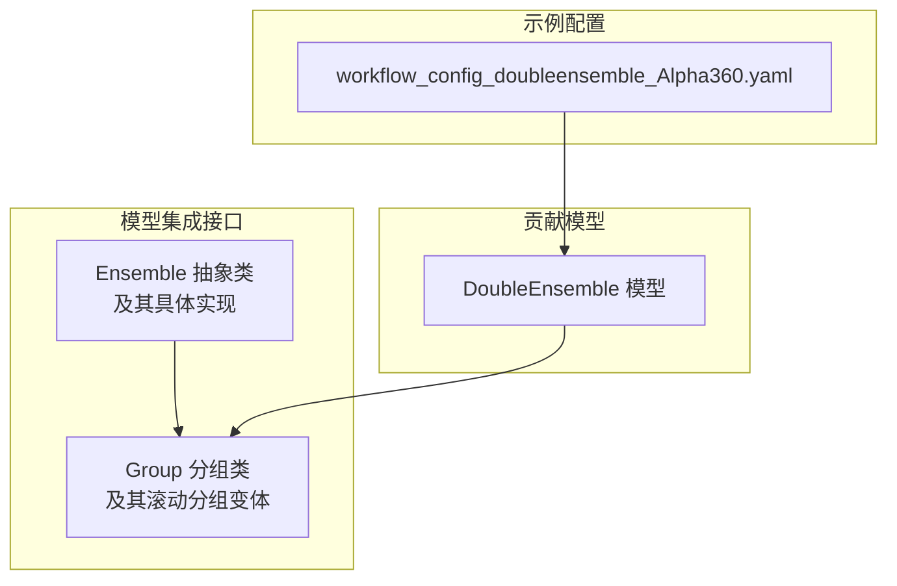
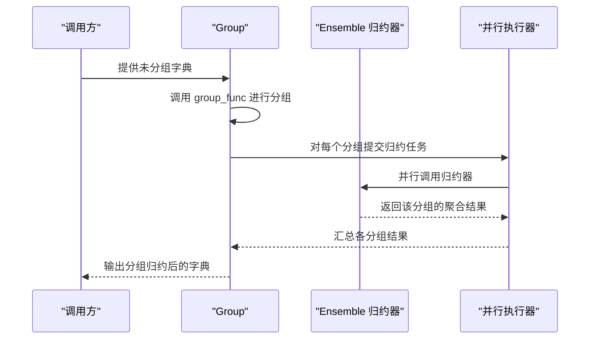
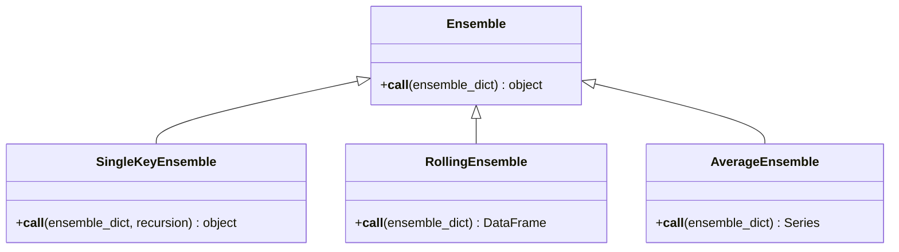
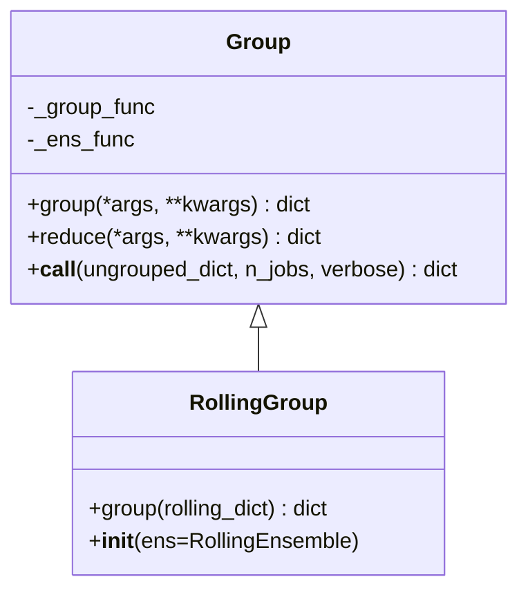
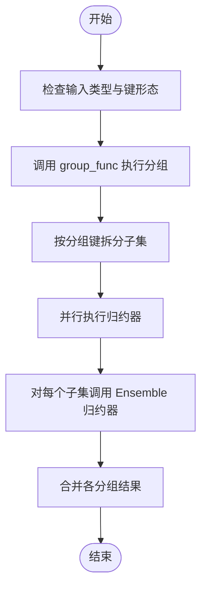
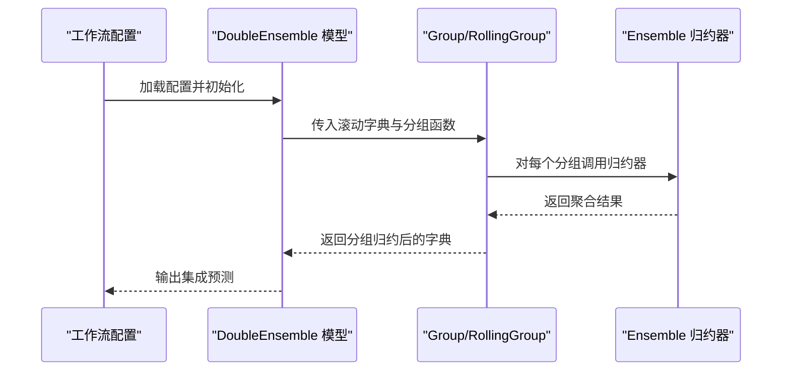
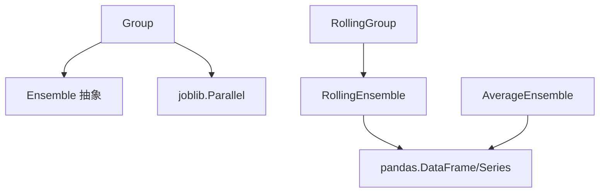

# 模型集成接口

<cite>
**本文引用的文件**
- [ensemble.py](file://qlib/model/ens/ensemble.py)
- [group.py](file://qlib/model/ens/group.py)
- [double_ensemble.py](file://qlib/contrib/model/double_ensemble.py)
- [workflow_config_doubleensemble_Alpha360.yaml](file://examples/benchmarks/DoubleEnsemble/workflow_config_doubleensemble_Alpha360.yaml)
</cite>

## 目录
1. [引言](#引言)
2. [项目结构](#项目结构)
3. [核心组件](#核心组件)
4. [架构总览](#架构总览)
5. [详细组件分析](#详细组件分析)
6. [依赖分析](#依赖分析)
7. [性能考虑](#性能考虑)
8. [故障排查指南](#故障排查指南)
9. [结论](#结论)
10. [附录](#附录)

## 引言
本文件面向Qlib的模型集成接口，系统性梳理Ensemble与Group两类核心组件的设计与用法，重点覆盖以下目标：
- Ensemble类族：解释投票策略、加权平均、堆叠集成等集成方法在代码中的实现形态与适用边界
- Group类：说明模型分组管理、模型选择、权重分配与性能评估的流程与扩展点
- 集成过程的数据流：从子模型预测到聚合结果的路径，以及集成权重计算与滚动数据合并的细节
- 使用示例：静态集成与动态集成的差异、适用场景与实践建议
- 训练与预测流程：如何组织多模型、如何进行集成效果评估与优化

## 项目结构
本次文档聚焦于模型集成接口所在目录，核心文件如下：
- qlib/model/ens/ensemble.py：定义基础Ensemble抽象与若干具体集成器（如滚动合并、标准化平均）
- qlib/model/ens/group.py：定义分组与归约框架，支持并行化归约与滚动分组
- qlib/contrib/model/double_ensemble.py：双集成（DoubleEnsemble）模型实现，体现动态集成思想
- examples/benchmarks/DoubleEnsemble/*.yaml：双集成工作流配置示例，展示动态集成的典型用法

**图表来源**
- [ensemble.py:14-133](file://qlib/model/ens/ensemble.py#L14-L133)
- [group.py:19-116](file://qlib/model/ens/group.py#L19-L116)
- [double_ensemble.py](file://qlib/contrib/model/double_ensemble.py)
- [workflow_config_doubleensemble_Alpha360.yaml](file://examples/benchmarks/DoubleEnsemble/workflow_config_doubleensemble_Alpha360.yaml)

**章节来源**
- [ensemble.py:1-133](file://qlib/model/ens/ensemble.py#L1-L133)
- [group.py:1-116](file://qlib/model/ens/group.py#L1-L116)

## 核心组件
- Ensemble抽象类：定义统一的“调用接口”，要求子类实现具体的合并逻辑；提供可递归简化字典键值的工具类SingleKeyEnsemble
- RollingEnsemble：对按时间索引的滚动DataFrame进行排序、去重与拼接，形成完整滚动序列
- AverageEnsemble：对同形DataFrame集合进行展平、按日期分组后标准化再平均，输出标准化后的聚合序列
- Group：基于自定义分组函数将对象字典分组，并通过Ensemble归约器对每组执行并行归约
- RollingGroup：针对滚动键元组的特殊分组规则，先按除滚动键外的键元组分组，再以滚动键作为子项归约

上述组件共同构成“分组-归约-聚合”的流水线，既可用于静态集成（固定分组与权重），也可用于动态集成（根据滚动窗口或外部条件调整分组与权重）。

**章节来源**
- [ensemble.py:14-133](file://qlib/model/ens/ensemble.py#L14-L133)
- [group.py:19-116](file://qlib/model/ens/group.py#L19-L116)

## 架构总览
下图展示了从输入字典到最终聚合结果的整体流程，以及Group与Ensemble之间的协作关系。

**图表来源**
- [group.py:67-89](file://qlib/model/ens/group.py#L67-L89)

## 详细组件分析

### Ensemble类族
- Ensemble抽象类：要求实现__call__，用于将字典形式的子模型产物合并为集成结果
- SingleKeyEnsemble：当字典仅有一个键时提取其值，支持递归简化嵌套字典，提升可读性
- RollingEnsemble：对包含“datetime”索引的DataFrame集合进行排序、去重、拼接，得到完整滚动序列
- AverageEnsemble：对同形DataFrame集合进行展平、按日期分组、标准化后求均值，输出标准化聚合序列

**图表来源**
- [ensemble.py:14-133](file://qlib/model/ens/ensemble.py#L14-L133)

**章节来源**
- [ensemble.py:14-133](file://qlib/model/ens/ensemble.py#L14-L133)

### Group类与RollingGroup
- Group：接收group_func与Ensemble归约器，负责将未分组字典按分组函数拆分为多个子集，并对每个子集调用Ensemble归约器；内部使用joblib并行执行归约任务
- RollingGroup：专门处理滚动键元组的分组，约定滚动键位于元组末尾，先按除滚动键外的键元组分组，再以滚动键作为子项进行归约

**图表来源**
- [group.py:19-116](file://qlib/model/ens/group.py#L19-L116)

**章节来源**
- [group.py:19-116](file://qlib/model/ens/group.py#L19-L116)

### 数据流与算法细节
- 输入数据形态：字典形式的子模型产物，键为模型标识，值为DataFrame或Series
- 分组阶段：由group_func决定如何将键空间映射到分组键；RollingGroup默认按元组前缀分组
- 归约阶段：对每个分组内的子项调用Ensemble归约器；Group内部使用joblib并行化
- 滚动合并：RollingEnsemble按最早时间戳排序、去重保留最新预测、再整体排序，确保滚动序列连续
- 标准化平均：AverageEnsemble对同形DataFrame集合进行展平、按日期分组、标准化后求均值，降低单模型偏差影响

**图表来源**
- [group.py:67-89](file://qlib/model/ens/group.py#L67-L89)
- [ensemble.py:65-133](file://qlib/model/ens/ensemble.py#L65-L133)

**章节来源**
- [group.py:67-89](file://qlib/model/ens/group.py#L67-L89)
- [ensemble.py:65-133](file://qlib/model/ens/ensemble.py#L65-L133)

### 动态集成与静态集成
- 静态集成：分组与权重在训练/配置阶段确定，运行时保持不变。适合模型稳定、特征空间变化较小的场景
- 动态集成：根据滚动窗口、外部信号或在线反馈实时调整分组与权重。DoubleEnsemble即为动态集成的代表实现，通过工作流配置驱动

**图表来源**
- [double_ensemble.py](file://qlib/contrib/model/double_ensemble.py)
- [workflow_config_doubleensemble_Alpha360.yaml](file://examples/benchmarks/DoubleEnsemble/workflow_config_doubleensemble_Alpha360.yaml)

**章节来源**
- [double_ensemble.py](file://qlib/contrib/model/double_ensemble.py)
- [workflow_config_doubleensemble_Alpha360.yaml](file://examples/benchmarks/DoubleEnsemble/workflow_config_doubleensemble_Alpha360.yaml)

## 依赖分析
- 组件内聚与耦合
  - Ensemble与Group之间通过可插拔的归约器实现低耦合；Group仅依赖Ensemble的调用接口
  - RollingGroup继承Group并绑定RollingEnsemble，形成特定场景下的强内聚组合
- 外部依赖
  - joblib并行执行：Group内部使用Parallel与delayed进行并行归约
  - pandas数据结构：RollingEnsemble与AverageEnsemble均依赖DataFrame/Series的时间索引与分组能力
  - 日志：各组件使用QLib日志模块输出关键信息，便于调试与追踪

**图表来源**
- [group.py:15-18](file://qlib/model/ens/group.py#L15-L18)
- [ensemble.py:80-132](file://qlib/model/ens/ensemble.py#L80-L132)

**章节来源**
- [group.py:15-18](file://qlib/model/ens/group.py#L15-L18)
- [ensemble.py:80-132](file://qlib/model/ens/ensemble.py#L80-L132)

## 性能考虑
- 并行化：Group通过joblib并行归约显著缩短大规模分组场景的处理时间，需合理设置n_jobs与verbose
- 数据结构与索引：RollingEnsemble依赖“datetime”索引进行排序与去重；AverageEnsemble依赖分组与标准化操作，建议确保输入数据格式一致
- 内存占用：AverageEnsemble在展平与拼接过程中可能产生中间大矩阵，需关注内存峰值
- I/O与缓存：滚动数据的去重与排序是I/O敏感操作，建议结合缓存策略减少重复计算

## 故障排查指南
- 未实现分组/归约函数
  - 现象：调用Group时报错提示需要有效的group_func或_en multifunc
  - 排查：确认已正确传入可调用的分组函数与归约器
- 滚动键类型错误
  - 现象：RollingGroup在处理非元组键时抛出类型异常
  - 排查：确保键为元组且滚动键位于末尾
- 数据索引不匹配
  - 现象：RollingEnsemble或AverageEnsemble在索引/分组时出现异常
  - 排查：检查输入DataFrame是否包含“datetime”索引，确保键值对结构一致
- 并行化问题
  - 现象：使用joblib并行时出现pickle相关错误
  - 排查：避免传递不可序列化的对象；必要时简化任务或禁用并行

**章节来源**
- [group.py:48-65](file://qlib/model/ens/group.py#L48-L65)
- [group.py:106-112](file://qlib/model/ens/group.py#L106-L112)
- [ensemble.py:80-88](file://qlib/model/ens/ensemble.py#L80-L88)
- [ensemble.py:122-132](file://qlib/model/ens/ensemble.py#L122-L132)

## 结论
Qlib的模型集成接口通过Ensemble与Group两大抽象，提供了灵活而高效的模型聚合能力。RollingEnsemble与AverageEnsemble分别覆盖了滚动序列合并与标准化平均两种常见需求；Group与RollingGroup则为分组与并行归约提供了通用框架。结合DoubleEnsemble与工作流配置，用户可以构建从静态到动态的多种集成策略，并在实际业务中进行效果评估与持续优化。

## 附录
- 使用建议
  - 静态集成：适用于模型稳定、特征空间变化小的场景；优先使用RollingEnsemble与AverageEnsemble
  - 动态集成：适用于滚动窗口变化、外部信号驱动的场景；优先参考DoubleEnsemble与相应工作流配置
- 评估与优化
  - 建议在验证集上对比不同归约器的效果，结合IC、Rank IC等指标评估集成收益
  - 通过调整分组粒度与并行参数平衡性能与资源消耗