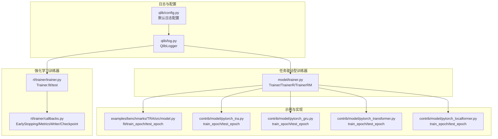
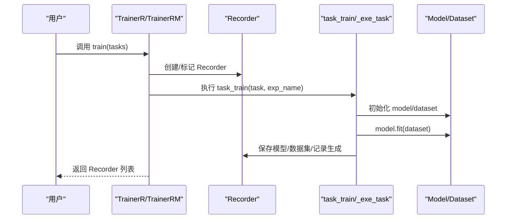
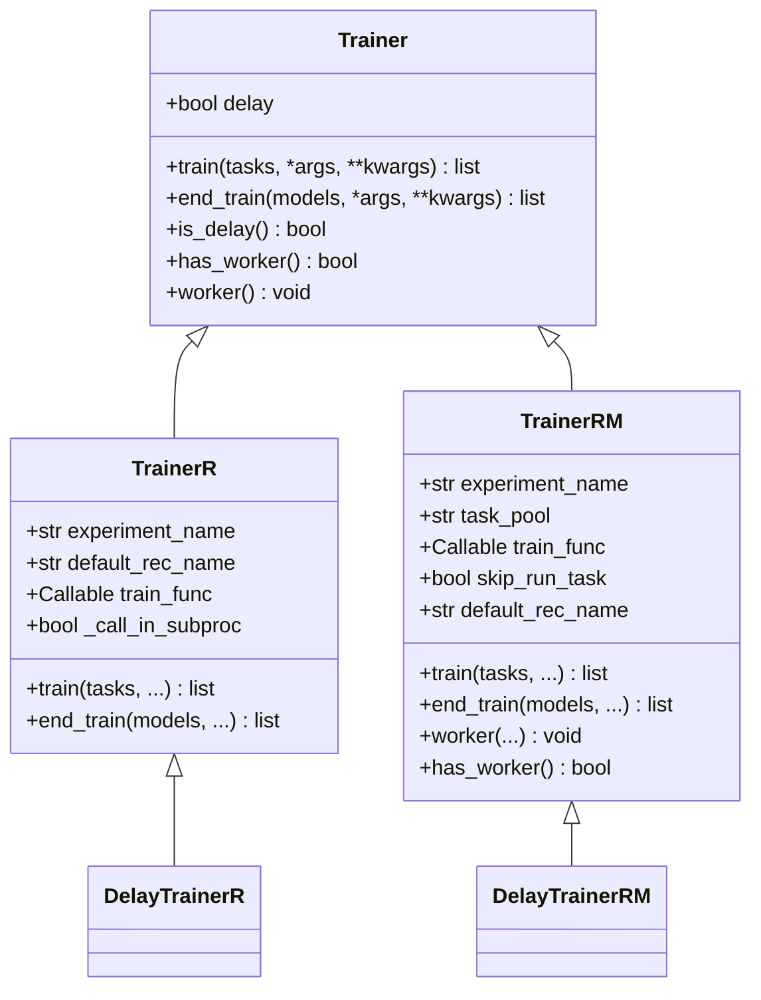
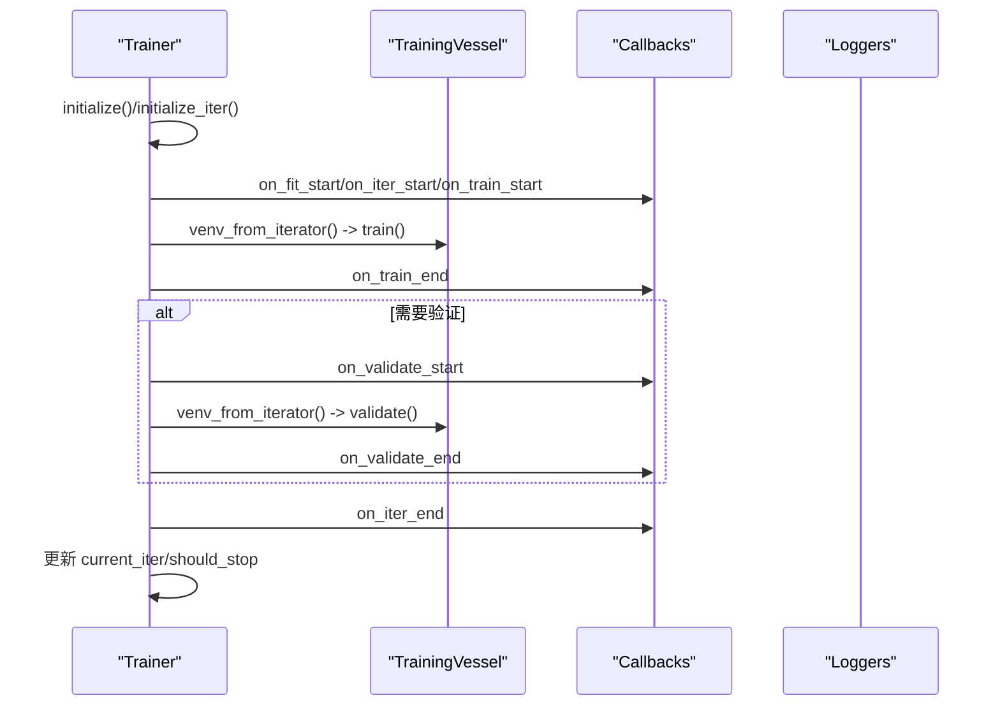
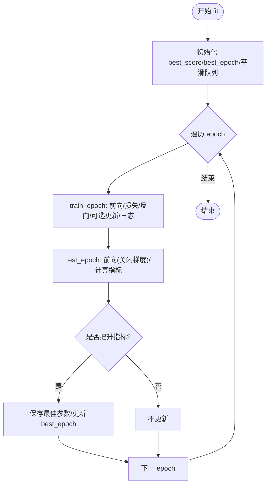
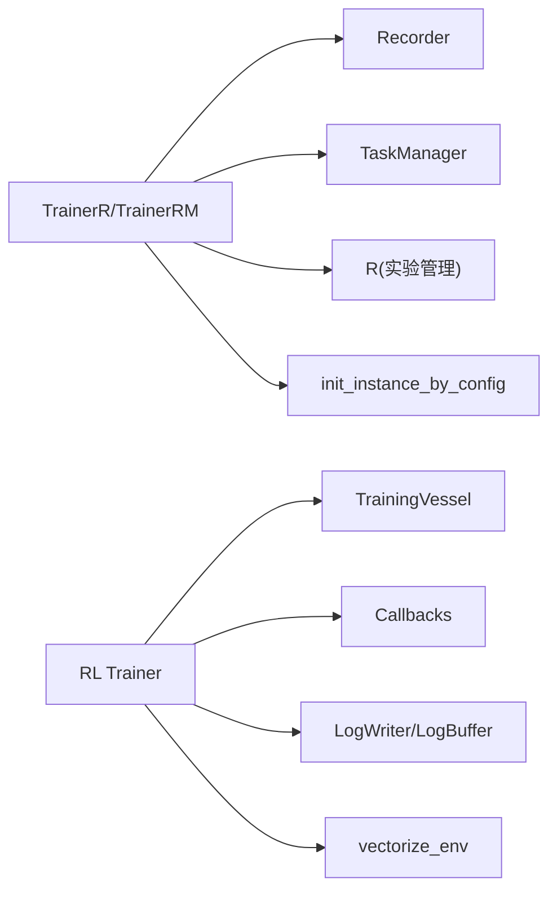

# 训练器接口

<cite>
**本文引用的文件**
- [qlib/model/trainer.py](file://qlib/model/trainer.py)
- [qlib/rl/trainer/trainer.py](file://qlib/rl/trainer/trainer.py)
- [qlib/rl/trainer/callbacks.py](file://qlib/rl/trainer/callbacks.py)
- [examples/benchmarks/TRA/src/model.py](file://examples/benchmarks/TRA/src/model.py)
- [contrib/model/pytorch_tra.py](file://qlib/contrib/model/pytorch_tra.py)
- [contrib/model/pytorch_gru.py](file://qlib/contrib/model/pytorch_gru.py)
- [contrib/model/pytorch_transformer.py](file://qlib/contrib/model/pytorch_transformer.py)
- [contrib/model/pytorch_localformer.py](file://qlib/contrib/model/pytorch_localformer.py)
- [tests/rl/test_trainer.py](file://tests/rl/test_trainer.py)
- [qlib/log.py](file://qlib/log.py)
- [qlib/config.py](file://qlib/config.py)
- [tests/rl/test_logger.py](file://tests/rl/test_logger.py)
</cite>

## 目录
1. [简介](#简介)
2. [项目结构](#项目结构)
3. [核心组件](#核心组件)
4. [架构总览](#架构总览)
5. [详细组件分析](#详细组件分析)
6. [依赖分析](#依赖分析)
7. [性能考虑](#性能考虑)
8. [故障排查指南](#故障排查指南)
9. [结论](#结论)
10. [附录](#附录)

## 简介
本文件为 Qlib 训练器接口的完整 API 文档，覆盖两类训练器体系：
- 任务驱动型训练器（基于 Recorder 的通用训练器）
- 强化学习训练器（RL Trainer）

重点说明 Trainer 类的训练流程控制、训练配置参数、回调函数注册、训练状态管理；记录训练过程中的数据预处理、批次处理、梯度更新等关键步骤；介绍训练器的扩展机制（自定义训练循环、损失函数定义、优化器配置）；并提供最佳实践（超参数调优、早停策略、模型检查点）、日志记录、性能监控与调试方法。

## 项目结构
围绕训练器接口的关键文件组织如下：
- 任务驱动型训练器：位于 model 层，负责以“任务”为单位进行训练与产出 Recorder。
- 强化学习训练器：位于 rl/trainer 子模块，提供收集-训练-验证的标准流程，并支持回调与检查点。
- 示例与实现：benchmarks 中的 TRA 模型展示了传统深度学习训练循环（训练/测试/评估），contrib 下的 PyTorch 模型展示了常见损失、优化与训练/测试循环。
- 日志与配置：log 提供统一日志封装，config 提供默认日志配置。

**图表来源**
- [qlib/model/trainer.py:131-620](file://qlib/model/trainer.py#L131-L620)
- [qlib/rl/trainer/trainer.py:30-356](file://qlib/rl/trainer/trainer.py#L30-L356)
- [qlib/rl/trainer/callbacks.py:32-292](file://qlib/rl/trainer/callbacks.py#L32-L292)
- [examples/benchmarks/TRA/src/model.py:83-240](file://examples/benchmarks/TRA/src/model.py#L83-L240)
- [qlib/contrib/model/pytorch_tra.py:176-276](file://qlib/contrib/model/pytorch_tra.py#L176-L276)
- [qlib/contrib/model/pytorch_gru.py:156-266](file://qlib/contrib/model/pytorch_gru.py#L156-L266)
- [qlib/contrib/model/pytorch_transformer.py:119-162](file://qlib/contrib/model/pytorch_transformer.py#L119-L162)
- [qlib/contrib/model/pytorch_localformer.py:120-163](file://qlib/contrib/model/pytorch_localformer.py#L120-L163)
- [qlib/log.py:1-262](file://qlib/log.py#L1-L262)
- [qlib/config.py:201-235](file://qlib/config.py#L201-L235)

**章节来源**
- [qlib/model/trainer.py:1-620](file://qlib/model/trainer.py#L1-L620)
- [qlib/rl/trainer/trainer.py:1-356](file://qlib/rl/trainer/trainer.py#L1-L356)
- [qlib/rl/trainer/callbacks.py:1-292](file://qlib/rl/trainer/callbacks.py#L1-L292)
- [examples/benchmarks/TRA/src/model.py:83-240](file://examples/benchmarks/TRA/src/model.py#L83-L240)
- [qlib/contrib/model/pytorch_tra.py:176-276](file://qlib/contrib/model/pytorch_tra.py#L176-L276)
- [qlib/contrib/model/pytorch_gru.py:156-266](file://qlib/contrib/model/pytorch_gru.py#L156-L266)
- [qlib/contrib/model/pytorch_transformer.py:119-162](file://qlib/contrib/model/pytorch_transformer.py#L119-L162)
- [qlib/contrib/model/pytorch_localformer.py:120-163](file://qlib/contrib/model/pytorch_localformer.py#L120-L163)
- [qlib/log.py:1-262](file://qlib/log.py#L1-L262)
- [qlib/config.py:201-235](file://qlib/config.py#L201-L235)

## 核心组件
- 任务驱动型训练器
  - Trainer：抽象基类，定义 train/end_train 接口与延迟训练能力。
  - TrainerR：基于 Recorder 的线性训练器，顺序执行任务并返回 Recorder。
  - TrainerRM：基于 TaskManager 的多进程训练器，支持分布式与并行。
  - DelayTrainerR/DelayTrainerRM：延迟训练版本，将实际拟合推迟到 end_train 或 worker 执行。
- 强化学习训练器
  - Trainer：以“收集-训练-验证”迭代为主，支持回调、日志、检查点与早停。
  - Callbacks：内置回调（早停、指标写入、检查点）。
- 示例与实现
  - TRA 模型：展示 fit/train_epoch/test_epoch 的完整训练循环。
  - 多个 PyTorch 模型：展示损失函数、优化器、训练/测试循环。

**章节来源**
- [qlib/model/trainer.py:131-620](file://qlib/model/trainer.py#L131-L620)
- [qlib/rl/trainer/trainer.py:30-356](file://qlib/rl/trainer/trainer.py#L30-L356)
- [qlib/rl/trainer/callbacks.py:32-292](file://qlib/rl/trainer/callbacks.py#L32-L292)
- [examples/benchmarks/TRA/src/model.py:83-240](file://examples/benchmarks/TRA/src/model.py#L83-L240)
- [qlib/contrib/model/pytorch_tra.py:176-276](file://qlib/contrib/model/pytorch_tra.py#L176-L276)
- [qlib/contrib/model/pytorch_gru.py:156-266](file://qlib/contrib/model/pytorch_gru.py#L156-L266)
- [qlib/contrib/model/pytorch_transformer.py:119-162](file://qlib/contrib/model/pytorch_transformer.py#L119-L162)
- [qlib/contrib/model/pytorch_localformer.py:120-163](file://qlib/contrib/model/pytorch_localformer.py#L120-L163)

## 架构总览
任务驱动型训练器通过 Recorder 管理实验与记录；强化学习训练器通过 TrainingVessel 组织策略、环境与模拟器，Trainer 控制收集-训练-验证循环。

**图表来源**
- [qlib/model/trainer.py:74-128](file://qlib/model/trainer.py#L74-L128)
- [qlib/model/trainer.py:243-291](file://qlib/model/trainer.py#L243-L291)
- [qlib/model/trainer.py:384-464](file://qlib/model/trainer.py#L384-L464)

## 详细组件分析

### 任务驱动型训练器（Trainer/TrainerR/TrainerRM）
- 设计要点
  - Trainer 抽象出 train/end_train 两阶段，支持延迟训练。
  - TrainerR 顺序训练，返回 Recorder 并打标签。
  - TrainerRM 基于 TaskManager，支持多进程/多机并行，可指定 before/after 状态流转。
  - DelayTrainerX 将真实拟合推迟至 end_train 或 worker，便于跨机器/资源调度。
- 关键流程
  - 训练前：记录任务配置、初始化模型与数据集、可选子进程执行。
  - 训练中：自动注入 model/dataset 至 record 配置，生成预测/回测/分析记录。
  - 结束：设置完成标签或在 end_train 中恢复执行。
- 参数与配置
  - experiment_name：实验名。
  - train_func/end_train_func：自定义训练/结束训练函数。
  - default_rec_name：Recorder 名称。
  - task_pool：TrainerRM 使用的任务池名。
  - skip_run_task：是否跳过 run_task，仅在 worker 上运行。
- 最佳实践
  - 使用 TrainerRM 进行大规模并行训练，结合 TaskManager 管理任务生命周期。
  - 在 DelayTrainerRM 中将准备与拟合分离，先在 CPU 虚拟机准备任务，再在 GPU 机器上执行 end_train。

**图表来源**
- [qlib/model/trainer.py:131-620](file://qlib/model/trainer.py#L131-L620)

**章节来源**
- [qlib/model/trainer.py:131-620](file://qlib/model/trainer.py#L131-L620)

### 强化学习训练器（RL Trainer）
- 设计要点
  - 训练以“收集-训练-验证”为迭代单位，支持并发环境向量化。
  - Trainer 维护当前迭代、阶段（train/val/test）、指标与停止标志。
  - 支持回调钩子（fit/start/end/iter/train/validate/test）。
- 关键流程
  - fit：初始化状态，循环执行收集-训练；按需执行验证；每轮迭代后回调。
  - test：在测试阶段收集与评估。
  - venv_from_iterator：构建向量化环境。
- 回调与检查点
  - EarlyStopping：基于监控指标与耐心值触发早停，可选择恢复最佳权重。
  - MetricsWriter：将训练/验证指标写入 CSV。
  - Checkpoint：周期性保存检查点，支持 latest 链接/复制。
- 参数与配置
  - max_iters：最大迭代次数。
  - val_every_n_iters：验证间隔。
  - loggers：日志写入器列表。
  - callbacks：回调列表。
  - finite_env_type/concurrency/fast_dev_run：环境类型、并发数、快速调试模式。

**图表来源**
- [qlib/rl/trainer/trainer.py:188-273](file://qlib/rl/trainer/trainer.py#L188-L273)
- [qlib/rl/trainer/callbacks.py:32-292](file://qlib/rl/trainer/callbacks.py#L32-L292)

**章节来源**
- [qlib/rl/trainer/trainer.py:30-356](file://qlib/rl/trainer/trainer.py#L30-L356)
- [qlib/rl/trainer/callbacks.py:32-292](file://qlib/rl/trainer/callbacks.py#L32-L292)

### 传统深度学习训练循环示例（TRA/PyTorch 模型）
- TRA 模型
  - fit：训练循环，维护 best_score/best_epoch，支持平滑参数与评估。
  - train_epoch：训练阶段，前向、计算损失、反向传播、可选更新频率、日志记录。
  - test_epoch：验证/测试阶段，关闭梯度，计算损失与指标。
- PyTorch 模型族
  - 共同点：train_epoch/test_epoch 明确划分训练与评估；使用优化器与损失函数；支持梯度裁剪。
  - 差异：不同模型的特征维度、损失函数与指标函数略有差异。

**图表来源**
- [examples/benchmarks/TRA/src/model.py:203-240](file://examples/benchmarks/TRA/src/model.py#L203-L240)
- [qlib/contrib/model/pytorch_tra.py:176-276](file://qlib/contrib/model/pytorch_tra.py#L176-L276)
- [qlib/contrib/model/pytorch_gru.py:156-266](file://qlib/contrib/model/pytorch_gru.py#L156-L266)
- [qlib/contrib/model/pytorch_transformer.py:119-162](file://qlib/contrib/model/pytorch_transformer.py#L119-L162)
- [qlib/contrib/model/pytorch_localformer.py:120-163](file://qlib/contrib/model/pytorch_localformer.py#L120-L163)

**章节来源**
- [examples/benchmarks/TRA/src/model.py:83-240](file://examples/benchmarks/TRA/src/model.py#L83-L240)
- [qlib/contrib/model/pytorch_tra.py:176-276](file://qlib/contrib/model/pytorch_tra.py#L176-L276)
- [qlib/contrib/model/pytorch_gru.py:156-266](file://qlib/contrib/model/pytorch_gru.py#L156-L266)
- [qlib/contrib/model/pytorch_transformer.py:119-162](file://qlib/contrib/model/pytorch_transformer.py#L119-L162)
- [qlib/contrib/model/pytorch_localformer.py:120-163](file://qlib/contrib/model/pytorch_localformer.py#L120-L163)

## 依赖分析
- 任务驱动型训练器依赖
  - Recorder：记录实验、模型、数据集与生成结果。
  - TaskManager：TrainerRM 的任务池与并行执行。
  - R：实验管理入口。
  - init_instance_by_config/auto_filter_kwargs：从配置实例化模型/数据集/记录器。
- 强化学习训练器依赖
  - TrainingVessel：封装策略、环境、模拟器与数据收集。
  - Callbacks：回调系统。
  - LogWriter/LogBuffer：日志写入与缓冲。
  - vectorize_env：环境向量化。

**图表来源**
- [qlib/model/trainer.py:42-106](file://qlib/model/trainer.py#L42-L106)
- [qlib/rl/trainer/trainer.py:188-307](file://qlib/rl/trainer/trainer.py#L188-L307)

**章节来源**
- [qlib/model/trainer.py:42-106](file://qlib/model/trainer.py#L42-L106)
- [qlib/rl/trainer/trainer.py:188-307](file://qlib/rl/trainer/trainer.py#L188-L307)

## 性能考虑
- 并行与资源调度
  - 使用 TrainerRM 的 TaskManager 实现多进程/多机并行；通过 before/after 状态控制任务流转。
  - DelayTrainerRM 将准备与拟合分离，适合跨机器资源调度。
- 内存与子进程
  - TrainerR 可启用子进程执行以强制释放内存，避免长时间训练导致的内存累积。
- 环境向量化
  - RL Trainer 的 venv_from_iterator 支持多种环境类型与并发，合理设置 concurrency 可提升吞吐。
- 梯度与优化
  - PyTorch 模型普遍采用 clip_grad_value 对梯度裁剪，防止爆炸梯度。
- 日志与 I/O
  - MetricsWriter 定期写入 CSV，建议在高并发下注意磁盘 I/O 压力。

**章节来源**
- [qlib/model/trainer.py:268-271](file://qlib/model/trainer.py#L268-L271)
- [qlib/rl/trainer/trainer.py:274-307](file://qlib/rl/trainer/trainer.py#L274-L307)
- [qlib/contrib/model/pytorch_gru.py:177-178](file://qlib/contrib/model/pytorch_gru.py#L177-L178)

## 故障排查指南
- 日志配置
  - 默认日志配置位于 config，可通过 set_log_with_config 调整全局日志级别与处理器。
  - QlibLogger 提供统一日志封装，支持时间成本统计与上下文管理。
- RL 训练日志
  - 测试用例展示了如何通过 EnvWrapper 与 LogCollector 输出调试信息，便于定位问题。
- 常见问题
  - 早停未生效：确认回调已注册且 monitor 名称与指标一致。
  - 检查点未保存：检查 save_latest/every_n_iters/time_interval 配置。
  - 训练卡住：检查 TaskManager 任务状态与 before/after 设置；必要时使用 DelayTrainerRM 分离准备与拟合。

**章节来源**
- [qlib/config.py:201-235](file://qlib/config.py#L201-L235)
- [qlib/log.py:152-262](file://qlib/log.py#L152-L262)
- [tests/rl/test_logger.py:141-167](file://tests/rl/test_logger.py#L141-L167)
- [qlib/rl/trainer/callbacks.py:203-292](file://qlib/rl/trainer/callbacks.py#L203-L292)

## 结论
Qlib 的训练器接口提供了两类强大的训练框架：任务驱动型训练器适用于标准模型训练与实验管理；强化学习训练器专注于收集-训练-验证的 RL 场景。通过回调、检查点、日志与并行机制，用户可以灵活扩展训练流程、监控性能并实现高效训练。

## 附录
- 使用建议
  - 任务驱动型：优先使用 TrainerRM 进行大规模并行；需要延迟训练时使用 DelayTrainerRM。
  - 强化学习：根据任务复杂度选择环境类型与并发；合理配置早停与检查点。
  - 日志：结合 QlibLogger 与默认日志配置，确保训练过程可观测。
- 参考实现
  - TRA 模型与多个 PyTorch 模型展示了训练/测试循环与损失优化的通用模式。