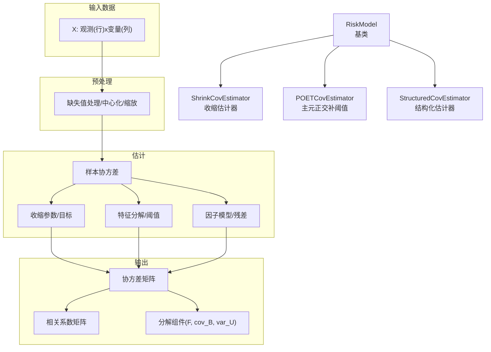
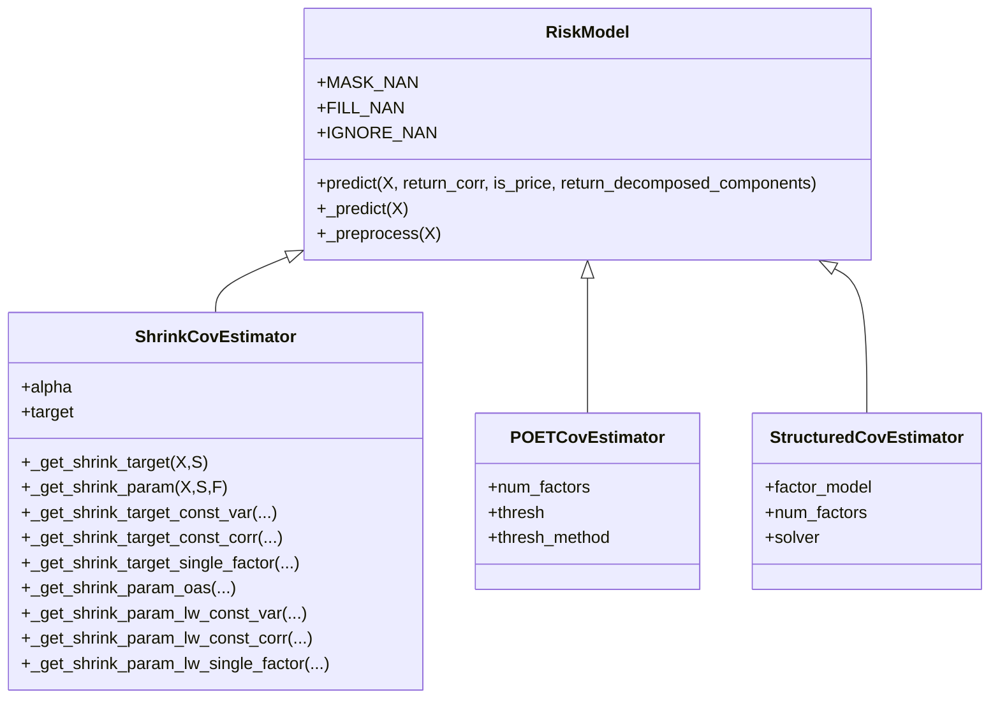
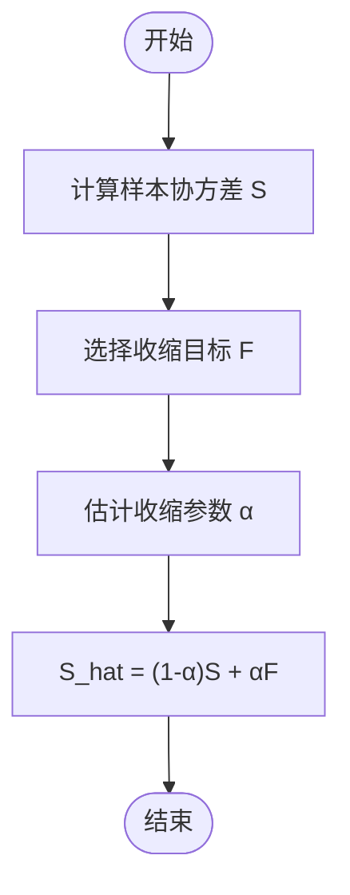
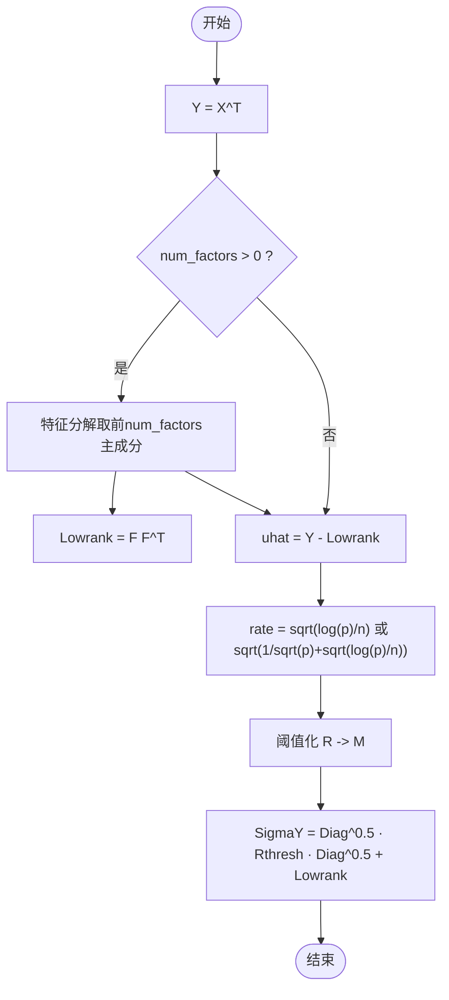
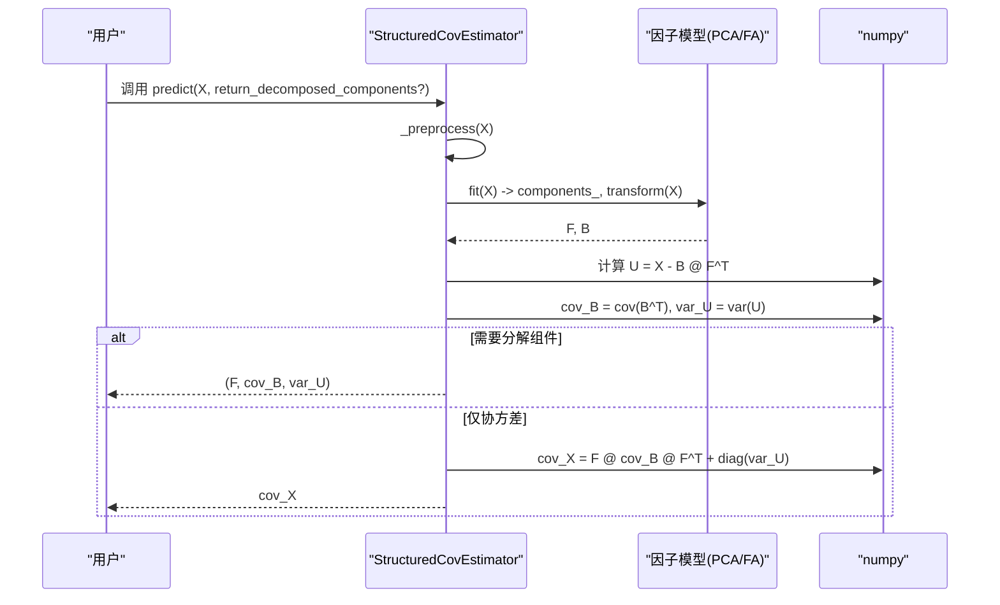
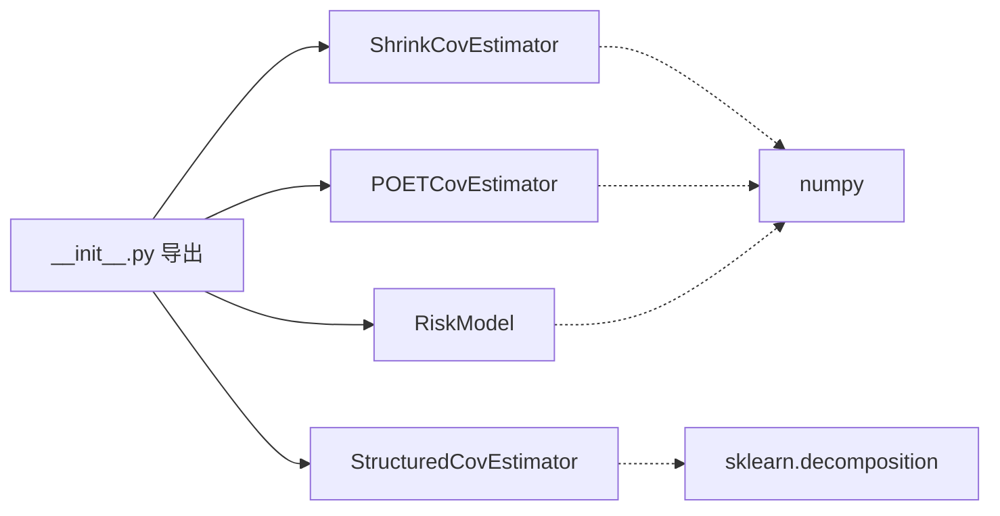

# 风险模型接口

<cite>
**本文引用的文件**
- [base.py](file://qlib/model/riskmodel/base.py)
- [shrink.py](file://qlib/model/riskmodel/shrink.py)
- [poet.py](file://qlib/model/riskmodel/poet.py)
- [structured.py](file://qlib/model/riskmodel/structured.py)
- [__init__.py](file://qlib/model/riskmodel/__init__.py)
- [prepare_riskdata.py](file://examples/portfolio/prepare_riskdata.py)
- [signal_strategy.py](file://qlib/contrib/strategy/signal_strategy.py)
- [test_structured_cov_estimator.py](file://tests/test_structured_cov_estimator.py)
</cite>

## 目录
1. [简介](#简介)
2. [项目结构](#项目结构)
3. [核心组件](#核心组件)
4. [架构总览](#架构总览)
5. [详细组件分析](#详细组件分析)
6. [依赖分析](#依赖分析)
7. [性能考虑](#性能考虑)
8. [故障排查指南](#故障排查指南)
9. [结论](#结论)
10. [附录](#附录)

## 简介
本文件面向Qlib的风险模型接口，系统性梳理风险模型的基础架构与实现原理，覆盖协方差矩阵估计、风险因子模型与结构化风险模型等核心能力。文档重点说明RiskModel基类的接口设计（风险计算方法、参数估计、模型校准等），并分别介绍Shrink、POET、Structured三类具体风险模型的API、参数配置、适用场景与性能特点。最后提供风险模型的实际应用示例、验证方法与性能评估指标，帮助读者在实践中高效使用与扩展。

## 项目结构
风险模型模块位于qlib/model/riskmodel目录，包含基类与三种具体实现：
- 基类：RiskModel，统一输入预处理、协方差估计流程与输出格式
- 具体实现：
  - ShrinkCovEstimator：收缩估计器，支持多种收缩目标与收缩参数估计策略
  - POETCovEstimator：主元正交补阈值估计器，适用于高维稀疏协方差估计
  - StructuredCovEstimator：结构化协方差估计器，基于潜在因子模型分解协方差

图表来源
- [base.py:40-112](file://qlib/model/riskmodel/base.py#L40-L112)
- [shrink.py:87-103](file://qlib/model/riskmodel/shrink.py#L87-L103)
- [poet.py:45-83](file://qlib/model/riskmodel/poet.py#L45-L83)
- [structured.py:69-94](file://qlib/model/riskmodel/structured.py#L69-L94)

章节来源
- [base.py:12-148](file://qlib/model/riskmodel/base.py#L12-L148)
- [shrink.py:7-260](file://qlib/model/riskmodel/shrink.py#L7-L260)
- [poet.py:6-84](file://qlib/model/riskmodel/poet.py#L6-L84)
- [structured.py:11-95](file://qlib/model/riskmodel/structured.py#L11-L95)
- [__init__.py:1-14](file://qlib/model/riskmodel/__init__.py#L1-L14)

## 核心组件
本节聚焦RiskModel基类的接口设计与通用流程，涵盖输入预处理、协方差估计、相关系数转换与可选的分解组件返回。

- 输入规范
  - 支持类型：pandas Series/DataFrame 或 numpy 数组
  - 维度约定：观测为行、变量为列；多时点可传入MultiIndex序列
  - 价格/收益切换：通过is_price控制是否先做百分比变化
  - 缩放选项：scale_return用于将收益率按百分比缩放
- 缺失值处理策略
  - ignore：忽略NaN（默认）
  - mask：将无效值掩码化，使用MaskedArray
  - fill：用0填充NaN
- 中心化
  - assume_centered为False时，对每列按非空均值中心化
- 协方差估计
  - 默认实现为经验协方差；子类可覆盖以实现不同估计策略
- 输出
  - 可返回协方差或相关系数矩阵；若提供列名则还原DataFrame
  - 可选择返回分解组件（如F、cov_B、var_U）

章节来源
- [base.py:22-112](file://qlib/model/riskmodel/base.py#L22-L112)
- [base.py:113-148](file://qlib/model/riskmodel/base.py#L113-L148)

## 架构总览
下图展示RiskModel及其三个子类的继承关系与关键方法调用链：

图表来源
- [base.py:12-148](file://qlib/model/riskmodel/base.py#L12-L148)
- [shrink.py:7-260](file://qlib/model/riskmodel/shrink.py#L7-L260)
- [poet.py:6-84](file://qlib/model/riskmodel/poet.py#L6-L84)
- [structured.py:11-95](file://qlib/model/riskmodel/structured.py#L11-L95)

## 详细组件分析

### RiskModel 基类
- 接口要点
  - predict：统一入口，负责数据预处理、协方差估计、相关系数转换与输出格式化
  - _predict：子类需实现的估计逻辑，默认经验协方差
  - _preprocess：统一的缺失值与中心化处理
- 关键行为
  - MultiIndex支持：自动解堆叠为宽表
  - 百分比变化：当is_price=True时，先做价格到收益的转换
  - 相关系数：通过协方差与标准差归一化得到
  - 分解组件：仅在子类支持时返回(F, cov_B, var_U)

章节来源
- [base.py:40-112](file://qlib/model/riskmodel/base.py#L40-L112)
- [base.py:113-148](file://qlib/model/riskmodel/base.py#L113-L148)

### ShrinkCovEstimator 收缩估计器
- 功能概述
  - 将样本协方差S收缩至目标矩阵F：S_hat = (1 - α) * S + α * F
  - 支持多种目标F与α估计策略
- 参数与配置
  - alpha：可选“lw”（Ledoit-Wolf）、“oas”（Oracle Approximating Shrinkage）或[0,1]浮点数
  - target：可选“const_var”（常方差）、“const_corr”（常相关）、“single_factor”（单因子模型）或自定义矩阵
- 收缩目标
  - 常方差：对角线为样本平均方差，非对角为0
  - 常相关：保持样本方差，所有成对相关取平均
  - 单因子模型：基于市场因子的单因子目标
- 收缩参数
  - oas：基于迹的闭式估计
  - lw：针对不同目标的专用估计公式
- 使用建议
  - 当数据存在缺失值时，建议设置nan_option为“mask”或“fill”
  - “oas”目前仅支持“const_var”目标

图表来源
- [shrink.py:87-103](file://qlib/model/riskmodel/shrink.py#L87-L103)
- [shrink.py:105-148](file://qlib/model/riskmodel/shrink.py#L105-L148)
- [shrink.py:150-260](file://qlib/model/riskmodel/shrink.py#L150-L260)

章节来源
- [shrink.py:54-103](file://qlib/model/riskmodel/shrink.py#L54-L103)
- [shrink.py:105-148](file://qlib/model/riskmodel/shrink.py#L105-L148)
- [shrink.py:150-260](file://qlib/model/riskmodel/shrink.py#L150-L260)

### POETCovEstimator 主元正交补阈值估计器
- 功能概述
  - 基于主元空间与正交补空间的阈值化估计，适合高维稀疏协方差矩阵
  - 可选因子个数num_factors，支持软阈值、硬阈值、SCAD阈值
- 参数与配置
  - num_factors：主成分个数；设为0表示不使用因子模型
  - thresh：阈值常数
  - thresh_method：阈值方法（soft/hard/scad）
- 算法要点
  - 对Y = X^T进行特征分解，保留前num_factors个主成分
  - 对正交补空间的残差进行阈值化，再重构协方差
  - 当num_factors=0时退化为直接对Y进行阈值化

图表来源
- [poet.py:45-83](file://qlib/model/riskmodel/poet.py#L45-L83)

章节来源
- [poet.py:19-44](file://qlib/model/riskmodel/poet.py#L19-L44)
- [poet.py:45-83](file://qlib/model/riskmodel/poet.py#L45-L83)

### StructuredCovEstimator 结构化估计器
- 功能概述
  - 假设观测由多个因子线性解释：X = B F^T + U
  - 协方差分解：cov(X^T) = F cov(B^T) F^T + diag(var(U))
  - 采用潜在因子模型指定F，支持PCA与Factor Analysis两种
- 参数与配置
  - factor_model：可选“pca”或“fa”
  - num_factors：保留的因子个数
  - nan_option：强制为“fill”，缺失值必须填充
- 返回能力
  - 可返回分解组件：F（因子载荷）、cov_B（因子协方差）、var_U（残差方差）
  - 默认返回完整协方差矩阵

图表来源
- [structured.py:69-94](file://qlib/model/riskmodel/structured.py#L69-L94)

章节来源
- [structured.py:45-68](file://qlib/model/riskmodel/structured.py#L45-L68)
- [structured.py:69-94](file://qlib/model/riskmodel/structured.py#L69-L94)

## 依赖分析
- 模块导出
  - riskmodel/__init__.py统一导出四个类，便于外部按名称导入
- 外部依赖
  - numpy：数值计算与线性代数
  - sklearn.decomposition：PCA与Factor Analysis（结构化模型）
- 内部耦合
  - 三个具体实现均继承RiskModel，共享统一的输入预处理与输出格式化逻辑
  - StructuredCovEstimator在缺失值处理上强制“fill”，与其他两类实现的灵活性形成对比

图表来源
- [__init__.py:1-14](file://qlib/model/riskmodel/__init__.py#L1-L14)
- [structured.py:6](file://qlib/model/riskmodel/structured.py#L6)

章节来源
- [__init__.py:1-14](file://qlib/model/riskmodel/__init__.py#L1-L14)
- [structured.py:6](file://qlib/model/riskmodel/structured.py#L6)

## 性能考虑
- 计算复杂度
  - RiskModel默认经验协方差：O(T·p^2)，T为观测数，p为变量数
  - ShrinkCovEstimator：额外引入α与F的计算，整体仍为O(T·p^2)
  - POETCovEstimator：含特征分解与阈值化，复杂度约O(p^3)（取决于特征分解实现）
  - StructuredCovEstimator：含PCA/FA拟合与协方差计算，复杂度约O(T·p·min(T,p))
- 内存占用
  - 高维情形下，协方差矩阵存储为O(p^2)，POET与Structured在大p时更节省内存
- 并行与缓存
  - 建议在批量数据上复用实例，避免重复初始化
  - 对于高频回测场景，可预先计算并缓存协方差矩阵

## 故障排查指南
- 缺失值问题
  - 若数据含NaN，需设置nan_option为“mask”或“fill”。ShrinkCovEstimator在“mask”模式下会返回掩码数组
- 输入维度与索引
  - MultiIndex输入会被自动解堆叠；确保列名一致以便输出DataFrame
- 收缩参数限制
  - 使用“oas”时，target必须为“const_var”
  - alpha必须在[0,1]范围内
- 结构化模型约束
  - StructuredCovEstimator要求nan_option为“fill”，否则会断言失败
- 验证与评估
  - 可参考测试文件对StructuredCovEstimator的回归测试，验证输出稳定性与一致性

章节来源
- [shrink.py:64-85](file://qlib/model/riskmodel/shrink.py#L64-L85)
- [structured.py:52-58](file://qlib/model/riskmodel/structured.py#L52-L58)
- [test_structured_cov_estimator.py](file://tests/test_structured_cov_estimator.py)

## 结论
Qlib的风险模型接口以RiskModel为统一抽象，结合Shrink、POET、Structured三类估计器，覆盖从稳健收缩到高维阈值化再到结构化因子分解的多种协方差估计路径。通过标准化的输入预处理与输出格式，用户可在不同场景下灵活选择模型，并依据自身数据特性与计算资源进行参数调优与性能优化。

## 附录

### 实际应用示例（步骤说明）
- 风险因子选择
  - 使用StructuredCovEstimator时，可通过factor_model选择“pca”或“fa”，并设置num_factors控制降维程度
- 模型参数设置
  - ShrinkCovEstimator：根据数据特性选择target（常方差/常相关/单因子模型）与alpha（lw/oas/固定值）
  - POETCovEstimator：设置num_factors、thresh与thresh_method（soft/hard/scad）
- 风险度量计算
  - 通过predict返回协方差或相关系数，进一步计算组合波动率、风险预算等
- 数据准备参考
  - 示例脚本展示了如何使用StructuredCovEstimator准备风险数据

章节来源
- [prepare_riskdata.py](file://examples/portfolio/prepare_riskdata.py)
- [signal_strategy.py:393](file://qlib/contrib/strategy/signal_strategy.py#L393)

### 验证方法与性能评估指标
- 回测集成
  - 在回测流程中，可利用多轮分析结果的均值、标准差与均值/标准差比值评估风险度量的稳定性
- 指标建议
  - 年化波动率、最大回撤、信息比率、风险预算一致性等
- 测试参考
  - 可参照测试文件对结构化协方差估计器的回归测试，确保模型输出稳定

章节来源
- [signal_strategy.py:393](file://qlib/contrib/strategy/signal_strategy.py#L393)
- [test_structured_cov_estimator.py](file://tests/test_structured_cov_estimator.py)