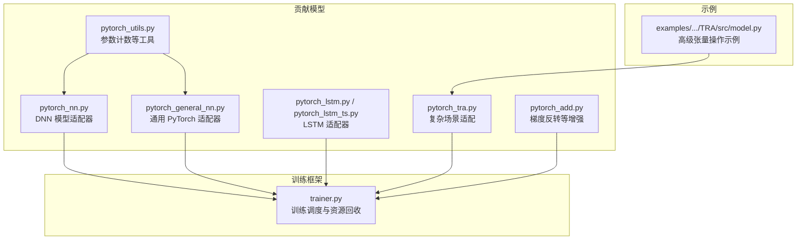
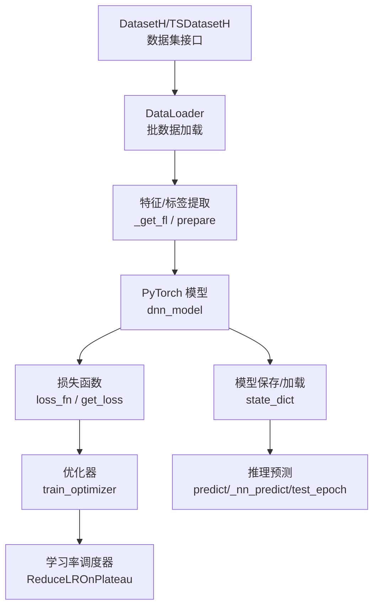
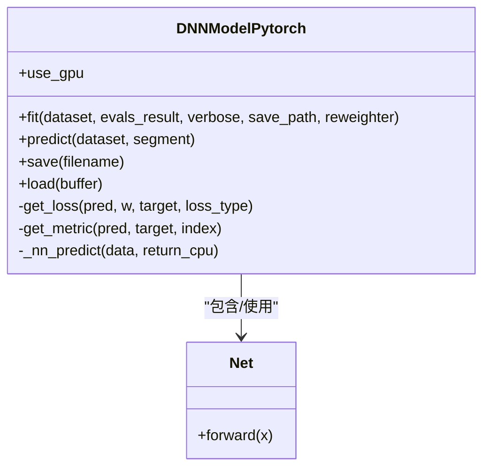
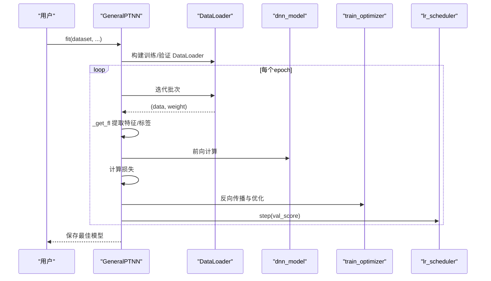
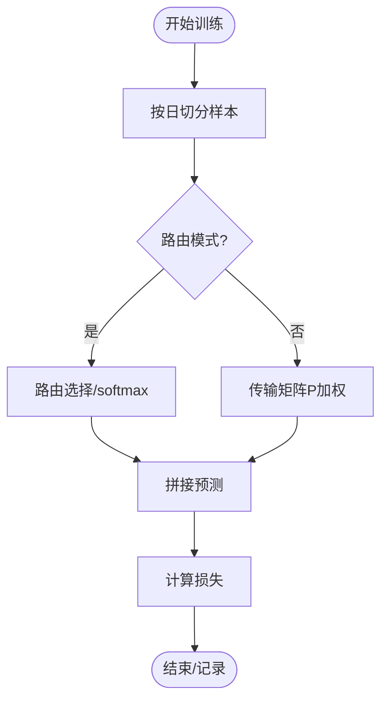
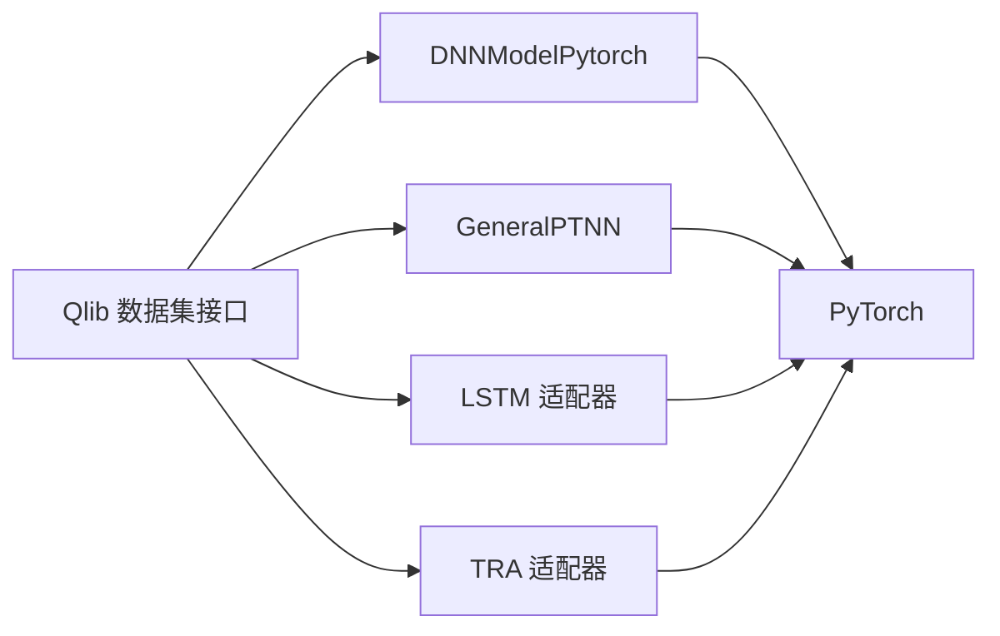

# PyTorch扩展贡献模块API

<cite>
**本文引用的文件**
- [pytorch_nn.py](file://qlib/contrib/model/pytorch_nn.py)
- [pytorch_general_nn.py](file://qlib/contrib/model/pytorch_general_nn.py)
- [pytorch_utils.py](file://qlib/contrib/model/pytorch_utils.py)
- [pytorch_lstm.py](file://qlib/contrib/model/pytorch_lstm.py)
- [pytorch_lstm_ts.py](file://qlib/contrib/model/pytorch_lstm_ts.py)
- [pytorch_tra.py](file://qlib/contrib/model/pytorch_tra.py)
- [trainer.py](file://qlib/model/trainer.py)
- [pytorch_add.py](file://qlib/contrib/model/pytorch_add.py)
- [model.py](file://examples/benchmarks/TRA/src/model.py)
</cite>

## 目录
1. [简介](#简介)
2. [项目结构](#项目结构)
3. [核心组件](#核心组件)
4. [架构总览](#架构总览)
5. [详细组件分析](#详细组件分析)
6. [依赖关系分析](#依赖关系分析)
7. [性能考虑](#性能考虑)
8. [故障排查指南](#故障排查指南)
9. [结论](#结论)
10. [附录](#附录)

## 简介
本文件为 Qlib 的 PyTorch 扩展贡献模块 API 参考文档，聚焦于以下目标：
- PyTorch 集成接口：张量操作、自动微分、GPU 加速等核心能力在 Qlib 中的封装与使用。
- 深度学习工具函数：模型构建、损失函数、优化器、学习率调度器等常用组件的统一适配。
- Qlib 与 PyTorch 的端到端集成：数据加载、模型训练、推理预测的完整流程。
- 分布式训练支持：多 GPU 训练（DataParallel）、数据并行、以及可扩展的模型并行思路。
- 模型适配与部署：状态字典序列化、版本兼容性处理、安全加载策略。
- 实战示例与性能优化：基于仓库中实际模型的使用方式与优化建议。

## 项目结构
与 PyTorch 扩展相关的关键目录与文件如下：
- 贡献模型模块：包含多种 PyTorch 模型适配器与通用适配器
  - DNN 模型适配器：pytorch_nn.py
  - 通用 PyTorch 模型适配器：pytorch_general_nn.py
  - 工具函数：pytorch_utils.py
  - 时间序列与表格数据适配：pytorch_lstm.py、pytorch_lstm_ts.py
  - 复杂场景（如 TRA）：pytorch_tra.py
  - 增强技术（梯度反转等）：pytorch_add.py
- 训练框架：model/trainer.py 提供训练任务的调度与子进程隔离机制
- 示例：examples/benchmarks/TRA/src/model.py 展示了高级张量操作与数值稳定性技巧

图表来源
- [pytorch_nn.py:1-464](file://qlib/contrib/model/pytorch_nn.py#L1-L464)
- [pytorch_general_nn.py:1-372](file://qlib/contrib/model/pytorch_general_nn.py#L1-L372)
- [pytorch_utils.py:1-38](file://qlib/contrib/model/pytorch_utils.py#L1-L38)
- [pytorch_lstm.py:108-150](file://qlib/contrib/model/pytorch_lstm.py#L108-L150)
- [pytorch_lstm_ts.py:113-156](file://qlib/contrib/model/pytorch_lstm_ts.py#L113-L156)
- [pytorch_tra.py:374-908](file://qlib/contrib/model/pytorch_tra.py#L374-L908)
- [pytorch_add.py:576-597](file://qlib/contrib/model/pytorch_add.py#L576-L597)
- [trainer.py:249-488](file://qlib/model/trainer.py#L249-L488)
- [model.py:566-593](file://examples/benchmarks/TRA/src/model.py#L566-L593)

章节来源
- [pytorch_nn.py:1-464](file://qlib/contrib/model/pytorch_nn.py#L1-L464)
- [pytorch_general_nn.py:1-372](file://qlib/contrib/model/pytorch_general_nn.py#L1-L372)
- [pytorch_utils.py:1-38](file://qlib/contrib/model/pytorch_utils.py#L1-L38)
- [pytorch_lstm.py:108-150](file://qlib/contrib/model/pytorch_lstm.py#L108-L150)
- [pytorch_lstm_ts.py:113-156](file://qlib/contrib/model/pytorch_lstm_ts.py#L113-L156)
- [pytorch_tra.py:374-908](file://qlib/contrib/model/pytorch_tra.py#L374-L908)
- [pytorch_add.py:576-597](file://qlib/contrib/model/pytorch_add.py#L576-L597)
- [trainer.py:249-488](file://qlib/model/trainer.py#L249-L488)
- [model.py:566-593](file://examples/benchmarks/TRA/src/model.py#L566-L593)

## 核心组件
本节概述 PyTorch 扩展模块的关键类与职责：
- DNN 模型适配器（DNNModelPytorch）
  - 支持自定义网络结构（Net），自动选择 GPU/CPU 设备，配置优化器与学习率调度器，提供训练、评估、保存/加载、预测等完整流程。
- 通用 PyTorch 适配器（GeneralPTNN）
  - 通过配置注入任意 PyTorch 模型，统一处理时间序列与表格数据的特征/标签提取、DataLoader 构建、训练/测试循环、早停与最佳模型保存。
- 工具函数（pytorch_utils）
  - 参数计数（count_parameters），用于统计模型参数规模与内存占用估算。
- LSTM 适配器（pytorch_lstm.py、pytorch_lstm_ts.py）
  - 面向时序与表格数据的 LSTM 模型封装，统一损失与指标接口。
- TRA 适配器（pytorch_tra.py）
  - 高级训练流程与复杂日级别聚合逻辑，包含路由/传输矩阵组合、损失聚合与安全加载。
- 增强模块（pytorch_add.py）
  - 包含梯度反转层（RevGrad）等增强技术，便于对抗训练或领域适应。
- 训练框架（trainer.py）
  - 提供训练任务的调度、子进程执行与资源回收，避免显存泄漏与内存碎片。

章节来源
- [pytorch_nn.py:39-464](file://qlib/contrib/model/pytorch_nn.py#L39-L464)
- [pytorch_general_nn.py:33-372](file://qlib/contrib/model/pytorch_general_nn.py#L33-L372)
- [pytorch_utils.py:7-38](file://qlib/contrib/model/pytorch_utils.py#L7-L38)
- [pytorch_lstm.py:108-150](file://qlib/contrib/model/pytorch_lstm.py#L108-L150)
- [pytorch_lstm_ts.py:113-156](file://qlib/contrib/model/pytorch_lstm_ts.py#L113-L156)
- [pytorch_tra.py:374-908](file://qlib/contrib/model/pytorch_tra.py#L374-L908)
- [pytorch_add.py:576-597](file://qlib/contrib/model/pytorch_add.py#L576-L597)
- [trainer.py:249-488](file://qlib/model/trainer.py#L249-L488)

## 架构总览
下图展示了从数据准备到模型训练与推理的整体架构，以及与 Qlib 数据集与工作流的对接关系。

图表来源
- [pytorch_general_nn.py:174-233](file://qlib/contrib/model/pytorch_general_nn.py#L174-L233)
- [pytorch_nn.py:190-387](file://qlib/contrib/model/pytorch_nn.py#L190-L387)
- [pytorch_lstm.py:136-150](file://qlib/contrib/model/pytorch_lstm.py#L136-L150)
- [pytorch_lstm_ts.py:141-156](file://qlib/contrib/model/pytorch_lstm_ts.py#L141-L156)

## 详细组件分析

### DNN 模型适配器（DNNModelPytorch）
- 关键职责
  - 设备选择与随机种子设置
  - 模型初始化（支持 DataParallel 数据并行）
  - 优化器与学习率调度器配置
  - 训练循环（前向、反向、裁剪、早停）
  - 评估与日志记录
  - 模型保存/加载（state_dict）
  - 推理预测（支持 CPU/GPU 切换与批量推理）
- 张量与自动微分
  - 使用 torch.no_grad 进行评估阶段的无梯度计算
  - 在训练阶段调用 loss.backward() 完成反向传播
  - 使用 torch.nn.utils.clip_grad_value_ 对梯度进行裁剪
- GPU 加速
  - 自动检测 CUDA 并将模型与张量移动至 GPU
  - 支持 DataParallel 进行数据并行
- 模型序列化
  - 保存 state_dict；加载时支持 map_location 以兼容不同设备

图表来源
- [pytorch_nn.py:39-464](file://qlib/contrib/model/pytorch_nn.py#L39-L464)

章节来源
- [pytorch_nn.py:39-464](file://qlib/contrib/model/pytorch_nn.py#L39-L464)

### 通用 PyTorch 适配器（GeneralPTNN）
- 关键职责
  - 通过配置注入任意 PyTorch 模型
  - 统一处理时间序列与表格数据的特征/标签提取
  - 构建 DataLoader，支持多进程加载
  - 训练/验证循环、早停、学习率调度
  - 推理预测与索引对齐
- 数据接口
  - _get_fl 根据输入张量维度区分时间序列与表格数据
  - 支持 TSDatasetH 与 DatasetH
- 损失与指标
  - loss_fn/metric_fn 统一接口，支持权重样本
- 性能特性
  - 使用 ReduceLROnPlateau 自适应调整学习率
  - 早停机制防止过拟合

图表来源
- [pytorch_general_nn.py:235-333](file://qlib/contrib/model/pytorch_general_nn.py#L235-L333)

章节来源
- [pytorch_general_nn.py:33-372](file://qlib/contrib/model/pytorch_general_nn.py#L33-L372)

### LSTM 适配器（pytorch_lstm.py / pytorch_lstm_ts.py）
- 共同点
  - 统一的损失与指标接口
  - 设备选择与随机种子设置
  - 优化器配置（Adam/SGD）
- 差异点
  - pytorch_lstm_ts.py 支持权重样本与更灵活的损失计算
  - 两者均提供 _get_fl 以适配时间序列与表格数据

章节来源
- [pytorch_lstm.py:108-150](file://qlib/contrib/model/pytorch_lstm.py#L108-L150)
- [pytorch_lstm_ts.py:113-156](file://qlib/contrib/model/pytorch_lstm_ts.py#L113-L156)

### TRA 适配器（pytorch_tra.py）
- 高级训练流程
  - 日级别样本聚合与路由/传输矩阵组合
  - 支持 router 与 P 矩阵两种组合策略
  - 复杂损失聚合与预测拼接
- 安全加载
  - load_state_dict_unsafe 提供忽略异常的安全加载策略

图表来源
- [pytorch_tra.py:863-883](file://qlib/contrib/model/pytorch_tra.py#L863-L883)

章节来源
- [pytorch_tra.py:374-908](file://qlib/contrib/model/pytorch_tra.py#L374-L908)

### 增强模块（pytorch_add.py）
- RevGrad（梯度反转层）
  - 在反向传播时反转梯度符号，常用于对抗训练
  - 支持动态 alpha 调整

章节来源
- [pytorch_add.py:576-597](file://qlib/contrib/model/pytorch_add.py#L576-L597)

### 示例：高级张量操作（examples/benchmarks/TRA/src/model.py）
- 数值稳定性
  - shoot_infs 将无穷大替换为张量最大值，避免 NaN/Inf 影响 Sinkhorn 迭代
- Sinkhorn 算法
  - 在固定 epsilon 下进行多次行/列归一化，返回概率转移矩阵

章节来源
- [model.py:566-593](file://examples/benchmarks/TRA/src/model.py#L566-L593)

## 依赖关系分析
- 组件耦合
  - DNNModelPytorch 与 GeneralPTNN 均依赖 Qlib 的 DatasetH/TSDatasetH 与 DataHandlerLP
  - 二者均通过 torch.optim 与 torch.nn.utils.clip_grad_value_ 进行优化与梯度控制
  - TRA 适配器依赖复杂的数据聚合与路由逻辑
- 外部依赖
  - PyTorch 版本差异：在学习率调度器参数兼容性上做了条件分支处理
  - NumPy/Pandas 用于数据预处理与索引对齐

图表来源
- [pytorch_nn.py:22-36](file://qlib/contrib/model/pytorch_nn.py#L22-L36)
- [pytorch_general_nn.py:20-31](file://qlib/contrib/model/pytorch_general_nn.py#L20-L31)
- [pytorch_lstm.py:108-126](file://qlib/contrib/model/pytorch_lstm.py#L108-L126)
- [pytorch_tra.py:374-392](file://qlib/contrib/model/pytorch_tra.py#L374-L392)

章节来源
- [pytorch_nn.py:22-36](file://qlib/contrib/model/pytorch_nn.py#L22-L36)
- [pytorch_general_nn.py:20-31](file://qlib/contrib/model/pytorch_general_nn.py#L20-L31)
- [pytorch_lstm.py:108-126](file://qlib/contrib/model/pytorch_lstm.py#L108-L126)
- [pytorch_tra.py:374-392](file://qlib/contrib/model/pytorch_tra.py#L374-L392)

## 性能考虑
- 显存管理
  - 训练完成后及时清空 CUDA 缓存（DNNModelPytorch/GeneralPTNN）
  - 使用 torch.no_grad 在评估阶段减少内存占用
- 梯度控制
  - 使用 clip_grad_value_ 控制梯度范数，提升训练稳定性
- 学习率调度
  - 采用 ReduceLROnPlateau 动态调整学习率，避免过拟合并加速收敛
- 数据加载
  - 使用 DataLoader 的多进程加载（n_jobs）与 drop_last，提升吞吐
- 参数规模监控
  - 使用 count_parameters 估算模型大小，辅助硬件选型与内存规划

章节来源
- [pytorch_nn.py:335-337](file://qlib/contrib/model/pytorch_nn.py#L335-L337)
- [pytorch_general_nn.py:140-145](file://qlib/contrib/model/pytorch_general_nn.py#L140-L145)
- [pytorch_utils.py:7-38](file://qlib/contrib/model/pytorch_utils.py#L7-L38)

## 故障排查指南
- 训练阶段显存不足
  - 减小 batch_size 或启用 torch.cuda.empty_cache
  - 在评估阶段使用 torch.no_grad
- 学习率调度器报错（版本差异）
  - 检查 PyTorch 版本，必要时调整调度器参数（已在代码中做兼容处理）
- 模型加载失败
  - 使用 load_state_dict_unsafe 忽略部分键不匹配问题（TRA 适配器）
  - 确认 map_location 与设备一致
- 指标异常或 NaN
  - 检查标签与权重是否包含 NaN/Inf，必要时使用数值稳定技巧（如 TRA 示例中的无穷大处理）

章节来源
- [pytorch_tra.py:886-908](file://qlib/contrib/model/pytorch_tra.py#L886-L908)
- [pytorch_general_nn.py:140-145](file://qlib/contrib/model/pytorch_general_nn.py#L140-L145)
- [model.py:566-593](file://examples/benchmarks/TRA/src/model.py#L566-L593)

## 结论
Qlib 的 PyTorch 扩展贡献模块提供了从模型适配、训练到推理的完整链路，覆盖了表格与时间序列数据、多 GPU 数据并行、学习率调度、梯度控制与数值稳定性等关键能力。通过统一的接口与灵活的配置注入，用户可以快速将任意 PyTorch 模型接入 Qlib 工作流，并在量化投资场景中高效迭代与部署。

## 附录
- 端到端使用建议
  - 数据准备：使用 DatasetH/TSDatasetH 与 DataHandlerLP
  - 模型选择：优先使用 GeneralPTNN 注入自定义模型；需要精细控制时使用 DNNModelPytorch
  - 训练：结合 ReduceLROnPlateau 与早停，合理设置 batch_size 与 n_jobs
  - 推理：注意设备一致性与索引对齐，确保输出可被 Qlib 报告与回测模块消费
- 分布式训练
  - 数据并行：DNNModelPytorch 支持 DataParallel；若需模型并行，可在自定义模型中实现并配合分布式策略
- 模型部署
  - 使用 state_dict 序列化；加载时注意 map_location 与设备映射；必要时使用安全加载策略