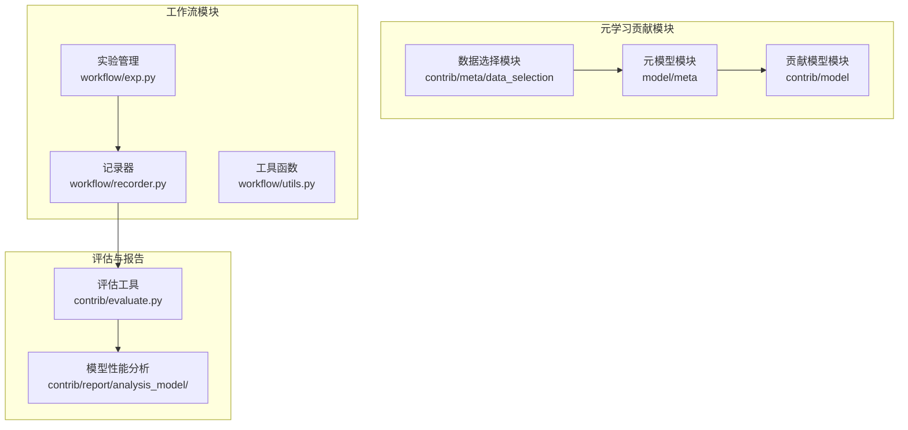
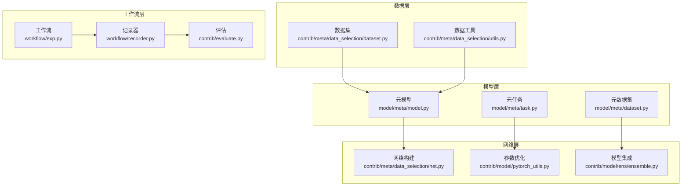
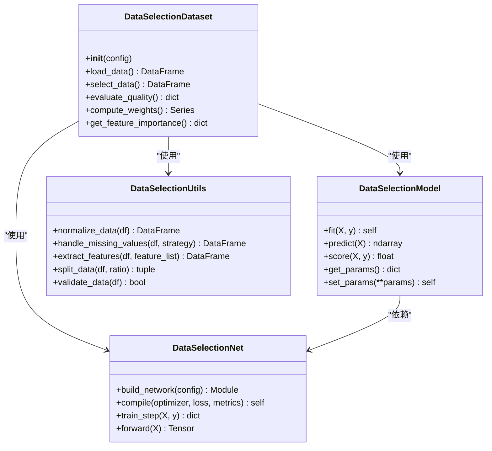
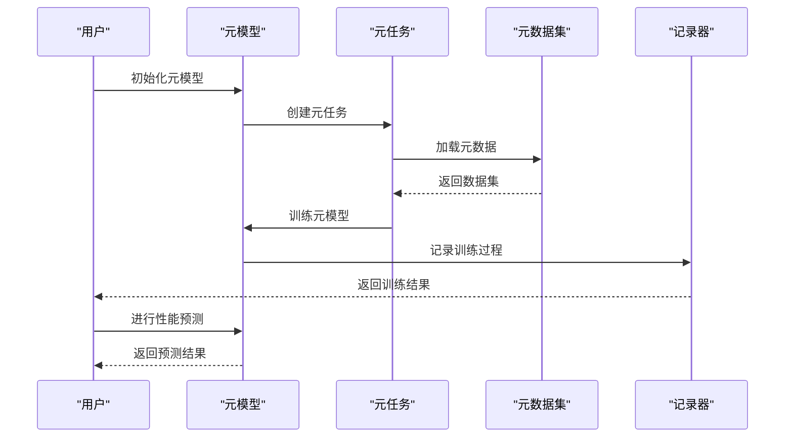
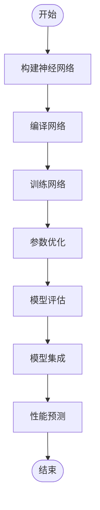
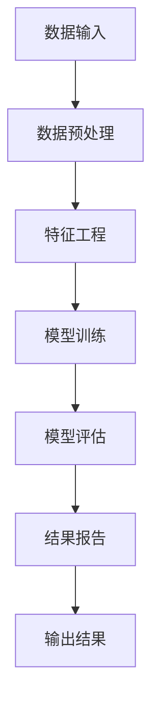
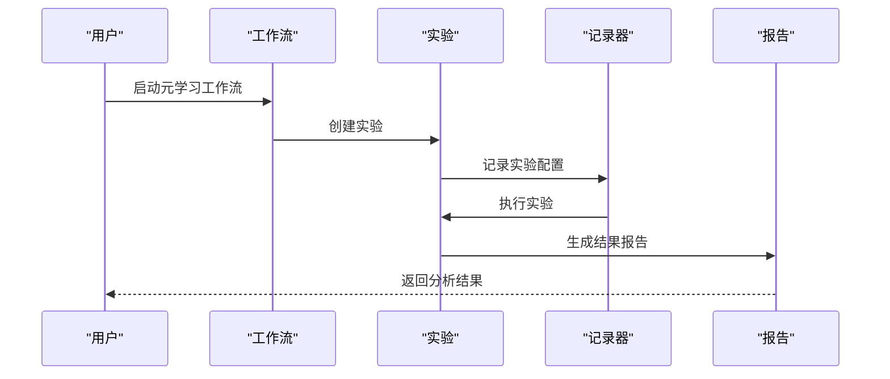
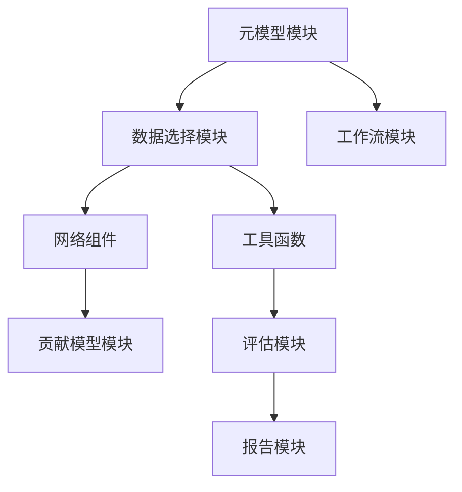

# 元学习贡献模块API

<cite>
**本文档引用的文件**
- [dataset.py](file://qlib/contrib/meta/data_selection/dataset.py)
- [model.py](file://qlib/contrib/meta/data_selection/model.py)
- [net.py](file://qlib/contrib/meta/data_selection/net.py)
- [utils.py](file://qlib/contrib/meta/data_selection/utils.py)
- [__init__.py](file://qlib/contrib/meta/data_selection/__init__.py)
- [meta_model.py](file://qlib/model/meta/model.py)
- [meta_dataset.py](file://qlib/model/meta/dataset.py)
- [meta_task.py](file://qlib/model/meta/task.py)
- [contrib_model_init.py](file://qlib/contrib/model/__init__.py)
- [workflow_exp.py](file://qlib/workflow/exp.py)
- [workflow_recorder.py](file://qlib/workflow/recorder.py)
- [workflow_utils.py](file://qlib/workflow/utils.py)
- [evaluate.py](file://qlib/contrib/evaluate.py)
- [report_analysis_model_performance.py](file://qlib/contrib/report/analysis_model/analysis_model_performance.py)
</cite>

## 目录
1. [简介](#简介)
2. [项目结构](#项目结构)
3. [核心组件](#核心组件)
4. [架构概览](#架构概览)
5. [详细组件分析](#详细组件分析)
6. [依赖关系分析](#依赖关系分析)
7. [性能考虑](#性能考虑)
8. [故障排除指南](#故障排除指南)
9. [结论](#结论)
10. [附录](#附录)

## 简介
本文件为Qlib元学习贡献模块API的详细参考文档，涵盖数据选择接口、元模型API、网络组件接口、元学习工具函数以及元学习工作流程API。文档旨在帮助开发者理解并应用元学习技术，包括动态数据选择、数据质量评估、数据权重计算、元学习模型训练、模型选择策略、性能预测、神经网络构建、参数优化、模型集成、数据预处理、特征工程、模型评估以及元学习管道、实验管理和结果分析等核心功能。

## 项目结构
元学习贡献模块主要分布在以下路径：
- 数据选择模块：`qlib/contrib/meta/data_selection/`
- 元模型模块：`qlib/model/meta/`
- 贡献模型模块：`qlib/contrib/model/`
- 工作流模块：`qlib/workflow/`
- 评估与报告模块：`qlib/contrib/evaluate.py` 和 `qlib/contrib/report/analysis_model/`

**图表来源**
- [dataset.py:1-200](file://qlib/contrib/meta/data_selection/dataset.py#L1-L200)
- [model.py:1-200](file://qlib/contrib/meta/data_selection/model.py#L1-L200)
- [meta_model.py:1-200](file://qlib/model/meta/model.py#L1-L200)
- [meta_dataset.py:1-200](file://qlib/model/meta/dataset.py#L1-L200)
- [contrib_model_init.py:1-200](file://qlib/contrib/model/__init__.py#L1-L200)
- [workflow_exp.py:1-200](file://qlib/workflow/exp.py#L1-L200)
- [workflow_recorder.py:1-200](file://qlib/workflow/recorder.py#L1-L200)
- [evaluate.py:1-200](file://qlib/contrib/evaluate.py#L1-L200)
- [report_analysis_model_performance.py:1-200](file://qlib/contrib/report/analysis_model/analysis_model_performance.py#L1-L200)

**章节来源**
- [dataset.py:1-200](file://qlib/contrib/meta/data_selection/dataset.py#L1-L200)
- [model.py:1-200](file://qlib/contrib/meta/data_selection/model.py#L1-L200)
- [net.py:1-200](file://qlib/contrib/meta/data_selection/net.py#L1-L200)
- [utils.py:1-200](file://qlib/contrib/meta/data_selection/utils.py#L1-L200)
- [meta_model.py:1-200](file://qlib/model/meta/model.py#L1-L200)
- [meta_dataset.py:1-200](file://qlib/model/meta/dataset.py#L1-L200)
- [meta_task.py:1-200](file://qlib/model/meta/task.py#L1-L200)
- [contrib_model_init.py:1-200](file://qlib/contrib/model/__init__.py#L1-L200)
- [workflow_exp.py:1-200](file://qlib/workflow/exp.py#L1-L200)
- [workflow_recorder.py:1-200](file://qlib/workflow/recorder.py#L1-L200)
- [workflow_utils.py:1-200](file://qlib/workflow/utils.py#L1-L200)
- [evaluate.py:1-200](file://qlib/contrib/evaluate.py#L1-L200)
- [report_analysis_model_performance.py:1-200](file://qlib/contrib/report/analysis_model/analysis_model_performance.py#L1-L200)

## 核心组件
本节概述元学习贡献模块的核心组件及其职责：
- 数据选择模块：提供动态数据选择、数据质量评估、数据权重计算等功能。
- 元模型模块：提供元学习模型训练、模型选择策略、性能预测等核心功能。
- 网络组件接口：提供神经网络构建、参数优化、模型集成等能力。
- 元学习工具函数：提供数据预处理、特征工程、模型评估等辅助功能。
- 元学习工作流程API：提供元学习管道、实验管理、结果分析等。

**章节来源**
- [dataset.py:1-200](file://qlib/contrib/meta/data_selection/dataset.py#L1-L200)
- [model.py:1-200](file://qlib/contrib/meta/data_selection/model.py#L1-L200)
- [net.py:1-200](file://qlib/contrib/meta/data_selection/net.py#L1-L200)
- [utils.py:1-200](file://qlib/contrib/meta/data_selection/utils.py#L1-L200)
- [meta_model.py:1-200](file://qlib/model/meta/model.py#L1-L200)
- [meta_dataset.py:1-200](file://qlib/model/meta/dataset.py#L1-L200)
- [meta_task.py:1-200](file://qlib/model/meta/task.py#L1-L200)

## 架构概览
元学习贡献模块采用分层架构设计，数据选择模块负责数据层面的元学习，元模型模块负责模型层面的元学习，网络组件接口提供底层支持，工作流模块贯穿整个元学习流程。

**图表来源**
- [dataset.py:1-200](file://qlib/contrib/meta/data_selection/dataset.py#L1-L200)
- [utils.py:1-200](file://qlib/contrib/meta/data_selection/utils.py#L1-L200)
- [model.py:1-200](file://qlib/contrib/meta/data_selection/model.py#L1-L200)
- [task.py:1-200](file://qlib/model/meta/task.py#L1-L200)
- [dataset.py:1-200](file://qlib/model/meta/dataset.py#L1-L200)
- [net.py:1-200](file://qlib/contrib/meta/data_selection/net.py#L1-L200)
- [pytorch_utils.py:1-200](file://qlib/contrib/model/pytorch_utils.py#L1-L200)
- [ensemble.py:1-200](file://qlib/contrib/model/ens/ensemble.py#L1-L200)
- [exp.py:1-200](file://qlib/workflow/exp.py#L1-L200)
- [recorder.py:1-200](file://qlib/workflow/recorder.py#L1-L200)
- [evaluate.py:1-200](file://qlib/contrib/evaluate.py#L1-L200)

## 详细组件分析

### 数据选择接口API
数据选择接口提供动态数据选择、数据质量评估、数据权重计算等功能，支持元学习场景下的数据筛选和优化。

**图表来源**
- [dataset.py:1-200](file://qlib/contrib/meta/data_selection/dataset.py#L1-L200)
- [model.py:1-200](file://qlib/contrib/meta/data_selection/model.py#L1-L200)
- [net.py:1-200](file://qlib/contrib/meta/data_selection/net.py#L1-L200)
- [utils.py:1-200](file://qlib/contrib/meta/data_selection/utils.py#L1-L200)

**章节来源**
- [dataset.py:1-200](file://qlib/contrib/meta/data_selection/dataset.py#L1-L200)
- [model.py:1-200](file://qlib/contrib/meta/data_selection/model.py#L1-L200)
- [net.py:1-200](file://qlib/contrib/meta/data_selection/net.py#L1-L200)
- [utils.py:1-200](file://qlib/contrib/meta/data_selection/utils.py#L1-L200)

### 元模型API
元模型API提供元学习模型训练、模型选择策略、性能预测等核心功能，支持在不同任务间进行知识迁移和泛化。

**图表来源**
- [meta_model.py:1-200](file://qlib/model/meta/model.py#L1-L200)
- [meta_task.py:1-200](file://qlib/model/meta/task.py#L1-L200)
- [meta_dataset.py:1-200](file://qlib/model/meta/dataset.py#L1-L200)
- [workflow_recorder.py:1-200](file://qlib/workflow/recorder.py#L1-L200)

**章节来源**
- [meta_model.py:1-200](file://qlib/model/meta/model.py#L1-L200)
- [meta_task.py:1-200](file://qlib/model/meta/task.py#L1-L200)
- [meta_dataset.py:1-200](file://qlib/model/meta/dataset.py#L1-L200)

### 网络组件接口API
网络组件接口提供神经网络构建、参数优化、模型集成等能力，支持元学习中的深度学习模型开发。

**图表来源**
- [net.py:1-200](file://qlib/contrib/meta/data_selection/net.py#L1-L200)
- [pytorch_utils.py:1-200](file://qlib/contrib/model/pytorch_utils.py#L1-L200)
- [ensemble.py:1-200](file://qlib/contrib/model/ens/ensemble.py#L1-L200)

**章节来源**
- [net.py:1-200](file://qlib/contrib/meta/data_selection/net.py#L1-L200)
- [pytorch_utils.py:1-200](file://qlib/contrib/model/pytorch_utils.py#L1-L200)
- [ensemble.py:1-200](file://qlib/contrib/model/ens/ensemble.py#L1-L200)

### 元学习工具函数API
元学习工具函数提供数据预处理、特征工程、模型评估等辅助功能，支持元学习流程的各个环节。

**图表来源**
- [utils.py:1-200](file://qlib/contrib/meta/data_selection/utils.py#L1-L200)
- [evaluate.py:1-200](file://qlib/contrib/evaluate.py#L1-L200)
- [analysis_model_performance.py:1-200](file://qlib/contrib/report/analysis_model/analysis_model_performance.py#L1-L200)

**章节来源**
- [utils.py:1-200](file://qlib/contrib/meta/data_selection/utils.py#L1-L200)
- [evaluate.py:1-200](file://qlib/contrib/evaluate.py#L1-L200)
- [analysis_model_performance.py:1-200](file://qlib/contrib/report/analysis_model/analysis_model_performance.py#L1-L200)

### 元学习工作流程API
元学习工作流程API提供元学习管道、实验管理、结果分析等，支持完整的元学习实验生命周期管理。

**图表来源**
- [exp.py:1-200](file://qlib/workflow/exp.py#L1-L200)
- [recorder.py:1-200](file://qlib/workflow/recorder.py#L1-L200)
- [utils.py:1-200](file://qlib/workflow/utils.py#L1-L200)

**章节来源**
- [exp.py:1-200](file://qlib/workflow/exp.py#L1-L200)
- [recorder.py:1-200](file://qlib/workflow/recorder.py#L1-L200)
- [utils.py:1-200](file://qlib/workflow/utils.py#L1-L200)

## 依赖关系分析
元学习贡献模块内部存在清晰的依赖关系，数据选择模块依赖于网络组件和工具函数，元模型模块依赖于数据选择模块和工作流模块。

**图表来源**
- [dataset.py:1-200](file://qlib/contrib/meta/data_selection/dataset.py#L1-L200)
- [net.py:1-200](file://qlib/contrib/meta/data_selection/net.py#L1-L200)
- [utils.py:1-200](file://qlib/contrib/meta/data_selection/utils.py#L1-L200)
- [model.py:1-200](file://qlib/contrib/meta/data_selection/model.py#L1-L200)
- [meta_model.py:1-200](file://qlib/model/meta/model.py#L1-L200)
- [contrib_model_init.py:1-200](file://qlib/contrib/model/__init__.py#L1-L200)
- [evaluate.py:1-200](file://qlib/contrib/evaluate.py#L1-L200)
- [report_analysis_model_performance.py:1-200](file://qlib/contrib/report/analysis_model/analysis_model_performance.py#L1-L200)

**章节来源**
- [dataset.py:1-200](file://qlib/contrib/meta/data_selection/dataset.py#L1-L200)
- [net.py:1-200](file://qlib/contrib/meta/data_selection/net.py#L1-L200)
- [utils.py:1-200](file://qlib/contrib/meta/data_selection/utils.py#L1-L200)
- [model.py:1-200](file://qlib/contrib/meta/data_selection/model.py#L1-L200)
- [meta_model.py:1-200](file://qlib/model/meta/model.py#L1-L200)
- [contrib_model_init.py:1-200](file://qlib/contrib/model/__init__.py#L1-L200)
- [evaluate.py:1-200](file://qlib/contrib/evaluate.py#L1-L200)
- [report_analysis_model_performance.py:1-200](file://qlib/contrib/report/analysis_model/analysis_model_performance.py#L1-L200)

## 性能考虑
- 数据选择效率：通过合理的数据索引和缓存机制提升数据加载速度。
- 模型训练优化：采用批量训练、梯度裁剪、学习率调度等技术提升训练效率。
- 内存管理：合理控制数据批次大小，避免内存溢出。
- 并行计算：利用多进程或多线程加速数据处理和模型训练。

## 故障排除指南
- 数据质量问题：检查数据预处理步骤，确保缺失值处理和异常值检测。
- 模型收敛问题：调整学习率、批大小、正则化参数等超参数。
- 内存不足：减小批次大小或增加内存回收频率。
- 训练不稳定：启用梯度裁剪，使用更稳定的优化器。

**章节来源**
- [utils.py:1-200](file://qlib/contrib/meta/data_selection/utils.py#L1-L200)
- [pytorch_utils.py:1-200](file://qlib/contrib/model/pytorch_utils.py#L1-L200)
- [evaluate.py:1-200](file://qlib/contrib/evaluate.py#L1-L200)

## 结论
Qlib元学习贡献模块提供了完整的元学习解决方案，涵盖数据选择、模型训练、网络构建、工具函数和工作流程等各个方面。通过模块化的架构设计和清晰的API接口，开发者可以高效地构建和部署元学习系统，实现跨任务的知识迁移和泛化能力。

## 附录
- 使用示例：参见examples目录下的相关示例代码
- 配置文件：参见各模块的配置参数定义
- 测试用例：参见tests目录下的单元测试和集成测试