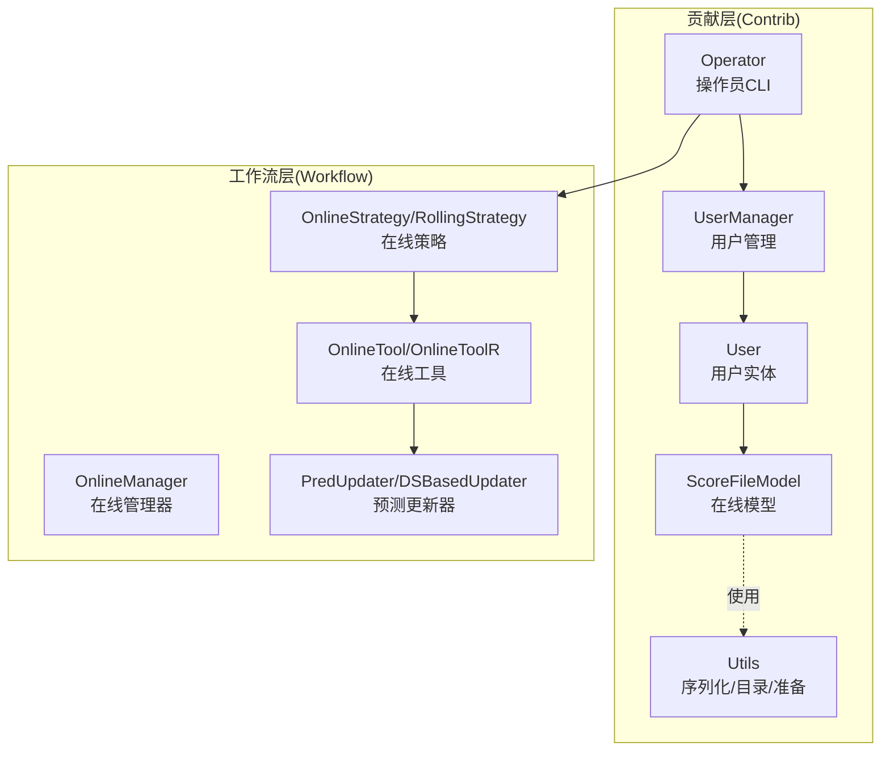
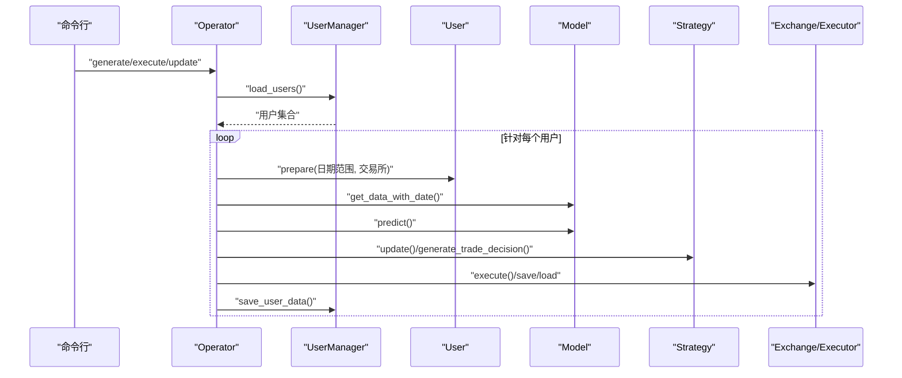
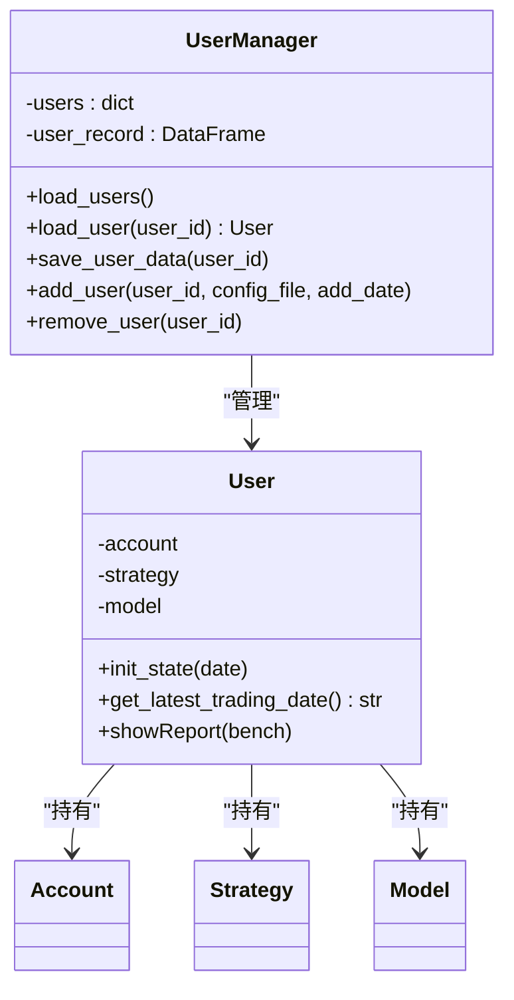
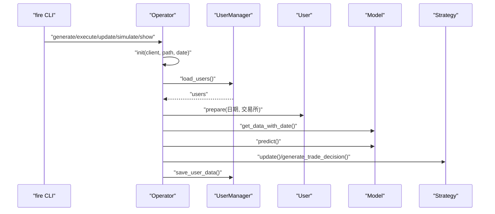
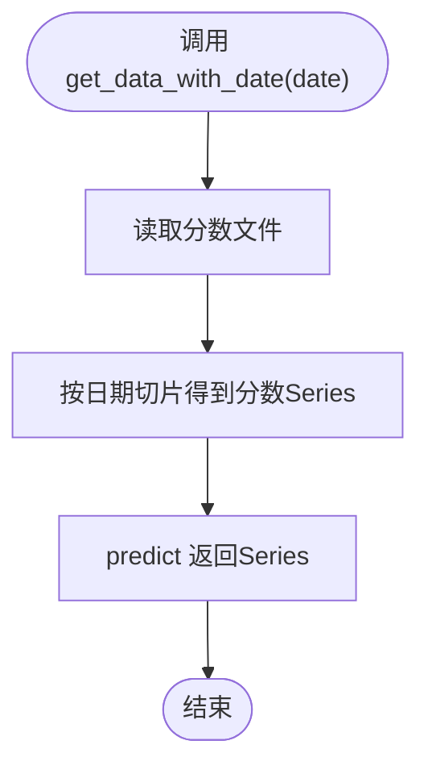
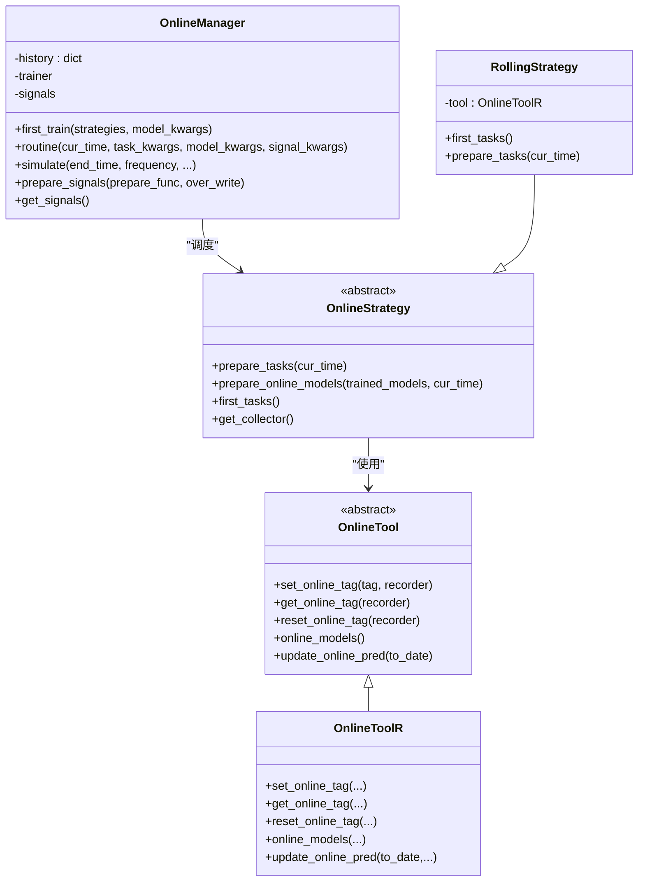
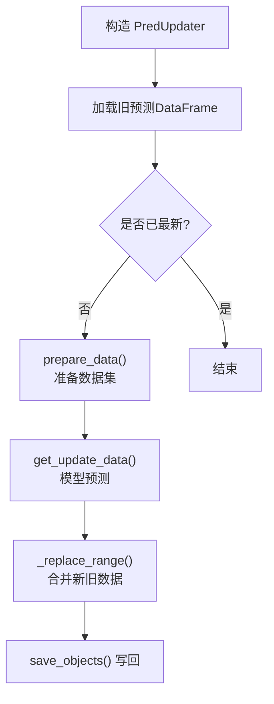
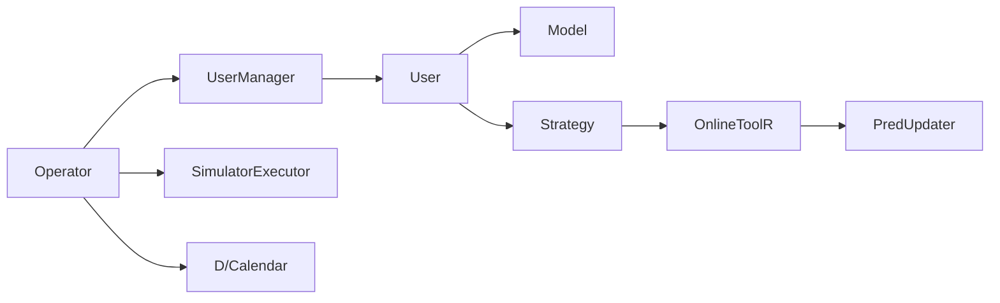

# 在线服务贡献模块API

<cite>
**本文引用的文件**
- [manager.py](file://qlib/contrib/online/manager.py)
- [operator.py](file://qlib/contrib/online/operator.py)
- [user.py](file://qlib/contrib/online/user.py)
- [utils.py](file://qlib/contrib/online/utils.py)
- [online_model.py](file://qlib/contrib/online/online_model.py)
- [manager.py](file://qlib/workflow/online/manager.py)
- [strategy.py](file://qlib/workflow/online/strategy.py)
- [utils.py](file://qlib/workflow/online/utils.py)
- [update.py](file://qlib/workflow/online/update.py)
- [online.rst](file://docs/component/online.rst)
- [online.rst](file://docs/hidden/online.rst)
</cite>

## 目录
1. [简介](#简介)
2. [项目结构](#项目结构)
3. [核心组件](#核心组件)
4. [架构总览](#架构总览)
5. [详细组件分析](#详细组件分析)
6. [依赖关系分析](#依赖关系分析)
7. [性能与可靠性考量](#性能与可靠性考量)
8. [故障排查指南](#故障排查指南)
9. [结论](#结论)
10. [附录：API参考与使用示例](#附录api参考与使用示例)

## 简介
本文件为 Qlib 在线服务贡献模块的完整 API 参考文档，覆盖以下主题：
- 在线模型管理接口：模型注册、模型加载、模型更新、模型版本管理（基于记录器标签与实验）
- 在线预测 API：实时预测、批量预测、预测结果处理
- 操作员接口：在线服务操作、权限与流程控制、服务监控
- 用户管理 API：用户认证、用户授权、用户行为追踪（账户与策略）
- 在线服务工具函数：服务配置、连接管理、错误处理等辅助能力
- 在线服务部署与运维：任务生成、模型切换、信号准备、历史回放与模拟

本参考面向开发者与运维人员，既提供高层概览也给出代码级映射，便于快速集成与稳定运行。

## 项目结构
在线服务贡献模块位于两个层次：
- 贡献层（contrib）：面向具体业务场景的在线交易流水线，包含用户、操作员、模型与工具
- 工作流层（workflow/online）：面向实验与任务管理的在线策略、工具与更新器

图表来源
- [manager.py:17-149](file://qlib/contrib/online/manager.py#L17-L149)
- [operator.py:27-321](file://qlib/contrib/online/operator.py#L27-L321)
- [user.py:14-78](file://qlib/contrib/online/user.py#L14-L78)
- [online_model.py:13-40](file://qlib/contrib/online/online_model.py#L13-L40)
- [utils.py:21-101](file://qlib/contrib/online/utils.py#L21-L101)
- [manager.py:101-383](file://qlib/workflow/online/manager.py#L101-L383)
- [strategy.py:19-209](file://qlib/workflow/online/strategy.py#L19-L209)
- [utils.py:19-188](file://qlib/workflow/online/utils.py#L19-L188)
- [update.py:21-299](file://qlib/workflow/online/update.py#L21-L299)

章节来源
- [online.rst:1-56](file://docs/component/online.rst#L1-L56)
- [online.rst:163-283](file://docs/hidden/online.rst#L163-L283)

## 核心组件
- 用户与账户：User 封装账户、策略与模型；UserManager 负责用户生命周期与持久化
- 操作员：Operator 提供命令行入口，执行“生成订单->执行->更新账户”全流程
- 在线模型：ScoreFileModel 提供从分数文件加载预测的能力
- 在线策略与管理：OnlineStrategy 定义任务生成与模型上线策略；OnlineManager 统筹训练、模型上线与信号准备
- 在线工具：OnlineTool/OnlineToolR 管理模型在线状态与预测更新
- 预测更新器：PredUpdater/DSBasedUpdater 基于数据集增量更新预测与标签

章节来源
- [manager.py:17-149](file://qlib/contrib/online/manager.py#L17-L149)
- [operator.py:27-321](file://qlib/contrib/online/operator.py#L27-L321)
- [user.py:14-78](file://qlib/contrib/online/user.py#L14-L78)
- [online_model.py:13-40](file://qlib/contrib/online/online_model.py#L13-L40)
- [manager.py:101-383](file://qlib/workflow/online/manager.py#L101-L383)
- [strategy.py:19-209](file://qlib/workflow/online/strategy.py#L19-L209)
- [utils.py:19-188](file://qlib/workflow/online/utils.py#L19-L188)
- [update.py:21-299](file://qlib/workflow/online/update.py#L21-L299)

## 架构总览
在线服务由“贡献层”与“工作流层”协同完成：
- 贡献层负责用户态的账户、策略与模型的加载与保存，并通过 Operator 执行日常交易流程
- 工作流层负责实验态的任务生成、模型训练、模型上线与信号准备，并支持历史回放与模拟

图表来源
- [operator.py:102-211](file://qlib/contrib/online/operator.py#L102-L211)
- [utils.py:61-101](file://qlib/contrib/online/utils.py#L61-L101)
- [manager.py:46-94](file://qlib/contrib/online/manager.py#L46-L94)

## 详细组件分析

### 用户与账户（User 与 UserManager）
- User：封装账户、策略与模型，提供每日初始化、最新交易日查询与报告展示
- UserManager：负责用户数据的加载、保存、新增与删除；从磁盘恢复账户、策略与模型实例

图表来源
- [user.py:14-78](file://qlib/contrib/online/user.py#L14-L78)
- [manager.py:17-149](file://qlib/contrib/online/manager.py#L17-L149)

章节来源
- [user.py:14-78](file://qlib/contrib/online/user.py#L14-L78)
- [manager.py:17-149](file://qlib/contrib/online/manager.py#L17-L149)

### 操作员（Operator）
- 提供命令行入口，支持初始化、添加/移除用户、生成订单、执行订单、更新账户、模拟运行与报告展示
- 内部通过 prepare 计算日期序列与交易所参数，驱动模型预测与策略决策

图表来源
- [operator.py:38-321](file://qlib/contrib/online/operator.py#L38-L321)
- [utils.py:61-101](file://qlib/contrib/online/utils.py#L61-L101)

章节来源
- [operator.py:27-321](file://qlib/contrib/online/operator.py#L27-L321)

### 在线模型（ScoreFileModel）
- 从 CSV 文件加载多索引分数表，按日期返回股票分数序列
- predict 直接返回输入序列，适合离线分数驱动的在线策略

图表来源
- [online_model.py:22-30](file://qlib/contrib/online/online_model.py#L22-L30)

章节来源
- [online_model.py:13-40](file://qlib/contrib/online/online_model.py#L13-L40)

### 工作流在线管理（OnlineManager、OnlineStrategy、OnlineTool）
- OnlineManager：统一调度策略、训练、模型上线与信号准备；支持在线与模拟两种状态
- OnlineStrategy：定义任务生成与模型上线策略；RollingStrategy 基于滚动生成任务
- OnlineTool/OnlineToolR：管理模型在线状态标签、批量更新在线模型预测

图表来源
- [manager.py:101-383](file://qlib/workflow/online/manager.py#L101-L383)
- [strategy.py:19-209](file://qlib/workflow/online/strategy.py#L19-L209)
- [utils.py:19-188](file://qlib/workflow/online/utils.py#L19-L188)

章节来源
- [manager.py:101-383](file://qlib/workflow/online/manager.py#L101-L383)
- [strategy.py:19-209](file://qlib/workflow/online/strategy.py#L19-L209)
- [utils.py:19-188](file://qlib/workflow/online/utils.py#L19-L188)

### 预测更新器（PredUpdater、DSBasedUpdater）
- 基于数据集增量更新预测或标签，支持历史依赖长度自动推断
- 支持替换指定时间窗口内的旧数据并写回记录器

图表来源
- [update.py:180-249](file://qlib/workflow/online/update.py#L180-L249)
- [update.py:270-282](file://qlib/workflow/online/update.py#L270-L282)

章节来源
- [update.py:21-299](file://qlib/workflow/online/update.py#L21-L299)

## 依赖关系分析
- 贡献层依赖：
  - 数据与配置：D、C、get_module_logger、get_pre_trading_date、is_tradable_date
  - 账户与回测：Account、update_account、SimulatorExecutor
  - 序列化：ruamel.yaml、pickle、restricted_pickle_load
- 工作流层依赖：
  - 实验与任务：Recorder、MergeCollector、RollingGen、TimeAdjuster
  - 训练与集成：Trainer、AverageEnsemble
  - 数据与时间：D.calendar、get_date_by_shift

图表来源
- [operator.py:13-24](file://qlib/contrib/online/operator.py#L13-L24)
- [manager.py:11-14](file://qlib/contrib/online/manager.py#L11-L14)
- [utils.py:11-16](file://qlib/contrib/online/utils.py#L11-L16)
- [update.py:12-18](file://qlib/workflow/online/update.py#L12-L18)

章节来源
- [operator.py:13-24](file://qlib/contrib/online/operator.py#L13-L24)
- [manager.py:11-14](file://qlib/contrib/online/manager.py#L11-L14)
- [utils.py:11-16](file://qlib/contrib/online/utils.py#L11-L16)
- [update.py:12-18](file://qlib/workflow/online/update.py#L12-L18)

## 性能与可靠性考量
- 批量更新与延迟训练：工作流层支持延迟训练与延迟准备，减少重复计算，提升大规模策略的吞吐
- 历史依赖与数据窗口：预测更新器自动推断历史依赖长度，避免跨时间步污染
- 日志与状态：通过 OnlineManager 的状态切换与日志级别调整，便于在模拟与在线模式间平衡可观测性
- 错误处理：工具层对缺失对象进行跳过处理，保证批处理稳健性

章节来源
- [manager.py:145-154](file://qlib/workflow/online/manager.py#L145-L154)
- [update.py:192-200](file://qlib/workflow/online/update.py#L192-L200)
- [utils.py:172-176](file://qlib/workflow/online/utils.py#L172-L176)

## 故障排查指南
- 日期校验失败：交易日非可交易日或日期顺序异常
  - 现象：抛出“交易日不可用”或“账户数据不是最新的”
  - 处理：确认日期为可交易日，确保账户数据与预测日期一致
- 用户不存在或重复：添加用户时路径已存在或用户未找到
  - 现象：抛出“无法找到用户/配置文件”或“用户已存在”
  - 处理：检查用户目录与 users.csv，清理后重试
- 预测更新失败：记录器缺少预测对象
  - 现象：警告“加载 pred.pkl 异常，跳过”
  - 处理：确认记录器包含预测对象或手动生成

章节来源
- [operator.py:62-64](file://qlib/contrib/online/operator.py#L62-L64)
- [operator.py:154-159](file://qlib/contrib/online/operator.py#L154-L159)
- [manager.py:106-111](file://qlib/contrib/online/manager.py#L106-L111)
- [utils.py:31-32](file://qlib/contrib/online/utils.py#L31-L32)
- [utils.py:172-176](file://qlib/workflow/online/utils.py#L172-L176)

## 结论
Qlib 在线服务贡献模块提供了从用户到模型、从策略到更新器的全链路能力。通过贡献层的 Operator 与 UserManager，开发者可以快速搭建“预测—决策—执行—更新”的在线交易闭环；通过工作流层的 OnlineManager、OnlineStrategy 与 OnlineTool，可以在实验环境中验证与优化策略，并平滑迁移到在线模式。配合预测更新器与工具函数，系统具备良好的可扩展性与可靠性。

## 附录：API参考与使用示例

### 在线模型管理接口
- 模型注册
  - 通过配置文件注册模型与策略，UserManager 初始化时加载
  - 示例参考：[配置文件加载与初始化:115-121](file://qlib/contrib/online/manager.py#L115-L121)
- 模型加载
  - 从 pickle 加载模型与策略实例
  - 示例参考：[load_instance:21-35](file://qlib/contrib/online/utils.py#L21-L35)
- 模型更新
  - 在线工具批量更新在线模型预测
  - 示例参考：[update_online_pred:159-178](file://qlib/workflow/online/utils.py#L159-L178)
- 模型版本管理
  - 基于记录器标签管理在线/离线状态
  - 示例参考：[set_online_tag/reset_online_tag:102-144](file://qlib/workflow/online/utils.py#L102-L144)

章节来源
- [manager.py:115-121](file://qlib/contrib/online/manager.py#L115-L121)
- [utils.py:21-35](file://qlib/contrib/online/utils.py#L21-L35)
- [utils.py:102-144](file://qlib/workflow/online/utils.py#L102-L144)
- [utils.py:159-178](file://qlib/workflow/online/utils.py#L159-L178)

### 在线预测API
- 实时预测
  - 获取某交易日数据并预测，返回分数序列
  - 示例参考：[get_data_with_date/predict:116-118](file://qlib/contrib/online/operator.py#L116-L118)
- 批量预测
  - 对多个用户按日期批量生成分数并保存
  - 示例参考：[generate 流程:102-136](file://qlib/contrib/online/operator.py#L102-L136)
- 预测结果处理
  - 保存/加载分数序列与交易执行结果
  - 示例参考：[save/load 分数与订单:118-134](file://qlib/contrib/online/operator.py#L118-L134)

章节来源
- [operator.py:102-136](file://qlib/contrib/online/operator.py#L102-L136)
- [operator.py:116-118](file://qlib/contrib/online/operator.py#L116-L118)

### 操作员接口
- 在线服务操作
  - 添加/移除用户、生成订单、执行订单、更新账户、模拟运行、查看报告
  - 示例参考：[add_user/remove_user/generate/execute/update/simulate/show:67-313](file://qlib/contrib/online/operator.py#L67-L313)
- 权限管理
  - 通过命令行参数与配置文件控制访问范围（建议结合外部鉴权）
- 服务监控
  - 日志输出包含账户指标与风险分析结果
  - 示例参考：[show 报告:284-313](file://qlib/contrib/online/operator.py#L284-L313)

章节来源
- [operator.py:67-313](file://qlib/contrib/online/operator.py#L67-L313)

### 用户管理API
- 用户认证与授权
  - 建议结合外部系统实现；贡献层通过唯一 user_id 管理资源隔离
- 用户行为追踪
  - 通过账户与策略的每日初始化与状态保存实现行为记录
  - 示例参考：[User.init_state:35-43](file://qlib/contrib/online/user.py#L35-L43)
- 用户生命周期
  - 新增用户、加载用户、保存用户、移除用户
  - 示例参考：[UserManager.add_user/load_user/save_user/remove_user:95-149](file://qlib/contrib/online/manager.py#L95-L149)

章节来源
- [user.py:35-43](file://qlib/contrib/online/user.py#L35-L43)
- [manager.py:95-149](file://qlib/contrib/online/manager.py#L95-L149)

### 在线服务工具函数
- 服务配置
  - 通过 YAML 配置模型、策略与初始资金
  - 示例参考：[配置文件解析:112-114](file://qlib/contrib/online/manager.py#L112-L114)
- 连接管理
  - 通过 D.calendar 与交易日历协调预测与执行
  - 示例参考：[prepare 日期序列:86-92](file://qlib/contrib/online/utils.py#L86-L92)
- 错误处理
  - 严格检查交易日与账户状态，缺失对象安全跳过
  - 示例参考：[日期校验与异常:62-64](file://qlib/contrib/online/operator.py#L62-L64)

章节来源
- [manager.py:112-114](file://qlib/contrib/online/manager.py#L112-L114)
- [utils.py:86-92](file://qlib/contrib/online/utils.py#L86-L92)
- [operator.py:62-64](file://qlib/contrib/online/operator.py#L62-L64)

### 在线服务部署与运维API
- 任务生成与模型上线
  - OnlineStrategy.prepare_tasks/first_tasks 与 OnlineManager.routine
  - 示例参考：[routine 流程:184-229](file://qlib/workflow/online/manager.py#L184-L229)
- 信号准备与历史回放
  - OnlineManager.prepare_signals 与 simulate
  - 示例参考：[prepare_signals/simulate:258-347](file://qlib/workflow/online/manager.py#L258-L347)
- 预测与标签增量更新
  - PredUpdater/LabelUpdater 增量更新记录器中的预测与标签
  - 示例参考：[PredUpdater.update:211-248](file://qlib/workflow/online/update.py#L211-L248)

章节来源
- [manager.py:184-229](file://qlib/workflow/online/manager.py#L184-L229)
- [manager.py:258-347](file://qlib/workflow/online/manager.py#L258-L347)
- [update.py:211-248](file://qlib/workflow/online/update.py#L211-L248)