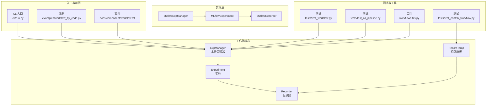
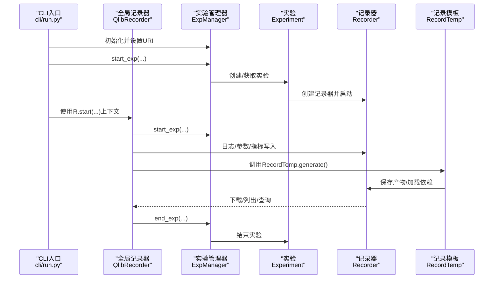
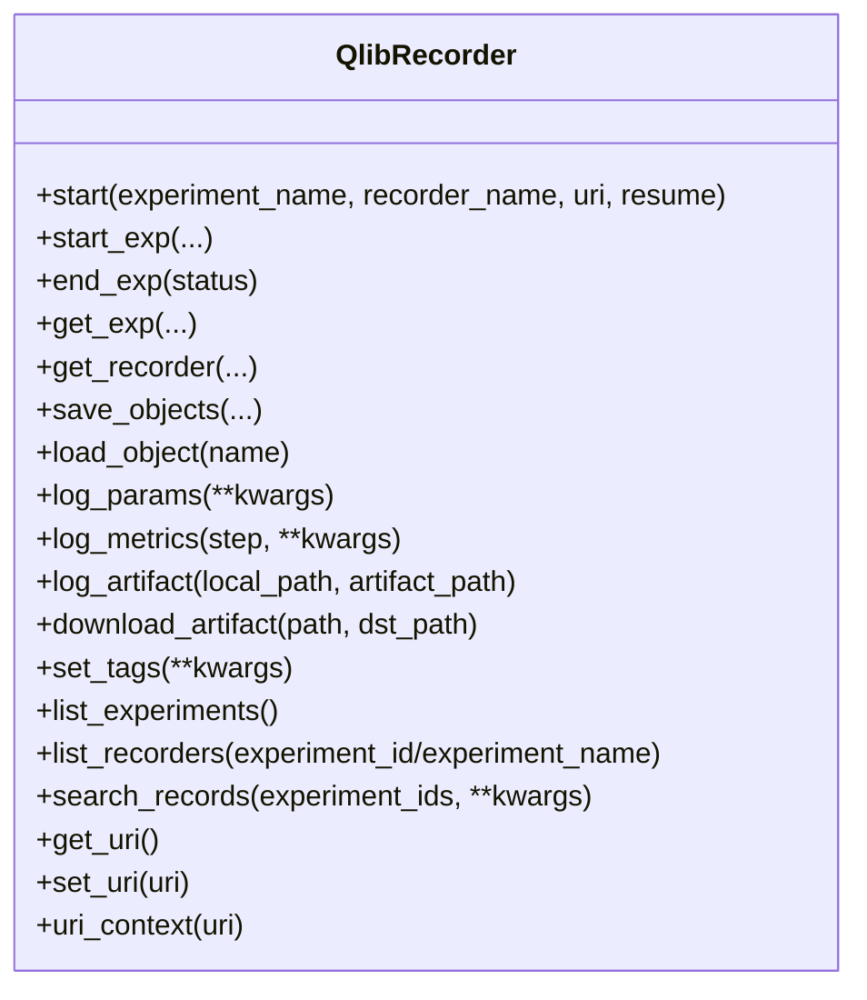
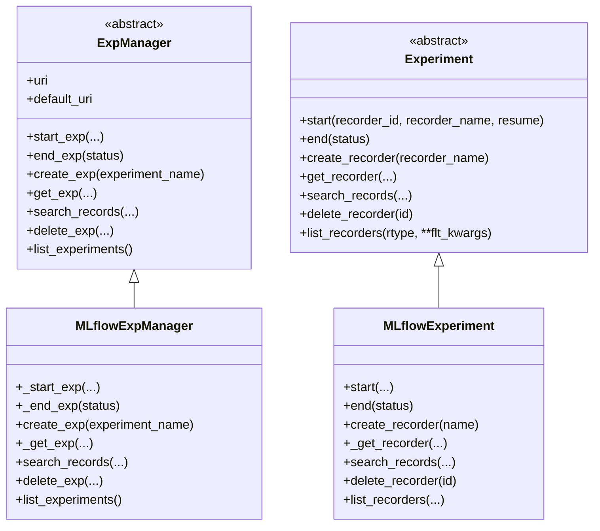
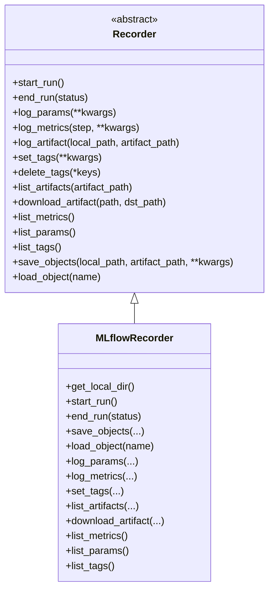
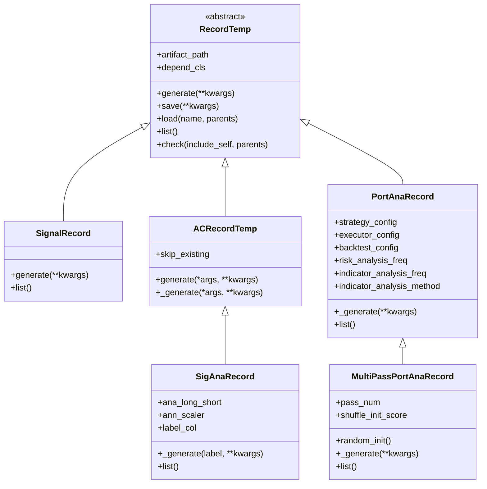
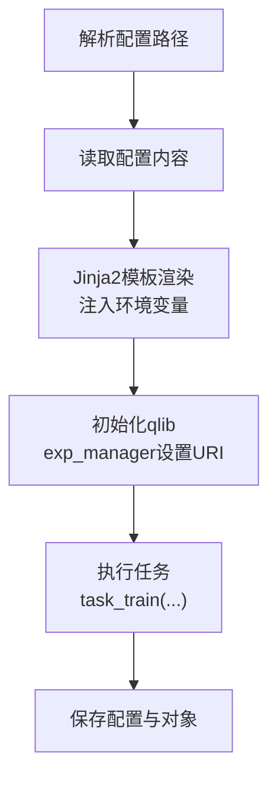
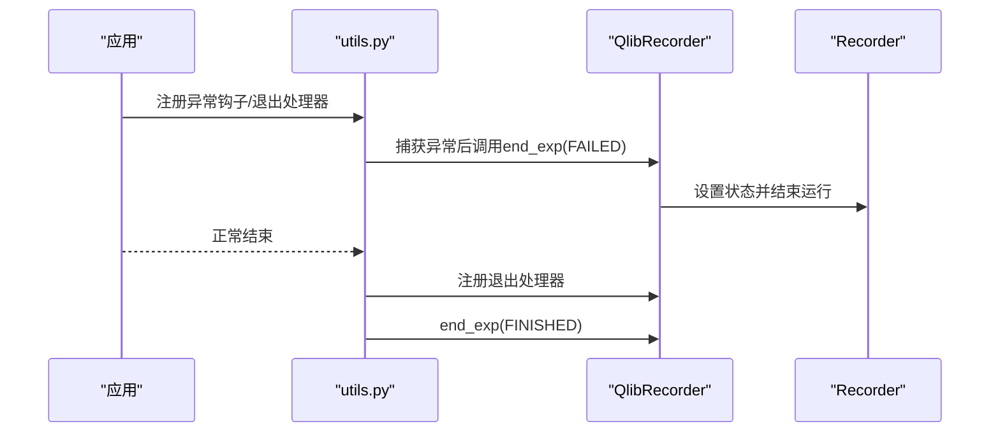
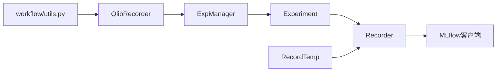

# 工作流贡献模块API

<cite>
**本文引用的文件**
- [qlib/workflow/__init__.py](file://qlib/workflow/__init__.py)
- [qlib/workflow/recorder.py](file://qlib/workflow/recorder.py)
- [qlib/workflow/record_temp.py](file://qlib/workflow/record_temp.py)
- [qlib/workflow/exp.py](file://qlib/workflow/exp.py)
- [qlib/workflow/expm.py](file://qlib/workflow/expm.py)
- [qlib/workflow/utils.py](file://qlib/workflow/utils.py)
- [qlib/cli/run.py](file://qlib/cli/run.py)
- [examples/workflow_by_code.py](file://examples/workflow_by_code.py)
- [docs/component/workflow.rst](file://docs/component/workflow.rst)
- [tests/test_workflow.py](file://tests/test_workflow.py)
- [tests/test_all_pipeline.py](file://tests/test_all_pipeline.py)
- [tests/test_contrib_workflow.py](file://tests/test_contrib_workflow.py)
</cite>

## 目录
1. [简介](#简介)
2. [项目结构](#项目结构)
3. [核心组件](#核心组件)
4. [架构总览](#架构总览)
5. [详细组件分析](#详细组件分析)
6. [依赖分析](#依赖分析)
7. [性能考虑](#性能考虑)
8. [故障排查指南](#故障排查指南)
9. [结论](#结论)
10. [附录](#附录)

## 简介
本文件面向Qlib工作流贡献模块（Workflow）的API参考与实践指南，聚焦以下目标：
- 工作流记录接口：临时记录、工作流状态管理、进度跟踪
- 工作流组件API：工作流节点、任务调度、依赖管理
- 工作流配置接口：工作流定义、参数传递、执行控制
- 工作流扩展接口：自定义工作流组件、工作流组合、工作流优化
- 工作流监控与调试API：执行日志、性能监控、错误处理
- 设计模式与最佳实践：帮助开发者构建复杂工作流程

## 项目结构
工作流相关代码主要位于qlib/workflow目录，配合CLI入口与示例、测试用例共同构成完整的贡献模块API体系。

**图表来源**
- [qlib/workflow/expm.py:22-434](file://qlib/workflow/expm.py#L22-L434)
- [qlib/workflow/exp.py:15-380](file://qlib/workflow/exp.py#L15-L380)
- [qlib/workflow/recorder.py:28-494](file://qlib/workflow/recorder.py#L28-L494)
- [qlib/workflow/record_temp.py:28-694](file://qlib/workflow/record_temp.py#L28-L694)
- [qlib/cli/run.py:85-157](file://qlib/cli/run.py#L85-L157)
- [examples/workflow_by_code.py](file://examples/workflow_by_code.py)
- [docs/component/workflow.rst:1-36](file://docs/component/workflow.rst#L1-L36)
- [tests/test_workflow.py:1-33](file://tests/test_workflow.py#L1-L33)
- [tests/test_all_pipeline.py:53-104](file://tests/test_all_pipeline.py#L53-L104)
- [tests/test_contrib_workflow.py:1-43](file://tests/test_contrib_workflow.py#L1-L43)
- [qlib/workflow/utils.py:16-47](file://qlib/workflow/utils.py#L16-L47)

**章节来源**
- [qlib/workflow/expm.py:22-434](file://qlib/workflow/expm.py#L22-L434)
- [qlib/workflow/exp.py:15-380](file://qlib/workflow/exp.py#L15-L380)
- [qlib/workflow/recorder.py:28-494](file://qlib/workflow/recorder.py#L28-L494)
- [qlib/workflow/record_temp.py:28-694](file://qlib/workflow/record_temp.py#L28-L694)
- [qlib/cli/run.py:85-157](file://qlib/cli/run.py#L85-L157)
- [docs/component/workflow.rst:1-36](file://docs/component/workflow.rst#L1-L36)

## 核心组件
- 实验管理器（ExpManager）：负责实验的创建、激活、结束与URI管理；支持多URI场景与并发安全。
- 实验（Experiment）：封装一次研究或训练的上下文，管理记录器生命周期。
- 记录器（Recorder）：统一的日志、参数、指标、模型与产物的存取抽象；MLflowRecorder为默认实现。
- 记录模板（RecordTemp）：用于生成标准化结果（如信号、回测分析、多遍回测等），内置依赖检查与自动缓存跳过。
- 全局记录器（QlibRecorder）：对上层暴露简洁API，提供with上下文、自动状态管理、全局URI切换等能力。
- 工具与异常（utils、exceptions）：异常处理、退出钩子、异步日志等。

**章节来源**
- [qlib/workflow/__init__.py:26-682](file://qlib/workflow/__init__.py#L26-L682)
- [qlib/workflow/recorder.py:28-494](file://qlib/workflow/recorder.py#L28-L494)
- [qlib/workflow/record_temp.py:28-694](file://qlib/workflow/record_temp.py#L28-L694)
- [qlib/workflow/exp.py:15-380](file://qlib/workflow/exp.py#L15-L380)
- [qlib/workflow/expm.py:22-434](file://qlib/workflow/expm.py#L22-L434)
- [qlib/workflow/utils.py:16-47](file://qlib/workflow/utils.py#L16-L47)

## 架构总览
下图展示从CLI到实验、记录器与记录模板的整体调用链路与职责边界。

**图表来源**
- [qlib/cli/run.py:85-157](file://qlib/cli/run.py#L85-L157)
- [qlib/workflow/__init__.py:37-163](file://qlib/workflow/__init__.py#L37-L163)
- [qlib/workflow/expm.py:46-117](file://qlib/workflow/expm.py#L46-L117)
- [qlib/workflow/exp.py:44-72](file://qlib/workflow/exp.py#L44-L72)
- [qlib/workflow/recorder.py:105-121](file://qlib/workflow/recorder.py#L105-L121)
- [qlib/workflow/record_temp.py:68-79](file://qlib/workflow/record_temp.py#L68-L79)

## 详细组件分析

### 1) 全局记录器（QlibRecorder）
- 提供with上下文启动/结束实验，自动处理异常状态
- 统一参数、指标、标签、对象存取接口
- 支持URI临时切换与默认URI管理
- 列举实验、记录器，搜索记录

**图表来源**
- [qlib/workflow/__init__.py:37-654](file://qlib/workflow/__init__.py#L37-L654)

**章节来源**
- [qlib/workflow/__init__.py:37-654](file://qlib/workflow/__init__.py#L37-L654)

### 2) 实验管理器（ExpManager）与实验（Experiment）
- ExpManager负责实验的创建、激活、结束与URI管理
- Experiment负责记录器生命周期与查询
- MLflowExpManager/MLflowExperiment/MLflowRecorder提供默认实现

**图表来源**
- [qlib/workflow/expm.py:22-434](file://qlib/workflow/expm.py#L22-L434)
- [qlib/workflow/exp.py:15-380](file://qlib/workflow/exp.py#L15-L380)

**章节来源**
- [qlib/workflow/expm.py:22-434](file://qlib/workflow/expm.py#L22-L434)
- [qlib/workflow/exp.py:15-380](file://qlib/workflow/exp.py#L15-L380)

### 3) 记录器（Recorder）与MLflowRecorder
- Recorder定义统一接口：开始/结束运行、参数/指标/标签/制品、对象存取、列表与下载
- MLflowRecorder基于MLflow实现，并扩展异步日志、未提交代码记录、环境变量记录等

**图表来源**
- [qlib/workflow/recorder.py:28-494](file://qlib/workflow/recorder.py#L28-L494)

**章节来源**
- [qlib/workflow/recorder.py:28-494](file://qlib/workflow/recorder.py#L28-L494)

### 4) 记录模板（RecordTemp）与常用模板
- RecordTemp：统一生成、加载、检查依赖、列出产物
- SignalRecord：生成预测与标签
- SigAnaRecord：计算IC/ICIR/Rank IC等指标
- PortAnaRecord：回测与风险/指标分析
- 多遍回测（MultiPassPortAnaRecord）：多次回测聚合统计
- 自动检查模板（ACRecordTemp）：可跳过已存在产物

**图表来源**
- [qlib/workflow/record_temp.py:28-694](file://qlib/workflow/record_temp.py#L28-L694)

**章节来源**
- [qlib/workflow/record_temp.py:28-694](file://qlib/workflow/record_temp.py#L28-L694)

### 5) 工作流配置与执行（CLI）
- CLI入口通过模板渲染配置，初始化Qlib并执行任务，最终保存配置与对象
- 支持基础配置继承与环境变量注入

**图表来源**
- [qlib/cli/run.py:66-157](file://qlib/cli/run.py#L66-L157)

**章节来源**
- [qlib/cli/run.py:66-157](file://qlib/cli/run.py#L66-L157)

### 6) 工作流状态管理与异常处理
- 异常钩子：捕获未处理异常并标记失败
- 退出处理器：程序异常结束时自动结束实验
- 记录器状态：SCHEDULED/RUNNING/FINISHED/FAILED

**图表来源**
- [qlib/workflow/utils.py:16-47](file://qlib/workflow/utils.py#L16-L47)
- [qlib/workflow/recorder.py:380-396](file://qlib/workflow/recorder.py#L380-L396)

**章节来源**
- [qlib/workflow/utils.py:16-47](file://qlib/workflow/utils.py#L16-L47)
- [qlib/workflow/recorder.py:380-396](file://qlib/workflow/recorder.py#L380-L396)

## 依赖分析
- 组件内聚性：QlibRecorder聚合ExpManager与Experiment/Recorder，提供高层API；RecordTemp独立于具体后端，便于扩展
- 松耦合：通过抽象类与MLflow实现解耦，便于替换后端
- 关键依赖：MLflow客户端、文件锁（并发）、时间与序列化工具

**图表来源**
- [qlib/workflow/__init__.py:17-24](file://qlib/workflow/__init__.py#L17-L24)
- [qlib/workflow/expm.py:1-18](file://qlib/workflow/expm.py#L1-L18)
- [qlib/workflow/recorder.py:1-25](file://qlib/workflow/recorder.py#L1-L25)
- [qlib/workflow/record_temp.py:1-25](file://qlib/workflow/record_temp.py#L1-L25)
- [qlib/workflow/utils.py:1-13](file://qlib/workflow/utils.py#L1-L13)

**章节来源**
- [qlib/workflow/__init__.py:17-24](file://qlib/workflow/__init__.py#L17-L24)
- [qlib/workflow/expm.py:1-18](file://qlib/workflow/expm.py#L1-L18)
- [qlib/workflow/recorder.py:1-25](file://qlib/workflow/recorder.py#L1-L25)
- [qlib/workflow/record_temp.py:1-25](file://qlib/workflow/record_temp.py#L1-L25)
- [qlib/workflow/utils.py:1-13](file://qlib/workflow/utils.py#L1-L13)

## 性能考虑
- 异步日志：MLflowRecorder内部使用异步调用减少阻塞
- 并发安全：文件锁保护实验创建，避免多进程冲突
- 对象存取：临时目录+序列化，避免大对象重复拷贝
- 产物缓存：RecordTemp支持跳过已存在产物，加速迭代

**章节来源**
- [qlib/workflow/recorder.py:347-350](file://qlib/workflow/recorder.py#L347-L350)
- [qlib/workflow/expm.py:234-245](file://qlib/workflow/expm.py#L234-L245)
- [qlib/workflow/record_temp.py:219-238](file://qlib/workflow/record_temp.py#L219-L238)

## 故障排查指南
- 常见问题
  - 无法找到实验/记录器：确认名称唯一且URI正确
  - 对象加载失败：检查artifact路径与命名一致性
  - 并发冲突：确保使用文件锁或单进程
  - 异常未被捕获：检查异常钩子是否注册
- 排查步骤
  - 使用R.list_experiments()/list_recorders()核对状态
  - 在R.uri_context中切换URI定位问题
  - 查看记录器日志与异步队列等待情况
  - 使用RecordTemp.check()验证依赖完整性

**章节来源**
- [qlib/workflow/exp.py:295-315](file://qlib/workflow/exp.py#L295-L315)
- [qlib/workflow/recorder.py:380-396](file://qlib/workflow/recorder.py#L380-L396)
- [qlib/workflow/utils.py:16-47](file://qlib/workflow/utils.py#L16-L47)
- [tests/test_workflow.py:20-30](file://tests/test_workflow.py#L20-L30)

## 结论
Qlib工作流贡献模块以清晰的分层与抽象实现了从配置到执行、从记录到分析的完整闭环。通过RecordTemp模板化产物生成、QlibRecorder统一API与ExpManager/Experiment/Recorder的职责分离，开发者可以快速构建复杂而可维护的工作流，并在多后端与多URI场景下保持一致体验。

## 附录

### A. API速查表
- 实验与记录器
  - R.start/with上下文、R.start_exp/end_exp、R.get_exp/get_recorder
  - R.save_objects/load_object、R.log_params/log_metrics/set_tags
  - R.list_experiments/list_recorders/search_records
- 记录模板
  - RecordTemp.generate/save/load/check/list
  - SignalRecord/SigAnaRecord/PortAnaRecord/MultiPassPortAnaRecord
- 工具与异常
  - experiment_exception_hook/experiment_exit_handler
  - Recorder状态：SCHEDULED/RUNNING/FINISHED/FAILED

**章节来源**
- [qlib/workflow/__init__.py:37-654](file://qlib/workflow/__init__.py#L37-L654)
- [qlib/workflow/record_temp.py:68-160](file://qlib/workflow/record_temp.py#L68-L160)
- [qlib/workflow/recorder.py:36-121](file://qlib/workflow/recorder.py#L36-L121)
- [qlib/workflow/utils.py:16-47](file://qlib/workflow/utils.py#L16-L47)

### B. 示例与测试参考
- 完整工作流示例：examples/workflow_by_code.py
- 文档示例：docs/component/workflow.rst
- 测试用例：tests/test_workflow.py、tests/test_all_pipeline.py、tests/test_contrib_workflow.py

**章节来源**
- [examples/workflow_by_code.py](file://examples/workflow_by_code.py)
- [docs/component/workflow.rst:1-36](file://docs/component/workflow.rst#L1-L36)
- [tests/test_workflow.py:1-33](file://tests/test_workflow.py#L1-L33)
- [tests/test_all_pipeline.py:53-104](file://tests/test_all_pipeline.py#L53-L104)
- [tests/test_contrib_workflow.py:1-43](file://tests/test_contrib_workflow.py#L1-L43)