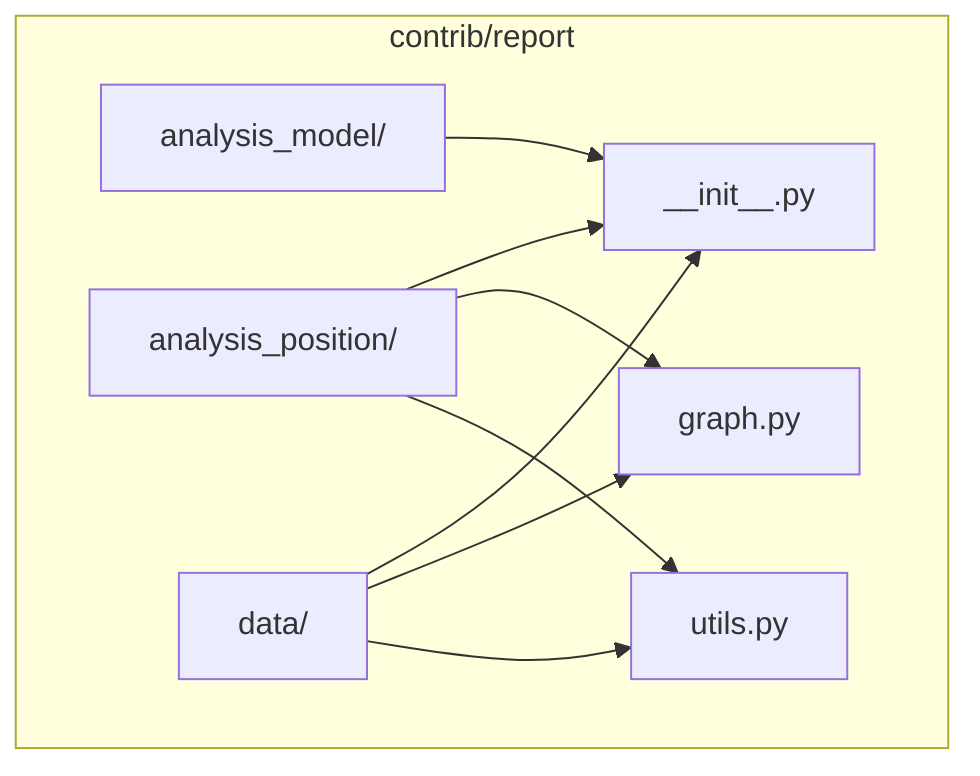
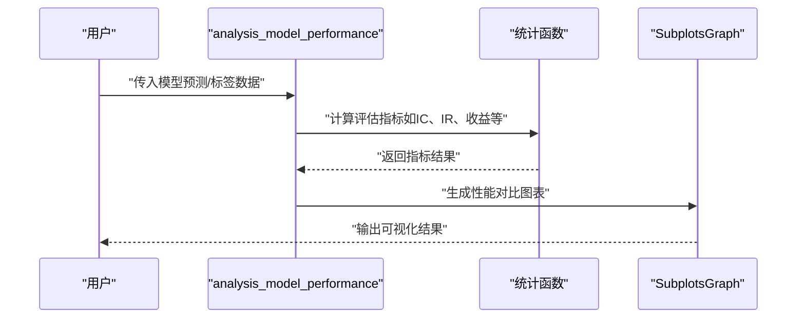
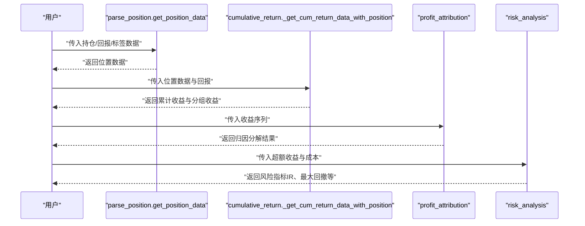
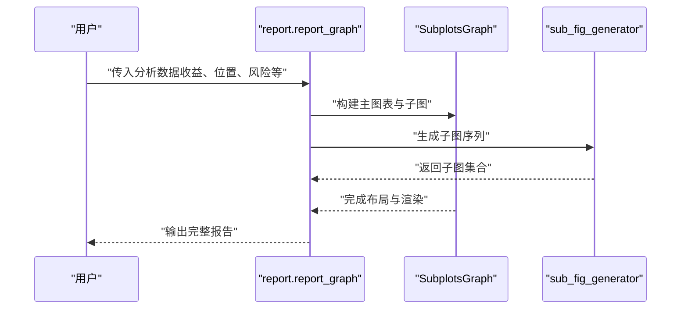
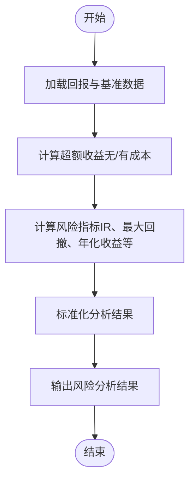
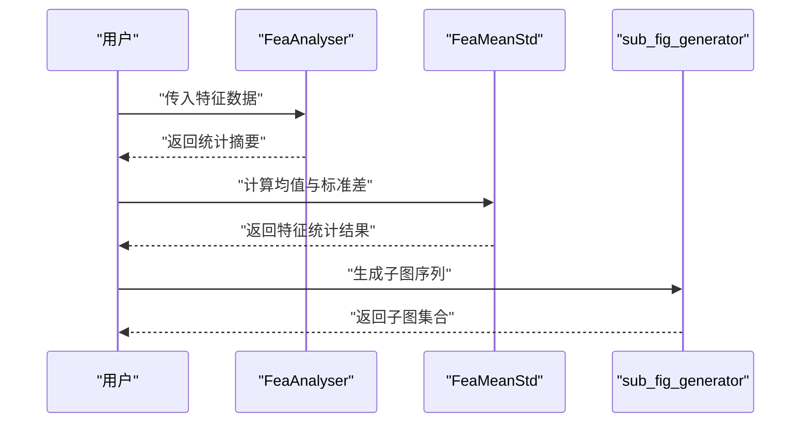
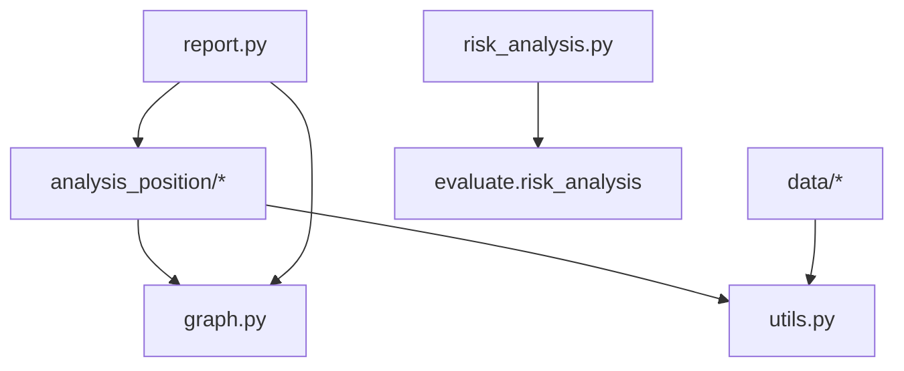

# 报告贡献模块API

<cite>
**本文档引用的文件**
- [analysis_model_performance.py](file://qlib/contrib/report/analysis_model/analysis_model_performance.py)
- [risk_analysis.py](file://qlib/contrib/report/analysis_position/risk_analysis.py)
- [cumulative_return.py](file://qlib/contrib/report/analysis_position/cumulative_return.py)
- [parse_position.py](file://qlib/contrib/report/analysis_position/parse_position.py)
- [score_ic.py](file://qlib/contrib/report/analysis_position/score_ic.py)
- [report.py](file://qlib/contrib/report/analysis_position/report.py)
- [ana.py](file://qlib/contrib/report/data/ana.py)
- [base.py](file://qlib/contrib/report/data/base.py)
- [graph.py](file://qlib/contrib/report/graph.py)
- [utils.py](file://qlib/contrib/report/utils.py)
- [__init__.py](file://qlib/contrib/report/__init__.py)
- [evaluate.py](file://qlib/contrib/evaluate.py)
- [profit_attribution.py](file://qlib/backtest/profit_attribution.py)
</cite>

## 目录
1. [简介](#简介)
2. [项目结构](#项目结构)
3. [核心组件](#核心组件)
4. [架构总览](#架构总览)
5. [详细组件分析](#详细组件分析)
6. [依赖关系分析](#依赖关系分析)
7. [性能考虑](#性能考虑)
8. [故障排查指南](#故障排查指南)
9. [结论](#结论)
10. [附录](#附录)

## 简介
本文件为 Qlib 报告贡献模块（contrib/report）的详细 API 参考文档，聚焦以下能力：
- 模型性能分析：模型表现评估、性能指标分析、模型对比
- 位置分析：持仓分析、收益归因、风险分解
- 报告生成：报告模板、数据提取、图表生成、报告导出
- 风险分析：VaR 计算、压力测试、风险监控
- 报告数据处理：数据预处理、统计计算、结果整理
- 报告定制与扩展：自定义报告格式与分析维度的扩展接口

该模块通过统一的数据结构与图表示例，为量化研究与投资组合管理提供可复用的分析与可视化能力。

## 项目结构
contrib/report 模块采用按功能域分层组织：
- analysis_model：模型性能分析相关
- analysis_position：位置与收益归因分析
- data：数据分析与特征统计工具
- graph：通用绘图基类与子图管理
- utils：通用工具函数
- __init__.py：对外暴露的入口

**图表来源**
- [__init__.py](file://qlib/contrib/report/__init__.py)
- [graph.py](file://qlib/contrib/report/graph.py)
- [utils.py](file://qlib/contrib/report/utils.py)

**章节来源**
- [__init__.py](file://qlib/contrib/report/__init__.py)
- [graph.py](file://qlib/contrib/report/graph.py)
- [utils.py](file://qlib/contrib/report/utils.py)

## 核心组件
- 图表基类与子图管理：BaseGraph、SubplotsGraph、ScatterGraph 提供统一的绘图抽象与布局控制
- 数据分析器：FeaAnalyser、FeaMeanStd 提供特征均值、标准差等统计分析
- 位置与收益归因：parse_position、cumulative_return、score_ic、risk_analysis
- 模型性能分析：analysis_model_performance
- 报告生成：report（位置分析报告）

**章节来源**
- [graph.py](file://qlib/contrib/report/graph.py)
- [base.py](file://qlib/contrib/report/data/base.py)
- [ana.py](file://qlib/contrib/report/data/ana.py)
- [parse_position.py](file://qlib/contrib/report/analysis_position/parse_position.py)
- [cumulative_return.py](file://qlib/contrib/report/analysis_position/cumulative_return.py)
- [score_ic.py](file://qlib/contrib/report/analysis_position/score_ic.py)
- [risk_analysis.py](file://qlib/contrib/report/analysis_position/risk_analysis.py)
- [analysis_model_performance.py](file://qlib/contrib/report/analysis_model/analysis_model_performance.py)
- [report.py](file://qlib/contrib/report/analysis_position/report.py)

## 架构总览
模块内部以“数据-分析-图表”三层协作：
- 数据层：从回测或策略输出中抽取标准化数据（如收益、基准、成本、标签）
- 分析层：对数据进行统计、归因、风险度量（如超额收益、最大回撤、信息比率）
- 图表层：基于统一的图示基类生成可视化图表并整合到报告

[此图为概念性架构示意，不对应具体源码文件，故无图表来源]

## 详细组件分析

### 模型性能分析 API
- 功能概述：提供模型表现评估、性能指标分析、模型对比等能力
- 关键接口与职责：
  - analysis_model_performance：封装模型性能评估流程，支持多指标汇总与对比展示
- 典型调用链路（序列图）：

**图表来源**
- [analysis_model_performance.py](file://qlib/contrib/report/analysis_model/analysis_model_performance.py)
- [graph.py](file://qlib/contrib/report/graph.py)

**章节来源**
- [analysis_model_performance.py](file://qlib/contrib/report/analysis_model/analysis_model_performance.py)

### 位置分析接口
- 功能概述：提供持仓分析、收益归因、风险分解等分析组件
- 关键接口与职责：
  - parse_position.get_position_data：解析持仓状态、权重与标签，生成可用于分析的位置数据
  - cumulative_return._get_cum_return_data_with_position：基于位置数据计算累计收益与分组收益（持有/买入/卖出）
  - score_ic：计算评分与IC等指标，辅助评估信号质量
  - risk_analysis：基于超额收益与成本进行风险度量（如最大回撤、年化收益、信息比率等）
- 典型调用链路（序列图）：

**图表来源**
- [parse_position.py](file://qlib/contrib/report/analysis_position/parse_position.py)
- [cumulative_return.py](file://qlib/contrib/report/analysis_position/cumulative_return.py)
- [profit_attribution.py](file://qlib/backtest/profit_attribution.py)
- [risk_analysis.py](file://qlib/contrib/report/analysis_position/risk_analysis.py)

**章节来源**
- [parse_position.py](file://qlib/contrib/report/analysis_position/parse_position.py)
- [cumulative_return.py](file://qlib/contrib/report/analysis_position/cumulative_return.py)
- [score_ic.py](file://qlib/contrib/report/analysis_position/score_ic.py)
- [risk_analysis.py](file://qlib/contrib/report/analysis_position/risk_analysis.py)
- [profit_attribution.py](file://qlib/backtest/profit_attribution.py)

### 报告生成 API
- 功能概述：提供报告模板、数据提取、图表生成、报告导出等能力
- 关键接口与职责：
  - analysis_position.report.report_graph：位置分析报告的主入口，负责组织数据与图表并输出报告
  - graph.BaseGraph/SubplotsGraph：统一的图表基类，支持子图布局与多维数据可视化
  - utils.sub_fig_generator：子图生成器，用于批量生成子图并合并
- 典型调用链路（序列图）：

**图表来源**
- [report.py](file://qlib/contrib/report/analysis_position/report.py)
- [graph.py](file://qlib/contrib/report/graph.py)
- [utils.py](file://qlib/contrib/report/utils.py)

**章节来源**
- [report.py](file://qlib/contrib/report/analysis_position/report.py)
- [graph.py](file://qlib/contrib/report/graph.py)
- [utils.py](file://qlib/contrib/report/utils.py)

### 风险分析接口
- 功能概述：提供 VaR 计算、压力测试、风险监控等风险管理组件
- 关键接口与职责：
  - risk_analysis._get_risk_analysis_data_with_report：基于回报与基准数据计算风险指标（超额收益、成本调整后超额收益等）
  - risk_analysis._get_all_risk_analysis：将风险分析结果标准化为统一格式，便于报告与对比
- 典型流程（流程图）：

**图表来源**
- [risk_analysis.py](file://qlib/contrib/report/analysis_position/risk_analysis.py)

**章节来源**
- [risk_analysis.py](file://qlib/contrib/report/analysis_position/risk_analysis.py)

### 报告数据处理 API
- 功能概述：提供数据预处理、统计计算、结果整理等工具函数
- 关键接口与职责：
  - data.base.FeaAnalyser：特征统计分析器，支持均值、方差、分位数等统计量计算
  - data.ana.FeaMeanStd：特征均值与标准差计算工具
  - utils.sub_fig_generator：子图生成器，用于批量生成与合并子图
- 典型调用链路（序列图）：

**图表来源**
- [base.py](file://qlib/contrib/report/data/base.py)
- [ana.py](file://qlib/contrib/report/data/ana.py)
- [utils.py](file://qlib/contrib/report/utils.py)

**章节来源**
- [base.py](file://qlib/contrib/report/data/base.py)
- [ana.py](file://qlib/contrib/report/data/ana.py)
- [utils.py](file://qlib/contrib/report/utils.py)

### 报告定制与扩展接口
- 功能概述：帮助开发者创建自定义报告格式与分析维度
- 扩展建议：
  - 自定义图表：继承 BaseGraph/SubplotsGraph，实现特定布局与渲染逻辑
  - 自定义分析：在 analysis_position 或 analysis_model 下新增分析模块，遵循现有数据结构约定
  - 自定义数据处理：在 data 下新增分析器或工具函数，复用 FeaAnalyser/FeaMeanStd 的接口风格
  - 报告模板：通过 report.report_graph 的参数配置，组合不同分析结果与图表，形成定制化报告

**章节来源**
- [graph.py](file://qlib/contrib/report/graph.py)
- [report.py](file://qlib/contrib/report/analysis_position/report.py)
- [base.py](file://qlib/contrib/report/data/base.py)
- [ana.py](file://qlib/contrib/report/data/ana.py)

## 依赖关系分析
- 内部依赖：
  - analysis_position 依赖 graph 与 utils 进行图表与子图生成
  - data 模块依赖 utils 进行子图生成
  - risk_analysis 依赖 evaluate 中的风险分析函数
  - report 依赖 analysis_position 与 graph 完成报告生成
- 外部依赖：
  - pandas 用于数据结构与分组计算
  - plotly 用于图表渲染

**图表来源**
- [risk_analysis.py](file://qlib/contrib/report/analysis_position/risk_analysis.py)
- [evaluate.py](file://qlib/contrib/evaluate.py)
- [report.py](file://qlib/contrib/report/analysis_position/report.py)
- [graph.py](file://qlib/contrib/report/graph.py)
- [utils.py](file://qlib/contrib/report/utils.py)

**章节来源**
- [risk_analysis.py](file://qlib/contrib/report/analysis_position/risk_analysis.py)
- [evaluate.py](file://qlib/contrib/evaluate.py)
- [report.py](file://qlib/contrib/report/analysis_position/report.py)
- [graph.py](file://qlib/contrib/report/graph.py)
- [utils.py](file://qlib/contrib/report/utils.py)

## 性能考虑
- 数据分组与聚合：在按日期分组时尽量减少重复计算，优先使用向量化操作
- 图表生成：批量生成子图时注意内存占用，必要时分批渲染
- 风险指标计算：对长序列数据进行滚动窗口计算时，合理设置窗口大小以平衡精度与性能
- I/O 优化：报告导出前先进行缓存与合并，避免多次写盘

## 故障排查指南
- 常见问题与定位：
  - 数据为空或索引异常：检查输入数据是否包含必需列（如 return、bench、cost），确认索引类型与命名
  - 图表渲染失败：确认 plotly 版本兼容性与子图布局参数
  - 风险指标异常：核对超额收益与成本计算逻辑，确保数据对齐
- 调试建议：
  - 在关键节点打印中间结果（如分组收益、风险指标）
  - 使用小样本数据快速验证流程正确性
  - 对比历史版本的输出，定位回归问题

**章节来源**
- [risk_analysis.py](file://qlib/contrib/report/analysis_position/risk_analysis.py)
- [cumulative_return.py](file://qlib/contrib/report/analysis_position/cumulative_return.py)
- [graph.py](file://qlib/contrib/report/graph.py)

## 结论
contrib/report 模块提供了从数据到分析再到可视化的完整链路，覆盖模型性能、位置分析、收益归因与风险监控等关键场景。通过统一的图表基类与工具函数，开发者可以快速扩展新的分析维度与报告格式，满足多样化的投研需求。

## 附录
- 关键术语
  - 超额收益：策略收益减去基准收益
  - 信息比率：超额收益的均值除以其标准差
  - 最大回撤：从峰值到随后低谷的回调幅度
- 推荐实践
  - 明确数据结构与字段约束，确保分析流程稳定
  - 将复杂分析拆分为可复用的小模块，提升可维护性
  - 在报告中统一展示关键指标与可视化图表，增强可读性