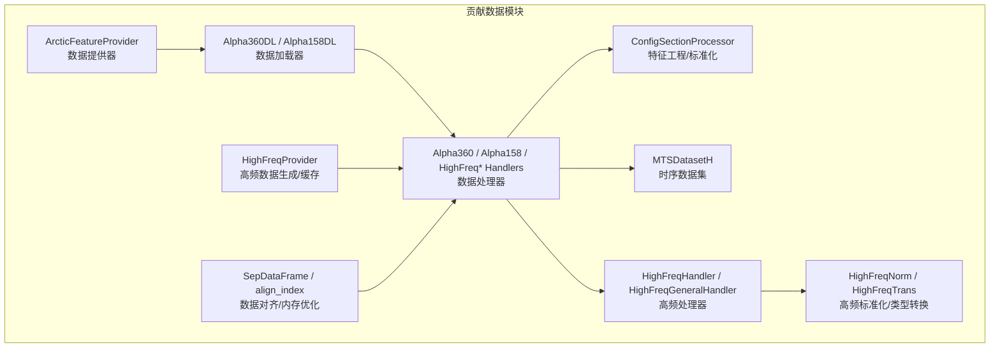
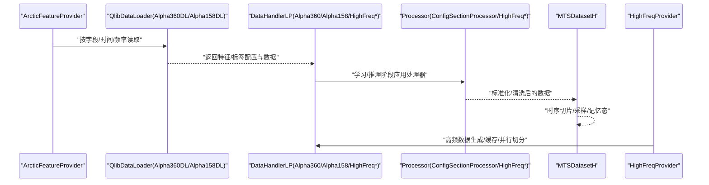
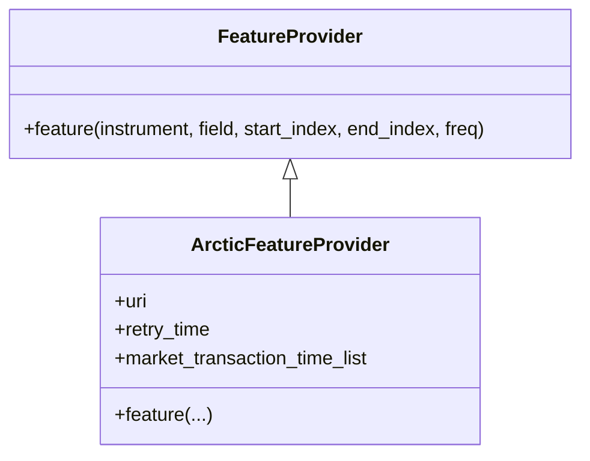
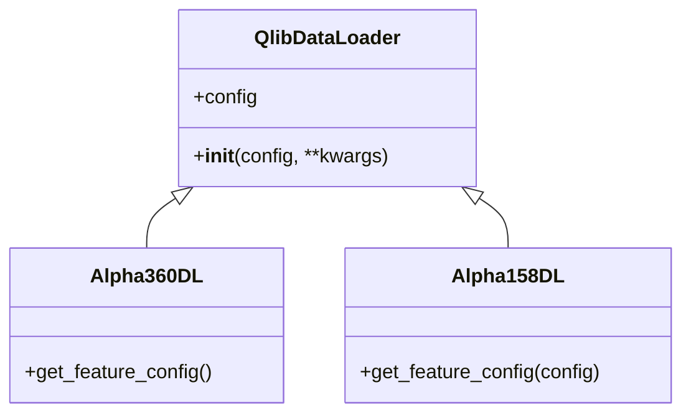
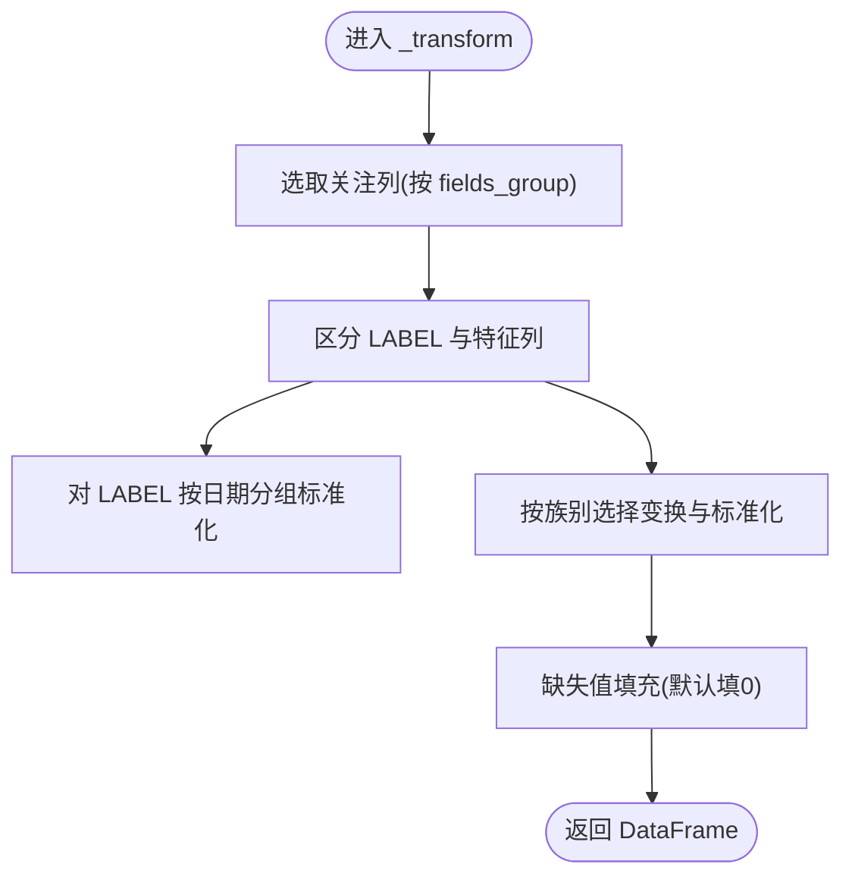
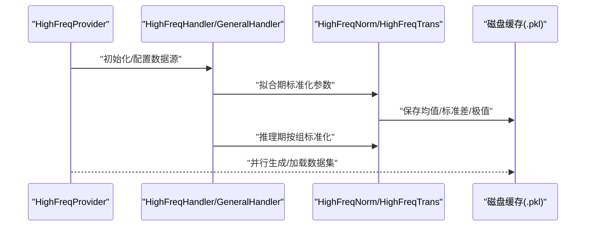
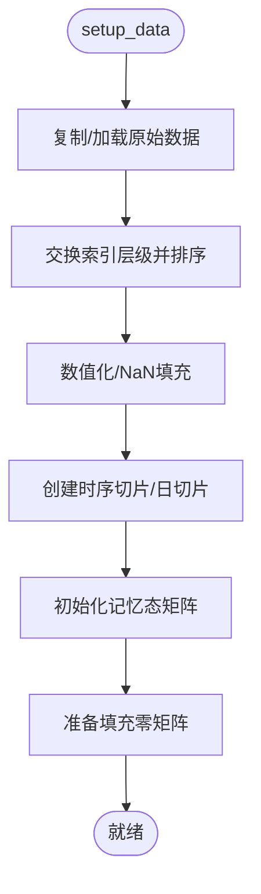
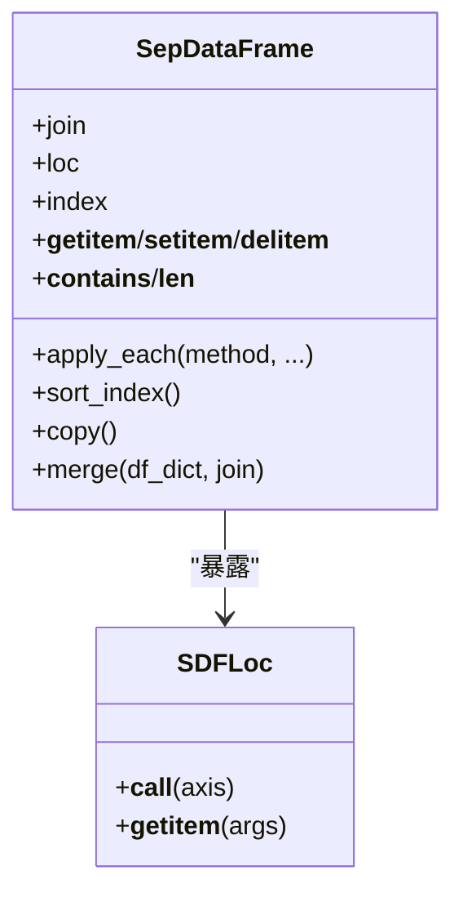
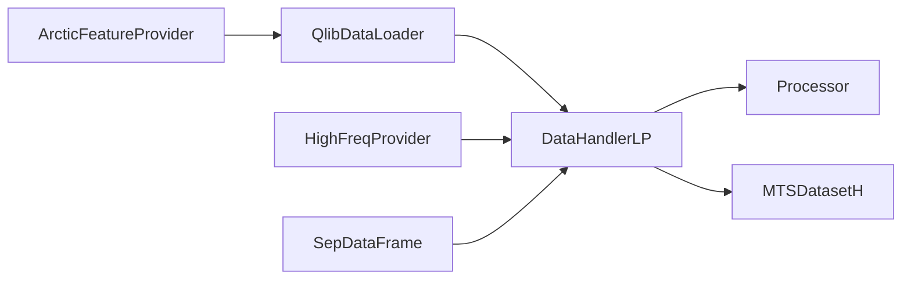

# 数据处理贡献模块API

<cite>
**本文引用的文件**
- [data.py](file://qlib/contrib/data/data.py)
- [handler.py](file://qlib/contrib/data/handler.py)
- [dataset.py](file://qlib/contrib/data/dataset.py)
- [loader.py](file://qlib/contrib/data/loader.py)
- [processor.py](file://qlib/contrib/data/processor.py)
- [highfreq_handler.py](file://qlib/contrib/data/highfreq_handler.py)
- [highfreq_processor.py](file://qlib/contrib/data/highfreq_processor.py)
- [highfreq_provider.py](file://qlib/contrib/data/highfreq_provider.py)
- [sepdf.py](file://qlib/contrib/data/utils/sepdf.py)
</cite>

## 目录
1. [简介](#简介)
2. [项目结构](#项目结构)
3. [核心组件](#核心组件)
4. [架构总览](#架构总览)
5. [详细组件分析](#详细组件分析)
6. [依赖分析](#依赖分析)
7. [性能考虑](#性能考虑)
8. [故障排查指南](#故障排查指南)
9. [结论](#结论)
10. [附录](#附录)

## 简介
本文件为 Qlib 数据处理贡献模块的完整 API 参考文档，覆盖以下主题：
- 数据提供器接口：数据加载、数据转换、数据缓存
- 数据处理器 API：数据清洗、特征工程、数据标准化
- 高频数据处理接口：高频数据读取、数据对齐、数据重采样
- 数据集构建 API：数据分割、数据权重、数据采样
- 数据加载器接口：批量加载、并行处理、内存管理
- 数据工具函数：SEPDF 工具、数据验证、数据统计
- 最佳实践与性能优化建议

## 项目结构
贡献模块位于 qlib/contrib/data，围绕“数据提供器 + 加载器 + 处理器 + 数据集 + 高频专用”组织，同时提供工具函数以提升内存与计算效率。

图表来源
- [data.py:19-56](file://qlib/contrib/data/data.py#L19-L56)
- [loader.py:4-311](file://qlib/contrib/data/loader.py#L4-L311)
- [handler.py:48-158](file://qlib/contrib/data/handler.py#L48-L158)
- [processor.py:7-130](file://qlib/contrib/data/processor.py#L7-L130)
- [dataset.py:102-363](file://qlib/contrib/data/dataset.py#L102-L363)
- [highfreq_handler.py:8-540](file://qlib/contrib/data/highfreq_handler.py#L8-L540)
- [highfreq_processor.py:10-81](file://qlib/contrib/data/highfreq_processor.py#L10-L81)
- [highfreq_provider.py:18-305](file://qlib/contrib/data/highfreq_provider.py#L18-L305)
- [sepdf.py:7-211](file://qlib/contrib/data/utils/sepdf.py#L7-L211)

章节来源
- [data.py:1-56](file://qlib/contrib/data/data.py#L1-L56)
- [loader.py:1-311](file://qlib/contrib/data/loader.py#L1-L311)
- [handler.py:1-158](file://qlib/contrib/data/handler.py#L1-L158)
- [processor.py:1-130](file://qlib/contrib/data/processor.py#L1-L130)
- [dataset.py:1-363](file://qlib/contrib/data/dataset.py#L1-L363)
- [highfreq_handler.py:1-540](file://qlib/contrib/data/highfreq_handler.py#L1-L540)
- [highfreq_processor.py:1-81](file://qlib/contrib/data/highfreq_processor.py#L1-L81)
- [highfreq_provider.py:1-305](file://qlib/contrib/data/highfreq_provider.py#L1-L305)
- [sepdf.py:1-211](file://qlib/contrib/data/utils/sepdf.py#L1-L211)

## 核心组件
- 数据提供器接口
  - 提供统一的 feature 接口，支持按时间窗口与频率读取字段数据，并可进行市场交易时段过滤。
  - 示例路径：[ArcticFeatureProvider.feature:32-56](file://qlib/contrib/data/data.py#L32-L56)
- 数据加载器接口
  - Alpha360DL/Alpha158DL：根据配置生成特征表达式，支持批量特征构造与命名。
  - 示例路径：[Alpha360DL.get_feature_config:15-59](file://qlib/contrib/data/loader.py#L15-L59)、[Alpha158DL.get_feature_config:72-311](file://qlib/contrib/data/loader.py#L72-L311)
- 数据处理器 API
  - ConfigSectionProcessor：针对 Alpha158 的分段特征标准化与异常值处理。
  - 示例路径：[ConfigSectionProcessor._transform:26-130](file://qlib/contrib/data/processor.py#L26-L130)
- 高频数据处理接口
  - HighFreqHandler/HighFreqGeneralHandler：高频价格与成交量归一化、填充与暂停标记剔除。
  - HighFreqNorm/HighFreqTrans：高频特征的拟合与标准化、布尔/浮点类型转换。
  - HighFreqProvider：高频数据的预生成、缓存与并行切分（日粒度/个股）。
  - 示例路径：[HighFreqHandler.get_feature_config:41-101](file://qlib/contrib/data/highfreq_handler.py#L41-L101)、[HighFreqNorm.fit/__call__:37-81](file://qlib/contrib/data/highfreq_processor.py#L37-L81)、[HighFreqProvider._gen_data:166-194](file://qlib/contrib/data/highfreq_provider.py#L166-L194)
- 数据集构建 API
  - MTSDatasetH：时序切片、样本索引、记忆态注入、日采样与批采样。
  - 示例路径：[MTSDatasetH.setup_data/_get_slices:163-363](file://qlib/contrib/data/dataset.py#L163-L363)
- 数据工具函数
  - SepDataFrame/align_index：多表对齐与懒加载式拼接，避免重复拷贝。
  - 示例路径：[SepDataFrame.__init__/loc/index:31-125](file://qlib/contrib/data/utils/sepdf.py#L31-L125)、[align_index:7-14](file://qlib/contrib/data/utils/sepdf.py#L7-L14)

章节来源
- [data.py:19-56](file://qlib/contrib/data/data.py#L19-L56)
- [loader.py:4-311](file://qlib/contrib/data/loader.py#L4-L311)
- [processor.py:7-130](file://qlib/contrib/data/processor.py#L7-L130)
- [highfreq_handler.py:8-540](file://qlib/contrib/data/highfreq_handler.py#L8-L540)
- [highfreq_processor.py:10-81](file://qlib/contrib/data/highfreq_processor.py#L10-L81)
- [highfreq_provider.py:18-305](file://qlib/contrib/data/highfreq_provider.py#L18-L305)
- [dataset.py:102-363](file://qlib/contrib/data/dataset.py#L102-L363)
- [sepdf.py:7-211](file://qlib/contrib/data/utils/sepdf.py#L7-L211)

## 架构总览
下图展示从数据提供器到数据集的端到端流程，以及高频场景下的专用路径。

图表来源
- [data.py:32-56](file://qlib/contrib/data/data.py#L32-L56)
- [loader.py:7-14](file://qlib/contrib/data/loader.py#L7-L14)
- [handler.py:48-158](file://qlib/contrib/data/handler.py#L48-L158)
- [processor.py:26-130](file://qlib/contrib/data/processor.py#L26-L130)
- [dataset.py:163-363](file://qlib/contrib/data/dataset.py#L163-L363)
- [highfreq_provider.py:166-194](file://qlib/contrib/data/highfreq_provider.py#L166-L194)

## 详细组件分析

### 数据提供器接口：ArcticFeatureProvider
- 职责
  - 通过 Arctic/MongoDB 按频率库读取指定标的字段，支持时间段过滤与交易时段截取。
- 关键行为
  - feature(instrument, field, start_index, end_index, freq)：读取字段并按市场交易时段聚合。
- 性能与注意
  - 当前实现每次查询会建立连接，存在频繁连接开销；建议在上层复用连接或采用连接池策略。
  - 建议对库名与符号存在性做预检查以减少异常开销。

图表来源
- [data.py:16-17](file://qlib/contrib/data/data.py#L16-L17)
- [data.py:19-56](file://qlib/contrib/data/data.py#L19-L56)

章节来源
- [data.py:19-56](file://qlib/contrib/data/data.py#L19-L56)

### 数据加载器接口：Alpha360DL / Alpha158DL
- 职责
  - 将配置映射为特征表达式与列名，支持 Alpha360/Alpha158 的特征族组合。
- 关键行为
  - Alpha360DL.get_feature_config：近 60 日收盘价/开盘价/最高最低/VWAP/成交量的归一化序列。
  - Alpha158DL.get_feature_config：kbar、价格、滚动统计（ROC/MA/STD/BETA/RSQR/RESI/极值/分位数/相关性/动量等）。
- 使用建议
  - 滚动类特征需结合数据长度与滑窗大小，避免边界 NaN 过多导致样本稀疏。

图表来源
- [loader.py:1-311](file://qlib/contrib/data/loader.py#L1-L311)

章节来源
- [loader.py:4-311](file://qlib/contrib/data/loader.py#L4-L311)

### 数据处理器 API：ConfigSectionProcessor
- 职责
  - 针对不同特征族（如 K 系列、价格序列、波动率、成交量等）执行分组中位数标准化、异常值裁剪/收缩、缺失填充。
- 关键行为
  - 对 LABEL 列按日期分组去均值/去方差；对特征列按族别选择不同变换（幂次、对数、填充零）后标准化。
- 注意事项
  - 异常值处理包含裁剪与收缩两种策略，应依据下游模型鲁棒性选择。

图表来源
- [processor.py:26-130](file://qlib/contrib/data/processor.py#L26-L130)

章节来源
- [processor.py:7-130](file://qlib/contrib/data/processor.py#L7-L130)

### 高频数据处理接口
- HighFreqHandler/HighFreqGeneralHandler
  - 高频价格/成交量归一化（昨日收盘价基准）、填充空值、剔除停牌时段。
  - 支持自定义交易分钟数与列集合。
- HighFreqNorm/HighFreqTrans
  - HighFreqNorm：在拟合期计算每组特征的均值、绝对偏差标准差、极值范围并持久化，推理期按组标准化。
  - HighFreqTrans：将特征转为布尔/浮点类型，便于存储与加速。
- HighFreqProvider
  - 预生成训练/验证/测试集，支持缓存与并行生成（按日/按股票），并可生成回测所需数据集。

图表来源
- [highfreq_handler.py:41-101](file://qlib/contrib/data/highfreq_handler.py#L41-L101)
- [highfreq_processor.py:37-81](file://qlib/contrib/data/highfreq_processor.py#L37-L81)
- [highfreq_provider.py:166-194](file://qlib/contrib/data/highfreq_provider.py#L166-L194)

章节来源
- [highfreq_handler.py:8-540](file://qlib/contrib/data/highfreq_handler.py#L8-L540)
- [highfreq_processor.py:10-81](file://qlib/contrib/data/highfreq_processor.py#L10-L81)
- [highfreq_provider.py:18-305](file://qlib/contrib/data/highfreq_provider.py#L18-L305)

### 数据集构建 API：MTSDatasetH
- 职责
  - 将 DataHandler 的学习/推理数据转换为张量批次，支持时序切片、日采样、样本级/日级记忆态注入。
- 关键行为
  - setup_data：预取数据、索引交换与排序、数值化、创建时序切片与日切片。
  - __iter__：按批/日采样生成特征、标签、索引与记忆态。
- 参数要点
  - seq_len/horizon/batch_size/n_samples/memory_mode 控制采样与记忆态模式。
  - drop_last/shuffle 控制训练/评估行为切换。

图表来源
- [dataset.py:163-210](file://qlib/contrib/data/dataset.py#L163-L210)

章节来源
- [dataset.py:102-363](file://qlib/contrib/data/dataset.py#L102-L363)

### 数据工具函数：SEPDF 工具
- SepDataFrame
  - 以字典形式持有多个 DataFrame，按 join 键对齐索引，提供懒加载式操作，避免拼接/拆分带来的内存拷贝。
- align_index
  - 将多个 DataFrame 按目标索引对齐，支持跳过对齐以提升性能。
- 使用建议
  - 在多表联结后再拆分的场景中优先使用 SepDataFrame，显著降低内存与 CPU 开销。

图表来源
- [sepdf.py:31-146](file://qlib/contrib/data/utils/sepdf.py#L31-L146)

章节来源
- [sepdf.py:7-211](file://qlib/contrib/data/utils/sepdf.py#L7-L211)

## 依赖分析
- 组件耦合
  - DataHandlerLP 依赖 QlibDataLoader 与 Processor，形成“加载-处理-采样”的流水线。
  - HighFreqProvider 依赖 D/Cal 等模块，负责高频数据的预生成与缓存。
- 外部依赖
  - Arctic/MongoDB（ArcticFeatureProvider）
  - Joblib 并行（HighFreqProvider）
  - PyTorch/Numpy/Pandas（数据集与张量）

图表来源
- [data.py:12-17](file://qlib/contrib/data/data.py#L12-L17)
- [loader.py:1-14](file://qlib/contrib/data/loader.py#L1-L14)
- [handler.py:4-9](file://qlib/contrib/data/handler.py#L4-L9)
- [highfreq_provider.py:104-113](file://qlib/contrib/data/highfreq_provider.py#L104-L113)
- [sepdf.py:1-7](file://qlib/contrib/data/utils/sepdf.py#L1-L7)

章节来源
- [data.py:1-17](file://qlib/contrib/data/data.py#L1-L17)
- [loader.py:1-14](file://qlib/contrib/data/loader.py#L1-L14)
- [handler.py:1-9](file://qlib/contrib/data/handler.py#L1-L9)
- [highfreq_provider.py:104-113](file://qlib/contrib/data/highfreq_provider.py#L104-L113)
- [sepdf.py:1-7](file://qlib/contrib/data/utils/sepdf.py#L1-L7)

## 性能考虑
- 连接与缓存
  - ArcticFeatureProvider 每次查询新建连接，建议在上层复用连接或引入连接池。
  - HighFreqProvider 支持将数据集序列化为 .pkl 并按日/按股票并行生成，显著降低重复计算成本。
- 内存与 IO
  - 使用 SepDataFrame 避免多表拼接/拆分的中间拷贝；必要时跳过对齐以减少 IO。
  - MTSDatasetH 在 setup_data 中进行数值化与 NaN 填充，减少训练循环中的额外处理。
- 计算与并行
  - HighFreqProvider._gen_day_dataset/_gen_stock_dataset 使用 joblib 并行生成，合理设置 n_jobs。
  - HighFreqNorm.fit 按组计算统计量并持久化，推理期直接加载，避免重复计算。

## 故障排查指南
- ArcticFeatureProvider
  - 现象：连接失败/超时
  - 排查：确认 uri 正确、网络可达；考虑增加重试机制与连接池
  - 参考路径：[ArcticFeatureProvider.__init__/feature:19-56](file://qlib/contrib/data/data.py#L19-L56)
- 高频数据缺失/异常
  - 现象：NaN/无穷大/停牌时段导致异常
  - 排查：确认 HighFreqHandler 的归一化模板是否正确应用 FFillNan/Select(IsNull/IsInf)；检查 volume 是否为负
  - 参考路径：[HighFreqHandler.get_feature_config:41-101](file://qlib/contrib/data/highfreq_handler.py#L41-L101)、[HighFreqNorm.__call__:62-81](file://qlib/contrib/data/highfreq_processor.py#L62-L81)
- 数据集采样异常
  - 现象：batch_size 与采样模式不匹配、索引越界
  - 排查：确保 memory_mode 与 batch_size 的约束满足；检查 seq_len/horizon 设置
  - 参考路径：[MTSDatasetH.__init__:119-162](file://qlib/contrib/data/dataset.py#L119-L162)、[MTSDatasetH._get_slices:265-273](file://qlib/contrib/data/dataset.py#L265-L273)
- 缓存命中问题
  - 现象：重复生成数据集
  - 排查：确认 HighFreqProvider 的 path 与 pickle 文件是否存在；检查生成逻辑是否被提前中断
  - 参考路径：[HighFreqProvider._gen_data:166-194](file://qlib/contrib/data/highfreq_provider.py#L166-L194)

章节来源
- [data.py:19-56](file://qlib/contrib/data/data.py#L19-L56)
- [highfreq_handler.py:41-101](file://qlib/contrib/data/highfreq_handler.py#L41-L101)
- [highfreq_processor.py:37-81](file://qlib/contrib/data/highfreq_processor.py#L37-L81)
- [dataset.py:119-162](file://qlib/contrib/data/dataset.py#L119-L162)
- [highfreq_provider.py:166-194](file://qlib/contrib/data/highfreq_provider.py#L166-L194)

## 结论
贡献模块提供了从数据提供、加载、处理、采样到高频专用能力的完整链路，并通过 SepDataFrame、HighFreqProvider 等工具显著优化了内存与性能。建议在生产环境中结合缓存与并行策略，配合合理的异常值与缺失值处理，获得稳定高效的训练数据管线。

## 附录
- 最佳实践清单
  - 使用 HighFreqProvider 预生成并缓存高频数据，按日/按股票并行切分
  - 在 DataHandler 层配置合适的 Processor（如 ConfigSectionProcessor/HighFreqNorm），减少训练期重复计算
  - 利用 SepDataFrame 避免多表拼接/拆分的中间拷贝
  - 合理设置 MTSDatasetH 的 seq_len/horizon/batch_size，平衡内存与吞吐
  - 对 ArcticFeatureProvider 增加连接池与重试策略，降低连接开销