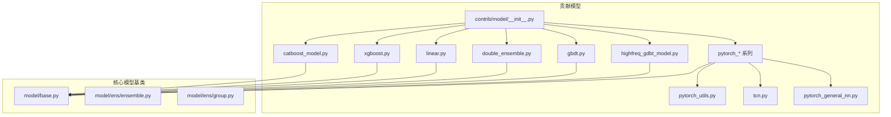
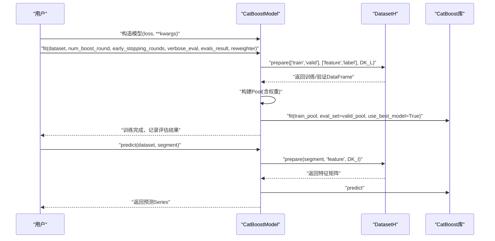
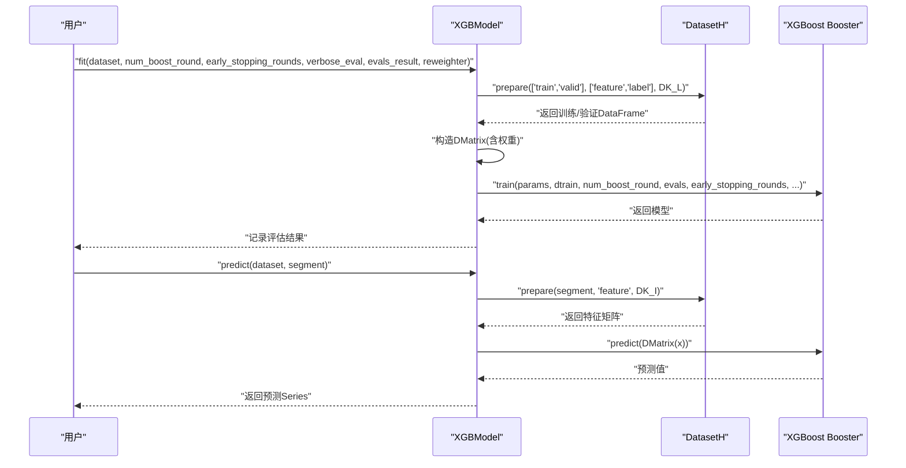
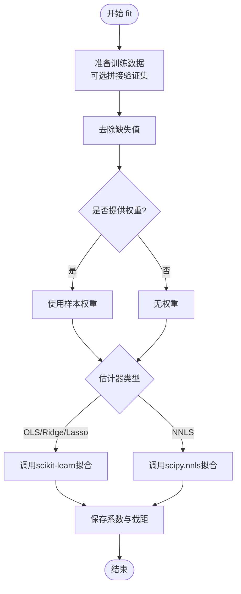
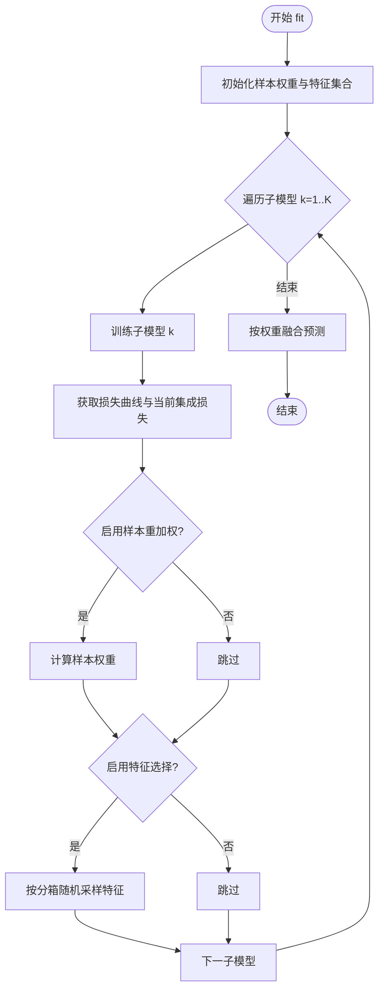
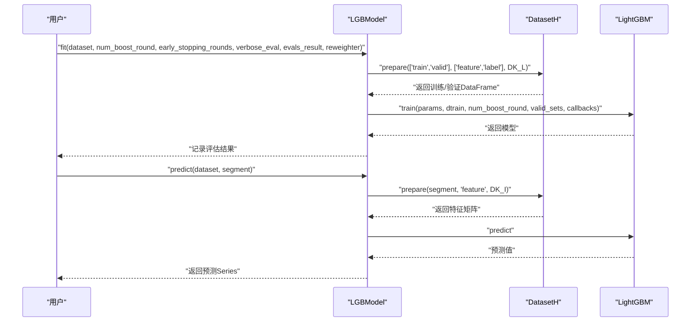
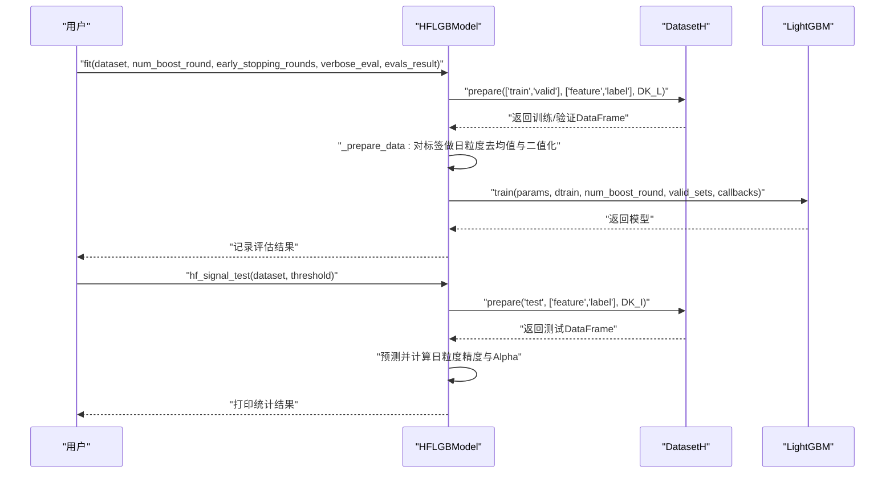
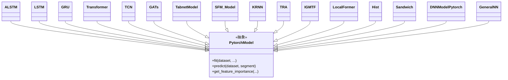
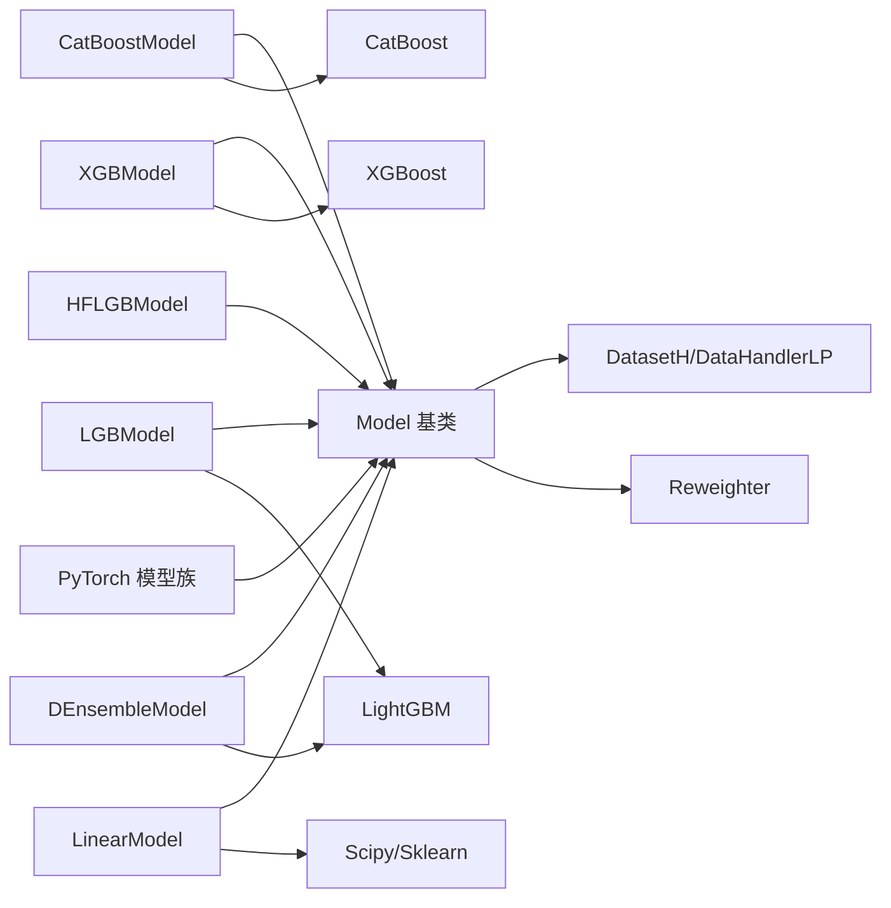

# 模型扩展贡献模块API

<cite>
**本文引用的文件**
- [contrib/model/__init__.py](file://qlib/contrib/model/__init__.py)
- [contrib/model/catboost_model.py](file://qlib/contrib/model/catboost_model.py)
- [contrib/model/xgboost.py](file://qlib/contrib/model/xgboost.py)
- [contrib/model/linear.py](file://qlib/contrib/model/linear.py)
- [contrib/model/double_ensemble.py](file://qlib/contrib/model/double_ensemble.py)
- [contrib/model/gbdt.py](file://qlib/contrib/model/gbdt.py)
- [contrib/model/highfreq_gdbt_model.py](file://qlib/contrib/model/highfreq_gdbt_model.py)
- [contrib/model/pytorch_alstm.py](file://qlib/contrib/model/pytorch_alstm.py)
- [contrib/model/pytorch_lstm.py](file://qlib/contrib/model/pytorch_lstm.py)
- [contrib/model/pytorch_gru.py](file://qlib/contrib/model/pytorch_gru.py)
- [contrib/model/pytorch_transformer.py](file://qlib/contrib/model/pytorch_transformer.py)
- [contrib/model/pytorch_tcn.py](file://qlib/contrib/model/pytorch_tcn.py)
- [contrib/model/pytorch_gats.py](file://qlib/contrib/model/pytorch_gats.py)
- [contrib/model/pytorch_tabnet.py](file://qlib/contrib/model/pytorch_tabnet.py)
- [contrib/model/pytorch_sfm.py](file://qlib/contrib/model/pytorch_sfm.py)
- [contrib/model/pytorch_krnn.py](file://qlib/contrib/model/pytorch_krnn.py)
- [contrib/model/pytorch_tra.py](file://qlib/contrib/model/pytorch_tra.py)
- [contrib/model/pytorch_igmtf.py](file://qlib/contrib/model/pytorch_igmtf.py)
- [contrib/model/pytorch_localformer.py](file://qlib/contrib/model/pytorch_localformer.py)
- [contrib/model/pytorch_hist.py](file://qlib/contrib/model/pytorch_hist.py)
- [contrib/model/pytorch_sandwich.py](file://qlib/contrib/model/pytorch_sandwich.py)
- [contrib/model/pytorch_nn.py](file://qlib/contrib/model/pytorch_nn.py)
- [contrib/model/pytorch_general_nn.py](file://qlib/contrib/model/pytorch_general_nn.py)
- [contrib/model/pytorch_utils.py](file://qlib/contrib/model/pytorch_utils.py)
- [contrib/model/tcn.py](file://qlib/contrib/model/tcn.py)
- [model/base.py](file://qlib/model/base.py)
- [model/ens/ensemble.py](file://qlib/model/ens/ensemble.py)
- [model/ens/group.py](file://qlib/model/ens/group.py)
</cite>

## 目录
1. [简介](#简介)
2. [项目结构](#项目结构)
3. [核心组件](#核心组件)
4. [架构总览](#架构总览)
5. [详细组件分析](#详细组件分析)
6. [依赖关系分析](#依赖关系分析)
7. [性能考量](#性能考量)
8. [故障排查指南](#故障排查指南)
9. [结论](#结论)
10. [附录](#附录)

## 简介
本文件面向希望在 Qlib 中扩展与集成模型的开发者，系统梳理“模型扩展贡献模块”的API与实现要点，覆盖传统机器学习模型（CatBoost、XGBoost、线性模型）、深度学习模型（PyTorch系列架构如 AdaRNN、ALSTM、GRU、LSTM、Transformer、TCN、GATs、TabNet、SFM、KRNN、TRA、IGMTF、LocalFormer、Hist、Sandwich、通用神经网络等）、集成学习接口（双集成模型、集成策略、模型融合）、高频GDBT模型（高阶LightGBM变体）以及模型工具函数（PyTorch工具、模型初始化、参数设置等）。文档同时提供类图、时序图、流程图与依赖图，帮助快速理解与二次开发。

## 项目结构
- 贡献模型入口与导出：通过 [contrib/model/__init__.py](file://qlib/contrib/model/__init__.py) 统一导入并按需加载各模型类，对缺失可选依赖进行容错处理。
- 传统机器学习模型：CatBoost、XGBoost、LightGBM（LGBModel）、线性模型（LinearModel）、双集成模型（DEnsembleModel）。
- 深度学习模型：PyTorch 实现的多种架构，均继承统一的模型基类，支持特征重要性解释接口。
- 高频GDBT模型：针对高频场景的LightGBM变体（HFLGBModel），提供信号测试与日粒度指标计算。
- 工具与通用组件：PyTorch工具、TCN实现、通用神经网络封装等。
- 集成学习：提供集成与分组策略的实现入口。

**图表来源**
- [contrib/model/__init__.py:1-44](file://qlib/contrib/model/__init__.py#L1-L44)
- [contrib/model/catboost_model.py:17-101](file://qlib/contrib/model/catboost_model.py#L17-L101)
- [contrib/model/xgboost.py:15-86](file://qlib/contrib/model/xgboost.py#L15-L86)
- [contrib/model/linear.py:17-114](file://qlib/contrib/model/linear.py#L17-L114)
- [contrib/model/double_ensemble.py:15-278](file://qlib/contrib/model/double_ensemble.py#L15-L278)
- [contrib/model/gbdt.py:16-127](file://qlib/contrib/model/gbdt.py#L16-L127)
- [contrib/model/highfreq_gdbt_model.py:15-172](file://qlib/contrib/model/highfreq_gdbt_model.py#L15-L172)
- [contrib/model/pytorch_alstm.py](file://qlib/contrib/model/pytorch_alstm.py)
- [contrib/model/pytorch_lstm.py](file://qlib/contrib/model/pytorch_lstm.py)
- [contrib/model/pytorch_gru.py](file://qlib/contrib/model/pytorch_gru.py)
- [contrib/model/pytorch_transformer.py](file://qlib/contrib/model/pytorch_transformer.py)
- [contrib/model/pytorch_tcn.py](file://qlib/contrib/model/pytorch_tcn.py)
- [contrib/model/pytorch_gats.py](file://qlib/contrib/model/pytorch_gats.py)
- [contrib/model/pytorch_tabnet.py](file://qlib/contrib/model/pytorch_tabnet.py)
- [contrib/model/pytorch_sfm.py](file://qlib/contrib/model/pytorch_sfm.py)
- [contrib/model/pytorch_krnn.py](file://qlib/contrib/model/pytorch_krnn.py)
- [contrib/model/pytorch_tra.py](file://qlib/contrib/model/pytorch_tra.py)
- [contrib/model/pytorch_igmtf.py](file://qlib/contrib/model/pytorch_igmtf.py)
- [contrib/model/pytorch_localformer.py](file://qlib/contrib/model/pytorch_localformer.py)
- [contrib/model/pytorch_hist.py](file://qlib/contrib/model/pytorch_hist.py)
- [contrib/model/pytorch_sandwich.py](file://qlib/contrib/model/pytorch_sandwich.py)
- [contrib/model/pytorch_nn.py](file://qlib/contrib/model/pytorch_nn.py)
- [contrib/model/pytorch_general_nn.py](file://qlib/contrib/model/pytorch_general_nn.py)
- [contrib/model/pytorch_utils.py](file://qlib/contrib/model/pytorch_utils.py)
- [contrib/model/tcn.py](file://qlib/contrib/model/tcn.py)
- [model/base.py](file://qlib/model/base.py)
- [model/ens/ensemble.py](file://qlib/model/ens/ensemble.py)
- [model/ens/group.py](file://qlib/model/ens/group.py)

**章节来源**
- [contrib/model/__init__.py:1-44](file://qlib/contrib/model/__init__.py#L1-L44)

## 核心组件
- 传统机器学习模型
  - CatBoostModel：基于 CatBoost 的回归/分类模型，支持权重重估与GPU自动检测。
  - XGBModel：基于 XGBoost 的梯度提升模型，支持权重与早停。
  - LGBModel：基于 LightGBM 的梯度提升模型，支持微调与日志记录到工作流。
  - 双集成模型 DEnsembleModel：双集成框架，包含样本重加权（SR）与特征选择（FS）模块，支持多子模型融合。
  - 线性模型 LinearModel：支持 OLS、非负最小二乘（NNLS）、Ridge、Lasso 回归。
- 深度学习模型（PyTorch）
  - ALSTM、LSTM、GRU、Transformer、TCN、GATs、TabNet、SFM、KRNN、TRA、IGMTF、LocalFormer、Hist、Sandwich、通用神经网络等。
- 高频GDBT模型
  - HFLGBModel：面向高频预测的LightGBM变体，提供信号测试与日粒度精度/Alpha统计。
- 工具与通用组件
  - PyTorch工具与初始化、参数设置、通用神经网络封装、TCN实现等。

**章节来源**
- [contrib/model/catboost_model.py:17-101](file://qlib/contrib/model/catboost_model.py#L17-L101)
- [contrib/model/xgboost.py:15-86](file://qlib/contrib/model/xgboost.py#L15-L86)
- [contrib/model/linear.py:17-114](file://qlib/contrib/model/linear.py#L17-L114)
- [contrib/model/double_ensemble.py:15-278](file://qlib/contrib/model/double_ensemble.py#L15-L278)
- [contrib/model/gbdt.py:16-127](file://qlib/contrib/model/gbdt.py#L16-L127)
- [contrib/model/highfreq_gdbt_model.py:15-172](file://qlib/contrib/model/highfreq_gdbt_model.py#L15-L172)

## 架构总览
下图展示贡献模型与核心模型基类的关系，以及部分深度学习模型的典型继承链。

```mermaid
classDiagram
class Model {
<<抽象>>
+fit(dataset, ...)
+predict(dataset, segment)
+get_feature_importance(...)
}
class FeatureInt {
<<接口>>
+get_feature_importance(...)
}
class LightGBMFInt {
<<接口>>
+get_feature_importance(...)
}
class CatBoostModel {
+fit(dataset, num_boost_round, early_stopping_rounds, verbose_eval, evals_result, reweighter, **kwargs)
+predict(dataset, segment)
+get_feature_importance(*args, **kwargs)
}
class XGBModel {
+fit(dataset, num_boost_round, early_stopping_rounds, verbose_eval, evals_result, reweighter, **kwargs)
+predict(dataset, segment)
+get_feature_importance(*args, **kwargs)
}
class LGBModel {
+fit(dataset, num_boost_round, early_stopping_rounds, verbose_eval, evals_result, reweighter, **kwargs)
+predict(dataset, segment)
+finetune(dataset, num_boost_round, verbose_eval, reweighter)
}
class DEnsembleModel {
+fit(dataset)
+predict(dataset, segment)
+get_feature_importance(*args, **kwargs)
}
class LinearModel {
+fit(dataset, reweighter)
+predict(dataset, segment)
}
class HFLGBModel {
+fit(dataset, num_boost_round, early_stopping_rounds, verbose_eval, evals_result)
+predict(dataset)
+finetune(dataset, num_boost_round, verbose_eval)
+hf_signal_test(dataset, threshold)
}
class PytorchModel {
<<抽象>>
+fit(dataset, ...)
+predict(dataset, segment)
+get_feature_importance(...)
}
CatBoostModel --|> Model
CatBoostModel ..|> FeatureInt
XGBModel --|> Model
XGBModel ..|> FeatureInt
LGBModel --|> Model
LGBModel ..|> LightGBMFInt
DEnsembleModel --|> Model
DEnsembleModel ..|> FeatureInt
LinearModel --|> Model
HFLGBModel --|> Model
HFLGBModel ..|> LightGBMFInt
PytorchModel --|> Model
```

**图表来源**
- [contrib/model/catboost_model.py:17-101](file://qlib/contrib/model/catboost_model.py#L17-L101)
- [contrib/model/xgboost.py:15-86](file://qlib/contrib/model/xgboost.py#L15-L86)
- [contrib/model/linear.py:17-114](file://qlib/contrib/model/linear.py#L17-L114)
- [contrib/model/double_ensemble.py:15-278](file://qlib/contrib/model/double_ensemble.py#L15-L278)
- [contrib/model/gbdt.py:16-127](file://qlib/contrib/model/gbdt.py#L16-L127)
- [contrib/model/highfreq_gdbt_model.py:15-172](file://qlib/contrib/model/highfreq_gdbt_model.py#L15-L172)
- [model/base.py](file://qlib/model/base.py)

## 详细组件分析

### CatBoost 模型（CatBoostModel）
- 功能概述
  - 支持回归（默认 RMSE）与二分类（Logloss）损失。
  - 自动检测GPU设备，优先使用GPU训练。
  - 支持样本权重（通过重估器 Reweighter）与早停评估。
  - 提供特征重要性接口。
- 关键方法
  - 构造函数：接收损失函数与额外参数字典。
  - fit：准备训练/验证数据，构建 Pool，训练模型并记录评估结果。
  - predict：对指定数据段进行预测，返回带索引的序列。
  - get_feature_importance：返回按重要性排序的特征重要性Series。
- 使用建议
  - 多标签不支持；确保标签为1D数组。
  - 若存在 GPU，CatBoost 将自动切换至 GPU 训练以提升速度。

**图表来源**
- [contrib/model/catboost_model.py:28-84](file://qlib/contrib/model/catboost_model.py#L28-L84)

**章节来源**
- [contrib/model/catboost_model.py:17-101](file://qlib/contrib/model/catboost_model.py#L17-L101)

### XGBoost 模型（XGBModel）
- 功能概述
  - 基于 XGBoost 的梯度提升模型，支持权重与早停。
  - 标签需为1D数组，不支持多标签。
- 关键方法
  - 构造函数：保存用户参数。
  - fit：准备数据为 DMatrix，训练并记录评估结果。
  - predict：对测试集进行预测。
  - get_feature_importance：返回特征得分Series。

**图表来源**
- [contrib/model/xgboost.py:23-75](file://qlib/contrib/model/xgboost.py#L23-L75)

**章节来源**
- [contrib/model/xgboost.py:15-86](file://qlib/contrib/model/xgboost.py#L15-L86)

### 线性模型（LinearModel）
- 功能概述
  - 支持 OLS、非负最小二乘（NNLS）、Ridge、Lasso。
  - 可选择是否包含验证集参与训练。
  - 支持样本权重（仅NNLS暂未实现加权）。
- 关键方法
  - 构造函数：设置估计器类型、正则化系数、是否拟合截距、是否合并验证集。
  - fit：准备数据，拼接验证集（可选），拟合模型，保存系数与截距。
  - predict：对测试集进行线性预测。
- 注意事项
  - NNLS 不支持样本权重。
  - 当启用截距时，会将常数项加入设计矩阵。

**图表来源**
- [contrib/model/linear.py:58-108](file://qlib/contrib/model/linear.py#L58-L108)

**章节来源**
- [contrib/model/linear.py:17-114](file://qlib/contrib/model/linear.py#L17-L114)

### 双集成模型（DEnsembleModel）
- 功能概述
  - 多子模型（LightGBM或MLP）集成，迭代进行样本重加权（SR）与特征选择（FS）。
  - 支持早停回调与日志记录。
- 关键方法
  - 构造函数：配置子模型数量、SR/FS开关、衰减因子、分箱数、采样比例、子模型权重、训练轮数等。
  - fit：循环训练子模型，每轮根据损失曲线与当前集成误差进行样本权重更新与特征筛选。
  - predict：对每个子模型进行预测并按权重融合。
  - get_feature_importance：汇总各子模型特征重要性。
- 算法要点
  - SR：基于损失曲线与当前集成误差的排名加权。
  - FS：随机从分箱中采样特征，避免完全确定性。

**图表来源**
- [contrib/model/double_ensemble.py:65-124](file://qlib/contrib/model/double_ensemble.py#L65-L124)
- [contrib/model/double_ensemble.py:140-173](file://qlib/contrib/model/double_ensemble.py#L140-L173)
- [contrib/model/double_ensemble.py:175-219](file://qlib/contrib/model/double_ensemble.py#L175-L219)
- [contrib/model/double_ensemble.py:247-259](file://qlib/contrib/model/double_ensemble.py#L247-L259)

**章节来源**
- [contrib/model/double_ensemble.py:15-278](file://qlib/contrib/model/double_ensemble.py#L15-L278)

### LightGBM 模型（LGBModel）
- 功能概述
  - 支持 mse、binary 目标，可选验证集，支持早停与日志记录。
  - 提供微调接口，基于已有模型继续训练。
- 关键方法
  - 构造函数：设置目标函数与训练参数。
  - fit：准备数据（可选权重），训练并记录评估结果。
  - predict：对测试集预测。
  - finetune：在现有模型基础上继续训练若干轮。

**图表来源**
- [contrib/model/gbdt.py:57-96](file://qlib/contrib/model/gbdt.py#L57-L96)
- [contrib/model/gbdt.py:98-127](file://qlib/contrib/model/gbdt.py#L98-L127)

**章节来源**
- [contrib/model/gbdt.py:16-127](file://qlib/contrib/model/gbdt.py#L16-L127)

### 高频GDBT模型（HFLGBModel）
- 功能概述
  - 面向高频预测的LightGBM变体，将标签转换为日粒度Alpha后再二值化，便于二分类。
  - 提供高频信号测试接口，按阈值计算正负样本的精度与平均Alpha。
- 关键方法
  - 构造函数：设置目标函数。
  - _prepare_data：将标签按交易日去均值并二值化，构造训练/验证数据集。
  - fit/finetune：标准LightGBM训练与微调流程。
  - hf_signal_test：按阈值输出日粒度信号精度与Alpha统计。

**图表来源**
- [contrib/model/highfreq_gdbt_model.py:116-145](file://qlib/contrib/model/highfreq_gdbt_model.py#L116-L145)
- [contrib/model/highfreq_gdbt_model.py:57-80](file://qlib/contrib/model/highfreq_gdbt_model.py#L57-L80)

**章节来源**
- [contrib/model/highfreq_gdbt_model.py:15-172](file://qlib/contrib/model/highfreq_gdbt_model.py#L15-L172)

### 深度学习模型（PyTorch 系列）
- 模型族概览
  - ALSTM、LSTM、GRU、Transformer、TCN、GATs、TabNet、SFM、KRNN、TRA、IGMTF、LocalFormer、Hist、Sandwich、通用神经网络等。
  - 所有模型均继承统一的模型基类，具备 fit/predict/get_feature_importance 等能力。
- 典型实现要点
  - 数据准备：遵循 DatasetH 的 prepare 接口，按需选择训练/验证/测试段。
  - 特征重要性：部分模型实现 FeatureInt/LightGBMFInt 接口以支持特征重要性。
  - 工具与封装：提供 PyTorch 工具函数、通用神经网络封装、TCN 实现等。

**图表来源**
- [contrib/model/pytorch_alstm.py](file://qlib/contrib/model/pytorch_alstm.py)
- [contrib/model/pytorch_lstm.py](file://qlib/contrib/model/pytorch_lstm.py)
- [contrib/model/pytorch_gru.py](file://qlib/contrib/model/pytorch_gru.py)
- [contrib/model/pytorch_transformer.py](file://qlib/contrib/model/pytorch_transformer.py)
- [contrib/model/pytorch_tcn.py](file://qlib/contrib/model/pytorch_tcn.py)
- [contrib/model/pytorch_gats.py](file://qlib/contrib/model/pytorch_gats.py)
- [contrib/model/pytorch_tabnet.py](file://qlib/contrib/model/pytorch_tabnet.py)
- [contrib/model/pytorch_sfm.py](file://qlib/contrib/model/pytorch_sfm.py)
- [contrib/model/pytorch_krnn.py](file://qlib/contrib/model/pytorch_krnn.py)
- [contrib/model/pytorch_tra.py](file://qlib/contrib/model/pytorch_tra.py)
- [contrib/model/pytorch_igmtf.py](file://qlib/contrib/model/pytorch_igmtf.py)
- [contrib/model/pytorch_localformer.py](file://qlib/contrib/model/pytorch_localformer.py)
- [contrib/model/pytorch_hist.py](file://qlib/contrib/model/pytorch_hist.py)
- [contrib/model/pytorch_sandwich.py](file://qlib/contrib/model/pytorch_sandwich.py)
- [contrib/model/pytorch_nn.py](file://qlib/contrib/model/pytorch_nn.py)
- [contrib/model/pytorch_general_nn.py](file://qlib/contrib/model/pytorch_general_nn.py)

**章节来源**
- [contrib/model/pytorch_alstm.py](file://qlib/contrib/model/pytorch_alstm.py)
- [contrib/model/pytorch_lstm.py](file://qlib/contrib/model/pytorch_lstm.py)
- [contrib/model/pytorch_gru.py](file://qlib/contrib/model/pytorch_gru.py)
- [contrib/model/pytorch_transformer.py](file://qlib/contrib/model/pytorch_transformer.py)
- [contrib/model/pytorch_tcn.py](file://qlib/contrib/model/pytorch_tcn.py)
- [contrib/model/pytorch_gats.py](file://qlib/contrib/model/pytorch_gats.py)
- [contrib/model/pytorch_tabnet.py](file://qlib/contrib/model/pytorch_tabnet.py)
- [contrib/model/pytorch_sfm.py](file://qlib/contrib/model/pytorch_sfm.py)
- [contrib/model/pytorch_krnn.py](file://qlib/contrib/model/pytorch_krnn.py)
- [contrib/model/pytorch_tra.py](file://qlib/contrib/model/pytorch_tra.py)
- [contrib/model/pytorch_igmtf.py](file://qlib/contrib/model/pytorch_igmtf.py)
- [contrib/model/pytorch_localformer.py](file://qlib/contrib/model/pytorch_localformer.py)
- [contrib/model/pytorch_hist.py](file://qlib/contrib/model/pytorch_hist.py)
- [contrib/model/pytorch_sandwich.py](file://qlib/contrib/model/pytorch_sandwich.py)
- [contrib/model/pytorch_nn.py](file://qlib/contrib/model/pytorch_nn.py)
- [contrib/model/pytorch_general_nn.py](file://qlib/contrib/model/pytorch_general_nn.py)

### 集成学习接口
- 组件
  - ensemble.py：集成策略与聚合逻辑。
  - group.py：分组与组合规则。
- 适用场景
  - 将多个子模型的预测结果进行加权/投票等融合，提升稳定性与泛化性能。

**章节来源**
- [model/ens/ensemble.py](file://qlib/model/ens/ensemble.py)
- [model/ens/group.py](file://qlib/model/ens/group.py)

## 依赖关系分析
- 模块耦合
  - 所有模型均依赖统一的模型基类与数据接口（DatasetH、DataHandlerLP、Reweighter）。
  - 传统模型依赖第三方库（CatBoost、XGBoost、LightGBM、Scipy、Sklearn）。
  - 深度学习模型依赖 PyTorch 生态与工具函数。
- 导入策略
  - 通过 [contrib/model/__init__.py](file://qlib/contrib/model/__init__.py) 统一导入，对缺失依赖进行捕获与提示，保证主流程可用性。

**图表来源**
- [contrib/model/__init__.py:1-44](file://qlib/contrib/model/__init__.py#L1-L44)
- [contrib/model/catboost_model.py:10-14](file://qlib/contrib/model/catboost_model.py#L10-L14)
- [contrib/model/xgboost.py:8-12](file://qlib/contrib/model/xgboost.py#L8-L12)
- [contrib/model/gbdt.py:8-13](file://qlib/contrib/model/gbdt.py#L8-L13)
- [contrib/model/double_ensemble.py:8-12](file://qlib/contrib/model/double_ensemble.py#L8-L12)
- [contrib/model/linear.py:12-14](file://qlib/contrib/model/linear.py#L12-L14)

**章节来源**
- [contrib/model/__init__.py:1-44](file://qlib/contrib/model/__init__.py#L1-L44)

## 性能考量
- 设备选择
  - CatBoostModel 会自动检测GPU并优先使用GPU训练，显著缩短训练时间。
- 早停与评估
  - XGBModel、LGBModel、HFLGBModel、DEnsembleModel 均支持早停与评估回调，有助于防止过拟合并节省资源。
- 数据准备
  - 所有模型均通过 DatasetH.prepare 获取特征与标签，确保数据一致性与内存效率。
- 深度学习
  - PyTorch 模型需关注批大小、学习率、优化器与损失函数的选择；建议结合任务规模与显存情况调整超参。

## 故障排查指南
- “模型未拟合”
  - 现象：调用 predict 前未 fit 或 fit 异常。
  - 处理：确认已成功 fit，检查数据段是否存在与非空。
- “空数据”
  - 现象：数据为空导致异常。
  - 处理：检查数据配置与分段设置，确保训练/验证/测试段非空。
- “多标签不支持”
  - 现象：CatBoost/XGBoost/LGBModel/DEnsembleModel 抛出不支持多标签错误。
  - 处理：确保标签为1D数组；若需要多任务，请拆分为单任务或多输出模型。
- “缺失可选依赖”
  - 现象：导入时出现 ModuleNotFoundError 并被容错处理。
  - 处理：安装对应依赖（如 CatBoost、XGBoost、LightGBM、PyTorch、Scipy、Sklearn）后重新导入。

**章节来源**
- [contrib/model/catboost_model.py:43-52](file://qlib/contrib/model/catboost_model.py#L43-L52)
- [contrib/model/xgboost.py:42-45](file://qlib/contrib/model/xgboost.py#L42-L45)
- [contrib/model/gbdt.py:38-46](file://qlib/contrib/model/gbdt.py#L38-L46)
- [contrib/model/double_ensemble.py:69-70](file://qlib/contrib/model/double_ensemble.py#L69-L70)
- [contrib/model/__init__.py:3-25](file://qlib/contrib/model/__init__.py#L3-L25)

## 结论
Qlib 的模型扩展贡献模块提供了从传统机器学习到深度学习的完整生态，既保持了统一的模型接口与数据协议，又通过可选依赖与工具函数提升了灵活性与易用性。开发者可基于统一基类快速扩展新模型，并利用集成学习与高频场景适配进一步提升性能与落地效果。

## 附录
- 自定义模型开发建议
  - 继承统一模型基类，实现 fit/predict/get_feature_importance 等方法。
  - 明确数据接口与参数约定，尽量支持权重与早停等通用能力。
  - 在 __init__.py 中注册模型类，以便统一导入与使用。
- 相关文件路径
  - 模型基类与接口：[model/base.py](file://qlib/model/base.py)
  - 集成学习：[model/ens/ensemble.py](file://qlib/model/ens/ensemble.py)、[model/ens/group.py](file://qlib/model/ens/group.py)
  - 深度学习工具：[contrib/model/pytorch_utils.py](file://qlib/contrib/model/pytorch_utils.py)
  - 通用神经网络封装：[contrib/model/pytorch_general_nn.py](file://qlib/contrib/model/pytorch_general_nn.py)
  - TCN 实现：[contrib/model/tcn.py](file://qlib/contrib/model/tcn.py)