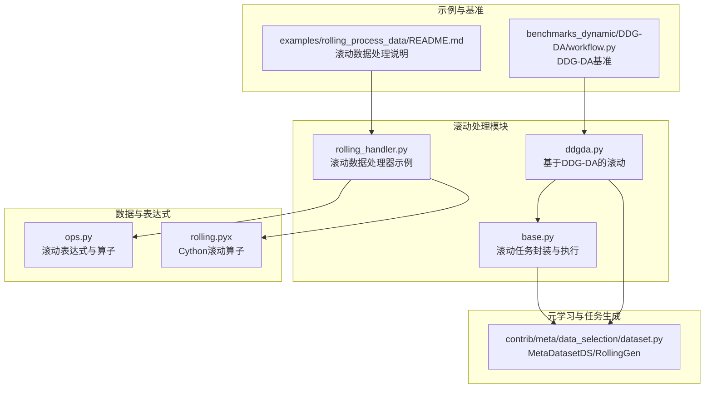
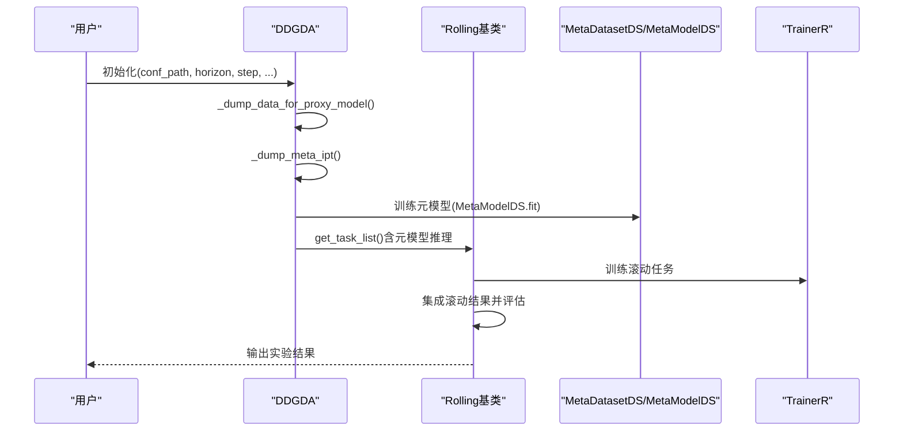
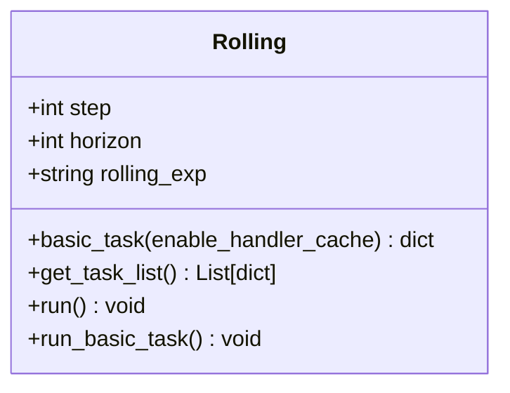
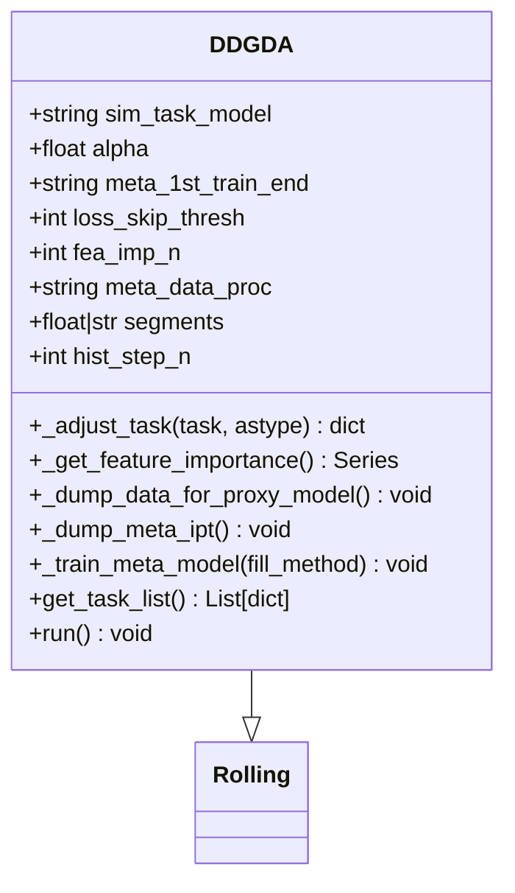
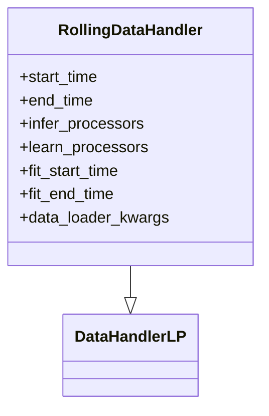
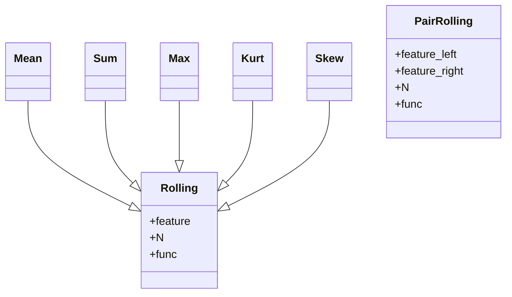
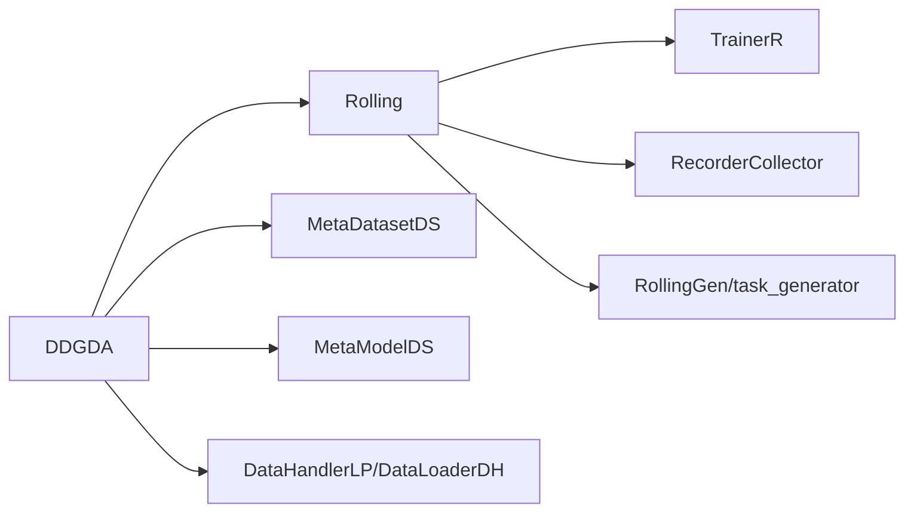

# 滚动处理贡献模块API

<cite>
**本文引用的文件**
- [base.py](file://qlib/contrib/rolling/base.py)
- [ddgda.py](file://qlib/contrib/rolling/ddgda.py)
- [rolling_handler.py](file://examples/rolling_process_data/rolling_handler.py)
- [workflow.py（DDG-DA基准）](file://examples/benchmarks_dynamic/DDG-DA/workflow.py)
- [rolling.pyx（Cydhon滚动算子）](file://qlib/data/_libs/rolling.pyx)
- [ops.py（滚动表达式与滚动算子）](file://qlib/data/ops.py)
- [dataset.py（Meta数据集）](file://qlib/contrib/meta/data_selection/dataset.py)
- [README（滚动处理数据示例）](file://examples/rolling_process_data/README.md)
</cite>

## 目录
1. [简介](#简介)
2. [项目结构](#项目结构)
3. [核心组件](#核心组件)
4. [架构总览](#架构总览)
5. [详细组件分析](#详细组件分析)
6. [依赖关系分析](#依赖关系分析)
7. [性能考量](#性能考量)
8. [故障排查指南](#故障排查指南)
9. [结论](#结论)
10. [附录：使用示例与最佳实践](#附录使用示例与最佳实践)

## 简介
本文件为 Qlib 滚动处理贡献模块的 API 参考文档，聚焦以下目标：
- 滚动窗口接口：滚动计算、窗口管理、数据滑动等核心能力
- DDG-DA 算法 API：基于元学习的动态数据驱动模型选择与自适应学习
- 滚动处理工具函数：滚动统计、趋势分析、异常检测等分析工具
- 滚动处理配置接口：窗口大小、步长、边界处理等参数
- 使用示例与最佳实践：在线学习、增量学习、模型持续优化等场景

## 项目结构
滚动处理相关代码主要位于以下位置：
- 滚动基础实现与任务生成：qlib/contrib/rolling
- 数据滚动处理器示例：examples/rolling_process_data
- DDG-DA 基准工作流：examples/benchmarks_dynamic/DDG-DA
- 数据层滚动算子与表达式：qlib/data/ops.py、qlib/data/_libs/rolling.pyx
- 元数据集与任务生成：qlib/contrib/meta/data_selection/dataset.py

**图表来源**
- [base.py:1-265](file://qlib/contrib/rolling/base.py#L1-L265)
- [ddgda.py:1-389](file://qlib/contrib/rolling/ddgda.py#L1-L389)
- [rolling_handler.py:1-33](file://examples/rolling_process_data/rolling_handler.py#L1-L33)
- [ops.py:708-1441](file://qlib/data/ops.py#L708-L1441)
- [rolling.pyx:193-207](file://qlib/data/_libs/rolling.pyx#L193-L207)
- [dataset.py:254-315](file://qlib/contrib/meta/data_selection/dataset.py#L254-L315)
- [workflow.py（DDG-DA基准）:1-46](file://examples/benchmarks_dynamic/DDG-DA/workflow.py#L1-L46)
- [README（滚动处理数据示例）:1-17](file://examples/rolling_process_data/README.md#L1-L17)

**章节来源**
- [base.py:1-265](file://qlib/contrib/rolling/base.py#L1-L265)
- [ddgda.py:1-389](file://qlib/contrib/rolling/ddgda.py#L1-L389)
- [rolling_handler.py:1-33](file://examples/rolling_process_data/rolling_handler.py#L1-L33)
- [ops.py:708-1441](file://qlib/data/ops.py#L708-L1441)
- [rolling.pyx:193-207](file://qlib/data/_libs/rolling.pyx#L193-L207)
- [dataset.py:254-315](file://qlib/contrib/meta/data_selection/dataset.py#L254-L315)
- [workflow.py（DDG-DA基准）:1-46](file://examples/benchmarks_dynamic/DDG-DA/workflow.py#L1-L46)
- [README（滚动处理数据示例）:1-17](file://examples/rolling_process_data/README.md#L1-L17)

## 核心组件
- 滚动基类 Rolling
  - 负责将单任务转换为滚动任务序列，支持步长、截断天数、边界时间调整、缓存处理器等
  - 提供基本任务构建、任务列表生成、训练与集成、评估更新等流程
- DDG-DA 子类 DDGDA
  - 在 Rolling 基础上，引入元学习：特征重要性、代理模型数据准备、内部数据封装、元模型训练与推理
  - 输出经元模型指导的重加权任务序列，用于最终滚动训练
- 滚动数据处理器示例 RollingDataHandler
  - 基于 DataHandlerLP 的滚动数据处理器，支持推断/学习期处理器配置与数据加载器
- 数据层滚动算子
  - 表达式级滚动（Mean/Sum/Max/Kurt/Skew 等）与 Cython 加速滚动（rolling_mean/rolling_slope 等）

**章节来源**
- [base.py:24-265](file://qlib/contrib/rolling/base.py#L24-L265)
- [ddgda.py:70-389](file://qlib/contrib/rolling/ddgda.py#L70-L389)
- [rolling_handler.py:6-33](file://examples/rolling_process_data/rolling_handler.py#L6-L33)
- [ops.py:713-969](file://qlib/data/ops.py#L713-L969)
- [rolling.pyx:193-207](file://qlib/data/_libs/rolling.pyx#L193-L207)

## 架构总览
滚动处理模块的总体流程分为两阶段：
- 准备阶段（仅 DDG-DA）：准备代理模型数据、封装内部数据、训练元模型
- 执行阶段：基于元模型对最终滚动任务进行重加权或筛选，然后统一训练与评估

**图表来源**
- [ddgda.py:373-389](file://qlib/contrib/rolling/ddgda.py#L373-L389)
- [base.py:194-260](file://qlib/contrib/rolling/base.py#L194-L260)
- [dataset.py:254-315](file://qlib/contrib/meta/data_selection/dataset.py#L254-L315)

## 详细组件分析

### 组件一：滚动基类 Rolling
- 主要职责
  - 解析配置、替换/缓存数据处理器、调整训练/测试时间边界
  - 构造基本任务、生成滚动任务列表、训练滚动任务、集成预测并评估
- 关键参数
  - conf_path：任务配置路径
  - horizon：预测窗口长度（必须显式提供）
  - step：滚动步长
  - train_start/test_end：训练/测试时间边界
  - h_path：外部处理器缓存路径（可覆盖原配置中的处理器）
  - task_ext_conf：任务配置扩展
  - rolling_exp：滚动实验名
- 关键方法
  - basic_task：构造基础任务（可选启用处理器缓存、覆盖标签、更新时间边界）
  - get_task_list：基于 RollingGen 生成滚动任务列表，并注入记录器
  - run：依次执行滚动训练、集成与评估

**图表来源**
- [base.py:53-265](file://qlib/contrib/rolling/base.py#L53-L265)

**章节来源**
- [base.py:53-265](file://qlib/contrib/rolling/base.py#L53-L265)

### 组件二：DDG-DA 子类 DDGDA
- 主要职责
  - 为元学习准备数据：特征重要性、代理模型数据、内部数据封装
  - 训练元模型（MetaModelDS），并在最终滚动任务中进行推理以生成新任务列表
- 关键参数
  - sim_task_model：相似度计算使用的模型类型（linear/gbdt）
  - meta_1st_train_end：第一阶段元任务训练结束时间
  - alpha：元模型正则化系数
  - loss_skip_thresh：按日跳过损失计算的阈值
  - fea_imp_n：特征重要性选择数量
  - meta_data_proc：元数据处理策略（如 V01）
  - segments：元任务数据划分方式（比例或指定日期）
  - hist_step_n：历史步长
  - working_dir：工作目录
- 关键方法
  - _adjust_task：根据用途调整模型与处理器
  - _get_feature_importance：提取特征重要性
  - _dump_data_for_proxy_model：准备代理模型数据与处理器缓存
  - _dump_meta_ipt：封装内部数据（InternalData）
  - _train_meta_model：训练元模型并保存
  - get_task_list：加载元模型，对最终滚动任务进行推理，返回新任务列表
  - run：串联准备与执行流程

**图表来源**
- [ddgda.py:70-389](file://qlib/contrib/rolling/ddgda.py#L70-L389)
- [base.py:24-265](file://qlib/contrib/rolling/base.py#L24-L265)

**章节来源**
- [ddgda.py:70-389](file://qlib/contrib/rolling/ddgda.py#L70-L389)

### 组件三：滚动数据处理器示例 RollingDataHandler
- 作用
  - 基于 DataHandlerLP 实现滚动场景下的数据处理器，支持推断期与学习期处理器配置
  - 通过数据加载器（DataLoaderDH）加载原始特征，再由处理器生成滚动窗口内的特征
- 关键点
  - 推断/学习期处理器需在指定时间范围内校验与配置
  - 支持传入自定义数据加载器参数

**图表来源**
- [rolling_handler.py:6-33](file://examples/rolling_process_data/rolling_handler.py#L6-L33)

**章节来源**
- [rolling_handler.py:6-33](file://examples/rolling_process_data/rolling_handler.py#L6-L33)
- [README（滚动处理数据示例）:1-17](file://examples/rolling_process_data/README.md#L1-L17)

### 组件四：数据层滚动算子与表达式
- 表达式级滚动
  - Rolling 基类封装滚动操作（Mean/Sum/Max/Kurt/Skew 等），支持 expanding 与 rolling 两种模式
  - PairRolling 支持两个序列之间的滚动运算
- Cython 加速滚动
  - 提供 rolling_mean、rolling_slope、rolling_rsquare、rolling_resi 等加速实现

**图表来源**
- [ops.py:713-969](file://qlib/data/ops.py#L713-L969)
- [ops.py:1387-1441](file://qlib/data/ops.py#L1387-L1441)

**章节来源**
- [ops.py:708-1441](file://qlib/data/ops.py#L708-L1441)
- [rolling.pyx:193-207](file://qlib/data/_libs/rolling.pyx#L193-L207)

## 依赖关系分析
- 模块内依赖
  - DDGDA 继承自 Rolling，复用任务生成与训练流程
  - 通过 MetaDatasetDS/MetaModelDS 进行元学习与任务重加权
- 外部依赖
  - 数据处理：DataHandlerLP、DataLoaderDH
  - 训练：TrainerR
  - 工作流：RecorderCollector、SignalRecord、task_generator/RollingGen

**图表来源**
- [ddgda.py:304-320](file://qlib/contrib/rolling/ddgda.py#L304-L320)
- [base.py:194-260](file://qlib/contrib/rolling/base.py#L194-L260)
- [dataset.py:254-315](file://qlib/contrib/meta/data_selection/dataset.py#L254-L315)

**章节来源**
- [ddgda.py:304-320](file://qlib/contrib/rolling/ddgda.py#L304-L320)
- [base.py:194-260](file://qlib/contrib/rolling/base.py#L194-L260)
- [dataset.py:254-315](file://qlib/contrib/meta/data_selection/dataset.py#L254-L315)

## 性能考量
- Cython 加速滚动算子
  - 对常见滚动统计（如均值、斜率、R 方、残差）提供 Cython 实现，显著提升性能
- 处理器缓存
  - 通过 replace_task_handler_with_cache 将处理器结果持久化为缓存，避免重复数据生成
- 步长与截断
  - 合理设置 step 与 trunc_days，平衡任务数量与信息泄露风险
- 特征重要性筛选
  - 使用 fea_imp_n 限制特征维度，降低元模型与后续训练的计算开销

**章节来源**
- [rolling.pyx:193-207](file://qlib/data/_libs/rolling.pyx#L193-L207)
- [base.py:123-133](file://qlib/contrib/rolling/base.py#L123-L133)
- [ddgda.py:201-207](file://qlib/contrib/rolling/ddgda.py#L201-L207)

## 故障排查指南
- 实验名冲突
  - 若使用用户指定的 rolling_exp，可能出现同名实验无法创建的问题；建议清理 mlruns 或更换实验名
- 时间边界与信息泄露
  - trunc_days 应与 horizon 保持一致或更小，避免未来信息泄漏到训练集
- 处理器缓存与标签覆盖
  - 当启用处理器缓存时，可能无法自动覆盖标签；需确保配置一致性
- 元模型训练时间范围
  - 训练起止时间需与最终滚动测试时间对齐，避免数据泄漏

**章节来源**
- [base.py:99-108](file://qlib/contrib/rolling/base.py#L99-L108)
- [base.py:135-143](file://qlib/contrib/rolling/base.py#L135-L143)
- [ddgda.py:266-268](file://qlib/contrib/rolling/ddgda.py#L266-L268)

## 结论
滚动处理贡献模块提供了从基础滚动任务生成到基于元学习的动态模型选择与自适应优化的完整链路。通过 Rolling 与 DDGDA 的组合，用户可以在不牺牲效率的前提下，实现滚动训练、元模型指导的任务重加权以及最终的集成评估。配合数据层的滚动表达式与 Cython 加速算子，可在大规模时序数据上获得稳定且高效的性能。

## 附录：使用示例与最佳实践
- 基础滚动训练
  - 使用 Rolling.run 执行滚动训练与评估；可通过 step、horizon、train_start、test_end 等参数控制滚动窗口与边界
- DDG-DA 动态适配
  - 通过 DDGDA.run 完成代理模型数据准备、元模型训练与最终滚动任务的元推理；可调节 sim_task_model、alpha、fea_imp_n、segments 等参数
- 滚动数据处理
  - 使用 RollingDataHandler 在不同滚动窗口内生成一致的处理状态，避免重复计算
- 最佳实践
  - 在线/增量学习：结合 OnlineStrategy 与 RollingGen，按步长推进训练与预测
  - 模型持续优化：定期重新训练元模型并更新任务列表，以应对概念漂移
  - 边界处理：严格设置 trunc_days 与 segments，防止未来信息泄漏
  - 性能优化：启用处理器缓存、限制特征维度、使用 Cython 加速滚动算子

**章节来源**
- [base.py:253-260](file://qlib/contrib/rolling/base.py#L253-L260)
- [ddgda.py:373-389](file://qlib/contrib/rolling/ddgda.py#L373-L389)
- [rolling_handler.py:6-33](file://examples/rolling_process_data/rolling_handler.py#L6-L33)
- [workflow.py（DDG-DA基准）:26-36](file://examples/benchmarks_dynamic/DDG-DA/workflow.py#L26-L36)