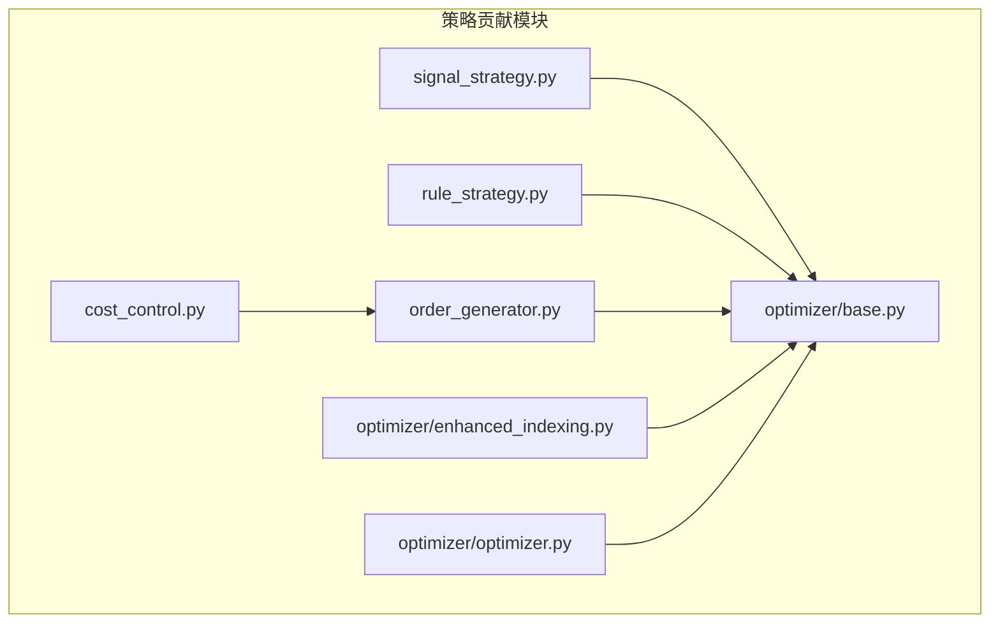
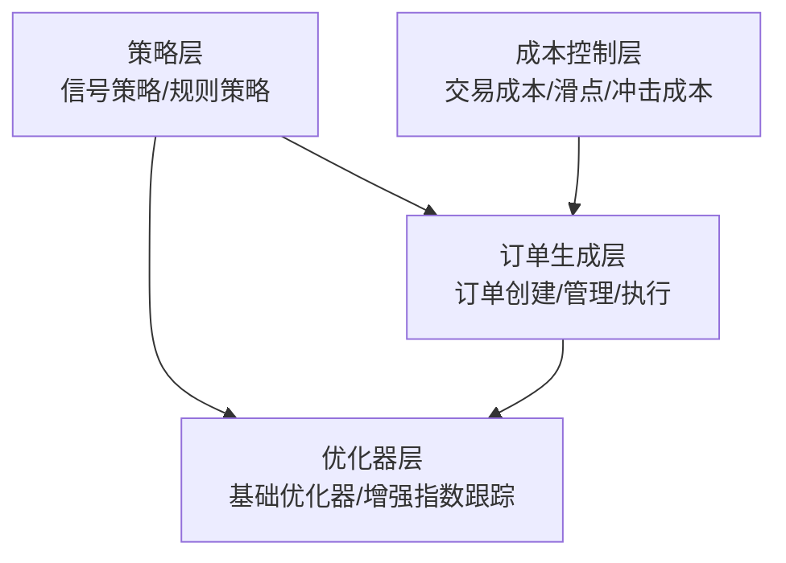
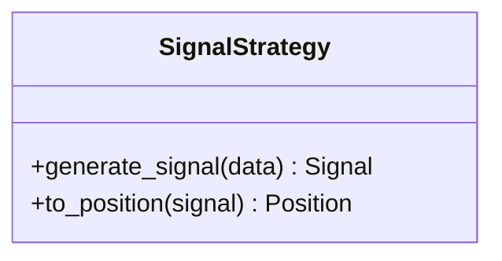
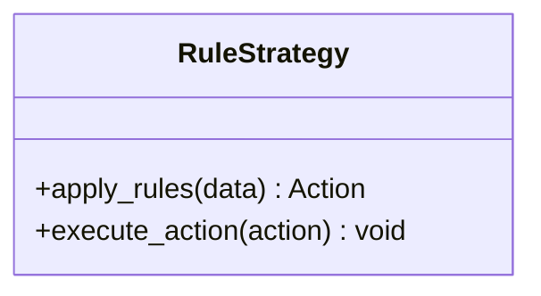
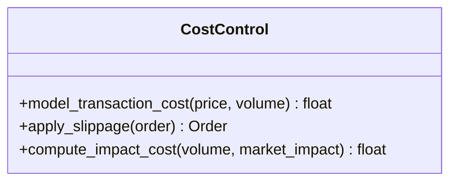
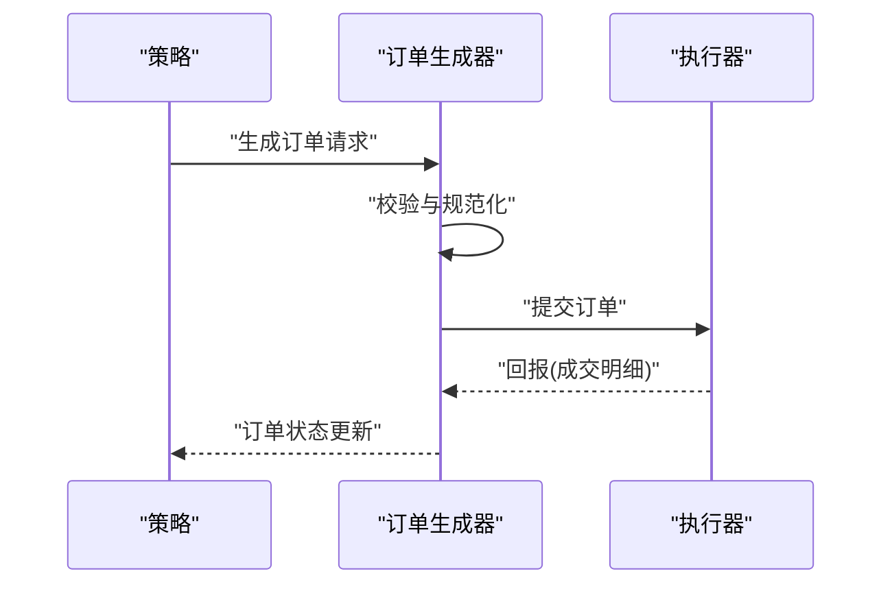
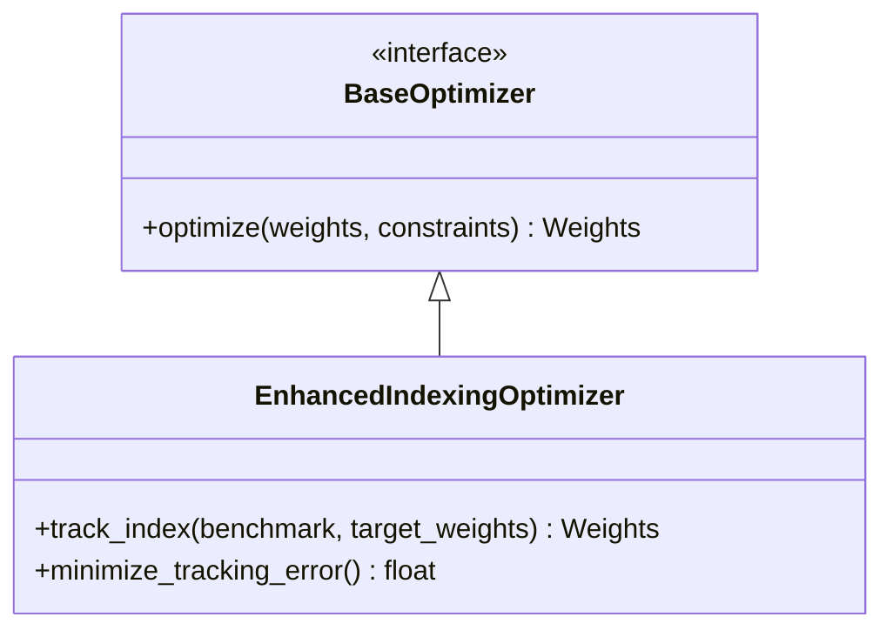
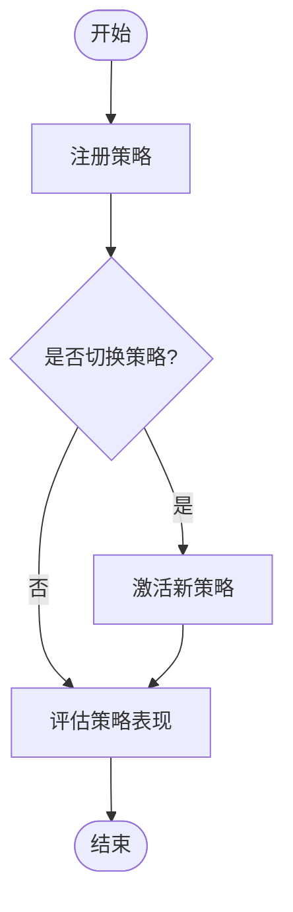
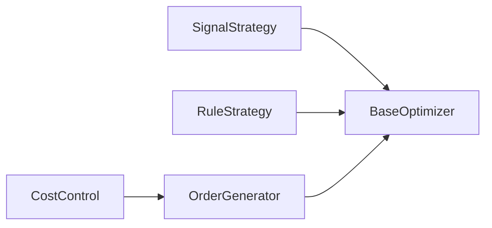

# 策略贡献模块API

<cite>
**本文档引用的文件**
- [signal_strategy.py](file://qlib/contrib/strategy/signal_strategy.py)
- [rule_strategy.py](file://qlib/contrib/strategy/rule_strategy.py)
- [cost_control.py](file://qlib/contrib/strategy/cost_control.py)
- [order_generator.py](file://qlib/contrib/strategy/order_generator.py)
- [base.py](file://qlib/contrib/strategy/optimizer/base.py)
- [enhanced_indexing.py](file://qlib/contrib/strategy/optimizer/enhanced_indexing.py)
- [optimizer.py](file://qlib/contrib/strategy/optimizer/optimizer.py)
- [__init__.py](file://qlib/contrib/strategy/__init__.py)
</cite>

## 目录
1. [简介](#简介)
2. [项目结构](#项目结构)
3. [核心组件](#核心组件)
4. [架构总览](#架构总览)
5. [详细组件分析](#详细组件分析)
6. [依赖关系分析](#依赖关系分析)
7. [性能考虑](#性能考虑)
8. [故障排查指南](#故障排查指南)
9. [结论](#结论)
10. [附录](#附录)

## 简介
本文件面向Qlib策略贡献模块的API参考，聚焦于策略框架接口与实现，包括基础策略类、信号策略、规则策略、成本控制策略等核心组件；策略优化器API（含增强指数跟踪优化器与基础优化器接口）；订单生成器接口（订单创建、管理与执行）；以及成本控制API（交易成本建模、滑点处理、冲击成本计算）。文档同时提供策略组合与策略管理的API接口说明，并给出可直接定位到源码位置的示例路径，帮助开发者快速理解与扩展策略功能。

## 项目结构
策略贡献模块位于 `qlib/contrib/strategy/` 目录下，主要由以下子模块组成：
- 策略层：信号策略、规则策略
- 成本控制：交易成本、滑点、冲击成本
- 订单生成器：订单创建、管理、执行
- 优化器：基础优化器接口、增强指数跟踪优化器
- 导出入口：模块初始化导出

**图表来源**
- [signal_strategy.py](file://qlib/contrib/strategy/signal_strategy.py)
- [rule_strategy.py](file://qlib/contrib/strategy/rule_strategy.py)
- [cost_control.py](file://qlib/contrib/strategy/cost_control.py)
- [order_generator.py](file://qlib/contrib/strategy/order_generator.py)
- [base.py](file://qlib/contrib/strategy/optimizer/base.py)
- [enhanced_indexing.py](file://qlib/contrib/strategy/optimizer/enhanced_indexing.py)
- [optimizer.py](file://qlib/contrib/strategy/optimizer/optimizer.py)

**章节来源**
- [__init__.py](file://qlib/contrib/strategy/__init__.py)

## 核心组件
本节概述策略贡献模块的关键组件及其职责：
- 基础策略类：定义策略抽象接口与通用行为
- 信号策略：基于信号生成投资决策
- 规则策略：基于预设规则进行交易
- 成本控制：建模与控制交易成本、滑点与冲击成本
- 订单生成器：负责订单创建、管理与执行
- 优化器：提供优化目标与约束求解能力，包括增强指数跟踪

**章节来源**
- [signal_strategy.py](file://qlib/contrib/strategy/signal_strategy.py)
- [rule_strategy.py](file://qlib/contrib/strategy/rule_strategy.py)
- [cost_control.py](file://qlib/contrib/strategy/cost_control.py)
- [order_generator.py](file://qlib/contrib/strategy/order_generator.py)
- [base.py](file://qlib/contrib/strategy/optimizer/base.py)
- [enhanced_indexing.py](file://qlib/contrib/strategy/optimizer/enhanced_indexing.py)
- [optimizer.py](file://qlib/contrib/strategy/optimizer/optimizer.py)

## 架构总览
策略贡献模块采用分层设计：
- 策略层：信号策略与规则策略作为策略实现的基础
- 成本控制层：对交易过程中的成本进行统一建模与控制
- 订单生成层：将策略输出转化为可执行订单，并与执行器交互
- 优化器层：提供优化目标与算法接口，支持增强指数跟踪等高级优化

[此图为概念性架构示意，不直接映射具体源码文件，故无“图表来源”]

## 详细组件分析

### 信号策略组件
信号策略负责根据市场数据与模型输出生成交易信号，并据此制定买卖决策。其核心职责包括：
- 接收输入信号（如预测值、因子值）
- 将信号转换为仓位或下单指令
- 与成本控制与订单生成器协同工作

**图表来源**
- [signal_strategy.py](file://qlib/contrib/strategy/signal_strategy.py)

**章节来源**
- [signal_strategy.py](file://qlib/contrib/strategy/signal_strategy.py)

### 规则策略组件
规则策略通过预设规则进行交易决策，适用于简单、可解释的交易逻辑。其典型流程包括：
- 解析规则配置
- 对每个时点的数据应用规则
- 生成相应的交易动作

**图表来源**
- [rule_strategy.py](file://qlib/contrib/strategy/rule_strategy.py)

**章节来源**
- [rule_strategy.py](file://qlib/contrib/strategy/rule_strategy.py)

### 成本控制组件
成本控制模块用于建模与控制交易过程中的各类成本，包括：
- 交易成本建模：手续费、印花税等
- 滑点处理：对成交价格施加随机或系统性偏差
- 冲击成本计算：大额订单对市场的短期影响

**图表来源**
- [cost_control.py](file://qlib/contrib/strategy/cost_control.py)

**章节来源**
- [cost_control.py](file://qlib/contrib/strategy/cost_control.py)

### 订单生成器组件
订单生成器负责将策略输出转化为可执行订单，并管理订单生命周期：
- 订单创建：根据策略信号与账户状态生成订单
- 订单管理：跟踪订单状态、更新剩余量与成交情况
- 订单执行：与执行器交互完成实际成交

**图表来源**
- [order_generator.py](file://qlib/contrib/strategy/order_generator.py)

**章节来源**
- [order_generator.py](file://qlib/contrib/strategy/order_generator.py)

### 优化器组件
优化器提供策略优化的统一接口，支持多种优化目标与约束：
- 基础优化器接口：定义优化问题的抽象与求解流程
- 增强指数跟踪优化器：在跟踪基准指数的同时最小化跟踪误差与交易成本

**图表来源**
- [base.py](file://qlib/contrib/strategy/optimizer/base.py)
- [enhanced_indexing.py](file://qlib/contrib/strategy/optimizer/enhanced_indexing.py)

**章节来源**
- [base.py](file://qlib/contrib/strategy/optimizer/base.py)
- [enhanced_indexing.py](file://qlib/contrib/strategy/optimizer/enhanced_indexing.py)
- [optimizer.py](file://qlib/contrib/strategy/optimizer/optimizer.py)

### 策略组合与策略管理API
策略组合与管理涉及策略注册、切换与评估等能力：
- 策略注册：将自定义策略纳入系统
- 策略切换：在多个策略间动态切换
- 策略评估：对策略表现进行回测与指标评估

[此图为概念性流程示意，不直接映射具体源码文件，故无“图表来源”]

## 依赖关系分析
策略贡献模块内部依赖关系如下：
- 策略层依赖优化器层以获得权重优化能力
- 成本控制层与订单生成器协作，确保交易成本被正确建模与控制
- 订单生成器与执行器交互，形成闭环的交易执行链路

**图表来源**
- [signal_strategy.py](file://qlib/contrib/strategy/signal_strategy.py)
- [rule_strategy.py](file://qlib/contrib/strategy/rule_strategy.py)
- [cost_control.py](file://qlib/contrib/strategy/cost_control.py)
- [order_generator.py](file://qlib/contrib/strategy/order_generator.py)
- [base.py](file://qlib/contrib/strategy/optimizer/base.py)

**章节来源**
- [signal_strategy.py](file://qlib/contrib/strategy/signal_strategy.py)
- [rule_strategy.py](file://qlib/contrib/strategy/rule_strategy.py)
- [cost_control.py](file://qlib/contrib/strategy/cost_control.py)
- [order_generator.py](file://qlib/contrib/strategy/order_generator.py)
- [base.py](file://qlib/contrib/strategy/optimizer/base.py)

## 性能考虑
- 信号策略与规则策略应尽量避免重复计算，优先缓存中间结果
- 成本控制模块的滑点与冲击成本计算应尽量向量化，减少循环开销
- 订单生成器应批量处理订单，降低与执行器交互频率
- 优化器在大规模资产组合中建议采用稀疏优化与并行化策略

[本节为通用性能指导，不直接分析具体文件，故无“章节来源”]

## 故障排查指南
- 信号异常：检查信号生成逻辑与数据输入，确认信号范围与阈值设置
- 订单未成交：核对订单生成器的校验规则与执行器状态
- 成本异常：验证交易成本建模参数与滑点设置，检查冲击成本系数
- 优化失败：检查优化约束与初始权重，确认收敛条件与迭代次数

[本节为通用故障排查建议，不直接分析具体文件，故无“章节来源”]

## 结论
策略贡献模块提供了从策略生成、成本控制、订单执行到优化求解的完整链路。通过清晰的接口设计与模块化组织，开发者可以快速扩展新的策略类型、优化方法与成本控制手段，并将其无缝集成到Qlib的回测与实盘框架中。

[本节为总结性内容，不直接分析具体文件，故无“章节来源”]

## 附录
- 使用示例与代码路径定位：请参考各组件对应的源文件路径，结合注释与函数签名理解API用法
  - [信号策略示例路径](file://qlib/contrib/strategy/signal_strategy.py)
  - [规则策略示例路径](file://qlib/contrib/strategy/rule_strategy.py)
  - [成本控制示例路径](file://qlib/contrib/strategy/cost_control.py)
  - [订单生成器示例路径](file://qlib/contrib/strategy/order_generator.py)
  - [基础优化器示例路径](file://qlib/contrib/strategy/optimizer/base.py)
  - [增强指数跟踪优化器示例路径](file://qlib/contrib/strategy/optimizer/enhanced_indexing.py)
  - [优化器API示例路径](file://qlib/contrib/strategy/optimizer/optimizer.py)

[本节为附录性内容，不直接分析具体文件，故无“章节来源”]