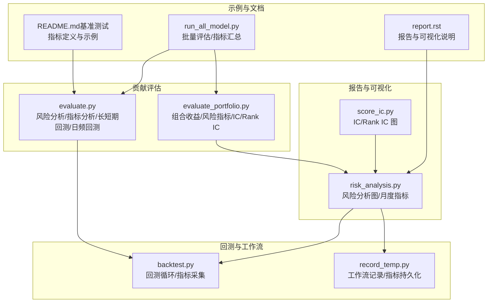
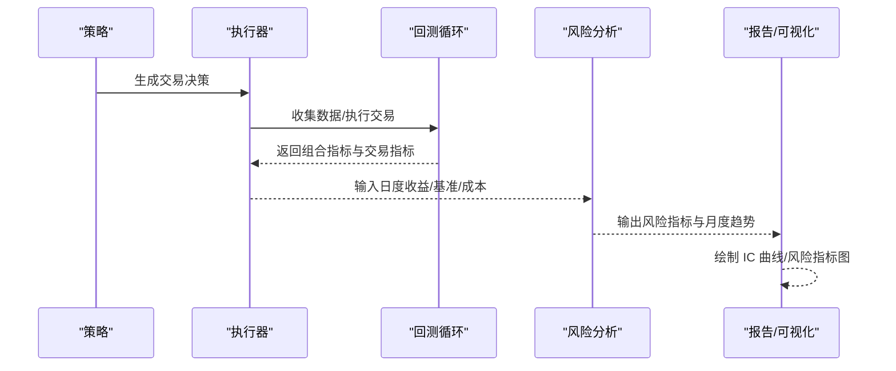
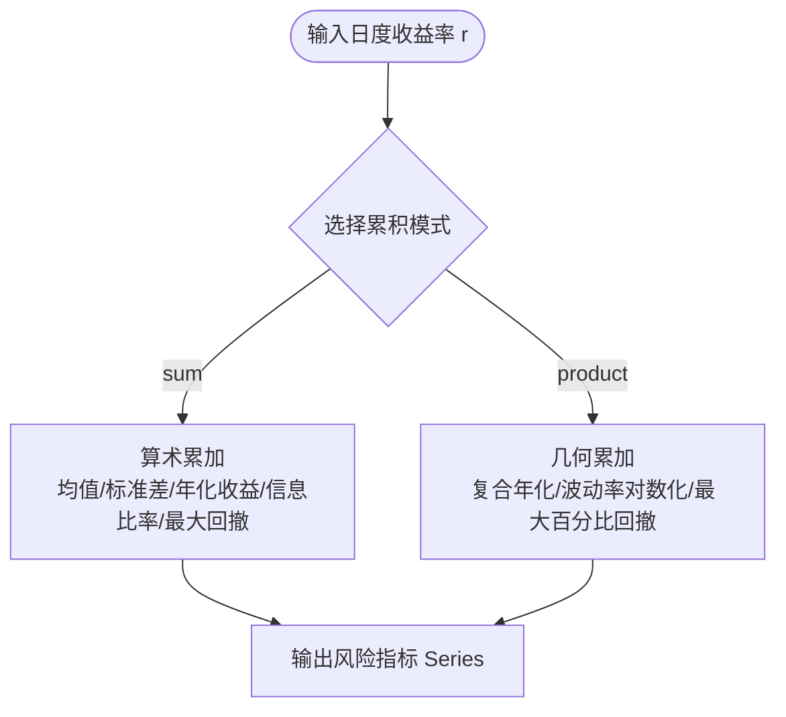
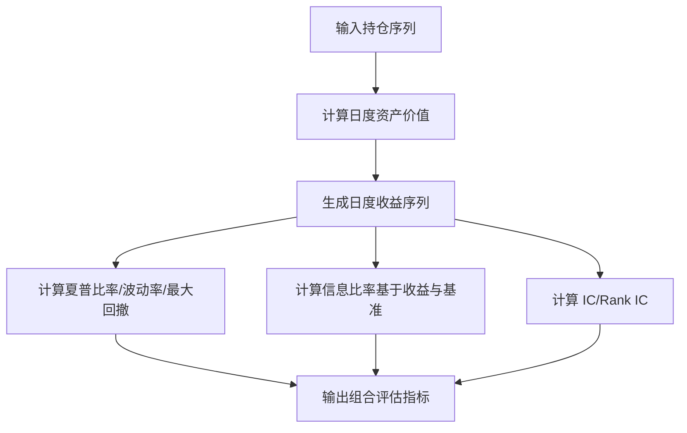
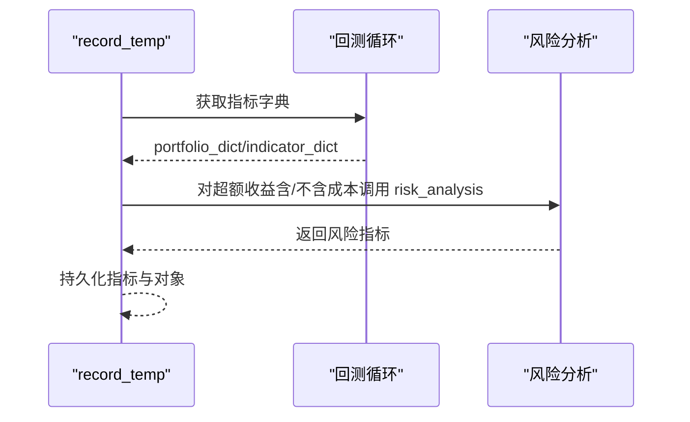
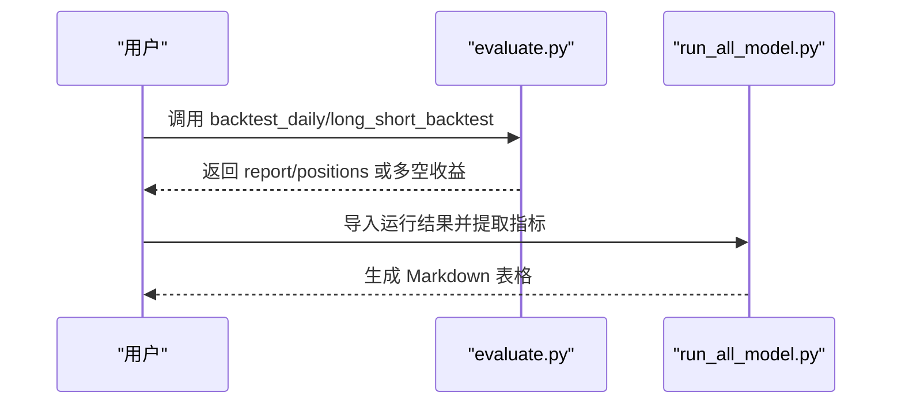
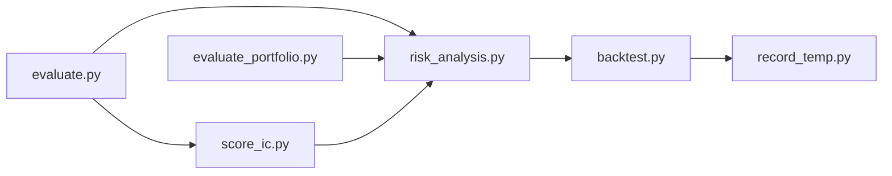

# 评估贡献模块API

<cite>
**本文引用的文件**
- [evaluate.py](file://qlib/contrib/evaluate.py)
- [evaluate_portfolio.py](file://qlib/contrib/evaluate_portfolio.py)
- [risk_analysis.py](file://qlib/contrib/report/analysis_position/risk_analysis.py)
- [score_ic.py](file://qlib/contrib/report/analysis_position/score_ic.py)
- [backtest.py](file://qlib/backtest/backtest.py)
- [record_temp.py](file://qlib/workflow/record_temp.py)
- [report.rst](file://docs/component/report.rst)
- [README.md（基准测试）](file://examples/benchmarks/README.md)
- [run_all_model.py](file://examples/run_all_model.py)
</cite>

## 目录
1. [简介](#简介)
2. [项目结构](#项目结构)
3. [核心组件](#核心组件)
4. [架构总览](#架构总览)
5. [详细组件分析](#详细组件分析)
6. [依赖分析](#依赖分析)
7. [性能考量](#性能考量)
8. [故障排查指南](#故障排查指南)
9. [结论](#结论)
10. [附录：使用示例与最佳实践](#附录使用示例与最佳实践)

## 简介
本文件为 Qlib 评估贡献模块的完整 API 参考文档，聚焦于模型评估与投资组合评估能力，覆盖以下主题：
- 模型评估接口：Alpha 评估（信息系数 IC、Rank IC、ICIR）、信号质量分析
- 投资组合评估接口：组合收益分析、风险评估（波动率、最大回撤、信息比率）、夏普比率、贝塔/阿尔法等
- 评估结果处理 API：统计分析、可视化展示（IC 曲线、月度风险指标、累计收益等）
- 评估流程与评估管道：批量评估、并行评估、结果汇总与持久化
- 实际使用示例与最佳实践，帮助开发者进行模型性能评估与优化

## 项目结构
评估相关代码主要分布在以下模块：
- 贡献层评估 API：提供通用的风险分析、指标分析、长短期回测、日频回测入口
- 报告与可视化：基于回测报告生成风险分析图、IC 图等
- 工作流记录：在工作流中收集并持久化指标与对象
- 示例与基准：提供基准模型的评估流程与指标汇总示例

图表来源
- [evaluate.py:26-94](file://qlib/contrib/evaluate.py#L26-L94)
- [evaluate_portfolio.py:105-244](file://qlib/contrib/evaluate_portfolio.py#L105-L244)
- [risk_analysis.py:15-92](file://qlib/contrib/report/analysis_position/risk_analysis.py#L15-L92)
- [score_ic.py:10-22](file://qlib/contrib/report/analysis_position/score_ic.py#L10-L22)
- [backtest.py:85-109](file://qlib/backtest/backtest.py#L85-L109)
- [record_temp.py:495-512](file://qlib/workflow/record_temp.py#L495-L512)
- [README.md（基准测试）:81-88](file://examples/benchmarks/README.md#L81-L88)
- [run_all_model.py:160-185](file://examples/run_all_model.py#L160-L185)
- [report.rst:114-162](file://docs/component/report.rst#L114-L162)

章节来源
- [evaluate.py:1-420](file://qlib/contrib/evaluate.py#L1-L420)
- [evaluate_portfolio.py:1-245](file://qlib/contrib/evaluate_portfolio.py#L1-L245)
- [risk_analysis.py:1-298](file://qlib/contrib/report/analysis_position/risk_analysis.py#L1-L298)
- [score_ic.py:1-72](file://qlib/contrib/report/analysis_position/score_ic.py#L1-L72)
- [backtest.py:85-109](file://qlib/backtest/backtest.py#L85-L109)
- [record_temp.py:495-512](file://qlib/workflow/record_temp.py#L495-L512)
- [README.md（基准测试）:1-88](file://examples/benchmarks/README.md#L1-L88)
- [run_all_model.py:160-185](file://examples/run_all_model.py#L160-L185)
- [report.rst:114-162](file://docs/component/report.rst#L114-L162)

## 核心组件
- 风险分析与指标分析
  - 风险分析：支持算术累加与几何累加两种方式，输出均值、标准差、年化收益、信息比率、最大回撤
  - 指标分析：对交易指标（价格优势、成交比例、完成率等）按日进行统计
- 投资组合评估
  - 基于持仓序列生成日度收益序列、年化收益
  - 夏普比率、最大回撤、波动率、IC/Rank IC、贝塔/阿尔法等
- 回测与报告
  - 回测循环产出组合指标与交易指标；工作流记录器可持久化指标与对象
  - 报告模块提供风险分析图与 IC 图
- 评估流程与批量评估
  - 提供日频回测入口与长短期回测工具；示例脚本演示批量评估与指标汇总

章节来源
- [evaluate.py:26-94](file://qlib/contrib/evaluate.py#L26-L94)
- [evaluate.py:96-143](file://qlib/contrib/evaluate.py#L96-L143)
- [evaluate_portfolio.py:105-244](file://qlib/contrib/evaluate_portfolio.py#L105-L244)
- [backtest.py:85-109](file://qlib/backtest/backtest.py#L85-L109)
- [record_temp.py:495-512](file://qlib/workflow/record_temp.py#L495-L512)
- [risk_analysis.py:15-92](file://qlib/contrib/report/analysis_position/risk_analysis.py#L15-L92)
- [score_ic.py:10-22](file://qlib/contrib/report/analysis_position/score_ic.py#L10-L22)
- [run_all_model.py:160-185](file://examples/run_all_model.py#L160-L185)

## 架构总览
下图展示了从策略到回测、指标计算与可视化的整体流程。

图表来源
- [backtest.py:85-109](file://qlib/backtest/backtest.py#L85-L109)
- [evaluate.py:26-94](file://qlib/contrib/evaluate.py#L26-L94)
- [risk_analysis.py:162-298](file://qlib/contrib/report/analysis_position/risk_analysis.py#L162-L298)
- [score_ic.py:25-72](file://qlib/contrib/report/analysis_position/score_ic.py#L25-L72)

## 详细组件分析

### 风险分析与指标分析 API
- 风险分析（risk_analysis）
  - 功能：对日度收益率序列进行统计分析，支持“算术累加”和“几何累加”
  - 关键输出：均值、标准差、年化收益、信息比率、最大回撤
  - 参数要点：频率或缩放因子二选一；累积模式仅支持“sum”和“product”
- 指标分析（indicator_analysis）
  - 功能：对交易指标（如价格优势、完成率、成交比例）按日统计
  - 支持统计方法：均值、按成交量加权、按成交金额加权
  - 输入字段：必要字段包括价格优势、正向率、完成率；可选字段用于加权

图表来源
- [evaluate.py:26-94](file://qlib/contrib/evaluate.py#L26-L94)

章节来源
- [evaluate.py:26-94](file://qlib/contrib/evaluate.py#L26-L94)
- [evaluate.py:96-143](file://qlib/contrib/evaluate.py#L96-L143)

### 投资组合评估 API
- 日度收益与年化收益
  - 从持仓序列生成日度资产价值，计算日度收益序列与年化收益
- 风险指标
  - 夏普比率：基于年化收益与波动率
  - 最大回撤：基于复利曲线的最大回撤
  - 波动率：日度收益率标准差
  - 贝塔/阿尔法：以基准收益为参照计算
- 信息系数（IC/Rank IC）
  - 正态 IC：皮尔逊相关系数
  - 排序 IC：斯皮尔曼相关系数

图表来源
- [evaluate_portfolio.py:105-244](file://qlib/contrib/evaluate_portfolio.py#L105-L244)

章节来源
- [evaluate_portfolio.py:105-244](file://qlib/contrib/evaluate_portfolio.py#L105-L244)

### 回测与报告 API
- 回测循环（backtest_loop）
  - 产出组合指标字典与交易指标 DataFrame/对象，并返回给上层
- 工作流记录（record_temp）
  - 将指标对象与对象序列持久化为 artifacts，支持不同频率下的风险分析
- 风险分析图（risk_analysis_graph）
  - 对组合超额收益（含/不含交易成本）进行风险分析并绘制月度趋势图
- IC 图（score_ic_graph）
  - 计算每日 IC 与 Rank IC 并绘制时序图

图表来源
- [backtest.py:85-109](file://qlib/backtest/backtest.py#L85-L109)
- [record_temp.py:495-512](file://qlib/workflow/record_temp.py#L495-L512)
- [risk_analysis.py:162-298](file://qlib/contrib/report/analysis_position/risk_analysis.py#L162-L298)
- [score_ic.py:25-72](file://qlib/contrib/report/analysis_position/score_ic.py#L25-L72)

章节来源
- [backtest.py:85-109](file://qlib/backtest/backtest.py#L85-L109)
- [record_temp.py:495-512](file://qlib/workflow/record_temp.py#L495-L512)
- [risk_analysis.py:15-92](file://qlib/contrib/report/analysis_position/risk_analysis.py#L15-L92)
- [score_ic.py:10-22](file://qlib/contrib/report/analysis_position/score_ic.py#L10-L22)

### 评估流程与批量评估 API
- 日频回测（backtest_daily）
  - 快速初始化日频回测，返回标准化报告与持仓
- 长短期回测（long_short_backtest）
  - 基于预测信号构造多空组合，输出多头、空头与多空净收益序列
- 批量评估与指标汇总（run_all_model.py）
  - 从运行结果中提取 IC、ICIR、Rank IC、Rank ICIR、年化收益、信息比率、最大回撤等指标并生成表格

图表来源
- [evaluate.py:146-273](file://qlib/contrib/evaluate.py#L146-L273)
- [evaluate.py:276-397](file://qlib/contrib/evaluate.py#L276-L397)
- [run_all_model.py:160-185](file://examples/run_all_model.py#L160-L185)

章节来源
- [evaluate.py:146-273](file://qlib/contrib/evaluate.py#L146-L273)
- [evaluate.py:276-397](file://qlib/contrib/evaluate.py#L276-L397)
- [run_all_model.py:160-185](file://examples/run_all_model.py#L160-L185)

## 依赖分析
- 组件内聚与耦合
  - evaluate.py 与 evaluate_portfolio.py 分别负责“通用风险分析/指标分析”和“组合层面评估”，职责清晰
  - report 分析模块（risk_analysis.py、score_ic.py）依赖 evaluate.py 的风险分析能力
  - backtest.py 与 record_temp.py 协同产出并持久化指标
- 外部依赖
  - 数据访问：通过 D.features 获取行情数据
  - 可视化：Plotly 图形组件
  - 统计：NumPy、Pandas、SciPy（spearmanr/pearsonr）

图表来源
- [evaluate.py:1-420](file://qlib/contrib/evaluate.py#L1-L420)
- [evaluate_portfolio.py:1-245](file://qlib/contrib/evaluate_portfolio.py#L1-L245)
- [risk_analysis.py:1-298](file://qlib/contrib/report/analysis_position/risk_analysis.py#L1-L298)
- [score_ic.py:1-72](file://qlib/contrib/report/analysis_position/score_ic.py#L1-L72)
- [backtest.py:85-109](file://qlib/backtest/backtest.py#L85-L109)
- [record_temp.py:495-512](file://qlib/workflow/record_temp.py#L495-L512)

章节来源
- [evaluate.py:1-420](file://qlib/contrib/evaluate.py#L1-L420)
- [evaluate_portfolio.py:1-245](file://qlib/contrib/evaluate_portfolio.py#L1-L245)
- [risk_analysis.py:1-298](file://qlib/contrib/report/analysis_position/risk_analysis.py#L1-L298)
- [score_ic.py:1-72](file://qlib/contrib/report/analysis_position/score_ic.py#L1-L72)
- [backtest.py:85-109](file://qlib/backtest/backtest.py#L85-L109)
- [record_temp.py:495-512](file://qlib/workflow/record_temp.py#L495-L512)

## 性能考量
- 计算复杂度
  - 风险分析与指标分析均为 O(T)（T 为交易日数量），适合大规模回测场景
  - IC/Rank IC 计算按日分组，复杂度受样本规模影响
- 数据访问
  - 组合评估中的收盘价查询建议控制时间窗口，避免不必要的磁盘缓存开销
- 可视化
  - 大时间跨度的 IC 图建议启用范围断点，提升渲染效率

## 故障排查指南
- 风险分析参数冲突
  - 当同时提供 N 与 freq 时会发出警告；请确保二者仅传入其一
- 频率与缩放因子
  - 若未提供 N 且 freq 解析失败，将抛出异常；请检查频率字符串格式
- 回测未生成组合指标
  - 在工作流记录中若缺少对应频率的报告，会发出警告；请确认已开启组合指标生成
- IC 图缺失数据
  - 当某日标签或分数为空时会被丢弃；请检查数据预处理与对齐逻辑

章节来源
- [evaluate.py:58-63](file://qlib/contrib/evaluate.py#L58-L63)
- [record_temp.py:499-503](file://qlib/workflow/record_temp.py#L499-L503)
- [score_ic.py:16-18](file://qlib/contrib/report/analysis_position/score_ic.py#L16-L18)

## 结论
Qlib 评估贡献模块提供了从信号质量评估到投资组合风险分析的完整链路，配合可视化与工作流记录，能够高效支撑模型性能评估与优化。建议在实际工程中：
- 使用 backtest_daily 与 long_short_backtest 快速验证策略
- 通过 risk_analysis 与 report 分析模块持续监控组合表现
- 利用 run_all_model.py 进行批量评估与对比

## 附录：使用示例与最佳实践
- 指标定义参考
  - IC、ICIR、Rank IC、Rank ICIR、年化收益、信息比率、最大回撤等指标的定义与解释可参考基准测试文档与报告文档
- 批量评估与表格生成
  - 示例脚本演示如何从运行结果中提取关键指标并生成 Markdown 表格
- 可视化最佳实践
  - 使用 risk_analysis_graph 展示超额收益（含/不含成本）的月度趋势
  - 使用 score_ic_graph 展示每日 IC 与 Rank IC 的时序变化

章节来源
- [README.md（基准测试）:81-88](file://examples/benchmarks/README.md#L81-L88)
- [report.rst:114-162](file://docs/component/report.rst#L114-L162)
- [report.rst:305-349](file://docs/component/report.rst#L305-L349)
- [run_all_model.py:160-185](file://examples/run_all_model.py#L160-L185)