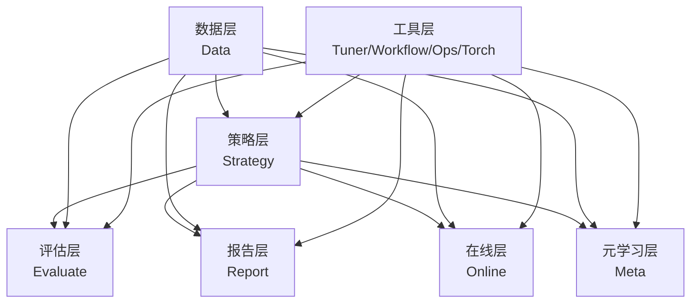
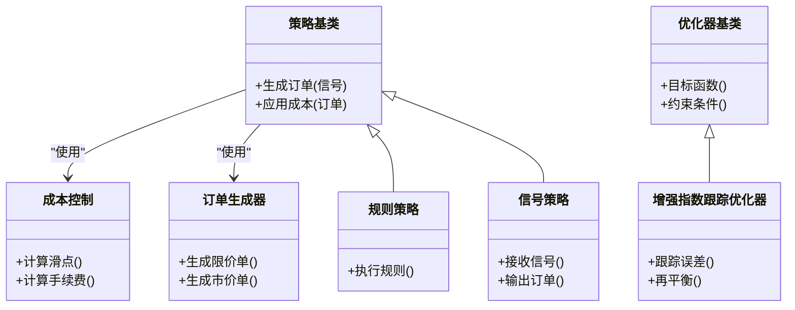
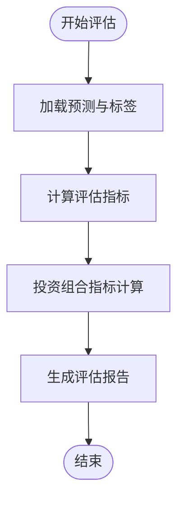
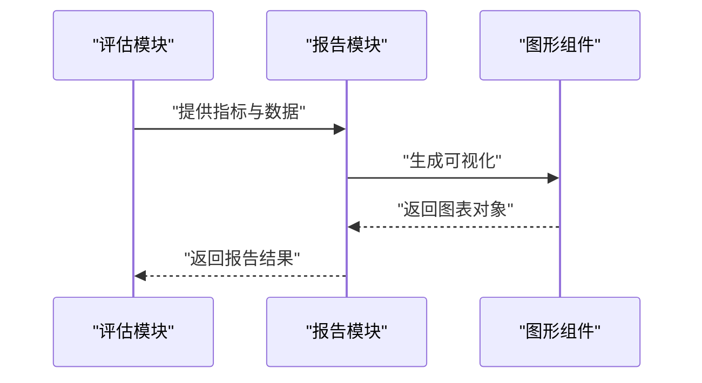
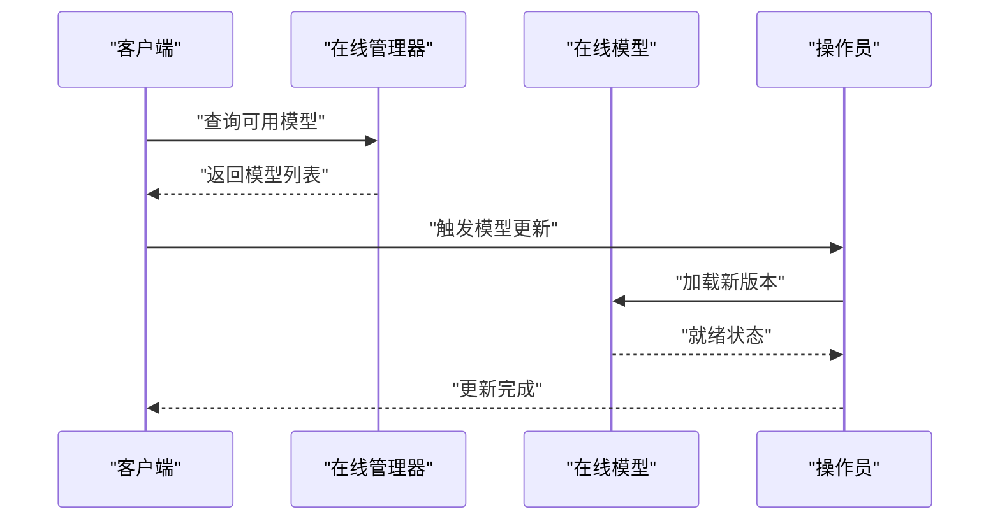
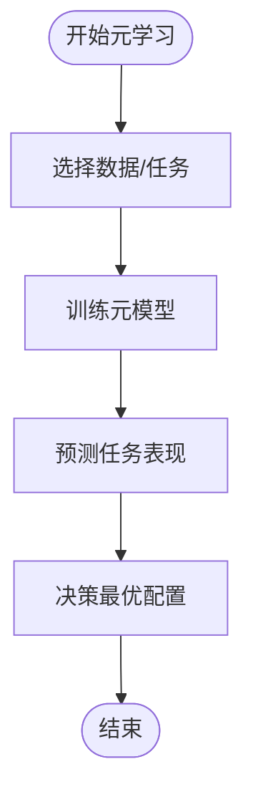
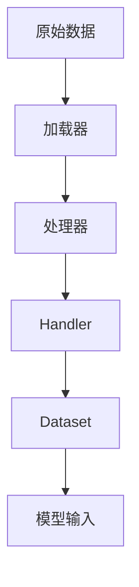
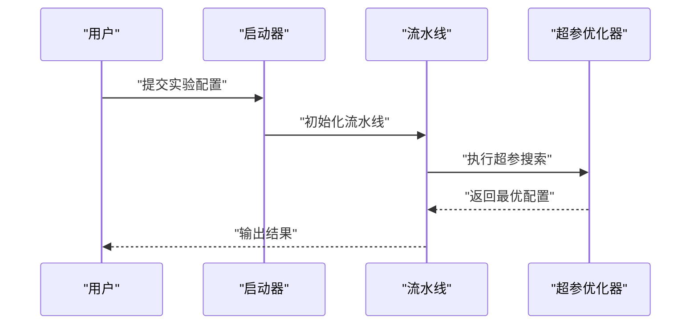
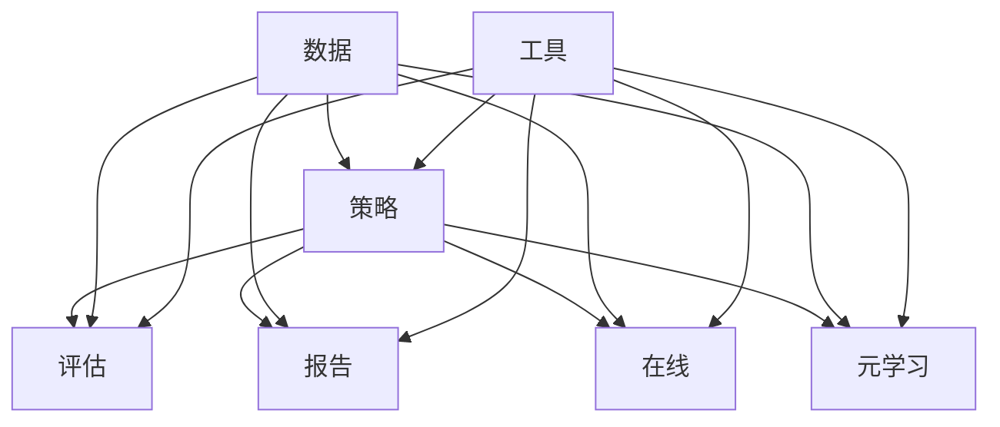

# 贡献模块API

<cite>
**本文引用的文件**
- [evaluate.py](file://qlib/contrib/evaluate.py)
- [evaluate_portfolio.py](file://qlib/contrib/evaluate_portfolio.py)
- [report/__init__.py](file://qlib/contrib/report/__init__.py)
- [analysis_model_performance.py](file://qlib/contrib/report/analysis_model/analysis_model_performance.py)
- [cumulative_return.py](file://qlib/contrib/report/analysis_position/cumulative_return.py)
- [parse_position.py](file://qlib/contrib/report/analysis_position/parse_position.py)
- [risk_analysis.py](file://qlib/contrib/report/analysis_position/risk_analysis.py)
- [score_ic.py](file://qlib/contrib/report/analysis_position/score_ic.py)
- [graph.py](file://qlib/contrib/report/graph.py)
- [utils.py](file://qlib/contrib/report/utils.py)
- [online/__init__.py](file://qlib/contrib/online/__init__.py)
- [manager.py](file://qlib/contrib/online/manager.py)
- [online_model.py](file://qlib/contrib/online/online_model.py)
- [operator.py](file://qlib/contrib/online/operator.py)
- [user.py](file://qlib/contrib/online/user.py)
- [utils.py](file://qlib/contrib/online/utils.py)
- [meta/__init__.py](file://qlib/contrib/meta/__init__.py)
- [dataset.py](file://qlib/contrib/meta/data_selection/dataset.py)
- [model.py](file://qlib/contrib/meta/data_selection/model.py)
- [net.py](file://qlib/contrib/meta/data_selection/net.py)
- [utils.py](file://qlib/contrib/meta/data_selection/utils.py)
- [strategy/__init__.py](file://qlib/contrib/strategy/__init__.py)
- [cost_control.py](file://qlib/contrib/strategy/cost_control.py)
- [order_generator.py](file://qlib/contrib/strategy/order_generator.py)
- [rule_strategy.py](file://qlib/contrib/strategy/rule_strategy.py)
- [signal_strategy.py](file://qlib/contrib/strategy/signal_strategy.py)
- [optimizer/base.py](file://qlib/contrib/strategy/optimizer/base.py)
- [optimizer/enhanced_indexing.py](file://qlib/contrib/strategy/optimizer/enhanced_indexing.py)
- [optimizer/optimizer.py](file://qlib/contrib/strategy/optimizer/optimizer.py)
- [tuner/__init__.py](file://qlib/contrib/tuner/__init__.py)
- [tuner/config.py](file://qlib/contrib/tuner/config.py)
- [tuner/launcher.py](file://qlib/contrib/tuner/lancher.py)
- [tuner/pipeline.py](file://qlib/contrib/tuner/pipeline.py)
- [tuner/space.py](file://qlib/contrib/tuner/space.py)
- [tuner/tuner.py](file://qlib/contrib/tuner/tuner.py)
- [workflow/record_temp.py](file://qlib/contrib/workflow/record_temp.py)
- [data/data.py](file://qlib/contrib/data/data.py)
- [data/dataset.py](file://qlib/contrib/data/dataset.py)
- [data/handler.py](file://qlib/contrib/data/handler.py)
- [data/highfreq_handler.py](file://qlib/contrib/data/highfreq_handler.py)
- [data/highfreq_processor.py](file://qlib/contrib/data/highfreq_processor.py)
- [data/highfreq_provider.py](file://qlib/contrib/data/highfreq_provider.py)
- [data/loader.py](file://qlib/contrib/data/loader.py)
- [data/processor.py](file://qlib/contrib/data/processor.py)
- [data/utils/sepdf.py](file://qlib/contrib/data/utils/sepdf.py)
- [ops/high_freq.py](file://qlib/contrib/ops/high_freq.py)
- [torch.py](file://qlib/contrib/torch.py)
</cite>

## 目录
1. [引言](#引言)
2. [项目结构](#项目结构)
3. [核心组件](#核心组件)
4. [架构总览](#架构总览)
5. [详细组件分析](#详细组件分析)
6. [依赖分析](#依赖分析)
7. [性能考虑](#性能考虑)
8. [故障排查指南](#故障排查指南)
9. [结论](#结论)
10. [附录](#附录)

## 引言
本文件面向开发者与研究者，系统梳理 Qlib 贡献模块（contrib）中的策略（Strategy）、评估（Evaluate）、报告（Report）、在线（Online）、元学习（Meta）等子模块的 API 与使用方法，覆盖交易策略实现、策略组合与优化、模型与投资组合评估、报告组件、在线模型管理与实时预测、元学习的数据选择与任务建模能力，并提供最佳实践与排错建议。文档以“可操作”为目标，既给出高层概览，也提供代码级图示与定位路径，便于快速上手与深度扩展。

## 项目结构
贡献模块位于 qlib/contrib 下，按功能域划分为：策略、评估、报告、在线、元学习、数据处理、工具与扩展等子包。下图展示主要模块与关键文件的关系：

```mermaid
graph TB
subgraph "策略(Strategy)"
S_API["strategy/__init__.py"]
S_COST["cost_control.py"]
S_ORDER["order_generator.py"]
S_RULE["rule_strategy.py"]
S_SIGNAL["signal_strategy.py"]
S_OPT_BASE["optimizer/base.py"]
S_OPT_ENH["optimizer/enhanced_indexing.py"]
S_OPT_MAIN["optimizer/optimizer.py"]
end
subgraph "评估(Evaluate)"
E_EVAL["evaluate.py"]
E_PORT["evaluate_portfolio.py"]
end
subgraph "报告(Report)"
R_API["report/__init__.py"]
R_PERF["analysis_model/analysis_model_performance.py"]
R_POS_RET["analysis_position/cumulative_return.py"]
R_PARSE["analysis_position/parse_position.py"]
R_RISK["analysis_position/risk_analysis.py"]
R_IC["analysis_position/score_ic.py"]
R_GRAPH["graph.py"]
R_UTILS["utils.py"]
end
subgraph "在线(Online)"
O_API["online/__init__.py"]
O_MGR["manager.py"]
O_MODEL["online_model.py"]
O_OP["operator.py"]
O_USER["user.py"]
O_OPS["utils.py"]
end
subgraph "元学习(Meta)"
M_API["meta/__init__.py"]
M_DS["data_selection/dataset.py"]
M_MD["data_selection/model.py"]
M_NET["data_selection/net.py"]
M_UTIL["data_selection/utils.py"]
end
subgraph "数据(Data)"
D_API["data/__init__.py"]
D_DATA["data/data.py"]
D_DSET["data/dataset.py"]
D_HANDLER["data/handler.py"]
D_HFH["data/highfreq_handler.py"]
D_HFP["data/highfreq_processor.py"]
D_HFR["data/highfreq_provider.py"]
D_LOADER["data/loader.py"]
D_PROC["data/processor.py"]
D_SEPDF["data/utils/sepdf.py"]
end
subgraph "工具与扩展"
T_TUNER["tuner/__init__.py"]
T_CFG["tuner/config.py"]
T_LCH["tuner/launcher.py"]
T_PIPE["tuner/pipeline.py"]
T_SPACE["tuner/space.py"]
T_RUN["tuner/tuner.py"]
T_WORK["workflow/record_temp.py"]
T_OPS["ops/high_freq.py"]
T_TORCH["torch.py"]
end
S_API --> S_COST
S_API --> S_ORDER
S_API --> S_RULE
S_API --> S_SIGNAL
S_API --> S_OPT_BASE
S_API --> S_OPT_ENH
S_API --> S_OPT_MAIN
R_API --> R_PERF
R_API --> R_POS_RET
R_API --> R_PARSE
R_API --> R_RISK
R_API --> R_IC
R_API --> R_GRAPH
R_API --> R_UTILS
O_API --> O_MGR
O_API --> O_MODEL
O_API --> O_OP
O_API --> O_USER
O_API --> O_OPS
M_API --> M_DS
M_API --> M_MD
M_API --> M_NET
M_API --> M_UTIL
D_API --> D_DATA
D_API --> D_DSET
D_API --> D_HANDLER
D_API --> D_HFH
D_API --> D_HFP
D_API --> D_HFR
D_API --> D_LOADER
D_API --> D_PROC
D_API --> D_SEPDF
T_TUNER --> T_CFG
T_TUNER --> T_LCH
T_TUNER --> T_PIPE
T_TUNER --> T_SPACE
T_TUNER --> T_RUN
T_TUNER --> T_WORK
T_TUNER --> T_OPS
T_TUNER --> T_TORCH
```

图表来源
- [strategy/__init__.py](file://qlib/contrib/strategy/__init__.py)
- [report/__init__.py](file://qlib/contrib/report/__init__.py)
- [online/__init__.py](file://qlib/contrib/online/__init__.py)
- [meta/__init__.py](file://qlib/contrib/meta/__init__.py)
- [data/data.py](file://qlib/contrib/data/data.py)
- [tuner/__init__.py](file://qlib/contrib/tuner/__init__.py)

章节来源
- [strategy/__init__.py](file://qlib/contrib/strategy/__init__.py)
- [report/__init__.py](file://qlib/contrib/report/__init__.py)
- [online/__init__.py](file://qlib/contrib/online/__init__.py)
- [meta/__init__.py](file://qlib/contrib/meta/__init__.py)
- [data/data.py](file://qlib/contrib/data/data.py)
- [tuner/__init__.py](file://qlib/contrib/tuner/__init__.py)

## 核心组件
本节概述各模块职责与关键入口，便于快速定位与扩展。

- 策略（Strategy）
  - 提供成本控制、订单生成、规则与信号驱动的交易策略基类与实现，支持策略组合与优化器接口。
  - 关键文件：[cost_control.py](file://qlib/contrib/strategy/cost_control.py)，[order_generator.py](file://qlib/contrib/strategy/order_generator.py)，[rule_strategy.py](file://qlib/contrib/strategy/rule_strategy.py)，[signal_strategy.py](file://qlib/contrib/strategy/signal_strategy.py)，[optimizer/base.py](file://qlib/contrib/strategy/optimizer/base.py)，[optimizer/enhanced_indexing.py](file://qlib/contrib/strategy/optimizer/enhanced_indexing.py)，[optimizer/optimizer.py](file://qlib/contrib/strategy/optimizer/optimizer.py)。

- 评估（Evaluate）
  - 提供模型与投资组合评估接口，包含指标计算与结果分析。
  - 关键文件：[evaluate.py](file://qlib/contrib/evaluate.py)，[evaluate_portfolio.py](file://qlib/contrib/evaluate_portfolio.py)。

- 报告（Report）
  - 提供模型性能、位置分析、风险分析、IC评分、累计收益等报告组件与可视化。
  - 关键文件：[analysis_model_performance.py](file://qlib/contrib/report/analysis_model/analysis_model_performance.py)，[cumulative_return.py](file://qlib/contrib/report/analysis_position/cumulative_return.py)，[parse_position.py](file://qlib/contrib/report/analysis_position/parse_position.py)，[risk_analysis.py](file://qlib/contrib/report/analysis_position/risk_analysis.py)，[score_ic.py](file://qlib/contrib/report/analysis_position/score_ic.py)，[graph.py](file://qlib/contrib/report/graph.py)，[utils.py](file://qlib/contrib/report/utils.py)。

- 在线（Online）
  - 提供在线模型管理、用户与操作员接口、在线预测与更新流程。
  - 关键文件：[manager.py](file://qlib/contrib/online/manager.py)，[online_model.py](file://qlib/contrib/online/online_model.py)，[operator.py](file://qlib/contrib/online/operator.py)，[user.py](file://qlib/contrib/online/user.py)，[utils.py](file://qlib/contrib/online/utils.py)。

- 元学习（Meta）
  - 提供数据选择、元模型与网络组件，支撑动态模型选择与多任务学习。
  - 关键文件：[dataset.py](file://qlib/contrib/meta/data_selection/dataset.py)，[model.py](file://qlib/contrib/meta/data_selection/model.py)，[net.py](file://qlib/contrib/meta/data_selection/net.py)，[utils.py](file://qlib/contrib/meta/data_selection/utils.py)。

- 数据（Data）
  - 提供数据加载、处理器、高频数据适配与缓存工具。
  - 关键文件：[data/data.py](file://qlib/contrib/data/data.py)，[data/dataset.py](file://qlib/contrib/data/dataset.py)，[data/handler.py](file://qlib/contrib/data/handler.py)，[data/highfreq_handler.py](file://qlib/contrib/data/highfreq_handler.py)，[data/highfreq_processor.py](file://qlib/contrib/data/highfreq_processor.py)，[data/highfreq_provider.py](file://qlib/contrib/data/highfreq_provider.py)，[data/loader.py](file://qlib/contrib/data/loader.py)，[data/processor.py](file://qlib/contrib/data/processor.py)，[data/utils/sepdf.py](file://qlib/contrib/data/utils/sepdf.py)。

- 工具与扩展（Tuner、Workflow、Ops、Torch）
  - 提供超参搜索、流水线、高频算子与扩展工具。
  - 关键文件：[tuner/config.py](file://qlib/contrib/tuner/config.py)，[tuner/launcher.py](file://qlib/contrib/tuner/launcher.py)，[tuner/pipeline.py](file://qlib/contrib/tuner/pipeline.py)，[tuner/space.py](file://qlib/contrib/tuner/space.py)，[tuner/tuner.py](file://qlib/contrib/tuner/tuner.py)，[workflow/record_temp.py](file://qlib/contrib/workflow/record_temp.py)，[ops/high_freq.py](file://qlib/contrib/ops/high_freq.py)，[torch.py](file://qlib/contrib/torch.py)。

章节来源
- [strategy/__init__.py](file://qlib/contrib/strategy/__init__.py)
- [evaluate.py](file://qlib/contrib/evaluate.py)
- [evaluate_portfolio.py](file://qlib/contrib/evaluate_portfolio.py)
- [report/__init__.py](file://qlib/contrib/report/__init__.py)
- [online/__init__.py](file://qlib/contrib/online/__init__.py)
- [meta/__init__.py](file://qlib/contrib/meta/__init__.py)
- [data/data.py](file://qlib/contrib/data/data.py)
- [tuner/__init__.py](file://qlib/contrib/tuner/__init__.py)

## 架构总览
下图展示贡献模块内部的分层与交互关系：策略层负责交易决策与组合；评估层负责模型与投资组合打分；报告层负责可视化与分析；在线层负责模型生命周期管理；元学习层负责数据选择与任务建模；数据层提供统一数据抽象；工具层提供扩展与辅助能力。

图表来源
- [strategy/__init__.py](file://qlib/contrib/strategy/__init__.py)
- [evaluate.py](file://qlib/contrib/evaluate.py)
- [report/__init__.py](file://qlib/contrib/report/__init__.py)
- [online/__init__.py](file://qlib/contrib/online/__init__.py)
- [meta/__init__.py](file://qlib/contrib/meta/__init__.py)
- [data/data.py](file://qlib/contrib/data/data.py)
- [tuner/__init__.py](file://qlib/contrib/tuner/__init__.py)

## 详细组件分析

### 策略（Strategy）API
- 组件职责
  - 成本控制：封装滑点、手续费等交易成本模型，用于策略回测与执行阶段的成本估算与扣减。
  - 订单生成：根据信号或规则生成买卖指令，支持限价、市价、止损止盈等类型。
  - 规则与信号策略：提供基于规则与信号的交易框架，便于快速实现与组合不同策略。
  - 策略优化：提供优化器接口，支持增强型指数跟踪等目标函数与约束条件下的参数寻优。

- 关键类与方法（示意）
  - 成本控制：[cost_control.py](file://qlib/contrib/strategy/cost_control.py)
  - 订单生成：[order_generator.py](file://qlib/contrib/strategy/order_generator.py)
  - 规则策略：[rule_strategy.py](file://qlib/contrib/strategy/rule_strategy.py)
  - 信号策略：[signal_strategy.py](file://qlib/contrib/strategy/signal_strategy.py)
  - 优化器基类：[optimizer/base.py](file://qlib/contrib/strategy/optimizer/base.py)
  - 增强指数跟踪优化：[optimizer/enhanced_indexing.py](file://qlib/contrib/strategy/optimizer/enhanced_indexing.py)
  - 优化器主流程：[optimizer/optimizer.py](file://qlib/contrib/strategy/optimizer/optimizer.py)

- 使用示例与最佳实践
  - 将信号策略与订单生成器组合，接入成本控制模块，形成端到端的交易执行链路。
  - 在优化器中定义目标函数与约束，结合增强指数跟踪场景进行参数寻优。
  - 多策略组合时，通过统一的策略接口与优化器实现权重分配与再平衡。

图表来源
- [strategy/cost_control.py](file://qlib/contrib/strategy/cost_control.py)
- [strategy/order_generator.py](file://qlib/contrib/strategy/order_generator.py)
- [strategy/rule_strategy.py](file://qlib/contrib/strategy/rule_strategy.py)
- [strategy/signal_strategy.py](file://qlib/contrib/strategy/signal_strategy.py)
- [strategy/optimizer/base.py](file://qlib/contrib/strategy/optimizer/base.py)
- [strategy/optimizer/enhanced_indexing.py](file://qlib/contrib/strategy/optimizer/enhanced_indexing.py)
- [strategy/optimizer/optimizer.py](file://qlib/contrib/strategy/optimizer/optimizer.py)

章节来源
- [strategy/cost_control.py](file://qlib/contrib/strategy/cost_control.py)
- [strategy/order_generator.py](file://qlib/contrib/strategy/order_generator.py)
- [strategy/rule_strategy.py](file://qlib/contrib/strategy/rule_strategy.py)
- [strategy/signal_strategy.py](file://qlib/contrib/strategy/signal_strategy.py)
- [strategy/optimizer/base.py](file://qlib/contrib/strategy/optimizer/base.py)
- [strategy/optimizer/enhanced_indexing.py](file://qlib/contrib/strategy/optimizer/enhanced_indexing.py)
- [strategy/optimizer/optimizer.py](file://qlib/contrib/strategy/optimizer/optimizer.py)

### 评估（Evaluate）API
- 组件职责
  - 模型评估：提供模型预测质量评估指标与统计分析。
  - 投资组合评估：对策略产生的投资组合进行收益、波动、最大回撤等指标评估。

- 关键类与方法（示意）
  - 模型评估：[evaluate.py](file://qlib/contrib/evaluate.py)
  - 投资组合评估：[evaluate_portfolio.py](file://qlib/contrib/evaluate_portfolio.py)

- 使用示例与最佳实践
  - 在策略回测后调用评估接口，输出标准化指标以便跨模型比较。
  - 结合报告模块的可视化组件，生成评估报告与对比图表。

图表来源
- [evaluate.py](file://qlib/contrib/evaluate.py)
- [evaluate_portfolio.py](file://qlib/contrib/evaluate_portfolio.py)

章节来源
- [evaluate.py](file://qlib/contrib/evaluate.py)
- [evaluate_portfolio.py](file://qlib/contrib/evaluate_portfolio.py)

### 报告（Report）API
- 组件职责
  - 模型性能分析：提供模型预测质量的可视化与统计分析。
  - 位置分析：累计收益、IC评分、风险分析、仓位解析等。
  - 可视化与工具：提供通用绘图与分析工具。

- 关键类与方法（示意）
  - 模型性能分析：[analysis_model_performance.py](file://qlib/contrib/report/analysis_model/analysis_model_performance.py)
  - 累计收益：[cumulative_return.py](file://qlib/contrib/report/analysis_position/cumulative_return.py)
  - 仓位解析：[parse_position.py](file://qlib/contrib/report/analysis_position/parse_position.py)
  - 风险分析：[risk_analysis.py](file://qlib/contrib/report/analysis_position/risk_analysis.py)
  - IC评分：[score_ic.py](file://qlib/contrib/report/analysis_position/score_ic.py)
  - 报告图形：[graph.py](file://qlib/contrib/report/graph.py)
  - 报告工具：[utils.py](file://qlib/contrib/report/utils.py)

- 使用示例与最佳实践
  - 将评估结果与报告组件串联，输出可读性强的分析图表与统计摘要。
  - 使用风险分析与IC评分组件进行稳健性检验与因子有效性验证。

图表来源
- [analysis_model_performance.py](file://qlib/contrib/report/analysis_model/analysis_model_performance.py)
- [cumulative_return.py](file://qlib/contrib/report/analysis_position/cumulative_return.py)
- [parse_position.py](file://qlib/contrib/report/analysis_position/parse_position.py)
- [risk_analysis.py](file://qlib/contrib/report/analysis_position/risk_analysis.py)
- [score_ic.py](file://qlib/contrib/report/analysis_position/score_ic.py)
- [graph.py](file://qlib/contrib/report/graph.py)
- [utils.py](file://qlib/contrib/report/utils.py)

章节来源
- [analysis_model_performance.py](file://qlib/contrib/report/analysis_model/analysis_model_performance.py)
- [cumulative_return.py](file://qlib/contrib/report/analysis_position/cumulative_return.py)
- [parse_position.py](file://qlib/contrib/report/analysis_position/parse_position.py)
- [risk_analysis.py](file://qlib/contrib/report/analysis_position/risk_analysis.py)
- [score_ic.py](file://qlib/contrib/report/analysis_position/score_ic.py)
- [graph.py](file://qlib/contrib/report/graph.py)
- [utils.py](file://qlib/contrib/report/utils.py)

### 在线（Online）API
- 组件职责
  - 在线模型管理：注册、版本化、部署与更新在线模型。
  - 实时预测：提供在线预测接口，支持批量与流式请求。
  - 用户与操作员：区分角色权限与操作边界。
  - 工具与适配：提供在线环境下的通用工具与适配逻辑。

- 关键类与方法（示意）
  - 管理器：[manager.py](file://qlib/contrib/online/manager.py)
  - 在线模型：[online_model.py](file://qlib/contrib/online/online_model.py)
  - 操作员：[operator.py](file://qlib/contrib/online/operator.py)
  - 用户：[user.py](file://qlib/contrib/online/user.py)
  - 工具：[utils.py](file://qlib/contrib/online/utils.py)

- 使用示例与最佳实践
  - 通过管理器完成模型注册与版本切换，确保线上一致性。
  - 使用操作员接口进行灰度发布与AB实验，逐步扩大流量。
  - 结合用户接口进行权限校验与审计日志记录。

图表来源
- [manager.py](file://qlib/contrib/online/manager.py)
- [online_model.py](file://qlib/contrib/online/online_model.py)
- [operator.py](file://qlib/contrib/online/operator.py)
- [user.py](file://qlib/contrib/online/user.py)
- [utils.py](file://qlib/contrib/online/utils.py)

章节来源
- [manager.py](file://qlib/contrib/online/manager.py)
- [online_model.py](file://qlib/contrib/online/online_model.py)
- [operator.py](file://qlib/contrib/online/operator.py)
- [user.py](file://qlib/contrib/online/user.py)
- [utils.py](file://qlib/contrib/online/utils.py)

### 元学习（Meta）API
- 组件职责
  - 数据选择：在多任务或多模型场景下选择最优数据子集或任务组合。
  - 元模型与网络：构建元级别的模型与网络，实现动态模型选择与自适应学习。
  - 工具与实用函数：提供数据选择与元建模所需的辅助工具。

- 关键类与方法（示意）
  - 数据集：[dataset.py](file://qlib/contrib/meta/data_selection/dataset.py)
  - 模型：[model.py](file://qlib/contrib/meta/data_selection/model.py)
  - 网络：[net.py](file://qlib/contrib/meta/data_selection/net.py)
  - 工具：[utils.py](file://qlib/contrib/meta/data_selection/utils.py)

- 使用示例与最佳实践
  - 在多任务学习场景中，利用数据选择组件筛选高价值任务，提升整体泛化性能。
  - 通过元模型对不同子任务的性能进行建模，指导后续任务配置与资源分配。

图表来源
- [dataset.py](file://qlib/contrib/meta/data_selection/dataset.py)
- [model.py](file://qlib/contrib/meta/data_selection/model.py)
- [net.py](file://qlib/contrib/meta/data_selection/net.py)
- [utils.py](file://qlib/contrib/meta/data_selection/utils.py)

章节来源
- [dataset.py](file://qlib/contrib/meta/data_selection/dataset.py)
- [model.py](file://qlib/contrib/meta/data_selection/model.py)
- [net.py](file://qlib/contrib/meta/data_selection/net.py)
- [utils.py](file://qlib/contrib/meta/data_selection/utils.py)

### 数据（Data）API
- 组件职责
  - 数据加载与存储：提供统一的数据加载接口与缓存机制。
  - 处理器与预处理：对原始数据进行清洗、特征工程与归一化。
  - 高频数据适配：针对高频数据提供专用处理器与提供器。
  - 工具函数：提供数据相关的实用工具。

- 关键类与方法（示意）
  - 数据：[data/data.py](file://qlib/contrib/data/data.py)
  - 数据集：[data/dataset.py](file://qlib/contrib/data/dataset.py)
  - 处理器：[data/processor.py](file://qlib/contrib/data/processor.py)
  - Handler：[data/handler.py](file://qlib/contrib/data/handler.py)
  - 高频处理器：[data/highfreq_processor.py](file://qlib/contrib/data/highfreq_processor.py)
  - 高频Handler：[data/highfreq_handler.py](file://qlib/contrib/data/highfreq_handler.py)
  - 高频Provider：[data/highfreq_provider.py](file://qlib/contrib/data/highfreq_provider.py)
  - Loader：[data/loader.py](file://qlib/contrib/data/loader.py)
  - 工具：[data/utils/sepdf.py](file://qlib/contrib/data/utils/sepdf.py)

- 使用示例与最佳实践
  - 在数据管道中串联处理器与Loader，确保特征一致性与可复现性。
  - 高频场景下使用专用的高频处理器与Provider，保证时间序列完整性与时序对齐。

图表来源
- [data/data.py](file://qlib/contrib/data/data.py)
- [data/dataset.py](file://qlib/contrib/data/dataset.py)
- [data/processor.py](file://qlib/contrib/data/processor.py)
- [data/handler.py](file://qlib/contrib/data/handler.py)
- [data/highfreq_processor.py](file://qlib/contrib/data/highfreq_processor.py)
- [data/highfreq_handler.py](file://qlib/contrib/data/highfreq_handler.py)
- [data/highfreq_provider.py](file://qlib/contrib/data/highfreq_provider.py)
- [data/loader.py](file://qlib/contrib/data/loader.py)
- [data/utils/sepdf.py](file://qlib/contrib/data/utils/sepdf.py)

章节来源
- [data/data.py](file://qlib/contrib/data/data.py)
- [data/dataset.py](file://qlib/contrib/data/dataset.py)
- [data/processor.py](file://qlib/contrib/data/processor.py)
- [data/handler.py](file://qlib/contrib/data/handler.py)
- [data/highfreq_processor.py](file://qlib/contrib/data/highfreq_processor.py)
- [data/highfreq_handler.py](file://qlib/contrib/data/highfreq_handler.py)
- [data/highfreq_provider.py](file://qlib/contrib/data/highfreq_provider.py)
- [data/loader.py](file://qlib/contrib/data/loader.py)
- [data/utils/sepdf.py](file://qlib/contrib/data/utils/sepdf.py)

### 工具与扩展（Tuner、Workflow、Ops、Torch）API
- 组件职责
  - 超参搜索：提供搜索空间、启动器与流水线，支持自动超参优化。
  - 工作流记录：临时记录中间结果，便于调试与复现。
  - 高频算子：提供高频场景下的专用算子与工具。
  - 扩展工具：PyTorch相关扩展与实用函数。

- 关键类与方法（示意）
  - 配置：[tuner/config.py](file://qlib/contrib/tuner/config.py)
  - 启动器：[tuner/launcher.py](file://qlib/contrib/tuner/launcher.py)
  - 流水线：[tuner/pipeline.py](file://qlib/contrib/tuner/pipeline.py)
  - 搜索空间：[tuner/space.py](file://qlib/contrib/tuner/space.py)
  - 优化器：[tuner/tuner.py](file://qlib/contrib/tuner/tuner.py)
  - 工作流记录：[workflow/record_temp.py](file://qlib/contrib/workflow/record_temp.py)
  - 高频算子：[ops/high_freq.py](file://qlib/contrib/ops/high_freq.py)
  - Torch扩展：[torch.py](file://qlib/contrib/torch.py)

- 使用示例与最佳实践
  - 使用流水线串联数据准备、模型训练与评估，提高实验效率。
  - 在高频场景下使用高频算子，减少重复实现与错误。

图表来源
- [tuner/config.py](file://qlib/contrib/tuner/config.py)
- [tuner/launcher.py](file://qlib/contrib/tuner/launcher.py)
- [tuner/pipeline.py](file://qlib/contrib/tuner/pipeline.py)
- [tuner/space.py](file://qlib/contrib/tuner/space.py)
- [tuner/tuner.py](file://qlib/contrib/tuner/tuner.py)
- [workflow/record_temp.py](file://qlib/contrib/workflow/record_temp.py)
- [ops/high_freq.py](file://qlib/contrib/ops/high_freq.py)
- [torch.py](file://qlib/contrib/torch.py)

章节来源
- [tuner/config.py](file://qlib/contrib/tuner/config.py)
- [tuner/launcher.py](file://qlib/contrib/tuner/launcher.py)
- [tuner/pipeline.py](file://qlib/contrib/tuner/pipeline.py)
- [tuner/space.py](file://qlib/contrib/tuner/space.py)
- [tuner/tuner.py](file://qlib/contrib/tuner/tuner.py)
- [workflow/record_temp.py](file://qlib/contrib/workflow/record_temp.py)
- [ops/high_freq.py](file://qlib/contrib/ops/high_freq.py)
- [torch.py](file://qlib/contrib/torch.py)

## 依赖分析
- 模块内聚与耦合
  - 策略模块内部高度内聚，通过统一的订单与成本接口连接各子组件。
  - 评估与报告模块解耦良好，可通过接口对接不同评估指标与可视化组件。
  - 在线模块围绕管理器与模型展开，操作员与用户作为外部角色参与。
  - 元学习模块聚焦于数据选择与元建模，与策略/评估模块弱耦合。
  - 数据模块提供统一抽象，被策略、评估、报告、在线广泛复用。
  - 工具模块为各模块提供扩展能力，避免重复造轮子。

- 外部依赖与集成点
  - 与模型训练/推理框架（如PyTorch）的集成通过Torch扩展与在线模型实现。
  - 与数据源的集成通过数据模块的Handler与Loader完成。
  - 与工作流系统的集成通过记录器与流水线组件实现。

图表来源
- [strategy/__init__.py](file://qlib/contrib/strategy/__init__.py)
- [evaluate.py](file://qlib/contrib/evaluate.py)
- [report/__init__.py](file://qlib/contrib/report/__init__.py)
- [online/__init__.py](file://qlib/contrib/online/__init__.py)
- [meta/__init__.py](file://qlib/contrib/meta/__init__.py)
- [data/data.py](file://qlib/contrib/data/data.py)
- [tuner/__init__.py](file://qlib/contrib/tuner/__init__.py)

章节来源
- [strategy/__init__.py](file://qlib/contrib/strategy/__init__.py)
- [evaluate.py](file://qlib/contrib/evaluate.py)
- [report/__init__.py](file://qlib/contrib/report/__init__.py)
- [online/__init__.py](file://qlib/contrib/online/__init__.py)
- [meta/__init__.py](file://qlib/contrib/meta/__init__.py)
- [data/data.py](file://qlib/contrib/data/data.py)
- [tuner/__init__.py](file://qlib/contrib/tuner/__init__.py)

## 性能考虑
- 数据加载与缓存
  - 使用Loader与缓存机制减少重复IO，高频数据建议使用专用Provider与Handler。
- 评估与报告
  - 指标计算尽量向量化，避免循环；报告组件优先使用批量绘制。
- 在线预测
  - 模型版本化与热加载，减少停机时间；灰度发布与AB实验降低风险。
- 元学习
  - 数据选择与元建模应避免过拟合，采用交叉验证与早停策略。
- 工具与扩展
  - 超参搜索建议使用并行与分布式策略，缩短搜索时间。

## 故障排查指南
- 策略执行异常
  - 检查订单生成是否符合成本控制设置；核对规则与信号策略的边界条件。
- 评估结果异常
  - 确认预测与标签的时间对齐与样本匹配；检查缺失值与异常值处理。
- 报告图表异常
  - 核对输入数据范围与单位；确认坐标轴与图例配置。
- 在线模型不可用
  - 检查模型注册状态与版本切换；确认操作员权限与部署日志。
- 元学习效果不佳
  - 检查数据选择策略与元模型训练过程；评估任务间相似性与噪声水平。
- 数据加载失败
  - 检查数据源连通性与权限；确认Handler与Processor的配置一致性。

章节来源
- [strategy/order_generator.py](file://qlib/contrib/strategy/order_generator.py)
- [evaluate.py](file://qlib/contrib/evaluate.py)
- [report/graph.py](file://qlib/contrib/report/graph.py)
- [online/manager.py](file://qlib/contrib/online/manager.py)
- [meta/data_selection/dataset.py](file://qlib/contrib/meta/data_selection/dataset.py)
- [data/loader.py](file://qlib/contrib/data/loader.py)

## 结论
贡献模块为Qlib提供了从策略、评估、报告到在线与元学习的完整能力谱系。通过清晰的接口设计与模块化组织，开发者可以快速扩展新的交易策略、评估指标、报告组件与在线能力。建议在实践中遵循“先数据、后策略、再评估与报告”的流水线原则，并结合元学习与工具模块提升自动化与智能化水平。

## 附录
- 快速上手清单
  - 明确业务目标与数据范围，完成数据加载与预处理。
  - 设计并实现策略组件，接入成本控制与订单生成。
  - 使用评估与报告组件进行指标计算与可视化。
  - 通过在线模块完成模型注册与灰度发布。
  - 利用元学习与工具模块提升自动化与稳定性。