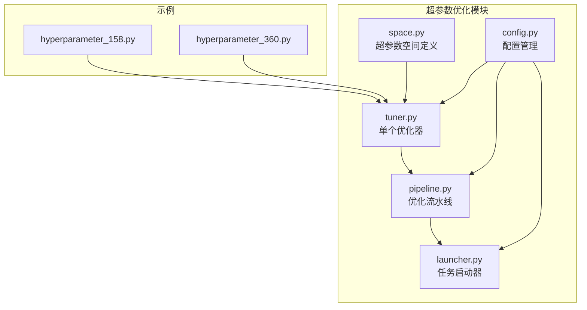
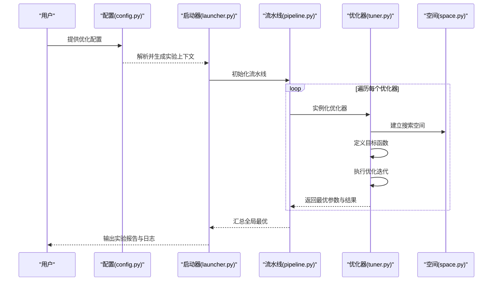
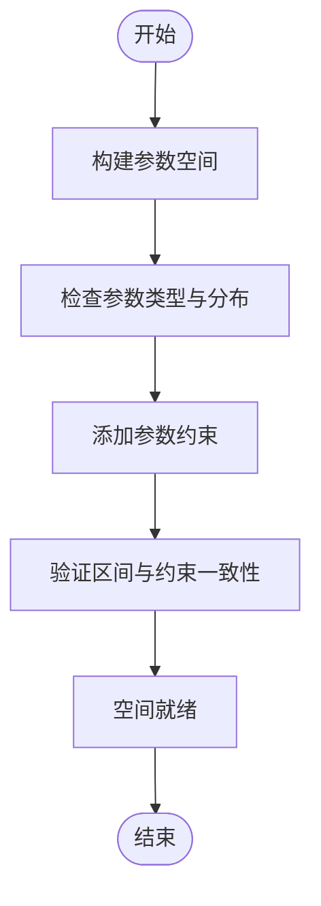
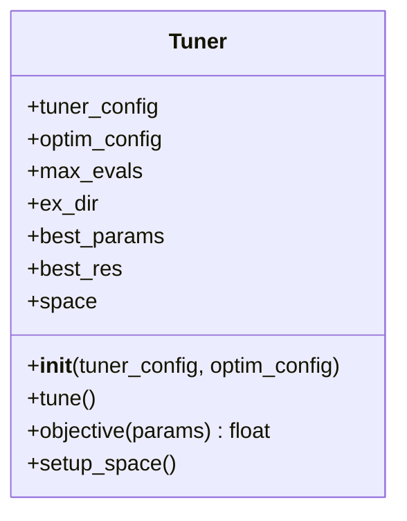
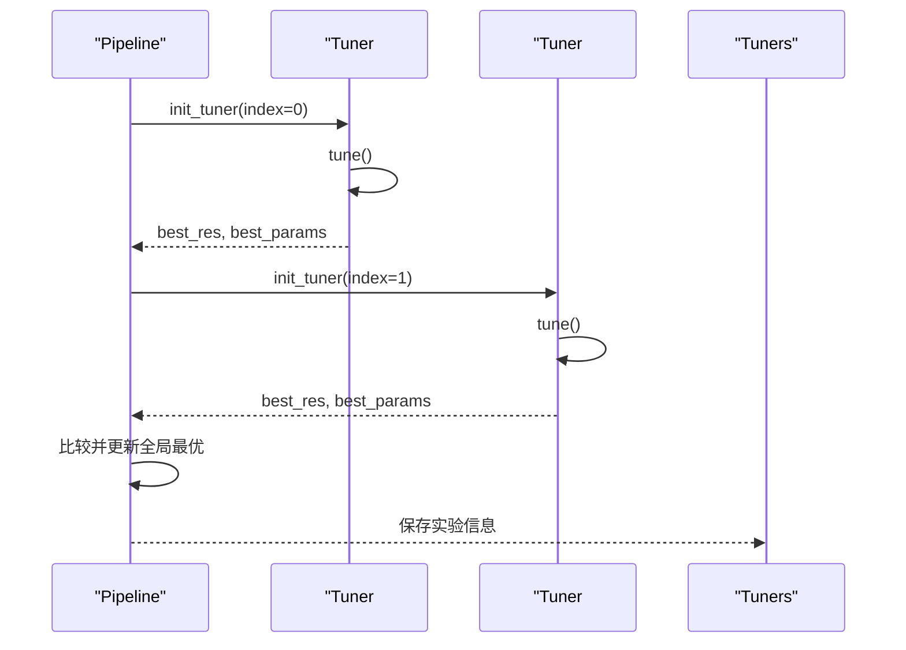
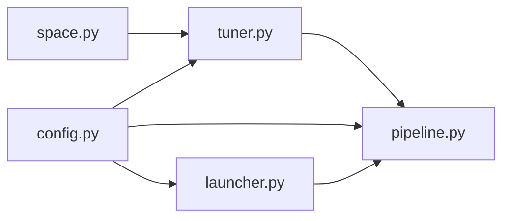

# 超参数优化贡献模块API

<cite>
**本文引用的文件**
- [tuner.py](file://qlib/contrib/tuner/tuner.py)
- [space.py](file://qlib/contrib/tuner/space.py)
- [pipeline.py](file://qlib/contrib/tuner/pipeline.py)
- [launcher.py](file://qlib/contrib/tuner/launcher.py)
- [config.py](file://qlib/contrib/tuner/config.py)
- [hyperparameter_158.py](file://examples/hyperparameter/LightGBM/hyperparameter_158.py)
- [hyperparameter_360.py](file://examples/hyperparameter/LightGBM/hyperparameter_360.py)
- [tuner.rst](file://docs/hidden/tuner.rst)
</cite>

## 目录
1. [简介](#简介)
2. [项目结构](#项目结构)
3. [核心组件](#核心组件)
4. [架构总览](#架构总览)
5. [详细组件分析](#详细组件分析)
6. [依赖关系分析](#依赖关系分析)
7. [性能考量](#性能考量)
8. [故障排查指南](#故障排查指南)
9. [结论](#结论)
10. [附录](#附录)

## 简介
本文件为 Qlib 超参数优化贡献模块的完整 API 参考与实践指南。内容覆盖超参数空间定义接口、优化器 API、优化管道接口、配置管理 API、启动器接口，并结合示例与最佳实践，帮助开发者高效完成模型参数优化。

## 项目结构
超参数优化模块位于 qlib/contrib/tuner 下，包含以下关键文件：
- space.py：超参数空间定义与约束
- tuner.py：单个优化器封装与目标函数
- pipeline.py：多优化器流水线编排
- launcher.py：任务启动与资源调度
- config.py：配置解析与实验设置
- 示例：examples/hyperparameter/LightGBM/*.py 展示如何在实际任务中使用该模块

图表来源
- [tuner.py:1-120](file://qlib/contrib/tuner/tuner.py#L1-L120)
- [space.py:1-200](file://qlib/contrib/tuner/space.py#L1-L200)
- [pipeline.py:1-120](file://qlib/contrib/tuner/pipeline.py#L1-L120)
- [launcher.py:1-200](file://qlib/contrib/tuner/launcher.py#L1-L200)
- [config.py:1-200](file://qlib/contrib/tuner/config.py#L1-L200)
- [hyperparameter_158.py:1-200](file://examples/hyperparameter/LightGBM/hyperparameter_158.py#L1-L200)
- [hyperparameter_360.py:1-200](file://examples/hyperparameter/LightGBM/hyperparameter_360.py#L1-L200)

章节来源
- [tuner.py:1-120](file://qlib/contrib/tuner/tuner.py#L1-L120)
- [space.py:1-200](file://qlib/contrib/tuner/space.py#L1-L200)
- [pipeline.py:1-120](file://qlib/contrib/tuner/pipeline.py#L1-L120)
- [launcher.py:1-200](file://qlib/contrib/tuner/launcher.py#L1-L200)
- [config.py:1-200](file://qlib/contrib/tuner/config.py#L1-L200)
- [hyperparameter_158.py:1-200](file://examples/hyperparameter/LightGBM/hyperparameter_158.py#L1-L200)
- [hyperparameter_360.py:1-200](file://examples/hyperparameter/LightGBM/hyperparameter_360.py#L1-L200)

## 核心组件
- 超参数空间定义（space.py）：定义可调参数的搜索范围、类型、约束与分布
- 单个优化器（tuner.py）：封装一次优化过程，负责目标函数评估、收敛与最优解保存
- 优化流水线（pipeline.py）：串联多个优化器，汇总全局最优结果
- 启动器（launcher.py）：任务启动、资源管理与进度监控
- 配置管理（config.py）：解析 YAML/JSON 配置，生成实验目录与参数传递
- 示例（hyperparameter_*.py）：在 Alpha158/Alpha360 场景下的使用范式

章节来源
- [tuner.py:1-120](file://qlib/contrib/tuner/tuner.py#L1-L120)
- [space.py:1-200](file://qlib/contrib/tuner/space.py#L1-L200)
- [pipeline.py:1-120](file://qlib/contrib/tuner/pipeline.py#L1-L120)
- [launcher.py:1-200](file://qlib/contrib/tuner/launcher.py#L1-L200)
- [config.py:1-200](file://qlib/contrib/tuner/config.py#L1-L200)
- [hyperparameter_158.py:1-200](file://examples/hyperparameter/LightGBM/hyperparameter_158.py#L1-L200)
- [hyperparameter_360.py:1-200](file://examples/hyperparameter/LightGBM/hyperparameter_360.py#L1-L200)

## 架构总览
下图展示从配置到优化再到结果汇总的整体流程：

图表来源
- [config.py:1-200](file://qlib/contrib/tuner/config.py#L1-L200)
- [launcher.py:1-200](file://qlib/contrib/tuner/launcher.py#L1-L200)
- [pipeline.py:1-120](file://qlib/contrib/tuner/pipeline.py#L1-L120)
- [tuner.py:1-120](file://qlib/contrib/tuner/tuner.py#L1-L120)
- [space.py:1-200](file://qlib/contrib/tuner/space.py#L1-L200)

## 详细组件分析

### 超参数空间定义接口（space.py）
- 功能概述
  - 定义连续/离散/分类参数的搜索区间与采样分布
  - 支持参数间约束（如范围依赖、互斥组合）
  - 与优化器目标函数对接，提供统一的参数字典
- 关键点
  - 参数类型：整数、浮点、类别、布尔等
  - 分布选择：均匀、对数、正态、贝塔等
  - 约束表达：边界检查、条件约束、组合规则
- 复杂度与性能
  - 空间构建为 O(N)（N 为参数数量），查询与采样近似 O(1)
  - 约束检查在每次采样时进行，建议避免高复杂度约束
- 错误处理
  - 非法区间或空区间需抛出异常
  - 不满足约束的采样应被拒绝并重试

图表来源
- [space.py:1-200](file://qlib/contrib/tuner/space.py#L1-L200)

章节来源
- [space.py:1-200](file://qlib/contrib/tuner/space.py#L1-L200)

### 优化器API（tuner.py）
- 类与职责
  - Tuner：封装一次优化任务，负责目标函数、收敛控制、结果保存
- 关键方法与属性
  - 构造：接收 tuner_config 与 optim_config，初始化实验目录、最大评估次数
  - tune：调用优化算法（默认 TPE），更新 best_params 与 best_res
  - objective：抽象目标函数，子类可覆盖以适配具体任务（如最大化因子收益）
- 优化算法与策略
  - 默认采用 TPE（Tree-structured Parzen Estimators）进行贝叶斯优化
  - 可扩展为其他算法（如随机搜索、CMA-ES、BOHB 等）
- 收敛条件
  - 基于 max_evals 的迭代上限；可扩展为基于目标值变化的早停
- 并发与并行
  - 当前实现为串行；可通过外部调度器实现并行评估

图表来源
- [tuner.py:1-120](file://qlib/contrib/tuner/tuner.py#L1-L120)

章节来源
- [tuner.py:1-120](file://qlib/contrib/tuner/tuner.py#L1-L120)

### 优化管道接口（pipeline.py）
- 职责
  - 组织多个 Tuner，按顺序运行并比较结果
  - 记录全局最优参数与对应优化器索引
- 流程
  - 遍历 pipeline_config 中的每个 tuner 配置
  - 初始化并运行 Tuner
  - 更新全局最优（依据 best_res 的大小关系）
- 结果管理
  - 保存全局最优参数与对应 Tuner 索引
  - 输出流水线成本时间与实验信息

图表来源
- [pipeline.py:1-120](file://qlib/contrib/tuner/pipeline.py#L1-L120)

章节来源
- [pipeline.py:1-120](file://qlib/contrib/tuner/pipeline.py#L1-L120)

### 配置管理API（config.py）
- 职责
  - 解析 YAML/JSON 配置文件，生成实验目录与参数传递
  - 为 launcher、pipeline、tuner 提供统一的配置对象
- 关键字段
  - experiment：包含 dir、name、id 等实验元信息
  - tuner_pipeline：流水线配置列表，每项包含 model/trainer/strategy 等模块与空间
  - max_evals：每个优化器的最大评估次数
  - optim_type：优化方向（如最小化、最大化、相关性）
- 参数传递
  - 将配置注入到各模块，确保空间、目标函数与实验目录一致

章节来源
- [config.py:1-200](file://qlib/contrib/tuner/config.py#L1-L200)
- [tuner.rst:191-216](file://docs/hidden/tuner.rst#L191-L216)

### 启动器接口（launcher.py）
- 职责
  - 任务启动、资源管理、进度监控
  - 与外部系统集成（如分布式调度、日志收集）
- 能力
  - 创建实验目录、写入配置快照
  - 进度条与耗时统计
  - 异常捕获与失败重试策略（可选）

章节来源
- [launcher.py:1-200](file://qlib/contrib/tuner/launcher.py#L1-L200)

### 使用示例（hyperparameter_*.py）
- 场景
  - 在 Alpha158 与 Alpha360 数据集上进行 LightGBM 超参数优化
- 步骤
  - 准备数据与特征工程
  - 定义超参数空间（如学习率、树深度、叶子节点数等）
  - 配置优化器与流水线
  - 启动优化并输出最优参数与评估指标
- 最佳实践
  - 先粗后细：先大范围探索，再局部精细搜索
  - 固定随机种子：保证结果可复现
  - 早停与缓存：避免无效重复评估

章节来源
- [hyperparameter_158.py:1-200](file://examples/hyperparameter/LightGBM/hyperparameter_158.py#L1-L200)
- [hyperparameter_360.py:1-200](file://examples/hyperparameter/LightGBM/hyperparameter_360.py#L1-L200)

## 依赖关系分析
- 内部耦合
  - space.py 为 tuner.py 的输入依赖
  - pipeline.py 依赖多个 tuner 实例
  - launcher.py 依赖 config.py 与 pipeline.py
- 外部依赖
  - hyperopt（fmin、tpe）用于贝叶斯优化
  - 日志与时间统计依赖 qlib 的日志与计时工具
- 循环依赖
  - 无循环导入；模块职责清晰

图表来源
- [tuner.py:1-120](file://qlib/contrib/tuner/tuner.py#L1-L120)
- [space.py:1-200](file://qlib/contrib/tuner/space.py#L1-L200)
- [pipeline.py:1-120](file://qlib/contrib/tuner/pipeline.py#L1-L120)
- [launcher.py:1-200](file://qlib/contrib/tuner/launcher.py#L1-L200)
- [config.py:1-200](file://qlib/contrib/tuner/config.py#L1-L200)

章节来源
- [tuner.py:1-120](file://qlib/contrib/tuner/tuner.py#L1-L120)
- [space.py:1-200](file://qlib/contrib/tuner/space.py#L1-L200)
- [pipeline.py:1-120](file://qlib/contrib/tuner/pipeline.py#L1-L120)
- [launcher.py:1-200](file://qlib/contrib/tuner/launcher.py#L1-L200)
- [config.py:1-200](file://qlib/contrib/tuner/config.py#L1-L200)

## 性能考量
- 空间规模控制
  - 参数维度不宜过高；必要时进行特征选择或降维
- 采样效率
  - 优先使用高效的分布（如均匀、对数）减少无效区域
- 评估成本
  - 评估函数越昂贵，max_evals 应越小；可考虑代理模型加速
- 并行化
  - 将评估函数改为并行执行，注意共享状态与资源竞争
- 缓存与早停
  - 对相同参数组合的结果进行缓存；基于目标值变化设定早停阈值

## 故障排查指南
- 常见问题
  - 空间非法：区间为空或上下界错误导致采样失败
  - 目标函数异常：评估过程中抛出异常，需检查数据与模型配置
  - 资源不足：内存或 CPU 占用过高，需降低并发或增大资源
- 排查步骤
  - 检查配置文件语法与字段完整性
  - 查看实验目录中的日志与中间结果
  - 逐步缩小参数范围定位问题
- 建议
  - 开启详细日志与时间统计
  - 使用小规模数据集先行验证流程

章节来源
- [tuner.py:1-120](file://qlib/contrib/tuner/tuner.py#L1-L120)
- [pipeline.py:1-120](file://qlib/contrib/tuner/pipeline.py#L1-L120)
- [launcher.py:1-200](file://qlib/contrib/tuner/launcher.py#L1-L200)

## 结论
Qlib 超参数优化贡献模块提供了从空间定义、优化器封装、流水线编排到启动器与配置管理的完整链路。通过合理的空间设计、稳健的目标函数与高效的并行策略，开发者可在多种模型与场景中快速获得高质量的超参数组合。

## 附录
- 术语
  - 超参数：训练前需要手工设定的参数（如学习率、树深等）
  - 搜索空间：参数的取值范围与分布集合
  - 目标函数：用于评估参数组合优劣的指标（如准确率、IC、收益等）
  - 优化器：执行搜索与收敛的算法（如 TPE、随机搜索）
  - 流水线：串联多个优化器的执行编排
- 参考文档
  - [tuner.rst:191-216](file://docs/hidden/tuner.rst#L191-L216)