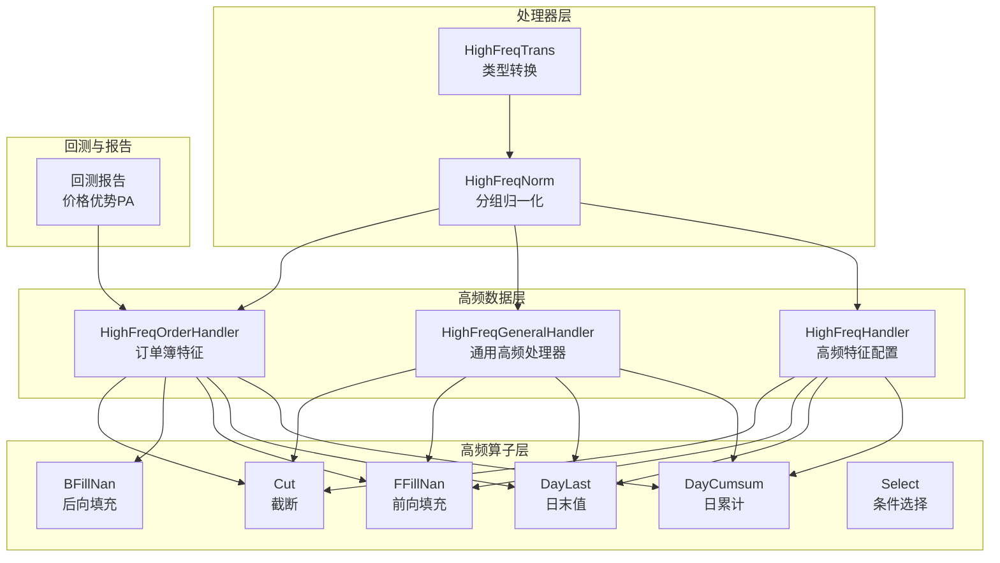
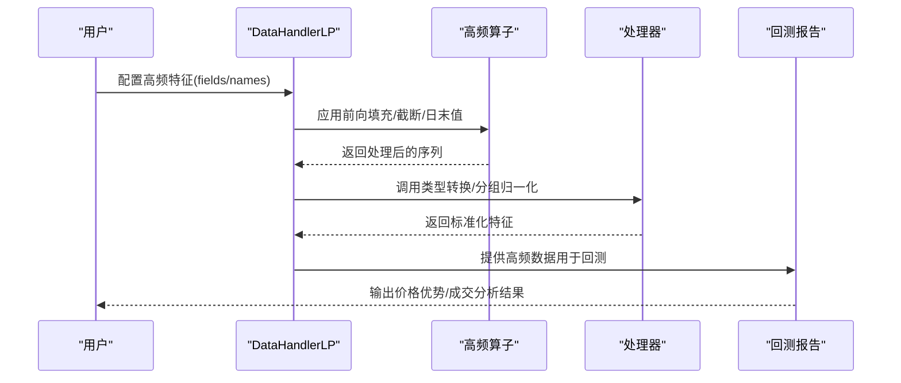
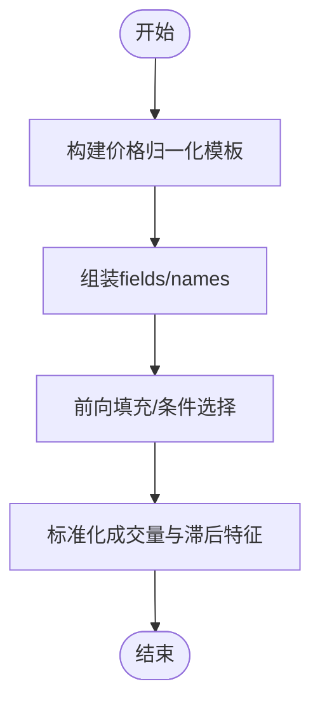
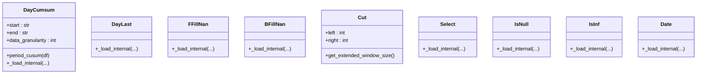
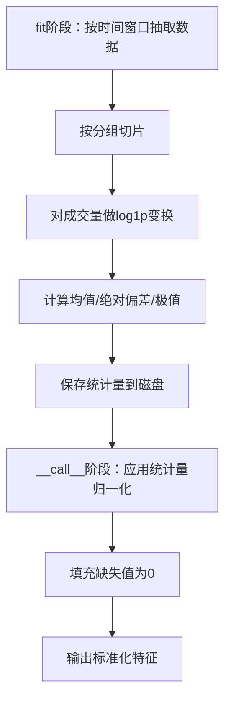
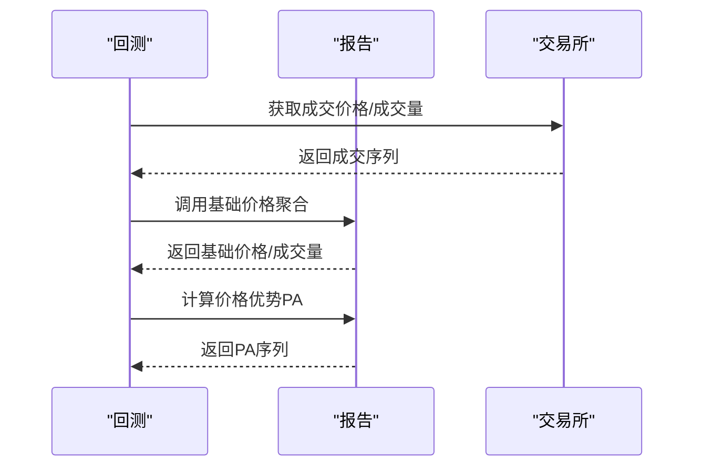
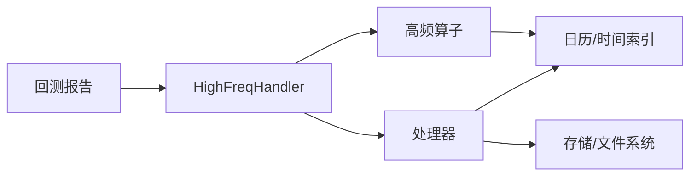

# 高频操作贡献模块API

<cite>
**本文引用的文件**
- [highfreq_handler.py](file://qlib/contrib/data/highfreq_handler.py)
- [highfreq_processor.py](file://qlib/contrib/data/highfreq_processor.py)
- [high_freq.py](file://qlib/contrib/ops/high_freq.py)
- [report.py](file://qlib/backtest/report.py)
- [loader.py](file://qlib/contrib/data/loader.py)
- [ops.py](file://qlib/data/ops.py)
- [file_storage.py](file://qlib/data/storage/file_storage.py)
- [example.py](file://examples/orderbook_data/example.py)
- [gen_training_orders.py](file://examples/rl_order_execution/scripts/gen_training_orders.py)
</cite>

## 目录
1. [简介](#简介)
2. [项目结构](#项目结构)
3. [核心组件](#核心组件)
4. [架构总览](#架构总览)
5. [详细组件分析](#详细组件分析)
6. [依赖分析](#依赖分析)
7. [性能考虑](#性能考虑)
8. [故障排查指南](#故障排查指南)
9. [结论](#结论)
10. [附录](#附录)

## 简介
本文件为 Qlib 高频操作贡献模块的 API 参考文档，聚焦高频数据的采集、清洗、特征工程、统计分析、回测与可视化等全流程能力。重点覆盖以下方面：
- 订单簿数据处理：买卖价量序列、买卖深度、买卖价差等
- 价格序列分析：标准化、日切、时间窗口聚合
- 成交量分析：成交量占比、成交量滑动均值、成交量异常过滤
- 滚动统计与时间序列分析：按交易时段累计、日末值提取、滚动回归残差等
- 数据对齐与填充：时间戳对齐、前向/后向填充、截断与缺失值处理
- 数据转换与存储：特征归一化、日志变换、二进制存储
- 可视化与报告：价格走势、成交量分布、市场微观结构分析
- 最佳实践与性能优化：内存与计算效率、缓存与索引策略

## 项目结构
高频相关代码主要分布在以下模块：
- 数据处理器与处理器：高频特征构造、标准化、转换
- 高频算子：时间维度操作、空值处理、截断等
- 回测与报告：基于高频数据的成交与价格优势分析
- 示例与脚本：订单簿特征构建、训练订单生成

**图表来源**
- [highfreq_handler.py:8-540](file://qlib/contrib/data/highfreq_handler.py#L8-L540)
- [high_freq.py:50-278](file://qlib/contrib/ops/high_freq.py#L50-L278)
- [highfreq_processor.py:10-81](file://qlib/contrib/data/highfreq_processor.py#L10-L81)
- [report.py:426-537](file://qlib/backtest/report.py#L426-L537)

**章节来源**
- [highfreq_handler.py:8-540](file://qlib/contrib/data/highfreq_handler.py#L8-L540)
- [high_freq.py:50-278](file://qlib/contrib/ops/high_freq.py#L50-L278)
- [highfreq_processor.py:10-81](file://qlib/contrib/data/highfreq_processor.py#L10-L81)
- [report.py:426-537](file://qlib/backtest/report.py#L426-L537)

## 核心组件
- 高频处理器（DataHandlerLP）：负责高频特征配置与加载，支持开盘/最高/最低/收盘/VWAP 的标准化与滞后特征，以及成交量的标准化与滞后特征。
- 通用高频处理器（HighFreqGeneralHandler）：可配置列名、频率与日长度，统一处理多字段标准化与成交量特征。
- 订单簿高频处理器（HighFreqOrderHandler）：扩展到买卖价、买卖量、买卖深度等订单簿特征，并进行异常值与空值处理。
- 高频算子（ElemOperator/PairOperator）：提供日累计、日末值、前向/后向填充、截断、条件选择等高频时间序列操作。
- 处理器（Processor）：提供类型转换与分组归一化，支持日志变换与分位数稳健统计。
- 回测报告（Report）：基于成交数据计算基础价格与成交量，用于价格优势（PA）分析。

**章节来源**
- [highfreq_handler.py:8-540](file://qlib/contrib/data/highfreq_handler.py#L8-L540)
- [high_freq.py:50-278](file://qlib/contrib/ops/high_freq.py#L50-L278)
- [highfreq_processor.py:10-81](file://qlib/contrib/data/highfreq_processor.py#L10-L81)
- [report.py:426-537](file://qlib/backtest/report.py#L426-L537)

## 架构总览
高频数据从“特征配置”出发，经由“高频处理器”生成标准化的价格与成交量特征，再通过“高频算子”进行时间维度与空值处理，最后由“处理器”完成归一化与类型转换，进入“回测与报告”阶段进行价格优势与成交分析。

**图表来源**
- [highfreq_handler.py:8-540](file://qlib/contrib/data/highfreq_handler.py#L8-L540)
- [high_freq.py:50-278](file://qlib/contrib/ops/high_freq.py#L50-L278)
- [highfreq_processor.py:10-81](file://qlib/contrib/data/highfreq_processor.py#L10-L81)
- [report.py:426-537](file://qlib/backtest/report.py#L426-L537)

## 详细组件分析

### 高频处理器（HighFreqHandler）
- 功能要点
  - 标准化价格序列：以昨日日末收盘价为基准，对开盘/最高/最低/收盘/VWAP 进行归一化
  - 标准化成交量：按日滑动均值归一化，并提供滞后一个交易日的特征
  - 缺失值与停牌处理：通过条件选择与前向填充，剔除停牌时段并填充空值
- 关键参数
  - 频率：默认“1分钟”
  - 字段：$open/$high/$low/$close/$vwap/$volume
  - 滞后：支持滞后240分钟（一个交易日）的特征
- 典型流程
  - 构建表达式模板（条件判断、前向填充、日末归一化）
  - 组装 fields 与 names，返回给数据加载器

**图表来源**
- [highfreq_handler.py:41-100](file://qlib/contrib/data/highfreq_handler.py#L41-L100)

**章节来源**
- [highfreq_handler.py:8-100](file://qlib/contrib/data/highfreq_handler.py#L8-L100)

### 通用高频处理器（HighFreqGeneralHandler）
- 功能要点
  - 支持自定义列集合、频率与日长度
  - 对指定列执行与 HighFreqHandler 相同的标准化与滞后处理
  - 适用于不同市场或不同日长度的场景
- 关键参数
  - columns：如 ["$open","$high","$low","$close","$vwap"]
  - day_length：日长度（默认240）
  - freq：数据频率（默认"1min"）

**章节来源**
- [highfreq_handler.py:103-196](file://qlib/contrib/data/highfreq_handler.py#L103-L196)

### 订单簿高频处理器（HighFreqOrderHandler）
- 功能要点
  - 扩展到买卖价（$bid/$ask）、买卖量（$bidV/$askV）及多个档位
  - 异常值处理：对无穷大与空值进行替换与过滤
  - 标准化与滞后：与价格序列一致的处理方式
- 关键字段
  - $bid/$ask、$bidV/$askV 及其滞后版本
  - VWAP 的异常值安全处理

**章节来源**
- [highfreq_handler.py:307-459](file://qlib/contrib/data/highfreq_handler.py#L307-L459)

### 高频算子（ElemOperator/PairOperator）
- DayCumsum：按交易时段对序列进行日累计，支持起止时间与粒度控制
- DayLast：提取每个交易日的最后一个值
- FFillNan/BFillNan：前向/后向填充空值
- Cut：对序列左右两端进行截断（基于原始数据索引）
- Select：根据条件选择目标序列
- IsNull/IsInf：检测空值与无穷大
- Date：从索引映射到日期

**图表来源**
- [high_freq.py:50-278](file://qlib/contrib/ops/high_freq.py#L50-L278)

**章节来源**
- [high_freq.py:50-278](file://qlib/contrib/ops/high_freq.py#L50-L278)

### 处理器（Processor）
- HighFreqTrans：将特征转换为布尔或浮点类型（节省内存）
- HighFreqNorm：对特征进行分组归一化，支持日志变换与稳健统计（中位数与MAD）

**图表来源**
- [highfreq_processor.py:37-81](file://qlib/contrib/data/highfreq_processor.py#L37-L81)

**章节来源**
- [highfreq_processor.py:10-81](file://qlib/contrib/data/highfreq_processor.py#L10-L81)

### 回测与报告（回测报告）
- 基础价格与成交量聚合：支持 VWAP/TWAP 聚合，剔除无效价格（如零或极小值），按成交量加权
- 价格优势（PA）计算：基于成交方向与成交价格与基础价格的比值差异

**图表来源**
- [report.py:426-537](file://qlib/backtest/report.py#L426-L537)

**章节来源**
- [report.py:426-537](file://qlib/backtest/report.py#L426-L537)

### 示例与脚本
- 订单簿特征示例：展示如何基于买卖档位构建成交量占比、价差与中间价等特征
- 训练订单生成：从高频数据中抽取日级订单样本，生成训练/验证/测试集

**章节来源**
- [example.py:88-119](file://examples/orderbook_data/example.py#L88-L119)
- [gen_training_orders.py:14-33](file://examples/rl_order_execution/scripts/gen_training_orders.py#L14-L33)

## 依赖分析
- 高频处理器依赖于数据加载器与表达式模板，通过 fields/names 将特征注入数据流
- 高频算子作为表达式算子，作用于单序列或多序列，支持时间分组与窗口扩展
- 处理器在 fit 阶段抽取统计量，在 __call__ 阶段应用，避免数据泄漏
- 回测报告依赖于成交序列与基础价格聚合逻辑

**图表来源**
- [highfreq_handler.py:8-540](file://qlib/contrib/data/highfreq_handler.py#L8-L540)
- [high_freq.py:13-47](file://qlib/contrib/ops/high_freq.py#L13-L47)
- [highfreq_processor.py:37-81](file://qlib/contrib/data/highfreq_processor.py#L37-L81)
- [file_storage.py:285-297](file://qlib/data/storage/file_storage.py#L285-L297)
- [report.py:426-537](file://qlib/backtest/report.py#L426-L537)

**章节来源**
- [highfreq_handler.py:8-540](file://qlib/contrib/data/highfreq_handler.py#L8-L540)
- [high_freq.py:13-47](file://qlib/contrib/ops/high_freq.py#L13-L47)
- [highfreq_processor.py:37-81](file://qlib/contrib/data/highfreq_processor.py#L37-L81)
- [file_storage.py:285-297](file://qlib/data/storage/file_storage.py#L285-L297)
- [report.py:426-537](file://qlib/backtest/report.py#L426-L537)

## 性能考虑
- 内存与计算
  - 使用 Cut 截断非交易时段，减少无效数据参与计算
  - 使用 FFillNan/BFillNan 快速填充，避免复杂插值
  - HighFreqTrans 将布尔特征转为 int8，显著降低内存占用
- 缓存与索引
  - 日历加载使用内存缓存（H["c"]），避免重复 IO
  - 分组归一化统计量持久化到磁盘，避免重复计算
- 存储
  - 使用二进制文件存储特征序列，提高读写效率

**章节来源**
- [high_freq.py:13-47](file://qlib/contrib/ops/high_freq.py#L13-L47)
- [highfreq_processor.py:37-81](file://qlib/contrib/data/highfreq_processor.py#L37-L81)
- [file_storage.py:285-297](file://qlib/data/storage/file_storage.py#L285-L297)

## 故障排查指南
- 缺失值与异常值
  - 使用 IsNull/IsInf 检测空值与无穷大，结合 Select/If 进行过滤
  - 使用 FFillNan/BFillNan 填充空值，确保序列连续性
- 停牌与非交易时段
  - 使用 Cut 或 Select 条件过滤停牌与非交易时段
- 归一化问题
  - 分组归一化需保证 fit 时间窗口与训练/测试一致，避免数据泄漏
  - 对成交量采用 log1p 变换提升稳定性
- 回测阶段价格异常
  - 在回测报告中剔除极小或零值价格，防止除零与极端波动

**章节来源**
- [high_freq.py:180-278](file://qlib/contrib/ops/high_freq.py#L180-L278)
- [highfreq_processor.py:37-81](file://qlib/contrib/data/highfreq_processor.py#L37-L81)
- [report.py:426-453](file://qlib/backtest/report.py#L426-L453)

## 结论
高频操作贡献模块提供了从数据采集、特征工程、统计分析到回测评估的完整链路。通过标准化的价格与成交量特征、稳健的时间序列算子与处理器，以及完善的归一化与存储机制，能够高效支撑高频交易场景下的研究与建模需求。建议在实际使用中结合业务场景选择合适的处理器与算子组合，并遵循数据泄漏防护与性能优化的最佳实践。

## 附录
- 相关统计函数与滚动分析
  - 滚动回归残差与决定系数：用于时变因子有效性检验
  - 滚动加权移动平均：平滑高频噪声
  - 相关性分析：价格与成交量变化的相关性

**章节来源**
- [ops.py:1273-1315](file://qlib/data/ops.py#L1273-L1315)