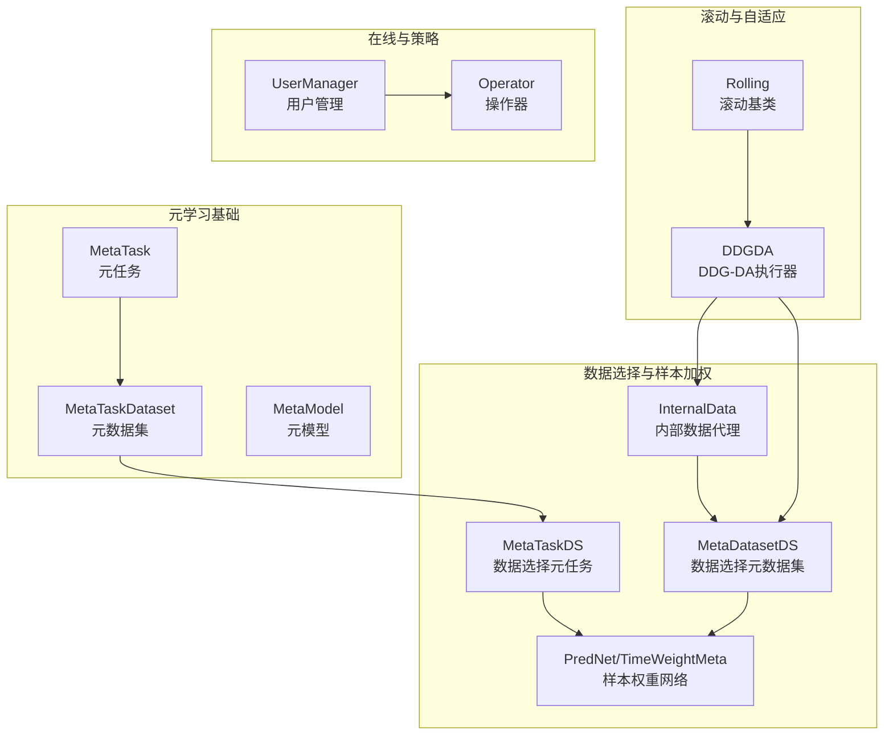
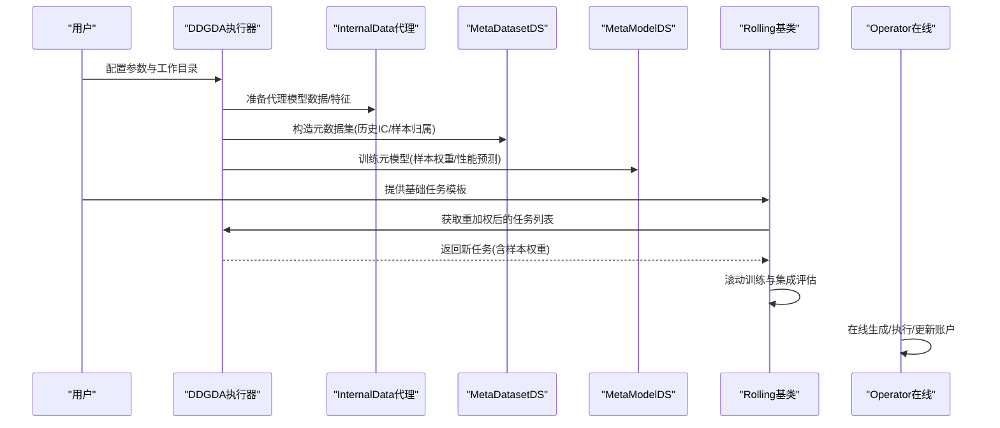
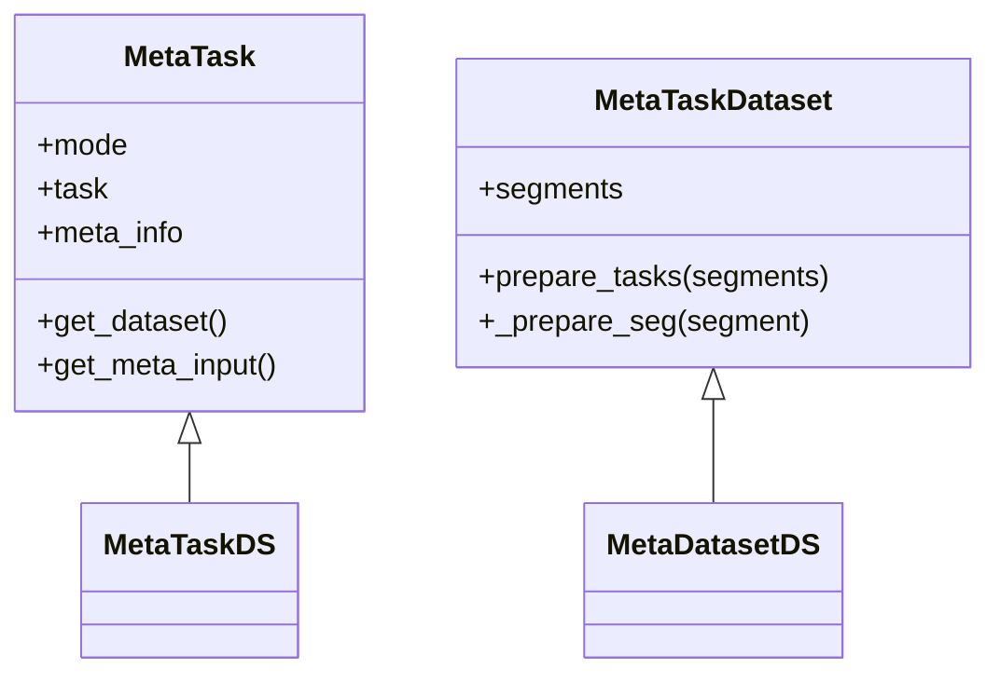
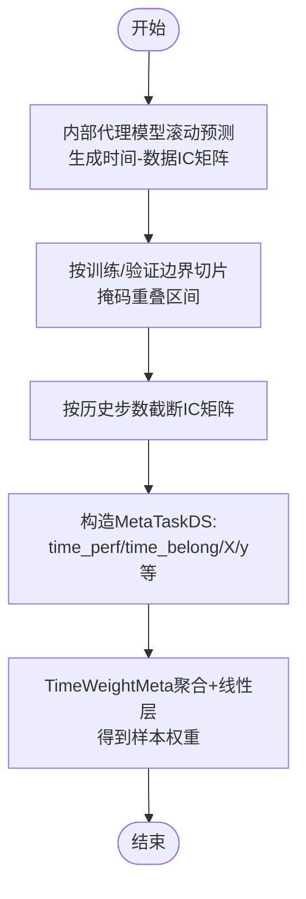
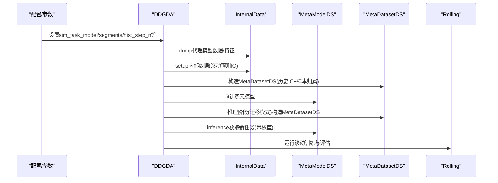
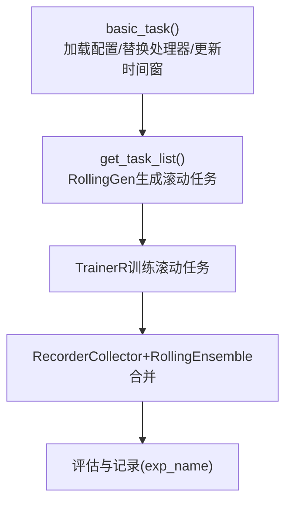
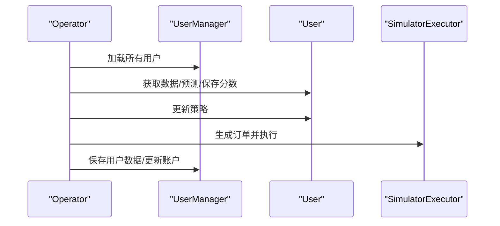
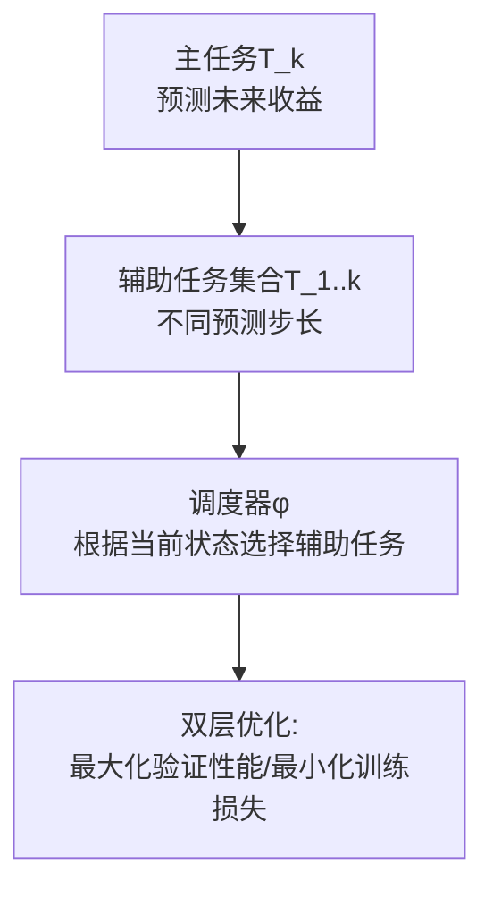
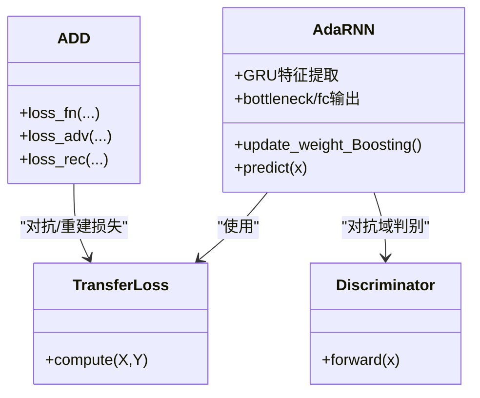
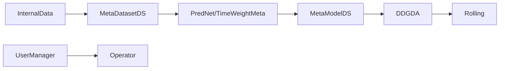

# 元学习框架

<cite>
**本文引用的文件**
- [qlib/model/meta/task.py](file://qlib/model/meta/task.py)
- [qlib/model/meta/dataset.py](file://qlib/model/meta/dataset.py)
- [qlib/contrib/meta/data_selection/dataset.py](file://qlib/contrib/meta/data_selection/dataset.py)
- [qlib/contrib/meta/data_selection/model.py](file://qlib/contrib/meta/data_selection/model.py)
- [qlib/contrib/meta/data_selection/net.py](file://qlib/contrib/meta/data_selection/net.py)
- [qlib/contrib/rolling/ddgda.py](file://qlib/contrib/rolling/ddgda.py)
- [qlib/contrib/rolling/base.py](file://qlib/contrib/rolling/base.py)
- [examples/benchmarks_dynamic/DDG-DA/README.md](file://examples/benchmarks_dynamic/DDG-DA/README.md)
- [qlib/contrib/online/manager.py](file://qlib/contrib/online/manager.py)
- [qlib/contrib/online/operator.py](file://qlib/contrib/online/operator.py)
- [examples/benchmarks/TCTS/README.md](file://examples/benchmarks/TCTS/README.md)
- [qlib/contrib/model/pytorch_adarnn.py](file://qlib/contrib/model/pytorch_adarnn.py)
- [qlib/contrib/model/pytorch_add.py](file://qlib/contrib/model/pytorch_add.py)
- [qlib/contrib/tuner/tuner.py](file://qlib/contrib/tuner/tuner.py)
</cite>

## 目录
1. [引言](#引言)
2. [项目结构](#项目结构)
3. [核心组件](#核心组件)
4. [架构总览](#架构总览)
5. [详细组件分析](#详细组件分析)
6. [依赖分析](#依赖分析)
7. [性能考量](#性能考量)
8. [故障排查指南](#故障排查指南)
9. [结论](#结论)
10. [附录](#附录)

## 引言
本文件面向希望在Qlib中构建“元学习驱动的自适应量化系统”的读者，系统性阐述以下主题：
- 动态模型选择机制：基于历史表现的模型选择策略、模型性能预测与样本加权。
- 自适应学习实现：概念漂移预测与数据分布生成（DDG-DA）、滚动执行与模型切换、性能监控。
- 多任务学习框架：任务表示、共享表示学习、任务间关系建模。
- 模型迁移与泛化能力提升：领域适应、少样本学习思路与实践。
- 实际应用示例与配置指南：如何以DDG-DA为例构建智能的自适应量化系统，并与传统静态模型进行对比。

## 项目结构
Qlib的元学习能力主要由“元任务/元数据集”抽象与“滚动执行器”“在线管理器”等模块协同实现；动态模型选择与DDG-DA通过内部数据代理与元模型训练形成闭环。

**图示来源**
- [qlib/model/meta/task.py:1-57](file://qlib/model/meta/task.py#L1-L57)
- [qlib/model/meta/dataset.py:1-78](file://qlib/model/meta/dataset.py#L1-L78)
- [qlib/contrib/meta/data_selection/dataset.py:121-417](file://qlib/contrib/meta/data_selection/dataset.py#L121-L417)
- [qlib/contrib/meta/data_selection/net.py:11-75](file://qlib/contrib/meta/data_selection/net.py#L11-L75)
- [qlib/contrib/rolling/base.py:24-265](file://qlib/contrib/rolling/base.py#L24-L265)
- [qlib/contrib/rolling/ddgda.py:70-389](file://qlib/contrib/rolling/ddgda.py#L70-L389)
- [qlib/contrib/online/manager.py:17-149](file://qlib/contrib/online/manager.py#L17-L149)
- [qlib/contrib/online/operator.py:27-321](file://qlib/contrib/online/operator.py#L27-L321)

**章节来源**
- [qlib/model/meta/task.py:1-57](file://qlib/model/meta/task.py#L1-L57)
- [qlib/model/meta/dataset.py:1-78](file://qlib/model/meta/dataset.py#L1-L78)
- [qlib/contrib/meta/data_selection/dataset.py:121-417](file://qlib/contrib/meta/data_selection/dataset.py#L121-L417)
- [qlib/contrib/meta/data_selection/net.py:11-75](file://qlib/contrib/meta/data_selection/net.py#L11-L75)
- [qlib/contrib/rolling/base.py:24-265](file://qlib/contrib/rolling/base.py#L24-L265)
- [qlib/contrib/rolling/ddgda.py:70-389](file://qlib/contrib/rolling/ddgda.py#L70-L389)
- [qlib/contrib/online/manager.py:17-149](file://qlib/contrib/online/manager.py#L17-L149)
- [qlib/contrib/online/operator.py:27-321](file://qlib/contrib/online/operator.py#L27-L321)

## 核心组件
- 元任务与元数据集：定义元级任务与数据准备流程，支持不同处理模式（全量/测试/可迁移）。
- 数据选择元任务与元数据集：以历史IC（信息系数）相似度为元输入，构造时间窗口与样本归属矩阵，用于样本加权。
- 样本权重网络：对时间序列的性能信号进行聚合与加权，输出样本权重或直接回归预测。
- DDG-DA滚动执行器：封装代理模型训练、元模型训练、推理重加权与滚动执行的完整流程。
- 在线管理与操作器：用户账户、策略与模型的加载/保存、订单生成与执行、回测更新。
- 多任务学习与迁移：AdaRNN/ADD等模型体现跨域/对抗学习；TCTS等方法体现时序相关任务调度。

**章节来源**
- [qlib/model/meta/task.py:8-57](file://qlib/model/meta/task.py#L8-L57)
- [qlib/model/meta/dataset.py:10-78](file://qlib/model/meta/dataset.py#L10-L78)
- [qlib/contrib/meta/data_selection/dataset.py:121-417](file://qlib/contrib/meta/data_selection/dataset.py#L121-L417)
- [qlib/contrib/meta/data_selection/net.py:11-75](file://qlib/contrib/meta/data_selection/net.py#L11-L75)
- [qlib/contrib/rolling/ddgda.py:70-389](file://qlib/contrib/rolling/ddgda.py#L70-L389)
- [qlib/contrib/online/manager.py:17-149](file://qlib/contrib/online/manager.py#L17-L149)
- [qlib/contrib/online/operator.py:27-321](file://qlib/contrib/online/operator.py#L27-L321)
- [qlib/contrib/model/pytorch_adarnn.py:372-647](file://qlib/contrib/model/pytorch_adarnn.py#L372-L647)
- [qlib/contrib/model/pytorch_add.py:201-225](file://qlib/contrib/model/pytorch_add.py#L201-L225)
- [examples/benchmarks/TCTS/README.md:1-25](file://examples/benchmarks/TCTS/README.md#L1-L25)

## 架构总览
下图展示了从“任务模板”到“元模型训练/推理”再到“滚动执行”的端到端流程，以及与在线系统的衔接。

**图示来源**
- [qlib/contrib/rolling/ddgda.py:179-389](file://qlib/contrib/rolling/ddgda.py#L179-L389)
- [qlib/contrib/meta/data_selection/dataset.py:23-120](file://qlib/contrib/meta/data_selection/dataset.py#L23-L120)
- [qlib/contrib/meta/data_selection/model.py:40-145](file://qlib/contrib/meta/data_selection/model.py#L40-L145)
- [qlib/contrib/rolling/base.py:194-265](file://qlib/contrib/rolling/base.py#L194-L265)
- [qlib/contrib/online/operator.py:102-212](file://qlib/contrib/online/operator.py#L102-L212)

## 详细组件分析

### 元任务与元数据集
- 元任务（MetaTask）负责封装单个元级任务及其元信息，支持多种处理模式（全量/测试/迁移），便于在不同阶段复用。
- 元数据集（MetaTaskDataset）负责按分段准备元任务集合，支持按比例/日期字符串划分训练/测试集，具备跨数据集迁移能力。

**图示来源**
- [qlib/model/meta/task.py:8-57](file://qlib/model/meta/task.py#L8-L57)
- [qlib/model/meta/dataset.py:10-78](file://qlib/model/meta/dataset.py#L10-L78)
- [qlib/contrib/meta/data_selection/dataset.py:121-190](file://qlib/contrib/meta/data_selection/dataset.py#L121-L190)
- [qlib/contrib/meta/data_selection/dataset.py:237-417](file://qlib/contrib/meta/data_selection/dataset.py#L237-L417)

**章节来源**
- [qlib/model/meta/task.py:8-57](file://qlib/model/meta/task.py#L8-L57)
- [qlib/model/meta/dataset.py:10-78](file://qlib/model/meta/dataset.py#L10-L78)
- [qlib/contrib/meta/data_selection/dataset.py:121-190](file://qlib/contrib/meta/data_selection/dataset.py#L121-L190)
- [qlib/contrib/meta/data_selection/dataset.py:237-417](file://qlib/contrib/meta/data_selection/dataset.py#L237-L417)

### 数据选择与样本加权
- 内部数据代理（InternalData）通过代理模型在滚动窗口内计算各数据片段的IC，形成时间-数据相似度矩阵。
- MetaTaskDS将相似度矩阵与样本归属矩阵结合，构造元输入；MetaDatasetDS按时间步截断与历史长度限制，确保无泄漏。
- PredNet/TimeWeightMeta对时间维度性能信号进行平均与线性聚合，得到样本权重；可选裁剪与正则化以稳定迁移。

**图示来源**
- [qlib/contrib/meta/data_selection/dataset.py:23-120](file://qlib/contrib/meta/data_selection/dataset.py#L23-L120)
- [qlib/contrib/meta/data_selection/dataset.py:331-417](file://qlib/contrib/meta/data_selection/dataset.py#L331-L417)
- [qlib/contrib/meta/data_selection/net.py:11-75](file://qlib/contrib/meta/data_selection/net.py#L11-L75)

**章节来源**
- [qlib/contrib/meta/data_selection/dataset.py:23-120](file://qlib/contrib/meta/data_selection/dataset.py#L23-L120)
- [qlib/contrib/meta/data_selection/dataset.py:331-417](file://qlib/contrib/meta/data_selection/dataset.py#L331-L417)
- [qlib/contrib/meta/data_selection/net.py:11-75](file://qlib/contrib/meta/data_selection/net.py#L11-L75)

### DDG-DA：概念漂移预测与数据分布生成
- DDG-DA通过代理模型（线性/GBDT）计算特征重要性与相似度，构造内部数据；随后训练MetaModelDS预测未来数据分布趋势，生成样本权重，指导最终模型训练。
- 执行器封装了代理数据导出、内部数据缓存、元模型训练与推理重加权的全流程，并与滚动执行器协作完成离线滚动。

**图示来源**
- [qlib/contrib/rolling/ddgda.py:70-389](file://qlib/contrib/rolling/ddgda.py#L70-L389)
- [examples/benchmarks_dynamic/DDG-DA/README.md:1-14](file://examples/benchmarks_dynamic/DDG-DA/README.md#L1-L14)

**章节来源**
- [qlib/contrib/rolling/ddgda.py:70-389](file://qlib/contrib/rolling/ddgda.py#L70-L389)
- [examples/benchmarks_dynamic/DDG-DA/README.md:1-14](file://examples/benchmarks_dynamic/DDG-DA/README.md#L1-L14)

### 滚动执行与性能监控
- Rolling基类负责将单一任务按时间步拆分为滚动任务，避免信息泄漏；支持覆盖标签/滚动步长/分段起止时间等。
- 通过RecorderCollector与RollingEnsemble对滚动结果进行合并与评估，记录实验指标。

**图示来源**
- [qlib/contrib/rolling/base.py:145-265](file://qlib/contrib/rolling/base.py#L145-L265)

**章节来源**
- [qlib/contrib/rolling/base.py:145-265](file://qlib/contrib/rolling/base.py#L145-L265)

### 在线系统与策略执行
- UserManager负责用户账户、策略与模型的加载/保存与增删。
- Operator负责在线生成分数序列、生成订单、执行订单与更新账户状态，并支持模拟运行。

**图示来源**
- [qlib/contrib/online/manager.py:17-149](file://qlib/contrib/online/manager.py#L17-L149)
- [qlib/contrib/online/operator.py:27-321](file://qlib/contrib/online/operator.py#L27-L321)

**章节来源**
- [qlib/contrib/online/manager.py:17-149](file://qlib/contrib/online/manager.py#L17-L149)
- [qlib/contrib/online/operator.py:27-321](file://qlib/contrib/online/operator.py#L27-L321)

### 多任务学习与任务调度
- TCTS论文提出时序相关辅助任务的可学习调度机制，通过双层优化联合训练主任务与调度器，体现任务间关系建模与动态选择。
- 示例README提供了背景、方法与实验设置说明，便于对照实现。

**图示来源**
- [examples/benchmarks/TCTS/README.md:1-25](file://examples/benchmarks/TCTS/README.md#L1-L25)

**章节来源**
- [examples/benchmarks/TCTS/README.md:1-25](file://examples/benchmarks/TCTS/README.md#L1-L25)

### 领域适应与迁移学习
- AdaRNN/ADD等模型体现了对抗学习与领域适应思想：通过对抗损失、域判别器与重构损失，提升跨域/跨市场泛化能力。
- 可与元学习结合：以元模型预测跨域/跨市场性能，作为样本权重或任务优先级的依据。

**图示来源**
- [qlib/contrib/model/pytorch_adarnn.py:372-647](file://qlib/contrib/model/pytorch_adarnn.py#L372-L647)
- [qlib/contrib/model/pytorch_add.py:201-225](file://qlib/contrib/model/pytorch_add.py#L201-L225)

**章节来源**
- [qlib/contrib/model/pytorch_adarnn.py:372-647](file://qlib/contrib/model/pytorch_adarnn.py#L372-L647)
- [qlib/contrib/model/pytorch_add.py:201-225](file://qlib/contrib/model/pytorch_add.py#L201-L225)

### 超参搜索与自动调优
- QLibTuner提供统一的超参搜索接口，支持objective/setup_space/save_local_best_params等扩展点，便于在元学习框架中集成自动调参。

**章节来源**
- [qlib/contrib/tuner/tuner.py:57-94](file://qlib/contrib/tuner/tuner.py#L57-L94)

## 依赖分析
- 组件耦合与内聚
  - 元任务/元数据集与数据选择模块强耦合：MetaTaskDS/MetaDatasetDS依赖InternalData提供的历史IC矩阵。
  - DDGDA与Rolling紧密协作：DDGDA在推理阶段返回重加权任务，交由Rolling执行。
  - 在线模块与策略解耦：Operator仅依赖UserManager提供的用户实例，便于扩展不同策略/模型。
- 外部依赖
  - MLflow/R记录器用于实验与指标存储。
  - PyTorch/TensorFlow（在其他贡献模块中）用于模型实现。

**图示来源**
- [qlib/contrib/meta/data_selection/dataset.py:23-120](file://qlib/contrib/meta/data_selection/dataset.py#L23-L120)
- [qlib/contrib/meta/data_selection/dataset.py:237-417](file://qlib/contrib/meta/data_selection/dataset.py#L237-L417)
- [qlib/contrib/meta/data_selection/net.py:11-75](file://qlib/contrib/meta/data_selection/net.py#L11-L75)
- [qlib/contrib/meta/data_selection/model.py:40-145](file://qlib/contrib/meta/data_selection/model.py#L40-L145)
- [qlib/contrib/rolling/ddgda.py:325-389](file://qlib/contrib/rolling/ddgda.py#L325-L389)
- [qlib/contrib/rolling/base.py:194-265](file://qlib/contrib/rolling/base.py#L194-L265)
- [qlib/contrib/online/manager.py:17-149](file://qlib/contrib/online/manager.py#L17-L149)
- [qlib/contrib/online/operator.py:27-321](file://qlib/contrib/online/operator.py#L27-L321)

**章节来源**
- [qlib/contrib/meta/data_selection/dataset.py:23-120](file://qlib/contrib/meta/data_selection/dataset.py#L23-L120)
- [qlib/contrib/meta/data_selection/dataset.py:237-417](file://qlib/contrib/meta/data_selection/dataset.py#L237-L417)
- [qlib/contrib/meta/data_selection/net.py:11-75](file://qlib/contrib/meta/data_selection/net.py#L11-L75)
- [qlib/contrib/meta/data_selection/model.py:40-145](file://qlib/contrib/meta/data_selection/model.py#L40-L145)
- [qlib/contrib/rolling/ddgda.py:325-389](file://qlib/contrib/rolling/ddgda.py#L325-L389)
- [qlib/contrib/rolling/base.py:194-265](file://qlib/contrib/rolling/base.py#L194-L265)
- [qlib/contrib/online/manager.py:17-149](file://qlib/contrib/online/manager.py#L17-L149)
- [qlib/contrib/online/operator.py:27-321](file://qlib/contrib/online/operator.py#L27-L321)

## 性能考量
- 计算复杂度
  - 历史IC矩阵构造涉及滚动预测与并行计算，时间复杂度与滚动步数与数据片段数量成正比。
  - 样本权重网络为轻量线性层+均值池化，推理开销低。
- 内存与数据流
  - MetaTaskDS在构造时会加载训练/测试数据并做缺失值处理，需关注内存占用。
  - DDGDA通过InternalData缓存代理数据与相似度矩阵，减少重复计算。
- 稳定性与正则化
  - PredNet支持L2正则与裁剪策略，有助于跨任务迁移时的稳定性。

[本节为通用性能讨论，不直接分析具体文件]

## 故障排查指南
- “大多数样本被丢弃”
  - 症状：初始化MetaTaskDS时报错，提示多数样本被丢弃。
  - 原因：数据预处理后缺失过多或分段交易日过少。
  - 处理：检查数据质量、调整segments或预处理流程。
- “历史分布数据不足”
  - 症状：MetaDatasetDS抛出历史长度不够异常。
  - 处理：增加训练期或减小hist_step_n。
- “MLflow实验名冲突”
  - 症状：删除实验失败或无法创建同名实验。
  - 处理：清理mlruns或手动移除.trash；使用Rolling默认命名避免冲突。
- “在线执行日期非交易日”
  - 症状：添加/更新用户时校验失败。
  - 处理：确保日期为可交易日。

**章节来源**
- [qlib/contrib/meta/data_selection/dataset.py:160-166](file://qlib/contrib/meta/data_selection/dataset.py#L160-L166)
- [qlib/contrib/meta/data_selection/dataset.py:382-384](file://qlib/contrib/meta/data_selection/dataset.py#L382-L384)
- [qlib/contrib/rolling/base.py:104-108](file://qlib/contrib/rolling/base.py#L104-L108)
- [qlib/contrib/online/operator.py:82-87](file://qlib/contrib/online/operator.py#L82-L87)

## 结论
Qlib的元学习框架通过“元任务/元数据集”抽象与“滚动+在线”执行体系，实现了：
- 基于历史表现的动态模型选择与样本加权；
- 概念漂移预测与数据分布生成（DDG-DA）的闭环；
- 多任务学习与任务间关系建模（TCTS）；
- 领域适应与迁移学习（AdaRNN/ADD）；
- 自动化超参搜索（QLibTuner）。
相较传统静态模型，该框架在非平稳市场环境下具备更强的自适应性与泛化能力，适合构建智能化的自适应量化系统。

[本节为总结性内容，不直接分析具体文件]

## 附录

### 实际应用示例与配置指南（DDG-DA）
- 步骤概览
  - 准备代理模型数据与特征，导出至缓存文件。
  - 训练InternalData，生成时间-数据IC矩阵。
  - 构造MetaDatasetDS，训练MetaModelDS。
  - 推理阶段获取重加权任务，交由Rolling执行。
- 关键参数
  - sim_task_model：相似度模型类型（线性/GBDT）。
  - segments：训练/测试划分方式（比例/日期）。
  - hist_step_n：历史步数（影响元输入时间窗口长度）。
  - alpha：L2正则项，控制子模型正则化强度。
  - loss_skip_thresh：每日跳过损失计算的阈值。
- 与传统静态模型的差异
  - 传统静态模型固定训练集与特征工程，难以应对非平稳环境。
  - 元学习框架通过历史表现预测与样本加权，动态调整模型学习重点，显著提升在概念漂移场景下的稳定性与收益。

**章节来源**
- [qlib/contrib/rolling/ddgda.py:79-127](file://qlib/contrib/rolling/ddgda.py#L79-L127)
- [qlib/contrib/rolling/ddgda.py:248-320](file://qlib/contrib/rolling/ddgda.py#L248-L320)
- [examples/benchmarks_dynamic/DDG-DA/README.md:1-14](file://examples/benchmarks_dynamic/DDG-DA/README.md#L1-L14)